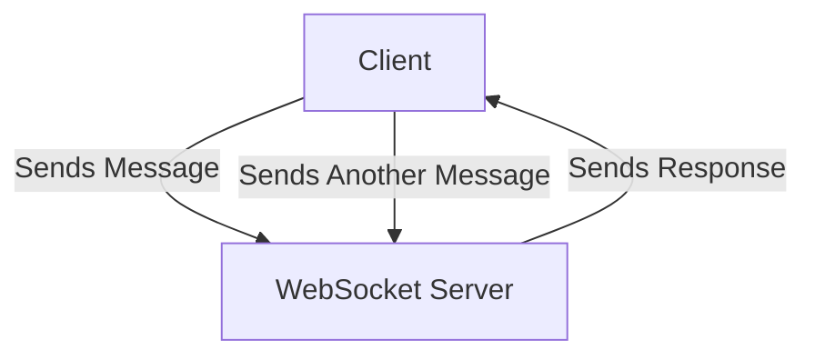
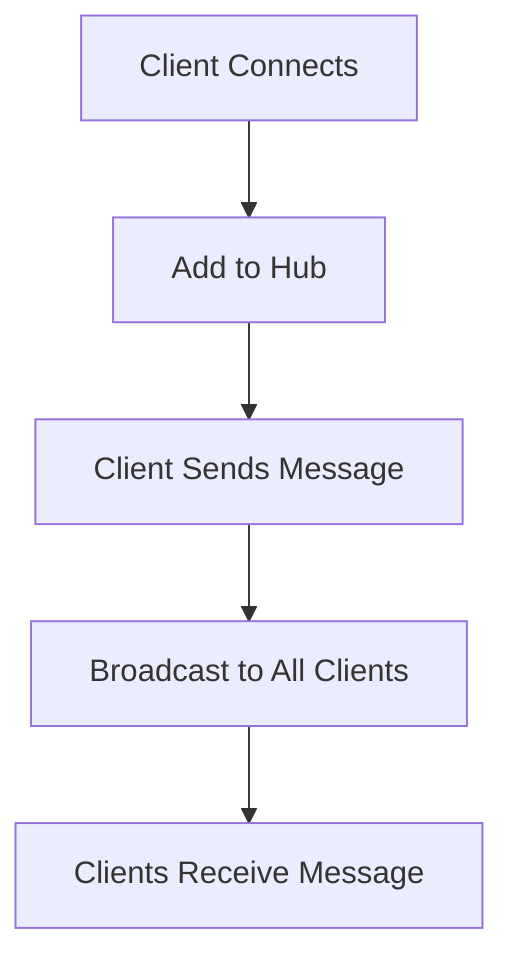
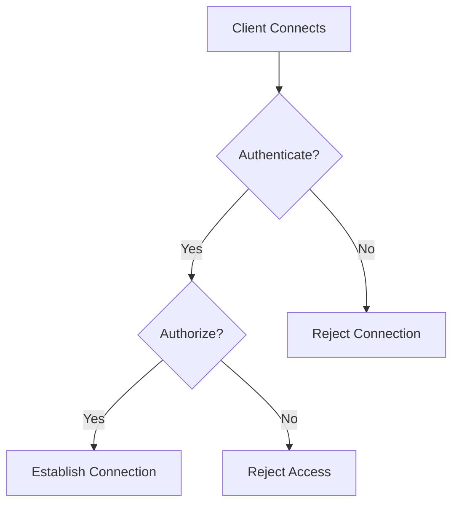

Error: API request failed with error: 401 Client Error: Unauthorized for url: https://openrouter.ai/api/v1/chat/completions

# <span style="color:#e67e22;">What we will learn in this post?</span>
<ul style='list-style-type: none; padding-left: 0;'>
<li><span style='color: #2980b9; font-size: 20px; font-weight: bold;'>👉</span> <span style='color: #2ecc71; font-size: 18px; font-weight: bold;'>Introduction to WebSockets</span></li>
<li><span style='color: #2980b9; font-size: 20px; font-weight: bold;'>👉</span> <span style='color: #2ecc71; font-size: 18px; font-weight: bold;'>WebSocket Server in Go</span></li>
<li><span style='color: #2980b9; font-size: 20px; font-weight: bold;'>👉</span> <span style='color: #2ecc71; font-size: 18px; font-weight: bold;'>WebSocket Client Implementation</span></li>
<li><span style='color: #2980b9; font-size: 20px; font-weight: bold;'>👉</span> <span style='color: #2ecc71; font-size: 18px; font-weight: bold;'>Broadcasting to Multiple Clients</span></li>
<li><span style='color: #2980b9; font-size: 20px; font-weight: bold;'>👉</span> <span style='color: #2ecc71; font-size: 18px; font-weight: bold;'>WebSocket Authentication and Security</span></li>
<li><span style='color: #2980b9; font-size: 20px; font-weight: bold;'>👉</span> <span style='color: #2ecc71; font-size: 18px; font-weight: bold;'>Real-time Chat Application</span></li>
</ul>

# <span style="color:#e67e22">Introduction to WebSocket Protocol</span> 🌐

WebSocket is a powerful technology that allows for **real-time communication** between a client (like your web browser) and a server. Unlike traditional HTTP, which is a one-way communication method, WebSocket enables **bidirectional** and **persistent connections**. This means that both the client and server can send messages to each other at any time, making it perfect for applications that require instant updates.

## <span style="color:#2980b9">How WebSocket Differs from HTTP</span> 🔄

- **Bidirectional Communication**: WebSocket allows both the client and server to send messages independently.
- **Persistent Connection**: Once established, the connection stays open, reducing the overhead of creating new connections for each message.

### <span style="color:#8e44ad">Use Cases for WebSocket</span> 🚀

- **Real-Time Chat**: Instant messaging applications benefit from quick message delivery.
- **Live Updates**: News feeds and stock tickers can push updates to users without refreshing.
- **Gaming**: Multiplayer games require fast, real-time interactions between players.

## <span style="color:#2980b9">When to Use WebSockets vs HTTP</span> ⚖️

- **Use WebSockets** when you need real-time communication and low latency.
- **Use HTTP** for standard requests where real-time updates are not necessary.

For more detailed information, check out these resources:
- [WebSocket Protocol Overview](https://developer.mozilla.org/en-US/docs/Web/API/WebSockets_API)
- [When to Use WebSockets](https://ably.com/concepts/websockets)



With WebSocket, you can create engaging and interactive applications that keep users connected and informed!

# <span style="color:#e67e22">Creating a WebSocket Server with Gorilla/WebSocket</span> 🌐

WebSockets allow real-time communication between a client and a server. Let’s build a simple WebSocket server using the **Gorilla WebSocket** library in Go!

## <span style="color:#2980b9">Step-by-Step Guide</span> 🛠️

### 1. **Set Up Your Go Environment** 🖥️

First, make sure you have Go installed. Then, install the Gorilla WebSocket package:

```bash
go get -u github.com/gorilla/websocket
```

### 2. **Create the WebSocket Server** 💻

Here’s a complete example of a WebSocket server:

```go
package main

import (
    "fmt"
    "net/http"
    "github.com/gorilla/websocket"
)

var upgrader = websocket.Upgrader{}

func handleConnection(w http.ResponseWriter, r *http.Request) {
    conn, err := upgrader.Upgrade(w, r, nil)
    if err != nil {
        fmt.Println("Error during connection upgrade:", err)
        return
    }
    defer conn.Close()

    for {
        messageType, msg, err := conn.ReadMessage()
        if err != nil {
            fmt.Println("Error reading message:", err)
            break
        }
        fmt.Printf("Received: %s\n", msg)

        err = conn.WriteMessage(messageType, msg)
        if err != nil {
            fmt.Println("Error writing message:", err)
            break
        }
    }
}

func main() {
    http.HandleFunc("/ws", handleConnection)
    fmt.Println("Server started at :8080")
    http.ListenAndServe(":8080", nil)
}
```

### 3. **Run Your Server** 🚀

- Save the code in a file named `main.go`.
- Run it using:

```bash
go run main.go
```

### 4. **Connect to Your WebSocket** 🌍

You can connect using a WebSocket client or a browser console. Just point it to `ws://localhost:8080/ws`.

## <span style="color:#8e44ad">Key Points to Remember</span> 📝

- **Upgrade HTTP**: The server upgrades the connection from HTTP to WebSocket.
- **Read/Write Messages**: It reads messages from the client and echoes them back.

For more details, check out the [Gorilla WebSocket documentation](https://pkg.go.dev/github.com/gorilla/websocket).

Happy coding! 🎉

# <span style="color:#e67e22">Implementing a WebSocket Client in Go</span> 🌐

WebSockets are great for real-time communication! Let’s dive into how to create a simple WebSocket client in Go.

## <span style="color:#2980b9">Setting Up Your WebSocket Client</span> 🚀

First, you need to install the `gorilla/websocket` package. You can do this by running:

```bash
go get -u github.com/gorilla/websocket
```

### <span style="color:#8e44ad">Basic Client Code</span> 💻

Here’s a simple example of a WebSocket client:

```go
package main

import (
    "log"
    "time"
    "github.com/gorilla/websocket"
)

func main() {
    url := "ws://example.com/socket"
    conn, _, err := websocket.DefaultDialer.Dial(url, nil)
    if err != nil {
        log.Fatal("Dial error:", err)
    }
    defer conn.Close()

    // Sending a message
    err = conn.WriteMessage(websocket.TextMessage, []byte("Hello, WebSocket!"))
    if err != nil {
        log.Println("Write error:", err)
    }

    // Receiving messages
    go func() {
        for {
            _, msg, err := conn.ReadMessage()
            if err != nil {
                log.Println("Read error:", err)
                return
            }
            log.Printf("Received: %s", msg)
        }
    }()

    // Keep the connection alive
    for {
        time.Sleep(1 * time.Second)
    }
}
```

## <span style="color:#2980b9">Handling Disconnections and Reconnects</span> 🔄

To handle disconnections, you can implement a simple reconnection logic:

```go
for {
    _, _, err := conn.ReadMessage()
    if err != nil {
        log.Println("Disconnected, reconnecting...")
        time.Sleep(2 * time.Second) // Wait before reconnecting
        conn, _, err = websocket.DefaultDialer.Dial(url, nil)
        if err != nil {
            log.Println("Reconnection failed:", err)
            continue
        }
    }
}
```

## <span style="color:#8e44ad">Error Handling</span> ⚠️

Always check for errors when sending or receiving messages. This helps you understand what went wrong and take action.

### Resources

- [Gorilla WebSocket Documentation](https://pkg.go.dev/github.com/gorilla/websocket)
- [WebSocket Protocol](https://developer.mozilla.org/en-US/docs/Web/API/WebSockets_API)

With this guide, you should be able to create a basic WebSocket client in Go! Happy coding! 🎉

# <span style="color:#e67e22">Broadcast System for WebSocket Clients</span> 🎉

Creating a broadcast system for WebSocket clients can be fun and useful! Let’s break it down step by step.

## <span style="color:#2980b9">Setting Up the Hub</span> 🛠️

We’ll use a **hub pattern** to manage our WebSocket connections. This allows us to easily register and deregister clients.

### <span style="color:#8e44ad">Code Example</span> 💻

Here’s a simple implementation in JavaScript using Node.js:

```javascript
const WebSocket = require('ws');

class WebSocketHub {
    constructor() {
        this.clients = new Set();
    }

    addClient(client) {
        this.clients.add(client);
        client.on('close', () => this.removeClient(client));
    }

    removeClient(client) {
        this.clients.delete(client);
    }

    broadcast(message) {
        this.clients.forEach(client => {
            if (client.readyState === WebSocket.OPEN) {
                client.send(message);
            }
        });
    }
}

const wss = new WebSocket.Server({ port: 8080 });
const hub = new WebSocketHub();

wss.on('connection', (client) => {
    hub.addClient(client);
    client.on('message', (message) => {
        hub.broadcast(message);
    });
});
```

### <span style="color:#8e44ad">How It Works</span> 🔍

- **Add Client**: When a client connects, we add them to our `clients` set.
- **Remove Client**: If a client disconnects, we remove them.
- **Broadcast**: When a message is received, we send it to all connected clients.

## <span style="color:#2980b9">Visual Flow</span> 📊



### <span style="color:#8e44ad">Learn More</span> 📚

For more details on WebSockets, check out [MDN WebSockets](https://developer.mozilla.org/en-US/docs/Web/API/WebSockets_API).

This setup allows you to easily manage multiple WebSocket clients and send messages to them all at once! Happy coding! 😊

# <span style="color:#e67e22">Securing WebSocket Connections</span> 🌐

WebSocket connections are great for real-time communication, but we need to keep them safe! Here’s how to secure them effectively.

## <span style="color:#2980b9">Authentication During Handshake 🔑</span>

When a client connects, we can use **tokens** or **cookies** to verify their identity. This is done during the handshake process:

- **Tokens**: Send a token in the WebSocket request header.
- **Cookies**: Use session cookies to authenticate users.

### <span style="color:#8e44ad">Example</span>

```javascript
const socket = new WebSocket('wss://example.com/socket?token=YOUR_TOKEN');
```

## <span style="color:#2980b9">Authorization 🚦</span>

Once authenticated, we need to check if the user has permission to access certain resources. This can be done on the server side by checking user roles or permissions.

## <span style="color:#2980b9">Validating Origins 🌍</span>

Always check the **origin** of the WebSocket connection. This helps prevent unauthorized access:

- Allow connections only from trusted domains.

### <span style="color:#8e44ad">Example</span>

```javascript
if (origin !== 'https://trusted-domain.com') {
    rejectConnection();
}
```

## <span style="color:#2980b9">Using WSS (WebSocket Secure) 🔒</span>

Always use **WSS** instead of **WS**. This encrypts the data being sent, making it much harder for attackers to intercept.

## <span style="color:#2980b9">Preventing Common Attacks ⚔️</span>

- **Cross-Site Scripting (XSS)**: Sanitize all inputs.
- **Denial of Service (DoS)**: Limit the number of connections per user.
- **Message Validation**: Always validate incoming messages.

### <span style="color:#8e44ad">Flowchart of WebSocket Security</span>



For more detailed information, check out these resources:
- [WebSocket Security Best Practices](https://developer.mozilla.org/en-US/docs/Web/API/WebSockets_API/WSS)
- [OWASP WebSocket Security](https://owasp.org/www-project-top-ten/)

By following these steps, you can help ensure your WebSocket connections are secure and reliable! 😊

# <span style="color:#e67e22">Building a Real-Time Chat Application with Go WebSockets</span>

Creating a chat app can be fun and educational! Let’s break it down into simple steps. 🚀

## <span style="color:#2980b9">Architectural Overview</span>

A chat application typically consists of:

- **WebSocket Server**: Handles real-time communication.
- **Frontend**: User interface for chatting.
- **Database**: Stores messages and user data.

### <span style="color:#8e44ad">Key Features</span>

1. **Message Routing**: Direct messages to the right users.
2. **User Presence**: Show who is online.
3. **Typing Indicators**: Let users know when someone is typing.
4. **Message Persistence**: Save messages in a database.

```go
// Example of a simple WebSocket handler in Go
func handleConnection(w http.ResponseWriter, r *http.Request) {
    conn, err := upgrader.Upgrade(w, r, nil)
    if err != nil {
        log.Fatal(err)
    }
    defer conn.Close()
    // Handle messages here
}
```

## <span style="color:#2980b9">Real-World Example</span>

### <span style="color:#8e44ad">Message Routing</span>

- Use a map to keep track of connected users.
- Route messages based on user IDs.

### <span style="color:#8e44ad">User Presence</span>

- Update user status when they connect/disconnect.
- Broadcast presence updates to all users.

### <span style="color:#8e44ad">Typing Indicators</span>

- Send a "typing" event when a user starts typing.
- Show this status to other users in the chat.

### <span style="color:#8e44ad">Message Persistence</span>

- Use a database like PostgreSQL to store messages.
- Retrieve messages when users join the chat.

```go
// Example of saving a message to the database
func saveMessage(userID, message string) {
    // Database logic here
}
```

## <span style="color:#2980b9">Resources</span>

- [Go WebSocket Documentation](https://pkg.go.dev/github.com/gorilla/websocket)
- [Building a Chat App with Go](https://www.digitalocean.com/community/tutorials/how-to-build-a-chat-application-with-go)

By following these steps, you can create a robust chat application! Happy coding! 🎉

