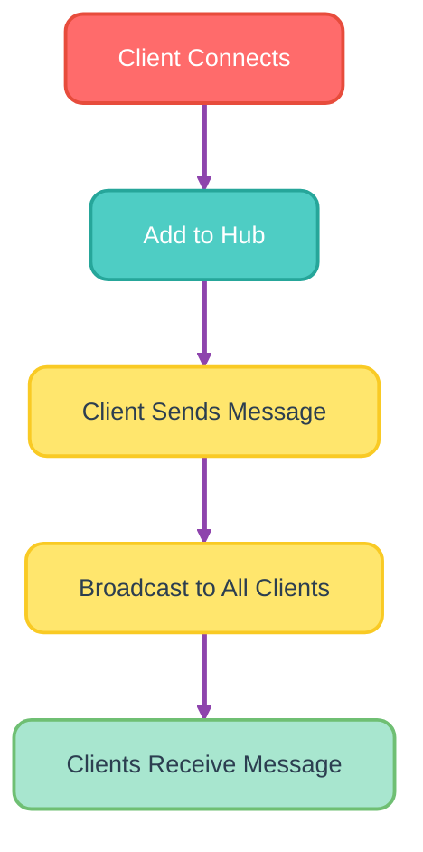
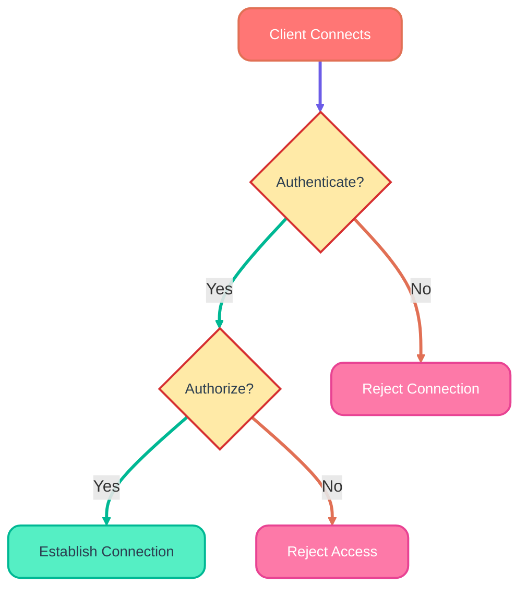

<!--
meta-description: "Complete guide to WebSocket programming in Go using Gorilla WebSocket library. Learn to build real-time chat applications, handle bidirectional communication, implement authentication, and create production-ready WebSocket servers with proper error handling and security measures."
keywords: "Go WebSockets, Gorilla WebSocket, real-time communication, bidirectional connections, WebSocket server Go, WebSocket client Go, chat application Go, WebSocket authentication, WebSocket security, concurrent connections"
-->

# <span style="color:#e67e22;">What we will learn in this post?</span>
<ul style='list-style-type: none; padding-left: 0;'>
<li><span style='color: #2980b9; font-size: 20px; font-weight: bold;'>👉</span> <span style='color: #2ecc71; font-size: 18px; font-weight: bold;'>Introduction to WebSockets</span></li>
<li><span style='color: #2980b9; font-size: 20px; font-weight: bold;'>👉</span> <span style='color: #2ecc71; font-size: 18px; font-weight: bold;'>WebSocket Server in Go</span></li>
<li><span style='color: #2980b9; font-size: 20px; font-weight: bold;'>👉</span> <span style='color: #2ecc71; font-size: 18px; font-weight: bold;'>WebSocket Client Implementation</span></li>
<li><span style='color: #2980b9; font-size: 20px; font-weight: bold;'>👉</span> <span style='color: #2ecc71; font-size: 18px; font-weight: bold;'>Broadcasting to Multiple Clients</span></li>
<li><span style='color: #2980b9; font-size: 20px; font-weight: bold;'>👉</span> <span style='color: #2ecc71; font-size: 18px; font-weight: bold;'>WebSocket Authentication and Security</span></li>
<li><span style='color: #2980b9; font-size: 20px; font-weight: bold;'>👉</span> <span style='color: #2ecc71; font-size: 18px; font-weight: bold;'>Real-time Chat Application</span></li>
</ul>

# <span style="color:#e67e22">Introduction to WebSocket Protocol</span> 🌐

WebSocket is a powerful technology that allows for **real-time communication** between a client (like your web browser) and a server. Unlike traditional HTTP, which is a one-way communication method, WebSocket enables **bidirectional** and **persistent connections**. This means that both the client and server can send messages to each other at any time, making it perfect for applications that require instant updates.

WebSockets are essential for modern real-time applications like live chat systems, collaborative editing tools, and financial trading platforms where instant data synchronization is critical.

## <span style="color:#2980b9">How WebSocket Differs from HTTP</span> 🔄

- **Bidirectional Communication**: WebSocket allows both the client and server to send messages independently.
- **Persistent Connection**: Once established, the connection stays open, reducing the overhead of creating new connections for each message.

### <span style="color:#8e44ad">Use Cases for WebSocket</span> 🚀

- **Real-Time Chat**: Instant messaging applications benefit from quick message delivery.
- **Live Updates**: News feeds and stock tickers can push updates to users without refreshing.
- **Gaming**: Multiplayer games require fast, real-time interactions between players.

## <span style="color:#2980b9">When to Use WebSockets vs HTTP</span> ⚖️

- **Use WebSockets** when you need real-time communication and low latency.
- **Use HTTP** for standard requests where real-time updates are not necessary.

```mermaid
graph LR
  A[🎯 Client] -->|📤 Sends Message| B[🔧 WebSocket Server]
  B -->|📥 Sends Response| A
  A -->|🔄 Sends Another Message| B

  classDef clientStyle fill:#ff4f81,stroke:#c43e3e,color:#fff,font-size:16px,stroke-width:3px,rx:14,shadow:6px;
  classDef serverStyle fill:#6b5bff,stroke:#4a3f6b,color:#fff,font-size:16px,stroke-width:3px,rx:14,shadow:6px;

  class A clientStyle;
  class B serverStyle;

  linkStyle default stroke:#e67e22,stroke-width:3px;
```



With WebSocket, you can create engaging and interactive applications that keep users connected and informed!

# <span style="color:#e67e22">Creating a WebSocket Server with Gorilla/WebSocket</span> 🌐

WebSockets allow real-time communication between a client and a server. Let’s build a simple WebSocket server using the **Gorilla WebSocket** library in Go!

## <span style="color:#2980b9">Step-by-Step Guide</span> 🛠️

### 1. **Set Up Your Go Environment** 🖥️

First, make sure you have Go installed. Then, install the Gorilla WebSocket package:

```bash
go get -u github.com/gorilla/websocket
```

### 2. **Create the WebSocket Server** 💻

Here’s a complete example of a WebSocket server:

```go
package main

import (
    "fmt"
    "net/http"
    "github.com/gorilla/websocket"
)

var upgrader = websocket.Upgrader{}

func handleConnection(w http.ResponseWriter, r *http.Request) {
    conn, err := upgrader.Upgrade(w, r, nil)
    if err != nil {
        fmt.Println("Error during connection upgrade:", err)
        return
    }
    defer conn.Close()

    for {
        messageType, msg, err := conn.ReadMessage()
        if err != nil {
            fmt.Println("Error reading message:", err)
            break
        }
        fmt.Printf("Received: %s\n", msg)

        err = conn.WriteMessage(messageType, msg)
        if err != nil {
            fmt.Println("Error writing message:", err)
            break
        }
    }
}

func main() {
    http.HandleFunc("/ws", handleConnection)
    fmt.Println("Server started at :8080")
    http.ListenAndServe(":8080", nil)
}
```

### <span style="color:#8e44ad">Production-Ready WebSocket Server Example</span> 🚀

Here's a more robust WebSocket server suitable for production use with proper connection management and error handling:

```go
package main

import (
    "fmt"
    "log"
    "net/http"
    "sync"
    "time"
    "github.com/gorilla/websocket"
)

type Client struct {
    ID   string
    Conn *websocket.Conn
    Send chan []byte
}

type Hub struct {
    clients    map[*Client]bool
    broadcast  chan []byte
    register   chan *Client
    unregister chan *Client
    mutex      sync.RWMutex
}

var upgrader = websocket.Upgrader{
    CheckOrigin: func(r *http.Request) bool {
        // Allow connections from any origin in development
        // In production, validate against allowed origins
        return true
    },
}

func newHub() *Hub {
    return &Hub{
        clients:    make(map[*Client]bool),
        broadcast:  make(chan []byte),
        register:   make(chan *Client),
        unregister: make(chan *Client),
    }
}

func (h *Hub) run() {
    for {
        select {
        case client := <-h.register:
            h.mutex.Lock()
            h.clients[client] = true
            h.mutex.Unlock()
            log.Printf("Client %s connected. Total clients: %d", client.ID, len(h.clients))

        case client := <-h.unregister:
            h.mutex.Lock()
            if _, ok := h.clients[client]; ok {
                delete(h.clients, client)
                close(client.Send)
            }
            h.mutex.Unlock()
            log.Printf("Client %s disconnected. Total clients: %d", client.ID, len(h.clients))

        case message := <-h.broadcast:
            h.mutex.RLock()
            for client := range h.clients {
                select {
                case client.Send <- message:
                default:
                    close(client.Send)
                    delete(h.clients, client)
                }
            }
            h.mutex.RUnlock()
        }
    }
}

func (c *Client) writePump() {
    ticker := time.NewTicker(54 * time.Second)
    defer func() {
        ticker.Stop()
        c.Conn.Close()
    }()

    for {
        select {
        case message, ok := <-c.Send:
            if !ok {
                c.Conn.WriteMessage(websocket.CloseMessage, []byte{})
                return
            }

            if err := c.Conn.WriteMessage(websocket.TextMessage, message); err != nil {
                return
            }

        case <-ticker.C:
            if err := c.Conn.WriteMessage(websocket.PingMessage, nil); err != nil {
                return
            }
        }
    }
}

func serveWs(hub *Hub, w http.ResponseWriter, r *http.Request) {
    conn, err := upgrader.Upgrade(w, r, nil)
    if err != nil {
        log.Println("WebSocket upgrade failed:", err)
        return
    }

    client := &Client{
        ID:   fmt.Sprintf("%p", conn),
        Conn: conn,
        Send: make(chan []byte, 256),
    }

    hub.register <- client

    go client.writePump()

    // Read messages from client
    for {
        _, message, err := conn.ReadMessage()
        if err != nil {
            if websocket.IsUnexpectedCloseError(err, websocket.CloseGoingAway, websocket.CloseAbnormalClosure) {
                log.Printf("WebSocket error: %v", err)
            }
            break
        }

        // Echo the message back (you can modify this logic)
        hub.broadcast <- message
    }

    hub.unregister <- client
}

func main() {
    hub := newHub()
    go hub.run()

    http.HandleFunc("/ws", func(w http.ResponseWriter, r *http.Request) {
        serveWs(hub, w, r)
    })

    http.HandleFunc("/", func(w http.ResponseWriter, r *http.Request) {
        fmt.Fprintf(w, "WebSocket Chat Server - Connect to /ws")
    })

    log.Println("WebSocket server starting on :8080")
    log.Fatal(http.ListenAndServe(":8080", nil))
}
```

This production-ready server includes connection pooling, proper cleanup, ping/pong handling, and concurrent client management - perfect for real-time chat applications.

### <span style="color:#8e44ad">WebSocket Client Example</span> 📡

Here's a simple WebSocket client that connects to our server and handles messages:

```go
package main

import (
    "bufio"
    "fmt"
    "log"
    "os"
    "os/signal"
    "github.com/gorilla/websocket"
)

func main() {
    // Connect to WebSocket server
    conn, _, err := websocket.DefaultDialer.Dial("ws://localhost:8080/ws", nil)
    if err != nil {
        log.Fatal("Failed to connect to WebSocket server:", err)
    }
    defer conn.Close()

    // Handle incoming messages in a goroutine
    go func() {
        for {
            _, message, err := conn.ReadMessage()
            if err != nil {
                log.Println("Read error:", err)
                return
            }
            fmt.Printf("Received: %s\n", message)
        }
    }()

    // Send messages from stdin
    scanner := bufio.NewScanner(os.Stdin)
    fmt.Println("Connected to WebSocket server. Type messages to send:")

    // Handle interrupt signal for clean shutdown
    interrupt := make(chan os.Signal, 1)
    signal.Notify(interrupt, os.Interrupt)

    for {
        select {
        case <-interrupt:
            log.Println("Shutting down client...")
            err := conn.WriteMessage(websocket.CloseMessage, websocket.FormatCloseMessage(websocket.CloseNormalClosure, ""))
            if err != nil {
                log.Println("Write close error:", err)
            }
            return

        default:
            if scanner.Scan() {
                message := scanner.Text()
                err := conn.WriteMessage(websocket.TextMessage, []byte(message))
                if err != nil {
                    log.Println("Write error:", err)
                    return
                }
            }
        }
    }
}
```

This client connects to the server, reads messages from stdin, and displays received messages - perfect for testing your WebSocket implementation.

### 3. **Run Your Server** 🚀

- Save the code in a file named `main.go`.
- Run it using:

```bash
go run main.go
```

### 4. **Connect to Your WebSocket** 🌍

You can connect using a WebSocket client or a browser console. Just point it to `ws://localhost:8080/ws`.

## <span style="color:#8e44ad">Key Points to Remember</span> 📝

- **Upgrade HTTP**: The server upgrades the connection from HTTP to WebSocket.
- **Read/Write Messages**: It reads messages from the client and echoes them back.

# <span style="color:#e67e22">Implementing a WebSocket Client in Go</span> 🌐

WebSockets are great for real-time communication! Let’s dive into how to create a simple WebSocket client in Go.

## <span style="color:#2980b9">Setting Up Your WebSocket Client</span> 🚀

First, you need to install the `gorilla/websocket` package. You can do this by running:

```bash
go get -u github.com/gorilla/websocket
```

### <span style="color:#8e44ad">Basic Client Code</span> 💻

Here’s a simple example of a WebSocket client:

```go
package main

import (
    "log"
    "time"
    "github.com/gorilla/websocket"
)

func main() {
    url := "ws://example.com/socket"
    conn, _, err := websocket.DefaultDialer.Dial(url, nil)
    if err != nil {
        log.Fatal("Dial error:", err)
    }
    defer conn.Close()

    // Sending a message
    err = conn.WriteMessage(websocket.TextMessage, []byte("Hello, WebSocket!"))
    if err != nil {
        log.Println("Write error:", err)
    }

    // Receiving messages
    go func() {
        for {
            _, msg, err := conn.ReadMessage()
            if err != nil {
                log.Println("Read error:", err)
                return
            }
            log.Printf("Received: %s", msg)
        }
    }()

    // Keep the connection alive
    for {
        time.Sleep(1 * time.Second)
    }
}
```

## <span style="color:#2980b9">Handling Disconnections and Reconnects</span> 🔄

To handle disconnections, you can implement a simple reconnection logic:

```go
for {
    _, _, err := conn.ReadMessage()
    if err != nil {
        log.Println("Disconnected, reconnecting...")
        time.Sleep(2 * time.Second) // Wait before reconnecting
        conn, _, err = websocket.DefaultDialer.Dial(url, nil)
        if err != nil {
            log.Println("Reconnection failed:", err)
            continue
        }
    }
}
```

## <span style="color:#8e44ad">Error Handling</span> ⚠️

Always check for errors when sending or receiving messages. This helps you understand what went wrong and take action.

With this guide, you should be able to create a basic WebSocket client in Go! Happy coding! 🎉

# <span style="color:#e67e22">Broadcast System for WebSocket Clients</span> 🎉

Creating a broadcast system for WebSocket clients can be fun and useful! Let’s break it down step by step.

## <span style="color:#2980b9">Setting Up the Hub</span> 🛠️

We’ll use a **hub pattern** to manage our WebSocket connections. This allows us to easily register and deregister clients.

### <span style="color:#8e44ad">Code Example</span> 💻

Here’s a simple implementation in JavaScript using Node.js:

```javascript
const WebSocket = require('ws');

class WebSocketHub {
    constructor() {
        this.clients = new Set();
    }

    addClient(client) {
        this.clients.add(client);
        client.on('close', () => this.removeClient(client));
    }

    removeClient(client) {
        this.clients.delete(client);
    }

    broadcast(message) {
        this.clients.forEach(client => {
            if (client.readyState === WebSocket.OPEN) {
                client.send(message);
            }
        });
    }
}

const wss = new WebSocket.Server({ port: 8080 });
const hub = new WebSocketHub();

wss.on('connection', (client) => {
    hub.addClient(client);
    client.on('message', (message) => {
        hub.broadcast(message);
    });
});
```

### <span style="color:#8e44ad">How It Works</span> 🔍

- **Add Client**: When a client connects, we add them to our `clients` set.
- **Remove Client**: If a client disconnects, we remove them.
- **Broadcast**: When a message is received, we send it to all connected clients.

## <span style="color:#2980b9">Visual Flow</span> 📊



This setup allows you to easily manage multiple WebSocket clients and send messages to them all at once! Happy coding! 😊

# <span style="color:#e67e22">Securing WebSocket Connections</span> 🌐

WebSocket connections are great for real-time communication, but we need to keep them safe! Here’s how to secure them effectively.

## <span style="color:#2980b9">Authentication During Handshake 🔑</span>

When a client connects, we can use **tokens** or **cookies** to verify their identity. This is done during the handshake process:

- **Tokens**: Send a token in the WebSocket request header.
- **Cookies**: Use session cookies to authenticate users.

### <span style="color:#8e44ad">Example</span>

```javascript
const socket = new WebSocket('wss://example.com/socket?token=YOUR_TOKEN');
```

## <span style="color:#2980b9">Authorization 🚦</span>

Once authenticated, we need to check if the user has permission to access certain resources. This can be done on the server side by checking user roles or permissions.

## <span style="color:#2980b9">Validating Origins 🌍</span>

Always check the **origin** of the WebSocket connection. This helps prevent unauthorized access:

- Allow connections only from trusted domains.

### <span style="color:#8e44ad">Example</span>

```javascript
if (origin !== 'https://trusted-domain.com') {
    rejectConnection();
}
```

## <span style="color:#2980b9">Using WSS (WebSocket Secure) 🔒</span>

Always use **WSS** instead of **WS**. This encrypts the data being sent, making it much harder for attackers to intercept.

## <span style="color:#2980b9">Preventing Common Attacks ⚔️</span>

- **Cross-Site Scripting (XSS)**: Sanitize all inputs.
- **Denial of Service (DoS)**: Limit the number of connections per user.
- **Message Validation**: Always validate incoming messages.

### <span style="color:#8e44ad">Flowchart of WebSocket Security</span>



By following these steps, you can help ensure your WebSocket connections are secure and reliable! 😊

# <span style="color:#e67e22">Building a Real-Time Chat Application with Go WebSockets</span>

Creating a chat app can be fun and educational! Let’s break it down into simple steps. 🚀

## <span style="color:#2980b9">Architectural Overview</span>

A chat application typically consists of:

- **WebSocket Server**: Handles real-time communication.
- **Frontend**: User interface for chatting.
- **Database**: Stores messages and user data.

### <span style="color:#8e44ad">Key Features</span>

1. **Message Routing**: Direct messages to the right users.
2. **User Presence**: Show who is online.
3. **Typing Indicators**: Let users know when someone is typing.
4. **Message Persistence**: Save messages in a database.

```go
// Example of a simple WebSocket handler in Go
func handleConnection(w http.ResponseWriter, r *http.Request) {
    conn, err := upgrader.Upgrade(w, r, nil)
    if err != nil {
        log.Fatal(err)
    }
    defer conn.Close()
    // Handle messages here
}
```

## <span style="color:#2980b9">Real-World Example</span>

### <span style="color:#8e44ad">Message Routing</span>

- Use a map to keep track of connected users.
- Route messages based on user IDs.

### <span style="color:#8e44ad">User Presence</span>

- Update user status when they connect/disconnect.
- Broadcast presence updates to all users.

### <span style="color:#8e44ad">Typing Indicators</span>

- Send a "typing" event when a user starts typing.
- Show this status to other users in the chat.

### <span style="color:#8e44ad">Message Persistence</span>

- Use a database like PostgreSQL to store messages.
- Retrieve messages when users join the chat.

```go
// Example of saving a message to the database
func saveMessage(userID, message string) {
    // Database logic here
}
```

## <span style="color:#ff1a5a">🎯 Hands-On Assignment: Build a Real-Time Chat Application</span>

**Objective:** Create a complete real-time chat application using WebSockets with user authentication and message history.

**Requirements:**
1. **User Management:** Implement user registration/login with unique usernames
2. **Message Broadcasting:** Send messages to all connected users except the sender
3. **Message History:** Store last 50 messages in memory and send them to new users
4. **Connection Status:** Show when users join/leave the chat
5. **Error Handling:** Gracefully handle network disconnections and reconnections

**Implementation Steps:**
1. Create a `User` struct with ID, username, and connection info
2. Modify the hub to track users instead of just connections
3. Add message persistence with a circular buffer for history
4. Implement user join/leave notifications
5. Add input validation for usernames and messages

**Bonus Features:**
- Private messaging between users
- Message timestamps
- Online user list
- Message encryption for secure communication

**Expected Output:**
```
User 'alice' joined the chat
User 'bob' joined the chat
alice: Hello everyone!
bob: Hi alice! Welcome to the chat.
User 'charlie' joined the chat
charlie: Hey folks!
```

**Time Estimate:** 2-3 hours

**Difficulty:** Intermediate 🚀

**Skills Covered:** WebSocket programming, concurrent data structures, user management, real-time communication

## <span style="color:#27ae60">Conclusion</span> 🎉

WebSockets provide powerful bidirectional communication capabilities in Go applications, enabling real-time features like chat systems and live updates. By mastering WebSocket implementation with proper error handling and connection management, you can build robust real-time applications that scale efficiently.

