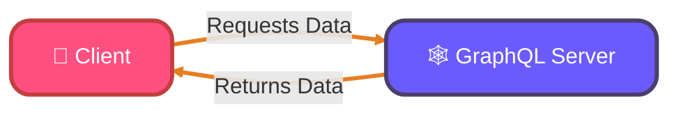
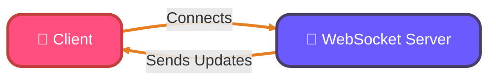

<!--
meta-description: "Comprehensive guide to building GraphQL APIs with Go using gqlgen, covering schema design, queries, mutations, subscriptions, DataLoaders for N+1 problem, and authentication/authorization patterns."
keywords: "GraphQL Go, gqlgen, GraphQL API, Go backend, GraphQL subscriptions, DataLoaders, N+1 problem, GraphQL authentication, GraphQL schema, GraphQL resolvers"
-->

# <span style="color:#e67e22;">What we will learn in this post?</span>
<ul style='list-style-type: none; padding-left: 0;'>
<li><span style='color: #2980b9; font-size: 20px; font-weight: bold;'>👉</span> <span style='color: #2ecc71; font-size: 18px; font-weight: bold;'>Introduction to GraphQL</span></li>
<li><span style='color: #2980b9; font-size: 20px; font-weight: bold;'>👉</span> <span style='color: #2ecc71; font-size: 18px; font-weight: bold;'>Setting Up GraphQL Server</span></li>
<li><span style='color: #2980b9; font-size: 20px; font-weight: bold;'>👉</span> <span style='color: #2ecc71; font-size: 18px; font-weight: bold;'>Queries and Mutations</span></li>
<li><span style='color: #2980b9; font-size: 20px; font-weight: bold;'>👉</span> <span style='color: #2ecc71; font-size: 18px; font-weight: bold;'>GraphQL Subscriptions</span></li>
<li><span style='color: #2980b9; font-size: 20px; font-weight: bold;'>👉</span> <span style='color: #2ecc71; font-size: 18px; font-weight: bold;'>DataLoaders and N+1 Problem</span></li>
<li><span style='color: #2980b9; font-size: 20px; font-weight: bold;'>👉</span> <span style='color: #2ecc71; font-size: 18px; font-weight: bold;'>Authentication and Authorization</span></li>
</ul>

# <span style="color:#e67e22">Introduction to GraphQL</span> 🌐

GraphQL is a modern alternative to REST for building APIs. It allows clients to request exactly the data they need, making it a flexible and efficient choice for developers. 

## <span style="color:#2980b9">Benefits of GraphQL</span> 🚀

- **Flexible Queries**: Clients can specify exactly what data they want, reducing unnecessary data transfer.
- **Single Endpoint**: Unlike REST, which has multiple endpoints, GraphQL uses a single endpoint for all requests.
- **Strong Typing**: GraphQL schemas define the types of data, ensuring that clients know what to expect.
- **No Over/Under-fetching**: Clients get precisely the data they need, avoiding the common issues of REST APIs.

### <span style="color:#8e44ad">When to Choose GraphQL</span> 🤔

- When you need to aggregate data from multiple sources.
- If your application requires real-time updates.
- When you want to minimize data transfer for mobile apps.

### <span style="color:#8e44ad">Schema-First Approach</span> 📜

In GraphQL, you start by defining a schema that describes your data and its relationships. This schema acts as a contract between the client and server, ensuring clarity and consistency.



Embrace GraphQL for a more efficient and powerful API experience! 🌟

# <span style="color:#e67e22">Creating a GraphQL Server in Go with gqlgen</span> 🚀

Setting up a GraphQL server in Go is straightforward with gqlgen, a powerful code generation tool that creates type-safe resolvers. This approach ensures your API is both performant and maintainable in production environments.

## <span style="color:#2980b9">Setup Steps</span>

1. **Install Go**: Make sure you have Go installed. You can download it from [golang.org](https://golang.org/dl/).
2. **Create a new directory**: 
   ```bash
   mkdir gqlgen-example
   cd gqlgen-example
   ```
3. **Initialize a Go module**:
   ```bash
   go mod init gqlgen-example
   ```
4. **Install gqlgen**:
   ```bash
   go get github.com/99designs/gqlgen
   ```

## <span style="color:#2980b9">Define Your Schema</span> 📜

Create a file named `schema.graphqls`:

```graphql
type Query {
  hello: String!
}
```

## <span style="color:#2980b9">Generate Resolvers</span> ⚙️

Run the following command to generate the necessary files:

```bash
go run github.com/99designs/gqlgen init
```

This creates a `resolver.go` file where you can define your resolver functions.

### <span style="color:#8e44ad">Implement the Resolver</span>

Edit `resolver.go`:

```go
package graph

import "context"

type Resolver struct{}

func (r *queryResolver) Hello(ctx context.Context) (string, error) {
    return "Hello, World!", nil
}
```

## <span style="color:#2980b9">Set Up the HTTP Handler</span> 🌐

In your `main.go`, set up the server:

```go
package main

import (
    "log"
    "net/http"

    "github.com/99designs/gqlgen/graphql/handler"
    "github.com/99designs/gqlgen/graphql/playground"
    "gqlgen-example/graph"
)

func main() {
    srv := handler.NewDefaultServer(graph.NewExecutableSchema(graph.Config{Resolvers: &graph.Resolver{}}))

    http.Handle("/", playground.Handler("GraphQL playground", "/query"))
    http.Handle("/query", srv)

    log.Println("Server is running on :8080")
    log.Fatal(http.ListenAndServe(":8080", nil))
}
```

## <span style="color:#2980b9">Run Your Server</span> 🏃‍♂️

Finally, run your server:

```bash
go run main.go
```

Visit `http://localhost:8080` to see your GraphQL playground! 🎉

For more details, check out the [gqlgen documentation](https://gqlgen.com/getting-started/).

# <span style="color:#e67e22">Implementing GraphQL Queries and Mutations</span> 🌐

Mastering queries and mutations is essential for building interactive GraphQL APIs that handle both data retrieval and updates efficiently. These operations form the core of any GraphQL implementation and are crucial for production applications.

GraphQL is a powerful tool for fetching and modifying data. Let’s break down how to implement **queries** and **mutations** in a friendly way!

## <span style="color:#2980b9">What are Queries and Mutations?</span> 🤔

- **Queries** are used to **fetch data**.
- **Mutations** are used to **modify data**.

### <span style="color:#8e44ad">Creating a Simple GraphQL Server</span> 🚀

Here’s a basic example using Node.js and Apollo Server:

```javascript
const { ApolloServer, gql } = require('apollo-server');

// Define your type definitions
const typeDefs = gql`
  type Query {
    hello: String
  }
  type Mutation {
    setGreeting(greeting: String): String
  }
`;

// Resolver functions
const resolvers = {
  Query: {
    hello: () => 'Hello, World!',
  },
  Mutation: {
    setGreeting: (_, { greeting }) => greeting,
  },
};

// Create the server
const server = new ApolloServer({ typeDefs, resolvers });

// Start the server
server.listen().then(({ url }) => {
  console.log(`🚀 Server ready at ${url}`);
});
```

### <span style="color:#8e44ad">Using Context and Handling Arguments</span> 🛠️

You can pass context to your resolvers for shared data:

```javascript
const server = new ApolloServer({
  typeDefs,
  resolvers,
  context: ({ req }) => {
    return { user: req.user }; // Example context
  },
});
```
---

By using GraphQL, you can efficiently manage your data fetching and modifications. Happy coding! 🎉

# <span style="color:#e67e22">Introduction to GraphQL Subscriptions for Real-Time Updates</span>

GraphQL subscriptions are a powerful feature that allows your applications to receive real-time updates. Imagine being able to see changes in your app instantly, like new messages in a chat or live sports scores! ⚡

## <span style="color:#2980b9">What are GraphQL Subscriptions?</span>

Subscriptions enable clients to listen for specific events and receive updates when those events occur. This is done using **WebSockets**, which provide a full-duplex communication channel over a single TCP connection.

### <span style="color:#8e44ad">Implementing Subscriptions in Go</span>

To implement subscriptions in Go, you can use libraries like `graphql-go` and `gorilla/websocket`. Here’s a simple example:

```go
// Subscription resolver
func (r *Resolver) SubscribeToMessages(ctx context.Context) (<-chan *Message, error) {
    ch := make(chan *Message)
    // Logic to send messages to the channel
    return ch, nil
}
```

### <span style="color:#8e44ad">Managing Subscription Lifecycle</span>

- **Start**: Open a WebSocket connection.
- **Listen**: Wait for events.
- **Stop**: Close the connection when done.

### <span style="color:#2980b9">Use Cases</span>

- **Chat Applications**: Real-time message updates.
- **Live Sports**: Instant score updates.
- **Stock Prices**: Track changes in real-time.




With GraphQL subscriptions, you can create dynamic and engaging applications that keep users informed and connected! 🌟

# <span style="color:#e67e22">Understanding the N+1 Query Problem in GraphQL</span>

The N+1 query problem is a critical performance issue that can severely impact GraphQL API scalability in production environments. Understanding and solving this problem is essential for building efficient GraphQL services that can handle real-world traffic loads.

The **N+1 query problem** is a common issue in GraphQL where fetching related data leads to multiple database queries. Imagine you have a list of users, and for each user, you want to fetch their posts. If you fetch users first and then their posts one by one, you end up with **N + 1 queries** (1 for users + N for posts). This can slow down your application significantly! 😱

## <span style="color:#2980b9">Using DataLoaders for Batching and Caching</span>

To solve this, we can use **DataLoaders**. They help batch and cache requests, reducing the number of queries to just one for all posts. Here’s how it works:

1. **Batching**: Instead of fetching posts one by one, DataLoader collects all requests and fetches them in a single query.
2. **Caching**: If the same user’s posts are requested again, DataLoader serves them from cache instead of hitting the database.

### <span style="color:#8e44ad">Implementing DataLoaders in Go</span>

In Go, you can use the `dataloaden` library to implement DataLoaders easily. Here’s a simple example:

```go
package main

import (
    "github.com/graph-gophers/dataloader"
)

func main() {
    // Create a new DataLoader
    batchFn := func(keys []string) []*dataloader.Result {
        // Fetch data from the database
        return fetchPosts(keys)
    }
    loader := dataloader.NewBatchedLoader(batchFn)

    // Load posts for a user
    posts, err := loader.Load("userID")
}
```

### <span style="color:#8e44ad">Optimizing Database Queries</span>

- **Use Joins**: Instead of multiple queries, use SQL joins to fetch related data in one go.
- **Indexes**: Ensure your database tables are indexed for faster lookups.

By using DataLoaders, you can make your GraphQL API faster and more efficient! 🚀

# <span style="color:#e67e22">Implementing Authentication & Authorization in GraphQL</span>

## <span style="color:#2980b9">Authentication with JWT Tokens</span>

To secure your GraphQL API, you can use **JWT (JSON Web Tokens)** for authentication. Here’s how:

1. **User Login**: When a user logs in, generate a JWT token.
2. **Token Storage**: Store the token in local storage or cookies.
3. **Token Verification**: On each request, verify the token in your middleware.

```javascript
const jwt = require('jsonwebtoken');

const token = jwt.sign({ userId: user.id }, 'your_secret_key');
```

## <span style="color:#2980b9">Session-Based Authentication</span>

Alternatively, you can use session-based authentication:

- **Create a Session**: Store user info in a session on the server.
- **Session ID**: Send a session ID to the client, which is used for subsequent requests.

### <span style="color:#8e44ad">Authorization at Schema Level</span>

Use **directives** to enforce permissions:

- **@auth** directive can restrict access to certain fields based on user roles.

```graphql
type Query {
  secretData: String @auth(requires: ADMIN)
}
```

### <span style="color:#8e44ad">Field-Level Permissions</span>

Implement field-level permissions in your resolvers:

```javascript
const resolvers = {
  Query: {
    secretData: (parent, args, context) => {
      if (!context.user || context.user.role !== 'ADMIN') {
        throw new Error('Not authorized');
      }
      return "This is secret data!";
    },
  },
};
```

## <span style="color:#2980b9">Securing GraphQL Endpoints</span>

- **Use HTTPS**: Always serve your API over HTTPS.
- **Rate Limiting**: Implement rate limiting to prevent abuse.
- **Input Validation**: Validate inputs to avoid injection attacks.

```mermaid
graph LR
  A["🔐 User Login"]:::style1 --> B["🎫 Generate JWT"]:::style2
  B --> C["💾 Store Token"]:::style3
  C --> D["📤 Send Requests"]:::style4
  D --> E["✅ Verify Token"]:::style5

  classDef style1 fill:#ff4f81,stroke:#c43e3e,color:#fff,font-size:16px,stroke-width:3px,rx:14,shadow:6px;
  classDef style2 fill:#6b5bff,stroke:#4a3f6b,color:#fff,font-size:16px,stroke-width:3px,rx:14,shadow:6px;
  classDef style3 fill:#ffd700,stroke:#d99120,color:#222,font-size:16px,stroke-width:3px,rx:14,shadow:6px;
  classDef style4 fill:#00bfae,stroke:#005f99,color:#fff,font-size:16px,stroke-width:3px,rx:14,shadow:6px;
  classDef style5 fill:#ff9800,stroke:#f57c00,color:#fff,font-size:16px,stroke-width:3px,rx:14,shadow:6px;

  linkStyle default stroke:#e67e22,stroke-width:3px;
```



<details style='border: 2px solid #6b5bff; border-radius: 8px; padding: 20px; background: linear-gradient(135deg, #ede9ff 0%, #fff 100%); margin: 25px 0; box-shadow: 0 6px 12px rgba(107, 91, 255, 0.15);'>
<summary style='cursor: pointer; font-size: 1.3em; font-weight: bold; color: #6b5bff; padding: 10px 0;'>
🎯 Hands-On Assignment: Build a Complete GraphQL API with Go 🚀
</summary>

<div style='margin-top: 20px; color: #2c3e50; line-height: 1.6;'>

<h3 style='color: #6b5bff; border-bottom: 2px solid #6b5bff; padding-bottom: 8px; margin-top: 20px;'>📝 Your Mission</h3>

Create a production-ready GraphQL API for a blog platform using Go and gqlgen. Implement a complete system with user management, posts, comments, and real-time subscriptions. This project will demonstrate all the GraphQL concepts covered in this tutorial.

<h3 style='color: #6b5bff; border-bottom: 2px solid #6b5bff; padding-bottom: 8px; margin-top: 20px;'>🎯 Requirements</h3>

<ol style='margin-left: 20px;'>
<li><strong>Schema Design:</strong> Define a comprehensive GraphQL schema with User, Post, Comment types and appropriate relationships.</li>
<li><strong>Queries & Mutations:</strong> Implement CRUD operations for users, posts, and comments with proper input validation.</li>
<li><strong>Authentication:</strong> Add JWT-based authentication with role-based authorization (ADMIN, USER roles).</li>
<li><strong>Subscriptions:</strong> Implement real-time subscriptions for new posts and comments using WebSockets.</li>
<li><strong>DataLoaders:</strong> Solve the N+1 problem by implementing DataLoaders for efficient data fetching.</li>
<li><strong>Database Integration:</strong> Use a database (PostgreSQL/SQLite) with proper migrations and connection pooling.</li>
<li><strong>Error Handling:</strong> Implement comprehensive error handling with custom GraphQL errors.</li>
</ol>

<h3 style='color: #6b5bff; border-bottom: 2px solid #6b5bff; padding-bottom: 8px; margin-top: 25px;'>💡 Implementation Hints</h3>

<ol style='margin-left: 20px;'>
<li>Use gqlgen for code generation and type safety</li>
<li>Implement context-based authentication middleware</li>
<li>Use dataloaden for generating DataLoader boilerplate</li>
<li>Structure your project with clean architecture (handlers, services, repositories)</li>
<li>Add database indexes for optimal query performance</li>
<li>Use goroutines for concurrent data loading where appropriate</li>
</ol>

<h3 style='color: #6b5bff; border-bottom: 2px solid #6b5bff; padding-bottom: 8px; margin-top: 25px;'>🚀 Example Schema</h3>

<pre style='background: #2c3e50; color: #ecf0f1; padding: 20px; border-radius: 8px; overflow-x: auto; margin: 15px 0;'><code class='language-graphql'>type User {
  id: ID!
  username: String!
  email: String!
  role: Role!
  posts: [Post!]!
  createdAt: Time!
}

type Post {
  id: ID!
  title: String!
  content: String!
  author: User!
  comments: [Comment!]!
  createdAt: Time!
  updatedAt: Time!
}

type Comment {
  id: ID!
  content: String!
  author: User!
  post: Post!
  createdAt: Time!
}

enum Role {
  ADMIN
  USER
}

type Query {
  posts(limit: Int, offset: Int): [Post!]!
  post(id: ID!): Post
  users: [User!]!
  me: User!
}

type Mutation {
  createPost(input: CreatePostInput!): Post!
  updatePost(id: ID!, input: UpdatePostInput!): Post!
  deletePost(id: ID!): Boolean!
  createComment(postId: ID!, content: String!): Comment!
}

type Subscription {
  postCreated: Post!
  commentAdded(postId: ID!): Comment!
}
</code></pre>

<h3 style='color: #6b5bff; border-bottom: 2px solid #6b5bff; padding-bottom: 8px; margin-top: 25px;'>🏆 Bonus Challenges</h3>

<ul style='margin-left: 20px;'>
<li><strong>Rate Limiting:</strong> Implement request rate limiting to prevent abuse</li>
<li><strong>Caching:</strong> Add Redis caching for frequently accessed data</li>
<li><strong>File Uploads:</strong> Support image uploads for posts with GraphQL multipart requests</li>
<li><strong>Testing:</strong> Write comprehensive unit and integration tests</li>
<li><strong>Monitoring:</strong> Add metrics and logging with structured logging</li>
</ul>

<h3 style='color: #6b5bff; border-bottom: 2px solid #6b5bff; padding-bottom: 8px; margin-top: 25px;'>📚 Learning Goals</h3>

<ul style='margin-left: 20px;'>
<li>Master GraphQL schema design and type definitions 🎯</li>
<li>Implement production-ready resolvers with proper error handling ✨</li>
<li>Build secure APIs with authentication and authorization 🔐</li>
<li>Optimize performance with DataLoaders and caching 🚀</li>
<li>Create real-time applications with GraphQL subscriptions 📡</li>
<li>Structure scalable Go applications with clean architecture 🏗️</li>
</ul>

<p style='background: #3498db; color: #fff; padding: 15px; border-radius: 8px; margin-top: 20px; border-left: 5px solid #2980b9;'>
<strong>💡 Pro Tip:</strong> This assignment mirrors real-world GraphQL API development at companies like GitHub, Shopify, and Facebook. The skills you learn here are directly applicable to professional development!
</p>

<p style='margin-top: 20px; font-size: 1.1em;'><strong>Share Your Solution! 💬</strong></p>
<p>Completed the GraphQL API? <strong>Post your repository link in the comments below!</strong> Let's see your Go GraphQL mastery! 🚀✨</p>

</div>
</details>

## <span style="color:#e67e22">Conclusion</span>

GraphQL with Go represents a powerful combination for building modern, efficient APIs that can scale to meet production demands. By mastering gqlgen, DataLoaders, and proper authentication patterns, you'll be equipped to create APIs that provide excellent developer experience and performance. Start building your GraphQL services today and unlock the full potential of this transformative technology! 🚀

By following these steps, you can effectively implement authentication and authorization in your GraphQL API! Happy coding! 🚀

