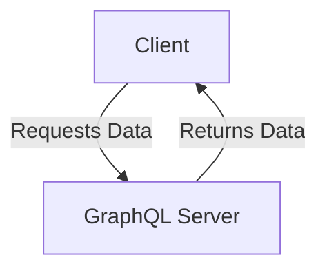
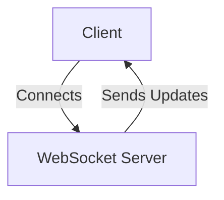
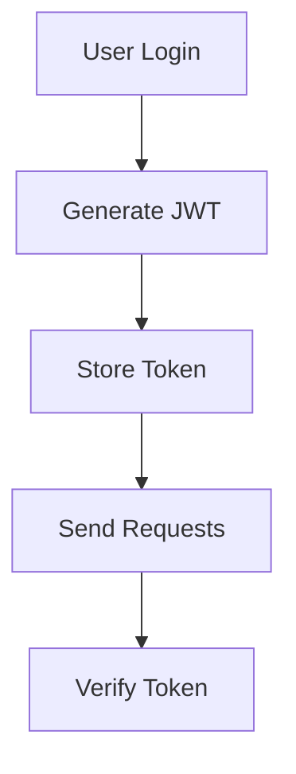

Error: API request failed with error: 401 Client Error: Unauthorized for url: https://openrouter.ai/api/v1/chat/completions

# <span style="color:#e67e22;">What we will learn in this post?</span>
<ul style='list-style-type: none; padding-left: 0;'>
<li><span style='color: #2980b9; font-size: 20px; font-weight: bold;'>👉</span> <span style='color: #2ecc71; font-size: 18px; font-weight: bold;'>Introduction to GraphQL</span></li>
<li><span style='color: #2980b9; font-size: 20px; font-weight: bold;'>👉</span> <span style='color: #2ecc71; font-size: 18px; font-weight: bold;'>Setting Up GraphQL Server</span></li>
<li><span style='color: #2980b9; font-size: 20px; font-weight: bold;'>👉</span> <span style='color: #2ecc71; font-size: 18px; font-weight: bold;'>Queries and Mutations</span></li>
<li><span style='color: #2980b9; font-size: 20px; font-weight: bold;'>👉</span> <span style='color: #2ecc71; font-size: 18px; font-weight: bold;'>GraphQL Subscriptions</span></li>
<li><span style='color: #2980b9; font-size: 20px; font-weight: bold;'>👉</span> <span style='color: #2ecc71; font-size: 18px; font-weight: bold;'>DataLoaders and N+1 Problem</span></li>
<li><span style='color: #2980b9; font-size: 20px; font-weight: bold;'>👉</span> <span style='color: #2ecc71; font-size: 18px; font-weight: bold;'>Authentication and Authorization</span></li>
</ul>

# <span style="color:#e67e22">Introduction to GraphQL</span> 🌐

GraphQL is a modern alternative to REST for building APIs. It allows clients to request exactly the data they need, making it a flexible and efficient choice for developers. 

## <span style="color:#2980b9">Benefits of GraphQL</span> 🚀

- **Flexible Queries**: Clients can specify exactly what data they want, reducing unnecessary data transfer.
- **Single Endpoint**: Unlike REST, which has multiple endpoints, GraphQL uses a single endpoint for all requests.
- **Strong Typing**: GraphQL schemas define the types of data, ensuring that clients know what to expect.
- **No Over/Under-fetching**: Clients get precisely the data they need, avoiding the common issues of REST APIs.

### <span style="color:#8e44ad">When to Choose GraphQL</span> 🤔

- When you need to aggregate data from multiple sources.
- If your application requires real-time updates.
- When you want to minimize data transfer for mobile apps.

### <span style="color:#8e44ad">Schema-First Approach</span> 📜

In GraphQL, you start by defining a schema that describes your data and its relationships. This schema acts as a contract between the client and server, ensuring clarity and consistency.



For more information, check out the [GraphQL Official Documentation](https://graphql.org/learn/). 

Embrace GraphQL for a more efficient and powerful API experience! 🌟

# <span style="color:#e67e22">Creating a GraphQL Server in Go with gqlgen</span> 🚀

## <span style="color:#2980b9">Setup Steps</span>

1. **Install Go**: Make sure you have Go installed. You can download it from [golang.org](https://golang.org/dl/).
2. **Create a new directory**: 
   ```bash
   mkdir gqlgen-example
   cd gqlgen-example
   ```
3. **Initialize a Go module**:
   ```bash
   go mod init gqlgen-example
   ```
4. **Install gqlgen**:
   ```bash
   go get github.com/99designs/gqlgen
   ```

## <span style="color:#2980b9">Define Your Schema</span> 📜

Create a file named `schema.graphqls`:

```graphql
type Query {
  hello: String!
}
```

## <span style="color:#2980b9">Generate Resolvers</span> ⚙️

Run the following command to generate the necessary files:

```bash
go run github.com/99designs/gqlgen init
```

This creates a `resolver.go` file where you can define your resolver functions.

### <span style="color:#8e44ad">Implement the Resolver</span>

Edit `resolver.go`:

```go
package graph

import "context"

type Resolver struct{}

func (r *queryResolver) Hello(ctx context.Context) (string, error) {
    return "Hello, World!", nil
}
```

## <span style="color:#2980b9">Set Up the HTTP Handler</span> 🌐

In your `main.go`, set up the server:

```go
package main

import (
    "log"
    "net/http"

    "github.com/99designs/gqlgen/graphql/handler"
    "github.com/99designs/gqlgen/graphql/playground"
    "gqlgen-example/graph"
)

func main() {
    srv := handler.NewDefaultServer(graph.NewExecutableSchema(graph.Config{Resolvers: &graph.Resolver{}}))

    http.Handle("/", playground.Handler("GraphQL playground", "/query"))
    http.Handle("/query", srv)

    log.Println("Server is running on :8080")
    log.Fatal(http.ListenAndServe(":8080", nil))
}
```

## <span style="color:#2980b9">Run Your Server</span> 🏃‍♂️

Finally, run your server:

```bash
go run main.go
```

Visit `http://localhost:8080` to see your GraphQL playground! 🎉

For more details, check out the [gqlgen documentation](https://gqlgen.com/getting-started/).

# <span style="color:#e67e22">Implementing GraphQL Queries and Mutations</span> 🌐

GraphQL is a powerful tool for fetching and modifying data. Let’s break down how to implement **queries** and **mutations** in a friendly way!

## <span style="color:#2980b9">What are Queries and Mutations?</span> 🤔

- **Queries** are used to **fetch data**.
- **Mutations** are used to **modify data**.

### <span style="color:#8e44ad">Creating a Simple GraphQL Server</span> 🚀

Here’s a basic example using Node.js and Apollo Server:

```javascript
const { ApolloServer, gql } = require('apollo-server');

// Define your type definitions
const typeDefs = gql`
  type Query {
    hello: String
  }
  type Mutation {
    setGreeting(greeting: String): String
  }
`;

// Resolver functions
const resolvers = {
  Query: {
    hello: () => 'Hello, World!',
  },
  Mutation: {
    setGreeting: (_, { greeting }) => greeting,
  },
};

// Create the server
const server = new ApolloServer({ typeDefs, resolvers });

// Start the server
server.listen().then(({ url }) => {
  console.log(`🚀 Server ready at ${url}`);
});
```

### <span style="color:#8e44ad">Using Context and Handling Arguments</span> 🛠️

You can pass context to your resolvers for shared data:

```javascript
const server = new ApolloServer({
  typeDefs,
  resolvers,
  context: ({ req }) => {
    return { user: req.user }; // Example context
  },
});
```

### <span style="color:#2980b9">Learn More!</span> 📚

For more details, check out the [Apollo Server Documentation](https://www.apollographql.com/docs/apollo-server/).

---

By using GraphQL, you can efficiently manage your data fetching and modifications. Happy coding! 🎉

# <span style="color:#e67e22">Introduction to GraphQL Subscriptions for Real-Time Updates</span>

GraphQL subscriptions are a powerful feature that allows your applications to receive real-time updates. Imagine being able to see changes in your app instantly, like new messages in a chat or live sports scores! ⚡

## <span style="color:#2980b9">What are GraphQL Subscriptions?</span>

Subscriptions enable clients to listen for specific events and receive updates when those events occur. This is done using **WebSockets**, which provide a full-duplex communication channel over a single TCP connection.

### <span style="color:#8e44ad">Implementing Subscriptions in Go</span>

To implement subscriptions in Go, you can use libraries like `graphql-go` and `gorilla/websocket`. Here’s a simple example:

```go
// Subscription resolver
func (r *Resolver) SubscribeToMessages(ctx context.Context) (<-chan *Message, error) {
    ch := make(chan *Message)
    // Logic to send messages to the channel
    return ch, nil
}
```

### <span style="color:#8e44ad">Managing Subscription Lifecycle</span>

- **Start**: Open a WebSocket connection.
- **Listen**: Wait for events.
- **Stop**: Close the connection when done.

### <span style="color:#2980b9">Use Cases</span>

- **Chat Applications**: Real-time message updates.
- **Live Sports**: Instant score updates.
- **Stock Prices**: Track changes in real-time.

For more detailed information, check out the [GraphQL Subscriptions Documentation](https://graphql.org/learn/subscriptions/).



With GraphQL subscriptions, you can create dynamic and engaging applications that keep users informed and connected! 🌟

# <span style="color:#e67e22">Understanding the N+1 Query Problem in GraphQL</span>

The **N+1 query problem** is a common issue in GraphQL where fetching related data leads to multiple database queries. Imagine you have a list of users, and for each user, you want to fetch their posts. If you fetch users first and then their posts one by one, you end up with **N + 1 queries** (1 for users + N for posts). This can slow down your application significantly! 😱

## <span style="color:#2980b9">Using DataLoaders for Batching and Caching</span>

To solve this, we can use **DataLoaders**. They help batch and cache requests, reducing the number of queries to just one for all posts. Here’s how it works:

1. **Batching**: Instead of fetching posts one by one, DataLoader collects all requests and fetches them in a single query.
2. **Caching**: If the same user’s posts are requested again, DataLoader serves them from cache instead of hitting the database.

### <span style="color:#8e44ad">Implementing DataLoaders in Go</span>

In Go, you can use the `dataloaden` library to implement DataLoaders easily. Here’s a simple example:

```go
package main

import (
    "github.com/graph-gophers/dataloader"
)

func main() {
    // Create a new DataLoader
    batchFn := func(keys []string) []*dataloader.Result {
        // Fetch data from the database
        return fetchPosts(keys)
    }
    loader := dataloader.NewBatchedLoader(batchFn)

    // Load posts for a user
    posts, err := loader.Load("userID")
}
```

### <span style="color:#8e44ad">Optimizing Database Queries</span>

- **Use Joins**: Instead of multiple queries, use SQL joins to fetch related data in one go.
- **Indexes**: Ensure your database tables are indexed for faster lookups.

For more information, check out [GraphQL DataLoader Documentation](https://github.com/graphql/dataloader) and [dataloaden library](https://github.com/graph-gophers/dataloader).

By using DataLoaders, you can make your GraphQL API faster and more efficient! 🚀

# <span style="color:#e67e22">Implementing Authentication & Authorization in GraphQL</span>

## <span style="color:#2980b9">Authentication with JWT Tokens</span>

To secure your GraphQL API, you can use **JWT (JSON Web Tokens)** for authentication. Here’s how:

1. **User Login**: When a user logs in, generate a JWT token.
2. **Token Storage**: Store the token in local storage or cookies.
3. **Token Verification**: On each request, verify the token in your middleware.

```javascript
const jwt = require('jsonwebtoken');

const token = jwt.sign({ userId: user.id }, 'your_secret_key');
```

## <span style="color:#2980b9">Session-Based Authentication</span>

Alternatively, you can use session-based authentication:

- **Create a Session**: Store user info in a session on the server.
- **Session ID**: Send a session ID to the client, which is used for subsequent requests.

### <span style="color:#8e44ad">Authorization at Schema Level</span>

Use **directives** to enforce permissions:

- **@auth** directive can restrict access to certain fields based on user roles.

```graphql
type Query {
  secretData: String @auth(requires: ADMIN)
}
```

### <span style="color:#8e44ad">Field-Level Permissions</span>

Implement field-level permissions in your resolvers:

```javascript
const resolvers = {
  Query: {
    secretData: (parent, args, context) => {
      if (!context.user || context.user.role !== 'ADMIN') {
        throw new Error('Not authorized');
      }
      return "This is secret data!";
    },
  },
};
```

## <span style="color:#2980b9">Securing GraphQL Endpoints</span>

- **Use HTTPS**: Always serve your API over HTTPS.
- **Rate Limiting**: Implement rate limiting to prevent abuse.
- **Input Validation**: Validate inputs to avoid injection attacks.

### <span style="color:#8e44ad">Resources</span>

- [JWT Documentation](https://jwt.io/)
- [GraphQL Authorization](https://graphql.org/learn/authorization/)



By following these steps, you can effectively implement authentication and authorization in your GraphQL API! Happy coding! 🚀

