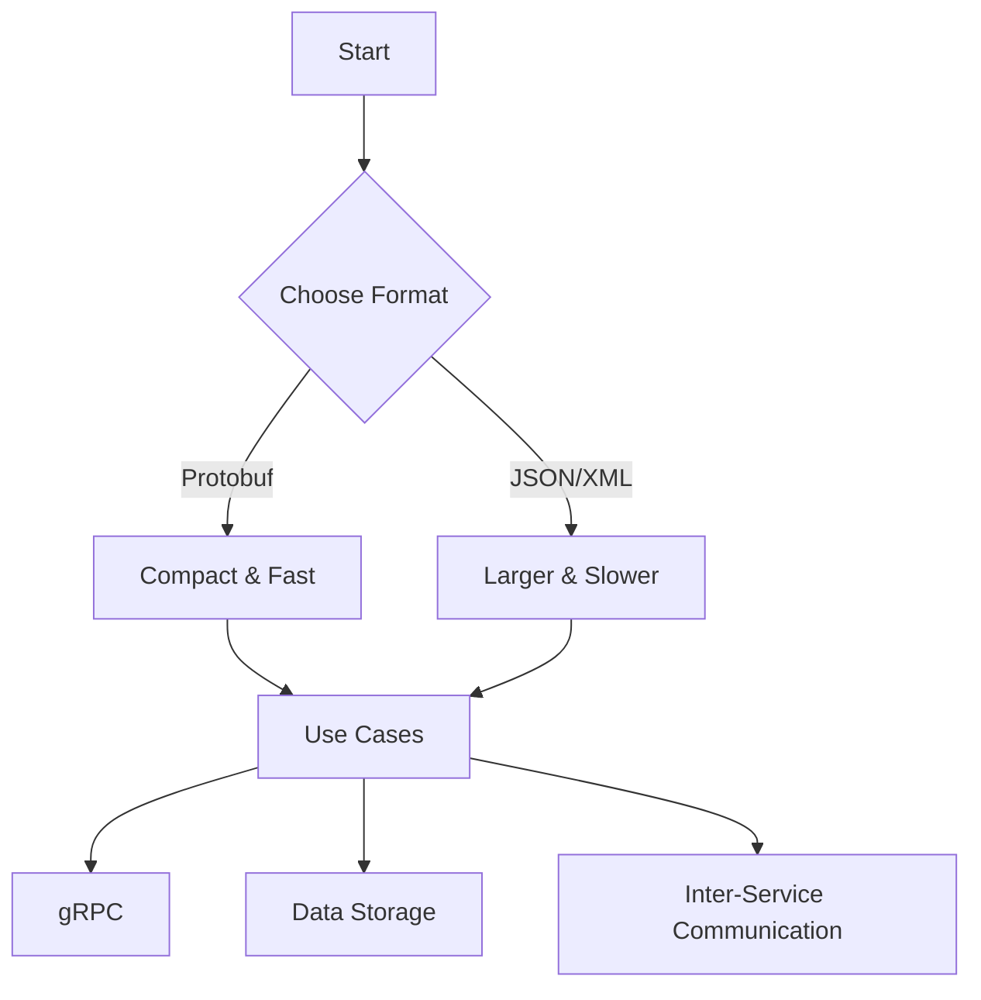

Error: API request failed with error: 401 Client Error: Unauthorized for url: https://openrouter.ai/api/v1/chat/completions

# <span style="color:#e67e22;">What we will learn in this post?</span>
<ul style='list-style-type: none; padding-left: 0;'>
<li><span style='color: #2980b9; font-size: 20px; font-weight: bold;'>👉</span> <span style='color: #2ecc71; font-size: 18px; font-weight: bold;'>Introduction to Protocol Buffers</span></li>
<li><span style='color: #2980b9; font-size: 20px; font-weight: bold;'>👉</span> <span style='color: #2ecc71; font-size: 18px; font-weight: bold;'>Defining Proto Files</span></li>
<li><span style='color: #2980b9; font-size: 20px; font-weight: bold;'>👉</span> <span style='color: #2ecc71; font-size: 18px; font-weight: bold;'>Generating Go Code from Proto</span></li>
<li><span style='color: #2980b9; font-size: 20px; font-weight: bold;'>👉</span> <span style='color: #2ecc71; font-size: 18px; font-weight: bold;'>Serialization and Deserialization</span></li>
<li><span style='color: #2980b9; font-size: 20px; font-weight: bold;'>👉</span> <span style='color: #2ecc71; font-size: 18px; font-weight: bold;'>Schema Evolution and Versioning</span></li>
<li><span style='color: #2980b9; font-size: 20px; font-weight: bold;'>👉</span> <span style='color: #2ecc71; font-size: 18px; font-weight: bold;'>Protobuf with gRPC Services</span></li>
</ul>

# <span style="color:#e67e22">Introduction to Protocol Buffers (protobuf)</span>

Protocol Buffers, or **protobuf**, is a powerful tool for data serialization. It allows you to convert structured data into a compact binary format, making it easy to share between different systems and programming languages. 🌍

## <span style="color:#2980b9">Why Choose Protocol Buffers?</span>

Here are some **key advantages** of using protobuf over traditional formats like JSON or XML:

- **Smaller Size**: Protobuf data is more compact, which means less storage space and faster transmission. 📦
- **Faster Performance**: It’s designed for speed, making data processing quicker. ⚡
- **Type Safety**: Protobuf enforces data types, reducing errors and improving reliability. ✅

### <span style="color:#8e44ad">Common Use Cases</span>

Protobuf shines in various scenarios, including:

- **gRPC**: A modern framework for remote procedure calls, using protobuf for efficient communication.
- **Data Storage**: Ideal for storing structured data in databases.
- **Inter-Service Communication**: Perfect for microservices to communicate seamlessly.

For more information, check out the [official Protocol Buffers documentation](https://developers.google.com/protocol-buffers/docs/overview).



With protobuf, you can ensure your data is transmitted efficiently and reliably across different platforms. Happy coding! 🎉

# <span style="color:#e67e22">Understanding .proto File Syntax</span> 🌟

Protocol Buffers, or **protobuf**, is a way to serialize structured data. It uses `.proto` files to define the structure of your data. Let’s break down the key components! 

## <span style="color:#2980b9">Defining Messages</span> 📦

A **message** is a basic building block in protobuf. It’s like a class in programming. Here’s how you define one:

```proto
message Person {
  string name = 1;
  int32 age = 2;
}
```

### <span style="color:#8e44ad">Field Types</span> 🔢

- **Scalar Types**: Basic data types like `int32`, `string`, and `bool`.
- **Repeated Fields**: Use `repeated` for lists. 
  ```proto
  repeated string hobbies = 3;
  ```
- **Maps**: Key-value pairs.
  ```proto
  map<string, int32> scores = 4;
  ```

## <span style="color:#2980b9">Enums and Nested Messages</span> 🗂️

- **Enums**: Define a set of named values.
  ```proto
  enum Gender {
    MALE = 0;
    FEMALE = 1;
  }
  ```

- **Nested Messages**: You can define messages inside other messages.
  ```proto
  message Address {
    string street = 1;
    string city = 2;
  }
  
  message Person {
    Address address = 3;
  }
  ```

## <span style="color:#2980b9">Best Practices for Schema Design</span> 🛠️

- **Use clear names**: Make your field names descriptive.
- **Avoid changing field numbers**: This can break compatibility.
- **Group related fields**: Use nested messages for better organization.

For more details, check out the [Protocol Buffers Documentation](https://developers.google.com/protocol-buffers/docs/proto3).

Happy coding! 🎉

# <span style="color:#e67e22">Installing Protoc and Go Plugins</span> 🛠️

To get started with Protocol Buffers (protobuf) in Go, you'll need to install the `protoc` compiler and the Go plugin `protoc-gen-go`. Here’s how to do it step-by-step!

## <span style="color:#2980b9">Step 1: Install Protoc</span> 📦

1. **Download Protoc**: Visit the [Protobuf Releases page](https://github.com/protocolbuffers/protobuf/releases) and download the appropriate version for your OS.
2. **Install**: Unzip the file and add the `bin` directory to your system's PATH.

```bash
# Example for Linux
sudo mv protoc /usr/local/bin/
```

## <span style="color:#2980b9">Step 2: Install Go Plugin</span> 🐹

Run the following command to install the Go plugin:

```bash
go install google.golang.org/protobuf/cmd/protoc-gen-go@latest
```

Make sure your `$GOPATH/bin` is in your PATH.

## <span style="color:#2980b9">Step 3: Generate Go Code</span> 📜

Create a `.proto` file, for example, `example.proto`:

```proto
syntax = "proto3";

message Hello {
  string name = 1;
}
```

Now, generate the Go code:

```bash
protoc --go_out=. example.proto
```

## <span style="color:#2980b9">Step 4: Understand Generated Code</span> 📂

The generated code will be in a file named `example.pb.go`. It contains:

- **Structs** for your messages
- **Methods** for serialization and deserialization

## <span style="color:#2980b9">Step 5: Integrate into Go Project</span> 🚀

You can now use the generated code in your Go project:

```go
package main

import (
    "fmt"
    pb "path/to/your/generated/package"
)

func main() {
    hello := &pb.Hello{Name: "World"}
    fmt.Println(hello)
}
```

### Resources 📚

- [Protocol Buffers Documentation](https://developers.google.com/protocol-buffers/docs/proto3)
- [Go Protobuf Documentation](https://github.com/protocolbuffers/protobuf-go)

Happy coding! 🎉

# <span style="color:#e67e22">Marshaling Go Structs to Protobuf</span> 🐹

In Go, we can easily convert (or *marshal*) our structs to Protobuf binary format using the `proto.Marshal()` function. This is super handy for sending data over the network or saving it to a file!

## <span style="color:#2980b9">Marshaling with `proto.Marshal()`</span> 📦

To marshal a struct, you first need to define your Protobuf message. Here’s a simple example:

```protobuf
syntax = "proto3";

message Person {
  string name = 1;
  int32 age = 2;
}
```

Now, in your Go code, you can marshal it like this:

```go
import (
    "google.golang.org/protobuf/proto"
)

person := &Person{Name: "Alice", Age: 30}
data, err := proto.Marshal(person)
if err != nil {
    log.Fatal("Marshaling error: ", err)
}
```

## <span style="color:#2980b9">Unmarshaling with `proto.Unmarshal()`</span> 🔄

To convert the binary data back to a struct, use `proto.Unmarshal()`:

```go
newPerson := &Person{}
err = proto.Unmarshal(data, newPerson)
if err != nil {
    log.Fatal("Unmarshaling error: ", err)
}
```

### <span style="color:#8e44ad">Working with Generated Getters</span> 🔍

Protobuf generates getter methods for you. For example, you can access the name like this:

```go
fmt.Println("Name:", newPerson.GetName())
```

### <span style="color:#8e44ad">Handling Optional Fields</span> ⚙️

In Protobuf, fields are optional by default. You can check if a field is set using the generated methods:

```go
if newPerson.GetAge() != 0 {
    fmt.Println("Age:", newPerson.GetAge())
}
```

### <span style="color:#8e44ad">Resources</span> 📚

- [Protobuf Documentation](https://developers.google.com/protocol-buffers/docs/proto3)
- [Go Protobuf Guide](https://protobuf.dev/docs/guides/go/)

With these tools, you can efficiently work with Protobuf in Go! Happy coding! 🎉

# <span style="color:#e67e22">Maintaining Compatibility in Protobuf Schemas</span> 🤝

## <span style="color:#2980b9">Field Numbering Rules</span> 🔢

- **Unique Numbers**: Each field must have a unique number. 
- **Avoid Reuse**: Never reuse numbers for different fields to prevent confusion.

### <span style="color:#8e44ad">Using Reserved Fields</span> 🚫

- **Reserving Numbers**: Use `reserved` to prevent reuse of field numbers or names.
  
  ```protobuf
  reserved 2, 4, 5; // Numbers 2, 4, and 5 are reserved
  reserved "old_field_name"; // Field name is reserved
  ```

## <span style="color:#2980b9">Adding/Removing Fields Safely</span> ➕➖

- **Adding Fields**: You can add new fields at any time. Just ensure they have unique numbers.
- **Removing Fields**: Instead of removing, mark fields as `deprecated`. This keeps the schema stable.

### <span style="color:#8e44ad">Deprecated Fields</span> ⚠️

- **Marking as Deprecated**: Use the `deprecated` option to indicate a field should not be used.

  ```protobuf
  optional string old_field = 2 [deprecated = true];
  ```

## <span style="color:#2980b9">Versioning Strategies</span> 📅

- **Versioning**: Consider using version numbers in your message names or package names to manage changes.
  
  ```protobuf
  message UserV1 { ... }
  message UserV2 { ... }
  ```

### <span style="color:#8e44ad">Resources</span> 📚

- [Protocol Buffers Documentation](https://developers.google.com/protocol-buffers/docs/proto3)
- [Best Practices for Protobuf](https://protobuf.dev/docs/proto3/specs/)

---

By following these guidelines, you can ensure your Protobuf schemas remain compatible and easy to manage! 😊

# <span style="color:#e67e22">Defining gRPC Services in .proto Files</span> 🚀

gRPC is a powerful framework for building APIs. It uses **Protocol Buffers** (protobuf) to define services and messages. Let's break it down!

## <span style="color:#2980b9">Creating a .proto File</span> 📄

In your `.proto` file, you define your service and its methods. Here’s a simple example:

```protobuf
syntax = "proto3";

package example;

// Define a service
service Greeter {
  // Unary method
  rpc SayHello (HelloRequest) returns (HelloReply);
  
  // Server streaming method
  rpc StreamGreetings (HelloRequest) returns (stream HelloReply);
}

// Message types
message HelloRequest {
  string name = 1;
}

message HelloReply {
  string message = 1;
}
```

### <span style="color:#8e44ad">Understanding Service Methods</span> 🛠️

- **Unary**: One request, one response (e.g., `SayHello`).
- **Server Streaming**: One request, multiple responses (e.g., `StreamGreetings`).
- **Client Streaming**: Multiple requests, one response (not shown here).
- **Bidirectional Streaming**: Both client and server send messages (not shown here).

## <span style="color:#2980b9">Generating gRPC Code</span> ⚙️

Use the following command to generate Go code from your `.proto` file:

```bash
protoc --go_out=. --go-grpc_out=. example.proto
```

## <span style="color:#2980b9">Implementing Service Handlers in Go</span> 🐹

Here’s how you can implement the `Greeter` service:

```go
package main

import (
    "context"
    "log"
    "net"

    pb "path/to/your/proto/package"
    "google.golang.org/grpc"
)

// Server struct
type server struct {
    pb.UnimplementedGreeterServer
}

// SayHello implementation
func (s *server) SayHello(ctx context.Context, req *pb.HelloRequest) (*pb.HelloReply, error) {
    return &pb.HelloReply{Message: "Hello " + req.Name}, nil
}

// Main function
func main() {
    lis, err := net.Listen("tcp", ":50051")
    if err != nil {
        log.Fatalf("failed to listen: %v", err)
    }
    grpcServer := grpc.NewServer()
    pb.RegisterGreeterServer(grpcServer, &server{})
    log.Println("Server is running on port 50051...")
    grpcServer.Serve(lis)
}
```

### <span style="color:#8e44ad">Key Points</span> 🔑

- Define your service and methods in a `.proto` file.
- Generate Go code using `protoc`.
- Implement the service in Go, handling requests and responses.

For more details, check out the [gRPC documentation](https://grpc.io/docs/).

Happy coding! 🎉

