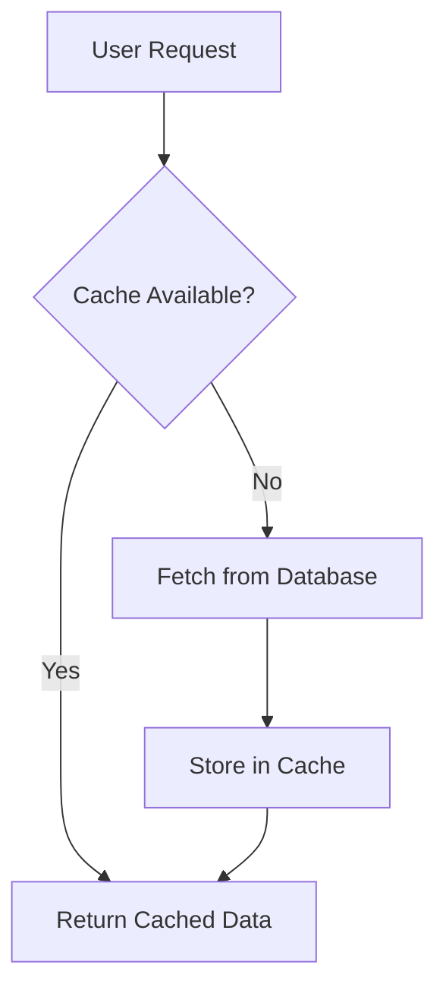
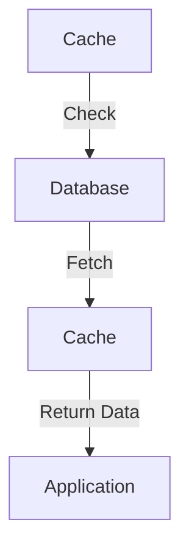
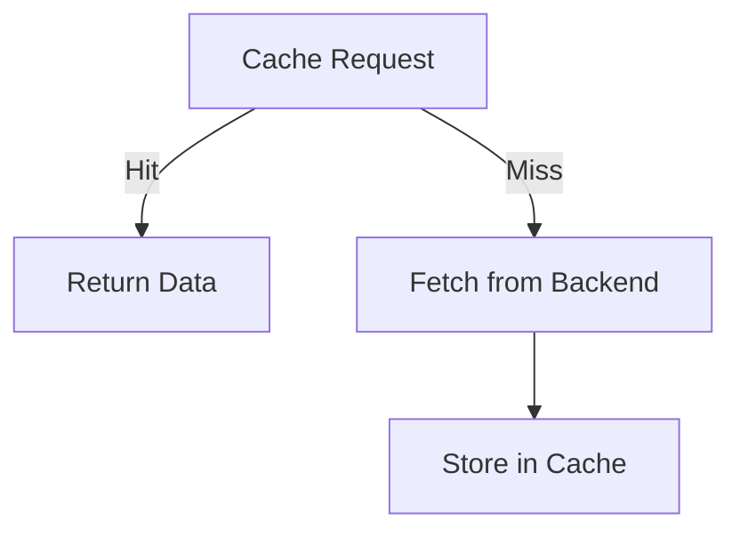

Error: API request failed with error: 401 Client Error: Unauthorized for url: https://openrouter.ai/api/v1/chat/completions

# <span style="color:#e67e22;">What we will learn in this post?</span>
<ul style='list-style-type: none; padding-left: 0;'>
<li><span style='color: #2980b9; font-size: 20px; font-weight: bold;'>👉</span> <span style='color: #2ecc71; font-size: 18px; font-weight: bold;'>Introduction to Caching</span></li>
<li><span style='color: #2980b9; font-size: 20px; font-weight: bold;'>👉</span> <span style='color: #2ecc71; font-size: 18px; font-weight: bold;'>In-Memory Caching</span></li>
<li><span style='color: #2980b9; font-size: 20px; font-weight: bold;'>👉</span> <span style='color: #2ecc71; font-size: 18px; font-weight: bold;'>Redis Caching</span></li>
<li><span style='color: #2980b9; font-size: 20px; font-weight: bold;'>👉</span> <span style='color: #2ecc71; font-size: 18px; font-weight: bold;'>Cache Patterns and Strategies</span></li>
<li><span style='color: #2980b9; font-size: 20px; font-weight: bold;'>👉</span> <span style='color: #2ecc71; font-size: 18px; font-weight: bold;'>Cache Invalidation</span></li>
<li><span style='color: #2980b9; font-size: 20px; font-weight: bold;'>👉</span> <span style='color: #2ecc71; font-size: 18px; font-weight: bold;'>Distributed Caching Considerations</span></li>
</ul>

# <span style="color:#e67e22">Introduction to Caching Concepts</span> 

Caching is a smart way to speed up your applications and websites! 🌐 It stores copies of frequently accessed data, so you don’t have to fetch it from the original source every time. This means **faster load times** and a better experience for users. 

## <span style="color:#2980b9">Benefits of Caching</span> 

- **Reduced Latency**: Access data quickly without delays! ⏱️
- **Lower Database Load**: Less strain on your database means it can handle more users. 📊
- **Improved Scalability**: Easily grow your application without performance hiccups. 📈

## <span style="color:#2980b9">Caching Layers</span> 

Caching can happen at different levels:

### <span style="color:#8e44ad">Client Caching</span> 
Stores data in the user's browser.

### <span style="color:#8e44ad">CDN (Content Delivery Network)</span> 
Distributes cached content across various locations for faster access.

### <span style="color:#8e44ad">Application Caching</span> 
Caches data within the application itself.

### <span style="color:#8e44ad">Database Caching</span> 
Stores query results to reduce database hits.

## <span style="color:#2980b9">When to Use Caching</span> 

- When data is frequently accessed.
- For static content like images and stylesheets.
- To improve performance during high traffic.

For more in-depth information, check out [Caching Basics](https://www.digitalocean.com/community/tutorials/understanding-caching) and [CDN Overview](https://www.cloudflare.com/learning/cdn/what-is-a-cdn/).



Caching is a powerful tool to enhance your application's performance! 🚀

# <span style="color:#e67e22">In-Memory Caching in Go</span> 🐹

Caching is a great way to speed up your applications by storing frequently accessed data in memory. Let's explore how to implement a simple in-memory cache in Go using the **go-cache** library. 

## <span style="color:#2980b9">Why Use Caching?</span> 💡

- **Faster Access**: Retrieve data quickly without hitting the database.
- **Reduced Load**: Decrease the number of requests to your database.
- **Improved Performance**: Enhance user experience with quicker responses.

### <span style="color:#8e44ad">Basic Implementation</span> ⚙️

Here’s a simple example using **go-cache**:

```go
package main

import (
    "fmt"
    "time"
    "github.com/patrickmn/go-cache"
)

func main() {
    // Create a new cache with a default expiration time of 5 minutes
    c := cache.New(5*time.Minute, 10*time.Minute)

    // Set a value in the cache
    c.Set("foo", "bar", cache.DefaultExpiration)

    // Get the value from the cache
    value, found := c.Get("foo")
    if found {
        fmt.Println("Found:", value)
    } else {
        fmt.Println("Not found")
    }
}
```

### <span style="color:#8e44ad">Cache Features</span> 🌟

- **Expiration**: Automatically remove items after a set time.
- **Eviction Policies**: Choose between LRU (Least Recently Used) or LFU (Least Frequently Used) for managing space.
- **Thread-Safe**: Safe to use in concurrent applications.

### <span style="color:#2980b9">Resources</span> 📚

- [Go Cache Documentation](https://github.com/patrickmn/go-cache)
- [BigCache Documentation](https://github.com/eko/gocache)

Caching can significantly boost your app's performance! Happy coding! 🚀

# <span style="color:#e67e22">Using Redis for Distributed Caching with Go</span> 🗄️

Redis is a powerful tool for caching data in your applications. Using the **go-redis** library, you can easily connect to Redis and perform basic operations. Let’s dive in! 

## <span style="color:#2980b9">Basic Operations</span> 🔧

### **1. Setting and Getting Values** 

You can store data using `SET` and retrieve it with `GET`. Here’s a simple example:

```go
import "github.com/go-redis/redis/v8"

client := redis.NewClient(&redis.Options{
    Addr: "localhost:6379",
})

err := client.Set(ctx, "key", "value", 0).Err()
val, err := client.Get(ctx, "key").Result()
```

### **2. Expiring Keys** ⏳

To automatically remove keys after a certain time, use `EXPIRE`:

```go
client.Set(ctx, "tempKey", "tempValue", 0)
client.Expire(ctx, "tempKey", time.Minute)
```

## <span style="color:#2980b9">Data Structures</span> 📊

Redis supports various data types:

- **Strings**: Simple key-value pairs.
- **Hashes**: Useful for storing objects.
- **Lists**: Ordered collections of strings.
- **Sets**: Unordered collections of unique items.

### **Example of a Hash**:

```go
client.HSet(ctx, "user:1000", "name", "Alice", "age", 30)
```

## <span style="color:#2980b9">Connection Pooling</span> 🌐

Connection pooling helps manage multiple connections efficiently. The go-redis library handles this automatically, so you can focus on your application logic.

## <span style="color:#2980b9">Handling Cache Misses</span> ❓

When data isn’t found in the cache, you can fetch it from the database and then store it in Redis:

```go
val, err := client.Get(ctx, "key").Result()
if err == redis.Nil {
    // Fetch from DB and set in cache
    client.Set(ctx, "key", dbValue, 0)
}
```

For more information, check out the [go-redis documentation](https://pkg.go.dev/github.com/go-redis/redis/v8).

Happy coding! 🎉

# <span style="color:#e67e22">Common Caching Patterns</span> 🗄️

Caching is a great way to speed up your applications! Here are some common caching patterns you can use in Go.

## <span style="color:#2980b9">1. Cache-Aside (Lazy Loading)</span> 💤

In this pattern, the application checks the cache first. If the data is not there, it fetches it from the database and stores it in the cache.

**When to Use:**  
- When data is read frequently but updated rarely.

**Example in Go:**
```go
func getData(key string) (string, error) {
    if data, found := cache.Get(key); found {
        return data, nil
    }
    data, err := fetchFromDB(key)
    if err == nil {
        cache.Set(key, data)
    }
    return data, err
}
```

## <span style="color:#2980b9">2. Read-Through</span> 📖

Here, the cache handles the loading of data. The application only interacts with the cache.

**When to Use:**  
- When you want to simplify data access.

**Example in Go:**
```go
func readThroughCache(key string) (string, error) {
    return cache.GetOrLoad(key, fetchFromDB)
}
```

## <span style="color:#2980b9">3. Write-Through</span> ✍️

In this pattern, when you write data, it goes to both the cache and the database.

**When to Use:**  
- When you want to ensure the cache is always up-to-date.

**Example in Go:**
```go
func writeData(key string, value string) error {
    cache.Set(key, value)
    return saveToDB(key, value)
}
```

## <span style="color:#2980b9">4. Write-Behind</span> ⏳

Data is written to the cache first, and then asynchronously to the database.

**When to Use:**  
- When you want to improve write performance.

**Example in Go:**
```go
func writeBehind(key string, value string) {
    cache.Set(key, value)
    go saveToDB(key, value) // Save in the background
}
```

## <span style="color:#2980b9">5. Refresh-Ahead</span> 🔄

This pattern preemptively refreshes cache entries before they expire.

**When to Use:**  
- When you want to ensure data is always fresh.

**Example in Go:**
```go
func refreshCache(key string) {
    go func() {
        time.Sleep(expirationTime)
        data := fetchFromDB(key)
        cache.Set(key, data)
    }()
}
```

### <span style="color:#8e44ad">Conclusion</span> 🎉

Choose the caching pattern that best fits your application's needs! For more information, check out [Caching Patterns](https://www.cachingpatterns.com).



Happy coding! 😊

# <span style="color:#e67e22">Understanding Cache Invalidation Challenges</span> 🗄️

Caching is great for speeding up applications, but it comes with challenges, especially when it comes to **cache invalidation**. Let’s break it down!

## <span style="color:#2980b9">What is Cache Invalidation?</span> ❓

Cache invalidation is the process of removing or updating stale data in the cache. If not handled well, users might see outdated information. Here are some common strategies:

### <span style="color:#8e44ad">Cache Invalidation Strategies</span> 🔧

- **Time-based Expiration**: Set a timer for how long data stays in the cache. After the time is up, the data is refreshed.
  
- **Event-based Invalidation**: Update the cache when specific events happen, like a user updating their profile.

- **Version-based Invalidation**: Use version numbers for data. When data changes, increment the version, and the cache knows to fetch the new data.

## <span style="color:#2980b9">Handling Stale Data</span> ⏳

Stale data can confuse users. Here’s how to manage it:

- **Graceful Degradation**: Show a message if the data is stale, letting users know they might not see the latest info.

- **Background Refresh**: Fetch new data in the background while showing cached data to users.

## <span style="color:#2980b9">Implementing in Go Applications</span> 🐹

In Go, you can use libraries like `groupcache` or `go-cache` to manage caching. Here’s a simple example:

```go
cache := cache.New(5*time.Minute, 10*time.Minute)
cache.Set("key", "value", cache.DefaultExpiration)
```

For more in-depth information, check out these resources:
- [Cache Invalidation Strategies](https://example.com/cache-invalidation)
- [Go Caching Libraries](https://example.com/go-cache-libraries)

By understanding these strategies, you can keep your application fast and your data fresh! 🌟

# <span style="color:#e67e22">Distributed Caching Challenges</span>

Distributed caching can speed up applications, but it comes with challenges. Let’s break them down!

## <span style="color:#2980b9">1. Consistency Models 🤔</span>

- **Eventual Consistency**: This means that, over time, all copies of data will become consistent. However, there might be temporary discrepancies. 
- **Why it Matters**: It’s crucial for applications that can tolerate some delay in data accuracy.

## <span style="color:#2980b9">2. Cache Stampede Problem 🚀</span>

- **What is it?**: When many requests hit the cache at the same time, it can overwhelm the backend.
- **Solutions**:
  - **Locking**: Prevents multiple requests from fetching the same data simultaneously.
  - **Probabilistic Early Expiration**: Randomly expires cache entries to spread out requests.

### <span style="color:#8e44ad">3. Partitioning Strategies 🗂️</span>

- **Horizontal Partitioning**: Splitting data across multiple caches.
- **Vertical Partitioning**: Dividing data by type or usage.

### <span style="color:#8e44ad">4. Monitoring Cache Performance 📊</span>

- **Key Metrics**:
  - Hit Rate: How often data is found in the cache.
  - Latency: Time taken to retrieve data.
- **Tools**: Use monitoring tools like Prometheus or Grafana for insights.



For more information, check out these resources:
- [Eventual Consistency Explained](https://example.com/eventual-consistency)
- [Cache Stampede Solutions](https://example.com/cache-stampede)

By understanding these challenges, you can build a more efficient distributed caching system! 🌟

