<!--
meta-description: "Comprehensive guide to caching strategies in Go covering in-memory caching with go-cache, Redis distributed caching, cache patterns (cache-aside, read-through, write-through), cache invalidation, and distributed caching challenges with practical examples."
keywords: "Go caching, in-memory cache, Redis Go, go-cache, cache patterns, cache-aside pattern, write-through cache, cache invalidation, distributed caching, cache stampede, TTL, go-redis, performance optimization"
-->

# <span style="color:#e67e22;">What we will learn in this post?</span>
<ul style='list-style-type: none; padding-left: 0;'>
<li><span style='color: #2980b9; font-size: 20px; font-weight: bold;'>👉</span> <span style='color: #2ecc71; font-size: 18px; font-weight: bold;'>Introduction to Caching</span></li>
<li><span style='color: #2980b9; font-size: 20px; font-weight: bold;'>👉</span> <span style='color: #2ecc71; font-size: 18px; font-weight: bold;'>In-Memory Caching</span></li>
<li><span style='color: #2980b9; font-size: 20px; font-weight: bold;'>👉</span> <span style='color: #2ecc71; font-size: 18px; font-weight: bold;'>Redis Caching</span></li>
<li><span style='color: #2980b9; font-size: 20px; font-weight: bold;'>👉</span> <span style='color: #2ecc71; font-size: 18px; font-weight: bold;'>Cache Patterns and Strategies</span></li>
<li><span style='color: #2980b9; font-size: 20px; font-weight: bold;'>👉</span> <span style='color: #2ecc71; font-size: 18px; font-weight: bold;'>Cache Invalidation</span></li>
<li><span style='color: #2980b9; font-size: 20px; font-weight: bold;'>👉</span> <span style='color: #2ecc71; font-size: 18px; font-weight: bold;'>Distributed Caching Considerations</span></li>
</ul>

# <span style="color:#e67e22">Introduction to Caching Concepts</span> 

Caching is a smart way to speed up your applications and websites! 🌐 It stores copies of frequently accessed data, so you don't have to fetch it from the original source every time. This means **faster load times** and a better experience for users. In production systems, caching is essential for achieving sub-millisecond response times and handling millions of requests efficiently.

## <span style="color:#2980b9">Benefits of Caching</span> 

- **Reduced Latency**: Access data quickly without delays! ⏱️
- **Lower Database Load**: Less strain on your database means it can handle more users. 📊
- **Improved Scalability**: Easily grow your application without performance hiccups. 📈
- **Cost Savings**: Reduce infrastructure costs by minimizing expensive database queries.

## <span style="color:#2980b9">Caching Layers</span> 

Caching can happen at different levels:

### <span style="color:#8e44ad">Client Caching</span> 
Stores data in the user's browser.

### <span style="color:#8e44ad">CDN (Content Delivery Network)</span> 
Distributes cached content across various locations for faster access.

### <span style="color:#8e44ad">Application Caching</span> 
Caches data within the application itself.

### <span style="color:#8e44ad">Database Caching</span> 
Stores query results to reduce database hits.

## <span style="color:#2980b9">When to Use Caching</span> 

- When data is frequently accessed.
- For static content like images and stylesheets.
- To improve performance during high traffic.
- When database queries are expensive or slow.

For more in-depth information, check out [Caching Basics](https://www.digitalocean.com/community/tutorials/understanding-caching) and [CDN Overview](https://www.cloudflare.com/learning/cdn/what-is-a-cdn/).

```mermaid
graph TD
    A["🎯 User Request"]:::style1 --> B{"💡 Cache Hit?"}:::style2
    B -- "Yes ✅" --> C["⚡ Return Cached Data"]:::style3
    B -- "No ❌" --> D["🔍 Fetch from Database"]:::style4
    D --> E["📦 Store in Cache"]:::style5
    E --> C
    
    classDef style1 fill:#ff4f81,stroke:#c43e3e,color:#fff,font-size:16px,stroke-width:3px,rx:14,shadow:6px;
    classDef style2 fill:#ffd700,stroke:#d99120,color:#222,font-size:16px,stroke-width:3px,rx:14,shadow:6px;
    classDef style3 fill:#43e97b,stroke:#38f9d7,color:#fff,font-size:16px,stroke-width:3px,rx:14,shadow:6px;
    classDef style4 fill:#6b5bff,stroke:#4a3f6b,color:#fff,font-size:16px,stroke-width:3px,rx:14,shadow:6px;
    classDef style5 fill:#00bfae,stroke:#005f99,color:#fff,font-size:16px,stroke-width:3px,rx:14,shadow:6px;
    
    linkStyle default stroke:#e67e22,stroke-width:3px;
```



Caching is a powerful tool to enhance your application's performance! 🚀

# <span style="color:#e67e22">In-Memory Caching in Go</span> 🐹

Caching is a great way to speed up your applications by storing frequently accessed data in memory. Let's explore how to implement a simple in-memory cache in Go using the **go-cache** library. In-memory caches provide microsecond-level access times, making them ideal for hot data that's accessed millions of times per second.

## <span style="color:#2980b9">Why Use Caching?</span> 💡

- **Faster Access**: Retrieve data quickly without hitting the database.
- **Reduced Load**: Decrease the number of requests to your database.
- **Improved Performance**: Enhance user experience with quicker responses.

### <span style="color:#8e44ad">Basic Implementation</span> ⚙️

Here's a simple example using **go-cache**:

```go
package main

import (
    "fmt"
    "time"
    "github.com/patrickmn/go-cache"
)

func main() {
    // Create a new cache with a default expiration time of 5 minutes
    // and cleanup of expired items every 10 minutes
    c := cache.New(5*time.Minute, 10*time.Minute)

    // Set a value in the cache
    c.Set("foo", "bar", cache.DefaultExpiration)
    
    // Set with custom expiration
    c.Set("user:123", map[string]string{
        "name": "Alice",
        "role": "admin",
    }, 2*time.Minute)

    // Get the value from the cache
    value, found := c.Get("foo")
    if found {
        fmt.Println("Found:", value)
    } else {
        fmt.Println("Not found")
    }
    
    // Check if key exists
    if _, found := c.Get("user:123"); found {
        fmt.Println("User is cached")
    }
}
```

### <span style="color:#8e44ad">Cache Features</span> 🌟

- **Expiration**: Automatically remove items after a set time.
- **Eviction Policies**: Choose between LRU (Least Recently Used) or LFU (Least Frequently Used) for managing space.
- **Thread-Safe**: Safe to use in concurrent applications with built-in mutex protection.

### <span style="color:#2980b9">Resources</span> 📚

- [Go Cache Documentation](https://github.com/patrickmn/go-cache)
- [BigCache Documentation](https://github.com/allegro/bigcache)

```mermaid
graph TD
    A["🎯 Application Start"]:::style1 --> B["🔧 Initialize Cache"]:::style2
    B --> C["📝 Set Key-Value"]:::style3
    C --> D["⏱️ TTL Timer Starts"]:::style4
    D --> E{"💡 Before Expiry?"}:::style5
    E -- "Yes ✅" --> F["✨ Return Value"]:::style6
    E -- "No ❌" --> G["🗑️ Evict Entry"]:::style7
    G --> H["🔍 Cache Miss"]:::style8
    
    classDef style1 fill:#ff4f81,stroke:#c43e3e,color:#fff,font-size:16px,stroke-width:3px,rx:14,shadow:6px;
    classDef style2 fill:#6b5bff,stroke:#4a3f6b,color:#fff,font-size:16px,stroke-width:3px,rx:14,shadow:6px;
    classDef style3 fill:#00bfae,stroke:#005f99,color:#fff,font-size:16px,stroke-width:3px,rx:14,shadow:6px;
    classDef style4 fill:#ffd700,stroke:#d99120,color:#222,font-size:16px,stroke-width:3px,rx:14,shadow:6px;
    classDef style5 fill:#ff9800,stroke:#f57c00,color:#fff,font-size:16px,stroke-width:3px,rx:14,shadow:6px;
    classDef style6 fill:#43e97b,stroke:#38f9d7,color:#fff,font-size:16px,stroke-width:3px,rx:14,shadow:6px;
    classDef style7 fill:#c43e3e,stroke:#8b2e2e,color:#fff,font-size:16px,stroke-width:3px,rx:14,shadow:6px;
    classDef style8 fill:#9e9e9e,stroke:#616161,color:#fff,font-size:16px,stroke-width:3px,rx:14,shadow:6px;
    
    linkStyle default stroke:#e67e22,stroke-width:3px;
```



Caching can significantly boost your app's performance! Happy coding! 🚀

### <span style="color:#8e44ad">Real-World Example: HTTP Response Cache 🎯</span>

```go
package main

import (
    "encoding/json"
    "fmt"
    "net/http"
    "time"
    "github.com/patrickmn/go-cache"
)

// User represents a user entity
type User struct {
    ID    int    `json:"id"`
    Name  string `json:"name"`
    Email string `json:"email"`
}

// UserCache wraps go-cache for user data
type UserCache struct {
    cache *cache.Cache
}

// NewUserCache creates a new user cache with 10-minute default TTL
func NewUserCache() *UserCache {
    return &UserCache{
        cache: cache.New(10*time.Minute, 15*time.Minute),
    }
}

// GetUser retrieves a user from cache or database
func (uc *UserCache) GetUser(userID int) (*User, error) {
    // Try to get from cache first
    cacheKey := fmt.Sprintf("user:%d", userID)
    if cached, found := uc.cache.Get(cacheKey); found {
        fmt.Println("✅ Cache HIT for user", userID)
        return cached.(*User), nil
    }
    
    // Cache miss - fetch from database (simulated)
    fmt.Println("❌ Cache MISS for user", userID)
    user := &User{
        ID:    userID,
        Name:  "Alice Johnson",
        Email: "alice@example.com",
    }
    
    // Store in cache
    uc.cache.Set(cacheKey, user, cache.DefaultExpiration)
    return user, nil
}

// HTTP handler using the cache
func (uc *UserCache) UserHandler(w http.ResponseWriter, r *http.Request) {
    userID := 123 // Extract from URL params in real app
    
    user, err := uc.GetUser(userID)
    if err != nil {
        http.Error(w, "User not found", http.StatusNotFound)
        return
    }
    
    w.Header().Set("Content-Type", "application/json")
    json.NewEncoder(w).Encode(user)
}

func main() {
    userCache := NewUserCache()
    
    // First request - cache miss
    user1, _ := userCache.GetUser(123)
    fmt.Printf("First request: %+v\n", user1)
    
    // Second request - cache hit!
    user2, _ := userCache.GetUser(123)
    fmt.Printf("Second request: %+v\n", user2)
}
```

**Why This Matters**: This pattern reduces database load by 90%+ for frequently accessed user profiles, cutting API response time from 50ms to <1ms. Used by companies like Twitter and Reddit for user data caching.

# <span style="color:#e67e22">Using Redis for Distributed Caching with Go</span> 🗄️

Redis is a powerful tool for caching data in your applications. Using the **go-redis** library, you can easily connect to Redis and perform basic operations. Let's dive in! Redis provides persistence, replication, and atomic operations that in-memory caches lack, making it perfect for multi-server deployments.

## <span style="color:#2980b9">Basic Operations</span> 🔧

### **1. Setting and Getting Values** 

You can store data using `SET` and retrieve it with `GET`. Here's a simple example:

```go
package main

import (
    "context"
    "fmt"
    "time"
    "github.com/go-redis/redis/v8"
)

func main() {
    ctx := context.Background()
    
    // Create Redis client
    client := redis.NewClient(&redis.Options{
        Addr:     "localhost:6379",
        Password: "", // no password set
        DB:       0,  // use default DB
    })

    // Test connection
    pong, err := client.Ping(ctx).Result()
    if err != nil {
        panic(err)
    }
    fmt.Println("Connected to Redis:", pong)

    // Set a value
    err = client.Set(ctx, "key", "value", 0).Err()
    if err != nil {
        panic(err)
    }
    
    // Get the value
    val, err := client.Get(ctx, "key").Result()
    if err != nil {
        panic(err)
    }
    fmt.Println("key:", val)
}
```

### **2. Expiring Keys** ⏳

To automatically remove keys after a certain time, use `EXPIRE`:

```go
// Set with expiration (TTL)
err := client.Set(ctx, "tempKey", "tempValue", 5*time.Minute).Err()

// Or set expiration separately
client.Set(ctx, "anotherKey", "value", 0)
client.Expire(ctx, "anotherKey", time.Minute)

// Check TTL
ttl, err := client.TTL(ctx, "tempKey").Result()
fmt.Println("Time to live:", ttl)
```

## <span style="color:#2980b9">Data Structures</span> 📊

Redis supports various data types:

- **Strings**: Simple key-value pairs.
- **Hashes**: Useful for storing objects.
- **Lists**: Ordered collections of strings.
- **Sets**: Unordered collections of unique items.
- **Sorted Sets**: Sets ordered by score.

### **Example of a Hash**:

```go
// Store user object as hash
err := client.HSet(ctx, "user:1000",
    "name", "Alice",
    "age", 30,
    "email", "alice@example.com",
).Err()

// Get single field
name, err := client.HGet(ctx, "user:1000", "name").Result()

// Get all fields
userMap, err := client.HGetAll(ctx, "user:1000").Result()
fmt.Println(userMap)
```

## <span style="color:#2980b9">Connection Pooling</span> 🌐

Connection pooling helps manage multiple connections efficiently. The go-redis library handles this automatically, so you can focus on your application logic.

```go
client := redis.NewClient(&redis.Options{
    Addr:         "localhost:6379",
    PoolSize:     100,               // Max connections
    MinIdleConns: 10,                // Keep 10 idle connections
    MaxRetries:   3,                 // Retry failed commands
    DialTimeout:  5 * time.Second,   // Connection timeout
    ReadTimeout:  3 * time.Second,   // Read timeout
    WriteTimeout: 3 * time.Second,   // Write timeout
})
```

## <span style="color:#2980b9">Handling Cache Misses</span> ❓

When data isn't found in the cache, you can fetch it from the database and then store it in Redis:

```go
val, err := client.Get(ctx, "key").Result()
if err == redis.Nil {
    // Key does not exist - fetch from DB
    dbValue := fetchFromDatabase("key")
    client.Set(ctx, "key", dbValue, 10*time.Minute)
    val = dbValue
} else if err != nil {
    // Other error occurred
    panic(err)
}
```



```mermaid
%%{init: {'theme':'base', 'themeVariables': { 'primaryColor':'#ff4f81','primaryTextColor':'#fff','primaryBorderColor':'#c43e3e','lineColor':'#e67e22','secondaryColor':'#6b5bff','tertiaryColor':'#ffd700'}}}%%
sequenceDiagram
    participant A as 🎯 Application
    participant R as 🗄️ Redis Cache
    participant D as 🏛️ Database
    
    Note over A,R: Check cache first
    A->>+R: GET user:123
    R-->>-A: redis.Nil (miss)
    
    Note over A,D: Fallback to database
    A->>+D: SELECT * FROM users WHERE id=123
    D-->>-A: User data
    
    Note over A,R: Update cache
    A->>+R: SET user:123 with TTL
    R-->>-A: OK
    
    Note over A,R: Subsequent requests
    A->>+R: GET user:123
    R-->>-A: User data (hit) ✅
```

For more information, check out the [go-redis documentation](https://pkg.go.dev/github.com/go-redis/redis/v8).

### <span style="color:#8e44ad">Real-World Example: Database Query Cache 🎯</span>

```go
package main

import (
    "context"
    "encoding/json"
    "fmt"
    "time"
    "github.com/go-redis/redis/v8"
)

// Product represents a product entity
type Product struct {
    ID          int     `json:"id"`
    Name        string  `json:"name"`
    Description string  `json:"description"`
    Price       float64 `json:"price"`
}

// ProductRepository handles product data with Redis caching
type ProductRepository struct {
    redis *redis.Client
}

// NewProductRepository creates a new repository
func NewProductRepository(redisClient *redis.Client) *ProductRepository {
    return &ProductRepository{redis: redisClient}
}

// GetProduct retrieves a product with cache-aside pattern
func (pr *ProductRepository) GetProduct(ctx context.Context, productID int) (*Product, error) {
    cacheKey := fmt.Sprintf("product:%d", productID)
    
    // Try cache first
    cached, err := pr.redis.Get(ctx, cacheKey).Result()
    if err == nil {
        // Cache hit - deserialize
        var product Product
        if err := json.Unmarshal([]byte(cached), &product); err != nil {
            return nil, err
        }
        fmt.Println("✅ Redis cache HIT for product", productID)
        return &product, nil
    } else if err != redis.Nil {
        return nil, err
    }
    
    // Cache miss - fetch from database
    fmt.Println("❌ Redis cache MISS for product", productID)
    product := pr.fetchFromDatabase(productID)
    
    // Serialize and cache for 30 minutes
    productJSON, err := json.Marshal(product)
    if err != nil {
        return product, err // Return data even if caching fails
    }
    
    err = pr.redis.Set(ctx, cacheKey, productJSON, 30*time.Minute).Err()
    if err != nil {
        fmt.Println("⚠️ Failed to cache product:", err)
    }
    
    return product, nil
}

// InvalidateProduct removes a product from cache (called on updates)
func (pr *ProductRepository) InvalidateProduct(ctx context.Context, productID int) error {
    cacheKey := fmt.Sprintf("product:%d", productID)
    return pr.redis.Del(ctx, cacheKey).Err()
}

// UpdateProduct updates database and invalidates cache
func (pr *ProductRepository) UpdateProduct(ctx context.Context, product *Product) error {
    // Update database (simulated)
    fmt.Printf("💾 Updating product %d in database\n", product.ID)
    
    // Invalidate cache to ensure consistency
    return pr.InvalidateProduct(ctx, product.ID)
}

// fetchFromDatabase simulates a slow database query
func (pr *ProductRepository) fetchFromDatabase(productID int) *Product {
    time.Sleep(100 * time.Millisecond) // Simulate DB latency
    return &Product{
        ID:          productID,
        Name:        "MacBook Pro",
        Description: "Apple M3 Max 16-inch",
        Price:       3499.99,
    }
}

func main() {
    ctx := context.Background()
    
    // Connect to Redis
    client := redis.NewClient(&redis.Options{
        Addr: "localhost:6379",
    })
    
    repo := NewProductRepository(client)
    
    // First request - cache miss, slow
    start := time.Now()
    product1, _ := repo.GetProduct(ctx, 101)
    fmt.Printf("First request took: %v\n", time.Since(start))
    fmt.Printf("Product: %+v\n\n", product1)
    
    // Second request - cache hit, fast!
    start = time.Now()
    product2, _ := repo.GetProduct(ctx, 101)
    fmt.Printf("Second request took: %v\n", time.Since(start))
    fmt.Printf("Product: %+v\n\n", product2)
    
    // Update product - invalidate cache
    product2.Price = 3299.99
    repo.UpdateProduct(ctx, product2)
    fmt.Println("✅ Product updated and cache invalidated")
}
```

**Why This Matters**: This cache-aside pattern reduces database query load by 95% for product catalogs with millions of items. E-commerce sites like Amazon and eBay use Redis caching to handle Black Friday traffic spikes without database overload.



# <span style="color:#e67e22">Common Caching Patterns</span> 🗄️

Caching is a great way to speed up your applications! Here are some common caching patterns you can use in Go. Each pattern has specific trade-offs between consistency, performance, and complexity.

## <span style="color:#2980b9">1. Cache-Aside (Lazy Loading)</span> 💤

In this pattern, the application checks the cache first. If the data is not there, it fetches it from the database and stores it in the cache.

**When to Use:**  
- When data is read frequently but updated rarely.
- When you want fine-grained control over caching logic.

**Example in Go:**
```go
func getData(key string) (string, error) {
    // Check cache first
    if data, found := cache.Get(key); found {
        return data, nil
    }
    
    // Cache miss - fetch from database
    data, err := fetchFromDB(key)
    if err != nil {
        return "", err
    }
    
    // Store in cache for future requests
    cache.Set(key, data, 10*time.Minute)
    return data, nil
}
```

## <span style="color:#2980b9">2. Read-Through</span> 📖

Here, the cache handles the loading of data. The application only interacts with the cache.

**When to Use:**  
- When you want to simplify data access.
- When cache library supports automatic loading.

**Example in Go:**
```go
// Using a cache library that supports read-through
func readThroughCache(key string) (string, error) {
    return cache.GetOrLoad(key, fetchFromDB)
}
```

## <span style="color:#2980b9">3. Write-Through</span> ✍️

In this pattern, when you write data, it goes to both the cache and the database.

**When to Use:**  
- When you want to ensure the cache is always up-to-date.
- When write performance is less critical than consistency.

**Example in Go:**
```go
func writeData(key string, value string) error {
    // Write to cache first
    cache.Set(key, value, cache.DefaultExpiration)
    
    // Then write to database
    return saveToDB(key, value)
}
```

## <span style="color:#2980b9">4. Write-Behind</span> ⏳

Data is written to the cache first, and then asynchronously to the database.

**When to Use:**  
- When you want to improve write performance.
- When eventual consistency is acceptable.

**Example in Go:**
```go
func writeBehind(key string, value string) {
    // Write to cache immediately
    cache.Set(key, value, cache.DefaultExpiration)
    
    // Asynchronously save to database
    go func() {
        if err := saveToDB(key, value); err != nil {
            log.Printf("Failed to save %s: %v", key, err)
        }
    }()
}
```

## <span style="color:#2980b9">5. Refresh-Ahead</span> 🔄

This pattern preemptively refreshes cache entries before they expire.

**When to Use:**  
- When you want to ensure data is always fresh.
- For data that must never have cache misses.

**Example in Go:**
```go
func refreshCache(key string, ttl time.Duration) {
    // Schedule refresh before expiration
    go func() {
        time.Sleep(ttl - 30*time.Second) // Refresh 30s before expiry
        data := fetchFromDB(key)
        cache.Set(key, data, ttl)
    }()
}
```



```mermaid
graph TD
    A["🎯 Application Request"]:::style1 --> B{"💡 Cache-Aside"}:::style2
    B -- "Hit ✅" --> C["⚡ Return Cached Data"]:::style3
    B -- "Miss ❌" --> D["🔍 Fetch from DB"]:::style4
    D --> E["📦 Store in Cache"]:::style5
    E --> C
    
    F["✍️ Write Request"]:::style6 --> G{"📝 Write Pattern"}:::style7
    G -- "Write-Through" --> H["💾 Write to Cache + DB"]:::style8
    G -- "Write-Behind" --> I["⚡ Write to Cache Only"]:::style9
    I --> J["🕐 Async Write to DB"]:::style10
    
    classDef style1 fill:#ff4f81,stroke:#c43e3e,color:#fff,font-size:16px,stroke-width:3px,rx:14,shadow:6px;
    classDef style2 fill:#ffd700,stroke:#d99120,color:#222,font-size:16px,stroke-width:3px,rx:14,shadow:6px;
    classDef style3 fill:#43e97b,stroke:#38f9d7,color:#fff,font-size:16px,stroke-width:3px,rx:14,shadow:6px;
    classDef style4 fill:#6b5bff,stroke:#4a3f6b,color:#fff,font-size:16px,stroke-width:3px,rx:14,shadow:6px;
    classDef style5 fill:#00bfae,stroke:#005f99,color:#fff,font-size:16px,stroke-width:3px,rx:14,shadow:6px;
    classDef style6 fill:#ff9800,stroke:#f57c00,color:#fff,font-size:16px,stroke-width:3px,rx:14,shadow:6px;
    classDef style7 fill:#ffd700,stroke:#d99120,color:#222,font-size:16px,stroke-width:3px,rx:14,shadow:6px;
    classDef style8 fill:#6b5bff,stroke:#4a3f6b,color:#fff,font-size:16px,stroke-width:3px,rx:14,shadow:6px;
    classDef style9 fill:#00bfae,stroke:#005f99,color:#fff,font-size:16px,stroke-width:3px,rx:14,shadow:6px;
    classDef style10 fill:#9e9e9e,stroke:#616161,color:#fff,font-size:16px,stroke-width:3px,rx:14,shadow:6px;
    
    linkStyle default stroke:#e67e22,stroke-width:3px;
```

Happy coding! 😊



# <span style="color:#e67e22">Understanding Cache Invalidation Challenges</span> 🗄️

Caching is great for speeding up applications, but it comes with challenges, especially when it comes to **cache invalidation**. Let's break it down! Phil Karlton famously said: "There are only two hard things in Computer Science: cache invalidation and naming things."

## <span style="color:#2980b9">What is Cache Invalidation?</span> ❓

Cache invalidation is the process of removing or updating stale data in the cache. If not handled well, users might see outdated information. Here are some common strategies:

### <span style="color:#8e44ad">Cache Invalidation Strategies</span> 🔧

- **Time-based Expiration (TTL)**: Set a timer for how long data stays in the cache. After the time is up, the data is refreshed.
  
- **Event-based Invalidation**: Update the cache when specific events happen, like a user updating their profile.

- **Version-based Invalidation**: Use version numbers for data. When data changes, increment the version, and the cache knows to fetch the new data.

## <span style="color:#2980b9">Handling Stale Data</span> ⏳

Stale data can confuse users. Here's how to manage it:

- **Graceful Degradation**: Show a message if the data is stale, letting users know they might not see the latest info.

- **Background Refresh**: Fetch new data in the background while showing cached data to users.

## <span style="color:#2980b9">Implementing in Go Applications</span> 🐹

In Go, you can use libraries like `groupcache` or `go-cache` to manage caching. Here's a simple example:

```go
// Time-based expiration with go-cache
cache := cache.New(5*time.Minute, 10*time.Minute)
cache.Set("key", "value", cache.DefaultExpiration)

// Event-based invalidation
func UpdateUser(userID int, newData UserData) {
    // Update database
    db.UpdateUser(userID, newData)
    
    // Invalidate cache
    cacheKey := fmt.Sprintf("user:%d", userID)
    cache.Delete(cacheKey)
}

// Version-based invalidation
type CachedData struct {
    Version int
    Data    interface{}
}

func GetWithVersion(key string, currentVersion int) (interface{}, error) {
    cached, found := cache.Get(key)
    if found {
        data := cached.(CachedData)
        if data.Version == currentVersion {
            return data.Data, nil // Version matches
        }
    }
    // Version mismatch or miss - fetch fresh data
    return fetchFromDB(key)
}
```



```mermaid
graph TD
    A["🎯 Data Update Event"]:::style1 --> B{"💡 Invalidation Strategy"}:::style2
    B -- "TTL-based" --> C["⏱️ Wait for Expiration"]:::style3
    B -- "Event-based" --> D["🔔 Delete Cache Entry"]:::style4
    B -- "Version-based" --> E["🔢 Increment Version"]:::style5
    
    C --> F["📦 Serve Stale Data"]:::style6
    C --> G["⏰ Expired"]:::style7
    G --> H["🔄 Refresh Cache"]:::style8
    
    D --> I["❌ Cache Miss"]:::style9
    I --> H
    
    E --> J["✅ Version Check Fails"]:::style10
    J --> H
    
    H --> K["✨ Fresh Data Served"]:::style11
    
    classDef style1 fill:#ff4f81,stroke:#c43e3e,color:#fff,font-size:16px,stroke-width:3px,rx:14,shadow:6px;
    classDef style2 fill:#ffd700,stroke:#d99120,color:#222,font-size:16px,stroke-width:3px,rx:14,shadow:6px;
    classDef style3 fill:#6b5bff,stroke:#4a3f6b,color:#fff,font-size:16px,stroke-width:3px,rx:14,shadow:6px;
    classDef style4 fill:#ff9800,stroke:#f57c00,color:#fff,font-size:16px,stroke-width:3px,rx:14,shadow:6px;
    classDef style5 fill:#00bfae,stroke:#005f99,color:#fff,font-size:16px,stroke-width:3px,rx:14,shadow:6px;
    classDef style6 fill:#9e9e9e,stroke:#616161,color:#fff,font-size:16px,stroke-width:3px,rx:14,shadow:6px;
    classDef style7 fill:#c43e3e,stroke:#8b2e2e,color:#fff,font-size:16px,stroke-width:3px,rx:14,shadow:6px;
    classDef style8 fill:#6b5bff,stroke:#4a3f6b,color:#fff,font-size:16px,stroke-width:3px,rx:14,shadow:6px;
    classDef style9 fill:#ff9800,stroke:#f57c00,color:#fff,font-size:16px,stroke-width:3px,rx:14,shadow:6px;
    classDef style10 fill:#ffd700,stroke:#d99120,color:#222,font-size:16px,stroke-width:3px,rx:14,shadow:6px;
    classDef style11 fill:#43e97b,stroke:#38f9d7,color:#fff,font-size:16px,stroke-width:3px,rx:14,shadow:6px;
    
    linkStyle default stroke:#e67e22,stroke-width:3px;
```

For more in-depth information, check out these resources:
- [Cache Invalidation Strategies](https://aws.amazon.com/builders-library/caching-challenges-and-strategies/)
- [Go Caching Libraries](https://github.com/patrickmn/go-cache)

By understanding these strategies, you can keep your application fast and your data fresh! 🌟



### <span style="color:#8e44ad">Real-World Example: Distributed Cache with Sharding 🎯</span>

```go
package main

import (
    "context"
    "fmt"
    "hash/fnv"
    "sync"
    "time"
    "github.com/go-redis/redis/v8"
)

// ShardedCache distributes keys across multiple Redis instances
type ShardedCache struct {
    shards []*redis.Client
    mutex  sync.RWMutex
}

// NewShardedCache creates a cache with multiple Redis shards
func NewShardedCache(addrs []string) *ShardedCache {
    shards := make([]*redis.Client, len(addrs))
    for i, addr := range addrs {
        shards[i] = redis.NewClient(&redis.Options{
            Addr: addr,
        })
    }
    return &ShardedCache{shards: shards}
}

// getShard returns the Redis shard for a given key using consistent hashing
func (sc *ShardedCache) getShard(key string) *redis.Client {
    h := fnv.New32a()
    h.Write([]byte(key))
    shardIndex := h.Sum32() % uint32(len(sc.shards))
    return sc.shards[shardIndex]
}

// Set stores a value in the appropriate shard
func (sc *ShardedCache) Set(ctx context.Context, key string, value interface{}, ttl time.Duration) error {
    shard := sc.getShard(key)
    return shard.Set(ctx, key, value, ttl).Err()
}

// Get retrieves a value from the appropriate shard
func (sc *ShardedCache) Get(ctx context.Context, key string) (string, error) {
    shard := sc.getShard(key)
    return shard.Get(ctx, key).Result()
}

// Delete removes a value from the appropriate shard
func (sc *ShardedCache) Delete(ctx context.Context, key string) error {
    shard := sc.getShard(key)
    return shard.Del(ctx, key).Err()
}

// MultiGet retrieves multiple keys in parallel from different shards
func (sc *ShardedCache) MultiGet(ctx context.Context, keys []string) (map[string]string, error) {
    // Group keys by shard
    shardKeys := make(map[int][]string)
    for _, key := range keys {
        h := fnv.New32a()
        h.Write([]byte(key))
        shardIndex := int(h.Sum32() % uint32(len(sc.shards)))
        shardKeys[shardIndex] = append(shardKeys[shardIndex], key)
    }
    
    // Fetch from shards in parallel
    var wg sync.WaitGroup
    results := make(map[string]string)
    var mutex sync.Mutex
    
    for shardIndex, keysForShard := range shardKeys {
        wg.Add(1)
        go func(idx int, keys []string) {
            defer wg.Done()
            
            for _, key := range keys {
                val, err := sc.shards[idx].Get(ctx, key).Result()
                if err == nil {
                    mutex.Lock()
                    results[key] = val
                    mutex.Unlock()
                }
            }
        }(shardIndex, keysForShard)
    }
    
    wg.Wait()
    return results, nil
}

// SessionCache uses sharded cache for user sessions
type SessionCache struct {
    cache *ShardedCache
}

func NewSessionCache(shardAddrs []string) *SessionCache {
    return &SessionCache{
        cache: NewShardedCache(shardAddrs),
    }
}

func (sc *SessionCache) SetSession(ctx context.Context, sessionID string, userData string) error {
    key := fmt.Sprintf("session:%s", sessionID)
    return sc.cache.Set(ctx, key, userData, 30*time.Minute)
}

func (sc *SessionCache) GetSession(ctx context.Context, sessionID string) (string, error) {
    key := fmt.Sprintf("session:%s", sessionID)
    return sc.cache.Get(ctx, key)
}

func main() {
    ctx := context.Background()
    
    // Create cache with 3 Redis shards
    shardAddrs := []string{
        "localhost:6379",
        "localhost:6380",
        "localhost:6381",
    }
    
    cache := NewShardedCache(shardAddrs)
    
    // Store data across shards
    cache.Set(ctx, "user:1", "Alice", 10*time.Minute)
    cache.Set(ctx, "user:2", "Bob", 10*time.Minute)
    cache.Set(ctx, "user:3", "Charlie", 10*time.Minute)
    
    // Retrieve single key
    val, _ := cache.Get(ctx, "user:1")
    fmt.Println("user:1 =", val)
    
    // Retrieve multiple keys in parallel
    keys := []string{"user:1", "user:2", "user:3"}
    results, _ := cache.MultiGet(ctx, keys)
    fmt.Println("MultiGet results:", results)
    
    fmt.Println("✅ Data distributed across", len(shardAddrs), "Redis shards")
}
```

**Why This Matters**: Sharded caching distributes load across multiple Redis instances, allowing horizontal scaling to handle billions of keys. Instagram uses 500+ Redis shards to cache 1TB+ of data with <1ms latency. Essential for global-scale applications.

# <span style="color:#e67e22">Distributed Caching Challenges</span>

Distributed caching can speed up applications, but it comes with challenges. Let's break them down! When your application runs on multiple servers, coordination becomes crucial.

## <span style="color:#2980b9">1. Consistency Models 🤔</span>

- **Eventual Consistency**: This means that, over time, all copies of data will become consistent. However, there might be temporary discrepancies. 
- **Strong Consistency**: All nodes always return the most recent data, but at the cost of higher latency.
- **Why it Matters**: It's crucial for applications that can tolerate some delay in data accuracy. Financial systems need strong consistency, while social media feeds can use eventual consistency.

## <span style="color:#2980b9">2. Cache Stampede Problem 🚀</span>

- **What is it?**: When many requests hit the cache at the same time for expired data, they all rush to the database simultaneously, causing overload.
- **Solutions**:
  - **Locking**: Prevents multiple requests from fetching the same data simultaneously using mutex or distributed locks.
  - **Probabilistic Early Expiration**: Randomly expires cache entries to spread out requests.
  - **Request Coalescing**: Merge multiple identical requests into a single database query.

```go
// Cache stampede prevention with mutex
var mu sync.Mutex
var loading = make(map[string]bool)

func GetWithStampedeProtection(key string) (string, error) {
    // Check cache
    val, found := cache.Get(key)
    if found {
        return val, nil
    }
    
    // Use mutex to prevent stampede
    mu.Lock()
    if loading[key] {
        mu.Unlock()
        time.Sleep(100 * time.Millisecond)
        return GetWithStampedeProtection(key) // Retry
    }
    loading[key] = true
    mu.Unlock()
    
    // Fetch from database
    data := fetchFromDB(key)
    cache.Set(key, data, 10*time.Minute)
    
    mu.Lock()
    delete(loading, key)
    mu.Unlock()
    
    return data, nil
}
```

### <span style="color:#8e44ad">3. Partitioning Strategies 🗂️</span>

- **Horizontal Partitioning (Sharding)**: Splitting data across multiple caches based on key hash.
- **Vertical Partitioning**: Dividing data by type or usage (e.g., user cache vs product cache).
- **Consistent Hashing**: Minimize data movement when adding/removing cache nodes.

### <span style="color:#8e44ad">4. Monitoring Cache Performance 📊</span>

- **Key Metrics**:
  - **Hit Rate**: Percentage of requests served from cache (target: >90%).
  - **Latency**: Time to retrieve data (target: <1ms for in-memory, <5ms for Redis).
  - **Eviction Rate**: How often data is removed due to memory pressure.
  - **Memory Usage**: Current vs max memory consumption.
- **Tools**: Use monitoring tools like Prometheus, Grafana, or Redis INFO command for insights.

```go
// Cache metrics monitoring
type CacheMetrics struct {
    Hits      int64
    Misses    int64
    Evictions int64
}

func (m *CacheMetrics) HitRate() float64 {
    total := m.Hits + m.Misses
    if total == 0 {
        return 0
    }
    return float64(m.Hits) / float64(total) * 100
}
```



```mermaid
graph TD
    A["🎯 Multiple Servers"]:::style1 --> B["🗄️ Distributed Cache"]:::style2
    B --> C{"💡 Consistency Model"}:::style3
    
    C -- "Eventual" --> D["⏳ Async Replication"]:::style4
    C -- "Strong" --> E["🔒 Synchronous Updates"]:::style5
    
    B --> F{"⚡ Cache Stampede"}:::style6
    F --> G["🔐 Apply Lock"]:::style7
    F --> H["⏰ Probabilistic Expiry"]:::style8
    F --> I["🔄 Request Coalescing"]:::style9
    
    B --> J["📊 Monitor Metrics"]:::style10
    J --> K["✅ Hit Rate > 90%"]:::style11
    J --> L["⚠️ High Eviction Rate"]:::style12
    L --> M["💾 Increase Cache Size"]:::style13
    
    classDef style1 fill:#ff4f81,stroke:#c43e3e,color:#fff,font-size:16px,stroke-width:3px,rx:14,shadow:6px;
    classDef style2 fill:#6b5bff,stroke:#4a3f6b,color:#fff,font-size:16px,stroke-width:3px,rx:14,shadow:6px;
    classDef style3 fill:#ffd700,stroke:#d99120,color:#222,font-size:16px,stroke-width:3px,rx:14,shadow:6px;
    classDef style4 fill:#00bfae,stroke:#005f99,color:#fff,font-size:16px,stroke-width:3px,rx:14,shadow:6px;
    classDef style5 fill:#ff9800,stroke:#f57c00,color:#fff,font-size:16px,stroke-width:3px,rx:14,shadow:6px;
    classDef style6 fill:#c43e3e,stroke:#8b2e2e,color:#fff,font-size:16px,stroke-width:3px,rx:14,shadow:6px;
    classDef style7 fill:#6b5bff,stroke:#4a3f6b,color:#fff,font-size:16px,stroke-width:3px,rx:14,shadow:6px;
    classDef style8 fill:#ff9800,stroke:#f57c00,color:#fff,font-size:16px,stroke-width:3px,rx:14,shadow:6px;
    classDef style9 fill:#00bfae,stroke:#005f99,color:#fff,font-size:16px,stroke-width:3px,rx:14,shadow:6px;
    classDef style10 fill:#ffd700,stroke:#d99120,color:#222,font-size:16px,stroke-width:3px,rx:14,shadow:6px;
    classDef style11 fill:#43e97b,stroke:#38f9d7,color:#fff,font-size:16px,stroke-width:3px,rx:14,shadow:6px;
    classDef style12 fill:#c43e3e,stroke:#8b2e2e,color:#fff,font-size:16px,stroke-width:3px,rx:14,shadow:6px;
    classDef style13 fill:#6b5bff,stroke:#4a3f6b,color:#fff,font-size:16px,stroke-width:3px,rx:14,shadow:6px;
    
    linkStyle default stroke:#e67e22,stroke-width:3px;
```

For more information, check out these resources:
- [Eventual Consistency Explained](https://aws.amazon.com/builders-library/challenges-with-distributed-systems/)
- [Cache Stampede Solutions](https://redis.io/docs/manual/patterns/cache-stampede/)

By understanding these challenges, you can build a more efficient distributed caching system! 🌟





---

<details style='border: 2px solid #6b5bff; border-radius: 8px; padding: 20px; background: linear-gradient(135deg, #ede9ff 0%, #fff 100%); margin: 25px 0; box-shadow: 0 6px 12px rgba(107, 91, 255, 0.15);'>
<summary style='cursor: pointer; font-size: 1.3em; font-weight: bold; color: #6b5bff; padding: 10px 0;'>
🎯 Hands-On Assignment: Build a Multi-Tier Cache System 🚀
</summary>

<div style='margin-top: 20px; color: #2c3e50; line-height: 1.6;'>

<h3 style='color: #6b5bff; border-bottom: 2px solid #6b5bff; padding-bottom: 8px; margin-top: 20px;'>📝 Your Mission</h3>

Create a production-ready multi-tier caching system in Go that combines in-memory L1 cache with Redis L2 cache. Build a smart cache hierarchy that automatically falls back between layers, implements cache-aside pattern, and handles cache stampede prevention with distributed locks.

<h3 style='color: #6b5bff; border-bottom: 2px solid #6b5bff; padding-bottom: 8px; margin-top: 20px;'>🎯 Requirements</h3>

<ol style='margin-left: 20px;'>
<li>Implement a <code>MultiTierCache</code> struct with:
  <ul style='margin-left: 20px; margin-top: 8px;'>
    <li>L1: In-memory cache using <code>go-cache</code> (TTL: 1 minute)</li>
    <li>L2: Redis distributed cache using <code>go-redis</code> (TTL: 10 minutes)</li>
    <li><code>Get(key string) (interface{}, error)</code> - Check L1 → L2 → Database</li>
    <li><code>Set(key string, value interface{})</code> - Write to both L1 and L2</li>
  </ul>
</li>
<li>Add cache stampede prevention using Redis distributed locks (SETNX)</li>
<li>Implement automatic cache warming: populate L1 when fetching from L2</li>
<li>Add metrics tracking: L1 hits, L2 hits, database hits, total latency</li>
<li>Create a <code>CacheStats()</code> method that returns hit rates for each tier</li>
<li>Write test cases demonstrating cache hierarchy fallback</li>
</ol>

<h3 style='color: #6b5bff; border-bottom: 2px solid #6b5bff; padding-bottom: 8px; margin-top: 25px;'>💡 Implementation Hints</h3>

<ol style='margin-left: 20px;'>
<li>Use <code>cache.New(1*time.Minute, 2*time.Minute)</code> for L1 in-memory cache</li>
<li>Connect to Redis with <code>redis.NewClient(&redis.Options{Addr: "localhost:6379"})</code></li>
<li>For stampede prevention: <code>acquired := client.SetNX(ctx, lockKey, 1, 30*time.Second).Val()</code></li>
<li>Track metrics with atomic counters: <code>atomic.AddInt64(&metrics.L1Hits, 1)</code></li>
<li>Warm L1 cache by calling <code>L1.Set(key, value)</code> when L2 returns data</li>
<li>Use <code>json.Marshal</code> to serialize complex objects before storing in Redis</li>
</ol>

<h3 style='color: #6b5bff; border-bottom: 2px solid #6b5bff; padding-bottom: 8px; margin-top: 25px;'>🚀 Example Input/Output</h3>

<pre style='background: #2c3e50; color: #ecf0f1; padding: 20px; border-radius: 8px; overflow-x: auto; margin: 15px 0;'><code class='language-go'>// Example: Multi-tier cache in action
cache := NewMultiTierCache()

// First request - Database hit (both caches empty)
val, _ := cache.Get("product:101")
fmt.Println("Request 1:", val) // Took 150ms (database query)

// Second request - L1 hit (in-memory)
val, _ = cache.Get("product:101")
fmt.Println("Request 2:", val) // Took <1ms (L1 cache)

// Wait for L1 to expire (after 1 minute)
time.Sleep(65 * time.Second)

// Third request - L2 hit (Redis), warms L1
val, _ = cache.Get("product:101")
fmt.Println("Request 3:", val) // Took 2ms (L2 cache + L1 warming)

// View cache statistics
stats := cache.CacheStats()
fmt.Println(stats)
// Output:
// L1 Hit Rate: 50.0% (1/2 after L1 warming)
// L2 Hit Rate: 33.3% (1/3 total requests)
// Database Hit Rate: 33.3% (1/3 - only first request)
// Average Latency: 51ms

// Stampede prevention demo
var wg sync.WaitGroup
for i := 0; i < 100; i++ {
    wg.Add(1)
    go func() {
        defer wg.Done()
        cache.Get("product:999") // Only 1 DB query despite 100 concurrent requests
    }()
}
wg.Wait()
fmt.Println("✅ Cache stampede prevented - only 1 database query executed")
</code></pre>

<h3 style='color: #6b5bff; border-bottom: 2px solid #6b5bff; padding-bottom: 8px; margin-top: 25px;'>🏆 Bonus Challenges</h3>

<ul style='margin-left: 20px;'>
<li><strong>Level 2</strong>: Add <code>Delete(key string)</code> that invalidates both L1 and L2 caches</li>
<li><strong>Level 3</strong>: Implement <code>MultiGet(keys []string)</code> that fetches multiple keys in parallel</li>
<li><strong>Level 4</strong>: Add cache preloading: <code>WarmCache(keys []string)</code> to populate caches at startup</li>
<li><strong>Level 5</strong>: Create <code>CacheMiddleware</code> HTTP handler that caches API responses</li>
<li><strong>Level 6</strong>: Add Redis pub/sub for cache invalidation across multiple application servers</li>
</ul>

<h3 style='color: #6b5bff; border-bottom: 2px solid #6b5bff; padding-bottom: 8px; margin-top: 25px;'>📚 Learning Goals</h3>

<ul style='margin-left: 20px;'>
<li>Master multi-tier cache architecture for optimal performance 🎯</li>
<li>Apply cache-aside pattern with automatic fallback ✨</li>
<li>Implement distributed locks for cache stampede prevention 🔒</li>
<li>Understand cache warming and hierarchy management 🔥</li>
<li>Track and analyze cache performance metrics 📊</li>
<li>Build production-ready caching systems used by top companies 🚀</li>
</ul>

<p style='background: #3498db; color: #fff; padding: 15px; border-radius: 8px; margin-top: 20px; border-left: 5px solid #2980b9;'>
<strong>💡 Pro Tip:</strong> This multi-tier cache pattern is used by Netflix, Twitter, and Facebook to serve millions of requests per second! Netflix caches 90%+ of requests in L1 (EVCache) with <1ms latency, reducing their AWS bill by millions annually.
</p>

<p style='margin-top: 20px; font-size: 1.1em;'><strong>Share Your Solution! 💬</strong></p>
<p>Completed the project? <strong>Post your code in the comments below!</strong> Show us your Go caching mastery! 🚀✨</p>

</div>
</details>

---

# <span style="color:#e67e22">Conclusion: Master Go Caching Strategies 🎓</span>

Caching is essential for building high-performance Go applications that scale to millions of users. Master these patterns to reduce database load, improve response times, and build production-ready systems!

