<!--
meta-description: "Master advanced Go concurrency patterns including worker pools, fan-out/fan-in, pipelines, select statement patterns, rate limiting with token buckets, and semaphores for building scalable, production-ready concurrent systems."
keywords: "Go concurrency, goroutines, channels, worker pool pattern, fan-out fan-in, pipeline pattern, select statement, rate limiting, token bucket, semaphore, golang.org/x/time/rate, concurrent programming, Go patterns"
-->

# <span style="color:#e67e22;">What we will learn in this post?</span>
<ul style='list-style-type: none; padding-left: 0;'>
<li><span style='color: #2980b9; font-size: 20px; font-weight: bold;'>👉</span> <span style='color: #2ecc71; font-size: 18px; font-weight: bold;'>Worker Pool Pattern</span></li>
<li><span style='color: #2980b9; font-size: 20px; font-weight: bold;'>👉</span> <span style='color: #2ecc71; font-size: 18px; font-weight: bold;'>Fan-Out and Fan-In Patterns</span></li>
<li><span style='color: #2980b9; font-size: 20px; font-weight: bold;'>👉</span> <span style='color: #2ecc71; font-size: 18px; font-weight: bold;'>Pipeline Pattern</span></li>
<li><span style='color: #2980b9; font-size: 20px; font-weight: bold;'>👉</span> <span style='color: #2ecc71; font-size: 18px; font-weight: bold;'>Select Statement Patterns</span></li>
<li><span style='color: #2980b9; font-size: 20px; font-weight: bold;'>👉</span> <span style='color: #2ecc71; font-size: 18px; font-weight: bold;'>Rate Limiting and Throttling</span></li>
<li><span style='color: #2980b9; font-size: 20px; font-weight: bold;'>👉</span> <span style='color: #2ecc71; font-size: 18px; font-weight: bold;'>Semaphore Pattern</span></li>
</ul>

# <span style="color:#e67e22">Understanding the Worker Pool Pattern 🛠️</span>

The **worker pool pattern** is a great way to manage tasks in a program. It helps you control how many tasks run at the same time, making your application efficient and responsive. Let's break it down! This pattern is fundamental in production systems handling thousands of concurrent requests, from web servers to data processing pipelines.

## <span style="color:#2980b9">What is a Worker Pool? 🤔</span>

A worker pool consists of:
- **Workers**: These are the threads or processes that do the work.
- **Job Queue**: This is where tasks wait to be processed.

### <span style="color:#8e44ad">How It Works 🔄</span>

1. **Job Distribution**: When a task is added to the queue, a worker picks it up and starts working on it.
2. **Concurrency Control**: You can limit the number of workers to control how many tasks run at once.
3. **Graceful Shutdown**: Workers can finish their tasks before stopping, ensuring no work is lost.
4. **Backpressure Handling**: If the queue gets too full, you can pause adding new tasks until some are completed.

```mermaid
graph TD
    A["📋 Job Queue"]:::style1 --> B{"⚙️ Dispatcher"}:::style2
    B --> C["👷 Worker 1"]:::style3
    B --> D["👷 Worker 2"]:::style3
    B --> E["👷 Worker 3"]:::style3
    B --> F["👷 Worker N"]:::style3
    C --> G["✅ Results Channel"]:::style4
    D --> G
    E --> G
    F --> G
    G --> H["📊 Output"]:::style5

    classDef style1 fill:#ff4f81,stroke:#c43e3e,color:#fff,font-size:16px,stroke-width:3px,rx:14,shadow:6px;
    classDef style2 fill:#6b5bff,stroke:#4a3f6b,color:#fff,font-size:16px,stroke-width:3px,rx:14,shadow:6px;
    classDef style3 fill:#ffd700,stroke:#d99120,color:#222,font-size:16px,stroke-width:3px,rx:14,shadow:6px;
    classDef style4 fill:#00bfae,stroke:#005f99,color:#fff,font-size:16px,stroke-width:3px,rx:14,shadow:6px;
    classDef style5 fill:#ff9800,stroke:#f57c00,color:#fff,font-size:16px,stroke-width:3px,rx:14,shadow:6px;

    linkStyle default stroke:#e67e22,stroke-width:3px;
```

### <span style="color:#8e44ad">Worker Pool Architecture 📊</span>



### <span style="color:#8e44ad">Example Implementation 💻</span>

Here’s a simple example in Python:

```python
import queue
import threading
import time

def worker(job_queue):
    while True:
        job = job_queue.get()
        if job is None:
            break
        print(f"Processing {job}")
        time.sleep(1)  # Simulate work
        job_queue.task_done()

job_queue = queue.Queue()
num_workers = 4

# Start workers
threads = []
for _ in range(num_workers):
    t = threading.Thread(target=worker, args=(job_queue,))
    t.start()
    threads.append(t)

# Add jobs
for job in range(10):
    job_queue.put(job)

# Wait for all jobs to finish
job_queue.join()

# Stop workers
for _ in range(num_workers):
    job_queue.put(None)
for t in threads:
    t.join()
```

### <span style="color:#2980b9">Key Benefits 🌟</span>

- **Efficiency**: Makes better use of resources.
- **Scalability**: Easy to add more workers.
- **Control**: Manage how tasks are processed.

### <span style="color:#8e44ad">Real-World Example: Image Processing Service 🎯</span>

```go
package main

import (
	"context"
	"fmt"
	"log"
	"sync"
	"time"
)

type Image struct {
	ID       string
	URL      string
	Format   string
}

type ProcessedImage struct {
	ID          string
	ThumbnailURL string
	Error       error
}

// ImageProcessor handles image processing with worker pool
type ImageProcessor struct {
	workerCount int
	jobs        chan Image
	results     chan ProcessedImage
	wg          sync.WaitGroup
}

func NewImageProcessor(workerCount, bufferSize int) *ImageProcessor {
	return &ImageProcessor{
		workerCount: workerCount,
		jobs:        make(chan Image, bufferSize),
		results:     make(chan ProcessedImage, bufferSize),
	}
}

func (ip *ImageProcessor) Start(ctx context.Context) {
	for i := 0; i < ip.workerCount; i++ {
		ip.wg.Add(1)
		go ip.worker(ctx, i)
	}
}

func (ip *ImageProcessor) worker(ctx context.Context, id int) {
	defer ip.wg.Done()
	for {
		select {
		case <-ctx.Done():
			log.Printf("Worker %d: shutting down\n", id)
			return
		case job, ok := <-ip.jobs:
			if !ok {
				return
			}
			log.Printf("Worker %d: processing image %s\n", id, job.ID)
			
			// Simulate image processing
			time.Sleep(500 * time.Millisecond)
			
			ip.results <- ProcessedImage{
				ID:           job.ID,
				ThumbnailURL: fmt.Sprintf("https://cdn.example.com/thumb/%s", job.ID),
				Error:        nil,
			}
		}
	}
}

func (ip *ImageProcessor) Submit(img Image) {
	ip.jobs <- img
}

func (ip *ImageProcessor) Shutdown() {
	close(ip.jobs)
	ip.wg.Wait()
	close(ip.results)
}

func (ip *ImageProcessor) Results() <-chan ProcessedImage {
	return ip.results
}

func main() {
	ctx, cancel := context.WithTimeout(context.Background(), 10*time.Second)
	defer cancel()

	// Create processor with 3 workers
	processor := NewImageProcessor(3, 10)
	processor.Start(ctx)

	// Submit images for processing
	images := []Image{
		{ID: "img-1", URL: "https://example.com/photo1.jpg", Format: "jpg"},
		{ID: "img-2", URL: "https://example.com/photo2.png", Format: "png"},
		{ID: "img-3", URL: "https://example.com/photo3.jpg", Format: "jpg"},
		{ID: "img-4", URL: "https://example.com/photo4.jpg", Format: "jpg"},
		{ID: "img-5", URL: "https://example.com/photo5.png", Format: "png"},
	}

	go func() {
		for _, img := range images {
			processor.Submit(img)
		}
		processor.Shutdown()
	}()

	// Collect results
	for result := range processor.Results() {
		if result.Error != nil {
			log.Printf("Error processing %s: %v\n", result.ID, result.Error)
		} else {
			fmt.Printf("✓ Processed %s -> %s\n", result.ID, result.ThumbnailURL)
		}
	}
}
```

# <span style="color:#e67e22">Understanding Fan-Out and Fan-In Patterns</span>

Fan-out and fan-in are essential patterns for distributing work and collecting results in concurrent systems, used extensively in MapReduce frameworks and distributed computing.

```mermaid
graph LR
    A["📥 Input Stream"]:::style1 --> B["🌟 Fan-Out"]:::style2
    B --> C["⚙️ Worker 1"]:::style3
    B --> D["⚙️ Worker 2"]:::style3
    B --> E["⚙️ Worker 3"]:::style3
    C --> F["📊 Fan-In"]:::style4
    D --> F
    E --> F
    F --> G["📤 Aggregated Output"]:::style5

    classDef style1 fill:#ff4f81,stroke:#c43e3e,color:#fff,font-size:16px,stroke-width:3px,rx:14,shadow:6px;
    classDef style2 fill:#6b5bff,stroke:#4a3f6b,color:#fff,font-size:16px,stroke-width:3px,rx:14,shadow:6px;
    classDef style3 fill:#ffd700,stroke:#d99120,color:#222,font-size:16px,stroke-width:3px,rx:14,shadow:6px;
    classDef style4 fill:#00bfae,stroke:#005f99,color:#fff,font-size:16px,stroke-width:3px,rx:14,shadow:6px;
    classDef style5 fill:#ff9800,stroke:#f57c00,color:#fff,font-size:16px,stroke-width:3px,rx:14,shadow:6px;

    linkStyle default stroke:#e67e22,stroke-width:3px;
```

### <span style="color:#8e44ad">Fan-Out and Fan-In Visualization 📊</span>



## <span style="color:#2980b9">What is Fan-Out? 🌟</span>

The **fan-out pattern** allows you to distribute work across multiple goroutines. This is useful for tasks that can be done in parallel.

### Example of Fan-Out

```go
package main

import (
    "fmt"
    "sync"
)

func worker(id int, wg *sync.WaitGroup) {
    defer wg.Done()
    fmt.Printf("Worker %d is processing\n", id)
}

func main() {
    var wg sync.WaitGroup
    for i := 1; i <= 5; i++ {
        wg.Add(1)
        go worker(i, &wg)
    }
    wg.Wait()
}
```

## <span style="color:#2980b9">What is Fan-In? 📥</span>

The **fan-in pattern** collects results from multiple goroutines into a single channel. This helps in aggregating results efficiently.

### Example of Fan-In

```go
package main

import (
    "fmt"
)

func square(n int, ch chan int) {
    ch <- n * n
}

func main() {
    ch := make(chan int)
    for i := 1; i <= 5; i++ {
        go square(i, ch)
    }
    
    for i := 1; i <= 5; i++ {
        fmt.Println(<-ch)
    }
}
```

## <span style="color:#2980b9">Combining Fan-Out and Fan-In 🔄</span>

You can combine both patterns to create a pipeline for parallel processing.

### Example of Combined Patterns

```go
package main

import (
    "fmt"
    "sync"
)

func worker(id int, ch chan<- int, wg *sync.WaitGroup) {
    defer wg.Done()
    ch <- id * id
}

func main() {
    var wg sync.WaitGroup
    ch := make(chan int, 5)

    for i := 1; i <= 5; i++ {
        wg.Add(1)
        go worker(i, ch, &wg)
    }

    go func() {
        wg.Wait()
        close(ch)
    }()

    for result := range ch {
        fmt.Println(result)
    }
}
```

### <span style="color:#8e44ad">Real-World Example: Distributed Log Processing 🎯</span>

```go
package main

import (
	"fmt"
	"math/rand"
	"sync"
	"time"
)

type LogEntry struct {
	Timestamp time.Time
	Level     string
	Message   string
}

type ProcessedLog struct {
	Entry     LogEntry
	WordCount int
	Priority  int
}

// Fan-Out: Distribute logs to multiple processors
func logGenerator(count int) <-chan LogEntry {
	outs := make(chan LogEntry)
	go func() {
		defer close(outs)
		levels := []string{"INFO", "WARN", "ERROR", "DEBUG"}
		for i := 0; i < count; i++ {
			outs <- LogEntry{
				Timestamp: time.Now(),
				Level:     levels[rand.Intn(len(levels))],
				Message:   fmt.Sprintf("Log message %d with some content", i),
			}
			time.Sleep(50 * time.Millisecond)
		}
	}()
	return outs
}

// Processing stage
func processLogs(in <-chan LogEntry) <-chan ProcessedLog {
	out := make(chan ProcessedLog)
	go func() {
		defer close(out)
		for entry := range in {
			// Process log entry
			wordCount := len(entry.Message)
			priority := 0
			switch entry.Level {
			case "ERROR":
				priority = 3
			case "WARN":
				priority = 2
			case "INFO":
				priority = 1
			}
			
			out <- ProcessedLog{
				Entry:     entry,
				WordCount: wordCount,
				Priority:  priority,
			}
		}
	}()
	return out
}

// Fan-In: Merge multiple processing channels
func merge(channels ...<-chan ProcessedLog) <-chan ProcessedLog {
	out := make(chan ProcessedLog)
	var wg sync.WaitGroup

	output := func(c <-chan ProcessedLog) {
		defer wg.Done()
		for log := range c {
			out <- log
		}
	}

	wg.Add(len(channels))
	for _, ch := range channels {
		go output(ch)
	}

	go func() {
		wg.Wait()
		close(out)
	}()

	return out
}

func main() {
	// Generate logs
	logs := logGenerator(20)

	// Fan-Out: Create multiple processors
	processor1 := processLogs(logs)
	processor2 := processLogs(logs)
	processor3 := processLogs(logs)

	// Fan-In: Merge results
	merged := merge(processor1, processor2, processor3)

	// Consume results
	for processed := range merged {
		fmt.Printf("[%s] Priority: %d, Words: %d - %s\n",
			processed.Entry.Level,
			processed.Priority,
			processed.WordCount,
			processed.Entry.Message)
	}
}
```

# <span style="color:#e67e22">Building Concurrent Pipelines with Stages</span> 🚀

Creating a **data processing pipeline** can be fun and efficient! Let's break it down into simple parts: stages, channels, and how they all work together. Pipelines are the backbone of stream processing systems like Apache Kafka and real-time data analytics platforms.

## <span style="color:#2980b9">What are Stages and Channels?</span> 🌟

- **Stages**: Think of these as steps in a recipe. Each stage does a specific job, like filtering or transforming data.
- **Channels**: These are like pipes that connect the stages. They carry data from one stage to the next.

### <span style="color:#8e44ad">Pipeline Stages Flow 📊</span>


### <span style="color:#8e44ad">The Generator Pattern</span> 🔄

This pattern helps us create data in a way that can be processed one piece at a time. It’s like a conveyor belt in a factory!

### <span style="color:#8e44ad">Processing Stages and Sink Stage</span> 🛠️

- **Processing Stages**: Each stage processes data and sends it to the next stage.
- **Sink Stage**: This is the final stage where we collect the results.

## <span style="color:#2980b9">Example Implementation</span> 💻

Here’s a simple example in Python:

```python
import asyncio

async def stage_one(channel):
    for i in range(5):
        await channel.put(i)
    await channel.put(None)  # Signal completion

async def stage_two(channel_in, channel_out):
    while True:
        item = await channel_in.get()
        if item is None:
            await channel_out.put(None)  # Signal completion
            break
        await channel_out.put(item * 2)

async def sink(channel):
    while True:
        item = await channel.get()
        if item is None:
            break
        print(f"Processed item: {item}")

async def main():
    channel1 = asyncio.Queue()
    channel2 = asyncio.Queue()

    await asyncio.gather(
        stage_one(channel1),
        stage_two(channel1, channel2),
        sink(channel2)
    )

asyncio.run(main())
```

### <span style="color:#2980b9">Key Points</span> 📌

- Use **goroutines** for non-blocking operations.
- Close channels properly to avoid hanging processes.
- Each stage can be independently developed and tested.

### <span style="color:#8e44ad">Real-World Example: ETL Data Pipeline 🎯</span>

```go
package main

import (
	"encoding/json"
	"fmt"
	"strings"
	"time"
)

type RawData struct {
	ID        int
	Content   string
	Timestamp time.Time
}

type CleanedData struct {
	ID      int
	Content string
	Words   int
}

type EnrichedData struct {
	ID          int
	Content     string
	Words       int
	Category    string
	ProcessedAt time.Time
}

// Extract stage: Read raw data
func extract(count int) <-chan RawData {
	out := make(chan RawData)
	go func() {
		defer close(out)
		for i := 1; i <= count; i++ {
			out <- RawData{
				ID:        i,
				Content:   fmt.Sprintf("  Raw DATA %d with EXTRA spaces  ", i),
				Timestamp: time.Now(),
			}
			time.Sleep(100 * time.Millisecond)
		}
	}()
	return out
}

// Transform stage: Clean and normalize data
func transform(in <-chan RawData) <-chan CleanedData {
	out := make(chan CleanedData)
	go func() {
		defer close(out)
		for data := range in {
			cleaned := strings.TrimSpace(data.Content)
			cleaned = strings.ToLower(cleaned)
			wordCount := len(strings.Fields(cleaned))
			
			out <- CleanedData{
				ID:      data.ID,
				Content: cleaned,
				Words:   wordCount,
			}
		}
	}()
	return out
}

// Enrich stage: Add metadata and categorize
func enrich(in <-chan CleanedData) <-chan EnrichedData {
	out := make(chan EnrichedData)
	go func() {
		defer close(out)
		for data := range in {
			category := "short"
			if data.Words > 5 {
				category = "long"
			}
			
			out <- EnrichedData{
				ID:          data.ID,
				Content:     data.Content,
				Words:       data.Words,
				Category:    category,
				ProcessedAt: time.Now(),
			}
		}
	}()
	return out
}

// Load stage: Store enriched data
func load(in <-chan EnrichedData) {
	for data := range in {
		jsonData, _ := json.MarshalIndent(data, "", "  ")
		fmt.Printf("Loaded to database:\n%s\n\n", jsonData)
	}
}

func main() {
	fmt.Println("Starting ETL Pipeline...\n")

	// Build ETL pipeline
	rawData := extract(5)
	cleanedData := transform(rawData)
	enrichedData := enrich(cleanedData)
	load(enrichedData)

	fmt.Println("Pipeline completed!")
}
```

# <span style="color:#e67e22">Advanced Select Patterns in Go</span>

## <span style="color:#2980b9">Understanding Select in Go</span>

The `select` statement in Go is a powerful tool for handling multiple channel operations. Here are some advanced patterns to enhance your Go programming skills! 🚀 The select statement is crucial for building responsive, non-blocking concurrent systems.

### <span style="color:#8e44ad">1. Timeout Handling ⏳</span>

You can use a `time.After` channel to implement timeouts. If an operation takes too long, you can handle it gracefully.

```go
select {
case result := <-ch:
    // Handle result
case <-time.After(2 * time.Second):
    // Handle timeout
}
```

### <span style="color:#8e44ad">2. Default Case for Non-blocking Operations 🚦</span>

Using a `default` case allows you to perform non-blocking operations.

```go
select {
case result := <-ch:
    // Handle result
default:
    // Do something else if no data is ready
}
```

### <span style="color:#8e44ad">3. Nil Channel Tricks 🌀</span>

You can use a nil channel to skip a case in `select`.

```go
var ch chan int
select {
case <-ch: // This case is skipped
}
```

### <span style="color:#8e44ad">4. Select with Done Channel for Cancellation ❌</span>

You can use a `done` channel to signal cancellation.

```go
done := make(chan struct{})
select {
case <-done:
    // Handle cancellation
case result := <-ch:
    // Handle result
}
```

### <span style="color:#8e44ad">5. Combining Multiple Channel Operations 🔗</span>

You can combine multiple channels in a single `select`.

```go
select {
case result1 := <-ch1:
    // Handle result from ch1
case result2 := <-ch2:
    // Handle result from ch2
}
```

# <span style="color:#e67e22">Implementing Rate Limiting in Go</span> 🚦

Rate limiting is essential for controlling how many requests your API can handle. It helps prevent abuse and ensures fair usage. Let's explore how to implement it in Go using the **token bucket algorithm** and the `golang.org/x/time/rate` package.

## <span style="color:#2980b9">What is Rate Limiting?</span>

Rate limiting restricts the number of requests a user can make in a given time frame. This is crucial for:

- **Preventing server overload**
- **Ensuring fair access for all users**
- **Protecting against abuse**

### <span style="color:#8e44ad">Using the Token Bucket Algorithm</span>

The token bucket algorithm allows for burst traffic while maintaining an average rate. Here’s how it works:

- Tokens are added to a bucket at a fixed rate.
- Each request consumes a token.
- If the bucket is empty, requests are denied until tokens are available.

### <span style="color:#8e44ad">Implementation Example</span>

Here’s a simple example using Go:

```go
package main

import (
    "golang.org/x/time/rate"
    "time"
    "fmt"
)

func main() {
    limiter := rate.NewLimiter(1, 5) // 1 request per second, burst of 5

    for i := 0; i < 10; i++ {
        if err := limiter.Wait(context.Background()); err != nil {
            fmt.Println("Rate limit exceeded:", err)
            continue
        }
        fmt.Println("API request", i)
    }
}
```

### <span style="color:#2980b9">Handling Burst Traffic</span>

With the above setup, you can handle bursts of up to 5 requests at once, while maintaining a steady rate of 1 request per second.
# <span style="color:#e67e22">Using Semaphores in Go</span> 🚦

Semaphores help control access to resources in concurrent programming. Let’s explore how to use them in Go!

## <span style="color:#2980b9">What is a Semaphore?</span>

A semaphore is a signaling mechanism that limits the number of goroutines accessing a resource. 

### <span style="color:#8e44ad">Buffered Channels as Semaphores</span>

You can use buffered channels to create a simple semaphore:

```go
sem := make(chan struct{}, 3) // Limit to 3 concurrent accesses

for i := 0; i < 10; i++ {
    sem <- struct{}{} // Acquire
    go func(i int) {
        defer func() { <-sem }() // Release
        // Access resource
    }(i)
}
```

### <span style="color:#8e44ad">Weighted Semaphores</span>

Weighted semaphores allow different weights for goroutines. You can implement this with a custom structure.

### <span style="color:#8e44ad">Using `golang.org/x/sync/semaphore`</span>

This package provides a robust semaphore implementation. Here’s how to use it:

```go
import "golang.org/x/sync/semaphore"

sem := semaphore.NewWeighted(3) // Limit to 3

for i := 0; i < 10; i++ {
    if err := sem.Acquire(ctx, 1); err != nil {
        // Handle error
    }
    go func(i int) {
        defer sem.Release(1) // Release
        // Access resource
    }(i)
}
```

## <span style="color:#2980b9">Key Points</span>

- **Control Access**: Semaphores limit concurrent access to resources.
- **Buffered Channels**: Simple way to implement semaphores.
- **Weighted Semaphores**: Allow different access levels.
- **`golang.org/x/sync/semaphore`**: A powerful package for semaphores.

## <span style="color:#2980b9">Concurrency Patterns Comparison 📊</span>

Choosing the right concurrency pattern is crucial for building efficient systems. Here's a comprehensive comparison:

| Pattern | Use Case | Pros | Cons | Best For |
|---------|----------|------|------|----------|
| **Worker Pool** | Fixed number of goroutines processing tasks | ✅ Controlled resource usage<br>✅ Predictable performance<br>✅ Easy backpressure handling | ❌ Fixed capacity<br>❌ May underutilize with low load | API servers, batch processing, image processing |
| **Fan-Out/Fan-In** | Distribute work, collect results | ✅ Parallel processing<br>✅ High throughput<br>✅ Load distribution | ❌ Complex coordination<br>❌ Result ordering challenges | MapReduce, log aggregation, data analysis |
| **Pipeline** | Sequential data transformation | ✅ Composable stages<br>✅ Stream processing<br>✅ Memory efficient | ❌ Sequential bottlenecks<br>❌ Complex error handling | ETL, data streams, video processing |
| **Select Patterns** | Multiple channel coordination | ✅ Timeout handling<br>✅ Cancellation support<br>✅ Non-blocking ops | ❌ Can be complex<br>❌ Requires careful design | Event handling, multiplexing, responsive systems |
| **Rate Limiting** | API throttling, resource protection | ✅ Prevents overload<br>✅ Fair resource usage<br>✅ Burst support | ❌ May reject requests<br>❌ Adds latency | Public APIs, external service calls, DDoS protection |
| **Semaphore** | Limit concurrent resource access | ✅ Fine-grained control<br>✅ Weighted access<br>✅ Flexible limits | ❌ Potential deadlocks<br>❌ Requires discipline | Connection pools, file handles, memory limits |

### <span style="color:#8e44ad">When to Use Each Pattern 🎯</span>

**Choose Worker Pool when:**
- You have a high volume of independent tasks
- Resource usage must be predictable and controlled
- Tasks have similar processing time

**Choose Fan-Out/Fan-In when:**
- Work can be split into independent parallel operations
- You need to aggregate results from multiple sources
- Maximizing throughput is critical

**Choose Pipeline when:**
- Data flows through sequential transformation steps
- Each stage can work on different items simultaneously
- Memory efficiency matters (streaming data)

**Choose Select Patterns when:**
- Coordinating multiple channel operations
- Implementing timeouts or cancellation
- Building responsive, event-driven systems

**Choose Rate Limiting when:**
- Protecting APIs from abuse or overload
- Ensuring fair resource distribution
- Complying with external service rate limits

**Choose Semaphore when:**
- Limiting access to scarce resources (DB connections, file handles)
- Different operations require different resource weights
- Fine-grained concurrency control is needed

## 🧠 Test Your Knowledge











---

<details style='border: 2px solid #6b5bff; border-radius: 8px; padding: 20px; background: linear-gradient(135deg, #ede9ff 0%, #fff 100%); margin: 25px 0; box-shadow: 0 6px 12px rgba(107, 91, 255, 0.15);'>
<summary style='cursor: pointer; font-size: 1.3em; font-weight: bold; color: #6b5bff; padding: 10px 0;'>
🎯 Hands-On Assignment: Build a Concurrent Web Scraper with Advanced Patterns 🚀
</summary>

<div style='margin-top: 20px; color: #2c3e50; line-height: 1.6;'>

<h3 style='color: #6b5bff; border-bottom: 2px solid #6b5bff; padding-bottom: 8px; margin-top: 20px;'>📝 Your Mission</h3>

Create a production-ready concurrent web scraper that combines worker pools, pipelines, rate limiting, and graceful shutdown. Your scraper will fetch multiple URLs, extract data, process it through a pipeline, and save results—all while respecting rate limits and handling errors gracefully. This mirrors real-world systems used by companies like Google, Amazon, and web crawling services.

<h3 style='color: #6b5bff; border-bottom: 2px solid #6b5bff; padding-bottom: 8px; margin-top: 20px;'>🎯 Requirements</h3>

<ol style='margin-left: 20px;'>
<li>Implement a <code>WebScraper</code> with worker pool pattern:
  <ul style='margin-left: 20px; margin-top: 8px;'>
    <li>Configurable number of worker goroutines</li>
    <li>Job queue for URLs to scrape</li>
    <li>Results channel for scraped data</li>
    <li>Graceful shutdown with context cancellation</li>
  </ul>
</li>
<li>Build a 3-stage processing pipeline:
  <ul style='margin-left: 20px; margin-top: 8px;'>
    <li><strong>Stage 1 (Fetch)</strong>: Download HTML content from URLs</li>
    <li><strong>Stage 2 (Parse)</strong>: Extract titles, links, and metadata</li>
    <li><strong>Stage 3 (Store)</strong>: Save to file or simulate database storage</li>
  </ul>
</li>
<li>Implement rate limiting:
  <ul style='margin-left: 20px; margin-top: 8px;'>
    <li>Use <code>golang.org/x/time/rate</code> for token bucket</li>
    <li>Limit to 10 requests per second with burst of 5</li>
    <li>Handle rate limit errors gracefully</li>
  </ul>
</li>
<li>Add semaphore for connection pooling:
  <ul style='margin-left: 20px; margin-top: 8px;'>
    <li>Limit concurrent HTTP connections to 20</li>
    <li>Use buffered channel or <code>golang.org/x/sync/semaphore</code></li>
  </ul>
</li>
<li>Implement advanced select patterns:
  <ul style='margin-left: 20px; margin-top: 8px;'>
    <li>Timeout handling (5 seconds per request)</li>
    <li>Context cancellation for graceful shutdown</li>
    <li>Non-blocking result collection with default case</li>
  </ul>
</li>
</ol>

<h3 style='color: #6b5bff; border-bottom: 2px solid #6b5bff; padding-bottom: 8px; margin-top: 25px;'>💡 Implementation Hints</h3>

<ol style='margin-left: 20px;'>
<li>Use <code>net/http</code> with custom <code>Client</code> and timeout configuration</li>
<li>Create separate structs: <code>URL</code>, <code>Content</code>, <code>ParsedData</code>, <code>StoredResult</code></li>
<li>Use <code>context.WithCancel</code> for coordinated shutdown across all goroutines</li>
<li>Implement <code>sync.WaitGroup</code> to wait for worker completion</li>
<li>Use <code>rate.NewLimiter(10, 5)</code> for rate limiting</li>
<li>Handle errors by sending them through error channel or logging</li>
<li>Test with sites like <code>httpbin.org</code> for controlled testing</li>
</ol>

<h3 style='color: #6b5bff; border-bottom: 2px solid #6b5bff; padding-bottom: 8px; margin-top: 25px;'>🚀 Example Input/Output</h3>

<pre style='background: #2c3e50; color: #ecf0f1; padding: 20px; border-radius: 8px; overflow-x: auto; margin: 15px 0;'><code class='language-go'>// Example: Concurrent Web Scraper Structure
package main

import (
    "context"
    "fmt"
    "golang.org/x/time/rate"
    "net/http"
    "sync"
    "time"
)

type URL struct {
    Address string
    Depth   int
}

type FetchedContent struct {
    URL     string
    Content string
    Error   error
}

type ParsedData struct {
    URL   string
    Title string
    Links []string
}

type Scraper struct {
    workerCount int
    limiter     *rate.Limiter
    jobs        chan URL
    results     chan ParsedData
    wg          sync.WaitGroup
    client      *http.Client
}

func NewScraper(workers int, rateLimit rate.Limit, burst int) *Scraper {
    return &Scraper{
        workerCount: workers,
        limiter:     rate.NewLimiter(rateLimit, burst),
        jobs:        make(chan URL, 100),
        results:     make(chan ParsedData, 100),
        client: &http.Client{
            Timeout: 5 * time.Second,
        },
    }
}

func (s *Scraper) Start(ctx context.Context) {
    for i := 0; i < s.workerCount; i++ {
        s.wg.Add(1)
        go s.worker(ctx, i)
    }
}

func (s *Scraper) worker(ctx context.Context, id int) {
    defer s.wg.Done()
    for {
        select {
        case <-ctx.Done():
            return
        case job, ok := <-s.jobs:
            if !ok {
                return
            }
            
            // Rate limiting
            if err := s.limiter.Wait(ctx); err != nil {
                fmt.Printf("Rate limit error: %v\\n", err)
                continue
            }
            
            // Fetch and parse (simplified)
            fmt.Printf("Worker %d: Scraping %s\\n", id, job.Address)
            
            // Simulate scraping with timeout
            fetchCtx, cancel := context.WithTimeout(ctx, 5*time.Second)
            content, err := s.fetch(fetchCtx, job.Address)
            cancel()
            
            if err != nil {
                fmt.Printf("Error scraping %s: %v\\n", job.Address, err)
                continue
            }
            
            // Send result
            s.results <- ParsedData{
                URL:   job.Address,
                Title: content.Title,
                Links: content.Links,
            }
        }
    }
}

func (s *Scraper) Shutdown() {
    close(s.jobs)
    s.wg.Wait()
    close(s.results)
}

func main() {
    ctx, cancel := context.WithTimeout(context.Background(), 30*time.Second)
    defer cancel()
    
    // Create scraper: 5 workers, 10 req/sec, burst of 5
    scraper := NewScraper(5, 10, 5)
    scraper.Start(ctx)
    
    // Submit URLs
    urls := []string{
        "https://example.com",
        "https://example.org",
        "https://httpbin.org/delay/1",
    }
    
    go func() {
        for _, url := range urls {
            scraper.jobs <- URL{Address: url, Depth: 0}
        }
        scraper.Shutdown()
    }()
    
    // Collect results
    for result := range scraper.results {
        fmt.Printf("✓ Scraped: %s - Title: %s, Links: %d\\n", 
            result.URL, result.Title, len(result.Links))
    }
}
</code></pre>

<h3 style='color: #6b5bff; border-bottom: 2px solid #6b5bff; padding-bottom: 8px; margin-top: 25px;'>🏆 Bonus Challenges</h3>

<ul style='margin-left: 20px;'>
<li><strong>Level 2</strong>: Add retry logic with exponential backoff for failed requests</li>
<li><strong>Level 3</strong>: Implement fan-out/fan-in for parsing with multiple parsers</li>
<li><strong>Level 4</strong>: Add depth-limited crawling by following extracted links</li>
<li><strong>Level 5</strong>: Implement URL deduplication using concurrent-safe map or bloom filter</li>
<li><strong>Level 6</strong>: Add metrics collection (requests/sec, errors, avg latency) with monitoring dashboard</li>
</ul>

<h3 style='color: #6b5bff; border-bottom: 2px solid #6b5bff; padding-bottom: 8px; margin-top: 25px;'>📚 Learning Goals</h3>

<ul style='margin-left: 20px;'>
<li>Master worker pool pattern for controlled concurrency 🎯</li>
<li>Build multi-stage pipelines for data processing ✨</li>
<li>Implement production-grade rate limiting 🔄</li>
<li>Use semaphores for resource pooling 🔗</li>
<li>Apply advanced select patterns for robust concurrent systems 🛠️</li>
<li>Handle graceful shutdown and context cancellation 🔒</li>
</ul>

<p style='background: #3498db; color: #fff; padding: 15px; border-radius: 8px; margin-top: 20px; border-left: 5px solid #2980b9;'>
<strong>💡 Pro Tip:</strong> This architecture powers real-world systems! Google's crawler uses similar patterns, Shopify's background job processor employs worker pools, and Netflix's microservices use pipelines and rate limiting extensively. Companies like Stripe and Uber rely on these concurrency patterns for high-throughput, low-latency systems!
</p>

<p style='margin-top: 20px; font-size: 1.1em;'><strong>Share Your Solution! 💬</strong></p>
<p>Completed the project? <strong>Post your code in the comments below!</strong> Show us your Go concurrency mastery! 🚀✨</p>

</div>
</details>

---

# <span style="color:#e67e22">Conclusion: Master Advanced Concurrency for Production Go Systems 🎓</span>

Advanced concurrency patterns are the foundation of high-performance Go applications, enabling systems to handle thousands of concurrent operations efficiently while maintaining responsiveness and resource control. By mastering worker pools for controlled parallelism, fan-out/fan-in for distributed work, pipelines for stream processing, select patterns for coordination, rate limiting for API protection, and semaphores for resource management, you'll build production-ready concurrent systems that scale elegantly from prototypes to enterprise applications serving millions of users.


