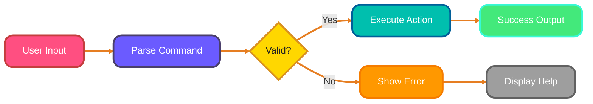
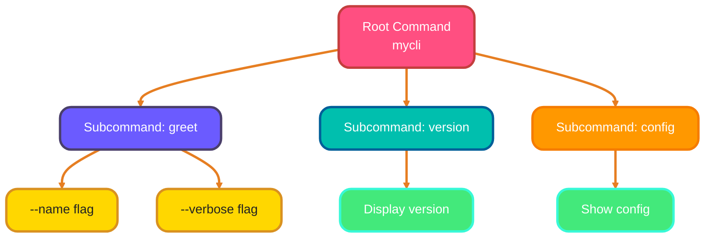
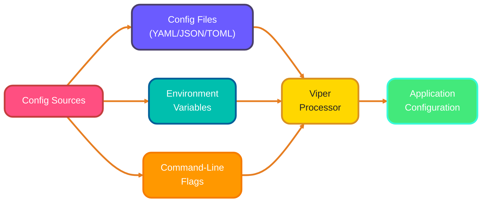
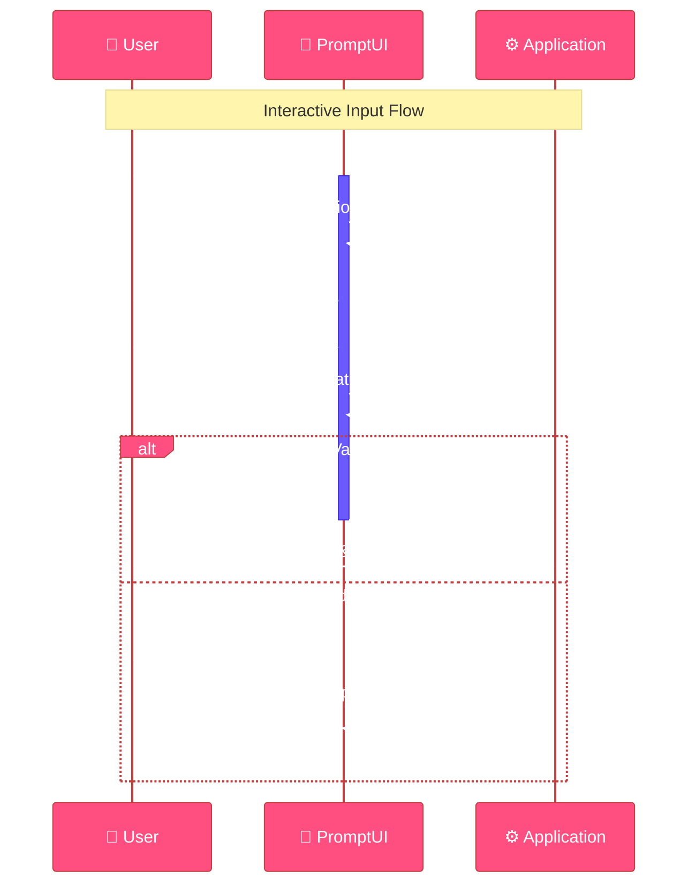
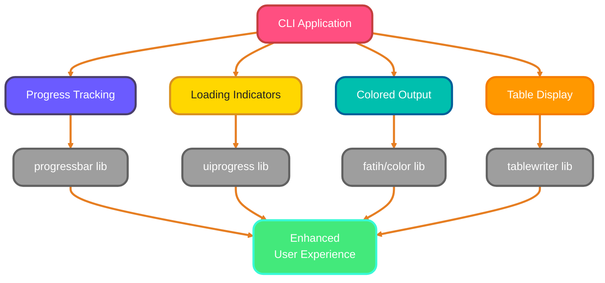
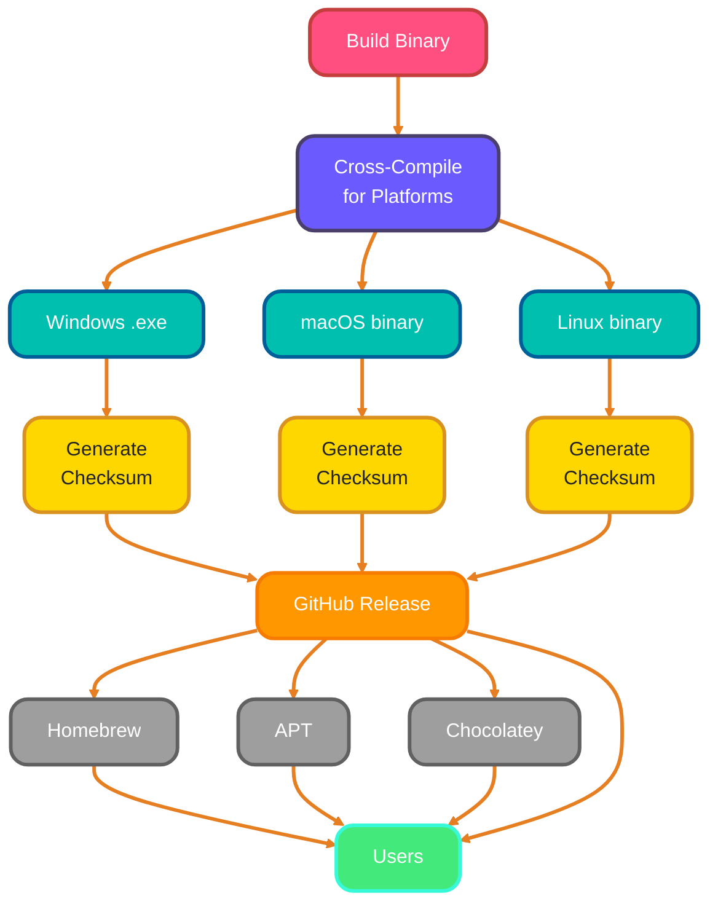

<!--
meta-description: "Complete guide to building command-line tools in Go: CLI design principles, Cobra framework, Viper configuration management, interactive prompts with PromptUI, progress bars, colored output, and distribution strategies for professional CLI applications."
keywords: "Go CLI, Cobra framework, Viper configuration, command-line tools, Go terminal applications, PromptUI, CLI design, Go flags, progress bars, CLI distribution, Go commands"
-->

# <span style="color:#e67e22;">What we will learn in this post?</span>
<ul style='list-style-type: none; padding-left: 0;'>
<li><span style='color: #2980b9; font-size: 20px; font-weight: bold;'>👉</span> <span style='color: #2ecc71; font-size: 18px; font-weight: bold;'>CLI Design Principles</span></li>
<li><span style='color: #2980b9; font-size: 20px; font-weight: bold;'>👉</span> <span style='color: #2ecc71; font-size: 18px; font-weight: bold;'>Using Cobra Framework</span></li>
<li><span style='color: #2980b9; font-size: 20px; font-weight: bold;'>👉</span> <span style='color: #2ecc71; font-size: 18px; font-weight: bold;'>Configuration Management</span></li>
<li><span style='color: #2980b9; font-size: 20px; font-weight: bold;'>👉</span> <span style='color: #2ecc71; font-size: 18px; font-weight: bold;'>Interactive Prompts and Input</span></li>
<li><span style='color: #2980b9; font-size: 20px; font-weight: bold;'>👉</span> <span style='color: #2ecc71; font-size: 18px; font-weight: bold;'>Progress Bars and Output Formatting</span></li>
<li><span style='color: #2980b9; font-size: 20px; font-weight: bold;'>👉</span> <span style='color: #2ecc71; font-size: 18px; font-weight: bold;'>Distribution and Updates</span></li>
</ul>

# <span style="color:#e67e22">Principles for Good CLI Design</span> 🚀

Creating a Command Line Interface (CLI) that users love is all about **simplicity** and **clarity**. Professional tools like Docker, Git, and kubectl all follow these core design principles.

## <span style="color:#2980b9">1. Clear Command Structure</span> 🗂️

A clear command structure helps users understand how to use your CLI. For example:

```bash
# Correct usage
mycli list --all
```

### <span style="color:#8e44ad">2. Helpful Error Messages</span> ❌

When something goes wrong, provide clear feedback:

```bash
# Error message example
Error: Invalid command 'xyz'. Use 'mycli help' for a list of commands.
```

## <span style="color:#2980b9">3. Consistent Flag Naming</span> 🏷️

Use consistent naming for flags to avoid confusion:

```bash
# Consistent flag usage
mycli --verbose
mycli --quiet
```

## <span style="color:#2980b9">4. UNIX Philosophy</span> 💡

Follow the UNIX philosophy: **do one thing well**. Each command should focus on a single task.

## <span style="color:#2980b9">5. stdin/stdout Usage</span> 🔄

Utilize standard input and output for flexibility:

```bash
# Using stdin and stdout
cat file.txt | mycli process
```

## <span style="color:#2980b9">6. Exit Codes</span> ✅

Use exit codes to indicate success or failure:

```bash
# Exit code example
exit 0  # Success
exit 1  # Error
```

### <span style="color:#8e44ad">User Experience Considerations</span> 😊

- **Intuitive Commands**: Make commands easy to remember.
- **Documentation**: Provide clear help and usage instructions.
- **Feedback**: Give users feedback on their actions.

For more in-depth reading, check out [CLI Design Best Practices](https://example.com).



By following these principles, you can create a CLI that is not only functional but also enjoyable to use!

# <span style="color:#e67e22">Building CLI Applications with Cobra Framework</span> 🚀

Creating a Command Line Interface (CLI) app with the **Cobra** framework is fun and straightforward! Cobra powers major tools like kubectl, Hugo, and GitHub CLI.



## <span style="color:#2980b9">Basic Structure</span>

Here's a simple structure for your CLI app:

```
myapp/
├── main.go
└── cmd/
    ├── root.go
    ├── greet.go
    └── version.go
```

### <span style="color:#8e44ad">Setting Up Your App</span>

1. **Install Cobra**:
   ```bash
   go get -u github.com/spf13/cobra@latest
   ```

2. **Create the Root Command**:
   In `root.go`:
   ```go
   var rootCmd = &cobra.Command{
       Use:   "myapp",
       Short: "My CLI Application",
       Long:  "This is a simple CLI application built with Cobra.",
   }
   ```

3. **Add Subcommands**:
   In `greet.go`:
   ```go
   var greetCmd = &cobra.Command{
       Use:   "greet",
       Short: "Greet someone",
       Run: func(cmd *cobra.Command, args []string) {
           fmt.Println("Hello, " + args[0])
       },
   }
   ```

4. **Define Flags**:
   ```go
   greetCmd.Flags().StringP("name", "n", "World", "Name to greet")
   ```

5. **Group Commands**:
   You can group commands logically for better organization.

## <span style="color:#2980b9">Real-World Example: Task Management CLI</span>

Here's a production-ready task management tool using Cobra:

```go
package main

import (
    "fmt"
    "github.com/spf13/cobra"
    "os"
)

var rootCmd = &cobra.Command{
    Use:   "taskmgr",
    Short: "Task Management CLI",
    Long:  "A production-ready task management tool built with Cobra",
}

var addCmd = &cobra.Command{
    Use:   "add [task description]",
    Short: "Add a new task",
    Args:  cobra.MinimumNArgs(1),
    Run: func(cmd *cobra.Command, args []string) {
        task := args[0]
        priority, _ := cmd.Flags().GetString("priority")
        fmt.Printf("✓ Added task: %s (Priority: %s)\n", task, priority)
    },
}

var listCmd = &cobra.Command{
    Use:   "list",
    Short: "List all tasks",
    Run: func(cmd *cobra.Command, args []string) {
        completed, _ := cmd.Flags().GetBool("completed")
        if completed {
            fmt.Println("Completed tasks:")
        } else {
            fmt.Println("Active tasks:")
        }
        fmt.Println("1. Write documentation")
        fmt.Println("2. Fix bug #123")
    },
}

func init() {
    addCmd.Flags().StringP("priority", "p", "medium", "Task priority (low/medium/high)")
    listCmd.Flags().BoolP("completed", "c", false, "Show completed tasks")
    
    rootCmd.AddCommand(addCmd)
    rootCmd.AddCommand(listCmd)
}

func main() {
    if err := rootCmd.Execute(); err != nil {
        fmt.Println(err)
        os.Exit(1)
    }
}
```

### <span style="color:#2980b9">Help Text</span>

Cobra automatically generates help text! Just run:
```bash
myapp help
```

### <span style="color:#8e44ad">Resources</span>

- [Cobra Documentation](https://github.com/spf13/cobra)
- [Go Documentation](https://golang.org/doc/)

With this setup, you can create powerful CLI applications easily! Happy coding! 🎉

# <span style="color:#e67e22">Managing Configuration with Viper</span> 🌟

Viper is a powerful library in Go for managing configuration. It's the same library used by Hugo and Cobra for configuration management.



## <span style="color:#2980b9">Reading Config Files 📄</span>

Viper supports multiple formats such as **JSON**, **YAML**, and **TOML**. Here’s how to read a YAML file:

```go
viper.SetConfigName("config") // name of config file (without extension)
viper.SetConfigType("yaml")    // or "json", "toml"
viper.AddConfigPath(".")       // path to look for the config file
err := viper.ReadInConfig()     // read the config
if err != nil {
    log.Fatal(err)
}
```

## <span style="color:#2980b9">Environment Variables 🌍</span>

You can also set configurations using environment variables. Viper automatically reads them if you set them up correctly. For example, if you have a variable `MYAPP_PORT`, you can access it like this:

```go
port := viper.GetString("port")
```

## <span style="color:#2980b9">Command-Line Flags 🎛️</span>

Viper works well with command-line flags. You can bind flags to Viper like this:

```go
flag.String("port", "8080", "Port to run the application")
viper.BindPFlag("port", flag.Lookup("port"))
```

## <span style="color:#2980b9">Configuration Precedence ⚖️</span>

Viper follows a specific order of precedence:
1. Command-line flags
2. Environment variables
3. Config files

This means if a value is set in multiple places, the last one wins!

## <span style="color:#2980b9">Watching for Changes 👀</span>

You can watch for changes in your config file and reload automatically:

```go
viper.WatchConfig()
viper.OnConfigChange(func(e fsnotify.Event) {
    fmt.Println("Config file changed:", e.Name)
})
```

## <span style="color:#2980b9">Real-World Example: API Client Configuration</span>

Here's a production-ready configuration setup for an API client:

```go
package main

import (
    "fmt"
    "github.com/spf13/viper"
    "log"
)

type APIConfig struct {
    Host     string
    Port     int
    APIKey   string
    Timeout  int
    Debug    bool
}

func LoadConfig() (*APIConfig, error) {
    // Set defaults
    viper.SetDefault("host", "api.example.com")
    viper.SetDefault("port", 443)
    viper.SetDefault("timeout", 30)
    viper.SetDefault("debug", false)

    // Config file
    viper.SetConfigName("config")
    viper.SetConfigType("yaml")
    viper.AddConfigPath(".")
    viper.AddConfigPath("$HOME/.myapp")

    // Environment variables
    viper.SetEnvPrefix("MYAPP")
    viper.AutomaticEnv()

    // Read config
    if err := viper.ReadInConfig(); err != nil {
        if _, ok := err.(viper.ConfigFileNotFoundError); !ok {
            return nil, err
        }
    }

    // Watch for changes
    viper.WatchConfig()

    config := &APIConfig{
        Host:    viper.GetString("host"),
        Port:    viper.GetInt("port"),
        APIKey:  viper.GetString("apikey"),
        Timeout: viper.GetInt("timeout"),
        Debug:   viper.GetBool("debug"),
    }

    return config, nil
}

func main() {
    config, err := LoadConfig()
    if err != nil {
        log.Fatal(err)
    }

    fmt.Printf("API Host: %s:%d\n", config.Host, config.Port)
    fmt.Printf("Debug Mode: %v\n", config.Debug)
}
```

## <span style="color:#2980b9">Resources 📚</span>

- [Viper GitHub Repository](https://github.com/spf13/viper)
- [Viper Documentation](https://github.com/spf13/viper#readme)

With Viper, managing your app's configuration becomes a breeze! Happy coding! 🎉

# <span style="color:#e67e22">Creating Interactive CLI Experiences</span> 🎉

Creating interactive command-line interfaces (CLI) can be fun and engaging! Libraries like PromptUI bring the same user experience as tools like npm init and create-react-app.



    end
```

## <span style="color:#2980b9">Using PromptUI Library</span>

### <span style="color:#8e44ad">Input Types</span>

You can implement various input types:

- **Text Input**: For general text.
- **Select**: For choosing from options.
- **Confirm**: For yes/no questions.
- **Password**: For sensitive information.

### <span style="color:#8e44ad">Example Code</span>

Here’s a simple example using **PromptUI**:

```go
package main

import (
    "fmt"
    "github.com/manifoldco/promptui"
)

func main() {
    // Text Input
    prompt := promptui.Prompt{
        Label: "Enter your name",
    }
    name, _ := prompt.Run()

    // Select Input
    selectPrompt := promptui.Select{
        Label: "Choose a color",
        Items: []string{"Red", "Green", "Blue"},
    }
    _, color, _ := selectPrompt.Run()

    // Confirm Input
    confirmPrompt := promptui.Prompt{
        Label:     "Continue?",
        IsConfirm: true,
    }
    _, err := confirmPrompt.Run()
    if err != nil {
        fmt.Println("Cancelled")
        return
    }

    fmt.Printf("Hello %s! You chose %s.\n", name, color)
}
```

### <span style="color:#8e44ad">Real-World Example: Project Initializer</span>

Here's a complete project setup wizard using PromptUI:

```go
package main

import (
    "fmt"
    "github.com/manifoldco/promptui"
    "strings"
)

type ProjectConfig struct {
    Name        string
    Type        string
    Language    string
    UseDocker   bool
    UseCI       bool
}

func main() {
    config := &ProjectConfig{}

    // Project name with validation
    namePrompt := promptui.Prompt{
        Label: "Project Name",
        Validate: func(input string) error {
            if len(input) < 3 {
                return fmt.Errorf("name must be at least 3 characters")
            }
            return nil
        },
    }
    name, _ := namePrompt.Run()
    config.Name = name

    // Project type selection
    typePrompt := promptui.Select{
        Label: "Select Project Type",
        Items: []string{"Web Application", "CLI Tool", "Library", "Microservice"},
    }
    _, projectType, _ := typePrompt.Run()
    config.Type = projectType

    // Language selection
    langPrompt := promptui.Select{
        Label: "Select Programming Language",
        Items: []string{"Go", "Python", "JavaScript", "Rust"},
    }
    _, lang, _ := langPrompt.Run()
    config.Language = lang

    // Docker confirmation
    dockerPrompt := promptui.Prompt{
        Label:     "Add Docker support",
        IsConfirm: true,
    }
    _, err := dockerPrompt.Run()
    config.UseDocker = (err == nil)

    // CI/CD confirmation
    ciPrompt := promptui.Prompt{
        Label:     "Setup CI/CD",
        IsConfirm: true,
    }
    _, err = ciPrompt.Run()
    config.UseCI = (err == nil)

    // Display summary
    fmt.Println("\n✓ Project Configuration:")
    fmt.Printf("  Name: %s\n", config.Name)
    fmt.Printf("  Type: %s\n", config.Type)
    fmt.Printf("  Language: %s\n", config.Language)
    fmt.Printf("  Docker: %v\n", config.UseDocker)
    fmt.Printf("  CI/CD: %v\n", config.UseCI)
}
```

### <span style="color:#8e44ad">Input Validation</span>

You can add validation to ensure correct input. For example, check if the name is not empty.

### <span style="color:#8e44ad">Handling Interrupts</span>

Use `os.Interrupt` to gracefully handle user interrupts.

### <span style="color:#2980b9">Resources</span>

- [PromptUI Documentation](https://github.com/manifoldco/promptui)
- [Survey Documentation](https://github.com/AlecAivazis/survey)

Creating interactive CLI applications can enhance user experience. Happy coding! 🚀

# <span style="color:#e67e22">Creating Polished CLI Output</span> 🎨

Creating a great Command Line Interface (CLI) can be fun! Professional tools like Docker, Terraform, and npm use these libraries to provide rich visual feedback.



## <span style="color:#2980b9">Adding Progress Bars</span> ⏳

Using progress bars helps users see how much work is done. Here’s a simple example using the **progressbar** library:

```go
package main

import (
    "github.com/schollz/progressbar/v3"
    "time"
)

func main() {
    bar := progressbar.New(100)
    for i := 0; i < 100; i++ {
        time.Sleep(50 * time.Millisecond)
        bar.Add(1)
    }
}
```

### <span style="color:#8e44ad">Using Spinner Indicators</span> 🔄

Spinners keep users engaged while waiting. You can use the **uiprogress** library for this:

```go
package main

import (
    "github.com/gosuri/uiprogress"
    "time"
)

func main() {
    uiprogress.Start()
    spinner := uiprogress.AddSpinner()
    spinner.Start()
    time.Sleep(3 * time.Second)
    spinner.Stop()
}
```

## <span style="color:#2980b9">Colored Output</span> 🎨

With **fatih/color**, you can add colors to your text:

```go
package main

import (
    "github.com/fatih/color"
)

func main() {
    color.Red("This is red text!")
    color.Green("This is green text!")
}
```

## <span style="color:#8e44ad">Table Formatting</span> 📊

Tables make data easy to read. Use libraries like **tablewriter**:

```go
package main

import (
    "github.com/olekukonko/tablewriter"
    "os"
)

func main() {
    table := tablewriter.NewWriter(os.Stdout)
    table.SetHeader([]string{"Name", "Age"})
    table.Append([]string{"Alice", "30"})
    table.Render()
}
```

## <span style="color:#2980b9">Real-World Example: File Processor with Rich Output</span>

Here's a production-ready file processor with progress bars, colors, and tables:

```go
package main

import (
    "fmt"
    "github.com/fatih/color"
    "github.com/olekukonko/tablewriter"
    "github.com/schollz/progressbar/v3"
    "os"
    "time"
)

type FileStats struct {
    Name      string
    Size      int64
    Processed bool
    Duration  time.Duration
}

func main() {
    color.Cyan("🚀 Starting File Processor...\n\n")

    files := []string{"data1.csv", "data2.csv", "data3.csv", "data4.csv", "data5.csv"}
    stats := []FileStats{}

    // Progress bar
    bar := progressbar.NewOptions(len(files),
        progressbar.OptionEnableColorCodes(true),
        progressbar.OptionShowCount(),
        progressbar.OptionSetWidth(40),
        progressbar.OptionSetDescription("[cyan]Processing files...[reset]"),
        progressbar.OptionSetTheme(progressbar.Theme{
            Saucer:        "[green]=[reset]",
            SaucerHead:    "[green]>[reset]",
            SaucerPadding: " ",
            BarStart:      "[",
            BarEnd:        "]",
        }))

    for _, file := range files {
        start := time.Now()
        
        // Simulate processing
        time.Sleep(500 * time.Millisecond)
        
        stats = append(stats, FileStats{
            Name:      file,
            Size:      1024 * (int64(len(file)) * 100),
            Processed: true,
            Duration:  time.Since(start),
        })
        
        bar.Add(1)
    }

    fmt.Println("\n")
    color.Green("✓ Processing Complete!\n\n")

    // Display results in table
    table := tablewriter.NewWriter(os.Stdout)
    table.SetHeader([]string{"File", "Size (KB)", "Status", "Duration"})
    table.SetBorder(true)
    table.SetRowLine(true)
    table.SetHeaderColor(
        tablewriter.Colors{tablewriter.Bold, tablewriter.FgCyanColor},
        tablewriter.Colors{tablewriter.Bold, tablewriter.FgCyanColor},
        tablewriter.Colors{tablewriter.Bold, tablewriter.FgCyanColor},
        tablewriter.Colors{tablewriter.Bold, tablewriter.FgCyanColor},
    )

    for _, stat := range stats {
        status := "✓ Done"
        table.Append([]string{
            stat.Name,
            fmt.Sprintf("%d", stat.Size/1024),
            status,
            fmt.Sprintf("%dms", stat.Duration.Milliseconds()),
        })
    }

    table.Render()

    // Summary with colors
    color.Yellow("\n📊 Summary:\n")
    fmt.Printf("Total Files: %s\n", color.CyanString("%d", len(stats)))
    fmt.Printf("Success Rate: %s\n", color.GreenString("100%%"))
    fmt.Printf("Total Size: %s\n", color.MagentaString("%.2f MB", float64(sumSizes(stats))/1024/1024))
}

func sumSizes(stats []FileStats) int64 {
    var total int64
    for _, s := range stats {
        total += s.Size
    }
    return total
}
```

### <span style="color:#2980b9">Conclusion</span> 🎉

By combining these tools, you can create a polished CLI that is user-friendly and visually appealing. For more details, check out the following resources:

- [Progressbar Library](https://github.com/schollz/progressbar)
- [Uiprogress Library](https://github.com/gosuri/uiprogress)
- [Fatih Color Library](https://github.com/fatih/color)
- [Tablewriter Library](https://github.com/olekukonko/tablewriter)

Happy coding! 😊

# <span style="color:#e67e22">Distributing CLI Tools Made Easy 🚀</span>

Distributing your Command Line Interface (CLI) tools can be simple and effective! Tools like kubectl, gh, and terraform all use these strategies for cross-platform distribution.



## <span style="color:#2980b9">1. GitHub Releases 📦</span>

- **Create a Release**: Use GitHub to package your tool. 
- **Upload Binaries**: Add your compiled binaries for different platforms.
- **Tag Your Release**: This helps users find the right version easily.

## <span style="color:#2980b9">2. Package Managers 🛠️</span>

- **Homebrew (macOS)**: Create a formula for easy installation.
- **APT (Linux)**: Make a `.deb` package for Debian-based systems.
  
### <span style="color:#8e44ad">Example for Homebrew:</span>

```bash
brew install your-tool
```

## <span style="color:#2980b9">3. Cross-Compilation 🌍</span>

- **Build for Multiple Platforms**: Use tools like `Go` to compile your tool for Windows, macOS, and Linux from one codebase.

## <span style="color:#2980b9">4. Checksums for Verification 🔒</span>

- **Generate Checksums**: Provide checksums for your binaries to ensure integrity.
- **Example Command**: 
```bash
shasum -a 256 your-tool
```

## <span style="color:#2980b9">5. Self-Update Functionality 🔄</span>

- **Use go-update Library**: Implement self-update features in your CLI tool.
- **Keep Users Updated**: Automatically check for new versions and update seamlessly.

## <span style="color:#2980b9">Real-World Example: Cross-Platform Build Script</span>

Here's a production-ready Makefile for cross-compilation and distribution:

```makefile
APP_NAME := mytool
VERSION := 1.0.0
BUILD_DIR := dist
PLATFORMS := darwin/amd64 darwin/arm64 linux/amd64 linux/arm64 windows/amd64

.PHONY: build
build:
	@echo "Building $(APP_NAME) v$(VERSION)..."
	@mkdir -p $(BUILD_DIR)
	@for platform in $(PLATFORMS); do \
		GOOS=$${platform%/*} GOARCH=$${platform#*/} \
		go build -ldflags="-s -w -X main.version=$(VERSION)" \
		-o $(BUILD_DIR)/$(APP_NAME)-$${platform%/*}-$${platform#*/} main.go; \
		echo "✓ Built $${platform%/*}-$${platform#*/}"; \
	done

.PHONY: checksums
checksums:
	@echo "Generating checksums..."
	@cd $(BUILD_DIR) && sha256sum * > checksums.txt
	@echo "✓ Checksums generated"

.PHONY: release
release: build checksums
	@echo "Creating GitHub release v$(VERSION)..."
	@gh release create v$(VERSION) $(BUILD_DIR)/* \
		--title "Release v$(VERSION)" \
		--notes "Release notes here"
	@echo "✓ Release created"

.PHONY: clean
clean:
	@rm -rf $(BUILD_DIR)
	@echo "✓ Cleaned build directory"
```

Here's the Go code with self-update functionality:

```go
package main

import (
    "fmt"
    "github.com/inconshreveable/go-update"
    "io"
    "net/http"
)

var version = "1.0.0"

func checkForUpdates() error {
    resp, err := http.Get("https://api.github.com/repos/user/mytool/releases/latest")
    if err != nil {
        return err
    }
    defer resp.Body.Close()

    // Parse response and check version
    // If new version available, download and update
    
    return nil
}

func performUpdate(downloadURL string) error {
    resp, err := http.Get(downloadURL)
    if err != nil {
        return err
    }
    defer resp.Body.Close()

    err = update.Apply(resp.Body, update.Options{})
    if err != nil {
        return err
    }

    fmt.Println("✓ Update successful! Restart the application.")
    return nil
}

func main() {
    fmt.Printf("mytool v%s\n", version)
    
    // Check for updates
    if err := checkForUpdates(); err != nil {
        fmt.Printf("Update check failed: %v\n", err)
    }
}
```

### <span style="color:#8e44ad">Resources</span>

For more detailed guides, check out [GitHub Docs](https://docs.github.com/en/repositories/releasing-projects-on-github) and [Go Documentation](https://golang.org/doc/).

---

## 🧠 Test Your Knowledge











---

<details style='border: 2px solid #6b5bff; border-radius: 8px; padding: 20px; background: linear-gradient(135deg, #ede9ff 0%, #fff 100%); margin: 25px 0; box-shadow: 0 6px 12px rgba(107, 91, 255, 0.15);'>
<summary style='cursor: pointer; font-size: 1.3em; font-weight: bold; color: #6b5bff; padding: 10px 0;'>
🎯 Hands-On Assignment: Build a System Monitoring CLI Tool 🚀
</summary>

<div style='margin-top: 20px; color: #2c3e50; line-height: 1.6;'>

<h3 style='color: #6b5bff; border-bottom: 2px solid #6b5bff; padding-bottom: 8px; margin-top: 20px;'>📝 Your Mission</h3>

Create a production-ready CLI tool called <code>sysmon</code> that monitors system resources (CPU, memory, disk) with Cobra commands, Viper configuration, colored output, and progress bars.

<h3 style='color: #6b5bff; border-bottom: 2px solid #6b5bff; padding-bottom: 8px; margin-top: 20px;'>🎯 Requirements</h3>

<ol style='margin-left: 20px;'>
<li><strong>Cobra Commands</strong>: Implement the following commands:
  <ul style='margin-left: 20px; margin-top: 8px;'>
    <li><code>sysmon status</code> - Show current system status</li>
    <li><code>sysmon watch</code> - Continuously monitor (with refresh interval flag)</li>
    <li><code>sysmon report</code> - Generate a detailed report</li>
  </ul>
</li>
<li><strong>Viper Configuration</strong>: Support config file (YAML) with:
  <ul style='margin-left: 20px; margin-top: 8px;'>
    <li>Refresh interval (default: 2 seconds)</li>
    <li>Alert thresholds (CPU: 80%, Memory: 85%, Disk: 90%)</li>
    <li>Output format (table, json, or colored)</li>
  </ul>
</li>
<li><strong>System Metrics</strong>: Collect and display:
  <ul style='margin-left: 20px; margin-top: 8px;'>
    <li>CPU usage percentage</li>
    <li>Memory usage (used/total)</li>
    <li>Disk usage for root partition</li>
    <li>Number of running processes</li>
  </ul>
</li>
<li><strong>Rich Output</strong>:
  <ul style='margin-left: 20px; margin-top: 8px;'>
    <li>Use <code>tablewriter</code> for status display</li>
    <li>Use <code>fatih/color</code> for warnings (orange) and errors (red)</li>
    <li>Use <code>progressbar</code> for resource usage bars</li>
  </ul>
</li>
<li><strong>Flags</strong>: Add command-line flags:
  <ul style='margin-left: 20px; margin-top: 8px;'>
    <li><code>--interval, -i</code> - Refresh interval for watch mode</li>
    <li><code>--format, -f</code> - Output format (table/json/colored)</li>
    <li><code>--alert</code> - Enable alert mode (show warnings when thresholds exceeded)</li>
  </ul>
</li>
</ol>

<h3 style='color: #6b5bff; border-bottom: 2px solid #6b5bff; padding-bottom: 8px; margin-top: 25px;'>💡 Implementation Hints</h3>

<ol style='margin-left: 20px;'>
<li>Use <code>github.com/shirou/gopsutil/v3</code> library for system metrics:
<pre style='background: #2c3e50; color: #ecf0f1; padding: 15px; border-radius: 8px; margin: 10px 0;'><code class='language-go'>import (
    "github.com/shirou/gopsutil/v3/cpu"
    "github.com/shirou/gopsutil/v3/mem"
    "github.com/shirou/gopsutil/v3/disk"
)

// Get CPU percentage
cpuPercent, _ := cpu.Percent(time.Second, false)

// Get memory info
memInfo, _ := mem.VirtualMemory()
fmt.Printf("Memory: %.2f%%\n", memInfo.UsedPercent)

// Get disk usage
diskInfo, _ := disk.Usage("/")
fmt.Printf("Disk: %.2f%%\n", diskInfo.UsedPercent)
</code></pre>
</li>
<li>Create a Cobra root command with version info and global flags</li>
<li>Use Viper to load default config from <code>~/.sysmon/config.yaml</code></li>
<li>Implement continuous monitoring with <code>time.Ticker</code> in watch mode</li>
<li>Color-code output: green (0-60%), yellow (60-80%), red (>80%)</li>
</ol>

<h3 style='color: #6b5bff; border-bottom: 2px solid #6b5bff; padding-bottom: 8px; margin-top: 25px;'>🚀 Example Input/Output</h3>

<pre style='background: #2c3e50; color: #ecf0f1; padding: 20px; border-radius: 8px; overflow-x: auto; margin: 15px 0;'><code class='language-bash'>$ sysmon status
╭──────────────────────────────────────╮
│      System Status Report            │
╰──────────────────────────────────────╯
┌─────────────┬────────────┬──────────┐
│ Resource    │ Usage      │ Status   │
├─────────────┼────────────┼──────────┤
│ CPU         │ 45.2%      │ ✓ Normal │
│ Memory      │ 78.5%      │ ⚠ High   │
│ Disk        │ 65.0%      │ ✓ Normal │
│ Processes   │ 312        │ -        │
└─────────────┴────────────┴──────────┘

$ sysmon watch --interval 5 --alert
🔄 Monitoring system (refresh: 5s, press Ctrl+C to stop)

CPU    [████████░░░░░░░░░░] 42%
Memory [█████████████░░░░░] 68%
Disk   [████████████░░░░░░] 61%

⚠ Warning: Memory usage above 65%!
✓ All other resources within normal range
</code></pre>

<h3 style='color: #6b5bff; border-bottom: 2px solid #6b5bff; padding-bottom: 8px; margin-top: 25px;'>🏆 Bonus Challenges</h3>

<ul style='margin-left: 20px;'>
<li><strong>Level 2</strong>: Add <code>sysmon history</code> command that logs metrics to a SQLite database and displays trends</li>
<li><strong>Level 3</strong>: Implement export to JSON/CSV with <code>--export</code> flag</li>
<li><strong>Level 4</strong>: Add interactive mode using PromptUI to select which metrics to display</li>
<li><strong>Level 5</strong>: Implement self-update functionality to check and install new versions from GitHub releases</li>
<li><strong>Level 6</strong>: Cross-compile for multiple platforms and generate checksums automatically</li>
</ul>

<h3 style='color: #6b5bff; border-bottom: 2px solid #6b5bff; padding-bottom: 8px; margin-top: 25px;'>📚 Learning Goals</h3>

<ul style='margin-left: 20px;'>
<li>Master Cobra framework for building professional CLI tools 🎯</li>
<li>Implement Viper configuration with multiple sources (file, env, flags) ⚙️</li>
<li>Create rich terminal output with colors, tables, and progress bars ✨</li>
<li>Collect and display real-time system metrics 📊</li>
<li>Handle continuous monitoring with graceful shutdown 🔄</li>
</ul>

<p style='background: #3498db; color: #fff; padding: 15px; border-radius: 8px; margin-top: 20px; border-left: 5px solid #2980b9;'>
<strong>💡 Pro Tip:</strong> This pattern is used in popular tools like kubectl (Kubernetes), gh (GitHub CLI), and terraform! Production CLI tools prioritize user experience with clear output, helpful errors, and configurable behavior.
</p>

<p style='margin-top: 20px; font-size: 1.1em;'><strong>Share Your Solution! 💬</strong></p>
<p>Completed the project? <strong>Post your code in the comments below!</strong> Show us your Go CLI mastery! 🚀✨</p>

</div>
</details>

---

# <span style="color:#e67e22">Conclusion</span> 🎯

Building command-line tools in Go with Cobra, Viper, and output libraries creates professional, user-friendly applications. Apply these patterns to build your next CLI tool!

