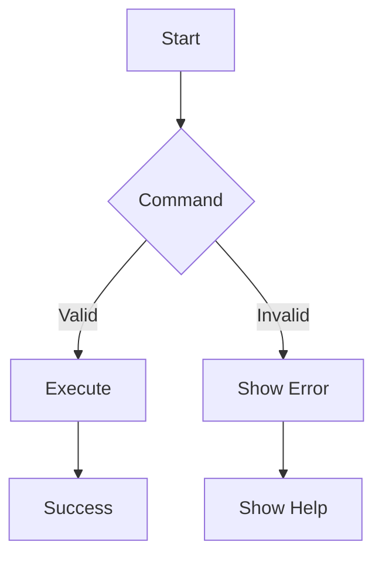
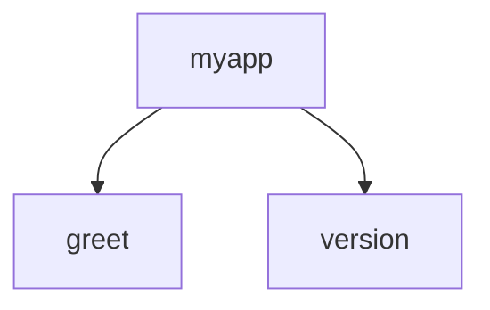
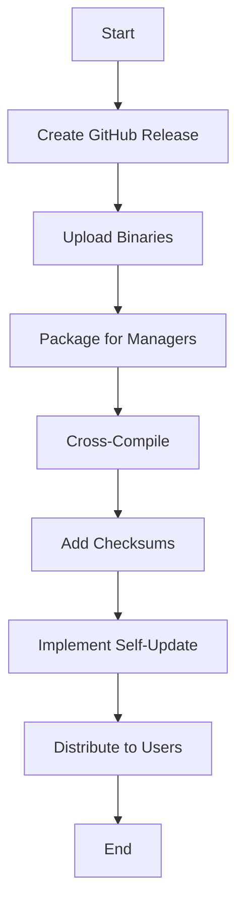

Error: API request failed with error: 401 Client Error: Unauthorized for url: https://openrouter.ai/api/v1/chat/completions

# <span style="color:#e67e22;">What we will learn in this post?</span>
<ul style='list-style-type: none; padding-left: 0;'>
<li><span style='color: #2980b9; font-size: 20px; font-weight: bold;'>👉</span> <span style='color: #2ecc71; font-size: 18px; font-weight: bold;'>CLI Design Principles</span></li>
<li><span style='color: #2980b9; font-size: 20px; font-weight: bold;'>👉</span> <span style='color: #2ecc71; font-size: 18px; font-weight: bold;'>Using Cobra Framework</span></li>
<li><span style='color: #2980b9; font-size: 20px; font-weight: bold;'>👉</span> <span style='color: #2ecc71; font-size: 18px; font-weight: bold;'>Configuration Management</span></li>
<li><span style='color: #2980b9; font-size: 20px; font-weight: bold;'>👉</span> <span style='color: #2ecc71; font-size: 18px; font-weight: bold;'>Interactive Prompts and Input</span></li>
<li><span style='color: #2980b9; font-size: 20px; font-weight: bold;'>👉</span> <span style='color: #2ecc71; font-size: 18px; font-weight: bold;'>Progress Bars and Output Formatting</span></li>
<li><span style='color: #2980b9; font-size: 20px; font-weight: bold;'>👉</span> <span style='color: #2ecc71; font-size: 18px; font-weight: bold;'>Distribution and Updates</span></li>
</ul>

# <span style="color:#e67e22">Principles for Good CLI Design</span> 🚀

Creating a Command Line Interface (CLI) that users love is all about **simplicity** and **clarity**. Here are some key principles to keep in mind:

## <span style="color:#2980b9">1. Clear Command Structure</span> 🗂️

A clear command structure helps users understand how to use your CLI. For example:

```bash
# Correct usage
mycli list --all
```

### <span style="color:#8e44ad">2. Helpful Error Messages</span> ❌

When something goes wrong, provide clear feedback:

```bash
# Error message example
Error: Invalid command 'xyz'. Use 'mycli help' for a list of commands.
```

## <span style="color:#2980b9">3. Consistent Flag Naming</span> 🏷️

Use consistent naming for flags to avoid confusion:

```bash
# Consistent flag usage
mycli --verbose
mycli --quiet
```

## <span style="color:#2980b9">4. UNIX Philosophy</span> 💡

Follow the UNIX philosophy: **do one thing well**. Each command should focus on a single task.

## <span style="color:#2980b9">5. stdin/stdout Usage</span> 🔄

Utilize standard input and output for flexibility:

```bash
# Using stdin and stdout
cat file.txt | mycli process
```

## <span style="color:#2980b9">6. Exit Codes</span> ✅

Use exit codes to indicate success or failure:

```bash
# Exit code example
exit 0  # Success
exit 1  # Error
```

### <span style="color:#8e44ad">User Experience Considerations</span> 😊

- **Intuitive Commands**: Make commands easy to remember.
- **Documentation**: Provide clear help and usage instructions.
- **Feedback**: Give users feedback on their actions.

For more in-depth reading, check out [CLI Design Best Practices](https://example.com).



By following these principles, you can create a CLI that is not only functional but also enjoyable to use!

# <span style="color:#e67e22">Building CLI Applications with Cobra Framework</span> 🚀

Creating a Command Line Interface (CLI) app with the **Cobra** framework is fun and straightforward! Let’s dive into the essentials.

## <span style="color:#2980b9">Basic Structure</span>

Here's a simple structure for your CLI app:

```
myapp/
├── main.go
└── cmd/
    ├── root.go
    ├── greet.go
    └── version.go
```

### <span style="color:#8e44ad">Setting Up Your App</span>

1. **Install Cobra**:
   ```bash
   go get -u github.com/spf13/cobra@latest
   ```

2. **Create the Root Command**:
   In `root.go`:
   ```go
   var rootCmd = &cobra.Command{
       Use:   "myapp",
       Short: "My CLI Application",
       Long:  "This is a simple CLI application built with Cobra.",
   }
   ```

3. **Add Subcommands**:
   In `greet.go`:
   ```go
   var greetCmd = &cobra.Command{
       Use:   "greet",
       Short: "Greet someone",
       Run: func(cmd *cobra.Command, args []string) {
           fmt.Println("Hello, " + args[0])
       },
   }
   ```

4. **Define Flags**:
   ```go
   greetCmd.Flags().StringP("name", "n", "World", "Name to greet")
   ```

5. **Group Commands**:
   You can group commands logically for better organization.

### <span style="color:#2980b9">Help Text</span>

Cobra automatically generates help text! Just run:
```bash
myapp help
```

### <span style="color:#8e44ad">Flowchart of Command Structure</span>



### <span style="color:#2980b9">Resources</span>

- [Cobra Documentation](https://github.com/spf13/cobra)
- [Go Documentation](https://golang.org/doc/)

With this setup, you can create powerful CLI applications easily! Happy coding! 🎉

# <span style="color:#e67e22">Managing Configuration with Viper</span> 🌟

Viper is a powerful library in Go for managing configuration. It helps you read settings from various sources like config files, environment variables, and command-line flags. Let’s break it down! 

## <span style="color:#2980b9">Reading Config Files 📄</span>

Viper supports multiple formats such as **JSON**, **YAML**, and **TOML**. Here’s how to read a YAML file:

```go
viper.SetConfigName("config") // name of config file (without extension)
viper.SetConfigType("yaml")    // or "json", "toml"
viper.AddConfigPath(".")       // path to look for the config file
err := viper.ReadInConfig()     // read the config
if err != nil {
    log.Fatal(err)
}
```

## <span style="color:#2980b9">Environment Variables 🌍</span>

You can also set configurations using environment variables. Viper automatically reads them if you set them up correctly. For example, if you have a variable `MYAPP_PORT`, you can access it like this:

```go
port := viper.GetString("port")
```

## <span style="color:#2980b9">Command-Line Flags 🎛️</span>

Viper works well with command-line flags. You can bind flags to Viper like this:

```go
flag.String("port", "8080", "Port to run the application")
viper.BindPFlag("port", flag.Lookup("port"))
```

## <span style="color:#2980b9">Configuration Precedence ⚖️</span>

Viper follows a specific order of precedence:
1. Command-line flags
2. Environment variables
3. Config files

This means if a value is set in multiple places, the last one wins!

## <span style="color:#2980b9">Watching for Changes 👀</span>

You can watch for changes in your config file and reload automatically:

```go
viper.WatchConfig()
viper.OnConfigChange(func(e fsnotify.Event) {
    fmt.Println("Config file changed:", e.Name)
})
```

## <span style="color:#2980b9">Resources 📚</span>

- [Viper GitHub Repository](https://github.com/spf13/viper)
- [Viper Documentation](https://github.com/spf13/viper#readme)

With Viper, managing your app's configuration becomes a breeze! Happy coding! 🎉

# <span style="color:#e67e22">Creating Interactive CLI Experiences</span> 🎉

## <span style="color:#2980b9">Using Survey and PromptUI Libraries</span>

Creating interactive command-line interfaces (CLI) can be fun and engaging! Here’s how to use **Survey** and **PromptUI** libraries in Go to gather user input.

### <span style="color:#8e44ad">Input Types</span>

You can implement various input types:

- **Text Input**: For general text.
- **Select**: For choosing from options.
- **Confirm**: For yes/no questions.
- **Password**: For sensitive information.

### <span style="color:#8e44ad">Example Code</span>

Here’s a simple example using **PromptUI**:

```go
package main

import (
    "fmt"
    "github.com/manifoldco/promptui"
)

func main() {
    // Text Input
    prompt := promptui.Prompt{
        Label: "Enter your name",
    }
    name, _ := prompt.Run()

    // Select Input
    selectPrompt := promptui.Select{
        Label: "Choose a color",
        Items: []string{"Red", "Green", "Blue"},
    }
    _, color, _ := selectPrompt.Run()

    // Confirm Input
    confirmPrompt := promptui.Prompt{
        Label:     "Continue?",
        IsConfirm: true,
    }
    _, err := confirmPrompt.Run()
    if err != nil {
        fmt.Println("Cancelled")
        return
    }

    fmt.Printf("Hello %s! You chose %s.\n", name, color)
}
```

### <span style="color:#8e44ad">Input Validation</span>

You can add validation to ensure correct input. For example, check if the name is not empty.

### <span style="color:#8e44ad">Handling Interrupts</span>

Use `os.Interrupt` to gracefully handle user interrupts.

### <span style="color:#2980b9">Resources</span>

- [PromptUI Documentation](https://github.com/manifoldco/promptui)
- [Survey Documentation](https://github.com/AlecAivazis/survey)

Creating interactive CLI applications can enhance user experience. Happy coding! 🚀

# <span style="color:#e67e22">Creating Polished CLI Output</span> 🎨

Creating a great Command Line Interface (CLI) can be fun! Let’s explore how to use libraries like **progressbar**, **uiprogress**, and **fatih/color** to make your CLI output look amazing! 🚀

## <span style="color:#2980b9">Adding Progress Bars</span> ⏳

Using progress bars helps users see how much work is done. Here’s a simple example using the **progressbar** library:

```go
package main

import (
    "github.com/schollz/progressbar/v3"
    "time"
)

func main() {
    bar := progressbar.New(100)
    for i := 0; i < 100; i++ {
        time.Sleep(50 * time.Millisecond)
        bar.Add(1)
    }
}
```

### <span style="color:#8e44ad">Using Spinner Indicators</span> 🔄

Spinners keep users engaged while waiting. You can use the **uiprogress** library for this:

```go
package main

import (
    "github.com/gosuri/uiprogress"
    "time"
)

func main() {
    uiprogress.Start()
    spinner := uiprogress.AddSpinner()
    spinner.Start()
    time.Sleep(3 * time.Second)
    spinner.Stop()
}
```

## <span style="color:#2980b9">Colored Output</span> 🎨

With **fatih/color**, you can add colors to your text:

```go
package main

import (
    "github.com/fatih/color"
)

func main() {
    color.Red("This is red text!")
    color.Green("This is green text!")
}
```

## <span style="color:#8e44ad">Table Formatting</span> 📊

Tables make data easy to read. Use libraries like **tablewriter**:

```go
package main

import (
    "github.com/olekukonko/tablewriter"
    "os"
)

func main() {
    table := tablewriter.NewWriter(os.Stdout)
    table.SetHeader([]string{"Name", "Age"})
    table.Append([]string{"Alice", "30"})
    table.Render()
}
```

### <span style="color:#2980b9">Conclusion</span> 🎉

By combining these tools, you can create a polished CLI that is user-friendly and visually appealing. For more details, check out the following resources:

- [Progressbar Library](https://github.com/schollz/progressbar)
- [Uiprogress Library](https://github.com/gosuri/uiprogress)
- [Fatih Color Library](https://github.com/fatih/color)
- [Tablewriter Library](https://github.com/olekukonko/tablewriter)

Happy coding! 😊

# <span style="color:#e67e22">Distributing CLI Tools Made Easy 🚀</span>

Distributing your Command Line Interface (CLI) tools can be simple and effective! Here are some friendly strategies to get you started.

## <span style="color:#2980b9">1. GitHub Releases 📦</span>

- **Create a Release**: Use GitHub to package your tool. 
- **Upload Binaries**: Add your compiled binaries for different platforms.
- **Tag Your Release**: This helps users find the right version easily.

## <span style="color:#2980b9">2. Package Managers 🛠️</span>

- **Homebrew (macOS)**: Create a formula for easy installation.
- **APT (Linux)**: Make a `.deb` package for Debian-based systems.
  
### <span style="color:#8e44ad">Example for Homebrew:</span>

```bash
brew install your-tool
```

## <span style="color:#2980b9">3. Cross-Compilation 🌍</span>

- **Build for Multiple Platforms**: Use tools like `Go` to compile your tool for Windows, macOS, and Linux from one codebase.

## <span style="color:#2980b9">4. Checksums for Verification 🔒</span>

- **Generate Checksums**: Provide checksums for your binaries to ensure integrity.
- **Example Command**: 
```bash
shasum -a 256 your-tool
```

## <span style="color:#2980b9">5. Self-Update Functionality 🔄</span>

- **Use go-update Library**: Implement self-update features in your CLI tool.
- **Keep Users Updated**: Automatically check for new versions and update seamlessly.

### <span style="color:#8e44ad">Flowchart of Distribution Process:</span>



For more detailed guides, check out [GitHub Docs](https://docs.github.com/en/repositories/releasing-projects-on-github) and [Go Documentation](https://golang.org/doc/). Happy coding! 🎉

