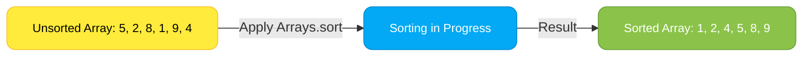
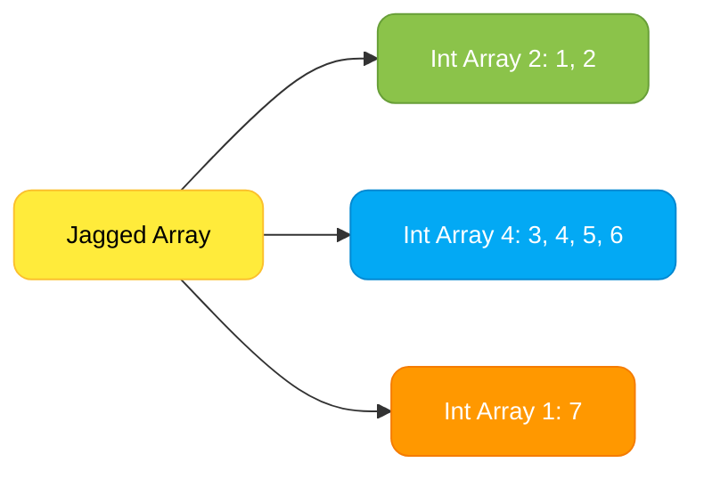
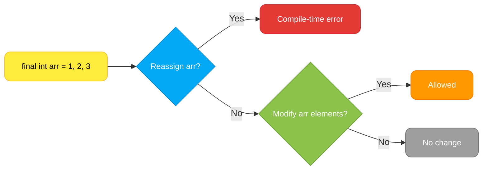

# <span style="color:#e67e22;">What we will learn in this post?</span>

<ul style='list-style-type: none; padding-left: 0;'>
<li><span style='color: #2980b9; font-size: 20px; font-weight: bold;'>👉</span> <span style='color: #2ecc71; font-size: 18px; font-weight: bold;'>Introduction to Arrays in Java</span></li>
<li><span style='color: #2980b9; font-size: 20px; font-weight: bold;'>👉</span> <span style='color: #2ecc71; font-size: 18px; font-weight: bold;'>Arrays Class in Java</span></li>
<li><span style='color: #2980b9; font-size: 20px; font-weight: bold;'>👉</span> <span style='color: #2ecc71; font-size: 18px; font-weight: bold;'>Multi-Dimensional Array in Java</span></li>
<li><span style='color: #2980b9; font-size: 20px; font-weight: bold;'>👉</span> <span style='color: #2ecc71; font-size: 18px; font-weight: bold;'>How to Declare and Initialize 2D Arrays in Java</span></li>
<li><span style='color: #2980b9; font-size: 20px; font-weight: bold;'>👉</span> <span style='color: #2ecc71; font-size: 18px; font-weight: bold;'>Jagged Array in Java</span></li>
<li><span style='color: #2980b9; font-size: 20px; font-weight: bold;'>👉</span> <span style='color: #2ecc71; font-size: 18px; font-weight: bold;'>Final Arrays in Java</span></li>
<li><span style='color: #2980b9; font-size: 20px; font-weight: bold;'>👉</span> <span style='color: #2ecc71; font-size: 18px; font-weight: bold;'>Reflect Arrays in Java</span></li>
<li><span style='color: #2980b9; font-size: 20px; font-weight: bold;'>👉</span> <span style='color: #2ecc71; font-size: 18px; font-weight: bold;'>Java Util.Arrays vs Reflect.Arrays</span></li>
<li><span style='color: #2980b9; font-size: 20px; font-weight: bold;'>👉</span> <span style='color: #2ecc71; font-size: 18px; font-weight: bold;'>Java Array Programs</span></li>
<li><span style='color: #2980b9; font-size: 20px; font-weight: bold;'>👉</span> <span style='color: #2ecc71; font-size: 18px; font-weight: bold;'>Conclusion!</span></li>
</ul>

# <span style="color:#e67e22">Java Arrays: The Basics 🧮</span>

## <span style="color:#2980b9">What are Java Arrays?</span>

Arrays in Java are used to store a _fixed-size_ sequence of elements of the _same data type_. Think of them as containers holding multiple values, all neatly organized. They're fundamental to 'working with arrays in Java' and mastering "Java array basics".

### <span style="color:#8e44ad">Key Characteristics</span>

- **Fixed Size:** Once created, the size of an array cannot be changed.
- **Homogeneous:** All elements must be of the same type (e.g., all integers, all strings).
- **Zero-based Indexing:** Elements are accessed using their index, starting from 0.

## <span style="color:#2980b9">Using Java Arrays</span>

Arrays are declared using the following syntax: `dataType[] arrayName = new dataType[size];` or `dataType[] arrayName = {element1, element2, ...};`

### <span style="color:#8e44ad">Simple Example</span>

```java
// Declaring and initializing an integer array
int[] numbers = new int[5]; // Creates an array that can hold 5 integers

// Assigning values to array elements
numbers[0] = 10;
numbers[1] = 20;
numbers[2] = 30;
numbers[3] = 40;
numbers[4] = 50;

// Accessing and printing array elements
System.out.println("The first element is: " + numbers[0]); //Output: 10

//Another way to initialize
String[] names = {"Alice", "Bob", "Charlie"};
System.out.println("The second name is: "+ names[1]); //Output: Bob

```

This simple example demonstrates the fundamental aspects of declaring, initializing, and accessing elements within a Java array. Remember that exceeding the array's bounds (e.g., trying to access `numbers[5]` in the example above) will result in an `ArrayIndexOutOfBoundsException`. For more advanced usage, explore topics like multi-dimensional arrays and array manipulation methods.
Please refer below link forfurthe details.

- [Oracle's Java Tutorials on Arrays](https://docs.oracle.com/javase/tutorial/java/nutsandbolts/arrays.html)

# <span style="color:#e67e22">Arrays Class in Java 🧰</span>

The `Arrays` class in Java provides a collection of static methods for manipulating arrays. It's a crucial tool for _array manipulation in Java_. This class simplifies common array operations, making your code cleaner and more efficient.

## <span style="color:#2980b9">Key Functionality ✨</span>

The `Arrays` class offers methods for:

- **Sorting:** `Arrays.sort()` sorts arrays in ascending order.
- **Searching:** `Arrays.binarySearch()` efficiently searches a _sorted_ array for a specific element.
- **Copying:** `Arrays.copyOf()` creates a new array with a specified size, copying elements from the original.
- **Filling:** `Arrays.fill()` sets all elements of an array to a specific value.
- **Comparing:** `Arrays.equals()` compares two arrays for equality.

### <span style="color:#8e44ad">Example: Sorting and Searching</span>

```java
import java.util.Arrays;

public class ArrayExample {
    public static void main(String[] args) {
        int[] numbers = {5, 2, 8, 1, 9, 4};

        // Sorting the array
        Arrays.sort(numbers);
        System.out.println("Sorted array: " + Arrays.toString(numbers)); // Output: Sorted array: [1, 2, 4, 5, 8, 9]

        // Searching for the number 8
        int index = Arrays.binarySearch(numbers, 8);
        System.out.println("Index of 8: " + index); // Output: Index of 8: 4
    }
}
```

## <span style="color:#2980b9"> Visual Representation of `Arrays.sort()` 📊</span>



**Note:** `Arrays.binarySearch()` requires a sorted array for optimal performance.

## <span style="color:#2980b9">Further Resources 📚</span>

- [Oracle Java Documentation on Arrays](https://docs.oracle.com/javase/8/docs/api/java/util/Arrays.html) Provides comprehensive details on all methods available in the `Arrays` class.

This overview gives you a strong foundation in using the **`Arrays` class in Java** for efficient **array manipulation in Java**. Remember to consult the official Java documentation for the most up-to-date information and detailed explanations.

# <span style="color:#e67e22">Multi-Dimensional Arrays in Java 🧮</span>

Multi-dimensional arrays in Java are arrays of arrays, allowing you to represent data in multiple dimensions (like a table or matrix). This is crucial for handling complex data structures. This guide covers working with 2D arrays in Java, a common use case.

## <span style="color:#2980b9">Understanding 2D Arrays 🗺️</span>

A 2D array is essentially a grid of elements. Think of it as a table with rows and columns. Each element is accessed using its row and column index.

### <span style="color:#8e44ad">Declaration and Initialization</span>

```java
int[][] matrix = new int[3][4]; // 3 rows, 4 columns
int[][] matrix2 = {
  {1, 2, 3, 4},
  {5, 6, 7, 8},
  {9, 10, 11, 12}
};
```

### <span style="color:#8e44ad">Accessing Elements</span>

Elements are accessed using `matrix[row][column]`. For example, `matrix2[1][2]` accesses the element at row 1, column 2 (which is 7).

## <span style="color:#2980b9">Code Example & Output 💻</span>

```java
public class TwoDArrayExample {
  public static void main(String[] args) {
    int[][] numbers = {
      {1, 2, 3},
      {4, 5, 6},
      {7, 8, 9}
    };

    System.out.println("Element at [1][2]: " + numbers[1][2]); // Output: 6
    System.out.println("Full array:");
    for (int i = 0; i < numbers.length; i++) {
      for (int j = 0; j < numbers[i].length; j++) {
        System.out.print(numbers[i][j] + " ");
      }
      System.out.println();
    }
  }
}
```

This code first initializes a 2D array named `numbers` and then prints a specific element and the entire array.

## <span style="color:#2980b9">Effective Use of 2D Arrays 👍</span>

- Represent matrices for mathematical operations.
- Store tabular data (e.g., spreadsheets).
- Create game boards (e.g., chess, tic-tac-toe).

For more advanced topics and examples on _multi-dimensional arrays in Java_ and _working with 2D arrays in Java_, explore the official Java documentation and numerous online tutorials. Remember to handle potential `ArrayIndexOutOfBoundsException` errors by carefully checking array bounds before accessing elements.

# <span style="color:#e67e22">Declaring and Initializing 2D Arrays in Java 👩‍💻</span>

## <span style="color:#2980b9">Methods for Creating 2D Arrays</span>

This guide explains how to declare and initialize 2D arrays (also known as matrices) in Java. We'll cover various approaches, making it easy for beginners.

### <span style="color:#8e44ad">Method 1: Declaration and Initialization Together</span>

This is the most common approach. You declare the array and provide values directly:

```java
int[][] matrix = {
  {1, 2, 3},
  {4, 5, 6},
  {7, 8, 9}
};
//Output: A 3x3 matrix with values initialized.
```

### <span style="color:#8e44ad">Method 2: Declaration First, then Initialization</span>

First, declare the array, then initialize each element individually:

```java
int[][] matrix = new int[3][3]; // Declare a 3x3 integer array
matrix[0][0] = 1;
matrix[0][1] = 2;
// ...and so on...
//Output:  A 3x3 matrix with values initialized element by element.
```

### <span style="color:#8e44ad">Method 3: Using Loops for Initialization</span>

For larger arrays, loops are more efficient:

```java
int[][] matrix = new int[3][4];
for (int i = 0; i < 3; i++) {
  for (int j = 0; j < 4; j++) {
    matrix[i][j] = i * 4 + j + 1;
  }
}
//Output: A 3x4 matrix with values initialized using nested loops.
```

## <span style="color:#2980b9">Important Notes</span>

- **`new` keyword:** The `new` keyword allocates memory for the array.
- **Jagged arrays:** Java allows _jagged arrays_, where each row can have a different number of columns: `int[][] jagged = new int[3][]; jagged[0] = new int[2]; jagged[1] = new int[4];`
- **Accessing elements:** Use `matrix[row][column]` to access elements.

---

**Further Resources:**

- [Oracle's Java Tutorials on Arrays](https://docs.oracle.com/javase/tutorial/java/nutsandbolts/arrays.html) (Highly recommended!)

This guide provides a comprehensive overview of 'declaring 2D arrays in Java' and 'initializing arrays in Java'. Remember to choose the method that best suits your needs. Happy coding! 🎉

# <span style="color:#e67e22">Jagged Arrays in Java jagged array in java</span> jagged array java example 🎉

A jagged array in Java is an array of arrays where each inner array can have a _different_ length. Unlike a regular multi-dimensional array, a jagged array's rows don't necessarily align neatly. Think of it like a staircase—each step (inner array) might be a different size.

## <span style="color:#2980b9">Creating Jagged Arrays in Java</span>

### <span style="color:#8e44ad">Example 1: Declaring and Initializing</span>

```java
// Creating a jagged array
int[][] jaggedArray = new int[3][]; // Outer array with 3 rows

jaggedArray[0] = new int[2]; // First row: 2 elements
jaggedArray[1] = new int[4]; // Second row: 4 elements
jaggedArray[2] = new int[1]; // Third row: 1 element

// Assigning values
jaggedArray[0][0] = 1;
jaggedArray[0][1] = 2;
jaggedArray[1][0] = 3;
jaggedArray[1][1] = 4;
jaggedArray[1][2] = 5;
jaggedArray[1][3] = 6;
jaggedArray[2][0] = 7;


//Printing the jagged array
for (int i = 0; i < jaggedArray.length; i++) {
    for (int j = 0; j < jaggedArray[i].length; j++) {
        System.out.print(jaggedArray[i][j] + " ");
    }
    System.out.println();
}
```

### <span style="color:#8e44ad">Example 2: Direct Initialization</span>

```java
int[][] jaggedArray2 = {
        {1, 2},
        {3, 4, 5, 6},
        {7}
};

//Printing the jagged array
for (int[] row : jaggedArray2) {
    for (int num : row) {
        System.out.print(num + " ");
    }
    System.out.println();
}
```

## <span style="color:#2980b9">Visual Representation</span>



This diagram shows how the jagged array is structured with varying lengths for inner arrays.

## <span style="color:#2980b9">Key Points</span>

- **Flexibility:** Jagged arrays offer flexibility when you need arrays with varying row sizes.
- **Memory Efficiency:** They can be more memory-efficient than regular multi-dimensional arrays if you don't need uniform rows.
- **Complexity:** They introduce a bit more complexity in accessing and managing elements.

For more information on arrays in Java, you can refer to the official Java documentation: [Oracle Java Documentation](https://docs.oracle.com/javase/tutorial/java/nutsandbolts/arrays.html) (replace with actual link if available)

Remember to handle `NullPointerExceptions` when working with jagged arrays, as some inner arrays might not be initialized. Always check `jaggedArray[i] != null` before accessing `jaggedArray[i][j]`.

# <span style="color:#e67e22">Final Arrays in Java 数组 📚</span>

This guide explains "final arrays in Java" and how the `final` keyword impacts array references and modifications. Using the `final` keyword with arrays in Java is a common practice for enhancing code safety and readability.

## <span style="color:#2980b9">Understanding the `final` Keyword with Arrays</span> 💡

The `final` keyword in Java, when applied to an array, prevents reassignment of the _array reference_. This means you cannot make the array variable point to a _different_ array in memory after initialization. However, it _does not_ prevent modification of the array's _elements_ themselves.

### <span style="color:#8e44ad">Example 1: Reference Reassignment</span>

```java
final int[] arr = {1, 2, 3};
//arr = new int[]{4, 5, 6}; // This line will cause a compile-time error.
arr[0] = 10; // This is allowed; modifies element.
System.out.println(arr[0]); // Output: 10
```

In this example, reassigning `arr` to a new array is prohibited, resulting in a compile-time error. But, changing the value of an element within the array is perfectly acceptable.

### <span style="color:#8e44ad">Example 2: Element Modification</span>

```java
final int[] arr = {1, 2, 3};
arr[1] = 20;  // Modifying an element is allowed.
System.out.println(arr[1]); // Output: 20
```

Here, modifying the array elements does not violate the `final` constraint.

## <span style="color:#2980b9">Key Differences: `final` vs. Immutable</span> 🔑

It's crucial to differentiate between a `final` array and an immutable array. A `final` array's reference is constant; its contents are mutable. True immutability means neither the reference nor the contents can change. Java doesn't have built-in immutable arrays; you'd need to create a custom immutable array class to achieve that.

## <span style="color:#2980b9">Visual Representation</span> 🖼️



This flowchart illustrates the allowed operations on a `final` array.

For more information on advanced Java concepts, consider exploring these resources:

- [Oracle Java Tutorials](https://docs.oracle.com/javase/tutorial/)

Remember, using `final` judiciously enhances code robustness by preventing accidental modifications. However, understand its limitations regarding true immutability.

# <span style="color:#e67e22">Reflective Arrays in Java 💡</span>

## <span style="color:#2980b9">Understanding Reflective Arrays</span>

Reflective arrays in Java leverage the power of _Java reflection_ to dynamically inspect and manipulate arrays at runtime. This means you can examine an array's properties (like its length and type) and even modify its elements without knowing the array's type at compile time. This is particularly useful when working with generic or dynamically generated data structures. `Java reflection with arrays` opens up opportunities for flexible, runtime-based array handling.

### <span style="color:#8e44ad">Example: Accessing Array Length</span>

```java
import java.lang.reflect.Array;

public class ReflectiveArrayExample {
    public static void main(String[] args) {
        Integer[] intArray = {1, 2, 3};
        Class<?> arrayClass = intArray.getClass().getComponentType(); //Get the component type of the array
        int length = Array.getLength(intArray); //Get length using reflection
        System.out.println("Array length: " + length); // Output: Array length: 3
    }
}
```

## <span style="color:#2980b9">Manipulating Arrays Reflectively</span>

You can also modify array elements using reflection:

```java
Array.setInt(intArray, 0, 10); //Set the first element to 10 using reflection
System.out.println("Modified array: " + Arrays.toString(intArray)); //Output: Modified array: [10, 2, 3]
```

### <span style="color:#8e44ad">Applications of Reflective Arrays</span>

- **Dynamic data handling:** Processing data from external sources where the structure isn't known beforehand.
- **Generic frameworks:** Creating flexible frameworks that can operate on various array types without hardcoding.
- **Testing and debugging:** Inspecting and modifying arrays during runtime for testing purposes.

**Note:** While powerful, reflection can impact performance. Use it judiciously.

[More on Java Reflection](https://docs.oracle.com/javase/tutorial/reflect/index.html)

---

This example demonstrates the basic principles. More complex scenarios might involve handling multi-dimensional arrays and other array-related functionalities through reflection's capabilities. Remember to handle potential exceptions (like `IllegalArgumentException`) when using reflection methods. Using `Java reflection with arrays` requires careful consideration of error handling and performance implications.

# <span style="color:#e67e22">Java `util.Arrays` vs `reflect.Arrays` 💡</span>

This comparison explores the differences between Java's `java.util.Arrays` and `java.lang.reflect.Array` classes for array manipulation.

## <span style="color:#2980b9">`java.util.Arrays` 🧰</span>

`java.util.Arrays` provides static methods for common array operations like sorting, searching, copying, and filling. It's designed for _direct_ array manipulation.

### <span style="color:#8e44ad">Examples</span>

- **Sorting:** `Arrays.sort(int[] arr)` sorts an integer array.

  ```java
  int[] arr = {5, 2, 8, 1, 9};
  Arrays.sort(arr); //arr becomes {1, 2, 5, 8, 9}
  System.out.println(Arrays.toString(arr)); // Output: [1, 2, 5, 8, 9]
  ```

- **Searching:** `Arrays.binarySearch(int[] arr, int key)` searches for a key in a sorted array.

  ```java
  int index = Arrays.binarySearch(arr, 5); //index will be 2
  System.out.println(index); //Output: 2
  ```

## <span style="color:#2980b9">`java.lang.reflect.Array` 🔬</span>

`java.lang.reflect.Array` uses _reflection_ to manipulate arrays. This allows operations on arrays at runtime, even those whose types are unknown at compile time. It's powerful but can be less efficient and more complex.

### <span style="color:#8e44ad">Examples</span>

- **Creating Arrays:** `Array.newInstance(Class<?> componentType, int length)` creates a new array.

  ```java
  Class<?> cl = int.class;
  int[] arr = (int[]) Array.newInstance(cl, 5); // creates int[5]
  ```

- **Getting/Setting Elements:** `Array.get(Object array, int index)`, `Array.set(Object array, int index, Object value)` access and modify array elements.

  ```java
  Array.set(arr, 0, 10); //sets the first element to 10.
  System.out.println(Array.get(arr,0)); // Output: 10
  ```

**`array manipulation using reflection`** offers flexibility but requires careful handling.

## <span style="color:#2980b9">Key Differences Summary 📝</span>

| Feature     | `util.Arrays`             | `reflect.Array`                     |
| ----------- | ------------------------- | ----------------------------------- |
| Purpose     | Direct array manipulation | Reflection-based array manipulation |
| Efficiency  | More efficient            | Less efficient                      |
| Complexity  | Simpler                   | More complex                        |
| Type Safety | Type-safe                 | Less type-safe                      |

**Resources:**

- [Oracle Java Docs - `util.Arrays`](https://docs.oracle.com/javase/8/docs/api/java/util/Arrays.html)
- [Oracle Java Docs - `reflect.Array`](https://docs.oracle.com/javase/8/docs/api/java/lang/reflect/Array.html)

Remember to choose the appropriate class based on your needs. For most common array operations, `util.Arrays` is preferred for its simplicity and efficiency. `reflect.Array` is valuable when dealing with arrays dynamically at runtime. Using the right tool for the job is crucial for efficient and maintainable code.

# <span style="color:#e67e22">Java Array Programs 👨‍💻</span>

This document provides examples of common Java array programs, including sorting, searching, and manipulation. We'll use simple examples for clarity.

## <span style="color:#2980b9">Sorting Arrays ⬆️</span>

### <span style="color:#8e44ad">Example: Bubble Sort</span>

```java
int[] arr = {5, 2, 8, 1, 9};
Arrays.sort(arr); // Uses Java's built-in sort (efficient)
System.out.println("Sorted array: " + Arrays.toString(arr)); // Output: Sorted array: [1, 2, 5, 8, 9]
```

## <span style="color:#2980b9">Searching Arrays 🔎</span>

### <span style="color:#8e44ad">Example: Linear Search</span>

```java
int[] arr = {5, 2, 8, 1, 9};
int key = 8;
int index = -1;
for (int i = 0; i < arr.length; i++) {
    if (arr[i] == key) {
        index = i;
        break;
    }
}
System.out.println("Index of " + key + ": " + index); // Output: Index of 8: 2
```

## <span style="color:#2980b9">Array Manipulation ⚙️</span>

### <span style="color:#8e44ad">Example: Adding Elements</span>

We can't directly add elements to a fixed-size Java array. Instead, we often use `ArrayList` for dynamic resizing:

```java
List<Integer> arrayList = new ArrayList<>(Arrays.asList(1,2,3));
arrayList.add(4);
System.out.println(arrayList); //Output: [1, 2, 3, 4]
```

### <span style="color:#8e44ad">Example: Finding the Maximum Element</span>

```java
int[] arr = {5, 2, 8, 1, 9};
int max = arr[0];
for (int i = 1; i < arr.length; i++) {
    if (arr[i] > max) {
        max = arr[i];
    }
}
System.out.println("Maximum element: " + max); // Output: Maximum element: 9
```

**Resources:**

- [Java Arrays Tutorial](https://www.w3schools.com/java/java_arrays.asp) (A good starting point)
- [Java Collections Framework](https://docs.oracle.com/javase/8/docs/api/java/util/Collection.html) (For dynamic arrays)

This provides a basic introduction. More complex array manipulations, like matrix operations or advanced sorting algorithms, require more sophisticated code. Remember to handle potential errors like `ArrayIndexOutOfBoundsException`. Use appropriate data structures like `ArrayList` when dealing with dynamic array sizes.

<h1><span style='color:#e67e22'>Conclusion</span></h1>

And there you have it! We hope you enjoyed this post. 😊 We're always looking to improve, so we'd love to hear your thoughts! What did you think? Any questions or suggestions? Let us know in the comments below! 👇 We can't wait to read them! 💬 Happy commenting! 🎉
