# <span style="color:#e67e22;">What we will learn in this post?</span>

<ul style='list-style-type: none; padding-left: 0;'>
<li><span style='color: #2980b9; font-size: 20px; font-weight: bold;'>👉</span> <span style='color: #2ecc71; font-size: 18px; font-weight: bold;'>Java Memory Management</span></li>
<li><span style='color: #2980b9; font-size: 20px; font-weight: bold;'>👉</span> <span style='color: #2ecc71; font-size: 18px; font-weight: bold;'>How are Java Objects Stored in Memory</span></li>
<li><span style='color: #2980b9; font-size: 20px; font-weight: bold;'>👉</span> <span style='color: #2ecc71; font-size: 18px; font-weight: bold;'>Stack vs Heap Memory Allocation</span></li>
<li><span style='color: #2980b9; font-size: 20px; font-weight: bold;'>👉</span> <span style='color: #2ecc71; font-size: 18px; font-weight: bold;'>Types of Memory Areas Allocated by JVM</span></li>
<li><span style='color: #2980b9; font-size: 20px; font-weight: bold;'>👉</span> <span style='color: #2ecc71; font-size: 18px; font-weight: bold;'>Garbage Collection in Java</span></li>
<li><span style='color: #2980b9; font-size: 20px; font-weight: bold;'>👉</span> <span style='color: #2ecc71; font-size: 18px; font-weight: bold;'>Heap and Stack Memory Allocation</span></li>
<li><span style='color: #2980b9; font-size: 20px; font-weight: bold;'>👉</span> <span style='color: #2ecc71; font-size: 18px; font-weight: bold;'>Types of JVM Garbage Collectors in Java</span></li>
<li><span style='color: #2980b9; font-size: 20px; font-weight: bold;'>👉</span> <span style='color: #2ecc71; font-size: 18px; font-weight: bold;'>Memory Leaks in Java</span></li>
<li><span style='color: #2980b9; font-size: 20px; font-weight: bold;'>👉</span> <span style='color: #2ecc71; font-size: 18px; font-weight: bold;'>Java Virtual Machine (JVM) Stack Area</span></li>
<li><span style='color: #2980b9; font-size: 20px; font-weight: bold;'>👉</span> <span style='color: #2ecc71; font-size: 18px; font-weight: bold;'>Conclusion!</span></li>
</ul>

# <span style="color:#e67e22">Java Memory Management: A Deep Dive 🧠</span>

Java boasts _automatic memory management_, a huge advantage over languages requiring manual memory allocation and deallocation. This is largely thanks to the **Java Virtual Machine (JVM)**. Let's explore how it works!

## <span style="color:#2980b9">The JVM's Role in Memory Allocation 🔄</span>

The JVM handles memory management automatically, freeing developers from the burden of explicitly allocating and freeing memory. This significantly reduces memory leaks and segmentation faults, common issues in languages without garbage collection.

### <span style="color:#8e44ad">Heap and Stack: Two Sides of the Coin</span>

- **Heap:** This is where objects are created and stored during runtime. The JVM's garbage collector automatically reclaims memory occupied by objects no longer in use. Think of it as a large storage area for your application's data.

- **Stack:** This area manages method calls and local variables. Memory on the stack is automatically allocated when a method is called and deallocated when the method returns. It follows a "Last-In, First-Out" (LIFO) structure.

Think of it this way: the heap stores your application's data while the stack helps the JVM execute your code efficiently.

## <span style="color:#2980b9">Automatic Memory Management in Action ✨</span>

The JVM's garbage collector periodically identifies and removes unused objects from the heap, freeing up memory for new objects. This process is typically automatic, but there are ways to influence its behavior (e.g., using `System.gc()` though it's generally not recommended).

### <span style="color:#8e44ad">Benefits of Automatic Memory Management</span>

- **Reduced development time:** No manual memory management is needed.
- **Improved code reliability:** Fewer memory leaks and errors.
- **Enhanced performance:** Efficient memory usage through garbage collection.

```mermaid
graph LR
    classDef appStyle fill:#FFB74D,stroke:#F57C00,color:#FFFFFF,font-size:14px,stroke-width:2px,rx:10px;
    classDef memStyle fill:#64B5F6,stroke:#1565C0,color:#FFFFFF,font-size:14px,stroke-width:2px,rx:10px;
    classDef processStyle fill:#4CAF50,stroke:#2E7D32,color:#FFFFFF,font-size:14px,stroke-width:2px,rx:10px;

    A[💻 Java Application] --> B[⚙️ JVM];
    B --> C[🗄️ Heap];
    B --> D[📚 Stack];
    C --> E[🛠️ Object Creation];
    C --> F[♻️ Garbage Collection];
    D --> G[📞 Method Calls];

    class A appStyle;
    class B appStyle;
    class C memStyle;
    class D memStyle;
    class E processStyle;
    class F processStyle;
    class G processStyle;

```

## <span style="color:#2980b9">Visualizing the Process 📊</span>



This simple diagram shows how the JVM handles memory allocation and deallocation between the heap and stack.

For more in-depth information, you can check out these resources:

- [Oracle's Java Tutorials on Memory Management](https://docs.oracle.com/javase/tutorial/essential/exceptions/index.html) (While not directly memory management, understanding exceptions is critical to avoiding leaks)
- [Baeldung's articles on the JVM](https://www.baeldung.com/java-jvm-internals) (Look for specific articles on memory management)

Remember, understanding Java's memory management is key to writing efficient and robust applications. 😊

# <span style="color:#e67e22">Java Object Memory Storage 🏠</span>

## <span style="color:#2980b9">Primitive vs. Reference Types 🤔</span>

Java manages memory differently for primitive and reference types. This impacts how your data is stored and accessed.

### <span style="color:#8e44ad">Primitive Types: Stack Memory</span>

Primitive types (like `int`, `boolean`, `char`) are stored directly in the _stack_ memory. Think of the stack as a neatly organized stack of plates – the last plate put on is the first one taken off (LIFO). This makes access very fast. Each primitive variable occupies a fixed amount of memory.

- **Example:** `int x = 10;` The value `10` is directly stored in the stack within the `x` space.

### <span style="color:#8e44ad">Reference Types: Heap Memory</span>

Reference types (objects, arrays) live in the _heap_ memory. The heap is more flexible and less organized than the stack. When you create an object, like `MyClass obj = new MyClass();`, the object's data is stored in the heap. The variable `obj` in the stack doesn't hold the object itself, but a _reference_ – a memory address pointing to the object's location in the heap.

```mermaid
graph LR
    classDef stackStyle fill:#FFB74D,stroke:#F57C00,color:#FFFFFF,font-size:14px,stroke-width:2px,rx:10px;
    classDef heapStyle fill:#64B5F6,stroke:#1565C0,color:#FFFFFF,font-size:14px,stroke-width:2px,rx:10px;

    A[📚 Stack Memory] --> B[🔢 int x = 10];
    C[🗄️ Heap Memory] --> D{🛠️ MyClass Object};
    E[📚 Stack Memory] --> F[🔗 obj];
    F -.-> D;

    class A stackStyle;
    class B stackStyle;
    class E stackStyle;
    class F stackStyle;
    class C heapStyle;
    class D heapStyle;

```



- **Example:** `String name = "Alice";` The string "Alice" is stored in the heap, and `name` holds its address.

## <span style="color:#2980b9">Memory Allocation Summary 📊</span>

- **Primitives:** Stored directly on the stack. Fast access, fixed size.
- **Objects:** Stored on the heap. Accessed via references stored on the stack. Flexible size, garbage collected.

For more in-depth information, check out: [Oracle's Java Tutorials on Memory Management](https://docs.oracle.com/javase/tutorial/java/javaOO/objectcreation.html) (replace with actual relevant link if found)

Remember: Understanding memory allocation is crucial for writing efficient and robust Java applications! Garbage collection automatically reclaims unused heap memory, preventing memory leaks. ♻️

# <span style="color:#e67e22">Stack vs. Heap Memory in Java 📚</span>

Let's explore the differences between stack and heap memory allocation in Java. Understanding this is crucial for writing efficient and robust code!

## <span style="color:#2980b9">Stack Memory ⬆️⬇️</span>

### <span style="color:#8e44ad">Characteristics & Usage</span>

- **Automatic Management:** The Java Virtual Machine (JVM) automatically manages stack memory. It's like a well-organized stack of plates – last in, first out (LIFO).
- **Data Storage:** Stores local variables, method parameters, and return addresses. Think of it as temporary workspace for your methods.
- **Access:** Very fast access due to its simple structure.
- **Size:** Relatively small compared to the heap.

### <span style="color:#8e44ad">Performance Implications</span>

- **Speed:** Fast access translates to faster execution speeds for operations involving stack memory.
- **Memory Leaks:** Stack overflow errors can occur if too much data is pushed onto the stack (usually due to deep recursion). But memory leaks are rare here, as the JVM handles it automatically.

## <span style="color:#2980b9">Heap Memory 📦</span>

### <span style="color:#8e44ad">Characteristics & Usage</span>

- **Dynamic Allocation:** You explicitly create objects and store them in the heap. It's like a large warehouse for storing your program's objects.
- **Data Storage:** Stores objects created using the `new` keyword. This includes complex data structures.
- **Access:** Slower access compared to the stack because it's not as structured.
- **Size:** Much larger than the stack, providing flexibility for storing large amounts of data.

### <span style="color:#8e44ad">Performance Implications</span>

- **Speed:** Slower compared to stack access.
- **Garbage Collection:** The JVM's garbage collector automatically reclaims memory occupied by unreachable objects, but this can cause pauses in execution. Managing heap memory requires careful attention to prevent memory leaks.

## <span style="color:#2980b9">Memory Allocation Comparison 📊</span>

| Feature      | Stack                              | Heap                     |
| ------------ | ---------------------------------- | ------------------------ |
| Allocation   | Automatic                          | Manual (`new` keyword)   |
| Access Speed | Fast                               | Slow                     |
| Size         | Small                              | Large                    |
| Management   | JVM (Automatic)                    | JVM (Garbage Collection) |
| Data Stored  | Local variables, method parameters | Objects                  |

[Learn More about Java Memory Management](https://docs.oracle.com/javase/specs/jls/se17/html/jls-12.html)

This comparison provides a high-level overview. The nuances of Java memory management are far more intricate. However, understanding these basic concepts forms the foundation of efficient Java programming. 😉

# <span style="color:#e67e22">Understanding JVM Memory Areas 🧠</span>

The Java Virtual Machine (JVM) manages several memory areas to execute Java applications efficiently. Let's explore these key areas:

## <span style="color:#2980b9">The Heap HEAP 🌍</span>

The heap is where objects are created and stored during runtime. It's dynamically allocated and managed by the garbage collector. Think of it as a large storage space for all your application's data.

### <span style="color:#8e44ad">Key Responsibilities:</span>

- Stores all instances of classes.
- Manages object lifetimes through garbage collection.
- Size is adjustable, impacting application performance.

## <span style="color:#2980b9">The Method Area 📚</span>

The method area is a shared space for class metadata, method code, and constants. This area is crucial for storing the blueprint of your application.

### <span style="color:#8e44ad">Key Responsibilities:</span>

- Stores class information, including static variables.
- Holds method bytecode.
- Contains runtime constant pool.

## <span style="color:#2980b9">The Stack ⬆️⬇️</span>

The stack is a LIFO (Last-In, First-Out) data structure. It's used to manage method calls and local variables within each method.

### <span style="color:#8e44ad">Key Responsibilities:</span>

- Stores method frames (local variables, operand stack).
- Manages method execution flow.
- Each thread has its own separate stack.

## <span style="color:#2980b9">Other Important Areas</span>

- **PC Registers:** Stores the address of the currently executing instruction.
- **Native Method Stack:** Used for native methods (code written in other languages).

```mermaid
graph LR
    classDef jvmStyle fill:#FF8A65,stroke:#D84315,color:#FFFFFF,font-size:14px,stroke-width:2px,rx:10px;
    classDef memoryStyle fill:#64B5F6,stroke:#1565C0,color:#FFFFFF,font-size:14px,stroke-width:2px,rx:10px;

    A[🖥️ JVM] --> B[📦 Heap];
    A --> C[📚 Method Area];
    A --> D[📂 Stack];
    A --> E[📝 PC Registers];
    A --> F[⚙️ Native Method Stack];

    class A jvmStyle;
    class B memoryStyle;
    class C memoryStyle;
    class D memoryStyle;
    class E memoryStyle;
    class F memoryStyle;

```

## <span style="color:#2980b9">Simplified Diagram</span>



**In simple terms:** The JVM uses these areas like a well-organized workspace. The heap is the general storage for data, the method area holds the application's design, and the stack manages method executions. Understanding these areas helps in optimizing your Java applications for performance and memory management.

For more in-depth information, refer to: [Oracle's Java Documentation](https://docs.oracle.com/javase/specs/jvms/se17/html/jvms-2.html) (This link might not be perfectly accurate, the specific URL for JVM memory may change over time. Search for "Java Virtual Machine Specification" on the Oracle website for the most up-to-date information).

# <span style="color:#e67e22">Java Garbage Collection: Your App's Memory Maid 🧹</span>

Java's automatic memory management, powered by garbage collection (GC), is a lifesaver! It prevents memory leaks and keeps your applications running smoothly. Instead of you manually freeing memory, the JVM's garbage collector automatically identifies and reclaims memory occupied by objects that are no longer in use. This is crucial for application stability and performance.

## <span style="color:#2980b9">Why is it so Important? 🤔</span>

Without GC, you'd have to manually track and release memory. This is error-prone and incredibly tedious! Garbage collection eliminates this burden, significantly reducing the risk of _memory leaks_. Memory leaks occur when unused objects continue to occupy memory, eventually leading to slowdowns or crashes.

### <span style="color:#8e44ad">How Does it Work?</span>

The JVM employs various garbage collection strategies. Some common ones include:

- **Mark and Sweep:** The GC identifies (marks) live objects and then reclaims (sweeps) the memory occupied by the unreachable ones.
- **Copying:** Objects are copied to a different memory space, leaving the old space empty for reclamation.
- **Generational GC:** This divides memory into generations (young, old) and optimizes collection based on object age. Older objects are generally considered more likely to be long-lived.

## <span style="color:#2980b9">JVM Garbage Collection Strategies ✨</span>

Different JVMs and even different runs of the same JVM might use different strategies based on the available memory, object lifespan etc. Understanding these strategies is key for tuning your application's performance.

```mermaid
graph LR
    classDef appStyle fill:#FFCC80,stroke:#FB8C00,color:#000000,font-size:14px,stroke-width:2px,rx:10px;
    classDef processStyle fill:#90CAF9,stroke:#1E88E5,color:#000000,font-size:14px,stroke-width:2px,rx:10px;
    classDef decisionStyle fill:#A5D6A7,stroke:#388E3C,color:#000000,font-size:14px,stroke-width:2px,rx:10px;

    A[🖥️ Application] --> B[📦 Object Creation];
    B --> C{🔄 Object in Use?};
    C -- ✅ Yes --> B;
    C -- ❌ No --> D[🗑️ Garbage Collection];
    D --> E[♻️ Memory Reclaimed];
    E --> A;

    class A appStyle;
    class B processStyle;
    class C decisionStyle;
    class D processStyle;
    class E processStyle;

```

### <span style="color:#8e44ad">Visualizing the Process</span>



Choosing the right GC algorithm is crucial for performance. For more in-depth information, explore these resources:

- [Oracle's Java Garbage Collection Tutorials](https://docs.oracle.com/javase/8/docs/technotes/guides/gc/)

By automating memory management, Java garbage collection ensures robust and efficient Java applications. Understanding its mechanisms is a valuable skill for every Java developer.

# <span style="color:#e67e22">Heap vs. Stack Memory in Java 🏠</span>

Understanding how Java manages memory is crucial for writing efficient applications. Two key areas are the heap and the stack. Let's explore their differences!

## <span style="color:#2980b9">Stack Memory in Java ⬆️⬇️</span>

The stack is primarily used for managing method calls and their local variables. Think of it as a stack of plates – the last plate added is the first removed (LIFO - Last In, First Out).

### <span style="color:#8e44ad">Stack's Role</span>

- Stores method parameters and local variables.
- Manages method call execution (keeping track of where to return after each method completes).
- _Fast_ access due to its straightforward structure.

When a method is called, its variables are added to the stack; when the method finishes, they're removed. This is _automatic_ – Java handles it!

## <span style="color:#2980b9">Heap Memory Role 🌳</span>

The heap is where objects are stored. It's much larger and more flexible than the stack.

### <span style="color:#8e44ad">Heap's Role</span>

- Stores objects created using the `new` keyword.
- Objects live here until explicitly garbage collected (when no longer referenced).
- _Slower_ access compared to the stack because of its dynamic nature and need for garbage collection.

## <span style="color:#2980b9">Key Differences Summarized 📝</span>

| Feature           | Stack                         | Heap                                 |
| ----------------- | ----------------------------- | ------------------------------------ |
| **Storage**       | Local variables, method calls | Objects                              |
| **Lifespan**      | While method is executing     | Until garbage collected              |
| **Accessibility** | Fast, direct access           | Slower, requires reference (pointer) |
| **Management**    | Automatic (LIFO)              | Garbage collected                    |

## <span style="color:#2980b9">Performance Implications 🚀</span>

- Frequent stack operations are generally faster.
- Heap allocation can lead to performance issues if not managed properly (memory leaks, etc.). Garbage collection pauses execution to reclaim unused memory, which impacts responsiveness.

**Example:**

```java
public class Example {
    public static void main(String[] args) {
        int x = 5; // x is on the stack
        Example obj = new Example(); // obj (a reference) is on the stack; the object itself is on the heap
    }
}
```

<br>

For more detailed information, check out these resources:

- [Oracle's Java Tutorials on Memory Management](https://docs.oracle.com/javase/tutorial/essential/concurrency/memoryman.html) (A good starting point)
- [Baeldung's guide to Java Memory Management](https://www.baeldung.com/java-memory-management) (More advanced)

Remember, understanding heap vs. stack is crucial for writing optimized and robust Java applications! 😊

Error: An error occurred while processing your request. Please try again later.

# <span style="color:#e67e22">Memory Leaks in Java 🗑️</span>

## <span style="color:#2980b9">What are Memory Leaks?</span>

Memory leaks in Java occur when objects are no longer needed by the application but are still referenced, preventing the garbage collector from reclaiming their memory. This gradually consumes available memory, leading to performance degradation and eventually crashes. Think of it like leaving the lights on in every room—eventually you run out of electricity!

### <span style="color:#8e44ad">Common Causes</span>

- **Improper reference handling:** Failing to dereference objects after use. For example, keeping references to objects in static collections without proper cleanup.
- **Unclosed resources:** Not closing database connections, file streams, or network sockets prevents the JVM from releasing associated memory.

## <span style="color:#2980b9">Consequences of Memory Leaks</span>

- **Slow performance:** As memory fills up, the system slows down significantly. Garbage collection becomes more frequent and time-consuming.
- **OutOfMemoryError:** The application runs out of heap space and crashes.

## <span style="color:#2980b9">Preventing Memory Leaks 💪</span>

### <span style="color:#8e44ad">Strategies for Prevention</span>

- **Careful object referencing:** Explicitly set references to `null` when objects are no longer needed. Use `finally` blocks to ensure resources are closed.
- **Weak references:** Use `java.lang.ref.WeakReference` for objects that don't need to prevent garbage collection.
- **Effective resource management:** Employ try-with-resources statements (`try (Resource resource = new Resource()) { ... }`) for automatic resource closure.
- **Memory profiling tools:** Use tools like JProfiler or VisualVM to identify memory leaks and monitor memory usage.

### <span style="color:#8e44ad">Example: Improper Reference Handling</span>

```java
List<Object> list = new ArrayList<>(); // Improper usage
// ... code that adds objects to the list ...
// Missing removal of objects from the list when they are no longer needed.
```

This code snippet demonstrates improper reference handling. If objects are added to `list` but never removed, they will persist even if no other part of the program actively uses them, resulting in a memory leak.

For more information, check out these resources:

- [Oracle Java Tutorials on Garbage Collection](https://docs.oracle.com/javase/tutorial/essential/concurrency/collections.html)
- [Baeldung article on Memory Leaks](https://www.baeldung.com/java-memory-leaks)

Remember, proactive coding practices and regular memory profiling are key to preventing memory leaks in your Java applications!

# <span style="color:#e67e22">Understanding the JVM Stack Area ⚙️</span>

The JVM stack area is a crucial part of the Java Virtual Machine's memory model. Think of it as a meticulously organized stack of plates – each plate representing a _method call_. It's vital for efficient method execution.

## <span style="color:#2980b9">Method Invocation and the Stack</span>

When a Java method is called, the JVM creates a new _stack frame_ on the top of the stack. This frame holds all the information needed for that method's execution.

### <span style="color:#8e44ad">What's inside a stack frame?</span>

- **Local Variables:** The values of variables declared _inside_ the method are stored here. For example, `int x = 5;` would place `x` and its value in the current stack frame.
- **Method Arguments:** Values passed to the method during its invocation are stored.
- **Return Address:** The JVM needs to know where to go _after_ the method finishes. This address is stored in the stack frame.
- **Partial Results:** Intermediate calculations during method execution.

## <span style="color:#2980b9">Stack Memory in Java: LIFO</span>

The stack operates on a **Last-In, First-Out (LIFO)** principle. Imagine stacking plates; you remove the topmost plate first. Similarly, when a method finishes, its stack frame is popped off, releasing its memory. This happens automatically, managing memory efficiently.

```mermaid
graph LR
    classDef methodStyle fill:#90CAF9,stroke:#1E88E5,color:#000000,font-size:14px,stroke-width:2px,rx:10px;
    classDef decisionStyle fill:#A5D6A7,stroke:#388E3C,color:#000000,font-size:14px,stroke-width:2px,rx:10px;

    A[🟦 Method A] --> B[🟦 Method B];
    B --> C{🔄 Method C};
    C --> D[↩️ Method B Returns];
    D --> E[↩️ Method A Returns];

    class A methodStyle;
    class B methodStyle;
    class C decisionStyle;
    class D methodStyle;
    class E methodStyle;

```

### <span style="color:#8e44ad">Execution Flow</span>



In this simple flow, method A calls B, which calls C. C returns, then B, and finally A. Each method call adds a frame, and each return removes one.

**In simple terms:** The JVM stack area ensures a clean and efficient way to manage method calls and their associated data, contributing significantly to the overall performance of Java applications. It automatically allocates and deallocates memory, avoiding manual memory management complexities.

For more detailed information, you might find these resources helpful:

- [Oracle's Java Documentation](https://docs.oracle.com/javase/specs/jvms/se8/html/jvms-2.html#jvms-2.6) (Advanced)
- [A beginner-friendly tutorial](https://www.baeldung.com/java-jvm-memory-model) (Simplified)

<h1><span style='color:#e67e22'>Conclusion</span></h1>

So there you have it! We hope you found this helpful and insightful. 😊 We'd love to hear your thoughts! What did you think of [mention a key topic or element of the blog]? Do you have any questions, or maybe some brilliant ideas to share? 🤔 Let us know in the comments below! 👇 We're excited to chat with you! 🥳
