# <span style="color:#e67e22;">What we will learn in this post?</span>

<ul style='list-style-type: none; padding-left: 0;'>
<li><span style='color: #2980b9; font-size: 20px; font-weight: bold;'>👉</span> <span style='color: #2ecc71; font-size: 18px; font-weight: bold;'>Introduction to Java Regex</span></li>
<li><span style='color: #2980b9; font-size: 20px; font-weight: bold;'>👉</span> <span style='color: #2ecc71; font-size: 18px; font-weight: bold;'>How to Write Regex Expressions</span></li>
<li><span style='color: #2980b9; font-size: 20px; font-weight: bold;'>👉</span> <span style='color: #2ecc71; font-size: 18px; font-weight: bold;'>Matcher Class</span></li>
<li><span style='color: #2980b9; font-size: 20px; font-weight: bold;'>👉</span> <span style='color: #2ecc71; font-size: 18px; font-weight: bold;'>Pattern Class</span></li>
<li><span style='color: #2980b9; font-size: 20px; font-weight: bold;'>👉</span> <span style='color: #2ecc71; font-size: 18px; font-weight: bold;'>Quantifiers</span></li>
<li><span style='color: #2980b9; font-size: 20px; font-weight: bold;'>👉</span> <span style='color: #2ecc71; font-size: 18px; font-weight: bold;'>Character Class</span></li>
<li><span style='color: #2980b9; font-size: 20px; font-weight: bold;'>👉</span> <span style='color: #2ecc71; font-size: 18px; font-weight: bold;'>Conclusion!</span></li>
</ul>

# <span style="color:#e67e22">Java Regex: Mastering Pattern Matching ✨</span>

Java Regular Expressions (Regex or regexp) are powerful tools for searching and manipulating text. They provide a concise way to define patterns for matching specific sequences of characters within strings. Think of them as sophisticated "find and replace" on steroids! 💪

## <span style="color:#2980b9">Purpose of Java Regex 🔎</span>

Regex is used extensively for:

- **Pattern Matching:** Finding specific text within larger strings (e.g., finding all phone numbers in a document).
- **String Validation:** Ensuring strings conform to a specific format (e.g., verifying email addresses or passwords).
- **String Manipulation:** Extracting parts of strings, replacing text, and splitting strings based on patterns.

### <span style="color:#8e44ad">Example: Email Validation ✉️</span>

Let's validate an email address using a simple regex:

```java
import java.util.regex.Matcher;
import java.util.regex.Pattern;

public class EmailValidator {
    public static void main(String[] args) {
        String email = "test@example.com";
        String regex = "^[a-zA-Z0-9_+&*-]+(?:\\.[a-zA-Z0-9_+&*-]+)*@(?:[a-zA-Z0-9-]+\\.)+[a-zA-Z]{2,7}$";

        Pattern pattern = Pattern.compile(regex);
        Matcher matcher = pattern.matcher(email);

        if (matcher.matches()) {
            System.out.println("Valid email address!");
        } else {
            System.out.println("Invalid email address!");
        }
    }
}
```

This code will output: `Valid email address!`

This example uses a fairly robust regex (`^[a-zA-Z0-9_+&*-]+(?:\\.[a-zA-Z0-9_+&*-]+)*@(?:[a-zA-Z0-9-]+\\.)+[a-zA-Z]{2,7}$`) to check if the email string matches a common email format. _Remember that perfect email validation is complex; this regex provides a reasonable but not foolproof solution._

## <span style="color:#2980b9">Using Regex in Java Applications 💻</span>

Java's `java.util.regex` package provides classes like `Pattern` and `Matcher` to work with regular expressions. The `Pattern` class compiles the regex into a usable form, and the `Matcher` class performs the matching operation against the target string.

[Learn more about Java Regex](https://docs.oracle.com/javase/7/docs/api/java/util/regex/Pattern.html)

**Note:** Regex syntax can be tricky to master, but with practice, it becomes a valuable skill for any Java developer. There are many online resources and tools to help you learn and test your regex patterns.

# <span style="color:#e67e22">Regular Expressions (Regex) in Java: A Friendly Guide 📖</span>

Regular expressions, or regex for short, are powerful tools for pattern matching within strings. Think of them as search commands on steroids! They let you find specific sequences of characters, regardless of their position within a larger text. Java has robust support for regex through the `java.util.regex` package. Let's explore the syntax and structure in a simple, easy-to-understand way.

## <span style="color:#2980b9">Basic Syntax and Structure 🤔</span>

A regex is essentially a _pattern_ described using a specific syntax. This syntax uses special characters (called _metacharacters_) to represent different types of characters or character sequences. Here are some common ones:

### <span style="color:#8e44ad">Common Metacharacters</span>

- `.` : Matches any single character (except newline).
- `*` : Matches zero or more occurrences of the preceding character.
- `+` : Matches one or more occurrences of the preceding character.
- `?` : Matches zero or one occurrence of the preceding character.
- `[]` : Matches any single character within the brackets. `[abc]` matches 'a', 'b', or 'c'. `[a-z]` matches any lowercase letter.
- `[^]` : Matches any single character _not_ within the brackets. `[^0-9]` matches any non-digit character.
- `()` : Creates a capturing group. This allows you to extract specific parts of a matched string.
- `\` : Escapes a metacharacter (treats it literally). For example, `\.` matches a literal dot.
- `^` : Matches the beginning of a line.
- `$` : Matches the end of a line.

## <span style="color:#2980b9">Examples of Common Patterns 🎯</span>

Let's look at some examples demonstrating how to use these metacharacters:

### <span style="color:#8e44ad">Matching Digits</span>

- `\d` : Matches any digit (0-9). `\d{3}` matches exactly three digits.
- `[0-9]` : Equivalent to `\d`.

### <span style="color:#8e44ad">Matching Words</span>

- `\w` : Matches any alphanumeric character (a-z, A-Z, 0-9, and underscore). `\w+` matches one or more alphanumeric characters (a word).
- `[a-zA-Z]+` : Matches one or more letters (a word, excluding numbers and underscore).

### <span style="color:#8e44ad">Matching Special Characters</span>

- `\s` : Matches any whitespace character (space, tab, newline).
- `.` : Matches any character (except newline). To match a literal dot, use `\.`.

## <span style="color:#2980b9">Phone Number Matching Example 📞</span>

Let's create a Java program that matches a North American phone number in the format `XXX-XXX-XXXX`:

```java
import java.util.regex.Matcher;
import java.util.regex.Pattern;

public class PhoneNumberRegex {
    public static void main(String[] args) {
        String phoneNumber = "123-456-7890";
        String regex = "\\d{3}-\\d{3}-\\d{4}"; //Regex for phone number

        Pattern pattern = Pattern.compile(regex);
        Matcher matcher = pattern.matcher(phoneNumber);

        if (matcher.matches()) {
            System.out.println("Valid phone number: " + phoneNumber);
        } else {
            System.out.println("Invalid phone number: " + phoneNumber);
        }
    }
}
```

This code first defines the regex pattern `\d{3}-\d{3}-\d{4}`. Then, it compiles the pattern into a `Pattern` object and creates a `Matcher` object to test the phone number against the pattern. The `matches()` method checks if the entire string matches the pattern.

**Output:**

```
Valid phone number: 123-456-7890
```

## <span style="color:#2980b9">More Resources & Further Learning 🚀</span>

- **Oracle Java Documentation on `java.util.regex`:** [https://docs.oracle.com/javase/8/docs/api/java/util/regex/package-summary.html](https://docs.oracle.com/javase/8/docs/api/java/util/regex/package-summary.html)
- **Online Regex Testers:** Many websites offer interactive regex testers where you can experiment with patterns and see how they work. A quick search for "regex tester" will give you plenty of options.

This guide provides a foundation for understanding and using regex in Java. Remember that regular expressions can get quite complex, but mastering the basics will empower you to work with text data more efficiently! Happy regex-ing! 🎉

# <span style="color:#e67e22">Java's Matcher Class: A Friendly Guide to Pattern Matching 🔎</span>

The `Matcher` class in Java is your best friend when it comes to finding patterns in text using regular expressions (regex). It works hand-in-hand with the `Pattern` class. Think of `Pattern` as compiling your regex into a usable form, and `Matcher` as the engine that searches your text for matches.

## <span style="color:#2980b9">Key Methods and Functionality ✨</span>

The `Matcher` class offers several useful methods for regex operations:

- **`matches()`:** Checks if the _entire_ input sequence matches the pattern.
- **`find()`:** Searches for the _next_ occurrence of the pattern. This is crucial for finding multiple matches.
- **`group()`:** Retrieves the matched substring.
- **`start()` and `end()`:** Get the starting and ending indices of the matched substring.

### <span style="color:#8e44ad">Finding Multiple Occurrences Example</span>

Let's see how to find all occurrences of "cat" in a string:

```java
import java.util.regex.*;

public class MatcherExample {
    public static void main(String[] args) {
        String text = "The cat sat on the mat.  Another cat appeared.";
        Pattern pattern = Pattern.compile("cat");  //Compile the regex
        Matcher matcher = pattern.matcher(text); // Create the matcher

        while (matcher.find()) { //Find all occurrences
            System.out.println("Found 'cat' at index: " + matcher.start());
        }
    }
}
```

This code will output:

```
Found 'cat' at index: 4
Found 'cat' at index: 34
```

## <span style="color:#2980b9">Visual Representation 📊</span>



```mermaid
graph TD
    A["🔍 Pattern Compilation"] --> B{"🛠 Matcher Creation"};
    B --> C["🔎 find() Method"];
    C -- "✅ Match Found" --> D["📋 group(), start(), end()"];
    C -- "❌ No Match" --> E["🚫 End of Search"];
    D --> F["📤 Output Results"];
    E --> F;

    classDef processStyle fill:#4CAF50,stroke:#388E3C,color:#FFFFFF,font-size:14px,stroke-width:2px,rx:10,shadow:3px;
    classDef decisionStyle fill:#FF9800,stroke:#F57C00,color:#FFFFFF,font-size:14px,stroke-width:2px,rx:10,shadow:3px;
    classDef successStyle fill:#2196F3,stroke:#1976D2,color:#FFFFFF,font-size:14px,stroke-width:2px,rx:10,shadow:3px;
    classDef failureStyle fill:#F44336,stroke:#D32F2F,color:#FFFFFF,font-size:14px,stroke-width:2px,rx:10,shadow:3px;
    classDef outputStyle fill:#FFC107,stroke:#FFA000,color:#000000,font-size:14px,stroke-width:2px,rx:10,shadow:3px;

    class A processStyle;
    class B decisionStyle;
    class C processStyle;
    class D successStyle;
    class E failureStyle;
    class F outputStyle;

```

This flowchart shows the process of using `Matcher` to find multiple occurrences.

_For more detailed information and advanced regex techniques, check out the official Java documentation:_ [https://docs.oracle.com/javase/7/docs/api/java/util/regex/Matcher.html](https://docs.oracle.com/javase/7/docs/api/java/util/regex/Matcher.html)

Remember, the `Matcher` class is a powerful tool for text processing in Java. Mastering it will significantly enhance your ability to work with strings and patterns effectively! 👍

# <span style="color:#e67e22">Java's `Pattern` Class: Your Regex Friend 🤝</span>

Regular expressions (regex or regexp) are powerful tools for text manipulation. In Java, the `Pattern` class is your key to harnessing this power efficiently. It handles the compilation of regex expressions, making your code faster and more readable.

## <span style="color:#2980b9">Compiling Regex: The `compile()` Method</span>

The core function of `Pattern` is to _compile_ your regex string into a reusable `Pattern` object. This compilation step is crucial because it transforms the human-readable regex into a format that the Java Virtual Machine (JVM) can understand and process quickly. Once compiled, you can reuse the `Pattern` object multiple times without recompiling, enhancing performance.

### <span style="color:#8e44ad">Example: Compiling and Reusing</span>

```java
import java.util.regex.Matcher;
import java.util.regex.Pattern;

public class RegexExample {
    public static void main(String[] args) {
        // Compile the regex only once
        Pattern pattern = Pattern.compile("\\d+"); // Matches one or more digits

        // Reuse the pattern for multiple strings
        Matcher matcher1 = pattern.matcher("My number is 12345");
        Matcher matcher2 = pattern.matcher("Another number: 6789");

        System.out.println(matcher1.find() ? matcher1.group() : "No match"); // Output: 12345
        System.out.println(matcher2.find() ? matcher2.group() : "No match"); // Output: 6789
    }
}
```

This code compiles `\d+` (one or more digits) once and then reuses it. This avoids redundant compilation, boosting efficiency, especially when dealing with many strings and the same regex.

## <span style="color:#2980b9">Key `Pattern` Methods</span>

- **`compile(String regex)`:** Compiles a regex string.
- **`matcher(CharSequence input)`:** Creates a `Matcher` object to apply the compiled pattern to an input string. The `Matcher` class provides methods like `find()`, `matches()`, and `group()` for extracting matched parts.

## <span style="color:#2980b9">Why Use `Pattern`?</span>

Using `Pattern` offers these benefits:

- **Improved Performance:** Compilation speeds up matching.
- **Code Readability:** Separates regex compilation from its application.
- **Reusability:** Compile once, use many times.

For more detailed information, you can refer to the official [Java documentation on `Pattern`](https://docs.oracle.com/javase/7/docs/api/java/util/regex/Pattern.html). Happy regexing! 🎉

# <span style="color:#e67e22">Java Regex Quantifiers Explained 🎉</span>

Quantifiers in Java regular expressions are special characters that control how many times a part of a pattern must occur to match successfully. They're super useful for flexible pattern matching! Think of them as specifying the _quantity_ of something you're looking for.

## <span style="color:#2980b9">Understanding Quantifiers</span>

Let's explore some key quantifiers:

- `*`: Matches zero or more occurrences of the preceding element.
- `+`: Matches one or more occurrences.
- `{n}`: Matches exactly _n_ occurrences.
- `{n,}`: Matches at least _n_ occurrences.
- `{n,m}`: Matches between _n_ and _m_ occurrences (inclusive).

### <span style="color:#8e44ad">Examples with Code & Output</span>

Let's see them in action! We'll use the `String.matches()` method for our examples.

```java
String text = "colouur";

System.out.println(text.matches("colou?r")); // true (u appears 0 or 1 time)
System.out.println(text.matches("colou+r")); // true (u appears 1 or more times)
System.out.println(text.matches("colou{2}r")); // true (u appears exactly 2 times)
System.out.println(text.matches("colou{1,}r")); //true (u appears 1 or more times)
System.out.println(text.matches("colou{1,3}r")); // true (u appears between 1 and 3 times)
```

Here's a simple flowchart illustrating how `*` works:

```mermaid
graph TD
    A["✏️ Input String"] --> B{"❓ Does the preceding element exist?"};
    B -- "✅ Yes" --> C["✔️ Match"];
    B -- "❌ No" --> C;
    C --> D["🔄 Continue Matching"];

    classDef processStyle fill:#4CAF50,stroke:#388E3C,color:#FFFFFF,font-size:14px,stroke-width:2px,rx:10,shadow:3px;
    classDef decisionStyle fill:#FF9800,stroke:#F57C00,color:#FFFFFF,font-size:14px,stroke-width:2px,rx:10,shadow:3px;
    classDef matchStyle fill:#2196F3,stroke:#1976D2,color:#FFFFFF,font-size:14px,stroke-width:2px,rx:10,shadow:3px;

    class A processStyle;
    class B decisionStyle;
    class C matchStyle;
    class D processStyle;

```



**Note:** The `?` quantifier (matching zero or one occurrence) is also a very common and useful quantifier!

## <span style="color:#2980b9">More Resources 📚</span>

For a deeper dive into Java regular expressions, check out these resources:

- [Oracle's Java Regular Expression Tutorial](https://docs.oracle.com/javase/tutorial/essential/regex/)
- [Regular Expression Cheat Sheet](https://cheatography.com/davechild/cheat-sheets/regular-expressions/)

Remember, mastering quantifiers is key to effectively using Java regular expressions for pattern matching and text manipulation! ✨

# <span style="color:#e67e22">Character Classes in Java Regex 🔎</span>

Regular expressions (regex or regexp) are powerful tools for pattern matching in strings. Java's regex engine uses _character classes_ to define sets of characters you want to match. Instead of listing each character individually, you can use shorthand notations.

## <span style="color:#2980b9">Defining Character Sets 🎯</span>

Character classes are defined using square brackets `[]`.

- `[abc]` matches 'a', 'b', or 'c'.
- `[a-z]` matches any lowercase letter.
- `[A-Z]` matches any uppercase letter.
- `[0-9]` matches any digit.
- `[a-zA-Z0-9]` matches any alphanumeric character.
- `[^abc]` matches any character _except_ 'a', 'b', or 'c' (negation).

### <span style="color:#8e44ad">Example: Matching Vowels 🎤</span>

Let's match all vowels (a, e, i, o, u) in a string:

```java
import java.util.regex.Matcher;
import java.util.regex.Pattern;

public class VowelMatcher {
    public static void main(String[] args) {
        String text = "Hello, World!";
        String regex = "[aeiou]"; // Character class for vowels

        Pattern pattern = Pattern.compile(regex, Pattern.CASE_INSENSITIVE); //Case insensitive matching
        Matcher matcher = pattern.matcher(text);

        while (matcher.find()) {
            System.out.println("Vowel found: " + matcher.group());
        }
    }
}
```

This code will output:

```
Vowel found: e
Vowel found: o
Vowel found: o
```

## <span style="color:#2980b9">Predefined Character Classes ✨</span>

Java provides _predefined character classes_ for common sets:

- `\d`: Matches any digit (equivalent to `[0-9]`).
- `\D`: Matches any non-digit (equivalent to `[^0-9]`).
- `\s`: Matches any whitespace character (space, tab, newline, etc.).
- `\S`: Matches any non-whitespace character.
- `\w`: Matches any word character (alphanumeric + underscore).
- `\W`: Matches any non-word character.

For more detailed information, check out the official [Java documentation on regular expressions](https://docs.oracle.com/javase/8/docs/api/java/util/regex/Pattern.html). Happy regexing! 🎉

<h1><span style='color:#e67e22'>Conclusion</span></h1>

And there you have it! We hope you enjoyed this read 😊. We'd love to hear your thoughts! Did you find this helpful? What are your experiences? Let us know in the comments below 👇. Your feedback is super valuable to us and helps us improve! We can't wait to chat with you! 🤗
