# <span style="color:#e67e22;">What we will learn in this post?</span>

<ul style='list-style-type: none; padding-left: 0;'>
<li><span style='color: #2980b9; font-size: 20px; font-weight: bold;'>👉</span> <span style='color: #2ecc71; font-size: 18px; font-weight: bold;'>Lambda Expressions</span></li>
<li><span style='color: #2980b9; font-size: 20px; font-weight: bold;'>👉</span> <span style='color: #2ecc71; font-size: 18px; font-weight: bold;'>Streams API</span></li>
<li><span style='color: #2980b9; font-size: 20px; font-weight: bold;'>👉</span> <span style='color: #2ecc71; font-size: 18px; font-weight: bold;'>New Date/Time API</span></li>
<li><span style='color: #2980b9; font-size: 20px; font-weight: bold;'>👉</span> <span style='color: #2ecc71; font-size: 18px; font-weight: bold;'>Default Methods</span></li>
<li><span style='color: #2980b9; font-size: 20px; font-weight: bold;'>👉</span> <span style='color: #2ecc71; font-size: 18px; font-weight: bold;'>Functional Interfaces</span></li>
<li><span style='color: #2980b9; font-size: 20px; font-weight: bold;'>👉</span> <span style='color: #2ecc71; font-size: 18px; font-weight: bold;'>Method References</span></li>
<li><span style='color: #2980b9; font-size: 20px; font-weight: bold;'>👉</span> <span style='color: #2ecc71; font-size: 18px; font-weight: bold;'>Optional Class</span></li>
<li><span style='color: #2980b9; font-size: 20px; font-weight: bold;'>👉</span> <span style='color: #2ecc71; font-size: 18px; font-weight: bold;'>Stream Filter</span></li>
<li><span style='color: #2980b9; font-size: 20px; font-weight: bold;'>👉</span> <span style='color: #2ecc71; font-size: 18px; font-weight: bold;'>Type Annotations</span></li>
<li><span style='color: #2980b9; font-size: 20px; font-weight: bold;'>👉</span> <span style='color: #2ecc71; font-size: 18px; font-weight: bold;'>String Joiner</span></li>
<li><span style='color: #2980b9; font-size: 20px; font-weight: bold;'>👉</span> <span style='color: #2ecc71; font-size: 18px; font-weight: bold;'>Conclusion</span></li>
</ul>

# <span style="color:#e67e22">Java 8 Lambda Expressions: A Concise Approach 🚀</span>

Lambda expressions, introduced in Java 8, are a powerful feature that significantly improves code readability and reduces verbosity. Think of them as _anonymous functions_—short blocks of code that can be passed around like objects.

## <span style="color:#2980b9">Syntax and Purpose ✨</span>

A simple lambda expression follows this basic syntax: `(parameters) -> { body }`.

- **Parameters:** Input values (like method arguments). If there's only one parameter, the parentheses are optional: `x -> x*2`.
- **Arrow:** The `->` separates parameters from the body.
- **Body:** The code to be executed. If the body has only one statement, the curly braces are optional: `x -> System.out.println(x);`

### <span style="color:#8e44ad">Example: Sorting a List</span>

Let's say we want to sort a list of strings alphabetically. Before Java 8, we'd use an anonymous inner class. With lambdas:

```java
List<String> names = Arrays.asList("Alice", "Bob", "Charlie");
names.sort((s1, s2) -> s1.compareTo(s2)); // Concise lambda!
```

## <span style="color:#2980b9">Enhanced Readability and Conciseness 📖</span>

- **Reduced Boilerplate:** Lambdas eliminate the need for lengthy anonymous inner classes, resulting in cleaner code.
- **Improved Expressiveness:** They allow you to express logic more directly, making code easier to understand and maintain.
- **Functional Programming Paradigm:** Lambdas support functional programming concepts, enabling you to treat functions as first-class citizens.

## <span style="color:#2980b9"> Resources 🔗</span>

- [Oracle Java Tutorials on Lambda Expressions](https://docs.oracle.com/javase/tutorial/java/javaOO/lambdaexpressions.html)

This concise style makes your code more elegant and easier to grasp. Embrace the power of lambdas for a more efficient and enjoyable Java coding experience! 👍

# <span style="color:#e67e22">Java Streams API: A Functional Approach to Data Processing 🌊</span>

Java SE 8 introduced the Streams API, a powerful tool for processing collections of data in a _functional_ style. This means you describe _what_ to do with the data, not _how_ to do it step-by-step. This leads to cleaner, more concise code.

## <span style="color:#2980b9">Why Use Streams? 🤔</span>

Streams offer several advantages over traditional loops:

- **Readability:** They make code easier to understand and maintain.
- **Efficiency:** They can be optimized for parallel processing.
- **Declarative Style:** You focus on the desired outcome, not the implementation details.

### <span style="color:#8e44ad">A Simple Example ✨</span>

Let's say we have a list of numbers: `List<Integer> numbers = Arrays.asList(1, 2, 3, 4, 5);`

To find the sum of even numbers using streams:

```java
int sum = numbers.stream()
                 .filter(n -> n % 2 == 0)
                 .mapToInt(Integer::intValue)
                 .sum();
```

This code is much more compact and readable than a traditional `for` loop. `filter` selects even numbers, `mapToInt` converts them to `int`, and `sum` adds them up.

## <span style="color:#2980b9">Key Stream Operations ⚙️</span>

- **`filter()`:** Selects elements based on a condition.
- **`map()`:** Transforms elements into a different type.
- **`sorted()`:** Sorts the elements.
- **`collect()`:** Gathers the results into a collection.

[More information on Java Streams](https://docs.oracle.com/javase/8/docs/api/java/util/stream/package-summary.html)

---

**Diagram illustrating a simple stream pipeline:**

```mermaid
graph LR
    A["📊 Data Source"] --> B{"🔍 filter()"};
    B --> C{"🔄 map()"};
    C --> D["✅ Result"];

    class A dataStyle;
    class B filterStyle;
    class C mapStyle;
    class D resultStyle;

    classDef dataStyle fill:#90CAF9,stroke:#1E88E5,color:#000000,font-size:14px,stroke-width:2px,rx:10,shadow:3px;
    classDef filterStyle fill:#FFCC80,stroke:#FB8C00,color:#000000,font-size:14px,stroke-width:2px,rx:10,shadow:3px;
    classDef mapStyle fill:#A5D6A7,stroke:#388E3C,color:#000000,font-size:14px,stroke-width:2px,rx:10,shadow:3px;
    classDef resultStyle fill:#E57373,stroke:#C62828,color:#000000,font-size:14px,stroke-width:2px,rx:10,shadow:3px;

```



Using streams significantly improves the efficiency and elegance of data manipulation in Java. They encourage a more functional and expressive programming style.

# <span style="color:#e67e22">Java 8's Date/Time API: A Refreshing Update 📅</span>

Java's old `java.util.Date` class was notoriously clunky and confusing. Java SE 8 introduced a new, much improved `java.time` package to simplify date and time manipulation. 🎉

## <span style="color:#2980b9">Saying Goodbye to the Old `Date` Class 💔</span>

The legacy `Date` class suffered from several problems:

- **Mutable:** It could be easily modified, leading to unexpected behavior.
- **Thread-unsafe:** Using it in multithreaded environments was risky.
- **Poorly designed API:** Methods were confusing and inconsistently named.

## <span style="color:#2980b9">The `java.time` Package: A Modern Approach ✨</span>

The new API offers:

- **Immutability:** `java.time` classes are immutable, preventing accidental changes. This makes them much safer to use.
- **Clearer API:** Classes like `LocalDate`, `LocalTime`, `LocalDateTime`, and `ZonedDateTime` provide clear separation of date, time, and time zones.
- **Thread-safe:** The immutability ensures thread safety, simplifying concurrent programming.
- **Improved Time Zones:** Handles time zones more accurately and efficiently using `ZoneId`.

### <span style="color:#8e44ad">Example: Using `LocalDateTime`</span>

```java
LocalDateTime now = LocalDateTime.now();
System.out.println(now); // Output: 2024-10-27T10:30:00.123456789
```

This simple code snippet demonstrates the ease of getting the current date and time.

## <span style="color:#2980b9">Advantages Summarized</span>

- **Improved Readability:** Code becomes cleaner and easier to understand.
- **Enhanced Maintainability:** Reduces bugs and simplifies maintenance.
- **Better Performance:** The improved design leads to better performance in some cases.

For a deeper dive: [Oracle's Java 8 Date Time Tutorial](https://docs.oracle.com/javase/tutorial/datetime/index.html)

[More advanced features like formatting and parsing are also significantly improved in the `java.time` package.]

# <span style="color:#e67e22">Java 8 Default Methods: A Friendly Guide 🤝</span>

Before Java 8, interfaces could only declare methods; they couldn't provide any implementation. This posed a challenge when you wanted to add new functionality to an existing interface without breaking code that already implemented it. Enter _default methods_! 🎉

## <span style="color:#2980b9">What are Default Methods?</span>

Default methods, introduced in Java 8, allow you to provide a _default implementation_ within an interface. This is achieved by using the `default` keyword before the method signature.

```java
interface MyInterface {
    void method1();
    default void method2() {
        System.out.println("Default implementation of method2");
    }
}
```

### <span style="color:#8e44ad">Purpose & Backward Compatibility</span>

- **Adding Functionality:** Default methods let you add new methods to existing interfaces without forcing all implementing classes to immediately update their code.
- **Backward Compatibility:** Classes that already implement the interface _don't_ need to change if they don't need the new functionality. The default implementation is used by default.
- **Evolution of Interfaces:** Interfaces can now evolve and offer more features without impacting existing codebases, simplifying the upgrade process.

## <span style="color:#2980b9">Example</span>

Imagine `MyInterface` existed before Java 8 and you now want to add `method2`. With default methods, you can add it without breaking existing classes:

```java
class MyClass implements MyInterface {
    // Only needs to implement method1; method2 uses the default implementation
    public void method1() {
        System.out.println("MyClass implementation of method1");
    }
}
```

- **Key takeaway:** Default methods bridge the gap between evolving interfaces and existing code, maintaining backward compatibility in a simple and elegant way.

[Learn more about default methods on Oracle's website](https://docs.oracle.com/javase/tutorial/java/IandI/defaultmethods.html)

# <span style="color:#e67e22">Java 8 Functional Interfaces: A Friendly Guide 😄</span>

## <span style="color:#2980b9">What are Functional Interfaces? 🤔</span>

In Java 8, a functional interface is simply an interface with _exactly one abstract method_. This might sound complicated, but it's not! Think of it as a contract: "This interface promises to do one specific thing." This "one thing" is where your lambda expression comes in.

### <span style="color:#8e44ad">Lambda Expressions and Functional Interfaces 🤝</span>

Lambda expressions are concise ways to write anonymous functions. They're _perfectly suited_ for functional interfaces because they provide a neat implementation for that single abstract method. For example, `Runnable` is a functional interface; you can use a lambda `() -> System.out.println("Hello!");` to implement its `run()` method.

## <span style="color:#2980b9">Functional Programming in Java ✨</span>

Functional programming focuses on _functions_ as the primary building blocks. Java, traditionally object-oriented, embraced functional concepts with Java 8. Functional interfaces and lambda expressions allow you to write cleaner, more readable code, especially when dealing with collections.

### <span style="color:#8e44ad">Benefits of Using Functional Interfaces 🚀</span>

- **Conciseness:** Write less code to achieve the same result.
- **Readability:** Code becomes easier to understand.
- **Parallelism:** Functional interfaces and streams make it simple to leverage multi-core processors for faster execution.

**Example:**

```java
@FunctionalInterface //Optional but good practice
interface MyInterface {
    int calculate(int a, int b);
}

//Lambda Expression
MyInterface addition = (a, b) -> a + b;
System.out.println(addition.calculate(5, 3)); // Output: 8
```

For more information:

- [Oracle's Java Tutorials on Lambda Expressions](https://docs.oracle.com/javase/tutorial/java/javaOO/lambdaexpressions.html)

# <span style="color:#e67e22">Java Method References: A Simpler Way to Lambda 🎉</span>

Java 8 introduced method references as a concise way to represent lambda expressions. They offer a cleaner syntax when the lambda body simply calls an existing method. Think of them as shortcuts!

## <span style="color:#2980b9">Syntax and Structure ✍️</span>

Method references use the `::` operator. The general form is: `object::methodName` or `Class::staticMethodName`.

- **Instance method reference:** `myObject::myMethod` This refers to the `myMethod` method _of_ `myObject`.
- **Static method reference:** `MyClass::staticMethod` This refers to the `staticMethod` method _in_ `MyClass`.
- **Constructor reference:** `MyClass::new` This creates a new instance of `MyClass`.

### <span style="color:#8e44ad">Example</span>

Let's say you have a `String` list and want to convert each string to uppercase. A lambda would be:

```java
list.stream().map(s -> s.toUpperCase()).collect(Collectors.toList());
```

Using a method reference, it becomes:

```java
list.stream().map(String::toUpperCase).collect(Collectors.toList());
```

Much cleaner, right?

## <span style="color:#2980b9">Use Cases 🚀</span>

Method references shine when:

- Your lambda expression simply calls an existing method.
- You want to improve code readability and reduce verbosity.
- You're working with streams and functional programming.

## <span style="color:#2980b9">Benefits ✨</span>

- **Improved Readability:** Method references make your code easier to understand.
- **Reduced Boilerplate:** Less code means less potential for bugs.
- **Conciseness:** They express the intent more directly.

For further exploration and detailed examples, check out the official [Java tutorials](https://docs.oracle.com/javase/tutorial/java/javaOO/methodreferences.html). Happy coding! 😊

# <span style="color:#e67e22">Java's `Optional`: A Neat Way to Handle Nulls 🎁</span>

Before Java 8, dealing with `null` values was a common source of errors (the infamous `NullPointerException`). Java 8 introduced the `Optional` class to elegantly address this. Think of `Optional` as a container: it _either_ holds a value _or_ indicates the _absence_ of a value.

## <span style="color:#2980b9">What's the Big Deal? 🤔</span>

The significance of `Optional` lies in its ability to explicitly represent the possibility of a missing value. Instead of returning `null`, methods can return an `Optional`. This forces developers to consciously handle the case where a value might be absent, making code safer and more readable.

### <span style="color:#8e44ad">How `Optional` Works ✨</span>

- **Creating an `Optional`:** `Optional.of(value)` creates an `Optional` _if_ `value` is not `null`; `Optional.empty()` creates an empty `Optional`. `Optional.ofNullable(value)` handles `null` safely.
- **Checking for a Value:** `isPresent()` checks if a value exists; `orElse(defaultValue)` returns the value or a default if absent; `orElseThrow(exception)` throws an exception if the `Optional` is empty.

```java
Optional<String> name = Optional.ofNullable("Alice");
String userName = name.orElse("Guest"); // userName will be "Alice"
```

## <span style="color:#2980b9">Improved Code Safety 💪</span>

Using `Optional` promotes better coding practices:

- **Explicit Null Handling:** Forces developers to explicitly handle the absence of a value, preventing unexpected `NullPointerExceptions`.
- **Clearer Code:** Makes code intent more obvious, improving readability and maintainability.
- **Reduced Errors:** By making null checks explicit, `Optional` helps reduce the number of runtime errors.

[More on Optional](https://docs.oracle.com/javase/8/docs/api/java/util/Optional.html)

```mermaid
graph LR
    A["📞 Method Call"] --> B{"🔍 Returns Optional"};
    B -- "✅ Optional.isPresent()?" --> C["🎯 Value Present"];
    B -- "❌ Optional.empty()?" --> D["⚠️ Handle Absence"];
    C --> E["🔄 Process Value"];
    D --> F["⚙️ Default Value/Exception"];

    class A methodCallStyle;
    class B optionalCheckStyle;
    class C valuePresentStyle;
    class D handleAbsenceStyle;
    class E processValueStyle;
    class F defaultValueStyle;

    classDef methodCallStyle fill:#90CAF9,stroke:#1E88E5,color:#000000,font-size:14px,stroke-width:2px,rx:10,shadow:3px;
    classDef optionalCheckStyle fill:#FFCC80,stroke:#FB8C00,color:#000000,font-size:14px,stroke-width:2px,rx:10,shadow:3px;
    classDef valuePresentStyle fill:#A5D6A7,stroke:#388E3C,color:#000000,font-size:14px,stroke-width:2px,rx:10,shadow:3px;
    classDef handleAbsenceStyle fill:#FFCDD2,stroke:#E53935,color:#000000,font-size:14px,stroke-width:2px,rx:10,shadow:3px;
    classDef processValueStyle fill:#64B5F6,stroke:#1E88E5,color:#000000,font-size:14px,stroke-width:2px,rx:10,shadow:3px;
    classDef defaultValueStyle fill:#E57373,stroke:#C62828,color:#000000,font-size:14px,stroke-width:2px,rx:10,shadow:3px;

```



# <span style="color:#e67e22">Filtering Data with Java Streams: The `filter()` Method ✨</span>

The Java Streams API's `filter()` method is your best friend for selectively processing data. Think of it as a sieve – it lets only the elements that meet a specific condition pass through. This makes handling large datasets much easier and more efficient.

## <span style="color:#2980b9">How `filter()` Works 🔍</span>

Imagine you have a list of numbers, and you only want the even ones. `filter()` lets you do this elegantly:

```java
List<Integer> numbers = Arrays.asList(1, 2, 3, 4, 5, 6);
List<Integer> evenNumbers = numbers.stream()
                                    .filter(n -> n % 2 == 0)
                                    .collect(Collectors.toList());
```

Here, `n -> n % 2 == 0` is a _lambda expression_ – a concise way to define a condition. It checks if a number (`n`) is even. Only the even numbers satisfy this condition and make it into `evenNumbers`.

```mermaid
graph TD
    A["💡 Data Stream"] --> B{"🔎 Filter Condition?"};
    B -- "✅ Yes" --> C["🚀 Filtered Stream"];
    B -- "❌ No" --> D["🗑️ Discarded"];
    C --> E["🔄 Further Processing"];

    class A dataStreamStyle;
    class B filterConditionStyle;
    class C filteredStreamStyle;
    class D discardedStyle;
    class E furtherProcessingStyle;

    classDef dataStreamStyle fill:#90CAF9,stroke:#1E88E5,color:#000000,font-size:14px,stroke-width:2px,rx:10,shadow:3px;
    classDef filterConditionStyle fill:#FFEB3B,stroke:#FBC02D,color:#000000,font-size:14px,stroke-width:2px,rx:10,shadow:3px;
    classDef filteredStreamStyle fill:#A5D6A7,stroke:#388E3C,color:#000000,font-size:14px,stroke-width:2px,rx:10,shadow:3px;
    classDef discardedStyle fill:#FFCDD2,stroke:#E53935,color:#000000,font-size:14px,stroke-width:2px,rx:10,shadow:3px;
    classDef furtherProcessingStyle fill:#64B5F6,stroke:#1E88E5,color:#000000,font-size:14px,stroke-width:2px,rx:10,shadow:3px;

```

### <span style="color:#8e44ad">A Simple Flowchart ➡️</span>



## <span style="color:#2980b9">Real-World Examples 💡</span>

- **Filtering a list of products:** Keep only products with a price below $100.
- **Filtering user data:** Select users older than 18.
- **Processing log files:** Extract only error messages.

`filter()` is incredibly versatile. It allows you to apply any condition to your data stream, making it a powerful tool for data manipulation and efficient processing.

## <span style="color:#2980b9">Further Learning 🚀</span>

For a deeper dive into Java Streams and the `filter()` method, check out the official Oracle documentation: [https://docs.oracle.com/javase/8/docs/api/java/util/stream/Stream.html#filter-java.util.function.Predicate-](https://docs.oracle.com/javase/8/docs/api/java/util/stream/Stream.html#filter-java.util.function.Predicate-) (This link might lead to a slightly different page depending on the current Java version, but it should provide the essential information)

Remember, `filter()` is just one of many powerful tools in the Java Streams API. Mastering it will significantly improve your data processing capabilities!

# <span style="color:#e67e22">Java SE 8 and Type Annotations: A Friendly Guide ☕</span>

Java SE 8 didn't introduce type annotations as a core feature in the same way later versions did. Instead, it laid the _groundwork_ for enhanced type systems through _annotations_. While you couldn't use them directly for compile-time type checking in the same manner as later Java versions, annotations provided the building blocks for future improvements.

## <span style="color:#2980b9">The Purpose of Annotations</span>

Annotations in Java SE 8, like `@Override` or `@Deprecated`, provided metadata about code. They didn't directly influence the type system's behavior during compilation, but they served as _hints_ and improved documentation. Think of them as adding extra information to your code, like sticky notes! This information could then be used by tools to generate documentation or perform analysis.

### <span style="color:#8e44ad">Enhanced Documentation</span>

Annotations made code easier to understand. For example:

- `@Deprecated` clearly marks methods slated for removal.
- Custom annotations could add specific details like the units of measurement for a variable (`@Unit("meters")`).

## <span style="color:#2980b9">Limitations in Java SE 8</span>

While useful, annotations in Java SE 8 couldn't directly enforce type constraints at compile time in the same way that later versions with type annotations can. They were mostly for documentation and tooling.

For robust compile-time type checking with annotations, you'd have to wait for later Java versions.

**Note:** Java SE 8's annotations were a crucial step towards the more powerful type systems found in subsequent releases.

[Learn more about Java Annotations](https://docs.oracle.com/javase/tutorial/java/annotations/index.html)

# <span style="color:#e67e22">Java's StringJoiner: A Smoother Way to Join Strings 🧵</span>

Java's `StringJoiner` class, introduced in Java SE 8, makes joining strings together much easier and cleaner than using traditional methods like `StringBuilder` or repeated string concatenation. It's particularly handy when you need to build strings with a specific delimiter (like commas, semicolons, or spaces) and optional prefixes and suffixes.

## <span style="color:#2980b9">What's the Big Deal? 🤔</span>

Imagine you need to create a comma-separated list of names: "Alice, Bob, Charlie". Without `StringJoiner`, you'd probably end up with messy code involving manual comma placement and conditional logic. `StringJoiner` elegantly handles this:

```java
StringJoiner joiner = new StringJoiner(", ", "[", "]"); //Delimiter, Prefix, Suffix
joiner.add("Alice");
joiner.add("Bob");
joiner.add("Charlie");
String result = joiner.toString(); // "[Alice, Bob, Charlie]"
System.out.println(result);
```

### <span style="color:#8e44ad">Key Features ✨</span>

- **Delimiter:** Specifies the character(s) separating elements (e.g., ", ", "; ").
- **Prefix:** A string added at the beginning of the joined string.
- **Suffix:** A string added at the end of the joined string.
- **`add()` method:** Adds elements to the joiner.
- **`toString()` method:** Returns the final joined string.

## <span style="color:#2980b9">Example: Building a CSV Line 📊</span>

Let's create a CSV line:

```java
StringJoiner csvJoiner = new StringJoiner(",");
csvJoiner.add("Apple");
csvJoiner.add("Red");
csvJoiner.add("1.00");
System.out.println(csvJoiner.toString()); //Output: Apple,Red,1.00
```

This is much more readable and maintainable than manual string manipulation!

## <span style="color:#2980b9">Learn More! 📚</span>

For a deeper dive into `StringJoiner` and its capabilities, you can refer to the official Java documentation: [Oracle Java Documentation](https://docs.oracle.com/javase/8/docs/api/java/util/StringJoiner.html) (search for "StringJoiner"). This provides comprehensive details, examples, and methods.

<h1><span style='color:#e67e22'>Conclusion 🎉</span></h1>

We've covered a lot of ground today! From [mention topic 1 briefly] to [mention topic 2 briefly], we hope you found this informative and engaging. We strived to present the information clearly and concisely, but we know there's always room for improvement. 😊
