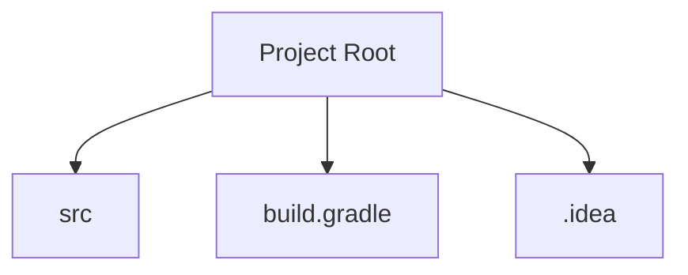
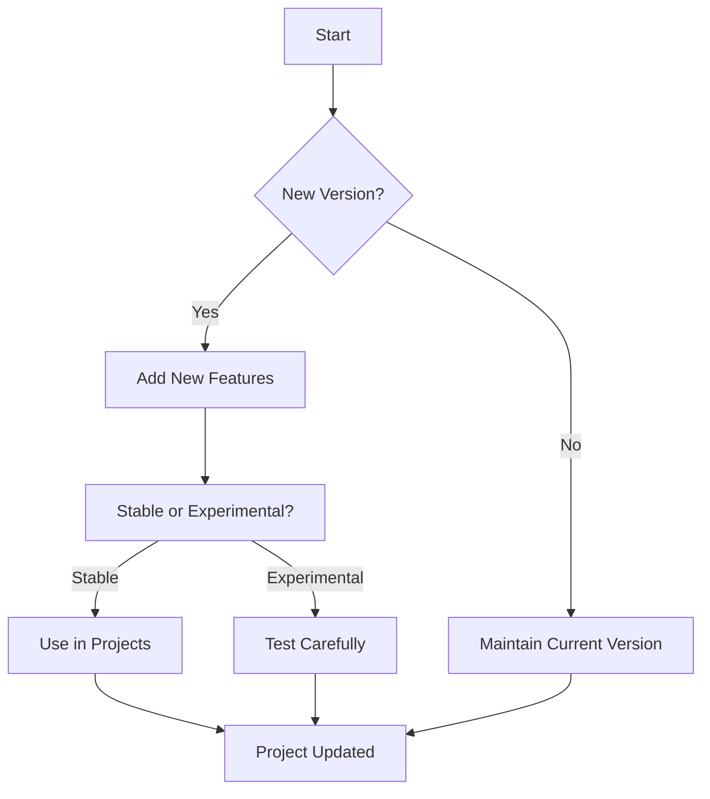

Error: API request failed with error: 401 Client Error: Unauthorized for url: https://openrouter.ai/api/v1/chat/completions

# <span style="color:#e67e22;">What we will learn in this post?</span>
<ul style='list-style-type: none; padding-left: 0;'>
<li><span style='color: #2980b9; font-size: 20px; font-weight: bold;'>👉</span> <span style='color: #2ecc71; font-size: 18px; font-weight: bold;'>Introduction to Kotlin</span></li>
<li><span style='color: #2980b9; font-size: 20px; font-weight: bold;'>👉</span> <span style='color: #2ecc71; font-size: 18px; font-weight: bold;'>Why Choose Kotlin?</span></li>
<li><span style='color: #2980b9; font-size: 20px; font-weight: bold;'>👉</span> <span style='color: #2ecc71; font-size: 18px; font-weight: bold;'>Setting Up Kotlin Development Environment</span></li>
<li><span style='color: #2980b9; font-size: 20px; font-weight: bold;'>👉</span> <span style='color: #2ecc71; font-size: 18px; font-weight: bold;'>Your First Kotlin Program</span></li>
<li><span style='color: #2980b9; font-size: 20px; font-weight: bold;'>👉</span> <span style='color: #2ecc71; font-size: 18px; font-weight: bold;'>Kotlin REPL and Scripting</span></li>
<li><span style='color: #2980b9; font-size: 20px; font-weight: bold;'>👉</span> <span style='color: #2ecc71; font-size: 18px; font-weight: bold;'>Build Tools: Gradle and Maven</span></li>
<li><span style='color: #2980b9; font-size: 20px; font-weight: bold;'>👉</span> <span style='color: #2ecc71; font-size: 18px; font-weight: bold;'>Kotlin Versions and Compatibility</span></li>
</ul>

# <span style="color:#e67e22">Introduction to Kotlin</span> 🌟

Kotlin is a modern, statically typed programming language developed by JetBrains. It’s designed to be **concise**, **safe**, and **interoperable** with Java, making it a fantastic choice for developers!

## <span style="color:#2980b9">Key Features of Kotlin</span>

- **Null Safety**: Say goodbye to the dreaded `NullPointerException`! Kotlin helps you avoid null-related errors with its built-in null safety features. For example:
  ```kotlin
  var name: String? = null // This is allowed
  ```

- **Concise Syntax**: Kotlin reduces boilerplate code. You can write more with less! For instance, creating a data class is as simple as:
  ```kotlin
  data class User(val name: String, val age: Int)
  ```

- **100% Java Interoperability**: You can use Kotlin and Java together seamlessly. This means you can gradually adopt Kotlin in your existing Java projects.

## <span style="color:#2980b9">Kotlin in Android Development</span> 📱

Google has made Kotlin the preferred language for Android development because it enhances productivity and reduces errors. Developers love its modern features and ease of use!

## <span style="color:#2980b9">Kotlin in Backend Development</span> 🌐

Kotlin is also gaining popularity in backend development, thanks to frameworks like Ktor and Spring Boot. It’s a versatile language that fits various development needs.

For more information, check out the [Kotlin Official Website](https://kotlinlang.org/)!

### <span style="color:#8e44ad">Conclusion</span>

Kotlin is a powerful language that combines safety, conciseness, and interoperability. Whether you’re building Android apps or backend services, Kotlin is a great choice! Happy coding! 🎉

# <span style="color:#e67e22">Kotlin's Compelling Advantages</span>

Kotlin is a modern programming language that brings many benefits to developers. Here are some key advantages that make it a favorite among programmers! 🚀

## <span style="color:#2980b9">1. Reduced Boilerplate</span>

Kotlin cuts down on repetitive code compared to Java. For example, you can define data classes in just one line:

```kotlin
data class User(val name: String, val age: Int)
```

This is much simpler than Java's verbose syntax!

## <span style="color:#2980b9">2. Smart Type Inference</span>

Kotlin can often figure out the type of a variable without you needing to specify it. This makes your code cleaner and easier to read:

```kotlin
val name = "Alice" // Kotlin knows 'name' is a String
```

## <span style="color:#2980b9">3. Built-in Null Safety</span>

Kotlin helps prevent Null Pointer Exceptions (NPEs) with its null safety features. You can declare a variable as nullable:

```kotlin
var name: String? = null
```

This way, you avoid crashes in your app! 🛡️

## <span style="color:#2980b9">4. Coroutines for Async Code</span>

Kotlin's coroutines make writing asynchronous code easy and readable. You can perform tasks like network calls without blocking the main thread:

```kotlin
launch {
    val result = async { fetchData() }
    println(result.await())
}
```

## <span style="color:#2980b9">5. Seamless Java Interop</span>

Kotlin works well with Java. You can use existing Java libraries and frameworks without any hassle, making it easy to transition to Kotlin.

### <span style="color:#8e44ad">Real-World Example</span>

Many companies, like Google and Pinterest, have adopted Kotlin for Android development. They report increased developer productivity and fewer bugs! 🐞

For more information, check out the [Kotlin Documentation](https://kotlinlang.org/docs/home.html).

---

Kotlin is a powerful tool that enhances productivity and makes coding more enjoyable. Give it a try! 🌟

# <span style="color:#e67e22">Getting Started with Kotlin 🚀</span>

## <span style="color:#2980b9">Step 1: Install IntelliJ IDEA or Android Studio</span>

1. **Download IntelliJ IDEA** from [JetBrains](https://www.jetbrains.com/idea/download/) or **Android Studio** from [Android Developers](https://developer.android.com/studio).
2. **Install** the software by following the on-screen instructions.

## <span style="color:#2980b9">Step 2: Configure the Kotlin Plugin</span>

- Open IntelliJ IDEA or Android Studio.
- Go to **File > Settings > Plugins**.
- Search for **Kotlin** and click **Install**.
- Restart the IDE to activate the plugin.

## <span style="color:#2980b9">Step 3: Create Your First Kotlin Project</span>

1. Click on **New Project**.
2. Select **Kotlin** from the options.
3. Choose **JVM | IDEA** and click **Next**.
4. Name your project (e.g., `HelloKotlin`) and click **Finish**.

### <span style="color:#8e44ad">Your First Kotlin Code</span>

In the `src` folder, create a new Kotlin file named `Main.kt` and add the following code:

```kotlin
fun main() {
    // This is a simple Kotlin program
    println("Hello, Kotlin! 🎉") // Print a greeting message
}
```

## <span style="color:#2980b9">Understanding Project Structure</span>

- **src**: Contains your Kotlin source files.
- **build.gradle**: Configuration file for project dependencies.
- **.idea**: IDE-specific settings.

### <span style="color:#8e44ad">Project Structure Diagram</span>



## <span style="color:#2980b9">Resources for More Info</span>

- [Kotlin Documentation](https://kotlinlang.org/docs/home.html)
- [JetBrains Kotlin Tutorials](https://kotlinlang.org/docs/tutorials/index.html)

Now you're ready to explore Kotlin! Happy coding! 🎉

# <span style="color:#e67e22">Creating a Simple 'Hello, World!' Program in Kotlin</span>

## <span style="color:#2980b9">Understanding the Basics</span>

In Kotlin, a simple program to print "Hello, World!" looks like this:

```kotlin
fun main() {
    println("Hello, World!")
}
```

### <span style="color:#8e44ad">Breaking It Down</span>

- **`fun main()`**: This is the **main function**. Think of it as the starting point of a race. When you run the program, it begins here.
- **`println("Hello, World!")`**: This line prints the text to the screen. It's like shouting out loud to everyone around you!

### <span style="color:#2980b9">Kotlin vs. Java</span>

Kotlin is more concise than Java. Here’s how the same program looks in Java:

```java
public class HelloWorld {
    public static void main(String[] args) {
        System.out.println("Hello, World!");
    }
}
```

- **Less Boilerplate**: Kotlin requires less code. It’s like packing a suitcase with only the essentials, while Java might include extra items you don’t need.

### <span style="color:#8e44ad">Key Takeaways</span>

- **Conciseness**: Kotlin is simpler and cleaner.
- **Readability**: Easier to understand, like reading a friendly note.

For more information, check out the [Kotlin Documentation](https://kotlinlang.org/docs/home.html).

```mermaid
flowchart TD
    A[Start] --> B{Is it Kotlin?}
    B -- Yes --> C[Print "Hello, World!"]
    B -- No --> D[Print "Hello, World! in Java"]
    C --> E[End]
    D --> E
```

Happy coding! 🎉

# <span style="color:#e67e22">Explore Kotlin REPL and Scripting! 🚀</span>

## <span style="color:#2980b9">What is Kotlin REPL? 🤔</span>

Kotlin REPL (Read-Eval-Print Loop) is a fantastic tool for **interactive experimentation**. You can write Kotlin code and see results instantly! Here’s how to get started:

- **Open your terminal** and type `kotlinc` to start the REPL.
- **Type your Kotlin code** directly and hit Enter to see the output.

### <span style="color:#8e44ad">Why Use REPL? 🌟</span>

- **Instant feedback**: Perfect for testing small code snippets.
- **Learning made fun**: Experiment with Kotlin features without setting up a full project.

## <span style="color:#2980b9">Kotlin Scripting (.kts files) 📜</span>

Kotlin scripting allows you to write quick tasks in `.kts` files. Here’s how:

1. **Create a file** named `script.kts`.
2. **Write your Kotlin code** in the file.
3. **Run it** using `kotlinc -script script.kts`.

### <span style="color:#8e44ad">Benefits of Scripting 🎉</span>

- **Quick tasks**: Automate repetitive tasks easily.
- **No setup needed**: Just write and run!

### <span style="color:#8e44ad">Resources for More Learning 📚</span>

- [Kotlin REPL Documentation](https://kotlinlang.org/docs/command-line.html#kotlin-repl)
- [Kotlin Scripting Guide](https://kotlinlang.org/docs/scripting.html)

Enjoy your Kotlin journey! Happy coding! 🎈

# <span style="color:#e67e22">Building Kotlin Projects with Gradle and Maven</span>

Kotlin is a fantastic language for modern development, and using **Gradle** or **Maven** makes managing your projects easier! Let’s dive into how to set up your Kotlin projects with these tools. 🚀

## <span style="color:#2980b9">Using Gradle</span>

### <span style="color:#8e44ad">Setting Up Gradle</span>

1. **Add the Kotlin Plugin**: In your `build.gradle.kts` file, include:
   ```kotlin
   plugins {
       kotlin("jvm") version "1.7.10"
   }
   ```

2. **Dependencies**: Add libraries you need:
   ```kotlin
   dependencies {
       implementation("org.jetbrains.kotlin:kotlin-stdlib")
   }
   ```

3. **Multi-module Projects**: Create a `settings.gradle.kts` file:
   ```kotlin
   include("moduleA", "moduleB")
   ```

### <span style="color:#8e44ad">Example Structure</span>

```plaintext
my-kotlin-project/
├── build.gradle.kts
├── settings.gradle.kts
├── moduleA/
│   └── build.gradle.kts
└── moduleB/
    └── build.gradle.kts
```

## <span style="color:#2980b9">Using Maven</span>

### <span style="color:#8e44ad">Setting Up Maven</span>

1. **Add Kotlin Dependency**: In your `pom.xml`:
   ```xml
   <dependency>
       <groupId>org.jetbrains.kotlin</groupId>
       <artifactId>kotlin-stdlib</artifactId>
       <version>1.7.10</version>
   </dependency>
   ```

2. **Build Configuration**: Use the Kotlin Maven Plugin:
   ```xml
   <build>
       <plugins>
           <plugin>
               <groupId>org.jetbrains.kotlin</groupId>
               <artifactId>kotlin-maven-plugin</artifactId>
               <version>1.7.10</version>
           </plugin>
       </plugins>
   </build>
   ```

### <span style="color:#8e44ad">Multi-module Example</span>

```xml
<modules>
    <module>moduleA</module>
    <module>moduleB</module>
</modules>
```

## <span style="color:#2980b9">Resources</span>

- [Gradle Kotlin DSL Documentation](https://docs.gradle.org/current/userguide/kotlin_dsl.html)
- [Maven Kotlin Plugin](https://kotlinlang.org/docs/maven.html)

With these steps, you can easily set up your Kotlin projects using Gradle or Maven! Happy coding! 🎉

# <span style="color:#e67e22">Understanding Kotlin Versioning and Features</span>

## <span style="color:#2980b9">Kotlin Language Evolution</span>

Kotlin is a modern programming language that evolves over time. Each version introduces **new features** and **improvements**. Here’s how it works:

- **Stable Features**: These are well-tested and reliable. For example, **coroutines** for asynchronous programming are stable and widely used.
- **Experimental Features**: These are new and may change. Think of them like trying a new dish at a restaurant. They might be exciting but could also change in the future.

### <span style="color:#8e44ad">Maintaining Compatibility with Java</span>

Kotlin is designed to work seamlessly with Java. This means you can use existing Java libraries in your Kotlin projects without issues. It’s like having a universal remote that works with different devices!

### <span style="color:#8e44ad">Keeping Projects Updated</span>

To keep your projects fresh:

- Regularly check for new Kotlin versions.
- Update dependencies to use stable features.
- Test experimental features cautiously.

```kotlin
fun main() {
    println("Hello, Kotlin!")
}
```

### <span style="color:#2980b9">Resources for More Info</span>

- [Kotlin Official Documentation](https://kotlinlang.org/docs/home.html)
- [Kotlin Versioning Guide](https://kotlinlang.org/docs/releases.html)

### <span style="color:#8e44ad">Flowchart of Kotlin Feature Evolution</span>



By understanding these concepts, you can effectively use Kotlin in your projects while keeping them up-to-date and compatible with Java! 😊

