<!--
meta-description: "Learn Kotlin fundamentals including null safety, concise syntax, Java interoperability, IDE setup with IntelliJ IDEA, Gradle/Maven build configuration, and REPL scripting for modern JVM development."
keywords: "Kotlin, JVM, null safety, IntelliJ IDEA, Gradle, Maven, Android development, REPL, scripting, JetBrains, build tools, type inference"
-->

# <span style="color:#e67e22;">What we will learn in this post?</span>
<ul style='list-style-type: none; padding-left: 0;'>
<li><span style='color: #2980b9; font-size: 20px; font-weight: bold;'>👉</span> <span style='color: #2ecc71; font-size: 18px; font-weight: bold;'>Introduction to Kotlin</span></li>
<li><span style='color: #2980b9; font-size: 20px; font-weight: bold;'>👉</span> <span style='color: #2ecc71; font-size: 18px; font-weight: bold;'>Why Choose Kotlin?</span></li>
<li><span style='color: #2980b9; font-size: 20px; font-weight: bold;'>👉</span> <span style='color: #2ecc71; font-size: 18px; font-weight: bold;'>Setting Up Kotlin Development Environment</span></li>
<li><span style='color: #2980b9; font-size: 20px; font-weight: bold;'>👉</span> <span style='color: #2ecc71; font-size: 18px; font-weight: bold;'>Your First Kotlin Program</span></li>
<li><span style='color: #2980b9; font-size: 20px; font-weight: bold;'>👉</span> <span style='color: #2ecc71; font-size: 18px; font-weight: bold;'>Kotlin REPL and Scripting</span></li>
<li><span style='color: #2980b9; font-size: 20px; font-weight: bold;'>👉</span> <span style='color: #2ecc71; font-size: 18px; font-weight: bold;'>Build Tools: Gradle and Maven</span></li>
<li><span style='color: #2980b9; font-size: 20px; font-weight: bold;'>👉</span> <span style='color: #2ecc71; font-size: 18px; font-weight: bold;'>Kotlin Versions and Compatibility</span></li>
</ul>

# <span style="color:#e67e22">Introduction to Kotlin</span> 🌟

Kotlin is a modern, statically typed programming language developed by JetBrains, officially endorsed by Google as the preferred language for Android development. Google, Pinterest, Slack, and Cash App use Kotlin to build production systems serving millions of users daily, leveraging its null safety and expressive syntax to reduce crashes and boost developer productivity.

Kotlin is designed to be **concise**, **safe**, and **interoperable** with Java, making it a fantastic choice for developers building everything from Android apps to backend microservices!

## <span style="color:#2980b9">Key Features of Kotlin</span>

Kotlin's core features are battle-tested in production—null safety prevents the billion-dollar NullPointerException class of bugs that plague Java codebases, while concise syntax means less code to maintain and debug at companies like Google and Slack.

- **Null Safety**: Say goodbye to the dreaded `NullPointerException`! Kotlin helps you avoid null-related errors with its built-in null safety features. For example:
  ```kotlin
  var name: String? = null // This is allowed
  ```

- **Concise Syntax**: Kotlin reduces boilerplate code. You can write more with less! For instance, creating a data class is as simple as:
  ```kotlin
  data class User(val name: String, val age: Int)
  ```

- **100% Java Interoperability**: You can use Kotlin and Java together seamlessly. This means you can gradually adopt Kotlin in your existing Java projects.

```mermaid
graph TD
    A["🎯 Kotlin Features"]:::style1 --> B["🛡️ Null Safety"]:::style2
    A --> C["📝 Concise Syntax"]:::style3
    A --> D["🔗 Java Interop"]:::style4
    B --> E["Prevent NPE"]:::style5
    C --> F["Less Boilerplate"]:::style2
    D --> G["Seamless Mix"]:::style3

    classDef style1 fill:#9b59b6,stroke:#8e44ad,color:#fff,font-size:16px,stroke-width:3px,rx:14,shadow:6px;
    classDef style2 fill:#8e44ad,stroke:#7d3c98,color:#fff,font-size:16px,stroke-width:3px,rx:14,shadow:6px;
    classDef style3 fill:#af7ac5,stroke:#9b59b6,color:#fff,font-size:16px,stroke-width:3px,rx:14,shadow:6px;
    classDef style4 fill:#c39bd3,stroke:#bb8fce,color:#fff,font-size:16px,stroke-width:3px,rx:14,shadow:6px;
    classDef style5 fill:#d7bde2,stroke:#c39bd3,color:#222,font-size:16px,stroke-width:3px,rx:14,shadow:6px;

    linkStyle default stroke:#e67e22,stroke-width:3px;
```



## <span style="color:#2980b9">Kotlin in Android Development</span> 📱

Google has officially made Kotlin the preferred language for Android development since 2019, and for good reason—null safety eliminates entire classes of crashes while coroutines enable responsive UIs at companies like Pinterest and Cash App that serve millions of users.

Developers love its modern features and ease of use!

## <span style="color:#2980b9">Kotlin in Backend Development</span> 🌐

Kotlin is also gaining popularity in backend development, thanks to frameworks like Ktor and Spring Boot. Companies like Slack and Square (Cash App) use Kotlin for their production services because it combines type safety with concise expressiveness, enabling rapid development without sacrificing reliability.

### <span style="color:#8e44ad">Conclusion</span>

Kotlin seamlessly bridges the gap between conciseness and safety—whether you're building Android apps for millions of users or backend services. Let's explore what makes it so powerful! 💜

# <span style="color:#e67e22">Kotlin's Compelling Advantages</span>

Kotlin's design decisions are based on real-world production usage—JetBrains itself uses Kotlin, and companies like Google have made it their official language for Android because these advantages directly translate to fewer bugs and faster development cycles.

Kotlin is a modern programming language that brings many benefits to developers. Here are some key advantages that make it a favorite among programmers! 🚀

## <span style="color:#2980b9">1. Reduced Boilerplate</span>

Kotlin cuts down on repetitive code compared to Java. For example, you can define data classes in just one line:

```kotlin
data class User(val name: String, val age: Int)
```

This is much simpler than Java's verbose syntax!

## <span style="color:#2980b9">2. Smart Type Inference</span>

Kotlin can often figure out the type of a variable without you needing to specify it. This makes your code cleaner and easier to read:

```kotlin
val name = "Alice" // Kotlin knows 'name' is a String
```

## <span style="color:#2980b9">3. Built-in Null Safety</span>

Kotlin helps prevent Null Pointer Exceptions (NPEs) with its null safety features. You can declare a variable as nullable:

```kotlin
var name: String? = null
```

This way, you avoid crashes in your app! 🛡️

## <span style="color:#2980b9">4. Coroutines for Async Code</span>

Kotlin's coroutines are production-proven at Slack, Pinterest, and Cash App for handling thousands of concurrent network requests with minimal memory overhead—a paradigm shift from traditional thread-based async handling used in legacy systems.

Kotlin's coroutines make writing asynchronous code easy and readable. You can perform tasks like network calls without blocking the main thread:

```kotlin
launch {
    val result = async { fetchData() }
    println(result.await())
}
```

## <span style="color:#2980b9">5. Seamless Java Interop</span>

Kotlin works well with Java. You can use existing Java libraries and frameworks without any hassle, making it easy to transition to Kotlin.

### <span style="color:#8e44ad">Real-World Example</span>

Many companies, like Google and Pinterest, have adopted Kotlin for Android development. They report increased developer productivity and fewer bugs! 🐞

---

Kotlin is a powerful tool that enhances productivity and makes coding more enjoyable. Give it a try! 🌟

# <span style="color:#e67e22">Getting Started with Kotlin 🚀</span>

Setting up a Kotlin development environment takes just minutes—JetBrains provides excellent IDE support, and the community has made onboarding seamless whether you're on Windows, macOS, or Linux.

## <span style="color:#2980b9">Step 1: Install IntelliJ IDEA or Android Studio</span>

1. **Download IntelliJ IDEA** from [JetBrains](https://www.jetbrains.com/idea/download/) or **Android Studio** from [Android Developers](https://developer.android.com/studio).
2. **Install** the software by following the on-screen instructions.

## <span style="color:#2980b9">Step 2: Configure the Kotlin Plugin</span>

- Open IntelliJ IDEA or Android Studio.
- Go to **File > Settings > Plugins**.
- Search for **Kotlin** and click **Install**.
- Restart the IDE to activate the plugin.

## <span style="color:#2980b9">Step 3: Create Your First Kotlin Project</span>

1. Click on **New Project**.
2. Select **Kotlin** from the options.
3. Choose **JVM | IDEA** and click **Next**.
4. Name your project (e.g., `HelloKotlin`) and click **Finish**.

### <span style="color:#8e44ad">Your First Kotlin Code</span>

In the `src` folder, create a new Kotlin file named `Main.kt` and add the following code:

```kotlin
fun main() {
    // This is a simple Kotlin program
    println("Hello, Kotlin! 🎉") // Print a greeting message
}
```

## <span style="color:#2980b9">Understanding Project Structure</span>

- **src**: Contains your Kotlin source files.
- **build.gradle**: Configuration file for project dependencies.
- **.idea**: IDE-specific settings.

```mermaid
graph TD
    A["📦 Project Root"]:::style1 --> B["📁 src"]:::style2
    A --> C["⚙️ build.gradle"]:::style3
    A --> D["💾 .idea"]:::style4
    B --> E["🎯 Main.kt"]:::style5
    
    classDef style1 fill:#9b59b6,stroke:#8e44ad,color:#fff,font-size:16px,stroke-width:3px,rx:14,shadow:6px;
    classDef style2 fill:#8e44ad,stroke:#7d3c98,color:#fff,font-size:16px,stroke-width:3px,rx:14,shadow:6px;
    classDef style3 fill:#af7ac5,stroke:#9b59b6,color:#fff,font-size:16px,stroke-width:3px,rx:14,shadow:6px;
    classDef style4 fill:#c39bd3,stroke:#bb8fce,color:#fff,font-size:16px,stroke-width:3px,rx:14,shadow:6px;
    classDef style5 fill:#d7bde2,stroke:#c39bd3,color:#222,font-size:16px,stroke-width:3px,rx:14,shadow:6px;

    linkStyle default stroke:#e67e22,stroke-width:3px;
```

### <span style="color:#8e44ad">Project Structure Diagram</span>



# <span style="color:#e67e22">Creating a Simple 'Hello, World!' Program in Kotlin</span>

## <span style="color:#2980b9">Understanding the Basics</span>

In Kotlin, a simple program to print "Hello, World!" looks like this:

```kotlin
fun main() {
    println("Hello, World!")
}
```

### <span style="color:#8e44ad">Breaking It Down</span>

- **`fun main()`**: This is the **main function**. Think of it as the starting point of a race. When you run the program, it begins here.
- **`println("Hello, World!")`**: This line prints the text to the screen. It's like shouting out loud to everyone around you!

### <span style="color:#2980b9">Kotlin vs. Java</span>

Kotlin is more concise than Java. Here’s how the same program looks in Java:

```java
public class HelloWorld {
    public static void main(String[] args) {
        System.out.println("Hello, World!");
    }
}
```

- **Less Boilerplate**: Kotlin requires less code. It’s like packing a suitcase with only the essentials, while Java might include extra items you don’t need.

### <span style="color:#8e44ad">Key Takeaways</span>

- **Conciseness**: Kotlin is simpler and cleaner.
- **Readability**: Easier to understand, like reading a friendly note.

```mermaid
flowchart TD
    A["🚀 Start"]:::style1 --> B{❓ Is it Kotlin?}:::style2
    B -->|Yes| C["✅ Print Hello"]:::style3
    B -->|No| D["☕ Java Version"]:::style4
    C --> E["🎉 End"]:::style5
    D --> E
    
    classDef style1 fill:#9b59b6,stroke:#8e44ad,color:#fff,font-size:16px,stroke-width:3px,rx:14,shadow:6px;
    classDef style2 fill:#8e44ad,stroke:#7d3c98,color:#fff,font-size:16px,stroke-width:3px,rx:14,shadow:6px;
    classDef style3 fill:#af7ac5,stroke:#9b59b6,color:#fff,font-size:16px,stroke-width:3px,rx:14,shadow:6px;
    classDef style4 fill:#c39bd3,stroke:#bb8fce,color:#fff,font-size:16px,stroke-width:3px,rx:14,shadow:6px;
    classDef style5 fill:#d7bde2,stroke:#c39bd3,color:#222,font-size:16px,stroke-width:3px,rx:14,shadow:6px;

    linkStyle default stroke:#e67e22,stroke-width:3px;
```



Happy coding! 🎉

# <span style="color:#e67e22">Explore Kotlin REPL and Scripting! 🚀</span>

Kotlin's REPL (Read-Eval-Print Loop) enables rapid prototyping and learning—developers at Google and JetBrains use it to validate ideas instantly without compilation cycles, making experimentation fast and interactive.

## <span style="color:#2980b9">What is Kotlin REPL? 🤔</span>

Kotlin REPL (Read-Eval-Print Loop) is a fantastic tool for **interactive experimentation**. You can write Kotlin code and see results instantly! Here’s how to get started:

- **Open your terminal** and type `kotlinc` to start the REPL.
- **Type your Kotlin code** directly and hit Enter to see the output.

### <span style="color:#8e44ad">Why Use REPL? 🌟</span>

- **Instant feedback**: Perfect for testing small code snippets.
- **Learning made fun**: Experiment with Kotlin features without setting up a full project.

## <span style="color:#2980b9">Kotlin Scripting (.kts files) 📜</span>

Kotlin scripting allows you to write quick tasks in `.kts` files. Here’s how:

1. **Create a file** named `script.kts`.
2. **Write your Kotlin code** in the file.
3. **Run it** using `kotlinc -script script.kts`.

### <span style="color:#8e44ad">Benefits of Scripting 🎉</span>

- **Quick tasks**: Automate repetitive tasks easily.
- **No setup needed**: Just write and run!

# <span style="color:#e67e22">Building Kotlin Projects with Gradle and Maven</span>

Gradle is the industry standard for Kotlin projects—Google officially endorses it for Android, and companies like Netflix, Uber, and LinkedIn use Gradle at scale for managing complex multi-module architectures with thousands of dependencies.

Kotlin is a fantastic language for modern development, and using **Gradle** or **Maven** makes managing your projects easier! Let’s dive into how to set up your Kotlin projects with these tools. 🚀

## <span style="color:#2980b9">Using Gradle</span>

### <span style="color:#8e44ad">Setting Up Gradle</span>

1. **Add the Kotlin Plugin**: In your `build.gradle.kts` file, include:
   ```kotlin
   plugins {
       kotlin("jvm") version "1.7.10"
   }
   ```

2. **Dependencies**: Add libraries you need:
   ```kotlin
   dependencies {
       implementation("org.jetbrains.kotlin:kotlin-stdlib")
   }
   ```

3. **Multi-module Projects**: Create a `settings.gradle.kts` file:
   ```kotlin
   include("moduleA", "moduleB")
   ```

### <span style="color:#8e44ad">Example Structure</span>

```plaintext
my-kotlin-project/
├── build.gradle.kts
├── settings.gradle.kts
├── moduleA/
│   └── build.gradle.kts
└── moduleB/
    └── build.gradle.kts
```

## <span style="color:#2980b9">Using Maven</span>

### <span style="color:#8e44ad">Setting Up Maven</span>

1. **Add Kotlin Dependency**: In your `pom.xml`:
   ```xml
   <dependency>
       <groupId>org.jetbrains.kotlin</groupId>
       <artifactId>kotlin-stdlib</artifactId>
       <version>1.7.10</version>
   </dependency>
   ```

2. **Build Configuration**: Use the Kotlin Maven Plugin:
   ```xml
   <build>
       <plugins>
           <plugin>
               <groupId>org.jetbrains.kotlin</groupId>
               <artifactId>kotlin-maven-plugin</artifactId>
               <version>1.7.10</version>
           </plugin>
       </plugins>
   </build>
   ```

### <span style="color:#8e44ad">Multi-module Example</span>

```xml
<modules>
    <module>moduleA</module>
    <module>moduleB</module>
</modules>
```

# <span style="color:#e67e22">Understanding Kotlin Versioning and Features</span>

## <span style="color:#2980b9">Kotlin Language Evolution</span>

Kotlin is a modern programming language that evolves over time. Each version introduces **new features** and **improvements**. Here’s how it works:

- **Stable Features**: These are well-tested and reliable. For example, **coroutines** for asynchronous programming are stable and widely used.
- **Experimental Features**: These are new and may change. Think of them like trying a new dish at a restaurant. They might be exciting but could also change in the future.

### <span style="color:#8e44ad">Maintaining Compatibility with Java</span>

Kotlin is designed to work seamlessly with Java. This means you can use existing Java libraries in your Kotlin projects without issues. It’s like having a universal remote that works with different devices!

### <span style="color:#8e44ad">Keeping Projects Updated</span>

To keep your projects fresh:

- Regularly check for new Kotlin versions.
- Update dependencies to use stable features.
- Test experimental features cautiously.

```kotlin
fun main() {
    println("Hello, Kotlin!")
}
```
# <span style="color:#e67e22">Understanding Kotlin Versioning and Features</span>

Kotlin's evolution is guided by production experience from JetBrains, Google, and the community—stability guarantees matter when Slack and Cash App depend on certain features not changing unexpectedly. Each release balances new capabilities with backward compatibility.

## <span style="color:#2980b9">Kotlin Language Evolution</span>

Kotlin is a modern programming language that evolves over time. Each version introduces **new features** and **improvements**. Here's how it works:

- **Stable Features**: These are well-tested and reliable. For example, **coroutines** for asynchronous programming are stable and widely used.
- **Experimental Features**: These are new and may change. Think of them like trying a new dish at a restaurant. They might be exciting but could also change in the future.

### <span style="color:#8e44ad">Maintaining Compatibility with Java</span>

Kotlin is designed to work seamlessly with Java. This means you can use existing Java libraries in your Kotlin projects without issues. It's like having a universal remote that works with different devices!

### <span style="color:#8e44ad">Keeping Projects Updated</span>

To keep your projects fresh:

- Regularly check for new Kotlin versions.
- Update dependencies to use stable features.
- Test experimental features cautiously.

```kotlin
fun main() {
    println("Hello, Kotlin!")
}
```

### <span style="color:#8e44ad">Flowchart of Kotlin Feature Evolution</span>



# <span style="color:#e67e22">Real-World Production Examples 🚀</span>

## <span style="color:#2980b9">1. Android App with Null Safety</span>

```mermaid
graph TD
    A["🚀 Start"]:::style1 --> B{📦 New Version?}:::style2
    B -->|Yes| C["✨ Add Features"]:::style3
    B -->|No| D["📌 Maintain"]:::style4
    C --> E{🏷️ Stable?}:::style2
    E -->|Yes| F["✅ Use in Projects"]:::style3
    E -->|No| G["⚠️ Test Carefully"]:::style4
    F --> H["🎉 Project Updated"]:::style5
    G --> H
    D --> H
    
    classDef style1 fill:#9b59b6,stroke:#8e44ad,color:#fff,font-size:16px,stroke-width:3px,rx:14,shadow:6px;
    classDef style2 fill:#8e44ad,stroke:#7d3c98,color:#fff,font-size:16px,stroke-width:3px,rx:14,shadow:6px;
    classDef style3 fill:#af7ac5,stroke:#9b59b6,color:#fff,font-size:16px,stroke-width:3px,rx:14,shadow:6px;
    classDef style4 fill:#c39bd3,stroke:#bb8fce,color:#fff,font-size:16px,stroke-width:3px,rx:14,shadow:6px;
    classDef style5 fill:#d7bde2,stroke:#c39bd3,color:#222,font-size:16px,stroke-width:3px,rx:14,shadow:6px;

    linkStyle default stroke:#e67e22,stroke-width:3px;
```

Pinterest uses Kotlin's null safety to prevent crashes in their Android app:

```kotlin
data class User(
    val id: Long,
    val name: String,
    val email: String?  // Nullable email
)

fun displayUser(user: User) {
    println("Name: ${user.name}")
    user.email?.let { email ->
        println("Email: $email")
    } ?: println("No email provided")
}
```

## <span style="color:#2980b9">2. Kotlin Coroutines for API Calls</span>

Slack uses coroutines to handle thousands of concurrent network requests efficiently:

```kotlin
suspend fun fetchUserData(userId: Long): User = withContext(Dispatchers.IO) {
    val response = httpClient.get("/api/users/$userId")
    response.body()
}

fun loadUsers() {
    viewModelScope.launch {
        try {
            val user = fetchUserData(123)
            updateUI(user)
        } catch (e: Exception) {
            showError("Failed to load user: ${e.message}")
        }
    }
}
```

## <span style="color:#2980b9">3. Extension Functions for Code Reusability</span>

Cash App uses extensions to add functionality to existing classes without inheritance:

```kotlin
fun String.isValidEmail(): Boolean {
    return this.contains("@") && this.contains(".")
}

fun Int.toPositive(): Int {
    return if (this < 0) -this else this
}

fun main() {
    val email = "user@example.com"
    if (email.isValidEmail()) {
        println("Valid email!")
    }
    
    val number = -42
    println("Absolute: ${number.toPositive()}")  // 42
}
```

## <span style="color:#2980b9">4. Data Classes for Type Safety</span>

Google uses data classes extensively in Android libraries for clean, concise models:

```kotlin
data class Product(
    val id: String,
    val name: String,
    val price: Double,
    val inStock: Boolean
)

data class Order(
    val id: String,
    val products: List<Product>,
    val total: Double
) {
    fun discountedTotal(percentage: Double): Double {
        return total * (1 - percentage / 100)
    }
}

fun main() {
    val product = Product("001", "Kotlin Book", 29.99, true)
    val order = Order("ORD001", listOf(product), 29.99)
    println("Discounted: ${order.discountedTotal(10)}")  // 26.99
}
```

## <span style="color:#2980b9">5. Sealed Classes for Type-Safe Result Handling</span>

Netflix uses sealed classes to handle API responses elegantly:

```kotlin
sealed class Result<T> {
    data class Success<T>(val data: T) : Result<T>()
    data class Error<T>(val exception: Exception) : Result<T>()
    class Loading<T> : Result<T>()
}

fun <T> handleResult(result: Result<T>) {
    when (result) {
        is Result.Success -> println("Success: ${result.data}")
        is Result.Error -> println("Error: ${result.exception.message}")
        is Result.Loading -> println("Loading...")
    }
}
```

## <span style="color:#2980b9">6. Spring Boot API with Kotlin</span>

Backend teams at companies like Uber use Kotlin with Spring Boot for type-safe APIs:

```kotlin
@RestController
@RequestMapping("/api/users")
class UserController(private val userService: UserService) {
    
    @GetMapping("/{id}")
    suspend fun getUser(@PathVariable id: Long): ResponseEntity<User> {
        val user = userService.findById(id)
        return user?.let { ResponseEntity.ok(it) }
            ?: ResponseEntity.notFound().build()
    }
    
    @PostMapping
    suspend fun createUser(@RequestBody user: User): ResponseEntity<User> {
        val created = userService.save(user)
        return ResponseEntity.status(HttpStatus.CREATED).body(created)
    }
}
```

# <span style="color:#e67e22">Hands-On Assignment: Building Your First Kotlin Application 💜</span>

<details style="border: 3px solid #9b59b6; border-radius: 8px; padding: 15px; background-color: #34303d;">
<summary style="cursor: pointer; font-weight: bold; color: #9b59b6; font-size: 18px;">🎯 Mission: Create a Personal Finance Tracker Application</summary>

<div style="margin-top: 15px;">

## <span style="color:#9b59b6">📋 Requirements (Core)</span>

Build a Kotlin command-line application that:
1. **Manages Transactions** - Add income and expense transactions with dates and categories
2. **Calculates Balance** - Track total income, expenses, and net balance
3. **Generates Reports** - Show transactions by category and monthly summaries
4. **Handles Errors** - Use try-catch and custom exceptions for invalid inputs
5. **Uses Data Classes** - Employ Kotlin data classes for type safety
6. **Implements Null Safety** - Handle optional descriptions and notes gracefully
7. **Extension Functions** - Create utility extensions for formatting currency
8. **Coroutines Ready** - Structure code to support async file I/O later

## <span style="color:#9b59b6">💡 Hints</span>

- Start with a `Transaction` data class: `data class Transaction(val date: LocalDate, val amount: Double, val category: String, val description: String?)`
- Use `List` and `Map` to organize transactions by category
- Create a `Wallet` class to manage collections of transactions
- Write an extension function: `fun Double.formatCurrency(): String`
- Use sealed classes for `Result<T>` to handle success/error states

## <span style="color:#9b59b6">📁 Project Structure</span>

```
finance-tracker/
├── build.gradle.kts
├── src/main/kotlin/
│   ├── Transaction.kt      # Data classes
│   ├── Wallet.kt           # Main logic
│   ├── Extensions.kt       # Extension functions
│   └── Main.kt             # Entry point
└── README.md
```

## <span style="color:#9b59b6">🎓 Learning Goals</span>

- Understand null safety and optionals (String?)
- Practice data class design and immutability
- Master collection operations (filter, map, groupBy)
- Implement proper error handling with exceptions
- Create reusable extension functions
- Structure a complete Kotlin project

## <span style="color:#9b59b6">⚡ Pro Tip</span>

Use the REPL to test your extensions and logic before adding to your project: `kotlinc` then try `5000.0.formatCurrency()` to validate formatting.

## <span style="color:#9b59b6">🚀 Call-to-Action</span>

Build this tracker now! Once working, enhance it with coroutines to load transactions from a JSON file asynchronously.

### <span style="color:#9b59b6">🏆 Bonus Challenges (6 Levels)</span>

- **Level 1**: Add a `recurring` property to Transaction for monthly bills
- **Level 2**: Implement a `Budget` data class with category spending limits
- **Level 3**: Create a `compareMonths()` function using coroutines to analyze trends
- **Level 4**: Build a `exportToCSV()` function with proper file handling
- **Level 5**: Add unit tests using JUnit5 and Kotest for validation logic
- **Level 6**: Implement serialization with kotlinx-serialization for JSON storage

</div>
</details>

# <span style="color:#e67e22">Conclusion</span>

Kotlin transforms modern development with its blend of conciseness and safety—companies from Google to Slack leverage it to reduce bugs and accelerate shipping. Master these fundamentals, and you'll build production-grade applications that scale with elegance and reliability. 💜

