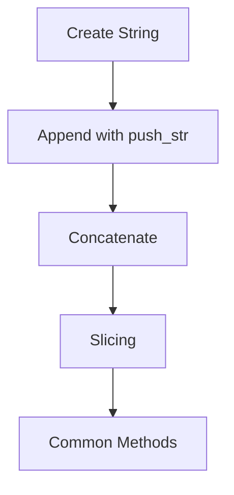
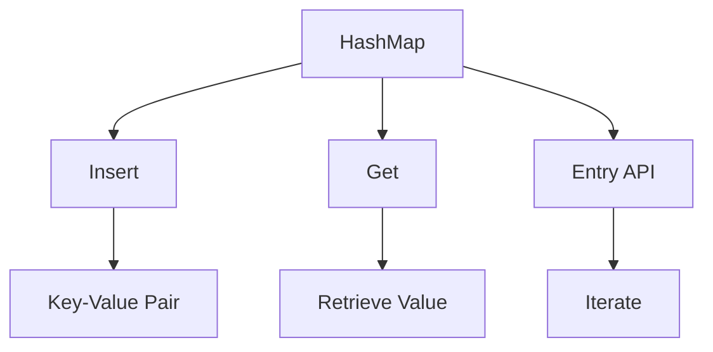
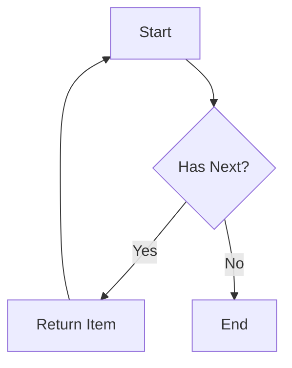

Error: API request failed with error: 401 Client Error: Unauthorized for url: https://openrouter.ai/api/v1/chat/completions

# <span style="color:#e67e22;">What we will learn in this post?</span>
<ul style='list-style-type: none; padding-left: 0;'>
<li><span style='color: #2980b9; font-size: 20px; font-weight: bold;'>👉</span> <span style='color: #2ecc71; font-size: 18px; font-weight: bold;'>Vectors - Dynamic Arrays</span></li>
<li><span style='color: #2980b9; font-size: 20px; font-weight: bold;'>👉</span> <span style='color: #2ecc71; font-size: 18px; font-weight: bold;'>Strings and String Manipulation</span></li>
<li><span style='color: #2980b9; font-size: 20px; font-weight: bold;'>👉</span> <span style='color: #2ecc71; font-size: 18px; font-weight: bold;'>HashMaps for Key-Value Storage</span></li>
<li><span style='color: #2980b9; font-size: 20px; font-weight: bold;'>👉</span> <span style='color: #2ecc71; font-size: 18px; font-weight: bold;'>Iterators and Lazy Evaluation</span></li>
<li><span style='color: #2980b9; font-size: 20px; font-weight: bold;'>👉</span> <span style='color: #2ecc71; font-size: 18px; font-weight: bold;'>Iterator Adapters and Chaining</span></li>
<li><span style='color: #2980b9; font-size: 20px; font-weight: bold;'>👉</span> <span style='color: #2ecc71; font-size: 18px; font-weight: bold;'>Custom Iterators</span></li>
<li><span style='color: #2980b9; font-size: 20px; font-weight: bold;'>👉</span> <span style='color: #2ecc71; font-size: 18px; font-weight: bold;'>HashSet and Other Collections</span></li>
</ul>

# <span style="color:#e67e22">Introduction to Vec<T> in Rust</span> 🌱

In Rust, `Vec<T>` is like a **magic box** that can grow or shrink as you add or remove items. Think of it as a stretchy backpack that can hold more items when you need it!

## <span style="color:#2980b9">Creating Vectors with `vec!` Macro</span> 🎒

You can create a vector using the `vec!` macro. Here’s how:

```rust
// Create a new vector with initial values
let mut numbers = vec![1, 2, 3]; // A backpack with 3 items
```

### <span style="color:#8e44ad">Adding and Removing Items</span> ➕

- **Push**: Add items to the backpack.
  
```rust
numbers.push(4); // Now the backpack has 4 items
```

- **Pop**: Remove the last item from the backpack.

```rust
let last_item = numbers.pop(); // Removes 4, backpack now has 3 items
```

## <span style="color:#2980b9">Accessing Elements Safely</span> 🔍

To access items, use `get()` which is safe and prevents errors:

```rust
if let Some(&number) = numbers.get(1) { // Access the second item
    println!("The second number is: {}", number);
}
```

## <span style="color:#2980b9">Iterating Through Vectors</span> 🔄

You can easily go through each item in your backpack:

```rust
for number in &numbers { // Borrowing items
    println!("{}", number);
}
```

## <span style="color:#2980b9">When Do Vectors Reallocate?</span> 🔄

Vectors may **reallocate** when they run out of space. Imagine your backpack is full, and you find a new item. It will expand to fit more items!

### Resources
- [Rust Documentation on Vectors](https://doc.rust-lang.org/std/vec/)
- [Rust by Example](https://doc.rust-lang.org/stable/rust-by-example/)

This is a brief overview of `Vec<T>`. Happy coding! 🎉

# <span style="color:#e67e22">String Operations in Rust</span>

Strings in Rust are powerful and flexible! Let’s explore how to create, manipulate, and understand them better. 🚀

## <span style="color:#2980b9">Creating Strings</span>

You can create a string in Rust using the `String` type. Here’s how:

```rust
let mut my_string = String::new(); // Create an empty string
my_string.push_str("Hello, "); // Append a string slice
my_string.push_str("world!"); // Append another string slice
```

## <span style="color:#2980b9">Concatenation</span>

You can concatenate strings easily:

```rust
let greeting = String::from("Hello, ");
let name = String::from("Alice");
let message = greeting + &name; // Note the & operator
```

## <span style="color:#2980b9">Slicing Safely</span>

Rust is strict about string indexing because it uses UTF-8 encoding. This means that not all characters are the same length. For example, the character "é" takes more bytes than "a". 

To slice safely, always use:

```rust
let my_string = String::from("Hello, world!");
let slice = &my_string[0..5]; // "Hello"
```

### <span style="color:#8e44ad">Common Methods</span>

- **`len()`**: Get the length of the string.
- **`contains()`**: Check if a substring exists.
- **`replace()`**: Replace parts of the string.

## <span style="color:#2980b9">Why Rust's String Indexing is Strict</span>

Rust’s strictness prevents errors that can occur with invalid UTF-8 sequences. This ensures that your program is safe and efficient. 

For more information, check out the [Rust Documentation on Strings](https://doc.rust-lang.org/book/ch04-01-what-is-ownership.html).

### Flowchart of String Operations



Happy coding! 🎉

# <span style="color:#e67e22">Understanding HashMap<K, V> for Key-Value Pairs</span>

## <span style="color:#2980b9">What is a HashMap?</span>

A **HashMap** is a data structure that stores data in **key-value pairs**. It allows you to quickly find a value based on its key. Think of it like a dictionary where you look up a word (key) to find its meaning (value).

### <span style="color:#8e44ad">Basic Operations</span>

- **Insert**: Add a new key-value pair.
  ```java
  HashMap<String, Integer> map = new HashMap<>();
  map.put("apple", 1);
  ```

- **Get**: Retrieve a value using its key.
  ```java
  int count = map.get("apple"); // returns 1
  ```

- **Entry API**: Useful for complex updates and iteration.
  ```java
  for (Map.Entry<String, Integer> entry : map.entrySet()) {
      System.out.println(entry.getKey() + ": " + entry.getValue());
  }
  ```

## <span style="color:#2980b9">Practical Use Case: Counting Word Frequencies</span>

Imagine you want to count how many times each word appears in a sentence. A HashMap is perfect for this!

```java
String sentence = "hello world hello";
HashMap<String, Integer> wordCount = new HashMap<>();

for (String word : sentence.split(" ")) {
    wordCount.put(word, wordCount.getOrDefault(word, 0) + 1);
}
```

### <span style="color:#8e44ad">Ownership Considerations</span>

- **Mutability**: HashMaps can change, so be careful when sharing them across threads.
- **Memory**: They can consume more memory than other collections, so use them wisely.

## <span style="color:#2980b9">Conclusion</span>

HashMaps are powerful tools for managing key-value pairs efficiently. Whether counting words or storing user data, they simplify complex tasks. For more information, check out [Java HashMap Documentation](https://docs.oracle.com/javase/8/docs/api/java/util/HashMap.html).



Happy coding! 😊

# <span style="color:#e67e22">Rust's Powerful Iterator Pattern</span>

## <span style="color:#2980b9">What is an Iterator?</span>

In Rust, an **iterator** is a way to process a sequence of items one at a time. The **Iterator trait** provides methods to traverse collections like arrays and vectors.

### <span style="color:#8e44ad">Key Methods</span>

- **`iter()`**: Creates an iterator from a collection.
- **`collect()`**: Gathers items into a collection (like a vector).
- **`fold()`**: Combines items using a function, starting with an initial value.
- **`sum()`**: Adds up all items in an iterator.

## <span style="color:#2980b9">Zero-Cost Abstractions</span>

Rust's iterators are **zero-cost abstractions**, meaning they don't add extra overhead. The compiler optimizes them away, making your code efficient without sacrificing readability.

### <span style="color:#8e44ad">Why Use Iterators?</span>

- **Concise Code**: Write less code to achieve the same result.
- **Functional Style**: Embrace functional programming with methods like `map`, `filter`, and `reduce`.
- **Safety**: Rust ensures memory safety, preventing common bugs.

## <span style="color:#2980b9">Example</span>

Here's a simple example of using iterators in Rust:

```rust
let numbers = vec![1, 2, 3, 4, 5];
let sum: i32 = numbers.iter().sum();
println!("The sum is: {}", sum);
```

## <span style="color:#2980b9">Learn More</span>

For more details, check out the [Rust Book](https://doc.rust-lang.org/book/ch13-02-iterators.html) on iterators.

---

By using iterators, Rust makes functional programming efficient and enjoyable! 🎉

# <span style="color:#e67e22">Iterator Methods in JavaScript</span> 🚀

Iterator methods in JavaScript are powerful tools that help us manipulate arrays easily. Let’s explore some of the most useful methods: **map**, **filter**, **take/skip**, **zip**, and **chaining** operations.

## <span style="color:#2980b9">Transforming Data with `map`</span> 🔄

The `map` method transforms each element in an array. Here’s how it works:

```javascript
const numbers = [1, 2, 3, 4];
const doubled = numbers.map(num => num * 2); // Doubles each number
console.log(doubled); // Output: [2, 4, 6, 8]
```

### <span style="color:#8e44ad">Selecting Data with `filter`</span> 🔍

Use `filter` to select elements that meet certain criteria:

```javascript
const ages = [15, 22, 18, 30];
const adults = ages.filter(age => age >= 18); // Selects adults
console.log(adults); // Output: [22, 18, 30]
```

## <span style="color:#2980b9">Limiting Data with `take` and `skip`</span> ⏳

While JavaScript doesn’t have built-in `take` and `skip`, we can create them easily:

```javascript
const take = (arr, n) => arr.slice(0, n);
const skip = (arr, n) => arr.slice(n);

const numbers = [1, 2, 3, 4, 5];
console.log(take(numbers, 3)); // Output: [1, 2, 3]
console.log(skip(numbers, 2)); // Output: [3, 4, 5]
```

### <span style="color:#8e44ad">Combining Arrays with `zip`</span> 🔗

The `zip` function combines two arrays into pairs:

```javascript
const zip = (arr1, arr2) => arr1.map((item, index) => [item, arr2[index]]);
const names = ['Alice', 'Bob'];
const scores = [90, 85];
console.log(zip(names, scores)); // Output: [['Alice', 90], ['Bob', 85]]
```

## <span style="color:#2980b9">Chaining Operations</span> 🔗

You can chain these methods for elegant solutions:

```javascript
const data = [1, 2, 3, 4, 5];
const result = data
  .map(num => num * 2) // Double
  .filter(num => num > 5); // Filter out numbers <= 5

console.log(result); // Output: [6, 8, 10]
```

### <span style="color:#8e44ad">Conclusion</span> 🎉

These iterator methods make your code cleaner and more efficient. For more details, check out [MDN Web Docs](https://developer.mozilla.org/en-US/docs/Web/JavaScript/Reference/Global_Objects/Array).

Happy coding! 😊

# <span style="color:#e67e22">Creating Custom Iterators in Rust</span> 🚀

Implementing the **Iterator** trait in Rust allows you to create custom iterators that can traverse your data structures in a flexible way. Let’s break it down!

## <span style="color:#2980b9">Understanding the `next()` Method</span> 🔍

The core of any iterator is the `next()` method. This method returns the next item in the sequence. Here’s how it works:

- **Return Type**: It returns an `Option<T>`, where `T` is the type of items being iterated.
- **State Management**: You need to keep track of the iterator's state, usually with a struct.

### <span style="color:#8e44ad">Example: Simple Range Iterator</span> 🌈

Here’s a simple example of a range iterator:

```rust
struct Range {
    current: usize,
    end: usize,
}

impl Iterator for Range {
    type Item = usize;

    fn next(&mut self) -> Option<Self::Item> {
        if self.current < self.end {
            let value = self.current;
            self.current += 1;
            Some(value)
        } else {
            None
        }
    }
}
```

## <span style="color:#2980b9">Practical Examples</span> 💡

### <span style="color:#8e44ad">Tree Traversal</span> 🌳

You can also implement iterators for complex structures like trees. For example, an in-order traversal iterator can yield nodes in sorted order.

### <span style="color:#8e44ad">Flowchart of Iterator Process</span> 🛤️



## <span style="color:#2980b9">Resources for More Learning</span> 📚

- [Rust Documentation on Iterators](https://doc.rust-lang.org/book/ch13-02-iterators.html)
- [Rust By Example: Iterators](https://doc.rust-lang.org/rust-by-example/trait/iter.html)

Creating custom iterators can be fun and powerful! Keep experimenting, and you'll master it in no time! 🌟

# <span style="color:#e67e22">Understanding Rust Collections</span>

## <span style="color:#2980b9">1. HashSet: Unique Values 🌟</span>

A **HashSet** is perfect when you need to store unique items. Think of it like a collection of friends where no one can be repeated!

- **Use Case**: Storing unique usernames in a game.
- **Performance**: Fast lookups, insertions, and deletions (average O(1)).
  
### Example:
```rust
let mut usernames = HashSet::new();
usernames.insert("Alice");
usernames.insert("Bob");
usernames.insert("Alice"); // Won't be added again
```

## <span style="color:#2980b9">2. BTreeMap/BTreeSet: Sorted Collections 📊</span>

**BTreeMap** and **BTreeSet** keep items in sorted order. This is useful when you need to maintain order.

- **Use Case**: A leaderboard where scores need to be sorted.
- **Performance**: Slower than HashSet (O(log n) for insertions and lookups).

### Example:
```rust
let mut scores = BTreeMap::new();
scores.insert("Alice", 100);
scores.insert("Bob", 150);
```

## <span style="color:#2980b9">3. VecDeque: Double-Ended Queue 🔄</span>

A **VecDeque** allows you to add or remove items from both ends. It’s like a train where you can add or remove cars from either end.

- **Use Case**: Managing tasks in a to-do list where you can add or complete tasks from either end.
- **Performance**: Fast operations at both ends (O(1) for push/pop).

### Example:
```rust
let mut tasks = VecDeque::new();
tasks.push_back("Task 1");
tasks.push_front("Task 2"); // Add to the front
```

## <span style="color:#2980b9">Conclusion</span>

Choosing the right collection type can make your code more efficient and easier to manage. Use **HashSet** for uniqueness, **BTreeMap/BTreeSet** for sorted data, and **VecDeque** for flexible queues.

For more information, check out the [Rust Documentation](https://doc.rust-lang.org/std/collections/index.html).

