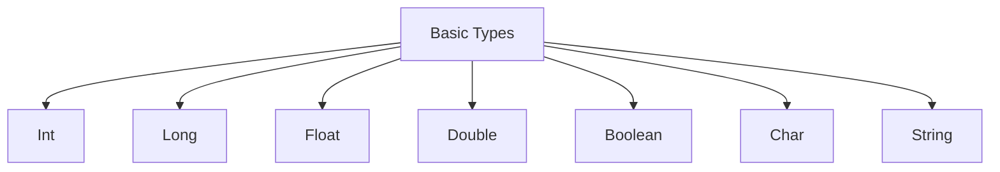
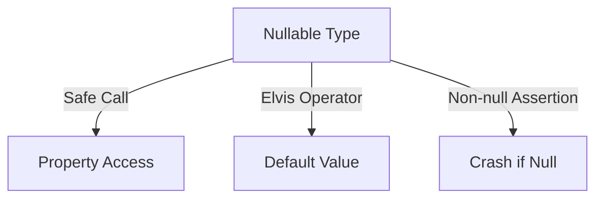
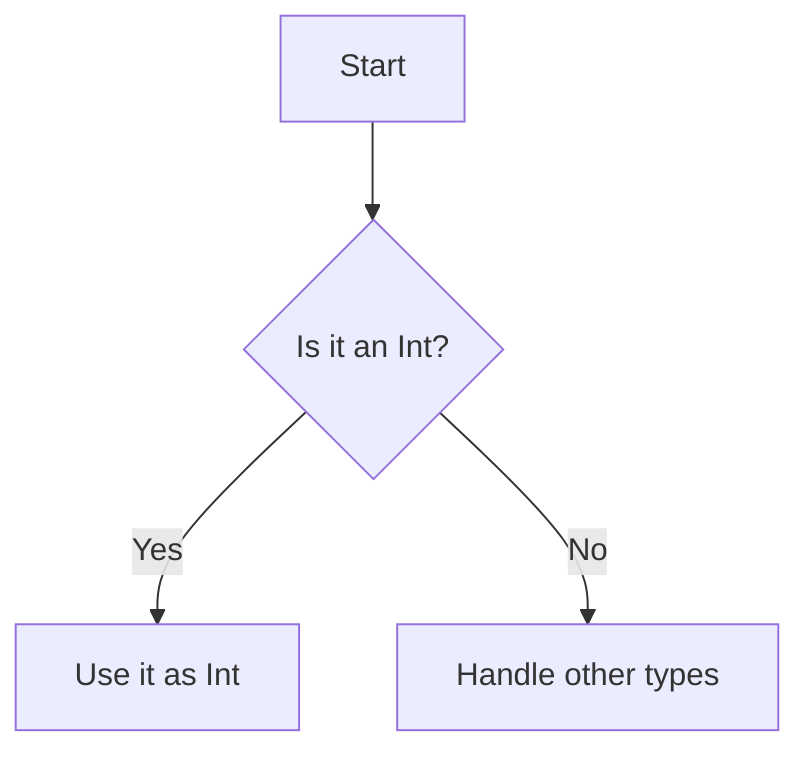
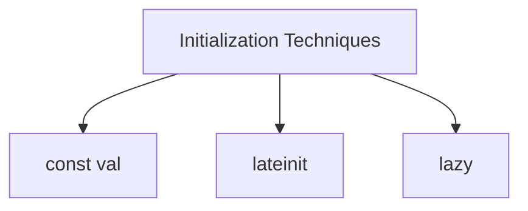

Error: API request failed with error: 401 Client Error: Unauthorized for url: https://openrouter.ai/api/v1/chat/completions

# <span style="color:#e67e22;">What we will learn in this post?</span>
<ul style='list-style-type: none; padding-left: 0;'>
<li><span style='color: #2980b9; font-size: 20px; font-weight: bold;'>👉</span> <span style='color: #2ecc71; font-size: 18px; font-weight: bold;'>Variables: val vs var</span></li>
<li><span style='color: #2980b9; font-size: 20px; font-weight: bold;'>👉</span> <span style='color: #2ecc71; font-size: 18px; font-weight: bold;'>Basic Data Types</span></li>
<li><span style='color: #2980b9; font-size: 20px; font-weight: bold;'>👉</span> <span style='color: #2ecc71; font-size: 18px; font-weight: bold;'>Nullable Types and Null Safety</span></li>
<li><span style='color: #2980b9; font-size: 20px; font-weight: bold;'>👉</span> <span style='color: #2ecc71; font-size: 18px; font-weight: bold;'>Type Inference and Smart Casts</span></li>
<li><span style='color: #2980b9; font-size: 20px; font-weight: bold;'>👉</span> <span style='color: #2ecc71; font-size: 18px; font-weight: bold;'>String Templates and Manipulation</span></li>
<li><span style='color: #2980b9; font-size: 20px; font-weight: bold;'>👉</span> <span style='color: #2ecc71; font-size: 18px; font-weight: bold;'>Type Aliases and Type Checking</span></li>
<li><span style='color: #2980b9; font-size: 20px; font-weight: bold;'>👉</span> <span style='color: #2ecc71; font-size: 18px; font-weight: bold;'>Constants and Late Initialization</span></li>
</ul>

# <span style="color:#e67e22">Kotlin Variable Declarations</span> 📝

Kotlin offers two main ways to declare variables: **`val`** and **`var`**. Let's break them down!

## <span style="color:#2980b9">Immutable vs Mutable</span> 🔒

- **`val`**: This is for **immutable** (read-only) references. Once you assign a value, you can't change it.
- **`var`**: This is for **mutable** variables. You can change the value whenever you want.

### <span style="color:#8e44ad">Why Immutability is Encouraged</span> 🌱

- **Safety**: Reduces bugs since values can't change unexpectedly.
- **Clarity**: Makes your code easier to understand.
- **Performance**: Can lead to optimizations by the compiler.

### <span style="color:#8e44ad">When to Use Each</span> ⚖️

- Use **`val`** when you know the value won't change.
- Use **`var`** when you need to update the value later.

### <span style="color:#2980b9">Practical Examples</span> 💻

```kotlin
val name: String = "Alice" // Immutable
var age: Int = 30          // Mutable

age = 31                  // This is fine!
```

In this example, `name` can't be changed, while `age` can be updated. 

For more details, check out the [Kotlin Documentation](https://kotlinlang.org/docs/variables.html).

### <span style="color:#8e44ad">Quick Summary</span> 📚

- **`val`**: Use for constants.
- **`var`**: Use for variables that change.

Embrace immutability for cleaner and safer code! Happy coding! 🎉

# <span style="color:#e67e22">Kotlin's Basic Types</span> 🌟

Kotlin is a modern programming language that treats everything as an object. This means there are **no primitive types** like in Java. Let's explore the basic types in Kotlin! 

## <span style="color:#2980b9">Basic Types</span> 🛠️

- **Int**: Represents whole numbers. Example: `val age: Int = 25`
- **Long**: For larger whole numbers. Example: `val distance: Long = 100000L`
- **Float**: For decimal numbers with less precision. Example: `val pi: Float = 3.14F`
- **Double**: For decimal numbers with more precision. Example: `val e: Double = 2.71828`
- **Boolean**: Represents true or false. Example: `val isKotlinFun: Boolean = true`
- **Char**: Represents a single character. Example: `val letter: Char = 'K'`
- **String**: Represents a sequence of characters. Example: `val greeting: String = "Hello, Kotlin!"`

### <span style="color:#8e44ad">Type Inference</span> 🔍

Kotlin can often figure out the type for you! This is called **type inference**. For example:

```kotlin
val number = 42 // Kotlin infers this as Int
val name = "Alice" // Kotlin infers this as String
```

### <span style="color:#8e44ad">Key Points</span> 📌

- Everything is an object in Kotlin.
- No primitive types like in Java.
- Type inference makes coding easier!

For more information, check out the [Kotlin Documentation](https://kotlinlang.org/docs/reference/basic-types.html).



Happy coding with Kotlin! 🎉

# <span style="color:#e67e22">Kotlin's Null Safety System</span> 🚀

Kotlin has a fantastic way to handle null values, making your code safer and easier to read. Let’s explore how it does this!

## <span style="color:#2980b9">Understanding Nullable Types</span> 🤔

In Kotlin, you can define a variable that can hold a null value using the `?` operator. Think of it like a box that can either be empty (null) or hold something.

```kotlin
var name: String? = null // This box can be empty or hold a String
```

### <span style="color:#8e44ad">Safe Calls with `?.`</span> 🔒

When you want to access a property of a nullable type, use the safe call operator `?.`. This prevents crashes if the box is empty.

```kotlin
val length = name?.length // If name is null, length will also be null
```

### <span style="color:#8e44ad">Elvis Operator `?:`</span> 🎉

The Elvis operator helps you provide a default value if the variable is null. It’s like saying, “If the box is empty, give me something else!”

```kotlin
val displayName = name ?: "Guest" // If name is null, displayName will be "Guest"
```

### <span style="color:#8e44ad">Non-null Assertion `!!`</span> ⚠️

If you are sure a variable is not null, you can use `!!` to assert it. But be careful! If it is null, it will throw an exception.

```kotlin
val sureName = name!! // This will crash if name is null
```

## <span style="color:#2980b9">How Kotlin Eliminates NullPointerExceptions</span> 🛡️

Kotlin’s system prevents many common errors by:

- **Making nullability explicit**: You must declare if a variable can be null.
- **Providing safe access**: Using `?.` and `?:` keeps your code safe from crashes.

### <span style="color:#8e44ad">Visual Representation</span> 📊



For more information, check out the [Kotlin Documentation](https://kotlinlang.org/docs/null-safety.html).

Kotlin’s null safety features make programming smoother and help you avoid those pesky `NullPointerExceptions`. Happy coding! 🎉

# <span style="color:#e67e22">Kotlin's Type Inference & Smart Casts</span> 🌟

Kotlin is a modern programming language that makes coding easier and more enjoyable! One of its best features is **type inference**, which helps reduce boilerplate code. Let’s explore how this works!

## <span style="color:#2980b9">What is Type Inference?</span> 🤔

Type inference means that Kotlin can automatically figure out the type of a variable without you having to specify it. This leads to cleaner and more readable code. For example:

```kotlin
val name = "Kotlin" // No need to specify String type
```

### <span style="color:#8e44ad">Benefits of Type Inference</span> 🎉

- **Less Code**: Write less and do more!
- **Readability**: Your code is easier to read and understand.
- **Fewer Errors**: The compiler helps catch mistakes early.

## <span style="color:#2980b9">Smart Casts</span> 🔍

Kotlin also has **smart casts**. After you check a variable's type or if it's null, Kotlin automatically casts it for you. This means you don’t need to cast it manually!

For example:

```kotlin
fun printLength(obj: Any) {
    if (obj is String) {
        println(obj.length) // No need for explicit cast
    }
}
```

### <span style="color:#8e44ad">Why Smart Casts are Great</span> 🌈

- **Simplicity**: Less code to write.
- **Safety**: Reduces the chance of runtime errors.

## <span style="color:#2980b9">The Compiler is Your Friend!</span> 🤝

Kotlin’s compiler helps you write better code. It checks for errors and suggests improvements, making your coding journey smoother. Embrace it!

For more information, check out the [Kotlin Documentation](https://kotlinlang.org/docs/reference/).

---

With Kotlin, you can enjoy coding with less hassle and more fun! Happy coding! 🎈

# <span style="color:#e67e22">String Templates and Text Processing in Python</span>

## <span style="color:#2980b9">Understanding String Templates 💡</span>

In Python, string templates help you create dynamic strings easily. You can use `$` and `${}` to embed expressions right into your strings. Here’s how:

```python
name = "Alice"
greeting = f"Hello, {name}!"  # Using f-string
print(greeting)  # Output: Hello, Alice!
```

### <span style="color:#8e44ad">Multiline Strings 📜</span>

For longer texts, use triple quotes. This allows you to write strings across multiple lines without worrying about line breaks.

```python
message = """This is a
multiline string.
Isn't it cool?"""
print(message)
```

## <span style="color:#2980b9">Common String Operations 🔧</span>

Here are some handy string operations:

- **Concatenation**: Combine strings using `+`.
  
  ```python
  full_name = "Alice" + " " + "Smith"
  ```

- **Upper and Lower Case**: Change case easily.
  
  ```python
  print(full_name.upper())  # ALICE SMITH
  print(full_name.lower())  # alice smith
  ```

- **Splitting Strings**: Break a string into a list.
  
  ```python
  words = "Hello World".split()  # ['Hello', 'World']
  ```

## <span style="color:#2980b9">Practical Example 🛠️</span>

Let’s say you want to format a message for a user:

```python
user = "Bob"
age = 30
message = f"{user} is {age} years old."
print(message)  # Output: Bob is 30 years old.
```

For more details, check out the [Python String Documentation](https://docs.python.org/3/library/string.html).

Happy coding! 🎉

# <span style="color:#e67e22">Understanding Type Aliases, Type Checking, and Casting in Swift</span>

## <span style="color:#2980b9">What is a Type Alias? 🤔</span>

A **type alias** in Swift allows you to create a new name for an existing type. This makes your code more readable and easier to understand.

### Example:
```swift
typealias Age = Int
```
Now, instead of using `Int`, you can use `Age`:
```swift
var myAge: Age = 30
```

## <span style="color:#2980b9">Type Checking with `is` and `!is` 🔍</span>

The `is` operator checks if an object is of a certain type, while `!is` checks if it is not.

### Example:
```swift
if myAge is Int {
    print("It's an integer!")
}
```

## <span style="color:#2980b9">Explicit Casting with `as` 🎭</span>

The `as` operator is used to cast an object to a specific type.

### Example:
```swift
let number: Any = 42
if let myNumber = number as? Int {
    print("The number is \(myNumber)")
}
```

### Flowchart of Type Checking and Casting:


## <span style="color:#2980b9">Key Takeaways 📌</span>

- **Type Aliases** improve code readability.
- **`is` and `!is`** help in type checking.
- **`as`** allows for safe type casting.

For more information, check out [Swift Documentation](https://developer.apple.com/documentation/swift).

Happy coding! 😊

# <span style="color:#e67e22">Understanding Kotlin Initialization Techniques</span>

## <span style="color:#2980b9">Compile-Time Constants with `const val`</span>

In Kotlin, you can define constants using `const val`. These are values that are known at compile time and cannot change.

```kotlin
const val MAX_USERS = 100 // This is a compile-time constant
```

- **Usage**: Great for values that won't change, like configuration settings.

## <span style="color:#2980b9">Using `lateinit` for Non-Null Properties</span>

Sometimes, you need to declare a property that you will initialize later. Use `lateinit` for this.

```kotlin
class User {
    lateinit var name: String // Declared but not initialized yet

    fun initializeName() {
        name = "Alice" // Now we initialize it
    }
}
```

- **Note**: `lateinit` can only be used with non-nullable types.

## <span style="color:#2980b9">Lazy Delegation for Deferred Initialization</span>

If you want to initialize a property only when it's accessed, use `lazy`.

```kotlin
val lazyValue: String by lazy {
    println("Computed!") // This runs only when lazyValue is accessed
    "Hello, World!"
}
```

- **Benefit**: Saves resources by delaying initialization until necessary.

### <span style="color:#8e44ad">Summary</span>

- **`const val`**: For compile-time constants.
- **`lateinit`**: For properties initialized later.
- **`lazy`**: For properties initialized on first access.

For more information, check out the [Kotlin Documentation](https://kotlinlang.org/docs/properties.html).



Feel free to explore these techniques to make your Kotlin code cleaner and more efficient! 😊

