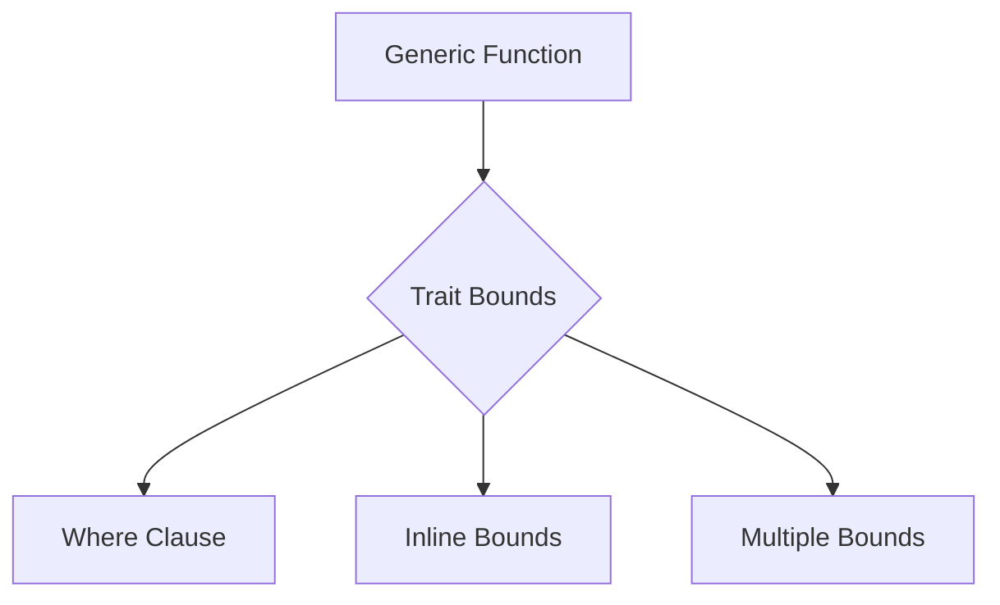
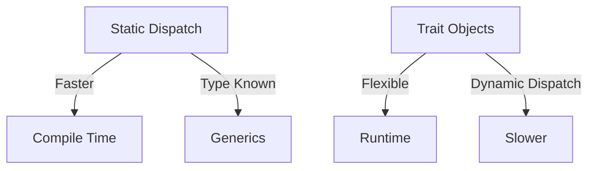

Error: API request failed with error: 401 Client Error: Unauthorized for url: https://openrouter.ai/api/v1/chat/completions

# <span style="color:#e67e22;">What we will learn in this post?</span>
<ul style='list-style-type: none; padding-left: 0;'>
<li><span style='color: #2980b9; font-size: 20px; font-weight: bold;'>👉</span> <span style='color: #2ecc71; font-size: 18px; font-weight: bold;'>Understanding Traits</span></li>
<li><span style='color: #2980b9; font-size: 20px; font-weight: bold;'>👉</span> <span style='color: #2ecc71; font-size: 18px; font-weight: bold;'>Generic Functions and Types</span></li>
<li><span style='color: #2980b9; font-size: 20px; font-weight: bold;'>👉</span> <span style='color: #2ecc71; font-size: 18px; font-weight: bold;'>Trait Bounds and Constraints</span></li>
<li><span style='color: #2980b9; font-size: 20px; font-weight: bold;'>👉</span> <span style='color: #2ecc71; font-size: 18px; font-weight: bold;'>Common Standard Traits</span></li>
<li><span style='color: #2980b9; font-size: 20px; font-weight: bold;'>👉</span> <span style='color: #2ecc71; font-size: 18px; font-weight: bold;'>Trait Objects and Dynamic Dispatch</span></li>
<li><span style='color: #2980b9; font-size: 20px; font-weight: bold;'>👉</span> <span style='color: #2ecc71; font-size: 18px; font-weight: bold;'>Associated Types in Traits</span></li>
<li><span style='color: #2980b9; font-size: 20px; font-weight: bold;'>👉</span> <span style='color: #2ecc71; font-size: 18px; font-weight: bold;'>Derive Macros and Auto-traits</span></li>
</ul>

# <span style="color:#e67e22">Understanding Traits in Rust</span> 🌟

## <span style="color:#2980b9">What are Traits?</span>

Traits in Rust are like **blueprints** for shared behavior. Imagine you have a group of friends, and you all agree to play a game with specific rules. Each friend can play in their own way, but they all follow the same rules. That's what traits do for types in Rust!

### <span style="color:#8e44ad">Defining a Trait</span>

You define a trait using the `trait` keyword. For example:

```rust
trait Speak {
    fn say(&self);
}
```

### <span style="color:#8e44ad">Implementing Traits</span>

You can implement this trait for different types. For instance:

```rust
struct Dog;
impl Speak for Dog {
    fn say(&self) {
        println!("Woof!");
    }
}

struct Cat;
impl Speak for Cat {
    fn say(&self) {
        println!("Meow!");
    }
}
```

### <span style="color:#8e44ad">Default Implementations</span>

You can also provide a default behavior in a trait:

```rust
trait Speak {
    fn say(&self) {
        println!("Hello!");
    }
}
```

Now, if a type doesn't implement `say`, it will use the default.

## <span style="color:#2980b9">Why Use Traits?</span>

- **Code Reusability**: Write once, use everywhere!
- **Flexibility**: Different types can share behavior without being the same.
- **Safety**: Rust ensures that types implement the required methods.

For more on traits, check out the [Rust Book](https://doc.rust-lang.org/book/ch10-02-traits.html).

### <span style="color:#8e44ad">Quick Recap</span>

- Traits are like game rules for types.
- You define them, implement them, and can even set defaults.
- They make your code cleaner and safer!

Happy coding! 🚀

# <span style="color:#e67e22">Guide to Writing Generic Code with Type Parameters</span> 

Generics are a powerful feature in programming that allows you to write flexible and reusable code. Let's explore how they work! 🌟

## <span style="color:#2980b9">What are Generics?</span>

Generics use **type parameters** (like `<T>`) to create functions or classes that can work with any data type. This means you can write code once and use it with different types without losing type safety.

### <span style="color:#8e44ad">Benefits of Generics</span>

- **Code Reuse**: Write a function once and use it for different types.
- **Type Safety**: Errors are caught at compile time, not runtime.
- **Zero-Cost Abstraction**: Generics are often optimized by the compiler, leading to efficient code.

### <span style="color:#8e44ad">When to Use Generics?</span>

- When you want to create a function or class that can handle multiple types.
- When you need to maintain type safety while allowing flexibility.

## <span style="color:#2980b9">Example Code</span>

Here’s a simple example in TypeScript:

```typescript
// A generic function that returns the first element of an array
function getFirstElement<T>(arr: T[]): T {
    return arr[0]; // Returns the first element of the array
}

// Using the generic function with different types
const numberArray = [1, 2, 3];
const stringArray = ["Hello", "World"];

console.log(getFirstElement(numberArray)); // Output: 1
console.log(getFirstElement(stringArray)); // Output: Hello
```

### <span style="color:#8e44ad">Conclusion</span>

Generics are a fantastic way to write clean, reusable, and type-safe code. Use them when you need flexibility without sacrificing safety! 

For more information, check out [TypeScript Generics Documentation](https://www.typescriptlang.org/docs/handbook/2/generics.html). 

Happy coding! 🚀

# <span style="color:#e67e22">Understanding Generic Type Constraints in Rust</span>

## <span style="color:#2980b9">What are Trait Bounds?</span>

In Rust, **trait bounds** help us define what types can be used with generics. They ensure that a type meets certain requirements, making our code safer and more flexible.

### <span style="color:#8e44ad">Using Where Clauses</span>

You can specify trait bounds using **where clauses**. This is useful for complex scenarios. For example:

```rust
fn print_length<T>(item: T) 
where 
    T: std::fmt::Display + std::ops::Add<Output = T>,
{
    println!("Length: {}", item);
}
```

### <span style="color:#8e44ad">Using Inline Bounds</span>

Alternatively, you can use **inline bounds** directly in the function signature:

```rust
fn print_length<T: std::fmt::Display + std::ops::Add<Output = T>>(item: T) {
    println!("Length: {}", item);
}
```

## <span style="color:#2980b9">Multiple Bounds</span>

You can combine multiple traits using the `+` operator. This allows your function to accept types that implement all specified traits.

### <span style="color:#8e44ad">Example of Multiple Bounds</span>

```rust
fn process<T>(item: T) 
where 
    T: std::fmt::Display + Clone,
{
    let cloned_item = item.clone();
    println!("Item: {}", cloned_item);
}
```

## <span style="color:#2980b9">Why Use Trait Bounds?</span>

- **Safety**: Ensures types meet specific criteria.
- **Flexibility**: Allows for generic implementations.
- **Reusability**: Write code that works with multiple types.

For more information, check out the [Rust Book](https://doc.rust-lang.org/book/ch10-02-traits.html).



By using trait bounds, you can create powerful and reusable functions in Rust! Happy coding! 😊

# <span style="color:#e67e22">Essential Standard Library Traits in Rust</span>

Rust has several important traits that help us define how our types behave. Here’s a friendly guide to some of the most essential ones! 😊

## <span style="color:#2980b9">1. Clone</span>
- **What it does**: Creates a deep copy of an object.
- **When to use**: Use `Clone` when you need to duplicate data, like when you want to keep the original while modifying a copy.
- **Example**: Think of a recipe book. If you want to try a new recipe without losing the original, you’d make a clone! 📖

## <span style="color:#2980b9">2. Copy</span>
- **What it does**: Creates a bitwise copy of simple types.
- **When to use**: Use `Copy` for types that are small and simple, like integers or booleans.
- **Example**: Like copying a sticky note. You can just take another one without worrying about the original! 🗒️

## <span style="color:#2980b9">3. Debug</span>
- **What it does**: Allows for formatting a type for debugging.
- **When to use**: Implement `Debug` to easily print your type for troubleshooting.
- **Example**: It’s like having a magnifying glass to inspect your work closely! 🔍

## <span style="color:#2980b9">4. Display</span>
- **What it does**: Formats a type for user-friendly output.
- **When to use**: Use `Display` for types you want to show to users.
- **Example**: Like presenting a beautifully formatted invitation! 🎉

## <span style="color:#2980b9">5. PartialEq & Eq</span>
- **What they do**: Allow comparison of types for equality.
- **When to use**: Implement `PartialEq` for basic equality checks and `Eq` for types that are always equal if they are the same.
- **Example**: Comparing two identical apples! 🍏

## <span style="color:#2980b9">6. PartialOrd & Ord</span>
- **What they do**: Allow comparison of types for ordering.
- **When to use**: Use `PartialOrd` for types that can be partially ordered and `Ord` for total ordering.
- **Example**: Ranking your favorite movies! 🎬

### <span style="color:#8e44ad">Relationships</span>
- **Clone** and **Copy**: `Copy` is a marker trait that implies `Clone`.
- **PartialEq** and **Eq**: `Eq` is a marker trait that implies `PartialEq`.
- **PartialOrd** and **Ord**: `Ord` is a marker trait that implies `PartialOrd`.

### <span style="color:#8e44ad">Practical Use Cases</span>
- Use these traits to make your types more flexible and easier to work with in Rust.
- They help in collections, comparisons, and debugging, making your code cleaner and more efficient.

For more information, check out the [Rust Documentation](https://doc.rust-lang.org/book/ch10-02-traits.html). Happy coding! 🚀

# <span style="color:#e67e22">Understanding Trait Objects with `dyn Trait` for Runtime Polymorphism</span>

## <span style="color:#2980b9">What are Trait Objects?</span>

In Rust, **trait objects** allow for *runtime polymorphism*. This means you can call methods on different types that implement the same trait without knowing their exact type at compile time. You use `dyn Trait` to create a trait object.

### <span style="color:#8e44ad">Example:</span>

```rust
trait Shape {
    fn area(&self) -> f64;
}

struct Circle {
    radius: f64,
}

impl Shape for Circle {
    fn area(&self) -> f64 {
        std::f64::consts::PI * self.radius * self.radius
    }
}

fn print_area(shape: &dyn Shape) {
    println!("Area: {}", shape.area());
}
```

## <span style="color:#2980b9">Static Dispatch vs. Trait Objects</span>

- **Static Dispatch** (Generics):
  - The compiler knows the exact type at compile time.
  - Faster performance due to inlining.
  
- **Trait Objects**:
  - Resolved at runtime, which can be slower.
  - More flexible, allowing different types to be used interchangeably.

### <span style="color:#8e44ad">Performance Trade-offs:</span>

- **Static Dispatch**: 
  - Faster, no overhead.
  
- **Trait Objects**: 
  - Slightly slower due to dynamic dispatch.
  
## <span style="color:#2980b9">Object Safety Rules</span>

To use trait objects, the trait must be **object-safe**. This means:
- No generic methods.
- No methods that return `Self`.

## <span style="color:#2980b9">When to Use Trait Objects?</span>

- When you need flexibility and don’t know the types at compile time.
- When working with heterogeneous collections (e.g., a vector of different shapes).

### <span style="color:#8e44ad">Conclusion</span>

Trait objects are powerful for achieving polymorphism in Rust. Use them when you need flexibility, but be mindful of the performance trade-offs. For more detailed information, check out the [Rust Book](https://doc.rust-lang.org/book/ch17-02-trait-objects.html).



Feel free to ask more questions about Rust or any other topic! 😊

# <span style="color:#e67e22">Understanding Associated Types in Traits</span>

## <span style="color:#2980b9">What are Associated Types?</span>

Associated types are a powerful feature in Rust that allow you to define a type placeholder within a trait. This is different from using generic parameters, which can sometimes make code harder to read.

### <span style="color:#8e44ad">Why Use Associated Types?</span>

- **Clarity**: They make the code easier to understand by reducing the number of type parameters.
- **Simplicity**: You can define a trait without needing to specify types every time you use it.

### <span style="color:#8e44ad">Example: Iterator Trait</span>

Here’s a simple example to illustrate:

```rust
// Define a trait with an associated type
trait MyIterator {
    type Item; // Associated type

    fn next(&mut self) -> Option<Self::Item>; // Use associated type
}

// Implementing the trait for a vector
struct VecIterator {
    vec: Vec<i32>,
    index: usize,
}

impl MyIterator for VecIterator {
    type Item = i32; // Specify the associated type

    fn next(&mut self) -> Option<Self::Item> {
        if self.index < self.vec.len() {
            let item = self.vec[self.index];
            self.index += 1;
            Some(item)
        } else {
            None
        }
    }
}
```

### <span style="color:#2980b9">Benefits for API Design</span>

- **Easier to Use**: Users of your API don’t have to specify types repeatedly.
- **Flexibility**: You can change the associated type without breaking existing code.

For more information, check out the [Rust Book](https://doc.rust-lang.org/book/ch19-03-advanced-traits.html).

### <span style="color:#8e44ad">Conclusion</span>

Using associated types can make your Rust code cleaner and more intuitive. Embrace this feature to enhance your API design! Happy coding! 🚀

# <span style="color:#e67e22">Using #[derive] for Automatic Trait Implementations</span> 🌟

## <span style="color:#2980b9">What is #[derive]?</span>

The `#[derive]` attribute in Rust helps you automatically implement common traits for your structs and enums. This saves you time and keeps your code clean! 

### <span style="color:#8e44ad">Common Derivable Traits</span>

Here are some traits you can derive easily:

- **Clone**: Create a copy of your struct.
- **Debug**: Print your struct for easy debugging.
- **PartialEq**: Compare two instances for equality.

```rust
#[derive(Debug, Clone, PartialEq)]
struct Person {
    name: String,
    age: u32,
}
```

## <span style="color:#2980b9">Auto Traits: Send and Sync</span> 🚀

- **Send**: Allows safe transfer of data between threads.
- **Sync**: Allows safe access to data from multiple threads.

Most types are automatically `Send` and `Sync` if they contain only `Send` and `Sync` types.

## <span style="color:#2980b9">Custom Derive Macros</span> ✨

You can create your own derive macros for custom behavior! This is a bit advanced but super powerful.

### <span style="color:#8e44ad">Resources for More Info</span>

- [Rust Documentation on Derive](https://doc.rust-lang.org/book/ch05-01-defining-structs.html#deriving-traits)
- [Understanding Send and Sync](https://doc.rust-lang.org/book/ch16-01-threads.html#send-and-sync)

Feel free to explore and have fun with Rust! Happy coding! 🎉

