# <span style="color:#e67e22;">What we will learn in this post?</span>

<ul style='list-style-type: none; padding-left: 0;'>
<li><span style='color: #2980b9; font-size: 20px; font-weight: bold;'>👉</span> <span style='color: #2ecc71; font-size: 18px; font-weight: bold;'>Introduction to Python</span></li>
<li><span style='color: #2980b9; font-size: 20px; font-weight: bold;'>👉</span> <span style='color: #2ecc71; font-size: 18px; font-weight: bold;'>Key Features of Python</span></li>
<li><span style='color: #2980b9; font-size: 20px; font-weight: bold;'>👉</span> <span style='color: #2ecc71; font-size: 18px; font-weight: bold;'>History and Evolution of Python</span></li>
<li><span style='color: #2980b9; font-size: 20px; font-weight: bold;'>👉</span> <span style='color: #2ecc71; font-size: 18px; font-weight: bold;'>Python 3.13 - What's New?</span></li>
<li><span style='color: #2980b9; font-size: 20px; font-weight: bold;'>👉</span> <span style='color: #2ecc71; font-size: 18px; font-weight: bold;'>Setting Up Python Development Environment</span></li>
<li><span style='color: #2980b9; font-size: 20px; font-weight: bold;'>👉</span> <span style='color: #2ecc71; font-size: 18px; font-weight: bold;'>Python IDEs and Text Editors</span></li>
<li><span style='color: #2980b9; font-size: 20px; font-weight: bold;'>👉</span> <span style='color: #2ecc71; font-size: 18px; font-weight: bold;'>Writing Your First Python Program</span></li>
<li><span style='color: #2980b9; font-size: 20px; font-weight: bold;'>👉</span> <span style='color: #2ecc71; font-size: 18px; font-weight: bold;'>Conclusion!</span></li>
</ul>

# <span style="color:#e67e22">Python: Your All-Purpose Programming Pal 🐍</span>

Python is a fantastic, easy-to-learn programming language. It's like a super-powered Swiss Army knife for computers!

## <span style="color:#2980b9">What Can Python Do? ⚙️</span>

Python is incredibly **versatile**. It's used for:

- **Web Development:** Building websites and apps (backend stuff!).
- **Data Science:** Analyzing data to find cool insights. 📊
- **AI/ML:** Creating intelligent machines and algorithms.🤖
- **Automation:** Making repetitive tasks automatic. ⏰
- _And much, much more!_

## <span style="color:#2980b9">Why is Python so Popular? 🤔</span>

Python is loved because:

- It's easy to read (almost like plain English!).
- It has a huge community offering support and libraries.
- It's used by big companies like Google, Netflix, and Spotify. 🏢

Currently, the latest version is **Python 3.13**. Start learning Python today and open up a world of possibilities! 🚀

### <span style="color:#8e44ad">Further Resources</span>

- [Official Python Website](https://www.python.org/)
- [Python Tutorial](https://docs.python.org/3/tutorial/index.html)

# <span style="color:#e67e22">Python's Awesome Features 🐍</span>

Let's explore what makes Python so popular and easy to love!

## <span style="color:#2980b9">Why Python Rocks: Key Features</span>

- **Simplicity and Readability ✨:** Python's syntax is _super_ clean and easy to understand, like reading plain English.

  ```python
  # Example: Simple if statement
  if age >= 18:
      print("You can vote!")
  ```

  Unlike other languages with lots of confusing symbols, Python keeps it simple.

- **Interpreted Nature ⚙️:** Python code is executed line by line. This makes debugging easier because you can find errors quickly. It doesn't need to be compiled into machine code before running, saving you time!

  ```mermaid
  graph LR
  A([📄 Source Code]):::source --> B((🔧 Interpreter)):::interpreter;
  B --> C{⚡ Execute Line}:::execute;
  C -->|Yes| D([✅ Output/Error]):::output;
  C -->|No| C;

  classDef source fill:#3498db,stroke:#2980b9,stroke-width:3px,stroke-dasharray:5;
  classDef interpreter fill:#e74c3c,stroke:#c0392b,stroke-width:3px;
  classDef execute fill:#f39c12,stroke:#e67e22,stroke-width:2px;
  classDef output fill:#27ae60,stroke:#16a085,stroke-width:2px,stroke-dasharray:3;
  ```

- **Dynamic Typing ✏️:** You don't have to declare variable types in Python. The interpreter figures it out for you!

  ```python
  # Example: Dynamic Typing
  x = 10       # x is an integer
  x = "Hello"  # x is now a string
  ```

- **Extensive Standard Library 📚:** Python comes with a _huge_ collection of modules and functions ready to use. Need to work with files, web requests, or math? Python has you covered.

  ```python
  # Example: Using the math module
  import math
  print(math.sqrt(25)) # Output: 5.0
  ```

- **Cross-Platform Compatibility 💻:** Python runs on Windows, macOS, Linux, and more! Write code once, run it almost anywhere.

  ```mermaid
  graph LR
  A([🐍 Python Code]):::code --> B([🪟 Windows]):::windows;
  A --> C([🍎 MacOS]):::macos;
  A --> D([🐧 Linux]):::linux;

  classDef code fill:#9b59b6,stroke:#8e44ad,stroke-width:4px,stroke-dasharray:5;
  classDef windows fill:#3498db,stroke:#2980b9,stroke-width:3px;
  classDef macos fill:#34495e,stroke:#2c3e50,stroke-width:3px;
  classDef linux fill:#f39c12,stroke:#e67e22,stroke-width:3px;
  ```

## <span style="color:#2980b9">Extra Resources 🌐</span>

For even more information, check out these links:

- [Python Documentation](https://docs.python.org/3/)
- [Real Python Tutorials](https://realpython.com/)

# <span style="color:#e67e22">Python's Amazing Journey 🐍</span>

Python, a super popular coding language, started in **1991** with Guido van Rossum. He wanted a language that was easy to read and powerful.

## <span style="color:#2980b9">Major Milestones 🚀</span>

Python quickly grew, becoming a favorite for beginners and experts alike. A big turning point was the move from _Python 2_ to _Python 3_. Python 3 made some big changes to clean up the language, but it meant old Python 2 code sometimes needed tweaking.

- **Python 3.6**: Introduced f-strings for easier string formatting.
- **Python 3.10**: Added pattern matching, a way to make code cleaner when checking different conditions.
- **Python 3.12**: Showed off better error messages and `performance` improvements.
- **Python 3.13**: More speed enhancements and developer experience upgrades are expected.

Python keeps evolving, staying modern and useful! The development continues with new features to make it an even more powerful tool. 🧑‍💻

```mermaid
graph LR
    A([🎯 Python 1.0]):::v1 --> B((🚀 Python 2.0)):::v2
    B --> C{⭐ Python 3.0}:::v3;
    C --> D([💎 Python 3.6]):::v36;
    C --> E([🔥 Python 3.10]):::v310;
    C --> F([⚡ Python 3.12]):::v312;
    C --> G([🌟 Python 3.13]):::v313;

    classDef v1 fill:#95a5a6,stroke:#7f8c8d,stroke-width:2px;
    classDef v2 fill:#3498db,stroke:#2980b9,stroke-width:3px;
    classDef v3 fill:#e74c3c,stroke:#c0392b,stroke-width:4px,stroke-dasharray:5;
    classDef v36 fill:#f39c12,stroke:#e67e22,stroke-width:2px;
    classDef v310 fill:#9b59b6,stroke:#8e44ad,stroke-width:2px;
    classDef v312 fill:#1abc9c,stroke:#16a085,stroke-width:2px;
    classDef v313 fill:#e67e22,stroke:#d35400,stroke-width:3px,stroke-dasharray:3;
```



📚 **For more info:**

- [Python's Official Website](https://www.python.org/)
- [Python Documentation](https://docs.python.org/3/)

Alright, let's dive into the exciting new features of Python 3.13! 🚀

# <span style="color:#e67e22">Python 3.13: What's New?</span>

Python 3.13 (released October 2024) brings some _game-changing_ improvements! Here's what makes it special:

## <span style="color:#2980b9">🚀 Experimental JIT Compiler (Just-In-Time)</span>

Python 3.13 introduces an **experimental JIT compiler** that can make your code run _significantly faster_! In some cases, you can see up to **2x performance improvements**. While it's still experimental, this is a huge step forward for Python's speed.

```python
# Enable JIT when running Python
# python --enable-experimental-jit your_script.py
```

## <span style="color:#2980b9">🔓 Free-Threaded Mode (No GIL!)</span>

This is **MASSIVE**! Python 3.13 can now run without the Global Interpreter Lock (GIL) using the `--disable-gil` flag. This means true parallel processing for CPU-intensive tasks! Before this, Python could only run one thread at a time, even on multi-core processors.

```python
# Run Python without GIL for better multi-threading
# python --disable-gil your_parallel_script.py
```

## <span style="color:#2980b9">📱 Mobile Platform Support</span>

Python now officially supports **iOS and Android** as tier-3 platforms! You can build Python apps for mobile devices natively. This opens up exciting new possibilities for mobile development with Python.

## <span style="color:#2980b9">🎨 Better Error Messages & REPL</span>

Error messages are now even more informative. They provide clearer guidance, helping you debug your code faster. The interactive shell (REPL) also got major upgrades:

- **Smarter suggestions:** Python guesses what you meant when you make typos
- **Multi-line editing:** Edit code across multiple lines easily
- **Syntax highlighting:** Colors in your terminal make code easier to read

```python
# Example of improved error messages:
>>> print(name)
NameError: name 'name' is not defined. Did you mean: 'main'?
```

## <span style="color:#2980b9">🗑️ Deprecations & Removals</span>

Python 3.13 cleaned house! Some old, rarely-used features from the Python 2 era have been removed:

- Removed 20-year-old deprecated functions
- `wave.Wave_read.getmarkers()` and related methods removed
- `locale.getdefaultlocale()` deprecated (use `locale.setlocale()` instead)

This keeps Python modern and easier to maintain!

## <span style="color:#2980b9">Resources</span>

- Check the official Python documentation and "What's New" section for the most comprehensive and up-to-date information:
  - [Python Official Documentation](https://docs.python.org/3/)
  - [What’s New In Python 3.13](https://docs.python.org/3.13/whatsnew/3.13.html)

Remember to always refer to the official documentation for the complete and accurate details! Happy coding! 🐍✨

# <span style="color:#e67e22">Installing Python 3.13: A Friendly Guide 🐍</span>

This guide will walk you through installing Python 3.13 on Windows, macOS, and Linux! Let's get started!

## <span style="color:#2980b9">Step-by-Step Installation</span>

- **Windows:**
  1. Download the installer from [Python.org](https://www.python.org/downloads/windows/).
  2. Run the installer. _Important:_ Check "**Add Python 3.13 to PATH**" during installation!
  3. Click "Install Now."

- **macOS:**
  1. Download the macOS installer from [Python.org](https://www.python.org/downloads/macos/).
  2. Open the `.pkg` file and follow the on-screen instructions.
  3. The installer usually sets up the PATH automatically.

- **Linux:**
  1. Use your distribution's package manager. For example, on Debian/Ubuntu: `sudo apt update && sudo apt install python3.13`
  2. On Fedora/CentOS/RHEL: `sudo dnf install python3.13`

## <span style="color:#2980b9">Verifying Installation & Setting PATH</span>

1. Open your command prompt or terminal.
2. Type `python3.13 --version` or `python --version` if python3.13 is your main Python.

    _If you get an error, you might need to manually set the PATH._

3. **Windows (If needed):** Search "environment variables," edit system variables, and add `C:\Users\<YourUser>\AppData\Local\Programs\Python\Python313` and `C:\Users\<YourUser>\AppData\Local\Programs\Python\Python313\Scripts` to the `Path` variable.
4. **macOS/Linux (If needed):** Edit your `.bashrc` or `.zshrc` file (usually in your home directory). Add `export PATH="/Library/Frameworks/Python.framework/Versions/3.13/bin:$PATH"` (macOS) or `export PATH="/usr/bin/python3.13:$PATH"` (Linux). Then, run `source ~/.bashrc` or `source ~/.zshrc`.

## <span style="color:#2980b9">Installing Pip 📦</span>

- Pip should be installed automatically with Python 3.13. Verify by typing `pip3.13 --version` or `pip --version` in your command prompt/terminal.

  _If pip is missing:_
  1. Download `get-pip.py` from [bootstrap.pypa.io/get-pip.py](https://bootstrap.pypa.io/get-pip.py).
  2. Run `python3.13 get-pip.py` or `python get-pip.py` from your command prompt/terminal.

You're all set! Happy coding! 🎉

# <span style="color:#e67e22">Python Development Environments: A Quick Tour 🚀</span>

Choosing the right place to write your Python code is super important! Think of it like picking the right tools for a job. Here's a quick peek at some popular options:

## <span style="color:#2980b9">The Big Players 🌟</span>

- **PyCharm:** This is like the _deluxe_ option. It's a powerful IDE (Integrated Development Environment) made specifically for Python. It has tons of features like smart code completion, debugging, and support for web frameworks like Django and Flask. Great for bigger projects! Think of it as your **professional toolbox**.
- **VS Code (Visual Studio Code):** Super popular and versatile! VS Code is a lightweight, _customizable_ editor that can be turned into a powerful Python IDE with extensions. It’s free and works with many languages. Many people loves it! _Highly recommended_ if you are looking for a _free_ and _powerful_ tools! [VS Code Python Documentation](https://code.visualstudio.com/docs/languages/python)
- **Jupyter Notebook:** Imagine a _digital notebook_ where you can write code, add text, and see your results right away. Perfect for learning, experimenting, and data science. It's _interactive_ and great for sharing your work.

## <span style="color:#2980b9">The Simple & Classic Options 📚</span>

- **IDLE:** This is the _basic editor_ that comes with Python. Simple and easy to use, great for beginners. Its more of a note pad like environment, but a great learning tool.
- **Sublime Text:** A _fast_ and _flexible_ text editor. It doesn't have all the fancy features of PyCharm, but it's quick to load and you can add features with plugins.

Here's a _simple_ diagram to help you decide:

```mermaid
graph TD
    A([📊 Project Size]):::size --> B{🔹 Small}:::small
    A --> C{🔸 Medium}:::medium
    A --> D{🔶 Large}:::large

    B --> E([📝 IDLE/Sublime Text]):::basic
    C --> F([💻 VS Code/Jupyter]):::advanced
    D --> G([🚀 PyCharm]):::professional

    classDef size fill:#e74c3c,stroke:#c0392b,stroke-width:4px,stroke-dasharray:5;
    classDef small fill:#3498db,stroke:#2980b9,stroke-width:2px;
    classDef medium fill:#f39c12,stroke:#e67e22,stroke-width:2px;
    classDef large fill:#e67e22,stroke:#d35400,stroke-width:2px;
    classDef basic fill:#95a5a6,stroke:#7f8c8d,stroke-width:2px;
    classDef advanced fill:#9b59b6,stroke:#8e44ad,stroke-width:3px;
    classDef professional fill:#27ae60,stroke:#16a085,stroke-width:3px,stroke-dasharray:3;
```



**In Short:** Find the right environment that **fits** your _style_ and _project_. Good luck coding! 💻

# <span style="color:#e67e22">Hello, World! in Python 🐍</span>

Let's get started with Python! This guide will walk you through creating and running your first "Hello, World!" program.

## <span style="color:#2980b9">The Basic "Hello, World!"</span>

Writing this program is super simple:

```python
print("Hello, World!")
```

This single line is all you need! The `print()` function displays text on your screen.

```
Output: Hello, World!
```

## <span style="color:#2980b9">Running Your Code</span>

### <span style="color:#8e44ad">From the Command Line</span>

1. Save the code above in a file named `hello.py`.
2. Open your terminal or command prompt.
3. Navigate to the directory where you saved `hello.py`.
4. Type `python hello.py` and press Enter. You should see "Hello, World!" printed.

### <span style="color:#8e44ad">Using an IDE</span>

Most _IDEs_ (Integrated Development Environments) like VS Code or PyCharm have a run button. Just open your `hello.py` file in the IDE and click the run button. The output will usually appear in a console window within the IDE.

## <span style="color:#2980b9">A Little More Fun: User Input</span>

Let's make it interactive:

```python
name = input("What's your name? ")
print("Hello, " + name + "!")
```

This code first _asks_ the user for their name using the `input()` function and then _greets_ them personally.

```
Output:
What's your name? Alice
Hello, Alice!
```

## <span style="color:#2980b9">Code Structure</span>

- **`print()`:** A built-in Python function that displays text.
- **`input()`:** A built-in function that prompts the user for input.
- **Strings:** Text enclosed in double quotes (e.g., `"Hello, World!"`).
- **Variables:** Used to store values (e.g., `name`).

For a deeper dive, check out the [official Python documentation](https://docs.python.org/3/). Happy coding! 🚀

<h1><span style='color:#e67e22'>Conclusion</span></h1>

So, what are your thoughts? Did anything in this post resonate with you? 🤔 We'd love to hear your experiences, feedback, or even just a simple "hello!" 👋 Drop a comment below and let's chat! 👇 Your insights make this community even better. 🤗
