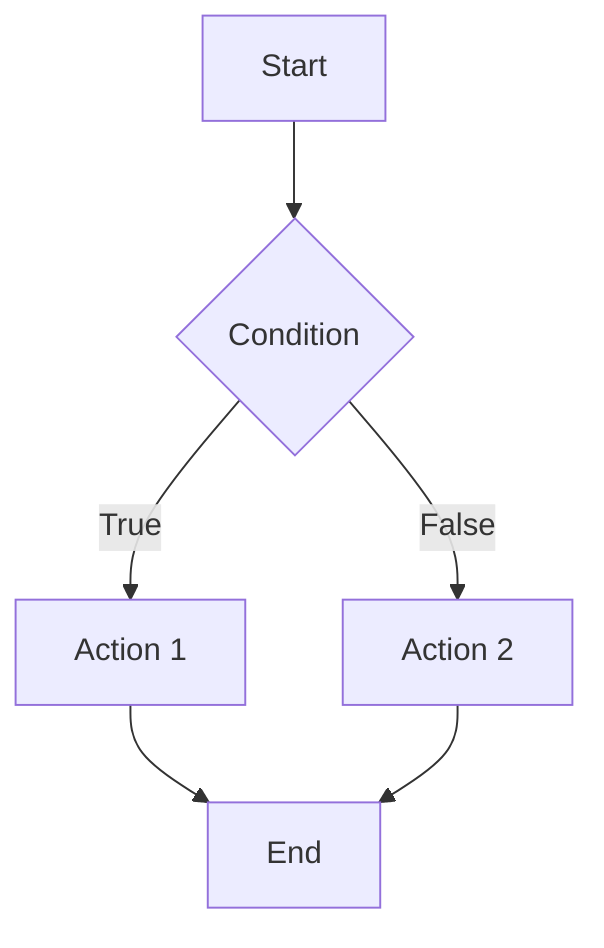

# <span style="color:#e67e22;">What we will learn in this post?</span>

<ul style='list-style-type: none; padding-left: 0;'>
<li><span style='color: #2980b9; font-size: 20px; font-weight: bold;'>👉</span> <span style='color: #2ecc71; font-size: 18px; font-weight: bold;'>Python Basic Syntax</span></li>
<li><span style='color: #2980b9; font-size: 20px; font-weight: bold;'>👉</span> <span style='color: #2ecc71; font-size: 18px; font-weight: bold;'>Python Comments</span></li>
<li><span style='color: #2980b9; font-size: 20px; font-weight: bold;'>👉</span> <span style='color: #2ecc71; font-size: 18px; font-weight: bold;'>Python Variables and Naming Conventions</span></li>
<li><span style='color: #2980b9; font-size: 20px; font-weight: bold;'>👉</span> <span style='color: #2ecc71; font-size: 18px; font-weight: bold;'>Python Data Types Overview</span></li>
<li><span style='color: #2980b9; font-size: 20px; font-weight: bold;'>👉</span> <span style='color: #2ecc71; font-size: 18px; font-weight: bold;'>Numeric Types - int, float, complex</span></li>
<li><span style='color: #2980b9; font-size: 20px; font-weight: bold;'>👉</span> <span style='color: #2ecc71; font-size: 18px; font-weight: bold;'>Boolean Type and Logical Operations</span></li>
<li><span style='color: #2980b9; font-size: 20px; font-weight: bold;'>👉</span> <span style='color: #2ecc71; font-size: 18px; font-weight: bold;'>Type Conversion and Casting</span></li>
<li><span style='color: #2980b9; font-size: 20px; font-weight: bold;'>👉</span> <span style='color: #2ecc71; font-size: 18px; font-weight: bold;'>Conclusion!</span></li>
</ul>

# <span style="color:#e67e22">Python's Simple Syntax 🐍</span>

Python is super easy to read because of its clean syntax! Let's break down the key parts:

## <span style="color:#2980b9">Indentation: The Key to Blocks🔑</span>

Instead of curly braces `{}`, Python _uses indentation_ (spaces or tabs) to define code blocks. This makes code neat and readable.

```python
if 5 > 2:
  print("Five is greater than two!") # This line is part of the 'if' block
```

## <span style="color:#2980b9">Statements & Line Continuation 📜</span>

Each line usually represents a statement. For long lines, use a backslash `\` for continuation:

```python
long_string = "This is a very " \
              "long string that spans " \
              "multiple lines."
print(long_string)
```

## <span style="color:#2980b9">Code Structure 🧱</span>

- A Python program is made of statements.
- Statements are grouped into blocks using indentation.
- Comments start with `#` and are ignored by Python.

```python
# This is a comment
def my_function():
    """This is a docstring explaining the function."""
    print("Hello from a function!")

my_function() # Calling the function
```

- **_Readability is key!_** Clear indentation and comments make your code easier to understand.
- For a deeper understanding, check out the official Python documentation on [control flow tools](https://docs.python.org/3/tutorial/controlflow.html).



# <span style="color:#e67e22">Comments: Your Code's Best Friend</span> 💬

Comments are notes you add to your code that the computer ignores. They explain what your code _does_.

## <span style="color:#2980b9">Types of Comments</span> 📝

- **Single-line comments:** Use `#` at the start of a line. Great for quick explanations.

  ```python
  # This line calculates the total price
  total = price * quantity
  ```

- **Multi-line comments (Docstrings):** Use triple quotes (`"""Docstring"""` or `'''Docstring'''`) to explain functions, classes, or modules.

  ```python
  def add(x, y):
      """Adds two numbers together.

      Args:
          x: The first number.
          y: The second number.

      Returns:
          The sum of x and y.
      """
      return x + y
  ```

## <span style="color:#2980b9">Why Use Comments?</span> 🤔

Comments make your code:

- **Easier to understand:** Especially for others (or your future self!).
- **Maintainable:** Easier to update and fix.
- **Documented:** Docstrings can be automatically used to create documentation.
- **Professional** : Demonstrates good coding practices.

## <span style="color:#8e44ad">Best Practices</span> ✅

- **Be clear and concise.**
- Explain the _why_, not just the _what_.
- Keep comments updated with code changes.
- Use docstrings for public functions/classes/modules.

Good documentation helps us understand the code better 🧑‍💻 and makes it easy to maintain for the future 👨‍🔧.

For more information, check out the [PEP 8 Style Guide for Python Code](https://peps.python.org/pep-0008/#comments) for some guidelines on how to write good comments.

# <span style="color:#e67e22">Variables in Python 🐍</span>

Python uses **variables** to store data. You don't need to _declare_ a variable's type; Python figures it out! This is called **dynamic typing**.

## <span style="color:#2980b9">Declaring and Using Variables</span>

Just assign a value to a name:

```python
name = "Alice" # Assigning a string
age = 30      # Assigning an integer
pi = 3.14159  # Assigning a float

print(name)   # Output: Alice
print(age)    # Output: 30
print(pi)     # Output: 3.14159
```

## <span style="color:#2980b9">Variable Naming Rules</span>

- Must start with a letter or underscore (`_`).
- Can contain letters, numbers, and underscores.
- Case-sensitive (`age` and `Age` are different).
- Cannot be a Python keyword (like `if`, `for`, `while`).

## <span style="color:#2980b9">PEP 8 Naming Conventions</span>

PEP 8 is the style guide for Python code.

- **snake_case**: Use for variable and function names (e.g., `my_variable`, `calculate_sum`).
- `CONSTANT_CASE`: Use for constants (values that shouldn't change, e.g., `MAX_SIZE = 100`).

```python
my_variable = 10
MAX_SIZE = 200

print(my_variable) # Output: 10
print(MAX_SIZE)  # Output: 200
```

### <span style="color:#8e44ad">Resources</span>

- [PEP 8 Style Guide](https://peps.python.org/pep-0008/)
- [Python Variables](https://www.w3schools.com/python/python_variables.asp)

# <span style="color:#e67e22">Python Data Types 🐍</span>

Let's explore Python's basic building blocks! These are the data types that Python uses to understand and work with different kinds of information.

## <span style="color:#2980b9">Core Data Types</span>

- **Numbers:**
  - `int`: Whole numbers (e.g., `10`, `-5`).

    ```python
    x = 10
    print(type(x)) # <class 'int'>
    ```

  - `float`: Numbers with decimal points (e.g., `3.14`, `-2.5`).

    ```python
    y = 3.14
    print(type(y)) # <class 'float'>
    ```

  - `complex`: Numbers with a real and imaginary part (e.g., `2 + 3j`).

    ```python
    z = 2 + 3j
    print(type(z)) # <class 'complex'>
    ```

- **Text:**
  - `str`: Sequences of characters (e.g., `"Hello"`, `'Python'`).

    ```python
    message = "Hello, World!"
    print(type(message)) # <class 'str'>
    ```

- **Boolean:**
  - `bool`: Represents `True` or `False` values.

    ```python
    is_true = True
    print(type(is_true)) # <class 'bool'>
    ```

- **Sequences:**
  - `list`: Ordered, _mutable_ collections of items (e.g., `[1, 2, 3]`, `['a', 'b', 'c']`).

    ```python
    my_list = [1, "hello", True]
    print(type(my_list)) # <class 'list'>
    ```

  - `tuple`: Ordered, _immutable_ collections of items (e.g., `(1, 2, 3)`).

    ```python
    my_tuple = (1, 2, "world")
    print(type(my_tuple)) # <class 'tuple'>
    ```

- **Sets:**
  - `set`: Unordered collections of _unique_ items (e.g., `{1, 2, 3}`).

    ```python
    my_set = {1, 2, 2, 3} # Duplicates are removed automatically
    print(type(my_set)) # <class 'set'>
    print(my_set) # {1, 2, 3}
    ```

- **Mappings:**
  - `dict`: Key-value pairs (e.g., `{'name': 'Alice', 'age': 30}`).

    ```python
    my_dict = {"name": "Bob", "age": 25}
    print(type(my_dict)) # <class 'dict'>
    ```

- **None:**
  - `None`: Represents the absence of a value.

    ```python
    nothing = None
    print(type(nothing)) # <class 'NoneType'>
    ```

## <span style="color:#2980b9">Type Checking with `type()`</span>

The `type()` function tells you the data type of a variable. It's like asking Python, "What kind of thing is this?".

```python
x = 5
print(type(x)) # <class 'int'>

name = "Charlie"
print(type(name)) # <class 'str'>
```

Type checking is important for avoiding errors in your code!

## <span style="color:#2980b9">More resources</span>

Here are a few resources where you can learn more about python's data types:

- [Python official documentation](https://docs.python.org/3/tutorial/datastructures.html)
- [GeeksforGeeks tutorial](https://www.geeksforgeeks.org/python-data-types/)

# <span style="color:#e67e22">Python Numeric Types 🔢</span>

Python handles numbers in a few main ways:

## <span style="color:#2980b9">Integers, Floats, and Complex Numbers 🧮</span>

- **Integers** (`int`): Whole numbers, like `10`, `-5`, or `0`.
- **Floating-point numbers** (`float`): Numbers with decimal points, like `3.14` or `-2.5`.
- **Complex numbers** (`complex`): Numbers with a real and imaginary part, like `2 + 3j`.

## <span style="color:#2980b9">Arithmetic Operations ➕</span>

Python does all the usual math stuff:

- `+` (addition), `-` (subtraction), `*` (multiplication), `/` (division), `//` (floor division - integer result), `%` (modulus - remainder), `**` (exponentiation).

```python
x = 10
y = 3
print(x + y) # 13
print(x / y) # 3.3333333333333335
print(x // y) # 3
print(x % y) # 1
print(x ** y) # 1000
```

{% include code-playground.html language="python" code="# Python Arithmetic Operations Demo
x = 10
y = 3

# Addition

print(\"Addition (x + y):\", x + y)

# Subtraction

print(\"Subtraction (x - y):\", x - y)

# Multiplication

print(\"Multiplication (x _y):\", x_ y)

# Division (float result)

print(\"Division (x / y):\", x / y)

# Floor Division (integer result)

print(\"Floor Division (x // y):\", x // y)

# Modulus (remainder)

print(\"Modulus (x % y):\", x % y)

# Exponentiation (power)

print(\"Exponentiation (x **y):\", x** y)

# Try changing x and y values to see different results!" height="550" gradient="purple" %}

## <span style="color:#2980b9">Type Conversion 🔄</span>

You can change numbers from one type to another:

- `int()`: Converts to an integer.
- `float()`: Converts to a float.
- `complex()`: Creates a complex number.

```python
num_int = 5
num_float = float(num_int)
print(num_float) # 5.0
num_complex = complex(num_int)
print(num_complex) # (5+0j)
```

{% include code-playground.html language="python" code="# Python Type Conversion Demo

# Integer to other types

num_int = 42
print(\"Original integer:\", num_int, \"- Type:\", type(num_int))

num_float = float(num_int)
print(\"Converted to float:\", num_float, \"- Type:\", type(num_float))

num_complex = complex(num_int)
print(\"Converted to complex:\", num_complex, \"- Type:\", type(num_complex))

print(\"\\n\" + \"=\"\*50 + \"\\n\")

# Float to other types

pi = 3.14159
print(\"Original float:\", pi, \"- Type:\", type(pi))

pi_int = int(pi) # Truncates decimal part
print(\"Converted to int:\", pi_int, \"- Type:\", type(pi_int))

pi_complex = complex(pi)
print(\"Converted to complex:\", pi_complex, \"- Type:\", type(pi_complex))

# Try changing the values to see different conversions!" height="550" gradient="green" %}

## <span style="color:#2980b9">Precision ⚙️</span>

Floats have limited precision due to how they're stored, so tiny errors can happen. Integers usually don't have this problem and can represent very large numbers.

_For more info on numeric types, check out the [Python documentation](https://docs.python.org/3/library/stdtypes.html#numeric-types-int-float-complex)_.

# <span style="color:#e67e22">Boolean Basics in Python 🐍</span>

Let's explore the world of Booleans, `True` and `False` values that are fundamental in Python! They are our on/off switches, influencing program flow based on conditions.

## <span style="color:#2980b9">The `bool` Type and Truthiness 🧐</span>

The `bool` type represents truth values. Everything in Python has a "truthiness" – it evaluates to either `True` or `False` in a boolean context. For instance, non-empty strings and non-zero numbers are generally `True`, while empty strings, zero, and `None` are `False`.

```python
print(bool("Hello"))  # Output: True
print(bool(""))     # Output: False
print(bool(10))    # Output: True
print(bool(0))      # Output: False
```

## <span style="color:#2980b9">Logical Operators ⚙️</span>

These operators help us combine or negate boolean values:

- `and`: Returns `True` if _both_ operands are `True`.
- `or`: Returns `True` if _at least one_ operand is `True`.
- `not`: Negates the operand (flips `True` to `False` and vice versa).

```python
x = 5
print(x > 0 and x < 10) # Output: True
print(x < 0 or x > 2)   # Output: True
print(not(x > 10))    # Output: True
```

## <span style="color:#2980b9">Comparison Operators ⚖️</span>

Comparison operators (like `==`, `!=`, `>`, `<`, `>=`, `<=`) compare values and always return a `bool`:

```python
print(5 == 5)  # Output: True
print(5 != 6)  # Output: True
print(5 > 4)   # Output: True
print(5 < 6)   # Output: True
```

Here's a simple _if_ statement example using comparison and boolean:

```python
age = 20
if age >= 18:
    print("You are an adult.") # Output: You are an adult.
```

Here is a resource for more info on Boolean values and conditions: [Python Booleans](https://www.w3schools.com/python/python_booleans.asp)

# <span style="color:#e67e22">Type Conversion in Python 🐍</span>

Hey there! Let's explore how Python handles changing data types, also known as type conversion. There are two main types: _implicit_ and _explicit_.

## <span style="color:#2980b9">Implicit Conversion (Automatic)</span>

Python sometimes converts types _automatically_. This usually happens when you're doing math with different types, like an `int` and a `float`. Python will generally convert the `int` to a `float` to avoid losing information.

```python
num_int = 10
num_float = 5.5
sum_nums = num_int + num_float # Implicit conversion int to float
print(sum_nums) # 15.5
print(type(sum_nums)) # <class 'float'>
```

## <span style="color:#2980b9">Explicit Conversion (Manual)</span>

### <span style="color:#8e44ad">Using `int()`, `float()`, `str()`, `bool()`</span>

You can _manually_ convert types using built-in functions:

- `int()`: Converts to an integer.

  ```python
  num_str = "123"
  num_int = int(num_str)
  print(num_int) # 123
  print(type(num_int)) # <class 'int'>
  ```

- `float()`: Converts to a floating-point number.

  ```python
  num_str = "3.14"
  num_float = float(num_str)
  print(num_float) # 3.14
  print(type(num_float)) # <class 'float'>
  ```

- `str()`: Converts to a string.

  ```python
  num_int = 42
  num_str = str(num_int)
  print(num_str) # 42
  print(type(num_str)) # <class 'str'>
  ```

- `bool()`: Converts to a boolean (True or False).

  ```python
  num_int = 0
  num_bool = bool(num_int) # Anything other than 0 is True
  print(num_bool) # False
  print(type(num_bool)) # <class 'bool'>

  num_int = 10
  num_bool = bool(num_int) # Anything other than 0 is True
  print(num_bool) # True
  print(type(num_bool)) # <class 'bool'>
  ```

{% include code-playground.html language="python" code="# Python Type Conversion - Strings and Booleans

# String conversions

num_str = \"123\"
print(\"String:\", num_str, \"- Type:\", type(num_str))

num_int = int(num_str)
print(\"Converted to int:\", num_int, \"- Type:\", type(num_int))

pi_str = \"3.14\"
pi_float = float(pi_str)
print(\"String to float:\", pi_float, \"- Type:\", type(pi_float))

# Number to string

age = 25
age_str = str(age)
print(\"\\nNumber to string:\", age_str, \"- Type:\", type(age_str))

# Boolean conversions

print(\"\\n\" + \"=\"\*50)
print(\"Boolean Conversion Examples:\")
print(\"bool(0):\", bool(0)) # False
print(\"bool(10):\", bool(10)) # True
print(\"bool(''):\", bool('')) # False (empty string)
print(\"bool('Hello'):\", bool('Hello')) # True
print(\"bool([]):\", bool([])) # False (empty list)
print(\"bool([1, 2]):\", bool([1, 2])) # True" height="550" gradient="pink" %}

### <span style="color:#8e44ad">Why is it Needed?</span>

Type conversion is essential when:

- You need to perform operations that require specific data types (like adding an integer to a float).
- You're receiving data from an external source (like a file or user input) that needs to be converted to the correct type for your program.
- You want to present data in a specific format (e.g., converting a number to a string for display).

For example, if you're taking input from a user via `input()`, it always returns a string. If you want to do math with that input, you **must** convert it to an `int` or `float` first!

```python
age_str = input("Enter your age: ") # User inputs "25"
age = int(age_str)
print("Next year, you will be:", age + 1) # Next year, you will be: 26
```

{% include code-playground.html language="python" code="# Real-World Type Conversion Example

# Note: In OneCompiler, we simulate user input directly

# Simulating user input (in real Python, use input() function)

age_str = \"25\" # User enters this as a string
print(\"User entered:\", age_str, \"(Type:\", type(age_str), \")\")

# Convert string to integer for calculations

age = int(age_str)
print(\"Converted to integer:\", age, \"(Type:\", type(age), \")\")

# Now we can do math operations

next_year = age + 1
five_years = age + 5
ten_years_ago = age - 10

print(\"\\nCalculations:\")
print(\"Next year, you will be:\", next_year)
print(\"In 5 years, you will be:\", five_years)
print(\"10 years ago, you were:\", ten_years_ago)

# Converting back to string for message formatting

message = \"You are \" + str(age) + \" years old!\"
print(\"\\n\" + message)

# Try changing the age_str value to see different results!" height="600" gradient="orange" %}

---

## <span style="color:#e67e22">🎯 Practice Project Assignment</span>

<details>
<summary><strong>💡 Project: Simple Calculator with Type Conversion</strong> (Click to expand)</summary>
<br>
<p><strong>Your Challenge:</strong></p>
<p>Create a calculator program that takes two numbers as input (simulated as strings) and performs all arithmetic operations we learned!</p>

<p><strong>Implementation Hints:</strong></p>
<ul>
<li>Start with two string variables: <code>num1_str = "15"</code>, <code>num2_str = "4"</code></li>
<li>Convert them to int or float using <code>int()</code> or <code>float()</code></li>
<li>Perform all 7 operations: +, -, *, /, //, %, **</li>
<li>Display results with f-strings and show data types</li>
<li><strong>Bonus:</strong> Handle division by zero, try both int and float inputs</li>
</ul>

<p><strong>Example Output:</strong></p>
<pre>
Calculator Results
==================
15 + 4 = 19
15 - 4 = 11
15 * 4 = 60
15 / 4 = 3.75
</pre>

<p><strong>Share Your Solution! 💬</strong></p>
<p>Once you've completed this project, <strong>share your code in the comments below!</strong> We'd love to see your creative solutions. Don't be shy - every coder started as a beginner! 🚀</p>

</details>

---

<h1><span style='color:#e67e22'>Conclusion</span></h1>

So, what do you think? 🤔 Did you find this helpful? I'd love to hear your thoughts, suggestions, or even just a "hello" in the comments below! Let's chat! 👇💬
