# <span style="color:#e67e22;">What we will learn in this post?</span>

<ul style='list-style-type: none; padding-left: 0;'>
<li><span style='color: #2980b9; font-size: 20px; font-weight: bold;'>👉</span> <span style='color: #2ecc71; font-size: 18px; font-weight: bold;'>Introduction to Python Lists</span></li>
<li><span style='color: #2980b9; font-size: 20px; font-weight: bold;'>👉</span> <span style='color: #2ecc71; font-size: 18px; font-weight: bold;'>List Indexing and Slicing</span></li>
<li><span style='color: #2980b9; font-size: 20px; font-weight: bold;'>👉</span> <span style='color: #2ecc71; font-size: 18px; font-weight: bold;'>List Methods - Adding and Removing Elements</span></li>
<li><span style='color: #2980b9; font-size: 20px; font-weight: bold;'>👉</span> <span style='color: #2ecc71; font-size: 18px; font-weight: bold;'>List Methods - Sorting and Searching</span></li>
<li><span style='color: #2980b9; font-size: 20px; font-weight: bold;'>👉</span> <span style='color: #2ecc71; font-size: 18px; font-weight: bold;'>List Comprehensions</span></li>
<li><span style='color: #2980b9; font-size: 20px; font-weight: bold;'>👉</span> <span style='color: #2ecc71; font-size: 18px; font-weight: bold;'>List Copying - Shallow vs Deep Copy</span></li>
<li><span style='color: #2980b9; font-size: 20px; font-weight: bold;'>👉</span> <span style='color: #2ecc71; font-size: 18px; font-weight: bold;'>List Operations and Common Patterns</span></li>
<li><span style='color: #2980b9; font-size: 20px; font-weight: bold;'>👉</span> <span style='color: #2ecc71; font-size: 18px; font-weight: bold;'>Conclusion!</span></li>
</ul>

# <span style="color:#e67e22">Python Lists: Your Go-To Collection! 📝</span>

Python lists are like super flexible containers for storing stuff! Think of them as ordered shopping lists – you can change them, add things, remove things, and keep them in a specific order.

Lists are one of the most commonly used data structures in Python. They are essential for organizing, processing, and manipulating collections of data in everything from web development to data science. Mastering lists will make your code more efficient and readable.

## <span style="color:#2980b9">Making Lists & Their Magic ✨</span>

Creating a list is easy! Just use square brackets `[]` and separate items with commas.

Lists are used everywhere: storing user data, managing tasks, processing results, and more. Their flexibility makes them a go-to tool for Python programmers.

```python
my_list = [1, "hello", 3.14, True]  # int, string, float, boolean all in one!
print(my_list) # Output: [1, 'hello', 3.14, True]

empty_list = [] # An empty list!
print(empty_list) # Output: []
```

- **Ordered:** Items stay in the order you put them.
- **Mutable:** You can change the list after it's created.
- **Diverse:** Lists can hold different types of data (numbers, text, booleans, even other lists!).
- **Duplicates Allowed:** You can have the same item multiple times.

## <span style="color:#2980b9">List Superpowers & When to Use Them 🦸‍♀️</span>

Lists are incredibly useful! Here's why:

Whether you're building a web app, analyzing data, or automating tasks, lists help you keep your information organized and accessible. They are the backbone of many Python algorithms and workflows.

- Storing collections of related items (e.g., a list of student names, a list of temperatures).
- Looping through data (easily process each item in the list).
- Managing data that changes over time (add or remove items as needed).

```python
# Example: Storing a list of favorite colors
colors = ["red", "blue", "green"]
print(colors[0]) # Accessing the first element. Output: red

# Example: Adding new items to a list
colors.append("yellow") # append() adds an item to the end of the list
print(colors) # Output: ['red', 'blue', 'green', 'yellow']
```

<!-- Resources -->
<!-- * [Python Lists Documentation](https://docs.python.org/3/tutorial/introduction.html#lists) -->
<!-- * [W3Schools Python Lists](https://www.w3schools.com/python/python_lists.asp) -->

# <span style="color:#e67e22">List Indexing & Slicing 🧮</span>

Let's explore how to grab specific parts from lists in Python! Think of a list like a numbered shelf where each item has a position.

Indexing and slicing are powerful techniques for accessing and manipulating data. They allow you to extract, modify, and analyze subsets of your lists, which is crucial for data processing and analysis tasks.

## <span style="color:#2980b9">Indexing: Accessing Elements ☝️</span>

### <span style="color:#8e44ad">Positive Indexing</span>

- Lists start counting from 0. So, the first item is at index `0`, the second at `1`, and so on.

```python
my_list = ["apple", "banana", "cherry"]
print(my_list[0]) # Output: apple
print(my_list[1]) # Output: banana
```

### <span style="color:#8e44ad">Negative Indexing</span>

- You can also count from the _end_ using negative numbers. `-1` is the last item, `-2` is the second to last, and so on.

```python
my_list = ["apple", "banana", "cherry"]
print(my_list[-1]) # Output: cherry
print(my_list[-2]) # Output: banana
```

## <span style="color:#2980b9">Slicing: Getting Sublists 🔪</span>

Slicing lets you grab a chunk (a sublist) from a list.

Slicing is useful for extracting ranges of data, such as recent transactions, top results, or specific segments of information.

- The syntax is `list[start:end]`. It includes the `start` index but _excludes_ the `end` index.
- Omitting `start` means "from the beginning".
- Omitting `end` means "to the end".

```python
my_list = ["apple", "banana", "cherry", "date", "fig"]
print(my_list[1:4]) # Output: ['banana', 'cherry', 'date']
print(my_list[:3])  # Output: ['apple', 'banana', 'cherry']
print(my_list[2:])  # Output: ['cherry', 'date', 'fig']
```

## <span style="color:#2980b9">Nested Lists 📦</span>

Lists can contain other lists! To access elements inside nested lists, you use multiple indexes.

Nested lists are useful for representing matrices, grids, or hierarchical data structures.

```python
nested_list = [["apple", "banana"], ["cherry", "date"]]
print(nested_list[0][1]) # Output: banana. Access the first list, then the second item in it.
```

For more information you can visit [W3School on Python List](https://www.w3schools.com/python/python_lists.asp)

```mermaid
flowchart LR
    A[📦 List] -->|Index 0| B[A]
    A -->|Index 2| C[C]
    A -->|Slice 1:4| D[B, C, D]
    style A fill:#e67e22,stroke:#222,stroke-width:2px
    style B fill:#2980b9,stroke:#222,stroke-width:2px
    style C fill:#2980b9,stroke:#222,stroke-width:2px
    style D fill:#2ecc71,stroke:#222,stroke-width:2px
```

## <span style="color:#2980b9">🔢 Indexing & Slicing: Visual Guide</span>



This diagram shows how you can access elements and slices in a Python list using indexes and slice notation.

# <span style="color:#e67e22">List Methods in Python: A Friendly Guide</span> 🐍

Let's explore some super useful list methods in Python! Lists are like containers that hold items, and these methods help us manage them.

## <span style="color:#2980b9">Modifying Lists: Adding Elements</span> ➕

These methods let you add items to your lists in different ways:

- `append()`: Adds an item to the _end_ of the list.

```python
my_list = [1, 2, 3]
my_list.append(4)
print(my_list) # Output: [1, 2, 3, 4]
```

- `insert()`: Adds an item at a _specific position_ in the list.

```python
my_list = [1, 2, 3]
my_list.insert(1, 5) # insert 5 at index 1
print(my_list) # Output: [1, 5, 2, 3]
```

- `extend()`: Adds elements from another list (or any iterable) to the _end_ of the list.

```python
my_list = [1, 2, 3]
another_list = [4, 5]
my_list.extend(another_list)
print(my_list) # Output: [1, 2, 3, 4, 5]
```

## <span style="color:#2980b9">Modifying Lists: Removing Elements</span> ➖

These are the methods that help in taking out an element:

- `remove()`: Removes the _first occurrence_ of a specific value.

```python
my_list = [1, 2, 3, 2]
my_list.remove(2) # removes the first '2'
print(my_list) # Output: [1, 3, 2]
```

- `pop()`: Removes the item at a _specific index_ and returns it. If no index is provided, it removes and returns the last item.

```python
my_list = [1, 2, 3]
popped_item = my_list.pop(1) # removes element at index 1 i.e. '2'
print(my_list) # Output: [1, 3]
print(popped_item) # Output: 2
```

- `clear()`: Removes _all_ items from the list.

```python
my_list = [1, 2, 3]
my_list.clear()
print(my_list) # Output: []
```

{% include code-playground.html language="python" code="# Python List Methods - Adding and Removing Elements

print(\"=== ADDING ELEMENTS ===\")
shopping_list = ['milk', 'bread']
print(\"Initial list:\", shopping_list)

# append() - add to end

shopping_list.append('eggs')
print(\"After append('eggs'):\", shopping_list)

# insert() - add at specific position

shopping_list.insert(1, 'butter')
print(\"After insert(1, 'butter'):\", shopping_list)

# extend() - add multiple items

shopping_list.extend(['cheese', 'yogurt'])
print(\"After extend(['cheese', 'yogurt']):\", shopping_list)

print(\"\\n\" + \"=\"* 50 + \"\\n\")

print(\"=== REMOVING ELEMENTS ===\")
print(\"Current list:\", shopping_list)

# remove() - remove by value

shopping_list.remove('bread')
print(\"After remove('bread'):\", shopping_list)

# pop() - remove by index and return it

removed = shopping_list.pop(2)
print(f\"After pop(2), removed '{removed}':\", shopping_list)

# pop() without index - removes last item

last_item = shopping_list.pop()
print(f\"After pop(), removed '{last_item}':\", shopping_list)

# Try adding your own items and operations!" height="650" gradient="purple" %}

## <span style="color:#2980b9">Summary Table</span> 📝

| Method     | Description                                | Example                        |
| ---------- | ------------------------------------------ | ------------------------------ |
| `append()` | Adds an element to the end of the list.    | `my_list.append(4)`            |
| `insert()` | Inserts an element at a specific position. | `my_list.insert(1, 5)`         |
| `extend()` | Appends elements from another iterable.    | `my_list.extend([4, 5])`       |
| `remove()` | Removes the first occurrence of a value.   | `my_list.remove(2)`            |
| `pop()`    | Removes and returns an element by index.   | `popped_item = my_list.pop(1)` |
| `clear()`  | Removes all elements from the list.        | `my_list.clear()`              |

I hope this makes list methods in Python clearer! Happy coding! 🎉

---

Resources to learn more about list Methods:

1. Python Documentation: [https://docs.python.org/3/tutorial/datastructures.html](https://docs.python.org/3/tutorial/datastructures.html)
2. W3Schools: [https://www.w3schools.com/python/python_lists_methods.asp](https://www.w3schools.com/python/python_lists_methods.asp)

# <span style="color:#e67e22">List Methods Explained 🚀</span>

Let's explore some useful list methods in Python! Think of these as handy tools for working with your lists.

## <span style="color:#2980b9">Common List Methods 🛠️</span>

Here's a quick overview of some important list methods:

- `sort()`: Arranges the list items in ascending order (by default). It changes the original list.
- `reverse()`: Reverses the order of the items in the list. It also changes the original list.
- `index(x)`: Returns the index (position) of the first occurrence of item `x` in the list.
- `count(x)`: Returns the number of times item `x` appears in the list.

```python
my_list = [3, 1, 4, 1, 5, 9, 2, 6, 5, 3, 5]

my_list.sort()  # Sorts the list in place
print(my_list) # Output: [1, 1, 2, 3, 3, 4, 5, 5, 5, 6, 9]

my_list.reverse() # Reverses the list in place
print(my_list) # Output: [9, 6, 5, 5, 5, 4, 3, 3, 2, 1, 1]

print(my_list.index(5)) # Output: 2 (First index of 5)

print(my_list.count(5)) # Output: 3 (Number of times 5 appears)
```

{% include code-playground.html language="python" code="# Python List Methods - Sorting and Searching

# Create a sample list

scores = [85, 92, 78, 92, 95, 78, 88, 92]
print(\"Original scores:\", scores)
print(\"\\n\" + \"=\"* 50 + \"\\n\")

# count() - how many times an item appears

count_92 = scores.count(92)
print(f\"Number of students with score 92: {count_92}\")

count_78 = scores.count(78)
print(f\"Number of students with score 78: {count_78}\")

print(\"\\n\" + \"=\"* 50 + \"\\n\")

# index() - find position of first occurrence

first_92 = scores.index(92)
print(f\"First occurrence of 92 at index: {first_92}\")

first_95 = scores.index(95)
print(f\"First occurrence of 95 at index: {first_95}\")

print(\"\\n\" + \"=\"* 50 + \"\\n\")

# sort() - sorts in place (modifies original)

print(\"Before sort():\", scores)
scores.sort()
print(\"After sort() ascending:\", scores)

scores.sort(reverse=True)
print(\"After sort(reverse=True):\", scores)

print(\"\\n\" + \"=\"* 50 + \"\\n\")

# reverse() - reverses the list in place

numbers = [1, 2, 3, 4, 5]
print(\"Before reverse():\", numbers)
numbers.reverse()
print(\"After reverse():\", numbers)" height="650" gradient="green" %}

## <span style="color:#2980b9">`sort()` vs `sorted()` 🤔</span>

### <span style="color:#8e44ad">Key Differences</span>

- `sort()`: This is a _method_ that modifies the original list directly. It _doesn't_ return a new list.
- `sorted()`: This is a _function_ that creates a _new_, sorted list from any iterable (like a list, tuple, or string). The original iterable remains unchanged.

```python
numbers = [3, 1, 4, 1, 5]
sorted_numbers = sorted(numbers) # Creates a new sorted list

print(numbers) # Output: [3, 1, 4, 1, 5] (original list is unchanged)
print(sorted_numbers) # Output: [1, 1, 3, 4, 5] (new sorted list)
```

## <span style="color:#2980b9">Examples with Different Data Types 🧮</span>

```python
strings = ["banana", "apple", "cherry"]
strings.sort()
print(strings) # Output: ['apple', 'banana', 'cherry']

numbers = [2.5, 1.0, 3.7]
sorted_numbers = sorted(numbers)
print(sorted_numbers) # Output: [1.0, 2.5, 3.7]
```

For more information check out [Python Documentation](https://docs.python.org/3/tutorial/datastructures.html) and [W3Schools](https://www.w3schools.com/python/python_lists_methods.asp).

# <span style="color:#e67e22">✨ List Comprehensions: Your List-Making Superpower! ✨</span>

List comprehensions are a _super-concise_ and elegant way to create lists in Python. Think of them as a shortcut for writing `for` loops when you're making a new list.

## <span style="color:#2980b9">The Magic Formula 🪄</span>

The basic syntax is: `[expression for item in iterable if condition]`. Let's break it down:

- `expression`: What you want to put in the new list. It's often based on the `item`.
- `item`: Each element from the `iterable` (like a list, range, or string).
- `iterable`: The source of the items.
- `if condition` (optional): Only include the `item` if this condition is true.

### <span style="color:#8e44ad">Simple Example 🍎</span>

Let's square some numbers:

```python
numbers = [1, 2, 3, 4, 5, 6]
even_squares = [x**2 for x in numbers if x % 2 == 0]
print(even_squares) # Output: [4, 16, 36]
```

### <span style="color:#8e44ad">Nested Comprehensions 🔄</span>

It is also possible to perform nested comprehension.

```python
matrix = [[1, 2, 3], [4, 5, 6], [7, 8, 9]]
flattened = [num for row in matrix for num in row]
print(flattened)  # Output: [1, 2, 3, 4, 5, 6, 7, 8, 9]
```

{% include code-playground.html language="python" code="# Python List Comprehensions - Powerful & Concise!

print(\"=== BASIC COMPREHENSIONS ===\")

# Square all numbers

numbers = [1, 2, 3, 4, 5]
squares = [x**2 for x in numbers]
print(\"Original:\", numbers)
print(\"Squares:\", squares)

# Get even numbers only

evens = [x for x in numbers if x % 2 == 0]
print(\"Even numbers:\", evens)

# Square even numbers only

even_squares = [x**2 for x in numbers if x % 2 == 0]
print(\"Squares of evens:\", even_squares)

print(\"\\n\" + \"=\"* 50 + \"\\n\")

print(\"=== STRING COMPREHENSIONS ===\")

# Convert to uppercase

words = ['hello', 'world', 'python']
uppercase = [word.upper() for word in words]
print(\"Original:\", words)
print(\"Uppercase:\", uppercase)

# Get words with length > 4

long_words = [word for word in words if len(word) > 4]
print(\"Words longer than 4 chars:\", long_words)

print(\"\\n\" + \"=\"* 50 + \"\\n\")

print(\"=== NESTED COMPREHENSIONS ===\")

# Flatten a matrix

matrix = [[1, 2, 3], [4, 5, 6], [7, 8, 9]]
flattened = [num for row in matrix for num in row]
print(\"Matrix:\", matrix)
print(\"Flattened:\", flattened)

# Create multiplication table

mult_table = [[i * j for j in range(1, 4)] for i in range(1, 4)]
print(\"\\nMultiplication table 3x3:\")
for row in mult_table:
    print(row)" height="700" gradient="pink" %}

_List comprehensions_ can really _simplify_ your code, making it more readable!
[More info on comprehensions](https://docs.python.org/3/tutorial/datastructures.html#list-comprehensions)

```mermaid
flowchart TD
    A[🔢 Numbers] --> B[✨ List Comprehension]
    B --> C[🆕 Squares]
    style A fill:#e67e22,stroke:#222,stroke-width:2px
    style B fill:#8e44ad,stroke:#222,stroke-width:2px
    style C fill:#2ecc71,stroke:#222,stroke-width:2px
```

## <span style="color:#2980b9">✨ List Comprehensions: Visual Guide</span>



This diagram illustrates how a list comprehension transforms a list of numbers into their squares in Python.

# <span style="color:#e67e22">Shallow Copy vs. Deep Copy: 👯‍♀️ Copying Lists in Python</span>

Let's explore how to copy lists in Python, focusing on the key difference between _shallow_ and _deep_ copies, especially when you're dealing with lists _inside_ lists (nested lists)!

## <span style="color:#2980b9">Shallow Copy: Just the Outer Layer 🧅</span>

A shallow copy (using `copy()` or `[:]`) creates a _new_ list, but the _elements_ within are still references to the _original_ objects. Think of it as copying the outer shell, but the inside ingredients remain the same.

```python
list1 = [1, 2, [3, 4]]
list2 = list1.copy() # or list2 = list1[:]

list2[0] = 10 # Changes list2 ONLY
list2[2][0] = 30 # Changes BOTH list1 and list2 because it's pointing to the same inner list!

print(list1) # Output: [1, 2, [30, 4]]
print(list2) # Output: [10, 2, [30, 4]]
```

## <span style="color:#2980b9">Deep Copy: Independent Copies All the Way Down 📦</span>

A deep copy (using `copy.deepcopy()`) creates a _completely independent_ copy. Even the nested objects are copied recursively. It's like duplicating the entire recipe and all the ingredients!

```python
import copy

list1 = [1, 2, [3, 4]]
list3 = copy.deepcopy(list1)

list3[2][0] = 30 # Changes list3 ONLY

print(list1) # Output: [1, 2, [3, 4]]
print(list3) # Output: [1, 2, [30, 4]]
```

### <span style="color:#8e44ad">When to Use Which? 🤔</span>

- **Shallow Copy:** Use when you only need a new list and don't mind sharing the underlying objects (e.g., the list contains immutable objects like numbers or strings). It's faster.
- **Deep Copy:** Use when you need a completely independent copy, especially with nested lists or when modifying elements in the copy should _not_ affect the original list. Prevents unexpected side effects.

Remember, mutable objects within lists are the key consideration when choosing between shallow and deep copying. 🔑 If you need more info, check out the [Python documentation on the `copy` module](https://docs.python.org/3/library/copy.html).

# <span style="color:#e67e22">List Operations in Python 🐍</span>

Let's explore some fundamental ways to work with lists! Think of lists as containers holding items in a specific order.

## <span style="color:#2980b9">Basic List Operations</span>

### <span style="color:#8e44ad">Joining Lists and More!</span>

- **Concatenation (+):** Joins two lists together.

  ```python
  list1 = [1, 2, 3]
  list2 = [4, 5, 6]
  combined_list = list1 + list2
  print(combined_list) # Output: [1, 2, 3, 4, 5, 6]
  ```

- **Repetition (\*):** Repeats a list a certain number of times.

  ```python
  my_list = ['Hello', '!']
  repeated_list = my_list * 3
  print(repeated_list) # Output: ['Hello', '!', 'Hello', '!', 'Hello', '!']
  ```

### <span style="color:#8e44ad">Checking List Contents</span>

- **Membership Testing (in/not in):** Checks if an item exists in a list.

  ```python
  fruits = ['apple', 'banana', 'cherry']
  print('banana' in fruits)  # Output: True
  print('orange' not in fruits) # Output: True
  ```

### <span style="color:#8e44ad">Getting List Stats</span>

- `len()`: Returns the number of items in a list.

  ```python
  my_list = [10, 20, 30, 40]
  print(len(my_list)) # Output: 4
  ```

- `min()`: Returns the smallest item in a list.

  ```python
  numbers = [5, 2, 8, 1]
  print(min(numbers))  # Output: 1
  ```

- `max()`: Returns the largest item in a list.

  ```python
  numbers = [5, 2, 8, 1]
  print(max(numbers)) # Output: 8
  ```

- `sum()`: Returns the sum of all numbers in a list.

  ```python
  numbers = [1, 2, 3, 4]
  print(sum(numbers)) # Output: 10
  ```

These operations provide powerful tools for manipulating and analyzing list data in Python! For detailed guide, refer to Python Docs on Lists [](https://docs.python.org/3/tutorial/introduction.html#lists)

```mermaid
flowchart LR
    A[📦 Create List] --> B[🔢 Indexing & Slicing]
    B --> C[➕➖ Add/Remove Elements]
    C --> D[🔍 Sort/Search]
    D --> E[✨ List Comprehension]
    E --> F[👯 Copy]
    F --> G[🔗📊 Join/Stats]
    G --> H[💻 Use in Programs]
    style A fill:#e67e22,stroke:#222,stroke-width:2px
    style B fill:#2980b9,stroke:#222,stroke-width:2px
    style C fill:#2ecc71,stroke:#222,stroke-width:2px
    style D fill:#f39c12,stroke:#222,stroke-width:2px
    style E fill:#8e44ad,stroke:#222,stroke-width:2px
    style F fill:#16a085,stroke:#222,stroke-width:2px
    style G fill:#d35400,stroke:#222,stroke-width:2px
    style H fill:#34495e,stroke:#222,stroke-width:2px
```

## <span style="color:#2980b9">🐍 Python List Operations: Flow Overview 🚀</span>



This diagram shows the typical flow of working with Python lists: from creation, through various operations, to practical use in programs.

## ❓ Python Lists FAQ

> **Q: How do I remove duplicates from a list?**
>
> **A:** Use `set()` to remove duplicates (order not preserved):
>
> ```python
> my_list = [1, 2, 2, 3, 4, 4]
> unique = list(set(my_list))
> print(unique)  # Output: [1, 2, 3, 4]
> ```
>
> For order preservation (Python 3.7+):
>
> ```python
> unique = list(dict.fromkeys(my_list))
> print(unique)  # Output: [1, 2, 3, 4]
> ```
>
> ---
>
> **Q: How do I sort a list of lists?**
>
> **A:** Use `sorted()` with a key:
>
> ```python
> data = [[3, 2], [1, 4], [2, 5]]
> sorted_data = sorted(data, key=lambda x: x[0])
> print(sorted_data)  # Output: [[1, 4], [2, 5], [3, 2]]
> ```
>
> ---
>
> **Q: How do I flatten a nested list?**
>
> **A:** Use a list comprehension:
>
> ```python
> nested = [[1, 2], [3, 4], [5]]
> flat = [item for sublist in nested for item in sublist]
> print(flat)  # Output: [1, 2, 3, 4, 5]
> ```
>
> ---
>
> **Q: How do I check if a list is empty?**
>
> **A:**
>
> ```python
> my_list = []
> if not my_list:
>     print("List is empty!")
> ```
>
> ---
>
> **Q: How do I reverse a list?**
>
> **A:**
>
> ```python
> my_list = [1, 2, 3]
> reversed_list = my_list[::-1]
> print(reversed_list)  # Output: [3, 2, 1]
> ```
>
> Or use `reverse()` in-place:
>
> ```python
> my_list.reverse()
> print(my_list)  # Output: [3, 2, 1]
> ```

---

## <span style="color:#e67e22">🎯 Practice Project Assignment</span>

<details>
<summary><strong>💡 Project: Student Grade Manager</strong> (Click to expand)</summary>
<br>
<p><strong>Your Challenge:</strong></p>
<p>Create a student grade management system that stores, analyzes, and manipulates student scores using lists!</p>

<p><strong>Implementation Hints:</strong></p>
<ul>
<li>Start with <code>scores = [85, 92, 78, 90, 88, 76, 95, 89]</code></li>
<li>Use <code>append()</code> to add scores, <code>remove()</code> to delete, <code>sort()</code> to order</li>
<li>Calculate average with <code>sum(scores) / len(scores)</code></li>
<li>Find highest/lowest using <code>max()</code> and <code>min()</code></li>
<li>Use list comprehension to filter passing scores: <code>[s for s in scores if s >= 75]</code></li>
<li><strong>Bonus:</strong> Create grade categories (A/B/C), ranking system, nested lists</li>
</ul>

<p><strong>Example Output:</strong></p>
<pre>
=== Student Grade Report ===
Total Students: 8
Average Score: 86.6
Highest Score: 95
Lowest Score: 76
Students with A grade (90+): 3
Passing Rate: 100%
</pre>

<p><strong>Share Your Solution! 💬</strong></p>
<p>Finished your grade manager? <strong>Share your code in the comments!</strong> Did you add extra features like student names or letter grades? We'd love to see it! 📊</p>

</details>

---

<h1><span style='color:#e67e22'>Conclusion</span></h1>

And that's a wrap! 🎉 We hope you enjoyed this deep dive. Now it's your turn – what are your thoughts? Any experiences you'd like to share or questions you still have? Drop them in the comments below! We can't wait to hear from you! 👇😊
