<!-- meta-description: "Practical guide to Python tuples and sets — immutability, operations, namedtuples, frozensets and practical examples for everyday code." -->
<!-- keywords: "Python tuples, Python sets, namedtuple, frozenset, data structures, set operations" -->

# <span style="color:#e67e22;">What we will learn in this post?</span>

<ul style='list-style-type: none; padding-left: 0;'>
<li><span style='color: #2980b9; font-size: 20px; font-weight: bold;'>👉</span> <span style='color: #2ecc71; font-size: 18px; font-weight: bold;'>Introduction to Python Tuples</span></li>
<li><span style='color: #2980b9; font-size: 20px; font-weight: bold;'>👉</span> <span style='color: #2ecc71; font-size: 18px; font-weight: bold;'>Tuple Operations and Methods</span></li>
<li><span style='color: #2980b9; font-size: 20px; font-weight: bold;'>👉</span> <span style='color: #2ecc71; font-size: 18px; font-weight: bold;'>Named Tuples</span></li>
<li><span style='color: #2980b9; font-size: 20px; font-weight: bold;'>👉</span> <span style='color: #2ecc71; font-size: 18px; font-weight: bold;'>Introduction to Python Sets</span></li>
<li><span style='color: #2980b9; font-size: 20px; font-weight: bold;'>👉</span> <span style='color: #2ecc71; font-size: 18px; font-weight: bold;'>Set Operations</span></li>
<li><span style='color: #2980b9; font-size: 20px; font-weight: bold;'>👉</span> <span style='color: #2ecc71; font-size: 18px; font-weight: bold;'>Set Methods</span></li>
<li><span style='color: #2980b9; font-size: 20px; font-weight: bold;'>👉</span> <span style='color: #2ecc71; font-size: 18px; font-weight: bold;'>Frozensets</span></li>
<li><span style='color: #2980b9; font-size: 20px; font-weight: bold;'>👉</span> <span style='color: #2ecc71; font-size: 18px; font-weight: bold;'>Conclusion!</span></li>
</ul>

# <span style="color:#e67e22">Tuples in Python: Your Immutable Friend 🤝</span>

Tuples are like lists, but with a twist: they're _ordered_ and _immutable_. Think of them as containers that hold a sequence of items, but once created, you can't change their contents.

## <span style="color:#2980b9">Creating and Using Tuples 🛠️</span>

- **Creating Tuples:** You create them using parentheses `()`.

  ```python
  my_tuple = (1, 2, "hello")
  print(my_tuple) # (1, 2, 'hello')
  ```

- **Single-Element Tuples:** A trailing comma is _essential_!

  ```python
  single_tuple = (5,)
  print(single_tuple) # (5,)
  ```

- **Tuple Packing/Unpacking:** Assigning multiple values to a tuple at once or extracting values from a tuple.

  ```python
  # Packing
  my_tuple = 1, 2, "world"

  # Unpacking
  a, b, c = my_tuple
  print(a, b, c) # 1 2 world
  ```

## <span style="color:#2980b9">Tuples vs. Lists: When to Choose? 🤔</span>

- **Immutability:** Use tuples when data shouldn't change (e.g., coordinates, database records).
- **Performance:** Tuples are generally _slightly_ faster than lists.
- **Data Integrity:** Tuples protect against accidental modifications.
- **Keys in Dictionaries:** Tuples can be used as keys in dictionaries; lists cannot due to their mutability.

# <span style="color:#e67e22">Tuple Time: Indexing, Slicing, & More! 🚀</span>

Let's explore the world of tuples! Think of them as ordered lists that can't be changed after they're made.

## <span style="color:#2980b9">Tuple Basics</span>

- Tuples are created using parentheses `()`

  ```python
  my_tuple = (1, 2, "hello", 3.14)
  print(my_tuple) # (1, 2, 'hello', 3.14)
  ```

### <span style="color:#8e44ad">Accessing Items</span>

- **Indexing:** Get an item at a specific position.

  ```python
  print(my_tuple[0]) # 1  (First element)
  print(my_tuple[-1]) # 3.14 (Last element)
  ```

- **Slicing:** Grab a portion of the tuple.

  ```python
  print(my_tuple[1:3]) # (2, 'hello')
  ```

### <span style="color:#8e44ad">Combining Tuples</span>

- **Concatenation:** Joining tuples together.

  ```python
  tuple1 = (1, 2)
  tuple2 = (3, 4)
  combined_tuple = tuple1 + tuple2
  print(combined_tuple) # (1, 2, 3, 4)
  ```

- **Repetition:** Repeating tuple elements.

  ```python
  repeated_tuple = tuple1 * 3
  print(repeated_tuple) # (1, 2, 1, 2, 1, 2)
  ```

### <span style="color:#8e44ad">Useful Methods</span>

- `count()`: Counts how many times an item appears.

  ```python
  my_tuple = (1, 2, 2, 3, 2)
  print(my_tuple.count(2)) # 3
  ```

- `index()`: Finds the index of the _first_ occurrence of an item.

  ```python
  print(my_tuple.index(3)) # 3
  ```

{% include code-playground.html language="python" code="# Python Tuple Operations Demo

# Create a sample tuple
my_tuple = (1, 2, 'hello', 3.14, 'world', 2)
print(\"Original tuple:\", my_tuple)
print(\"Length:\", len(my_tuple))

print(\"\\n\" + \"=\" * 50 + \"\\n\")

# Indexing - access elements by position
print(\"First element [0]:\", my_tuple[0])
print(\"Last element [-1]:\", my_tuple[-1])
print(\"Third element [2]:\", my_tuple[2])

print(\"\\n\" + \"=\" * 50 + \"\\n\")

# Slicing - get portions of the tuple
print(\"First 3 elements [0:3]:\", my_tuple[0:3])
print(\"Last 2 elements [-2:]:\", my_tuple[-2:])
print(\"Every 2nd element [::2]:\", my_tuple[::2])

print(\"\\n\" + \"=\" * 50 + \"\\n\")

# Tuple methods
print(\"Count of 2:\", my_tuple.count(2))
print(\"Index of 'hello':\", my_tuple.index('hello'))

print(\"\\n\" + \"=\" * 50 + \"\\n\")

# Concatenation and repetition
tuple1 = (1, 2)
tuple2 = (3, 4)
print(\"Concatenation:\", tuple1 + tuple2)
print(\"Repetition (tuple1 * 3):\", tuple1 * 3)

# Try changing the tuple values above!" height="600" gradient="purple" %}

## <span style="color:#2980b9">Immutability: The Key Feature 🔑</span>

Tuples _cannot_ be changed after creation. This means you can't add, remove, or modify elements directly.

- **Implications:**
  - Data integrity: Guarantees that your data remains consistent.
  - Use as dictionary keys: Tuples can be used as keys in dictionaries (lists can't!).
  - Slightly faster than lists in some cases.


# <span style="color:#e67e22">Named Tuples: A Friendlier Tuple!</span> 🤝

Named tuples are like regular tuples but with _names_ for each position! This makes your code easier to read. Think of it as giving labels to each value in your tuple.

## <span style="color:#2980b9">Creating Named Tuples</span> 🛠️

Use `namedtuple` from the `collections` module. You define the name of your tuple type and the names of its fields.

```python
# Let's create a 'Point' named tuple
Point = namedtuple('Point', ['x', 'y'])
```

## <span style="color:#2980b9">Using Named Tuples</span> 🚀

Now, create instances of your named tuple and access values by name!

```python
p = Point(x=10, y=20)
print(p.x)  # Output: 10
print(p.y)  # Output: 20
print(p)   # Output: Point(x=10, y=20)
```

You can still access values by index like a regular tuple:

```python
print(p[0])  # Output: 10
```

## <span style="color:#2980b9">Example: Representing a Color</span> 🎨

```python
Color = namedtuple('Color', ['red', 'green', 'blue'])
my_color = Color(red=255, green=0, blue=100)
print(my_color.green) # Output: 0
```

Named tuples improve readability and make your code more self-documenting! [Check the official docs](https://docs.python.org/3/library/collections.html#collections.namedtuple) for more. 🎉

{% include code-playground.html language="python" code="# Python Named Tuples Demo
from collections import namedtuple

# Create a Point named tuple
Point = namedtuple('Point', ['x', 'y'])
p1 = Point(x=10, y=20)
p2 = Point(30, 40)

print(\"Point 1:\", p1)
print(\"Access by name - p1.x:\", p1.x)
print(\"Access by index - p1[0]:\", p1[0])

print(\"\\n\" + \"=\" * 50 + \"\\n\")

# Student record example
Student = namedtuple('Student', ['name', 'age', 'grade'])
student1 = Student('Alice', 20, 'A')
student2 = Student('Bob', 22, 'B')

print(\"Student 1:\", student1)
print(\"Name:\", student1.name)
print(\"Grade:\", student1.grade)

print(\"\\n\" + \"=\" * 50 + \"\\n\")

# RGB Color example
Color = namedtuple('Color', ['red', 'green', 'blue'])
sky_blue = Color(135, 206, 235)
grass_green = Color(34, 139, 34)

print(\"Sky Blue RGB:\", sky_blue)
print(\"Red component:\", sky_blue.red)
print(\"Grass Green RGB:\", grass_green)

print(\"\\n\" + \"=\" * 50 + \"\\n\")

# Convert to dictionary
print(\"As dictionary:\", student1._asdict())

# Try creating your own named tuples!" height="650" gradient="green" %}

# <span style="color:#e67e22">Unlocking the Power of Sets 🤝</span>

Sets in Python are like _unordered bags_ that only hold _unique_ items. Think of them as lists that automatically get rid of duplicates! You can't rely on the order of items in a set, but they're super useful for certain tasks.

## <span style="color:#2980b9">Creating Sets 🛠️</span>

There are a couple of ways to create sets:

- **Set Literals:** Use curly braces `{}`.

  ```python
  my_set = {1, 2, 3, 3, 4}  # Note: Duplicate '3' will be removed.
  print(my_set) # Output: {1, 2, 3, 4}
  ```

- **`set()` Constructor:** Use the `set()` function, often with a list or tuple.

  ```python
  my_list = [1, 2, 2, 3, 4, 4, 5]
  my_set = set(my_list) # converts the list to a set
  print(my_set) # Output: {1, 2, 3, 4, 5}
  ```

## <span style="color:#2980b9">Why Use Sets? 🤔</span>

Sets are fantastic for:

- **Removing Duplicates:** Instantly get rid of repeated values.
- **Membership Testing:** Quickly check if an item is in a collection. Much faster than lists for large datasets.
- **Set Operations:** Perform mathematical set operations like union, intersection, difference, etc.

Here's an example of removing duplicates:

```python
numbers = [1, 2, 2, 3, 4, 4, 5]
unique_numbers = list(set(numbers)) # converting back into a list
print(unique_numbers) # Output: [1, 2, 3, 4, 5]
```

For a deeper dive, check out the Python documentation: [Sets in Python](https://docs.python.org/3/tutorial/datastructures.html#sets)

{% include code-playground.html language="python" code="# Python Set Operations Demo

# Create sample sets
set_a = {1, 2, 3, 4, 5}
set_b = {4, 5, 6, 7, 8}

print(\"Set A:\", set_a)
print(\"Set B:\", set_b)

print(\"\\n\" + \"=\" * 50 + \"\\n\")

# Union - all unique elements from both sets
union_set = set_a | set_b  # or set_a.union(set_b)
print(\"Union (A | B):\", union_set)

print(\"\\n\" + \"=\" * 50 + \"\\n\")

# Intersection - elements common to both sets
intersection_set = set_a & set_b  # or set_a.intersection(set_b)
print(\"Intersection (A & B):\", intersection_set)

print(\"\\n\" + \"=\" * 50 + \"\\n\")

# Difference - elements in A but not in B
difference_set = set_a - set_b  # or set_a.difference(set_b)
print(\"Difference (A - B):\", difference_set)

print(\"\\n\" + \"=\" * 50 + \"\\n\")

# Symmetric Difference - elements in either set but not both
sym_diff_set = set_a ^ set_b  # or set_a.symmetric_difference(set_b)
print(\"Symmetric Difference (A ^ B):\", sym_diff_set)

print(\"\\n\" + \"=\" * 50 + \"\\n\")

# Real-world example: Student courses
alice_courses = {'Math', 'Physics', 'Chemistry', 'Biology'}
bob_courses = {'Physics', 'Chemistry', 'History', 'Geography'}

print(\"Alice's courses:\", alice_courses)
print(\"Bob's courses:\", bob_courses)
print(\"Courses either takes:\", alice_courses | bob_courses)
print(\"Courses both take:\", alice_courses & bob_courses)
print(\"Only Alice takes:\", alice_courses - bob_courses)

# Try changing the sets above!" height="700" gradient="pink" %}

Below is a compact visual reference for the most common set operations. Each diagram is followed by a short note describing a practical use case.

1. Union — combine items from two collections while removing duplicates. Useful for merging tag lists or deduplicating results from multiple sources.

```mermaid
graph LR
    A["Set A"]:::javaStyle --> U["Union (A ∪ B)"]:::dbStyle
    B["Set B"]:::jdbcStyle --> U

    classDef javaStyle fill:#ff4f81,stroke:#c43e3e,color:#fff,font-size:16px,stroke-width:3px,rx:14,shadow:6px;
    classDef jdbcStyle fill:#6b5bff,stroke:#4a3f6b,color:#fff,font-size:16px,stroke-width:3px,rx:14,shadow:6px;
    classDef dbStyle fill:#00bfae,stroke:#005f99,color:#fff,font-size:16px,stroke-width:3px,rx:14,shadow:6px;
    linkStyle default stroke:#e67e22,stroke-width:3px;
```



2. Intersection — find common items. Great for computing shared followers, mutual tags, or filtering results present in multiple datasets.

```mermaid
graph LR
    A["Set A"]:::javaStyle --> I["Intersection (A ∩ B)"]:::dbStyle
    B["Set B"]:::jdbcStyle --> I

    classDef javaStyle fill:#ff4f81,stroke:#c43e3e,color:#fff,font-size:16px,stroke-width:3px,rx:14,shadow:6px;
    classDef jdbcStyle fill:#6b5bff,stroke:#4a3f6b,color:#fff,font-size:16px,stroke-width:3px,rx:14,shadow:6px;
    classDef dbStyle fill:#00bfae,stroke:#005f99,color:#fff,font-size:16px,stroke-width:3px,rx:14,shadow:6px;
    linkStyle default stroke:#e67e22,stroke-width:3px;
```



3. Difference / Symmetric-difference — remove or isolate unique items. Useful when subtracting exclusions or finding non-overlapping items between sets.

```mermaid
graph LR
    A["Set A"]:::javaStyle --> D["Difference (A - B)"]:::dbStyle
    B["Set B"]:::jdbcStyle -.-> D
    A --> S["Symmetric Diff (A △ B)"]:::useStyle
    B --> S

    classDef javaStyle fill:#ff4f81,stroke:#c43e3e,color:#fff,font-size:16px,stroke-width:3px,rx:14,shadow:6px;
    classDef jdbcStyle fill:#6b5bff,stroke:#4a3f6b,color:#fff,font-size:16px,stroke-width:3px,rx:14,shadow:6px;
    classDef dbStyle fill:#00bfae,stroke:#005f99,color:#fff,font-size:16px,stroke-width:3px,rx:14,shadow:6px;
    classDef useStyle fill:#ff9800,stroke:#f57c00,color:#fff,font-size:16px,stroke-width:3px,rx:14,shadow:6px;
    linkStyle default stroke:#e67e22,stroke-width:3px;
```



Note: sets remain unordered and automatically deduplicate inputs; pick the operation that matches your intended data flow.

# <span style="color:#e67e22">Understanding Set Methods 🤝</span>

Sets in Python are like containers that hold unique items. Here's a breakdown of some key methods with a focus on `remove()` vs. `discard()`:

## <span style="color:#2980b9">Core Set Operations 🛠️</span>

- `add(element)`: Adds an element to the set. If the element already exists, nothing happens.

```python
my_set = {1, 2, 3}
my_set.add(4)
print(my_set) # Output: {1, 2, 3, 4}
```

- `update(iterable)`: Adds multiple elements from an iterable (like a list or another set) to the set.

```python
my_set = {1, 2, 3}
my_set.update([4, 5, 6])
print(my_set) # Output: {1, 2, 3, 4, 5, 6}
```

- `clear()`: Removes all elements from the set, leaving it empty.

```python
my_set = {1, 2, 3}
my_set.clear()
print(my_set) # Output: set()
```

## <span style="color:#2980b9">Element Removal: `remove()` vs. `discard()` 🤔</span>

### <span style="color:#8e44ad">Key Difference</span>

The main difference lies in their behavior when you try to remove an element that _doesn't_ exist in the set:

- `remove(element)`: Raises a `KeyError` if the element is not found.
- `discard(element)`: Does _nothing_ if the element is not found. It's a more forgiving approach.

```python
my_set = {1, 2, 3}

# remove() example
try:
    my_set.remove(4) # Tries to remove 4, which isn't there.
except KeyError:
    print("Error! Element not found in the set using remove().") # This line is executed
print(my_set) # Output: {1, 2, 3}

# discard() example
my_set.discard(4) # Tries to discard 4, which isn't there. No error.
print(my_set) # Output: {1, 2, 3} (Set remains unchanged)

my_set.remove(1)
print(my_set) # Output: {2, 3}
my_set.discard(2)
print(my_set) # Output: {3}
```

Use `remove()` when you _expect_ the element to be present and want to know if something goes wrong. Use `discard()` when you don't care if the element is there or not; you just want to ensure it's removed _if_ it exists.

{% include code-playground.html language="python" code="# Python Set Methods Demo

# Create a sample set
my_set = {1, 2, 3, 4, 5}
print(\"Original set:\", my_set)

print(\"\\n\" + \"=\" * 50 + \"\\n\")

# Adding elements
my_set.add(6)
print(\"After add(6):\", my_set)

my_set.update([7, 8, 9])
print(\"After update([7, 8, 9]):\", my_set)

print(\"\\n\" + \"=\" * 50 + \"\\n\")

# Removing elements - remove() vs discard()
print(\"Demonstrating remove() vs discard():\")

# remove() - raises error if element doesn't exist
try:
    my_set.remove(5)
    print(\"After remove(5):\", my_set)
    my_set.remove(100)  # This will raise KeyError
except KeyError:
    print(\"Error! remove(100) failed - element not found\")

# discard() - silently does nothing if element doesn't exist
my_set.discard(4)
print(\"After discard(4):\", my_set)

my_set.discard(100)  # No error!
print(\"After discard(100) - no error:\", my_set)

print(\"\\n\" + \"=\" * 50 + \"\\n\")

# Other useful methods
my_set = {1, 2, 3, 4, 5}
removed = my_set.pop()  # Removes and returns arbitrary element
print(f\"Popped element: {removed}, Remaining:\", my_set)

# Set relationships
set_a = {1, 2, 3}
set_b = {1, 2, 3, 4, 5}
set_c = {6, 7, 8}

print(\"\\nSet A:\", set_a)
print(\"Set B:\", set_b)
print(\"Set C:\", set_c)
print(\"A is subset of B:\", set_a.issubset(set_b))
print(\"B is superset of A:\", set_b.issuperset(set_a))
print(\"A and C are disjoint:\", set_a.isdisjoint(set_c))

# Try different set operations!" height="700" gradient="orange" %}

## <span style="color:#2980b9">Other Useful Set Methods ➕➖</span>

- `pop()`: Removes and returns an _arbitrary_ element from the set. Raises a `KeyError` if the set is empty.
- `issubset(other_set)`: Returns `True` if all elements of the set are present in `other_set`.
- `issuperset(other_set)`: Returns `True` if the set contains all elements of `other_set`.
- `isdisjoint(other_set)`: Returns `True` if the set has no elements in common with `other_set`.
  Resources:

- [Python Sets Documentation](https://docs.python.org/3/tutorial/datastructures.html#sets)

# <span style="color:#e67e22">Frozen Fun with Frozensets!</span> 🧊

## <span style="color:#2980b9">What are Frozensets?</span>

Frozensets are like regular sets, but they're _immutable_ - meaning you can't change them after they're created.
Think of them as the 'ice sculptures' of the set world! 🧊

## <span style="color:#2980b9">When to Use Them?</span>

- When you need a set that won't change.
- As dictionary keys (dictionaries require immutable keys).
- As elements within another set (sets can only contain immutable objects).
- Check out these resources for more info: [Python Sets](https://realpython.com/python-sets/)

## <span style="color:#2980b9">Creating Frozensets</span>

You create them using the `frozenset()` function.

### <span style="color:#8e44ad">Example:</span>

```python
my_set = {1, 2, 3}
my_frozenset = frozenset(my_set)
print(my_frozenset) # Output: frozenset({1, 2, 3})
```

## <span style="color:#2980b9">Using Frozensets</span>

You can do most set operations on them (like checking for membership, union, etc.), but you can't add or remove elements.

### <span style="color:#8e44ad">Example:</span>

```python
print(1 in my_frozenset) # Output: True
```

## <span style="color:#2980b9">Frozensets as Dictionary Keys</span>

Dictionaries need immutable keys, so frozensets are perfect!

### <span style="color:#8e44ad">Example:</span>

```python
my_dict = {my_frozenset: "value"}
print(my_dict) # Output: {frozenset({1, 2, 3}): 'value'}
```

## <span style="color:#2980b9">Frozensets in Sets</span>

Since frozensets are immutable, you can put them inside another set.

### <span style="color:#8e44ad">Example:</span>

```python
set_of_frozensets = {frozenset({1,2}), frozenset({3,4})}
print(set_of_frozensets) # Output: {frozenset({1, 2}), frozenset({3, 4})}
```

### <span style="color:#8e44ad"> Tuples vs Sets </span>

| Feature          |                                                  Tuples |                                           Sets | When to prefer                                                          |
| ---------------- | ------------------------------------------------------: | ---------------------------------------------: | ----------------------------------------------------------------------- |
| Mutability       |                 Immutable — can't change after creation |                  Mutable — add/remove elements | Use tuples for fixed records; sets for collections that change          |
| Order & indexing |                                      Ordered, indexable |                       Unordered, not indexable | Use tuples when position matters or you need indexing                   |
| Uniqueness       |                                  Can contain duplicates |                     Automatically deduplicates | Use sets to remove duplicates or track membership                       |
| Hashability      | Hashable if all elements are hashable — can be dict key |                Not hashable (but frozenset is) | Use tuples as dict keys; use frozenset if you need an immutable set key |
| Membership test  |        O(n) for lists/tuples in general (linear search) |                        Average O(1) membership | Use sets for fast membership checks on large collections                |
| Typical uses     |              Fixed records, function returns, dict keys | Filtering, unions/intersections, deduplication | Use tuples for structured data, sets for set algebra and fast lookups   |

---

## <span style="color:#e67e22">🎯 Practice Project Assignment</span>

<details>
<summary><strong>💡 Project: Student Course Enrollment System</strong> (Click to expand)</summary>
<br>
<p><strong>Your Challenge:</strong></p>
<p>Create a program that manages student course enrollments using tuples (for student records) and sets (for course management).</p>

<p><strong>Implementation Hints:</strong></p>
<ul>
<li>Use namedtuples to create a <code>Student</code> record with fields: name, id, major</li>
<li>Use sets to store courses each student is enrolled in (automatically handles duplicates)</li>
<li>Find common courses between two students using set intersection</li>
<li>Find all unique courses across all students using set union</li>
<li><strong>Bonus:</strong> Create a frozenset of required courses and check if each student has enrolled in all of them using <code>issubset()</code></li>
</ul>

<p><strong>Example Output:</strong></p>
<pre>
Student 1: Student(name='Alice', id=101, major='CS')
Courses: {'Math', 'Physics', 'Programming', 'Data Structures'}

Student 2: Student(name='Bob', id=102, major='CS')
Courses: {'Math', 'Physics', 'Databases', 'Algorithms'}

Common Courses: {'Math', 'Physics'}
All Unique Courses: {'Math', 'Physics', 'Programming', 'Data Structures', 'Databases', 'Algorithms'}

Required Courses: frozenset({'Math', 'Programming'})
Alice completed requirements: True
Bob completed requirements: False
</pre>

<p><strong>Share Your Solution! 💬</strong></p>
<p>Got it working? Share your code in the comments below! Feel free to add your own creative features like tracking grades, filtering students by major, or finding students with the most courses in common. Happy coding! 🎓</p>

</details>

---

<h1><span style='color:#e67e22'>Conclusion</span></h1>

Alright, folks, we've reached the end! 🥳 We put a lot of heart into this, and now we want to hear _your_ heart! What are your takeaways? Any tips to add? Spill the beans in the comments! 👇 We appreciate your input! 🙏
