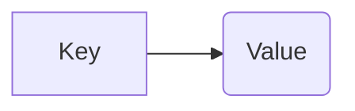
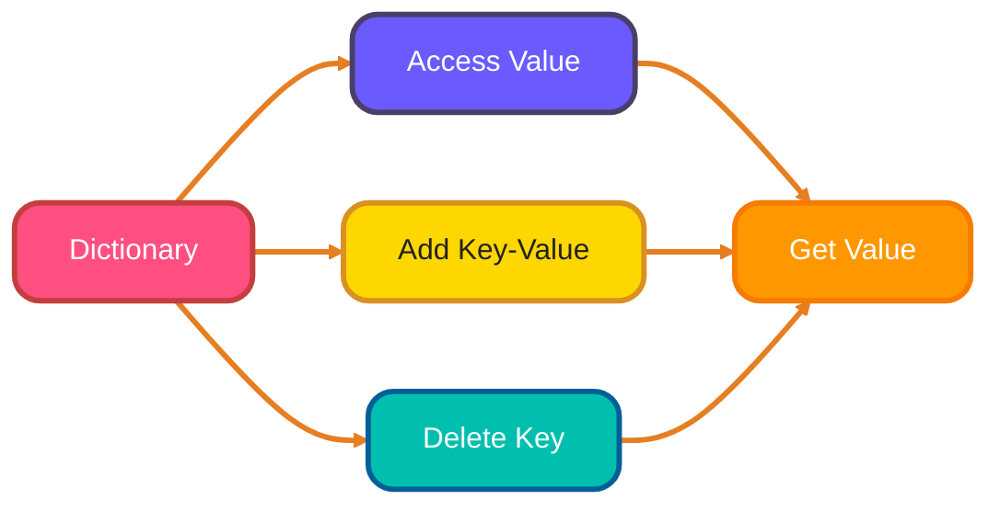
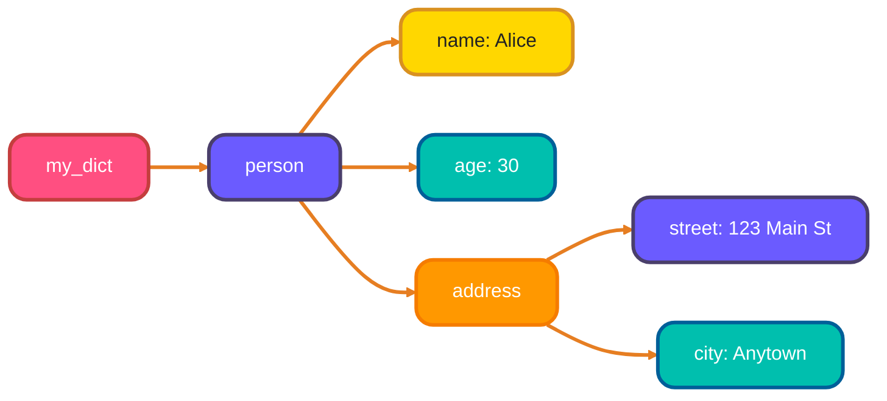

<!--
# Meta Description: Unlock the power of Python Dictionaries! This guide dives deep into dictionary manipulation, methods, comprehensions, and best practices, equipping you with the skills to efficiently manage and utilize key-value pairs in your Python projects.
# Keywords: Python Dictionaries, Key-Value Pairs, Dictionary Methods, Data Structures, Mutable Types, Dictionary Comprehensions, Nested Dictionaries, Python Programming
# -->

# <span style="color:#e67e22;">What we will learn in this post?</span>

<ul style='list-style-type: none; padding-left: 0;'>
<li><span style='color: #2980b9; font-size: 20px; font-weight: bold;'>👉</span> <span style='color: #2ecc71; font-size: 18px; font-weight: bold;'>Introduction to Python Dictionaries</span></li>
<li><span style='color: #2980b9; font-size: 20px; font-weight: bold;'>👉</span> <span style='color: #2ecc71; font-size: 18px; font-weight: bold;'>Accessing and Modifying Dictionary Elements</span></li>
<li><span style='color: #2980b9; font-size: 20px; font-weight: bold;'>👉</span> <span style='color: #2ecc71; font-size: 18px; font-weight: bold;'>Dictionary Methods - Part 1</span></li>
<li><span style='color: #2980b9; font-size: 20px; font-weight: bold;'>👉</span> <span style='color: #2ecc71; font-size: 18px; font-weight: bold;'>Dictionary Methods - Part 2</span></li>
<li><span style='color: #2980b9; font-size: 20px; font-weight: bold;'>👉</span> <span style='color: #2ecc71; font-size: 18px; font-weight: bold;'>Dictionary Comprehensions</span></li>
<li><span style='color: #2980b9; font-size: 20px; font-weight: bold;'>👉</span> <span style='color: #2ecc71; font-size: 18px; font-weight: bold;'>Nested Dictionaries</span></li>
<li><span style='color: #2980b9; font-size: 20px; font-weight: bold;'>👉</span> <span style='color: #2ecc71; font-size: 18px; font-weight: bold;'>Dictionary Operations and Best Practices</span></li>
<li><span style='color: #2980b9; font-size: 20px; font-weight: bold;'>👉</span> <span style='color: #2ecc71; font-size: 18px; font-weight: bold;'>Conclusion!</span></li>
</ul>

## <span style="color:#e67e22">Dictionaries: Key-Value Powerhouses 🔑</span>

Dictionaries in Python are like super-organized address books! They store information in **key-value pairs**. Think of it this way:

- The _key_ is like the person's name.
- The _value_ is their address.



## <span style="color:#2980b9">What Makes Dictionaries Special?</span>

- Dictionaries are **mutable**, meaning you can change them after they're created.
- From Python 3.7 onwards, dictionaries remember the order in which you added items (**insertion-ordered**), and this is helpful when we have a need to remember the order.
- You create them using curly braces `{}`.

```python
# Creating a dictionary
my_dict = {"name": "Alice", "age": 30, "city": "New York"}
print(my_dict) # Output: {'name': 'Alice', 'age': 30, 'city': 'New York'}
```

## <span style="color:#2980b9">Dictionary Use Cases 💡</span>

Dictionaries are useful for:

- Storing configuration settings.
- Representing objects with named properties.
- Counting frequencies of items, for example, how many times we encounter a word.

Resources:
[Python Dictionaries Documentation](https://docs.python.org/3/tutorial/datastructures.html#dictionaries)

# <span style="color:#e67e22">Dictionary Fun: Accessing, Modifying, & More!</span> 📚

Let's explore how to work with dictionaries in Python! They're like real-world dictionaries, pairing _keys_ with _values_. 🗝️

## <span style="color:#2980b9">Accessing Values with Keys</span> 🔑

You grab a value by using its key inside square brackets: `my_dictionary['key']`. If the key doesn't exist, you'll get a `KeyError`. Use the `.get()` method to avoid this! It returns `None` (or a default value you specify) if the key is missing.

```python
my_dict = {'name': 'Alice', 'age': 30}
print(my_dict['name']) # Output: Alice
print(my_dict.get('city')) # Output: None
print(my_dict.get('city', 'Unknown')) # Output: Unknown
```

## <span style="color:#2980b9">Modifying and Adding</span> ✏️➕

Change a value by assigning a new one to its key: `my_dictionary['key'] = new_value`. To add a completely new key-value pair, simply assign a value to a new key: `my_dictionary['new_key'] = value`.

```python
my_dict['age'] = 31  # Modifying
my_dict['city'] = 'New York' # Adding
print(my_dict) # Output: {'name': 'Alice', 'age': 31, 'city': 'New York'}
```

## <span style="color:#2980b9">Deleting Items</span> 🗑️

Use the `del` keyword followed by the dictionary and the key in square brackets: `del my_dictionary['key']`.

```python
del my_dict['age']
print(my_dict) # Output: {'name': 'Alice', 'city': 'New York'}
```



For more in-depth learning check out these resources!

- [Python Dictionaries Tutorial](https://realpython.com/python-dicts/)
- [Python Documentation on Dictionaries](https://docs.python.org/3/tutorial/datastructures.html#dictionaries)

{% include code-playground.html language="python" code="# Python Dictionary Operations Demo

# Create a dictionary
person = {'name': 'Alice', 'age': 30, 'city': 'New York'}
print(\"Original dictionary:\", person)

print(\"\\n\" + \"=\" * 50 + \"\\n\")

# Accessing values
print(\"Access by key ['name']:\", person['name'])
print(\"Safe access with .get('age'):\", person.get('age'))
print(\"Get with default .get('country', 'USA'):\", person.get('country', 'USA'))

print(\"\\n\" + \"=\" * 50 + \"\\n\")

# Modifying values
person['age'] = 31
print(\"After modifying age:\", person)

# Adding new key-value pairs
person['email'] = 'alice@example.com'
person['phone'] = '555-1234'
print(\"After adding email and phone:\", person)

print(\"\\n\" + \"=\" * 50 + \"\\n\")

# Deleting items
del person['phone']
print(\"After deleting phone:\", person)

# Check if key exists
if 'email' in person:
    print(\"Email exists:\", person['email'])

if 'country' not in person:
    print(\"Country key does not exist\")

print(\"\\n\" + \"=\" * 50 + \"\\n\")

# Length and string representation
print(\"Number of items:\", len(person))
print(\"All keys:\", list(person.keys()))
print(\"All values:\", list(person.values()))

# Try modifying the dictionary above!" height="700" gradient="purple" %}

# <span style="color:#e67e22">Dictionary Methods: Your Dictionary Toolkit! 🧰</span>

Dictionaries in Python are like treasure chests 💰, holding key-value pairs. Let's explore some useful tools to manage them!

## <span style="color:#2980b9">Accessing Dictionary Data</span>

### <span style="color:#8e44ad">`keys()`: Unlocking the Keys</span>

The `.keys()` method gives you a _view object_ containing all the keys in your dictionary.

```python
my_dict = {"name": "Alice", "age": 30, "city": "New York"}
keys = my_dict.keys()
print(keys) # Output: frozenset(['name', 'age', 'city'])
```

{% include code-playground.html language="python" code="# Python Dictionary Methods Demo

# Create a sample dictionary
student = {'name': 'Bob', 'age': 22, 'grade': 'A', 'major': 'CS'}
print(\"Original dictionary:\", student)

print(\"\\n\" + \"=\" * 50 + \"\\n\")

# keys(), values(), items()
print(\"Keys:\", list(student.keys()))
print(\"Values:\", list(student.values()))
print(\"Items (key-value pairs):\", list(student.items()))

print(\"\\n\" + \"=\" * 50 + \"\\n\")

# Iterating through dictionary
print(\"Iterating through items:\")
for key, value in student.items():
    print(f\"  {key}: {value}\")

print(\"\\n\" + \"=\" * 50 + \"\\n\")

# update() - merge dictionaries
extra_info = {'university': 'MIT', 'year': 2024}
student.update(extra_info)
print(\"After update():\", student)

print(\"\\n\" + \"=\" * 50 + \"\\n\")

# setdefault() - add if key doesn't exist
gpa = student.setdefault('gpa', 3.8)
print(\"After setdefault('gpa', 3.8):\", student)
print(\"GPA value:\", gpa)

# Try again - key exists, value not changed
gpa2 = student.setdefault('gpa', 4.0)
print(\"After setdefault('gpa', 4.0) again:\", student)
print(\"GPA still:\", gpa2)

print(\"\\n\" + \"=\" * 50 + \"\\n\")

# pop() and popitem()
removed_grade = student.pop('grade')
print(f\"Popped 'grade': {removed_grade}\")
print(\"After pop:\", student)

last_item = student.popitem()
print(f\"Popped last item: {last_item}\")
print(\"After popitem:\", student)

# copy() - create a shallow copy
student_copy = student.copy()
student_copy['name'] = 'Charlie'
print(\"\\nOriginal:\", student)
print(\"Copy (modified):\", student_copy)

# Try different dictionary methods!" height="750" gradient="green" %}

# <span style="color:#e67e22">Dictionary Comprehensions: Compact & Powerful! 🌟</span>
```

### <span style="color:#8e44ad">`values()`: Revealing the Values</span>

Similar to `.keys()`, `.values()` provides a _view object_ containing all the values.

```python
values = my_dict.values()
print(values) # Output: dict_values(['Alice', 30, 'New York'])
```

### <span style="color:#8e44ad">`items()`: Getting Key-Value Pairs</span>

`.items()` returns a _view object_ with key-value pairs as tuples. Super handy for looping!

```python
items = my_dict.items()
print(items) # Output: dict_items([('name', 'Alice'), ('age', 30), ('city', 'New York')])

for key, value in my_dict.items():
    print(f"Key: {key}, Value: {value}")
# Output:
# Key: name, Value: Alice
# Key: age, Value: 30
# Key: city, Value: New York
```

### <span style="color:#8e44ad">`get()`: Safe Retrieval</span>

`.get(key, default)` retrieves the value for a given key. If the key doesn't exist, it returns the `default` value (or `None` if no default is provided), avoiding errors.

```python
age = my_dict.get("age")
print(age) # Output: 30

occupation = my_dict.get("occupation", "Unknown")
print(occupation) # Output: Unknown
```

## <span style="color:#2980b9">Modifying Dictionaries</span>

### <span style="color:#8e44ad">`setdefault()`: Adding if Absent</span>

`.setdefault(key, default)` returns the value of the key, but _also_ inserts the key with the given `default` value if the key is not already in the dictionary.

```python
my_dict.setdefault("country", "USA")
print(my_dict) # Output: {'name': 'Alice', 'age': 30, 'city': 'New York', 'country': 'USA'}

#If 'country' already existed, the value would NOT be changed.
```

### <span style="color:#8e44ad">`update()`: Merging Dictionaries</span>

`.update(other_dict)` merges another dictionary into the current one. If there are shared keys, the values from `other_dict` overwrite the existing ones.

```python
new_data = {"age": 31, "occupation": "Engineer"}
my_dict.update(new_data)
print(my_dict) # Output: {'name': 'Alice', 'age': 31, 'city': 'New York', 'country': 'USA', 'occupation': 'Engineer'}
```

**Resources:**

- [Python Dictionaries Tutorial](https://realpython.com/python-dicts/)

# <span style="color:#e67e22">Dictionary Methods Explained 🚀</span>

Let's explore some handy dictionary methods in Python. Dictionaries are super useful for storing data in key-value pairs!

## <span style="color:#2980b9">Removing Items 🗑️</span>

### <span style="color:#8e44ad">`pop()`</span>

- Removes a specific key-value pair. You need to provide the key. If the key isn't found, it raises an error (unless you provide a default value).

```python
my_dict = {"name": "Alice", "age": 30, "city": "New York"}
popped_value = my_dict.pop("age")
print(my_dict) # {'name': 'Alice', 'city': 'New York'}
print(popped_value) # 30
```

### <span style="color:#8e44ad">`popitem()`</span>

- Removes and returns the _last_ inserted key-value pair. Useful when you don't care _which_ item gets removed. Before Python 3.7, it removed an _arbitrary_ item.

```python
my_dict = {"name": "Alice", "age": 30, "city": "New York"}
removed_item = my_dict.popitem()
print(my_dict) # {'name': 'Alice', 'age': 30} (Order may vary before Python 3.7)
print(removed_item) # ('city', 'New York')
```

## <span style="color:#2980b9">Clearing and Copying 🧹</span>

### <span style="color:#8e44ad">`clear()`</span>

- Removes all items from the dictionary, leaving it empty.

```python
my_dict = {"name": "Alice", "age": 30}
my_dict.clear()
print(my_dict) # {}
```

### <span style="color:#8e44ad">`copy()`</span>

- Creates a _shallow_ copy of the dictionary. Changes to the copy won't affect the original, and vice-versa (for simple data types).

```python
my_dict = {"name": "Alice", "age": 30}
new_dict = my_dict.copy()
new_dict["age"] = 31
print(my_dict) # {'name': 'Alice', 'age': 30}
print(new_dict) # {'name': 'Alice', 'age': 31}
```

## <span style="color:#2980b9">Creating from Keys 🔑</span>

### <span style="color:#8e44ad">`fromkeys()`</span>

- Creates a new dictionary with keys from a sequence and a common value (default is `None`).

```python
keys = ["name", "age", "city"]
new_dict = dict.fromkeys(keys, "Unknown")
print(new_dict) # {'name': 'Unknown', 'age': 'Unknown', 'city': 'Unknown'}
```

Here is a resource link to get more info on Python Dictionaries: [Python Dictionary Tutorial](https://realpython.com/python-dicts/)

# <span style="color:#e67e22">Dictionary Comprehensions: 🛠️ A Quick Guide</span>

Tired of writing long loops to make dictionaries? Dictionary comprehensions are here to help! They offer a super **concise** way to create dictionaries in just one line of code. Think of it as a short and sweet shortcut.

## <span style="color:#2980b9">The Basics: Unpacking the Syntax</span>

The magic formula is: `{key: value for item in iterable}`. Let's break it down:

- `key: value`: This defines what each _key-value_ pair in your dictionary will look like.
- `for item in iterable`: This part is familiar! It's just like a `for` loop, looping through each `item` in your `iterable` (like a list or tuple).

## <span style="color:#2980b9">Examples: Putting it into Practice</span>

### <span style="color:#8e44ad">Simple Transformation</span>

Let's say you have a list of numbers and want to create a dictionary where the number is the key and its square is the value:

```python
numbers = [1, 2, 3, 4, 5]
squares = {num: num**2 for num in numbers}
print(squares)
# Output: {1: 1, 2: 4, 3: 9, 4: 16, 5: 25}
```

{% include code-playground.html language="python" code="# Python Dictionary Comprehensions Demo

# Basic dictionary comprehension - squares
numbers = [1, 2, 3, 4, 5, 6, 7, 8, 9, 10]
squares = {num: num ** 2 for num in numbers}
print(\"Squares:\", squares)

print(\"\\n\" + \"=\" * 50 + \"\\n\")

# Dictionary comprehension with condition - only even numbers
even_squares = {num: num ** 2 for num in numbers if num % 2 == 0}
print(\"Even squares:\", even_squares)

print(\"\\n\" + \"=\" * 50 + \"\\n\")

# Transform lists to dictionary
names = ['Alice', 'Bob', 'Charlie', 'David']
name_lengths = {name: len(name) for name in names}
print(\"Name lengths:\", name_lengths)

print(\"\\n\" + \"=\" * 50 + \"\\n\")

# Swap keys and values
original = {'a': 1, 'b': 2, 'c': 3}
swapped = {value: key for key, value in original.items()}
print(\"Original:\", original)
print(\"Swapped:\", swapped)

print(\"\\n\" + \"=\" * 50 + \"\\n\")

# Filter and transform existing dictionary
grades = {'Alice': 85, 'Bob': 92, 'Charlie': 78, 'David': 95, 'Eve': 88}

# Only students with A grade (>= 90)
a_students = {name: grade for name, grade in grades.items() if grade >= 90}
print(\"A students:\", a_students)

# Add letter grades
with_letters = {name: {'score': score, 'letter': 'A' if score >= 90 else 'B' if score >= 80 else 'C'} 
                for name, score in grades.items()}
print(\"\\nWith letter grades:\")
for name, data in with_letters.items():
    print(f\"  {name}: {data}\")

print(\"\\n\" + \"=\" * 50 + \"\\n\")

# Create dictionary from two lists using zip
keys = ['name', 'age', 'city', 'country']
values = ['Alice', 30, 'New York', 'USA']
person = {k: v for k, v in zip(keys, values)}
print(\"Person from zip:\", person)

# Try your own dictionary comprehensions!" height="750" gradient="pink" %}

### <span style="color:#8e44ad">Adding Filters: Keeping it Selective</span>

Want to include only even numbers? Add an `if` condition!

```python
numbers = [1, 2, 3, 4, 5, 6]
even_squares = {num: num**2 for num in numbers if num % 2 == 0}
print(even_squares)
# Output: {2: 4, 4: 16, 6: 36}
```

- The `if num % 2 == 0` part ensures that only even numbers are processed.

Dictionary comprehensions can significantly reduce code and improve readability. They are a handy tool for any Python programmer.

# <span style="color:#e67e22">Nested Dictionaries: Dictionaries within Dictionaries 📚</span>

Nested dictionaries are simply dictionaries that contain other dictionaries as values. Think of it as a dictionary where some entries point to other, smaller dictionaries. They are used to represent complex, hierarchical data.



{% include code-playground.html language="python" code="# Python Nested Dictionaries Demo

# Create a nested dictionary - company with employees
company = {
    'employees': {
        'E001': {
            'name': 'Alice Johnson',
            'department': 'Engineering',
            'salary': 95000,
            'skills': ['Python', 'Django', 'PostgreSQL']
        },
        'E002': {
            'name': 'Bob Smith',
            'department': 'Marketing',
            'salary': 75000,
            'skills': ['SEO', 'Content Marketing', 'Analytics']
        },
        'E003': {
            'name': 'Charlie Brown',
            'department': 'Engineering',
            'salary': 88000,
            'skills': ['JavaScript', 'React', 'Node.js']
        }
    },
    'departments': {
        'Engineering': {'budget': 500000, 'head': 'Alice Johnson'},
        'Marketing': {'budget': 300000, 'head': 'Bob Smith'}
    }
}

print(\"Company structure:\")
print(f\"Total employees: {len(company['employees'])}\")
print(f\"Departments: {len(company['departments'])}\")

print(\"\\n\" + \"=\" * 50 + \"\\n\")

# Access nested values
print(\"Accessing nested data:\")
print(f\"Employee E001 name: {company['employees']['E001']['name']}\")
print(f\"E001 department: {company['employees']['E001']['department']}\")
print(f\"E001 skills: {company['employees']['E001']['skills']}\")

print(\"\\n\" + \"=\" * 50 + \"\\n\")

# Iterate through nested dictionary
print(\"All employees:\")
for emp_id, emp_data in company['employees'].items():
    print(f\"  {emp_id}: {emp_data['name']} - {emp_data['department']}\")
    print(f\"    Salary: ${emp_data['salary']:,}\")
    print(f\"    Skills: {', '.join(emp_data['skills'])}\")

print(\"\\n\" + \"=\" * 50 + \"\\n\")

# Modify nested values
company['employees']['E001']['salary'] = 100000
company['employees']['E001']['skills'].append('Docker')
print(f\"Updated E001 salary: ${company['employees']['E001']['salary']:,}\")
print(f\"Updated E001 skills: {company['employees']['E001']['skills']}\")

print(\"\\n\" + \"=\" * 50 + \"\\n\")

# Add new nested entry
company['employees']['E004'] = {
    'name': 'Diana Prince',
    'department': 'HR',
    'salary': 82000,
    'skills': ['Recruitment', 'Training', 'Employee Relations']
}
print(\"Added new employee E004:\", company['employees']['E004']['name'])

# Calculate total payroll
total_payroll = sum(emp['salary'] for emp in company['employees'].values())
print(f\"\\nTotal payroll: ${total_payroll:,}\")

# Try exploring the nested dictionary!" height="800" gradient="orange" %}

## <span style="color:#2980b9">Accessing Nested Values 🔑</span>

You access nested values by chaining keys, like `dictionary['key1']['key2']['key3']`. Each key accesses a level deeper into the structure.

```python
my_dict = {
    'person': {
        'name': 'Alice',
        'age': 30,
        'address': {
            'street': '123 Main St',
            'city': 'Anytown'
        }
    }
}

# Accessing Alice's age:
age = my_dict['person']['age'] # 30
# Accessing Alice's street:
street = my_dict['person']['address']['street'] # '123 Main St'

print(age)
print(street)
# 30
# 123 Main St
```

## <span style="color:#2980b9">Practical Use Cases 💼</span>

- **JSON-like Data Structures:** Nested dictionaries are perfect for representing data similar to JSON format. This is super useful for working with APIs and configuration files.

- **Representing Complex Objects:** Like a customer object containing address and order history dictionaries.

- **Configuration Management:** Storing application settings organized by category.

```python
# Example of JSON-like data
data = {
    "widget": {
        "debug": "on",
        "window": {
            "name": "main_window",
            "width": 640,
            "height": 480
        }
    }
}
```

| Feature      | Dictionary (`dict`)    | List (`list`)       | Tuple (`tuple`)        |
| ------------ | ---------------------- | ------------------- | ---------------------- |
| Structure    | Key-value pairs        | Ordered items       | Ordered items          |
| Mutability   | Mutable                | Mutable             | Immutable              |
| Access       | By key                 | By index            | By index               |
| Syntax       | `{}`                   | `[]`                | `()`                   |
| Typical Use  | Mapping, fast lookup   | Sequence, iteration | Fixed sequence, safety |
| Keys/Indices | Keys must be immutable | Indices (0, 1, ...) | Indices (0, 1, ...)    |

````

# <span style="color:#e67e22">Dictionary Fun 📖: Operations and Tips</span>

Let's explore some handy dictionary tricks and how to use them wisely! Dictionaries are like real-world dictionaries: they hold _key-value_ pairs.

## <span style="color:#2980b9">Essential Dictionary Actions 🛠️</span>

- **Membership Testing ( `in` )**: Quick check to see if a key exists. Super fast! 💨

  ```python
  my_dict = {'apple': 1, 'banana': 2}
  print('apple' in my_dict)  # Output: True
  print('orange' in my_dict) # Output: False
````

- **Iteration**: Looping through the dictionary. You can loop through keys, values, or both! 🔄

  ```python
  my_dict = {'apple': 1, 'banana': 2}
  for key in my_dict: # Loop through keys
      print(key)
  for value in my_dict.values(): # Loop through values
      print(value)
  for key, value in my_dict.items(): # Loop through keys and values
      print(f"{key}: {value}")
  ```

- **Merging Dictionaries ( `|` )**: Combines two dictionaries (Python 3.9+). Think of it as a friendly handshake!🤝

  ```python
  dict1 = {'a': 1, 'b': 2}
  dict2 = {'c': 3, 'd': 4}
  merged_dict = dict1 | dict2
  print(merged_dict) # Output: {'a': 1, 'b': 2, 'c': 3, 'd': 4}
  ```

## <span style="color:#2980b9">Performance Notes and Best Practices 🚀</span>

- **Speed Matters**: Dictionary lookups (using keys) are generally very fast – close to constant time! This is a big advantage.
- **Choose Keys Wisely**: Use immutable (unchangeable) data types like strings, numbers, or tuples as keys. Avoid using lists!
- **Memory Management**: Dictionaries can take up a fair bit of memory. Be mindful when working with _very_ large datasets.
- **Avoid Modification during Iteration**: Modifying a dictionary while looping through it can lead to unexpected behavior. Create a copy or use a list to store the elements to be deleted/modified.

```python
#Don't do this
my_dict = {'apple': 1, 'banana': 2, 'cherry':3}
for key in my_dict:
    if my_dict[key] < 3:
        del my_dict[key]  #This is bad

#Instead you could do this:
my_dict = {'apple': 1, 'banana': 2, 'cherry':3}
keys_to_delete = []
for key in my_dict:
    if my_dict[key] < 3:
        keys_to_delete.append(key)

for key in keys_to_delete:
    del my_dict[key]

print(my_dict) #Output {'cherry': 3}
```

---

## <span style="color:#e67e22">🎯 Practice Project Assignment</span>

<details>
<summary><strong>💡 Project: Contact Management System</strong> (Click to expand)</summary>
<br>
<p><strong>Your Challenge:</strong></p>
<p>Build a simple contact management system using nested dictionaries that stores contact information and provides search and filter capabilities.</p>

<p><strong>Implementation Hints:</strong></p>
<ul>
<li>Use a main dictionary with contact IDs as keys and nested dictionaries as values containing name, phone, email, and tags</li>
<li>Implement a search function that finds contacts by name using dictionary comprehension</li>
<li>Create a filter function to get contacts by tag (e.g., 'work', 'family', 'friends')</li>
<li>Use the <code>update()</code> method to merge new contact information</li>
<li><strong>Bonus:</strong> Add a function to export contacts to a formatted string showing all details, and calculate statistics like total contacts per tag using dictionary methods</li>
</ul>

<p><strong>Example Output:</strong></p>
<pre>
Contact System:
===============
Total contacts: 4

Contact C001:
  Name: Alice Johnson
  Phone: 555-0101
  Email: alice@example.com
  Tags: ['work', 'friend']

Searching for 'Bob':
  Found: Bob Smith (C002)

Filtering by tag 'work':
  2 contacts found: Alice Johnson, Charlie Brown

Statistics:
  work: 2 contacts
  family: 1 contact
  friend: 3 contacts
</pre>

<p><strong>Share Your Solution! 💬</strong></p>
<p>Got your contact manager working? Share your code in the comments! Feel free to add extra features like sorting contacts, validating email formats, or creating groups. Happy coding! 📇</p>

</details>

---

<h1><span style='color:#e67e22'>Conclusion</span></h1>

Hope you enjoyed the read! 🥳 Now it's your turn! What are your takeaways? Any tips you'd like to share? Drop a comment below – I'm all ears! 👂✍️
