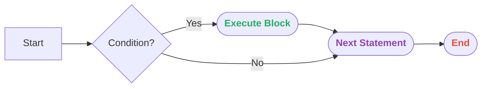
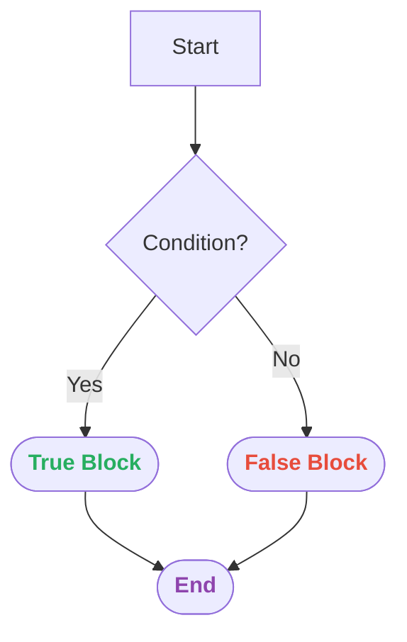
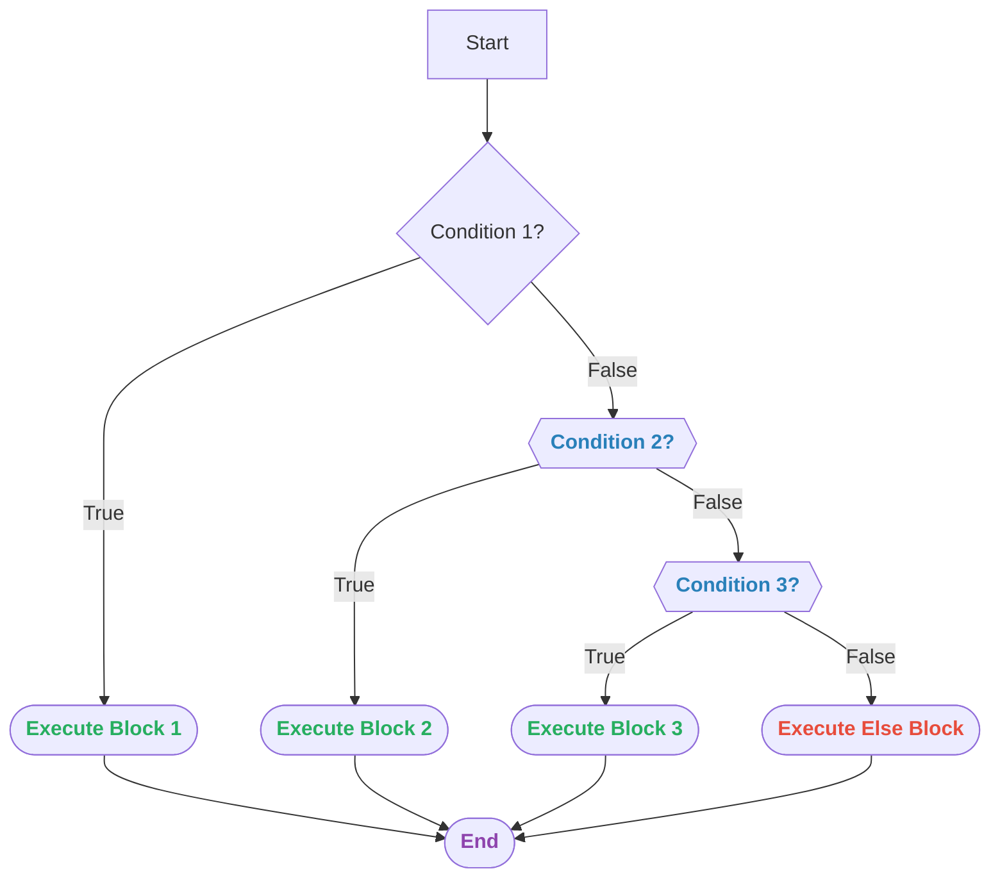
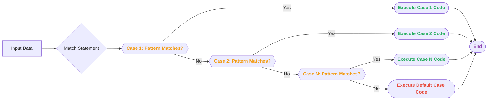

<!--
# Meta Description: Master the art of decision-making in Python! Learn to wield conditional statements like a pro – from simple `if` to advanced `match-case` for crafting elegant and responsive code.
# Keywords: Python Control Flow, Conditional Statements, if-elif-else, match-case, Ternary Operator, Python Programming, Boolean Logic, Pattern Matching, Python Tutorial
-->

# <span style="color:#e67e22;">What we will learn in this post?</span>

<ul style='list-style-type: none; padding-left: 0;'>
<li><span style='color: #2980b9; font-size: 20px; font-weight: bold;'>👉</span> <span style='color: #2ecc71; font-size: 18px; font-weight: bold;'>Introduction to Control Flow</span></li>
<li><span style='color: #2980b9; font-size: 20px; font-weight: bold;'>👉</span> <span style='color: #2ecc71; font-size: 18px; font-weight: bold;'>if Statement</span></li>
<li><span style='color: #2980b9; font-size: 20px; font-weight: bold;'>👉</span> <span style='color: #2ecc71; font-size: 18px; font-weight: bold;'>if-else Statement</span></li>
<li><span style='color: #2980b9; font-size: 20px; font-weight: bold;'>👉</span> <span style='color: #2ecc71; font-size: 18px; font-weight: bold;'>if-elif-else Statement</span></li>
<li><span style='color: #2980b9; font-size: 20px; font-weight: bold;'>👉</span> <span style='color: #2ecc71; font-size: 18px; font-weight: bold;'>Nested if Statements</span></li>
<li><span style='color: #2980b9; font-size: 20px; font-weight: bold;'>👉</span> <span style='color: #2ecc71; font-size: 18px; font-weight: bold;'>Ternary Operator (Conditional Expression)</span></li>
<li><span style='color: #2980b9; font-size: 20px; font-weight: bold;'>👉</span> <span style='color: #2ecc71; font-size: 18px; font-weight: bold;'>match-case Statement (Python 3.10+)</span></li>
<li><span style='color: #2980b9; font-size: 20px; font-weight: bold;'>👉</span> <span style='color: #2ecc71; font-size: 18px; font-weight: bold;'>Conclusion!</span></li>
</ul>

# <span style="color:#e67e22">Controlling the Flow 🚦 in Your Code</span>

Imagine your code as a recipe. Control flow lets you decide which steps to take, skip, or repeat. It's about guiding the computer on _what_ to do and _when_ to do it. Without it, programs would only execute one line after another, making them boring and inflexible. Control flow is essential for creating dynamic and responsive programs!

## <span style="color:#2980b9">Python's Secret: Indentation 🔑</span>

Unlike some languages that use curly braces `{}`, Python uses **indentation** to group lines of code into _blocks_. Think of it like outlining a document – the level of indentation shows which statements belong together. For example:

```python
if x > 5:
    print("x is big!") # Part of the 'if' block
    y = x * 2       # Also part of the 'if' block
print("Done!")         # Not part of the 'if' block
```

Correct indentation is **_crucial_**; incorrect indentation will cause errors! Make sure to use consistent spacing (usually four spaces) for each level of indentation.

- **Why is this important?** It makes Python code very readable and avoids the clutter of curly braces.
- **Keep in mind:** Consistency is key! Use spaces or tabs _only_. Don't mix them!



## <span style="color:#2980b9">Types of Control Flow 📚</span>

- **Conditional Statements:** Decide which code to run based on conditions (using `if`, `elif`, and `else`).

- **Loops:** Repeat code blocks (using `for` and `while` loops).

By mastering control flow, you unlock the true potential of programming!

# <span style="color:#e67e22">Conditional Logic with 'if' Statements 🚀</span>

Let's explore how `if` statements let your code make decisions!

## <span style="color:#2980b9">Understanding the 'if' Syntax</span>

The `if` statement checks if a condition is _true_. If it is, the code inside the `if` block runs. If not, that code is skipped.

```python
if condition:
    # Code to execute if the condition is true
```

The `condition` is a _boolean expression_, meaning it results in either `True` or `False`. Here are some examples:

### <span style="color:#8e44ad">Examples with Different Conditions 🌈</span>

- **Example 1: Simple Comparison**

```python
x = 10
if x > 5:
    print("x is greater than 5") #Output: x is greater than 5
```

- **Example 2: Checking Equality**

```python
name = "Alice"
if name == "Alice":
    print("Hello, Alice!") #Output: Hello, Alice!
```

- **Example 3: Using `else`**

```python
age = 16
if age >= 18:
    print("You are an adult.")
else:
    print("You are not an adult yet.") #Output: You are not an adult yet.
```

- **Example 4: Using `elif` (else if)**

```python
score = 75
if score >= 90:
    print("A")
elif score >= 80:
    print("B")
elif score >= 70:
    print("C") #Output: C
else:
    print("D")
```

Here's a flowchart representing the `if-else` logic:



Boolean expressions can use comparison operators like `>`, `<`, `==`, `!=`, `>=`, `<=` and logical operators like `and`, `or`, `not`.

# <span style="color:#e67e22">Conditional Control with If-Else Statements</span> 🚀

The `if-else` statement is your trusty tool in programming for making decisions. It lets your code follow one path if a condition is true, and another path if it's false. Think of it like a fork in the road!

## <span style="color:#2980b9">If-Else Syntax</span>

The basic syntax looks like this:

```python
if condition:
    # Code to execute if the condition is TRUE
else:
    # Code to execute if the condition is FALSE
```

- The `condition` is a boolean expression (something that evaluates to `True` or `False`).
- The code inside the `if` block executes _only_ when the condition is `True`.
- The code inside the `else` block executes _only_ when the condition is `False`.

## <span style="color:#8e44ad">Practical Examples</span>

Here are some easy-to-understand examples:

- **Even/Odd Checker**

```python
number = 7
if number % 2 == 0:
    print("Even") # This will NOT print
else:
    print("Odd")  # Output: Odd
```

- **Age Validation**

```python
age = 16
if age >= 18:
    print("You are an adult.") # This will NOT print
else:
    print("You are a minor.") # Output: You are a minor.
```

- **Simple greeting based on Time of Day**

```python
time = 14 #2 PM
if time < 12:
  print("Good Morning!") #This will NOT print
else:
  print("Good Afternoon") #Output: Good Afternoon!
```

---

[Python If-Else Documentation](https://www.w3schools.com/python/python_conditions.asp)

# <span style="color:#e67e22">Conditional Logic with `if-elif-else` in Python 🐍</span>

Python's `if-elif-else` statement is your _go-to tool_ for handling multiple conditions in a program. Think of it like a branching path where your code takes different routes based on whether certain conditions are met.

## <span style="color:#2980b9">How it Works 🤔</span>

The `if-elif-else` chain evaluates conditions in a specific order.

- First, the `if` condition is checked. If it's `True`, the code block under it is executed, and the rest of the chain is skipped.
- If the `if` condition is `False`, Python moves to the first `elif` (short for "else if") condition. It checks this condition, and if it's `True`, its code block is executed, and the rest are skipped.
- You can have multiple `elif` conditions to check for various scenarios.
- Finally, if _none_ of the `if` or `elif` conditions are `True`, the `else` block is executed. The `else` block is optional and acts as a default action.

Python stops evaluating conditions as soon as it finds one that is `True`. This behavior is called _short-circuiting_.

## <span style="color:#2980b9">Examples 🚀</span>

### <span style="color:#8e44ad">Grade Calculation</span>

```python
grade = 85

if grade >= 90:
    print("A") #Output: A
elif grade >= 80:
    print("B") #Output: B
elif grade >= 70:
    print("C")
else:
    print("Below C")
```

### <span style="color:#8e44ad">Menu Selection</span>

```python
choice = "2" #User has selected option 2

if choice == "1":
    print("You selected Option 1")
elif choice == "2":
    print("You selected Option 2") #Output: You selected Option 2
elif choice == "3":
    print("You selected Option 3")
else:
    print("Invalid choice")
```

In the grade example, since `grade` is 85, the second `elif` condition (`grade >= 80`) is `True`, so "B" is printed. In the menu example, the second `elif` condition is True, so "You selected Option 2" is printed.

Here's a simple flowchart illustrating the logic:





# <span style="color:#e67e22">Nested If Statements: A Guide 🧐</span>

Nested `if` statements are `if` statements _inside_ other `if` statements. Think of it like Russian nesting dolls! You use them when you need to check multiple conditions, where one condition depends on another.

## <span style="color:#2980b9">When to Use Them? 🤔</span>

Use them when the second condition _only_ needs to be checked if the first one is true. For example:

```python
age = 20
has_license = True

if age >= 18:
  if has_license:
    print("You can drive!") # Output: You can drive!
  else:
    print("You're old enough, but need a license.")
else:
  print("You're too young to drive.")
```

## <span style="color:#2980b9">Readability is Key! 🔑</span>

Deeply nested `if` statements can get messy. Indentation matters in Python and makes code look very ugly! To keep things readable:

- Keep nesting shallow (aim for no more than 2-3 levels).
- Use meaningful variable names.
- Add comments to explain complex logic.

## <span style="color:#2980b9">Alternatives to Deep Nesting 💡</span>

Consider these options:

- **`elif` (else if):** Makes multiple conditions clearer.
- **Logical operators (`and`, `or`):** Combine conditions. For instance, in the previous example, `if age >= 18 and has_license:` would avoid the nested `if`.
- **Functions:** Break down complex logic into smaller, reusable parts.
- **Guard Clauses:** Check for error condition and return immediately

  ```python
  def process_data(data):
  if data is None:
  return "Error: Data is None"

          #Proceed with processing if data isn't None
          #....
  ```

  This method checks for the problematic cases early and exits, thus helping to avoid deep nesting for primary logic flow.


By applying these tips, your code will be much easier to understand and maintain.

# <span style="color:#e67e22">Python's Ternary Operator: A Concise If-Else</span> 🚀

Python offers a cool shorthand for simple `if-else` statements called the _ternary operator_. Think of it as a one-line if-else. It's structured like this: `value_if_true if condition else value_if_false`.

## <span style="color:#2980b9">How it Works</span> ✨

It evaluates the `condition`. If the `condition` is `True`, it returns `value_if_true`; otherwise, it returns `value_if_false`. Let's see some examples:

```python
age = 20
status = "Adult" if age >= 18 else "Minor"
print(status) # Output: Adult

is_even = True
message = "Even" if is_even else "Odd"
print(message) # Output: Even

x = 5
y = 10
result = x if x < y else y
print(result) # Output: 5
```

## <span style="color:#2980b9">When to Use It</span> 🤔

The ternary operator is best used for:

- Assigning a value based on a simple condition.
- Keeping code concise and readable, especially when dealing with short, straightforward `if-else` logic.
- Avoid it for complex conditions or nested `if-else` statements, as it can become difficult to read.

Using it judiciously can make your Python code cleaner and more efficient.

{% include code-playground.html 
   language="python" 
   code="# Ternary Operator Examples (One-Line if-else)

# Example 1: Age Classification
age = 20
status = \"Adult\" if age >= 18 else \"Minor\"
print(f\"Age {age}: {status}\")

age = 15
status = \"Adult\" if age >= 18 else \"Minor\"
print(f\"Age {age}: {status}\")

print(\"\\n\" + \"=\"*50 + \"\\n\")

# Example 2: Finding Minimum/Maximum
x, y = 5, 10
minimum = x if x < y else y
maximum = x if x > y else y
print(f\"Min of {x} and {y}: {minimum}\")
print(f\"Max of {x} and {y}: {maximum}\")

print(\"\\n\" + \"=\"*50 + \"\\n\")

# Example 3: Even/Odd Checker
number = 7
result = \"Even\" if number % 2 == 0 else \"Odd\"
print(f\"{number} is {result}\")

number = 42
result = \"Even\" if number % 2 == 0 else \"Odd\"
print(f\"{number} is {result}\")

print(\"\\n\" + \"=\"*50 + \"\\n\")

# Example 4: Discount Calculator
price = 100
has_coupon = True
final_price = price * 0.8 if has_coupon else price
print(f\"Original: ${price}\")
print(f\"Final: ${final_price} {'(20% off!)' if has_coupon else ''}\")

print(\"\\n\" + \"=\"*50 + \"\\n\")

# Example 5: Nested Ternary (Use Sparingly!)
score = 85
grade = \"A\" if score >= 90 else (\"B\" if score >= 80 else (\"C\" if score >= 70 else \"F\"))
print(f\"Score {score}: Grade {grade}\")

# Better approach for multiple conditions - use if-elif-else
if score >= 90:
    grade = \"A\"
elif score >= 80:
    grade = \"B\"
elif score >= 70:
    grade = \"C\"
else:
    grade = \"F\"
print(f\"(Clearer version) Score {score}: Grade {grade}\")" 
   height="750px" 
   gradient="pink" 
%}

# <span style="color:#e67e22">Python's Cool New Trick: The `match-case` Statement 🤩</span>

Python 3.10 brought us a handy tool called `match-case`, also known as _structural pattern matching_. It's like a super-powered `if-elif-else` that can check the _structure_ of your data, not just values!

## <span style="color:#2980b9">How it Works 🛠️</span>

The basic syntax is:

```python
match variable:
    case pattern1:
        # Do something if variable matches pattern1
    case pattern2:
        # Do something if variable matches pattern2
    case _: # wildcard
        # Default case if no other pattern matches

```

Here's a simple example:

```python
command = "open file"

match command.split():
    case ["open", file_name]:
        print(f"Opening {file_name}...") # Output: Opening file...
    case ["close"]:
        print("Closing the application")
    case _:
        print("Invalid command")
```

## <span style="color:#2980b9">Why Use `match-case`? 🤔</span>

- **Readability:** Makes code cleaner and easier to understand, especially when dealing with complex data.
- **Structure Matters:** Unlike `if-elif-else`, it can check the structure of lists, tuples, and even objects.
- **Conciseness:** Often reduces the amount of code you need to write.

## <span style="color:#2980b9">`match-case` vs. `if-elif-else` 🥊</span>

While `if-elif-else` checks conditions based on _values_, `match-case` checks based on the _structure_ and optionally, _values within that structure_. `match-case` is particularly useful when you have different ways of structuring data and you need to handle each case differently.

### Comparison Table: if-elif-else vs match-case

| Feature          | if-elif-else            | match-case (Python 3.10+)         |
| ---------------- | ----------------------- | --------------------------------- |
| Syntax           | Simple, linear          | Pattern matching, more expressive |
| Readability      | Good for few conditions | Better for many/complex cases     |
| Performance      | Similar for small cases | Efficient for many patterns       |
| Pattern Matching | Not supported           | Supported (structural, value)     |
| Default Case     | else                    | case \_                           |
| Python Version   | All versions            | 3.10+ only                        |
| Use Case         | Simple branching        | Complex, pattern-based logic      |

**Summary:** Use `if-elif-else` for simple, linear decisions. Use `match-case` for advanced pattern matching and when handling many distinct cases.

**Example:**

```python
point = (0,1)

match point:
    case (0, 0):
        print("Origin")
    case (0, y): #capture pattern
        print(f"On y-axis at y={y}") #output: On y-axis at y=1
    case (x, 0):
        print(f"On x-axis at x={x}")
    case (x, y):
        print(f"General point at ({x}, {y})")

```

`match-case` can greatly improve the clarity and conciseness of code in certain situations.

[More info on pattern matching](https://peps.python.org/pep-0636/)

{% include code-playground.html 
   language="python" 
   code="# match-case Pattern Matching (Python 3.10+)

# Example 1: Command Parser
command = \"open file.txt\"

match command.split():
    case [\"open\", file_name]:
        print(f\"Opening {file_name}...\")
    case [\"close\"]:
        print(\"Closing the application\")
    case [\"save\", file_name]:
        print(f\"Saving {file_name}...\")
    case _:
        print(\"Invalid command\")

print(\"\\n\" + \"=\"*50 + \"\\n\")

# Example 2: Coordinate System
point = (0, 5)

match point:
    case (0, 0):
        print(\"Origin\")
    case (0, y):
        print(f\"On Y-axis at y={y}\")
    case (x, 0):
        print(f\"On X-axis at x={x}\")
    case (x, y):
        print(f\"Point at ({x}, {y})\")

print(\"\\n\" + \"=\"*50 + \"\\n\")

# Example 3: HTTP Status Codes
status_code = 404

match status_code:
    case 200:
        print(\"OK - Request successful\")
    case 201:
        print(\"Created - Resource created\")
    case 400:
        print(\"Bad Request - Invalid syntax\")
    case 401:
        print(\"Unauthorized - Authentication required\")
    case 404:
        print(\"Not Found - Resource doesn't exist\")
    case 500:
        print(\"Internal Server Error\")
    case _:
        print(f\"Unknown status code: {status_code}\")

print(\"\\n\" + \"=\"*50 + \"\\n\")

# Example 4: Data Structure Matching
data = {\"type\": \"user\", \"name\": \"Alice\", \"age\": 25}

match data:
    case {\"type\": \"user\", \"name\": name, \"age\": age}:
        print(f\"User: {name}, Age: {age}\")
    case {\"type\": \"product\", \"name\": name, \"price\": price}:
        print(f\"Product: {name}, Price: ${price}\")
    case _:
        print(\"Unknown data type\")

print(\"\\n\" + \"=\"*50 + \"\\n\")

# Example 5: Calculator with Pattern Matching
operation = (\"add\", 10, 5)

match operation:
    case (\"add\", x, y):
        print(f\"{x} + {y} = {x + y}\")
    case (\"subtract\", x, y):
        print(f\"{x} - {y} = {x - y}\")
    case (\"multiply\", x, y):
        print(f\"{x} * {y} = {x * y}\")
    case (\"divide\", x, 0):
        print(\"Error: Division by zero!\")
    case (\"divide\", x, y):
        print(f\"{x} / {y} = {x / y}\")
    case _:
        print(\"Unknown operation\")" 
   height="850px" 
   gradient="orange" 
%}






---

## <span style="color:#e67e22">🎯 Practice Project Assignment</span>

<details>
<summary><strong>💡 Project: Smart Restaurant Ordering System</strong> (Click to expand)</summary>
<br>
<p><strong>Your Challenge:</strong></p>
<p>Build a comprehensive restaurant ordering system that uses all conditional statement types (if-elif-else, nested conditionals, ternary operators, and match-case).</p>

<p><strong>Requirements:</strong></p>

<p><strong>Part 1: Menu Selection (if-elif-else)</strong></p>
<ul>
<li>Display a menu with 5 categories: Appetizers, Main Course, Desserts, Beverages, Special</li>
<li>Take user input for category selection</li>
<li>Show items and prices for the selected category</li>
<li>Calculate subtotal based on quantity ordered</li>
</ul>

<p><strong>Part 2: Discount Calculation (Nested Conditionals)</strong></p>
<ul>
<li>Check if customer is a member (boolean)</li>
<li>Check order amount thresholds:
  <ul>
    <li>Members: 15% off for orders ≥ $50, 10% for orders ≥ $30</li>
    <li>Non-members: 10% off for orders ≥ $100, 5% for orders ≥ $50</li>
  </ul>
</li>
<li>Apply appropriate discount</li>
</ul>

<p><strong>Part 3: Delivery Options (Ternary Operator)</strong></p>
<ul>
<li>Use ternary operator to set delivery fee: $0 if order ≥ $50, $5 otherwise</li>
<li>Use ternary to determine delivery time: "30-45 minutes" if distance < 5 km, "45-60 minutes" otherwise</li>
</ul>

<p><strong>Part 4: Payment Method (match-case)</strong></p>
<ul>
<li>Accept payment method: "card", "cash", "wallet", "upi"</li>
<li>Use match-case to apply: Card (2% fee), Cash (no fee), Wallet (1% cashback), UPI (0.5% cashback)</li>
<li>Display final total with all fees/discounts</li>
</ul>

<p><strong>Bonus Challenges:</strong></p>
<ul>
<li>Add input validation (check for valid menu items, quantities > 0)</li>
<li>Create a tip calculator using ternary operator</li>
<li>Use match-case for dietary preferences</li>
<li>Add loyalty points calculator</li>
</ul>

<p><strong>Example Output:</strong></p>
<pre>
Welcome to Smart Restaurant! 🍽️
Select category: 2
Main Course: Pizza x2 = $36.00
Member discount: 10% off ($3.60)
Delivery: Free! (30-45 min)
Payment (wallet): 1% cashback ($0.32)
Final Total: $32.72
Thank you for ordering! 🎉
</pre>

<p><strong>Share Your Solution! 💬</strong></p>
<p>Completed the project? <strong>Post your code in the comments below!</strong> Show us your creative approach! 🎨</p>

</details>

---

<h1><span style='color:#e67e22'>Conclusion</span></h1>

Thanks for sticking around until the end! 🙌 Did this post give you any new ideas?💡 Or do you have any tips to share with the community? Leave a comment below and let us know! We're all ears!👂 Your insights are super valuable! ✨
