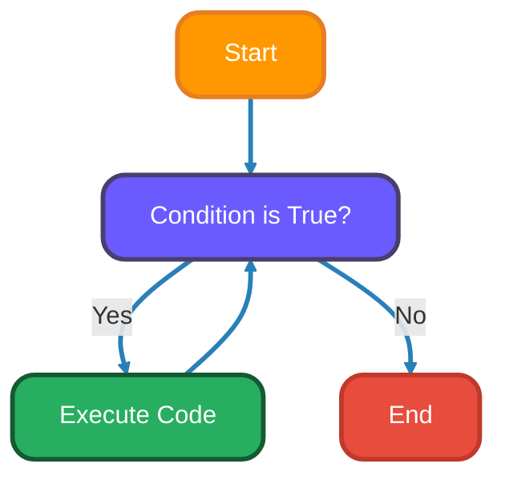
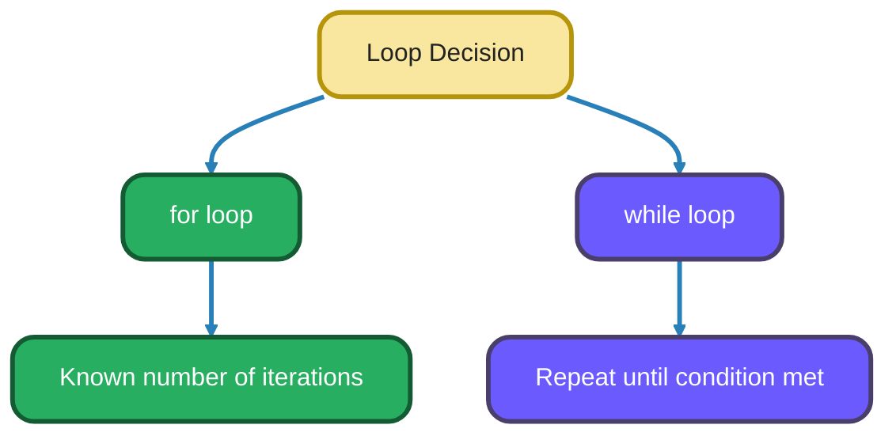
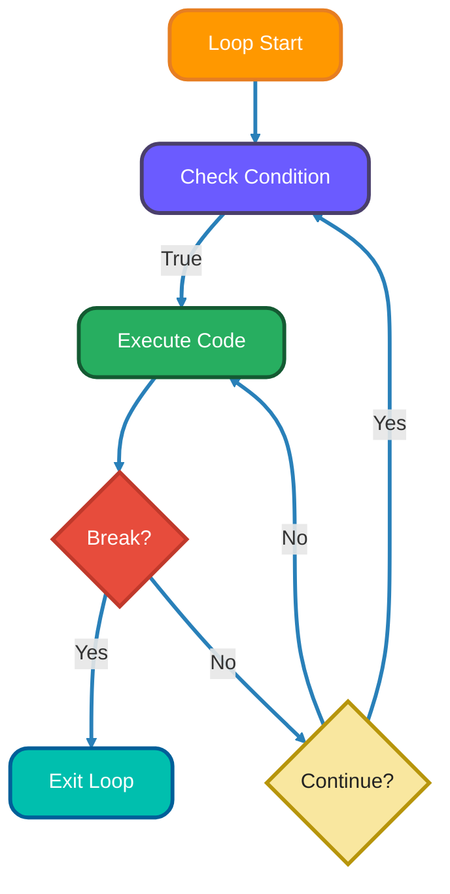
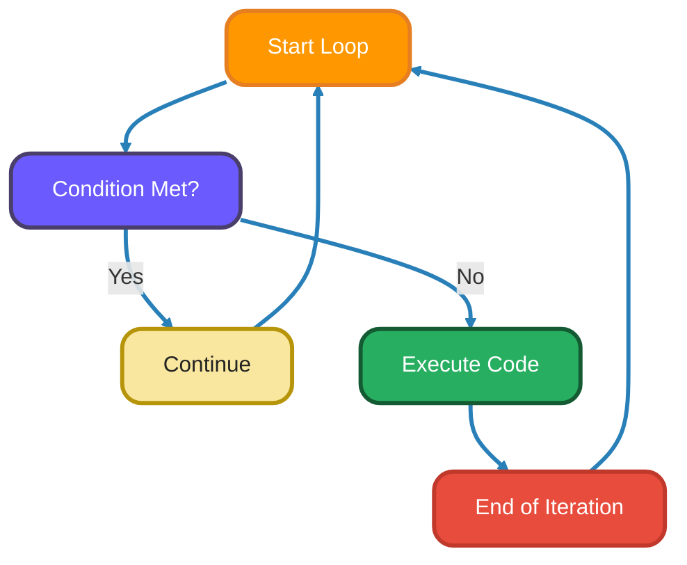
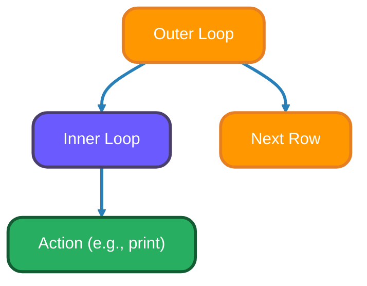

<!--
# Meta Description: Master Python loops! Learn for and while loops, break, continue, and nested iteration for efficient automation and data processing.
# Keywords: Python Loops, For Loop, While Loop, Iteration, Control Flow, Break Statement, Continue Statement, Nested Loops, Python Tutorial
# -->

# <span style="color:#e67e22;">What we will learn in this post?</span>

<ul style='list-style-type: none; padding-left: 0;'>
<li><span style='color: #2980b9; font-size: 20px; font-weight: bold;'>👉</span> <span style='color: #2ecc71; font-size: 18px; font-weight: bold;'>Introduction to Loops</span></li>
<li><span style='color: #2980b9; font-size: 20px; font-weight: bold;'>👉</span> <span style='color: #2ecc71; font-size: 18px; font-weight: bold;'>for Loop</span></li>
<li><span style='color: #2980b9; font-size: 20px; font-weight: bold;'>👉</span> <span style='color: #2ecc71; font-size: 18px; font-weight: bold;'>The range() Function</span></li>
<li><span style='color: #2980b9; font-size: 20px; font-weight: bold;'>👉</span> <span style='color: #2ecc71; font-size: 18px; font-weight: bold;'>while Loop</span></li>
<li><span style='color: #2980b9; font-size: 20px; font-weight: bold;'>👉</span> <span style='color: #2ecc71; font-size: 18px; font-weight: bold;'>break Statement</span></li>
<li><span style='color: #2980b9; font-size: 20px; font-weight: bold;'>👉</span> <span style='color: #2ecc71; font-size: 18px; font-weight: bold;'>continue Statement</span></li>
<li><span style='color: #2980b9; font-size: 20px; font-weight: bold;'>👉</span> <span style='color: #2ecc71; font-size: 18px; font-weight: bold;'>else Clause in Loops</span></li>
<li><span style='color: #2980b9; font-size: 20px; font-weight: bold;'>👉</span> <span style='color: #2ecc71; font-size: 18px; font-weight: bold;'>Nested Loops</span></li>
<li><span style='color: #2980b9; font-size: 20px; font-weight: bold;'>👉</span> <span style='color: #2ecc71; font-size: 18px; font-weight: bold;'>Conclusion!</span></li>
</ul>

# <span style="color:#e67e22">Looping Around: Repeating Actions in Python 🔄</span>

Loops are your coding best friends when you need to do the same thing multiple times! Imagine writing the same line of code 100 times – a loop lets you avoid that headache! They're all about automating repetitive tasks.

## <span style="color:#2980b9">Why Use Loops? 🤷‍♀️</span>

Instead of copy-pasting code, loops let you:

- **Save time:** Automate repeated actions.
- **Make your code shorter:** One loop can replace many lines.
- **Make your code easier to read:** Loops clearly show repetition.

## <span style="color:#2980b9">Python's Loop Toolkit 🧰</span>

Python has two main loop types:

- `for` loops: Best for iterating through _sequences_ (like lists or strings) a certain number of times. Example: `for item in my_list: print(item)`
- `while` loops: Keep going _while_ a condition is true. Example: `while count < 10: print(count); count +=1`



<br>
For more in-depth information you can check out [Python's official documentation on loops](https://docs.python.org/3/tutorial/controlflow.html#for-statements) or [W3Schools tutorial](https://www.w3schools.com/python/python_for_loops.asp)

# <span style="color:#e67e22">Python For Loops: A Friendly Guide</span> 🐍

Let's explore Python's `for` loops! They're super useful for repeating actions with data like lists, strings, and numbers.

## <span style="color:#2980b9">Understanding the `for` Loop</span>

The basic structure is: `for item in sequence:`. It grabs each `item` from the `sequence` one by one and runs the code inside the loop.

### <span style="color:#8e44ad">Iterating over Sequences</span>

- **Lists:**

```python
my_list = ["apple", "banana", "cherry"]
for fruit in my_list:
    print(fruit) # Output: apple, banana, cherry
```

- **Strings:**

```python
my_string = "Hello"
for letter in my_string:
    print(letter) # Output: H, e, l, l, o
```

- **Tuples:**

```python
my_tuple = (1, 2, 3)
for number in my_tuple:
    print(number) # Output: 1, 2, 3
```

- **Ranges:** `range(start, stop, step)` creates a sequence of numbers.

  ```python
  for i in range(5): # From 0 to 4
      print(i) # Output: 0, 1, 2, 3, 4

  for i in range(2,6): # From 2 to 5
      print(i) # Output: 2, 3, 4, 5

  for i in range(0, 10, 2): #From 0 to 8 with a step of 2
      print(i) # Output: 0, 2, 4, 6, 8
  ```

# <span style="color:#e67e22">Understanding `range()` in Python 🐍</span>

The `range()` function is super handy for creating sequences of numbers. Think of it as a shortcut to generate a list of numbers, especially useful when you need to repeat something a certain number of times!

## <span style="color:#2980b9">The Basics of `range()`</span>

The general syntax is: `range(start, stop, step)`

- `start`: (Optional) Where the sequence begins (defaults to 0).
- `stop`: (Required) Where the sequence _stops_ (but _doesn't include_ this number).
- `step`: (Optional) The increment between numbers (defaults to 1).

### <span style="color:#8e44ad">`range()` with `for` loops</span>

`range()` is mostly used within `for` loops, allowing you to iterate a specific number of times.

```python
# Simple loop from 0 to 4
for i in range(5): # stop is 5
    print(i) # Output: 0, 1, 2, 3, 4

# Loop from 1 to 9, increasing by 2
for i in range(1, 10, 2): # start=1, stop=10, step=2
    print(i) # Output: 1, 3, 5, 7, 9

# Loop backwards from 5 to 1
for i in range(5, 0, -1): # start=5, stop=0, step=-1
    print(i) # Output: 5, 4, 3, 2, 1
```

_Remember the `stop` value isn't included_. You can use this to generate indexes for lists and other data structures too!

{% include code-playground.html 
   language="python" 
   code="# For Loops with range() and Sequences

# Example 1: Simple countdown
print(\"Countdown:\")
for i in range(5, 0, -1):
    print(f\"{i}...\")
print(\"Blast off! 🚀\")

print(\"\\n\" + \"=\"*50 + \"\\n\")

# Example 2: Iterating through a list with enumerate
fruits = [\"apple\", \"banana\", \"cherry\", \"date\"]
print(\"Fruits with indices:\")
for index, fruit in enumerate(fruits):
    print(f\"{index}: {fruit}\")

print(\"\\n\" + \"=\"*50 + \"\\n\")

# Example 3: Multiplication table
number = 7
print(f\"Multiplication table for {number}:\")
for i in range(1, 11):
    result = number * i
    print(f\"{number} x {i} = {result}\")

print(\"\\n\" + \"=\"*50 + \"\\n\")

# Example 4: Sum of numbers using range
total = 0
for num in range(1, 101):  # Sum from 1 to 100
    total += num
print(f\"Sum of numbers 1-100: {total}\")

print(\"\\n\" + \"=\"*50 + \"\\n\")

# Example 5: Iterating over dictionary
student_grades = {\"Alice\": 85, \"Bob\": 92, \"Charlie\": 78}
print(\"Student Grades:\")
for name, grade in student_grades.items():
    status = \"Pass\" if grade >= 80 else \"Needs Improvement\"
    print(f\"{name}: {grade} - {status}\")

print(\"\\n\" + \"=\"*50 + \"\\n\")

# Example 6: Creating a list with list comprehension
squares = [x**2 for x in range(1, 11)]
print(\"Squares of 1-10:\")
print(squares)" 
   height="800px" 
   gradient="purple" 
%}

# <span style="color:#e67e22">Let's Loop with While! 🔁</span>

Hey there! Let's dive into the world of `while` loops. They're super useful for repeating tasks until a certain condition changes.

## <span style="color:#2980b9">The While Loop: How it Works 🤔</span>

The `while` loop keeps running as long as its condition is `True`. Here's the basic structure:

```python
while condition:
    # Code to execute while the condition is True
```

Essentially, Python checks the `condition` first. If it's `True`, the code inside the loop runs. Then, it checks the condition again. This continues until the condition becomes `False`.

## <span style="color:#2980b9">When to While vs. For? 🤷‍♀️</span>

- **`for` loop:** Use when you know _exactly_ how many times you want to repeat something (e.g., iterating through a list).

- **`while` loop:** Use when you want to repeat something until a _condition is met_ (e.g., keep asking for input until it's valid).

Here's an example:



## <span style="color:#2980b9">for vs while Loops</span>

| Feature                 | for Loop                         | while Loop                          |
| ----------------------- | -------------------------------- | ----------------------------------- |
| Use Case                | Known number of iterations       | Repeat until condition is met       |
| Syntax                  | for item in sequence:            | while condition:                    |
| Typical Usage           | Iterating lists, ranges, strings | Input validation, waiting for event |
| Condition Location      | Sequence/iterator in header      | Boolean condition in header         |
| Can be Infinite?        | Rare (with custom iterator)      | Common (while True)                 |
| Supports else clause    | Yes                              | Yes                                 |
| Supports break/continue | Yes                              | Yes                                 |
| Readability             | Very clear for fixed iteration   |

    **Summary:** Use `for` loops when you know how many times to repeat. Use `while` loops when you want to keep going until something changes.

```python
count = 0
while count < 5: # Check the condition before each loop
    print(f"Count is: {count}")
    count += 1 # Increment the counter (important!)
#Output:
#Count is: 0
#Count is: 1
#Count is: 2
#Count is: 3
#Count is: 4
```

## <span style="color:#2980b9">Infinite Loops: The Danger Zone! ⚠️</span>

If the condition in a `while` loop _never_ becomes `False`, it'll run forever! This is called an _infinite loop_.

```python
# Example of an infinite loop (avoid this!)
# while True:
#     print("This will print forever!")
```

Always make sure your `while` loop has a way to eventually make the condition `False`.

**Tip:** You can usually stop an infinite loop by pressing `Ctrl + C` in your terminal.

## <span style="color:#2980b9">Real world Example: Keep looping until the User enters correct Input. 🌍</span>

```python
user_input = ""
while user_input.lower() != "exit":
  user_input = input("Enter 'exit' to quit: ")
  print("You entered:", user_input)
#Output
#Enter 'exit' to quit: hello
#You entered: hello
#Enter 'exit' to quit: world
#You entered: world
#Enter 'exit' to quit: exit
#You entered: exit
```

Remember, `while` loops are a powerful tool, but use them wisely! 👍

{% include code-playground.html 
   language="python" 
   code="# While Loops: Counters and Conditional Repetition

# Example 1: Simple counter
count = 1
print(\"Counting to 5:\")
while count <= 5:
    print(f\"Count: {count}\")
    count += 1

print(\"\\n\" + \"=\"*50 + \"\\n\")

# Example 2: Password validator (simulated)
password = \"\"
attempts = 0
max_attempts = 3
correct_password = \"python123\"

print(\"Password Login System (simulated)\")
while attempts < max_attempts and password != correct_password:
    # In real use, you'd use input() here
    # For demo, we'll simulate tries
    if attempts == 0:
        password = \"wrong1\"
    elif attempts == 1:
        password = \"wrong2\"
    else:
        password = \"python123\"
    
    attempts += 1
    
    if password == correct_password:
        print(f\"✓ Login successful! (Attempt {attempts})\")
    else:
        remaining = max_attempts - attempts
        print(f\"✗ Incorrect password. {remaining} attempts remaining.\")

if password != correct_password:
    print(\"Account locked! Too many failed attempts.\")

print(\"\\n\" + \"=\"*50 + \"\\n\")

# Example 3: Number guessing game (simulated)
secret_number = 42
guess = 0
attempts = 0

print(\"Number Guessing Game (simulated)\")
# Simulate guesses: 30, 50, 40, 42
guesses = [30, 50, 40, 42]
guess_index = 0

while guess != secret_number and guess_index < len(guesses):
    guess = guesses[guess_index]
    attempts += 1
    
    if guess < secret_number:
        print(f\"Guess {attempts}: {guess} - Too low!\")
    elif guess > secret_number:
        print(f\"Guess {attempts}: {guess} - Too high!\")
    else:
        print(f\"Guess {attempts}: {guess} - Correct! 🎉\")
    
    guess_index += 1

print(f\"Game over! It took {attempts} attempts.\")

print(\"\\n\" + \"=\"*50 + \"\\n\")

# Example 4: Factorial calculator
n = 5
factorial = 1
i = 1

print(f\"Calculating {n}! (factorial):\")
while i <= n:
    factorial *= i
    print(f\"{i}! = {factorial}\")
    i += 1

print(f\"\\nFinal result: {n}! = {factorial}\")" 
   height="850px" 
   gradient="green" 
%}

# <span style="color:#e67e22">The 'break' Statement: Your Loop Escape Hatch 🚪</span>

The `break` statement is a powerful tool in programming that lets you **exit a loop prematurely**. Think of it as an emergency exit for your loops. Normally, a loop runs until its condition is false. But `break` lets you jump out of the loop _immediately_, regardless of the condition.

## <span style="color:#2980b9">How It Works ⚙️</span>

When the `break` statement is encountered inside a `for` or `while` loop, the loop's execution stops, and the program control transfers to the next statement _after_ the loop.



## <span style="color:#2980b9">When to Use It 🤔</span>

- **Finding Something:** When you are searching for a specific item in a list, and you find it, use `break` to stop searching further.
- **Error Handling:** If an error happens that makes the loop pointless, `break` is a way to gracefully exit.
- **Input Validation:** If a user enters invalid data, use `break` to stop asking for input.

### <span style="color:#8e44ad">Examples 💡</span>

- **Searching a List:**

```python
numbers = [1, 2, 3, 4, 5, 6]
target = 4

for num in numbers:
    if num == target:
        print("Found it!") # Found it!
        break # Exit the loop since we found the target
```

- **User Input Validation:**

```python
while True:
    age = input("Enter your age: ")
    if age.isdigit() and int(age) > 0:
        print("Age accepted!") #Age accepted!
        break # Valid age, exit the loop
    else:
        print("Invalid age. Please enter a positive number.") #Invalid age. Please enter a positive number
```

- **For more info, see the official Python documentation:**
  - [Python `break` Statement](https://docs.python.org/3/tutorial/controlflow.html#break-and-continue-statements-and-else-clauses-on-loops)

# <span style="color:#e67e22">`Continue` Statement Explained 🚀</span>

The `continue` statement in programming is like hitting the "skip" button on a song. It tells the program to **immediately jump to the next iteration** of a loop, bypassing any code that comes after it within the current iteration. Think of it as a shortcut to start the loop fresh!

## <span style="color:#2980b9">How it Works 🤔</span>

Instead of exiting the loop entirely (like `break` does), `continue` only skips the rest of the current round. The loop then resumes with the next value in the sequence.

```python
for i in range(1, 6):
    if i % 2 == 0: # If 'i' is even
        continue  # Skip to the next iteration
    print(i)       # Only odd numbers will be printed
# Output:
# 1
# 3
# 5
```

## <span style="color:#2980b9">Practical Uses 🛠️</span>

- **Filtering Data:** Skipping unwanted items.
- **Error Handling:** Bypassing iterations where errors occur.
- **Optimizing Loops:** Avoiding unnecessary calculations.

### <span style="color:#8e44ad">Example: Skipping Even Numbers</span>

Here's the code again to skip printing even numbers, `continue` is the secret ingredient to avoid printing those numbers that are multiple of 2.

```python
for i in range(1, 6):
    if i % 2 == 0:
        continue # Skip even numbers
    print(i)
# Output:
# 1
# 3
# 5
```

Flowchart explaining the function of 'continue' within a loop



_Further information on `continue` statement_ : [Python `continue` Statement](https://www.tutorialspoint.com/python/python_continue_statement.htm)

{% include code-playground.html 
   language="python" 
   code="# Break and Continue Statements

# Example 1: Using break to find first item
print(\"Finding first number divisible by 7:\")
numbers = [3, 8, 14, 21, 25, 35, 40]
for num in numbers:
    if num % 7 == 0:
        print(f\"Found: {num}\")
        break  # Exit loop once found
    print(f\"Checking {num}...\")

print(\"\\n\" + \"=\"*50 + \"\\n\")

# Example 2: Using continue to skip values
print(\"Print only positive numbers:\")
numbers = [5, -3, 8, -1, 0, 12, -7, 4]
for num in numbers:
    if num <= 0:
        continue  # Skip non-positive numbers
    print(f\"Positive: {num}\")

print(\"\\n\" + \"=\"*50 + \"\\n\")

# Example 3: Break with while loop - ATM withdrawal
balance = 1000
print(\"ATM Withdrawal System:\")
print(f\"Starting balance: ${balance}\")

# Simulate withdrawal attempts
withdrawals = [100, 200, 150, 300, 400]  # Last one exceeds balance

for amount in withdrawals:
    if amount > balance:
        print(f\"\\n✗ Cannot withdraw ${amount}. Insufficient funds!\")
        print(\"Transaction cancelled.\")
        break  # Stop processing withdrawals
    
    balance -= amount
    print(f\"✓ Withdrew ${amount}. Remaining: ${balance}\")

print(f\"\\nFinal balance: ${balance}\")

print(\"\\n\" + \"=\"*50 + \"\\n\")

# Example 4: Continue with filter - skip vowels
word = \"programming\"
print(f\"Original word: {word}\")
print(\"Consonants only:\")
consonants = \"\"
for char in word:
    if char.lower() in \"aeiou\":
        continue  # Skip vowels
    consonants += char
print(consonants)

print(\"\\n\" + \"=\"*50 + \"\\n\")

# Example 5: Combined break and continue
print(\"Process numbers until negative, skip evens:\")
numbers = [1, 3, 5, 8, 11, 13, -5, 17, 19]
for num in numbers:
    if num < 0:
        print(f\"\\nStopped at negative number: {num}\")
        break  # Stop at first negative
    
    if num % 2 == 0:
        continue  # Skip even numbers
    
    print(f\"Processing odd number: {num}\")" 
   height="800px" 
   gradient="pink" 
%}

# <span style="color:#e67e22">Python's Looping 'Else': A Secret Weapon ⚔️</span>

Python has a neat little trick: an `else` clause paired with `for` and `while` loops! But it's not quite like the usual `if-else`.

## <span style="color:#2980b9">The 'Else' Execution Rule 📜</span>

The `else` block executes _only if_ the loop completes _without_ encountering a `break` statement. Think of it as an "all clear" signal after the loop finishes its natural course.

- **Normal Completion:** `else` runs.
- **`break` Encountered:** `else` _doesn't_ run.

## <span style="color:#2980b9">Practical Uses & Examples 💡</span>

This feature shines when you're searching for something within a loop.

```python
# Searching for a prime number
numbers = [4, 6, 8, 9, 10]

for num in numbers:
    if num % 2 != 0:  # Check if number is not divisible by 2
        print(f"{num} is not an even number.")
        break # Exit loop if not an even number is found
else:
    print("All numbers are even.") # Run this if no break occurs

# Output: 9 is not an even number.
```

In this example, the `else` block isn't executed because the `break` statement interrupts the loop.

```python
#Loop with no break
numbers = [2,4,6,8,10]

for num in numbers:
    if num % 2 != 0:
        print (f"{num} is not an even number")
        break
else:
    print("All numbers are even.")
#Output : All numbers are even.
```

Here, the loop completes without a `break`, so the `else` block gets executed.

This `else` with loops can make your code cleaner and more readable! Check out these resources to dive deeper: [Python docs](https://docs.python.org/3/tutorial/controlflow.html#break-and-continue-statements-and-else-clauses-on-loops), [Real Python](https://realpython.com/python-conditional-statements/#the-python-else-clause-with-loops)

# <span style="color:#e67e22">Nested Loops: Loops within Loops 🔄</span>

Nested loops are basically loops inside other loops! Imagine a clock: the second hand goes around completely _for every minute_ the minute hand moves. That's nesting!



## <span style="color:#2980b9">Why Use Nested Loops? 🤔</span>

They're super useful for things like:

- **Matrix Operations:** Working with rows and columns in a table.
- **Pattern Printing:** Creating cool shapes with characters.
- **Iterating Multi-dimensional Arrays:** Accessing each element in a grid-like structure.

## <span style="color:#2980b9">Examples and Patterns 🎨</span>

Here's how to print a simple rectangle using nested loops in Python:

```python
for i in range(5): # Outer loop for rows
    for j in range(10): # Inner loop for columns
        print("*", end="") # Print an asterisk without a newline
    print() # Move to the next line after each row
# Output:
# **********
# **********
# **********
# **********
# **********
```

Here is another simple example of a triangle:

```python
n = 5
for i in range(n):
    for j in range(i+1):
        print("*", end="")
    print()
# Output:
# *
# **
# ***
# ****
# *****
```

## <span style="color:#2980b9">Performance Considerations ⏱️</span>

Be careful! Nested loops can become slow, especially with large datasets. The time complexity can be O(n*m), where n and m are the number of iterations for each loop, this is often represented as*O(n<sup>2</sup>)\*. Try to optimize by:

- Using more efficient algorithms.
- Avoiding unnecessary calculations inside the loops.
- Consider vectorization, using libraries like NumPy if you are using Python.

{% include code-playground.html 
   language="python" 
   code="# Nested Loops: Patterns and Multi-dimensional Data

# Example 1: Multiplication table
print(\"Multiplication Table (1-5):\")
print(\"    \", end=\"\")
for i in range(1, 6):
    print(f\"{i:4}\", end=\"\")
print(\"\\n\" + \"-\" * 28)

for i in range(1, 6):
    print(f\"{i} | \", end=\"\")
    for j in range(1, 6):
        print(f\"{i*j:4}\", end=\"\")
    print()

print(\"\\n\" + \"=\"*50 + \"\\n\")

# Example 2: Right triangle pattern
print(\"Right Triangle Pattern:\")
rows = 5
for i in range(1, rows + 1):
    for j in range(i):
        print(\"*\", end=\" \")
    print()

print(\"\\n\" + \"=\"*50 + \"\\n\")

# Example 3: Inverted triangle
print(\"Inverted Triangle:\")
for i in range(rows, 0, -1):
    for j in range(i):
        print(\"*\", end=\" \")
    print()

print(\"\\n\" + \"=\"*50 + \"\\n\")

# Example 4: Number pyramid
print(\"Number Pyramid:\")
rows = 5
for i in range(1, rows + 1):
    # Print spaces
    for j in range(rows - i):
        print(\" \", end=\" \")
    # Print numbers
    for j in range(1, i + 1):
        print(j, end=\" \")
    print()

print(\"\\n\" + \"=\"*50 + \"\\n\")

# Example 5: Working with 2D list (matrix)
matrix = [
    [1, 2, 3],
    [4, 5, 6],
    [7, 8, 9]
]

print(\"Matrix traversal:\")
for row in matrix:
    for element in row:
        print(f\"{element:3}\", end=\" \")
    print()

# Calculate sum of all elements
total = 0
for row in matrix:
    for element in row:
        total += element
print(f\"\\nSum of all elements: {total}\")

print(\"\\n\" + \"=\"*50 + \"\\n\")

# Example 6: Finding pairs that sum to target
numbers = [2, 4, 6, 8, 10]
target_sum = 12
print(f\"Pairs that sum to {target_sum}:\")

for i in range(len(numbers)):
    for j in range(i + 1, len(numbers)):
        if numbers[i] + numbers[j] == target_sum:
            print(f\"{numbers[i]} + {numbers[j]} = {target_sum}\")" 
   height="850px" 
   gradient="orange" 
%}

---

## <span style="color:#e67e22">🎯 Practice Project Assignment</span>

<details>
<summary><strong>💡 Project: Interactive Student Grade Analyzer</strong> (Click to expand)</summary>
<br>
<p><strong>Your Challenge:</strong></p>
<p>Build a student grade analyzer that uses all loop types (for loops, while loops, nested loops, break, and continue) to process and analyze student performance data.</p>

<p><strong>Requirements:</strong></p>

<p><strong>Part 1: Data Input (while loop)</strong></p>
<ul>
<li>Use a while loop to collect student names and grades</li>
<li>Continue until user enters 'done'</li>
<li>Validate that grades are between 0-100</li>
<li>Use <code>continue</code> to skip invalid entries, <code>break</code> to exit</li>
</ul>

<p><strong>Part 2: Grade Statistics (for loop)</strong></p>
<ul>
<li>Calculate average grade using for loop</li>
<li>Find highest and lowest grades</li>
<li>Count students by grade category (A: 90-100, B: 80-89, C: 70-79, D: 60-69, F: <60)</li>
</ul>

<p><strong>Part 3: Pattern Display (nested loops)</strong></p>
<ul>
<li>Create a visual grade distribution chart using nested loops</li>
<li>Display stars (*) for each student in each grade category</li>
</ul>

<p><strong>Part 4: Individual Analysis (break/continue)</strong></p>
<ul>
<li>Find first student with perfect score (100) - use <code>break</code></li>
<li>Find all students who failed (<60) - use <code>continue</code></li>
<li>Use loop <code>else</code> clause for "not found" scenarios</li>
</ul>

<p><strong>Bonus Challenges:</strong></p>
<ul>
<li>Add a menu system using while True loop</li>
<li>Implement student search by name</li>
<li>Create a grade curve calculator</li>
<li>Add percentage-based statistics</li>
</ul>

<p><strong>Example Output:</strong></p>
<pre>
=== Student Grade Analyzer ===
Added: Alice (95)
Added: Bob (87)

Average Grade: 91.0
Highest: 95 (Alice)
Grade Distribution:
A (90-100): ** (2 students)
No students failed. Great job! 🎉
</pre>

<p><strong>Share Your Solution! 💬</strong></p>
<p>Completed the project? <strong>Post your code in the comments below!</strong> Show us your approach! 🎨</p>

</details>

---

<h1><span style='color:#e67e22'>Conclusion</span></h1>

So, there you have it! I hope you found this helpful. Now it's your turn! What are your thoughts? 🤔 Share your comments, questions, or any brilliant ideas you have in the section below. I'm really eager to hear from you! Let's chat! 💬
