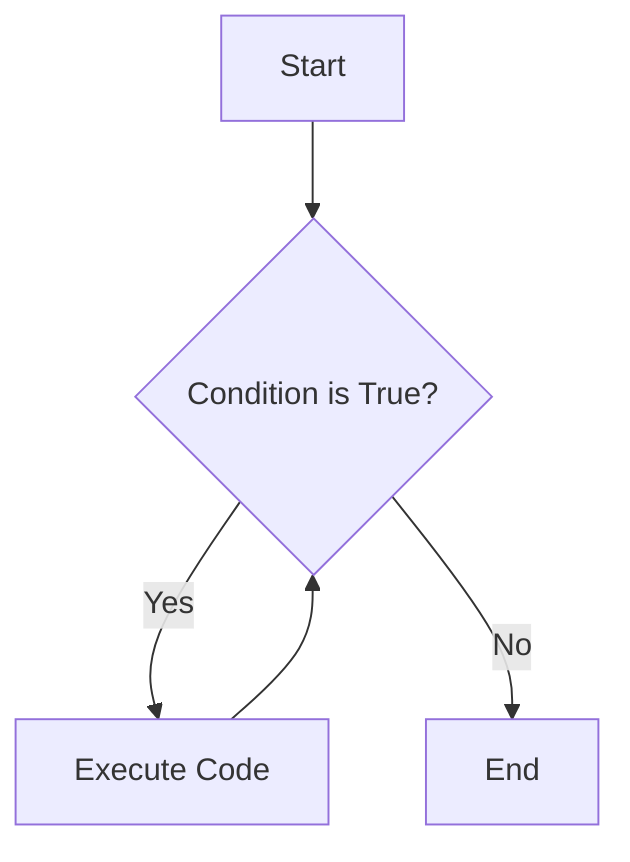
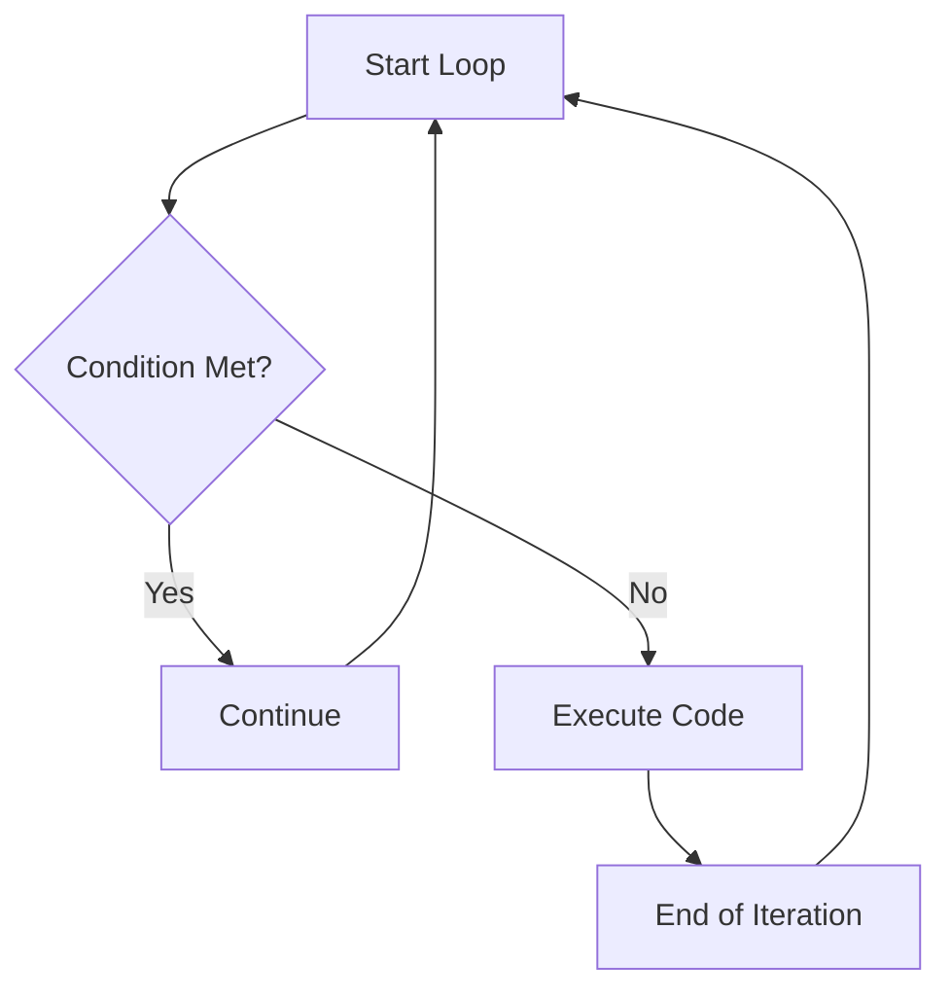

# <span style="color:#e67e22;">What we will learn in this post?</span>
<ul style='list-style-type: none; padding-left: 0;'>
<li><span style='color: #2980b9; font-size: 20px; font-weight: bold;'>👉</span> <span style='color: #2ecc71; font-size: 18px; font-weight: bold;'>Introduction to Loops</span></li>
<li><span style='color: #2980b9; font-size: 20px; font-weight: bold;'>👉</span> <span style='color: #2ecc71; font-size: 18px; font-weight: bold;'>for Loop</span></li>
<li><span style='color: #2980b9; font-size: 20px; font-weight: bold;'>👉</span> <span style='color: #2ecc71; font-size: 18px; font-weight: bold;'>The range() Function</span></li>
<li><span style='color: #2980b9; font-size: 20px; font-weight: bold;'>👉</span> <span style='color: #2ecc71; font-size: 18px; font-weight: bold;'>while Loop</span></li>
<li><span style='color: #2980b9; font-size: 20px; font-weight: bold;'>👉</span> <span style='color: #2ecc71; font-size: 18px; font-weight: bold;'>break Statement</span></li>
<li><span style='color: #2980b9; font-size: 20px; font-weight: bold;'>👉</span> <span style='color: #2ecc71; font-size: 18px; font-weight: bold;'>continue Statement</span></li>
<li><span style='color: #2980b9; font-size: 20px; font-weight: bold;'>👉</span> <span style='color: #2ecc71; font-size: 18px; font-weight: bold;'>else Clause in Loops</span></li>
<li><span style='color: #2980b9; font-size: 20px; font-weight: bold;'>👉</span> <span style='color: #2ecc71; font-size: 18px; font-weight: bold;'>Nested Loops</span></li>
<li><span style='color: #2980b9; font-size: 20px; font-weight: bold;'>👉</span> <span style='color: #2ecc71; font-size: 18px; font-weight: bold;'>Conclusion!</span></li>
</ul>

# <span style="color:#e67e22">Looping Around: Repeating Actions in Python 🔄</span>

Loops are your coding best friends when you need to do the same thing multiple times! Imagine writing the same line of code 100 times – a loop lets you avoid that headache! They're all about automating repetitive tasks.

## <span style="color:#2980b9">Why Use Loops? 🤷‍♀️</span>

Instead of copy-pasting code, loops let you:

*   **Save time:** Automate repeated actions.
*   **Make your code shorter:** One loop can replace many lines.
*   **Make your code easier to read:** Loops clearly show repetition.

## <span style="color:#2980b9">Python's Loop Toolkit 🧰</span>

Python has two main loop types:

*   `for` loops: Best for iterating through *sequences* (like lists or strings) a certain number of times. Example: `for item in my_list: print(item)`
*   `while` loops: Keep going *while* a condition is true. Example: `while count < 10: print(count); count +=1`

<br>
For more in-depth information you can check out [Python's official documentation on loops](https://docs.python.org/3/tutorial/controlflow.html#for-statements) or [W3Schools tutorial](https://www.w3schools.com/python/python_for_loops.asp)


# <span style="color:#e67e22">Python For Loops: A Friendly Guide</span> 🐍

Let's explore Python's `for` loops! They're super useful for repeating actions with data like lists, strings, and numbers.

## <span style="color:#2980b9">Understanding the `for` Loop</span>

The basic structure is: `for item in sequence:`. It grabs each `item` from the `sequence` one by one and runs the code inside the loop.

### <span style="color:#8e44ad">Iterating over Sequences</span>

*   **Lists:**

```python
my_list = ["apple", "banana", "cherry"]
for fruit in my_list:
    print(fruit) # Output: apple, banana, cherry
```

*   **Strings:**

```python
my_string = "Hello"
for letter in my_string:
    print(letter) # Output: H, e, l, l, o
```

*   **Tuples:**

```python
my_tuple = (1, 2, 3)
for number in my_tuple:
    print(number) # Output: 1, 2, 3
```

*   **Ranges:**  `range(start, stop, step)` creates a sequence of numbers.
    ```python
    for i in range(5): # From 0 to 4
        print(i) # Output: 0, 1, 2, 3, 4

    for i in range(2,6): # From 2 to 5
        print(i) # Output: 2, 3, 4, 5

    for i in range(0, 10, 2): #From 0 to 8 with a step of 2
        print(i) # Output: 0, 2, 4, 6, 8
    ```
<br>
**Resource**: For more info on loops check the official documentation [Python For Loop Documentation](https://docs.python.org/3/tutorial/controlflow.html#for-statements)


# <span style="color:#e67e22">Understanding `range()` in Python 🐍</span>

The `range()` function is super handy for creating sequences of numbers. Think of it as a shortcut to generate a list of numbers, especially useful when you need to repeat something a certain number of times!

## <span style="color:#2980b9">The Basics of `range()`</span>

The general syntax is: `range(start, stop, step)`

*   `start`: (Optional) Where the sequence begins (defaults to 0).
*   `stop`: (Required) Where the sequence *stops* (but *doesn't include* this number).
*   `step`: (Optional) The increment between numbers (defaults to 1).

### <span style="color:#8e44ad">`range()` with `for` loops</span>

`range()` is mostly used within `for` loops, allowing you to iterate a specific number of times.

```python
# Simple loop from 0 to 4
for i in range(5): # stop is 5
    print(i) # Output: 0, 1, 2, 3, 4

# Loop from 1 to 9, increasing by 2
for i in range(1, 10, 2): # start=1, stop=10, step=2
    print(i) # Output: 1, 3, 5, 7, 9

# Loop backwards from 5 to 1
for i in range(5, 0, -1): # start=5, stop=0, step=-1
    print(i) # Output: 5, 4, 3, 2, 1
```
*Remember the `stop` value isn't included*. You can use this to generate indexes for lists and other data structures too!

For further exploration check out [Python's official documentation](https://docs.python.org/3/library/functions.html#range).


# <span style="color:#e67e22">Let's Loop with While! 🔁</span>

Hey there! Let's dive into the world of `while` loops. They're super useful for repeating tasks until a certain condition changes.

## <span style="color:#2980b9">The While Loop: How it Works 🤔</span>

The `while` loop keeps running as long as its condition is `True`. Here's the basic structure:

```python
while condition:
    # Code to execute while the condition is True
```

Essentially, Python checks the `condition` first. If it's `True`, the code inside the loop runs. Then, it checks the condition again. This continues until the condition becomes `False`.

## <span style="color:#2980b9">When to While vs. For? 🤷‍♀️</span>

*   **`for` loop:** Use when you know *exactly* how many times you want to repeat something (e.g., iterating through a list).

*   **`while` loop:** Use when you want to repeat something until a *condition is met* (e.g., keep asking for input until it's valid).

Here's an example:

```python
count = 0
while count < 5: # Check the condition before each loop
    print(f"Count is: {count}")
    count += 1 # Increment the counter (important!)
#Output:
#Count is: 0
#Count is: 1
#Count is: 2
#Count is: 3
#Count is: 4
```

## <span style="color:#2980b9">Infinite Loops: The Danger Zone! ⚠️</span>

If the condition in a `while` loop *never* becomes `False`, it'll run forever! This is called an *infinite loop*.

```python
# Example of an infinite loop (avoid this!)
# while True:
#     print("This will print forever!")
```

Always make sure your `while` loop has a way to eventually make the condition `False`.

**Tip:** You can usually stop an infinite loop by pressing `Ctrl + C` in your terminal.

## <span style="color:#2980b9">Real world Example: Keep looping until the User enters correct Input. 🌍</span>

```python
user_input = ""
while user_input.lower() != "exit":
  user_input = input("Enter 'exit' to quit: ")
  print("You entered:", user_input)
#Output
#Enter 'exit' to quit: hello
#You entered: hello
#Enter 'exit' to quit: world
#You entered: world
#Enter 'exit' to quit: exit
#You entered: exit
```

Remember, `while` loops are a powerful tool, but use them wisely! 👍


# <span style="color:#e67e22">The 'break' Statement: Your Loop Escape Hatch 🚪</span>

The `break` statement is a powerful tool in programming that lets you **exit a loop prematurely**. Think of it as an emergency exit for your loops. Normally, a loop runs until its condition is false. But `break` lets you jump out of the loop *immediately*, regardless of the condition.

## <span style="color:#2980b9">How It Works ⚙️</span>

When the `break` statement is encountered inside a `for` or `while` loop, the loop's execution stops, and the program control transfers to the next statement *after* the loop.

## <span style="color:#2980b9">When to Use It 🤔</span>

*   **Finding Something:** When you are searching for a specific item in a list, and you find it, use `break` to stop searching further.
*   **Error Handling:**  If an error happens that makes the loop pointless, `break` is a way to gracefully exit.
*   **Input Validation:**  If a user enters invalid data, use `break` to stop asking for input.

### <span style="color:#8e44ad">Examples 💡</span>

*   **Searching a List:**

```python
numbers = [1, 2, 3, 4, 5, 6]
target = 4

for num in numbers:
    if num == target:
        print("Found it!") # Found it!
        break # Exit the loop since we found the target
```

*   **User Input Validation:**

```python
while True:
    age = input("Enter your age: ")
    if age.isdigit() and int(age) > 0:
        print("Age accepted!") #Age accepted!
        break # Valid age, exit the loop
    else:
        print("Invalid age. Please enter a positive number.") #Invalid age. Please enter a positive number
```
*   **For more info, see the official Python documentation:**
    *   [Python `break` Statement](https://docs.python.org/3/tutorial/controlflow.html#break-and-continue-statements-and-else-clauses-on-loops)


# <span style="color:#e67e22">`Continue` Statement Explained 🚀</span>

The `continue` statement in programming is like hitting the "skip" button on a song. It tells the program to **immediately jump to the next iteration** of a loop, bypassing any code that comes after it within the current iteration. Think of it as a shortcut to start the loop fresh!

## <span style="color:#2980b9">How it Works 🤔</span>

Instead of exiting the loop entirely (like `break` does), `continue` only skips the rest of the current round. The loop then resumes with the next value in the sequence.

```python
for i in range(1, 6):
    if i % 2 == 0: # If 'i' is even
        continue  # Skip to the next iteration
    print(i)       # Only odd numbers will be printed
# Output:
# 1
# 3
# 5
```

## <span style="color:#2980b9">Practical Uses 🛠️</span>

*   **Filtering Data:**  Skipping unwanted items.
*   **Error Handling:** Bypassing iterations where errors occur.
*   **Optimizing Loops:** Avoiding unnecessary calculations.

### <span style="color:#8e44ad">Example: Skipping Even Numbers</span>

Here's the code again to skip printing even numbers, `continue` is the secret ingredient to avoid printing those numbers that are multiple of 2.
```python
for i in range(1, 6):
    if i % 2 == 0:
        continue # Skip even numbers
    print(i)
# Output:
# 1
# 3
# 5
```

Flowchart explaining the function of 'continue' within a loop



*Further information on `continue` statement* : [Python `continue` Statement](https://www.tutorialspoint.com/python/python_continue_statement.htm)


# <span style="color:#e67e22">Python's Looping 'Else': A Secret Weapon ⚔️</span>

Python has a neat little trick: an `else` clause paired with `for` and `while` loops! But it's not quite like the usual `if-else`.

## <span style="color:#2980b9">The 'Else' Execution Rule 📜</span>

The `else` block executes *only if* the loop completes *without* encountering a `break` statement. Think of it as an "all clear" signal after the loop finishes its natural course.

*   **Normal Completion:** `else` runs.
*   **`break` Encountered:** `else` *doesn't* run.

## <span style="color:#2980b9">Practical Uses & Examples 💡</span>

This feature shines when you're searching for something within a loop.

```python
# Searching for a prime number
numbers = [4, 6, 8, 9, 10]

for num in numbers:
    if num % 2 != 0:  # Check if number is not divisible by 2
        print(f"{num} is not an even number.")
        break # Exit loop if not an even number is found
else:
    print("All numbers are even.") # Run this if no break occurs

# Output: 9 is not an even number.
```
In this example, the `else` block isn't executed because the `break` statement interrupts the loop.

```python
#Loop with no break
numbers = [2,4,6,8,10]

for num in numbers:
    if num % 2 != 0:
        print (f"{num} is not an even number")
        break
else:
    print("All numbers are even.")
#Output : All numbers are even.
```
Here, the loop completes without a `break`, so the `else` block gets executed.

This `else` with loops can make your code cleaner and more readable! Check out these resources to dive deeper: [Python docs](https://docs.python.org/3/tutorial/controlflow.html#break-and-continue-statements-and-else-clauses-on-loops), [Real Python](https://realpython.com/python-conditional-statements/#the-python-else-clause-with-loops)


# <span style="color:#e67e22">Nested Loops: Loops within Loops 🔄</span>

Nested loops are basically loops inside other loops! Imagine a clock: the second hand goes around completely *for every minute* the minute hand moves. That's nesting!

## <span style="color:#2980b9">Why Use Nested Loops? 🤔</span>

They're super useful for things like:

*   **Matrix Operations:**  Working with rows and columns in a table.
*   **Pattern Printing:** Creating cool shapes with characters.
*   **Iterating Multi-dimensional Arrays:** Accessing each element in a grid-like structure.

## <span style="color:#2980b9">Examples and Patterns 🎨</span>

Here's how to print a simple rectangle using nested loops in Python:

```python
for i in range(5): # Outer loop for rows
    for j in range(10): # Inner loop for columns
        print("*", end="") # Print an asterisk without a newline
    print() # Move to the next line after each row
# Output:
# **********
# **********
# **********
# **********
# **********
```

Here is another simple example of a triangle:

```python
n = 5
for i in range(n):
    for j in range(i+1):
        print("*", end="")
    print()
# Output:
# *
# **
# ***
# ****
# *****
```

## <span style="color:#2980b9">Performance Considerations ⏱️</span>

Be careful! Nested loops can become slow, especially with large datasets. The time complexity can be O(n*m), where n and m are the number of iterations for each loop, this is often represented as *O(n<sup>2</sup>)*. Try to optimize by:

*   Using more efficient algorithms.
*   Avoiding unnecessary calculations inside the loops.
*   Consider vectorization, using libraries like NumPy if you are using Python.


Okay, here are a few options for your conclusion statement, each with a slightly different flavor:

**Option 1:**

```html
<h1><span style='color:#e67e22'>Conclusion</span></h1>

So, there you have it! I hope you found this helpful. Now it's your turn! What are your thoughts? 🤔 Share your comments, questions, or any brilliant ideas you have in the section below. I'm really eager to hear from you! Let's chat! 💬
```

**Option 2:**

```html
<h1><span style='color:#e67e22'>Conclusion</span></h1>

And that's a wrap! 🎉 Did anything resonate with you? Or do you have a different perspective? Let me know in the comments! Your feedback is super valuable, and I'm always looking to learn and improve. 👇 Don't be shy – share your thoughts!
```

**Option 3:**

```html
<h1><span style='color:#e67e22'>Conclusion</span></h1>

Alright, that's all for now! I'm curious to know what *you* think. 😊 Any tips, experiences, or suggestions you'd like to share? Head down to the comments section and let's start a conversation! 👇 I'm excited to read what you have to say!
```

**Option 4:**

```html
<h1><span style='color:#e67e22'>Conclusion</span></h1>

Well, we've reached the end! I'm super interested in your take on this. 👇 Do you have any questions, stories, or advice to add? Jump into the comments below and let's connect! I can't wait to see your input! 💖
```


