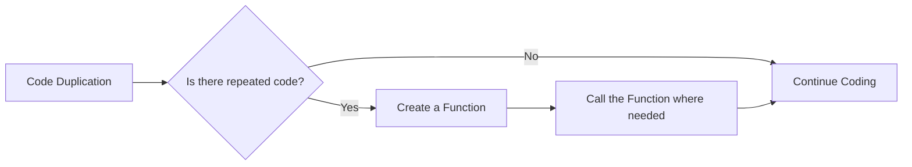
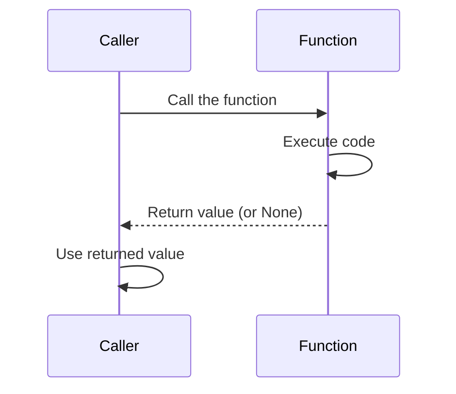

# <span style="color:#e67e22;">What we will learn in this post?</span>
<ul style='list-style-type: none; padding-left: 0;'>
<li><span style='color: #2980b9; font-size: 20px; font-weight: bold;'>👉</span> <span style='color: #2ecc71; font-size: 18px; font-weight: bold;'>Introduction to Functions</span></li>
<li><span style='color: #2980b9; font-size: 20px; font-weight: bold;'>👉</span> <span style='color: #2ecc71; font-size: 18px; font-weight: bold;'>Defining and Calling Functions</span></li>
<li><span style='color: #2980b9; font-size: 20px; font-weight: bold;'>👉</span> <span style='color: #2ecc71; font-size: 18px; font-weight: bold;'>Function Parameters and Arguments</span></li>
<li><span style='color: #2980b9; font-size: 20px; font-weight: bold;'>👉</span> <span style='color: #2ecc71; font-size: 18px; font-weight: bold;'>Return Statement</span></li>
<li><span style='color: #2980b9; font-size: 20px; font-weight: bold;'>👉</span> <span style='color: #2ecc71; font-size: 18px; font-weight: bold;'>Default Parameters</span></li>
<li><span style='color: #2980b9; font-size: 20px; font-weight: bold;'>👉</span> <span style='color: #2ecc71; font-size: 18px; font-weight: bold;'>Keyword Arguments</span></li>
<li><span style='color: #2980b9; font-size: 20px; font-weight: bold;'>👉</span> <span style='color: #2ecc71; font-size: 18px; font-weight: bold;'>Docstrings and Function Documentation</span></li>
<li><span style='color: #2980b9; font-size: 20px; font-weight: bold;'>👉</span> <span style='color: #2ecc71; font-size: 18px; font-weight: bold;'>Conclusion!</span></li>
</ul>

# <span style="color:#e67e22">Functions: Your Code's Building Blocks 🧱</span>

Functions are like mini-programs within your bigger program. They're **reusable blocks of code** that perform a specific task. Think of them as recipes – you can use the same recipe (function) multiple times to make the same dish (result) without rewriting the instructions.

## <span style="color:#2980b9">Why Use Functions? 🤔</span>

*   **Code Reusability:** Write once, use many times! This saves time and effort.
*   **Modularity:** Breaks down a complex program into smaller, manageable parts.
*   **Organization:** Makes your code easier to read, understand, and maintain.

### <span style="color:#8e44ad">The DRY Principle 🌵</span>

Functions help you follow the *DRY* (***Don't Repeat Yourself***) principle. If you find yourself writing the same code multiple times, put it in a function! This makes your code cleaner, easier to update, and less prone to errors.

*   **More Resources:**
    *   [Python Functions Tutorial](https://www.w3schools.com/python/python_functions.asp)
    *   [JavaScript Functions Guide](https://developer.mozilla.org/en-US/docs/Web/JavaScript/Guide/Functions)

Functions are essential for writing efficient and maintainable code! 💪


# <span style="color:#e67e22">Defining and Calling Functions in Python 🐍</span>

Here's a simple guide to understanding functions in Python!

## <span style="color:#2980b9">Defining Functions with `def`</span>

We use the `def` keyword to *define* a function. Function names should be descriptive and use snake_case (lowercase words separated by underscores).

```python
def greet(name):
  """This function greets the person passed in as a parameter."""
  print(f"Hello, {name}!")
```

## <span style="color:#2980b9">Calling Functions</span>

To *use* (or "call") a function, type its name followed by parentheses `()`, and any necessary *arguments* inside.

```python
greet("Alice") # Output: Hello, Alice!
```

## <span style="color:#2980b9">Examples</span>

*   **Simple addition:**

```python
def add_numbers(x, y):
  """Adds two numbers and returns the result."""
  sum = x + y
  return sum

result = add_numbers(5, 3)
print(result) # Output: 8
```

*   **Checking if a number is even:**

```python
def is_even(number):
  """Checks if a number is even and returns True or False."""
  if number % 2 == 0:
    return True
  else:
    return False

print(is_even(4)) # Output: True
print(is_even(7)) # Output: False
```

*   **More resources**:

    *   Python documentation on functions: [https://docs.python.org/3/tutorial/controlflow.html#defining-functions](https://docs.python.org/3/tutorial/controlflow.html#defining-functions)
    *   W3Schools Python functions: [https://www.w3schools.com/python/python_functions.asp](https://www.w3schools.com/python/python_functions.asp)


# <span style="color:#e67e22">Parameters vs. Arguments: A Simple Guide 🚀</span>

Okay, let's demystify *parameters* and *arguments*! Think of a **parameter** as a placeholder in a function's definition, while an **argument** is the actual value you pass when you *call* the function.

## <span style="color:#2980b9">Positional Arguments 📍</span>

Positional arguments are passed based on their order. The first argument you pass goes to the first parameter, and so on.

```python
def greet(name, greeting): # name & greeting are parameters
  print(f"{greeting}, {name}!")

greet("Alice", "Hello") # "Alice" and "Hello" are arguments, passed positionally
# Output: Hello, Alice!
```

## <span style="color:#2980b9">Passing Multiple Arguments ➕</span>

You can pass as many arguments as there are parameters defined in the function. Here are examples:

```python
# Function with one parameter
def square(number):
  return number * number

print(square(5)) # Output: 25

# Function with two parameters
def add(x, y):
  return x + y

print(add(3, 7)) # Output: 10

# Function with three parameters
def describe_person(name, age, city):
  print(f"{name} is {age} years old and lives in {city}.")

describe_person("Bob", 30, "New York") # Output: Bob is 30 years old and lives in New York.
```

*   *Parameters* define what a function expects.
*   *Arguments* are the real data you provide.
*   *Positional arguments* rely on order.

For more in-depth information, see the official Python documentation on [defining functions](https://docs.python.org/3/tutorial/controlflow.html#defining-functions).


# <span style="color:#e67e22">Understanding the `return` Statement in Python ↩️</span>

The `return` statement is Python's way of sending results back from a function. Think of it like this: you ask a function to do something, and `return` is how it gives you the answer.

## <span style="color:#2980b9">Sending Values Back 📦</span>

*   When a function hits a `return` statement, it stops executing and sends the specified value back to where the function was called.

```python
def add_numbers(x, y):
  sum = x + y
  return sum

result = add_numbers(5, 3)
print(result) # Output: 8
```

## <span style="color:#2980b9">Returning Multiple Values Using Tuples 👯</span>

*   You can return multiple values by packing them into a *tuple*.

```python
def get_name_and_age():
  name = "Alice"
  age = 30
  return name, age  # Returns a tuple

person_info = get_name_and_age()
print(person_info) # Output: ('Alice', 30)

name, age = get_name_and_age() #You can also unpack it directly
print(name) #Output: Alice
print(age) #Output: 30
```

## <span style="color:#2980b9">Functions Without `return` (Returning `None`) 👻</span>

*   If a function doesn't have a `return` statement, or if it has `return` without a value, it implicitly returns `None`. This means the function *does* something, but doesn't give back a specific answer.

```python
def greet(name):
  print(f"Hello, {name}!")

result = greet("Bob") #Output: Hello, Bob!
print(result) # Output: None
```

**Resources:**

*   Python `return` statement: [https://www.geeksforgeeks.org/python-return-statement/](https://www.geeksforgeeks.org/python-return-statement/)




# <span style="color:#e67e22">Default Parameter Values in Python ⚙️</span>

👋 Hey there! Let's make function parameters easier to understand.

## <span style="color:#2980b9">What are Default Parameters? 🤔</span>

Default parameters are *values* that are automatically assigned to function parameters if no value is explicitly provided when the function is called.

**Syntax:**

```python
def greet(name="Guest", greeting="Hello"): # Default parameters
  print(f"{greeting}, {name}!")

greet() # Output: Hello, Guest!
greet("Alice") # Output: Hello, Alice!
greet("Bob", "Hi") # Output: Hi, Bob!
```

## <span style="color:#2980b9">When to Use Them? 💡</span>

Use default parameters when you want a parameter to have a common or sensible *default* value, making the function more flexible.

```python
def calculate_tax(price, tax_rate=0.07): # Default tax_rate
  total = price * (1 + tax_rate)
  return total

print(calculate_tax(100)) # Output: 107.0
print(calculate_tax(100, 0.1)) # Output: 110.0
```

## <span style="color:#2980b9">Order Matters! ⚠️</span>

*Non-default* parameters must come *before* default parameters in the function definition. Otherwise, you'll get a `SyntaxError`.

```python
#This is wrong:
#def incorrect_func(default=1, non_default): # SyntaxError: non-default argument follows default argument

#This is correct:
def correct_func(non_default, default=1): # Correct order
  print(non_default, default)

correct_func(5) #output: 5 1
```

Default parameters make your functions more *robust* and user-friendly.


# <span style="color:#e67e22">Keyword Arguments in Python 🔑</span>

Keyword arguments let you pass values to a function by explicitly naming the parameter. This unlocks a superpower: calling functions without rigidly sticking to the order defined in the function's signature!

## <span style="color:#2980b9">What are Keyword Arguments?</span>

Instead of relying solely on position, you specify `parameter_name=value`. It's like writing `name = "Alice"` when calling the function.

```python
def describe_person(name, age, city):
    print(f"Name: {name}, Age: {age}, City: {city}")

# Positional arguments (order matters)
describe_person("Bob", 30, "New York") # Output: Name: Bob, Age: 30, City: New York

# Keyword arguments (order doesn't matter)
describe_person(age=25, city="London", name="Eve") # Output: Name: Eve, Age: 25, City: London
```

## <span style="color:#2980b9">Mixing Positional and Keyword Arguments 🤹</span>

You can mix them, *but* positional arguments *must* come first.

```python
describe_person("Charlie", age=40, city="Paris") # Output: Name: Charlie, Age: 40, City: Paris
# describe_person(age=40, "David", city="Berlin") # This would raise a SyntaxError!
```

Key benefits:

*   ✨ **Readability:** Makes code easier to understand at a glance.
*   🔀 **Flexibility:** No need to remember the exact order of parameters.
*   🧩 **Default Values:**  Great when some parameters have default values (you only need to specify the ones you want to change).

## <span style="color:#2980b9">Resources 📚</span>

*   [Python Documentation - Keyword Arguments](https://docs.python.org/3/tutorial/controlflow.html#keyword-arguments)
*   [Real Python - Python Arguments and Parameters](https://realpython.com/python-kwargs-and-args/)


# <span style="color:#e67e22">Documenting Your Python Code with Docstrings 📝</span>

Docstrings are like little *notes* you write for your functions (or classes/modules). They're enclosed in triple quotes (`"""Docstring goes here"""` or `'''Docstring goes here'''`). They explain what your function does, what it expects as input, and what it returns. The `help()` function reads these docstrings and shows them to you!

## <span style="color:#2980b9">How to Write a Good Docstring</span>

*   **First line:** A concise summary of what the function does.  Keep it short and sweet.

*   **Parameters:** Describe each input parameter, including its type if necessary.
*   **Returns:** Explain what the function returns and its type.
*   **Raises:** Mention any exceptions your function might raise.

```python
def add_numbers(x, y):
    """Add two numbers together.

    Args:
        x: The first number.
        y: The second number.

    Returns:
        The sum of x and y.
    """
    return x + y

help(add_numbers)
# Output:
# Help on function add_numbers in module __main__:
#
# add_numbers(x, y)
#     Add two numbers together.
#
#     Args:
#         x: The first number.
#         y: The second number.
#
#     Returns:
#         The sum of x and y.
```

## <span style="2980b9">Best Practices</span>

*   Follow [PEP 257](https://peps.python.org/pep-0257/). It provides official guidelines.
*   Be clear, concise, and accurate.
*   Use imperative mood ("Do this", "Return that").
*   Keep your docstrings up-to-date with your code.

*Remember: Good documentation is like a friendly signpost, guiding others through your code!*


Okay, here are a few different options for your conclusion statement, formatted as requested:

**Option 1:**

<h1><span style='color:#e67e22'>Conclusion</span></h1>

Well, that's a wrap! 👋 I hope you enjoyed reading this. Now it's your turn! What are your thoughts? Did anything resonate with you? Leave a comment below and let's chat! I'm always looking for new ideas and love hearing from you. ⬇️ Your feedback is super valuable! ✨

**Option 2:**

<h1><span style='color:#e67e22'>Conclusion</span></h1>

So, there you have it! 🎉 I'm really curious to know what *you* think. Do you have any tips or tricks to share? Or maybe a different perspective? 🤔 Drop a comment in the section below! I'm excited to see what you have to say and learn from your experiences. 📚 Let's connect! 😊

**Option 3:**

<h1><span style='color:#e67e22'>Conclusion</span></h1>

And that brings us to the end! 🥳 I hope you found this helpful. Now, I'd love to hear your voice! What are your biggest takeaways? What would you like to see more of? ✍️ Let me know in the comments below – your suggestions are always welcome and help me make this even better! 👍 Thanks for reading! ❤️


