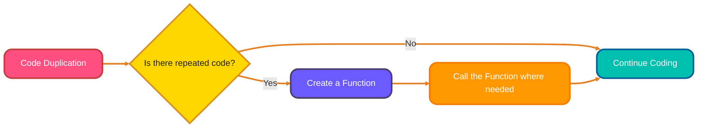
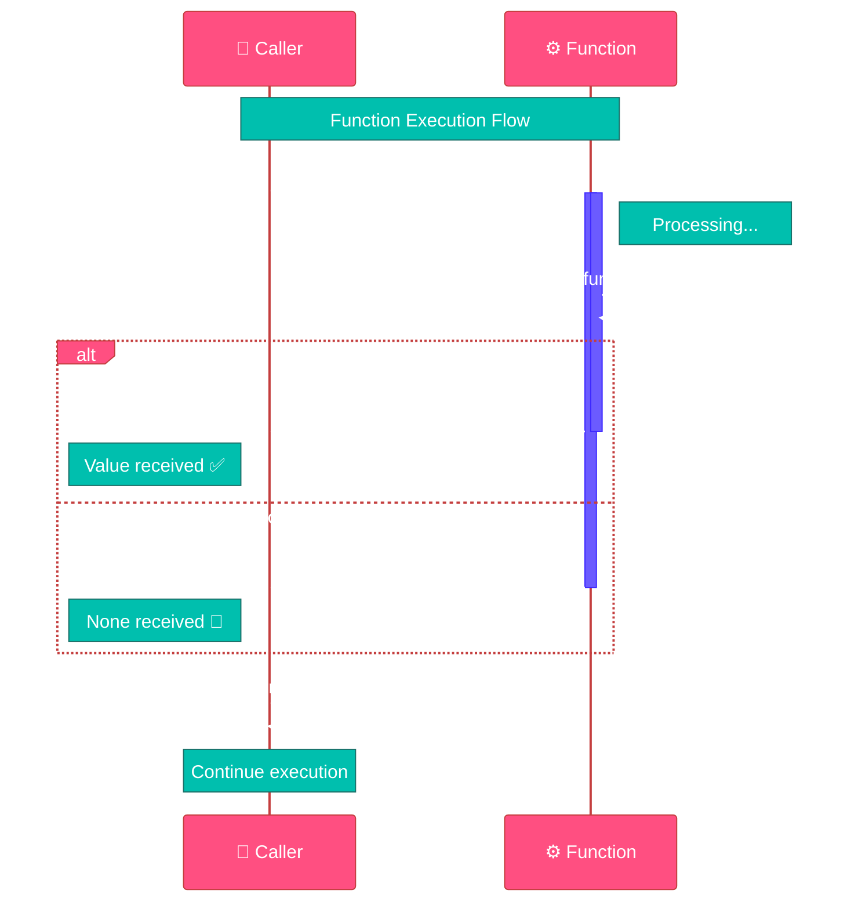

<!--
meta-description: "Learn Python functions from scratch! Master function definition, parameters, arguments, return statements, default values, keyword arguments, and docstrings with practical examples and best practices."
keywords: "Python functions, function definition, function parameters, function arguments, return statement, default parameters, keyword arguments, docstrings, Python code reusability, DRY principle, function documentation, Python programming basics"
-->

# <span style="color:#e67e22;">What we will learn in this post?</span>

<ul style='list-style-type: none; padding-left: 0;'>
<li><span style='color: #2980b9; font-size: 20px; font-weight: bold;'>👉</span> <span style='color: #2ecc71; font-size: 18px; font-weight: bold;'>Introduction to Functions</span></li>
<li><span style='color: #2980b9; font-size: 20px; font-weight: bold;'>👉</span> <span style='color: #2ecc71; font-size: 18px; font-weight: bold;'>Defining and Calling Functions</span></li>
<li><span style='color: #2980b9; font-size: 20px; font-weight: bold;'>👉</span> <span style='color: #2ecc71; font-size: 18px; font-weight: bold;'>Function Parameters and Arguments</span></li>
<li><span style='color: #2980b9; font-size: 20px; font-weight: bold;'>👉</span> <span style='color: #2ecc71; font-size: 18px; font-weight: bold;'>Return Statement</span></li>
<li><span style='color: #2980b9; font-size: 20px; font-weight: bold;'>👉</span> <span style='color: #2ecc71; font-size: 18px; font-weight: bold;'>Default Parameters</span></li>
<li><span style='color: #2980b9; font-size: 20px; font-weight: bold;'>👉</span> <span style='color: #2ecc71; font-size: 18px; font-weight: bold;'>Keyword Arguments</span></li>
<li><span style='color: #2980b9; font-size: 20px; font-weight: bold;'>👉</span> <span style='color: #2ecc71; font-size: 18px; font-weight: bold;'>Docstrings and Function Documentation</span></li>
<li><span style='color: #2980b9; font-size: 20px; font-weight: bold;'>👉</span> <span style='color: #2ecc71; font-size: 18px; font-weight: bold;'>Conclusion!</span></li>
</ul>

# <span style="color:#e67e22">Functions: Your Code's Building Blocks 🧱</span>

Functions are like mini-programs within your bigger program. They're **reusable blocks of code** that perform a specific task. Think of them as recipes – you can use the same recipe (function) multiple times to make the same dish (result) without rewriting the instructions. By mastering functions, you'll write more efficient, maintainable, and professional Python code that scales with your projects.

## <span style="color:#2980b9">Why Use Functions? 🤔</span>

- **Code Reusability:** Write once, use many times! This saves time and effort.
- **Modularity:** Breaks down a complex program into smaller, manageable parts.
- **Organization:** Makes your code easier to read, understand, and maintain.

### <span style="color:#8e44ad">The DRY Principle 🌵</span>

Functions help you follow the _DRY_ (**_Don't Repeat Yourself_**) principle. If you find yourself writing the same code multiple times, put it in a function! This makes your code cleaner, easier to update, and less prone to errors. The DRY principle is a cornerstone of professional software development, reducing bugs and maintenance time significantly.



Functions are essential for writing efficient and maintainable code! 💪

# <span style="color:#e67e22">Defining and Calling Functions in Python 🐍</span>

Here's a simple guide to understanding functions in Python! Defining and calling functions is the foundation of modular programming, allowing you to break complex problems into manageable, testable pieces.

## <span style="color:#2980b9">Defining Functions with `def`</span>

We use the `def` keyword to _define_ a function. Function names should be descriptive and use snake_case (lowercase words separated by underscores). A well-named function acts as self-documenting code, making your intent clear to other developers (and your future self!).

```python
def greet(name):
  """This function greets the person passed in as a parameter."""
  print(f"Hello, {name}!")
```

## <span style="color:#2980b9">Calling Functions</span>

To _use_ (or "call") a function, type its name followed by parentheses `()`, and any necessary _arguments_ inside.

```python
greet("Alice") # Output: Hello, Alice!
```

## <span style="color:#2980b9">Examples</span>

- **Simple addition:**

```python
def add_numbers(x, y):
  """Adds two numbers and returns the result."""
  sum = x + y
  return sum

result = add_numbers(5, 3)
print(result) # Output: 8
```

- **Checking if a number is even:**

```python
def is_even(number):
  """Checks if a number is even and returns True or False."""
  if number % 2 == 0:
    return True
  else:
    return False

print(is_even(4)) # Output: True
print(is_even(7)) # Output: False
```

### <span style="color:#8e44ad">Real-World Example: Temperature Converter 🌡️</span>

Here's a practical function you might use in a weather app or scientific application:

```python
def celsius_to_fahrenheit(celsius):
    """
    Converts temperature from Celsius to Fahrenheit.
    Useful for weather applications and international data processing.
    """
    fahrenheit = (celsius * 9/5) + 32
    return fahrenheit

# Example usage
temp_c = 25
temp_f = celsius_to_fahrenheit(temp_c)
print(f"{temp_c}°C is {temp_f}°F") # Output: 25°C is 77.0°F

# Converting freezing and boiling points
print(f"Freezing point: {celsius_to_fahrenheit(0)}°F")  # Output: 32.0°F
print(f"Boiling point: {celsius_to_fahrenheit(100)}°F") # Output: 212.0°F
```

# <span style="color:#e67e22">Parameters vs. Arguments: A Simple Guide 🚀</span>

Okay, let's demystify _parameters_ and _arguments_! Think of a **parameter** as a placeholder in a function's definition, while an **argument** is the actual value you pass when you _call_ the function. Understanding this distinction helps you communicate more precisely about your code and debug issues faster.

## <span style="color:#2980b9">Positional Arguments 📍</span>

Positional arguments are passed based on their order. The first argument you pass goes to the first parameter, and so on. This is the most common way to pass data to functions and is intuitive for functions with few parameters.

```python
def greet(name, greeting): # name & greeting are parameters
  print(f"{greeting}, {name}!")

greet("Alice", "Hello") # "Alice" and "Hello" are arguments, passed positionally
# Output: Hello, Alice!
```

## <span style="color:#2980b9">Passing Multiple Arguments ➕</span>

You can pass as many arguments as there are parameters defined in the function. Here are examples:

```python
# Function with one parameter
def square(number):
  return number * number

print(square(5)) # Output: 25

# Function with two parameters
def add(x, y):
  return x + y

print(add(3, 7)) # Output: 10

# Function with three parameters
def describe_person(name, age, city):
  print(f"{name} is {age} years old and lives in {city}.")

describe_person("Bob", 30, "New York") # Output: Bob is 30 years old and lives in New York.
```

### <span style="color:#8e44ad">Real-World Example: Order Processing 📦</span>

Here's a practical example from e-commerce applications:

```python
def calculate_order_total(item_price, quantity, tax_rate, shipping_cost):
    """
    Calculate the total cost of an order including tax and shipping.
    Common in e-commerce and point-of-sale systems.
    """
    subtotal = item_price * quantity
    tax = subtotal * tax_rate
    total = subtotal + tax + shipping_cost
    return total

# Example: Ordering 3 books at $15 each
order_total = calculate_order_total(15.00, 3, 0.08, 5.99)
print(f"Order total: ${order_total:.2f}") # Output: Order total: $54.59
```

- _Parameters_ define what a function expects.
- _Arguments_ are the real data you provide.
- _Positional arguments_ rely on order.

# <span style="color:#e67e22">Understanding the `return` Statement in Python ↩️</span>

The `return` statement is Python's way of sending results back from a function. Think of it like this: you ask a function to do something, and `return` is how it gives you the answer. Without `return`, your functions would just perform actions but never communicate results back to your program.

## <span style="color:#2980b9">Sending Values Back 📦</span>

- When a function hits a `return` statement, it stops executing and sends the specified value back to where the function was called. This value can then be stored in a variable, used in calculations, or passed to other functions.

```python
def add_numbers(x, y):
  sum = x + y
  return sum

result = add_numbers(5, 3)
print(result) # Output: 8
```

## <span style="color:#2980b9">Returning Multiple Values Using Tuples 👯</span>

- You can return multiple values by packing them into a _tuple_.

```python
def get_name_and_age():
  name = "Alice"
  age = 30
  return name, age  # Returns a tuple

person_info = get_name_and_age()
print(person_info) # Output: ('Alice', 30)

name, age = get_name_and_age() #You can also unpack it directly
print(name) #Output: Alice
print(age) #Output: 30
```

## <span style="color:#2980b9">Functions Without `return` (Returning `None`) 👻</span>

- If a function doesn't have a `return` statement, or if it has `return` without a value, it implicitly returns `None`. This means the function _does_ something, but doesn't give back a specific answer.

```python
def greet(name):
  print(f"Hello, {name}!")

result = greet("Bob") #Output: Hello, Bob!
print(result) # Output: None
```

### <span style="color:#8e44ad">Real-World Example: User Authentication 🔐</span>

Here's a practical example of returning multiple values for authentication systems:

```python
def validate_login(username, password):
    """
    Validates user credentials and returns status and message.
    Common in web applications and security systems.
    """
    # Simulated database check
    valid_users = {"alice": "pass123", "bob": "secret456"}

    if username in valid_users and valid_users[username] == password:
        return True, "Login successful", username
    elif username in valid_users:
        return False, "Incorrect password", None
    else:
        return False, "User not found", None

# Example usage
success, message, user = validate_login("alice", "pass123")
print(f"Success: {success}, Message: {message}")
# Output: Success: True, Message: Login successful

success, message, user = validate_login("alice", "wrong")
print(f"Success: {success}, Message: {message}")
# Output: Success: False, Message: Incorrect password
```

**Resources:**

- Python `return` statement: [https://www.geeksforgeeks.org/python-return-statement/](https://www.geeksforgeeks.org/python-return-statement/)

```mermaid
graph LR
    CALLER["Function Caller"]:::callerStyle --> CALL["Call Function"]:::callStyle
    CALL --> EXEC["Execute Function Body"]:::execStyle
    EXEC --> RETURN{"return statement?"}:::checkStyle
    RETURN -- "Yes" --> SEND["Send Value Back"]:::returnStyle
    RETURN -- "No" --> NONE["Return None"]:::noneStyle
    SEND --> USE["Use Returned Value"]:::useStyle
    NONE --> USE

    classDef callerStyle fill:#ff4f81,stroke:#c43e3e,color:#fff,font-size:16px,stroke-width:3px,rx:14,shadow:6px;
    classDef callStyle fill:#6b5bff,stroke:#4a3f6b,color:#fff,font-size:16px,stroke-width:3px,rx:14,shadow:6px;
    classDef execStyle fill:#ffd700,stroke:#d99120,color:#222,font-size:16px,stroke-width:3px,rx:14,shadow:6px;
    classDef checkStyle fill:#ff9800,stroke:#f57c00,color:#fff,font-size:16px,stroke-width:3px,rx:14,shadow:6px;
    classDef returnStyle fill:#00bfae,stroke:#005f99,color:#fff,font-size:16px,stroke-width:3px,rx:14,shadow:6px;
    classDef noneStyle fill:#9e9e9e,stroke:#616161,color:#fff,font-size:16px,stroke-width:3px,rx:14,shadow:6px;
    classDef useStyle fill:#43e97b,stroke:#38f9d7,color:#fff,font-size:16px,stroke-width:3px,rx:14,shadow:6px;

    class CALLER callerStyle;
    class CALL callStyle;
    class EXEC execStyle;
    class RETURN checkStyle;
    class SEND returnStyle;
    class NONE noneStyle;
    class USE useStyle;

    linkStyle default stroke:#e67e22,stroke-width:3px;
```



## <span style="color:#2980b9">Sequence diagram 📦</span>



# <span style="color:#e67e22">Default Parameter Values in Python ⚙️</span>

👋 Hey there! Let's make function parameters easier to understand. Default parameters are incredibly useful when building APIs, libraries, or any function that should work well with minimal configuration.

## <span style="color:#2980b9">What are Default Parameters? 🤔</span>

Default parameters are _values_ that are automatically assigned to function parameters if no value is explicitly provided when the function is called. They make your functions more flexible and user-friendly by providing sensible defaults.

**Syntax:**

```python
def greet(name="Guest", greeting="Hello"): # Default parameters
  print(f"{greeting}, {name}!")

greet() # Output: Hello, Guest!
greet("Alice") # Output: Hello, Alice!
greet("Bob", "Hi") # Output: Hi, Bob!
```

## <span style="color:#2980b9">When to Use Them? 💡</span>

Use default parameters when you want a parameter to have a common or sensible _default_ value, making the function more flexible.

```python
def calculate_tax(price, tax_rate=0.07): # Default tax_rate
  total = price * (1 + tax_rate)
  return total

print(calculate_tax(100)) # Output: 107.0
print(calculate_tax(100, 0.1)) # Output: 110.0
```

## <span style="color:#2980b9">Order Matters! ⚠️</span>

_Non-default_ parameters must come _before_ default parameters in the function definition. Otherwise, you'll get a `SyntaxError`.

```python
#This is wrong:
#def incorrect_func(default=1, non_default): # SyntaxError: non-default argument follows default argument

#This is correct:
def correct_func(non_default, default=1): # Correct order
  print(non_default, default)

correct_func(5) #output: 5 1
```

### <span style="color:#8e44ad">Real-World Example: API Request Function 🌐</span>

Here's a practical example common in web development and API interactions:

```python
def make_api_request(endpoint, method="GET", timeout=30, retries=3):
    """
    Makes an HTTP API request with configurable options.
    Default values handle the most common use cases.
    """
    print(f"Making {method} request to {endpoint}")
    print(f"Timeout: {timeout}s, Retries: {retries}")
    # Simulated API call logic here
    return f"Response from {endpoint}"

# Most common case - just specify the endpoint
response1 = make_api_request("/api/users")
# Output: Making GET request to /api/users
#         Timeout: 30s, Retries: 3

# Override specific parameters as needed
response2 = make_api_request("/api/data", method="POST", timeout=60)
# Output: Making POST request to /api/data
#         Timeout: 60s, Retries: 3

# Full customization when necessary
response3 = make_api_request("/api/upload", "PUT", 120, 5)
# Output: Making PUT request to /api/upload
#         Timeout: 120s, Retries: 5
```

Default parameters make your functions more _robust_ and user-friendly.

# <span style="color:#e67e22">Keyword Arguments in Python 🔑</span>

Keyword arguments let you pass values to a function by explicitly naming the parameter. This unlocks a superpower: calling functions without rigidly sticking to the order defined in the function's signature! This feature becomes essential when working with functions that have many parameters or when building self-documenting code.

## <span style="color:#2980b9">What are Keyword Arguments?</span>

Instead of relying solely on position, you specify `parameter_name=value`. It's like writing `name = "Alice"` when calling the function. This makes function calls more readable and maintainable, especially in team environments.

```python
def describe_person(name, age, city):
    print(f"Name: {name}, Age: {age}, City: {city}")

# Positional arguments (order matters)
describe_person("Bob", 30, "New York") # Output: Name: Bob, Age: 30, City: New York

# Keyword arguments (order doesn't matter)
describe_person(age=25, city="London", name="Eve") # Output: Name: Eve, Age: 25, City: London
```

## <span style="color:#2980b9">Mixing Positional and Keyword Arguments 🤹</span>

You can mix them, _but_ positional arguments _must_ come first.

```python
describe_person("Charlie", age=40, city="Paris") # Output: Name: Charlie, Age: 40, City: Paris
# describe_person(age=40, "David", city="Berlin") # This would raise a SyntaxError!
```

### <span style="color:#8e44ad">Real-World Example: Email Configuration 📧</span>

Here's a practical example from email and notification systems:

```python
def send_email(to, subject, body, cc=None, bcc=None, priority="normal",
               attach_files=False, html=False):
    """
    Send an email with various configuration options.
    Keyword arguments make it clear what each parameter does.
    """
    print(f"To: {to}")
    print(f"Subject: {subject}")
    print(f"Priority: {priority}")
    print(f"HTML Format: {html}")
    if cc:
        print(f"CC: {cc}")
    if attach_files:
        print("Attachments included")

# Simple email - only required parameters
send_email(
    to="user@example.com",
    subject="Welcome!",
    body="Thank you for signing up"
)

# Complex email with many options - keyword arguments make it clear
send_email(
    to="manager@company.com",
    subject="Q4 Report",
    body="Please find the attached report",
    cc="team@company.com",
    priority="high",
    attach_files=True,
    html=True
)

# Order doesn't matter with keyword arguments!
send_email(
    body="Meeting reminder",
    subject="Team Meeting Tomorrow",
    to="team@company.com",
    priority="normal"
)
```

Key benefits:

- ✨ **Readability:** Makes code easier to understand at a glance.
- 🔀 **Flexibility:** No need to remember the exact order of parameters.
- 🧩 **Default Values:** Great when some parameters have default values (you only need to specify the ones you want to change).

# <span style="color:#e67e22">Documenting Your Python Code with Docstrings 📝</span>

Docstrings are like little _notes_ you write for your functions (or classes/modules). They're enclosed in triple quotes (`"""Docstring goes here"""` or `'''Docstring goes here'''`). They explain what your function does, what it expects as input, and what it returns. The `help()` function reads these docstrings and shows them to you! Well-written docstrings are essential for professional code, enabling auto-generated documentation and helping team members understand your code quickly.

## <span style="color:#2980b9">How to Write a Good Docstring</span>

- **First line:** A concise summary of what the function does. Keep it short and sweet. This should be a complete sentence that describes the action performed.

- **Parameters:** Describe each input parameter, including its type if necessary. This helps users understand what data to provide.
- **Returns:** Explain what the function returns and its type. Clear return documentation prevents confusion and errors.
- **Raises:** Mention any exceptions your function might raise. This helps users handle errors gracefully.

```python
def add_numbers(x, y):
    """Add two numbers together.

    Args:
        x: The first number.
        y: The second number.

    Returns:
        The sum of x and y.
    """
    return x + y

help(add_numbers)
# Output:
# Help on function add_numbers in module __main__:
#
# add_numbers(x, y)
#     Add two numbers together.
#
#     Args:
#         x: The first number.
#         y: The second number.
#
#     Returns:
#         The sum of x and y.
```

### <span style="color:#8e44ad">Real-World Example: Data Processing Function 📊</span>

Here's a professional docstring example for a data processing function:

```python
def process_customer_data(data, normalize=True, remove_duplicates=True):
    """
    Process and clean customer data from various sources.

    This function performs standard data cleaning operations including
    normalization, duplicate removal, and validation. Commonly used in
    ETL pipelines and data analysis workflows.

    Args:
        data (list of dict): Raw customer data where each dict contains
            customer information with keys like 'name', 'email', 'phone'.
        normalize (bool, optional): Whether to normalize text fields
            (lowercase, trim whitespace). Defaults to True.
        remove_duplicates (bool, optional): Whether to remove duplicate
            entries based on email. Defaults to True.

    Returns:
        list of dict: Cleaned and processed customer data with the same
            structure as input but with applied transformations.

    Raises:
        ValueError: If data is empty or not in expected format.
        TypeError: If data is not a list of dictionaries.

    Example:
        >>> customers = [
        ...     {'name': 'John Doe', 'email': 'john@example.com'},
        ...     {'name': 'Jane Smith', 'email': 'jane@example.com'}
        ... ]
        >>> cleaned = process_customer_data(customers)
        >>> print(cleaned[0]['name'])
        'john doe'

    Note:
        This function modifies the input data structure. Pass a copy
        if you need to preserve the original data.
    """
    if not isinstance(data, list):
        raise TypeError("Data must be a list of dictionaries")
    if not data:
        raise ValueError("Data cannot be empty")

    processed = []
    seen_emails = set()

    for customer in data:
        # Skip duplicates if enabled
        if remove_duplicates and customer.get('email') in seen_emails:
            continue

        # Normalize if enabled
        if normalize:
            customer['name'] = customer['name'].lower().strip()
            customer['email'] = customer['email'].lower().strip()

        processed.append(customer)
        seen_emails.add(customer.get('email'))

    return processed

# Using help() to see the documentation
help(process_customer_data)
```

## <span style="2980b9">Best Practices</span>

- Follow [PEP 257](https://peps.python.org/pep-0257/). It provides official guidelines.
- Be clear, concise, and accurate.
- Use imperative mood ("Do this", "Return that").
- Keep your docstrings up-to-date with your code.

_Remember: Good documentation is like a friendly signpost, guiding others through your code!_

<h1><span style='color:#e67e22'>Conclusion</span></h1>

So, there you have it! 🎉 I'm really curious to know what _you_ think. Do you have any tips or tricks to share? Or maybe a different perspective? 🤔 Drop a comment in the section below! I'm excited to see what you have to say and learn from your experiences. 📚 Let's connect! 😊
