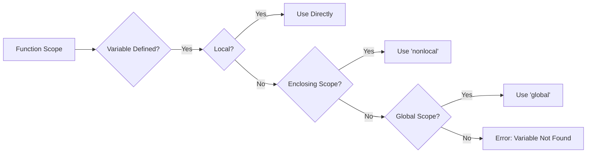

# <span style="color:#e67e22;">What we will learn in this post?</span>
<ul style='list-style-type: none; padding-left: 0;'>
<li><span style='color: #2980b9; font-size: 20px; font-weight: bold;'>👉</span> <span style='color: #2ecc71; font-size: 18px; font-weight: bold;'>*args - Variable Length Arguments</span></li>
<li><span style='color: #2980b9; font-size: 20px; font-weight: bold;'>👉</span> <span style='color: #2ecc71; font-size: 18px; font-weight: bold;'>**kwargs - Keyword Variable Length Arguments</span></li>
<li><span style='color: #2980b9; font-size: 20px; font-weight: bold;'>👉</span> <span style='color: #2ecc71; font-size: 18px; font-weight: bold;'>Lambda Functions</span></li>
<li><span style='color: #2980b9; font-size: 20px; font-weight: bold;'>👉</span> <span style='color: #2ecc71; font-size: 18px; font-weight: bold;'>Scope and LEGB Rule</span></li>
<li><span style='color: #2980b9; font-size: 20px; font-weight: bold;'>👉</span> <span style='color: #2ecc71; font-size: 18px; font-weight: bold;'>global and nonlocal Keywords</span></li>
<li><span style='color: #2980b9; font-size: 20px; font-weight: bold;'>👉</span> <span style='color: #2ecc71; font-size: 18px; font-weight: bold;'>Recursive Functions</span></li>
<li><span style='color: #2980b9; font-size: 20px; font-weight: bold;'>👉</span> <span style='color: #2ecc71; font-size: 18px; font-weight: bold;'>Higher-Order Functions</span></li>
<li><span style='color: #2980b9; font-size: 20px; font-weight: bold;'>👉</span> <span style='color: #2ecc71; font-size: 18px; font-weight: bold;'>Conclusion!</span></li>
</ul>

# <span style="color:#e67e22">Unpacking Positional Arguments with *args 🧙‍♂️</span>

Let's demystify `*args`! It's a special syntax in Python that lets you pass a *variable number* of **positional arguments** to a function. 🚀

## <span style="color:#2980b9">How *args Works ⚙️</span>

*   `*args` collects all the extra positional arguments you pass into a **tuple**. Think of it as a container!
*   Inside the function, you can iterate through this tuple.

## <span style="color:#2980b9">Practical Use Cases 🎯</span>

### <span style="color:#8e44ad">Summing Numbers ➕</span>

```python
def my_sum(*numbers):
  """Calculates the sum of any number of numbers."""
  total = 0
  for number in numbers:
    total += number
  return total

print(my_sum(1, 2, 3))   # Output: 6
print(my_sum(1, 2, 3, 4, 5)) # Output: 15
print(my_sum()) # Output: 0
```
### <span style="color:#8e44ad">String Concatenation 🔗</span>
```python
def string_concat(*words):
    result = ""
    for word in words:
        result += word
    return result

print(string_concat("Hello", " ", "World", "!")) # Output: Hello World!
```
### <span style="color:#8e44ad">Building flexible APIs 🛠️</span>

Functions can accept a base set of parameters while allowing optional additions.

*Resources:*
*[Python *args and **kwargs: Demystified](https://realpython.com/python-kwargs-and-args/)*
*[Python Tutorial: *args and **kwargs](https://www.geeksforgeeks.org/args-kwargs-in-python/)*


# <span style="color:#e67e22">Understanding **kwargs in Python 🚀</span>

`**kwargs` is like a magic keyword in Python! It lets you pass a *variable* number of keyword arguments (arguments with names, like `name="Alice"`) into a function. Think of it as a container for extra, optional settings.

## <span style="color:#2980b9">How It Works (The Dictionary Connection 📚)</span>

When you use `**kwargs` in a function definition, Python collects all the keyword arguments that aren't specifically defined and bundles them into a dictionary. The keyword (the name of the argument) becomes the *key* in the dictionary, and the value you pass becomes the *value*.

```python
def my_function(**kwargs):
  print(kwargs)

my_function(name="Bob", age=30, city="New York") # Output: {'name': 'Bob', 'age': 30, 'city': 'New York'}
```

## <span style="color:#2980b9">When to Use It? (Configuration Example ⚙️)</span>

`**kwargs` is super useful for:

*   **Configuration functions:** Imagine a function that sets up a program. You might have default settings, but you want users to be able to override them.

```python
def configure_settings(**kwargs):
  default_settings = {"theme": "light", "font_size": 12}
  settings = {**default_settings, **kwargs} #merging default with kwargs
  print(f"Current Settings: {settings}")

configure_settings(theme="dark", font_size=14) #Output: Current Settings: {'theme': 'dark', 'font_size': 14}
configure_settings() #Output: Current Settings: {'theme': 'light', 'font_size': 12}
```

It provides flexibility, allowing users to change only the settings they care about, without needing to specify *all* possible options.

*   Passing arguments to other functions seamlessly.

**Resources:**

*   [Python documentation on *args and **kwargs](https://www.geeksforgeeks.org/args-kwargs-in-python/)


# <span style="color:#e67e22">Lambda Functions: Your Quick Code Helper ⚡</span>

Lambda functions, also called anonymous functions, are like mini-functions in Python. They're designed for simple tasks where you don't need a full-blown function definition.

## <span style="color:#2980b9">What are Lambda Functions?</span>

Think of them as one-line wonders!

*   **Syntax:** `lambda arguments: expression`
*   **Use:** For short, simple operations you want to perform *on-the-fly*.
*   **Limitation:** They can only contain a single expression (no complex logic).

## <span style="color:#2980b9">Lambda in Action ✨</span>

Here are some examples using `map()`, `filter()`, and `sorted()`:

*   **`map()`:** Apply a function to each item in a list.

    ```python
    numbers = [1, 2, 3, 4, 5]
    squared = list(map(lambda x: x**2, numbers))
    print(squared) # Output: [1, 4, 9, 16, 25]
    ```

*   **`filter()`:** Select items from a list based on a condition.

    ```python
    numbers = [1, 2, 3, 4, 5, 6]
    even_numbers = list(filter(lambda x: x % 2 == 0, numbers))
    print(even_numbers) # Output: [2, 4, 6]
    ```

*   **`sorted()`:** Sort a list using a custom sorting key.

    ```python
    words = ["apple", "banana", "kiwi"]
    sorted_words = sorted(words, key=lambda x: len(x))
    print(sorted_words) # Output: ['kiwi', 'apple', 'banana']
    ```

Use lambda functions to keep your code clean and readable, especially when dealing with simple, repetitive operations!

More info: [Python Lambda Functions](https://www.w3schools.com/python/python_lambda.asp)


# <span style="color:#e67e22">Variable Scope in Python: LEGB Explained 🕵️‍♀️</span>

Let's unravel the mystery of variable scope in Python! Variable scope determines where you can *access* a variable in your code. Python uses the **LEGB rule** to figure out which variable you're referring to. Think of it like a search order!

## <span style="color:#2980b9">The LEGB Rule: Your Variable Detective Kit 🔍</span>

LEGB stands for:

*   **L**ocal: Inside a function.
*   **E**nclosing function locals: Inside any enclosing functions.
*   **G**lobal: At the top level of your script or module.
*   **B**uilt-in: Predefined names in Python (like `print`, `len`).

Python searches for a variable in this order. If it finds a match, it stops!

## <span style="color:#8e44ad">Example Time! 💡</span>

```python
global_var = 10  # Global variable

def outer_function():
    enclosing_var = 20 # Enclosing variable
    def inner_function():
        local_var = 30  # Local variable
        print(local_var, enclosing_var, global_var) # Accessing variables
    inner_function()

outer_function() # Output: 30 20 10
print(global_var)  # Output: 10
#print(local_var) # This would cause an error! local_var is not defined globally
```

*   `global_var` is accessible everywhere.
*   `enclosing_var` is accessible within `outer_function` and its inner functions.
*   `local_var` is only accessible within `inner_function`. Trying to access `local_var` outside `inner_function` would result in a `NameError`.

**In a nutshell:** Python looks for variables *locally* first, then in *enclosing* scopes, then *globally*, and finally in the *built-in* namespace. If it doesn't find the variable anywhere, you'll get a `NameError`.

> **Resource:** You can find more information on this topic at [Python documentation](https://docs.python.org/3/tutorial/classes.html#scopes-and-namespaces)


# <span style="color:#e67e22">Global and Nonlocal Keywords in Python</span> 🌍

Let's explore how to tweak variables outside of their normal scope! These keywords help us modify variables in the *global* scope and in enclosing function scopes.

## <span style="color:#2980b9">Understanding `global`</span>

The `global` keyword lets you modify a variable that exists outside the current function. Think of it as saying, "Hey Python, I want to work with the global version of this variable!"

```python
global_var = 10

def modify_global():
    global global_var  # Declare that we are using the global variable
    global_var = 20

modify_global()
print(global_var) # Output: 20
```

When to use: If you **absolutely need** to change a global variable's value from within a function.  It's generally better to avoid excessive use of `global` as it can make code harder to understand and debug. Prefer returning values from functions instead.

## <span style="color:#2980b9">Understanding `nonlocal`</span> 🏘️

The `nonlocal` keyword is for nested functions. It lets you modify a variable in the *nearest enclosing scope*, which is neither the local scope nor the global scope.

```python
def outer_function():
    outer_var = 10

    def inner_function():
        nonlocal outer_var # Modify outer_var from the outer function
        outer_var = 20
        print("Inner:", outer_var)  # Output: Inner: 20

    inner_function()
    print("Outer:", outer_var)  # Output: Outer: 20

outer_function()
```

When to use: When you want to modify a variable in an enclosing function's scope from within a nested function. Similar to `global`, overuse can make code harder to follow.

### <span style="color:#8e44ad">Potential Pitfalls</span>

*   **Readability:** Overusing `global` and `nonlocal` can make your code hard to read and understand.
*   **Debugging:**  Changes to variables become harder to trace when their scope is not clearly defined.
*   **Side Effects:** Modifying global/nonlocal variables can lead to unexpected side effects in other parts of your code.



*Resources:*[Python `global` Keyword](https://www.w3schools.com/python/ref_keyword_global.asp), [Python `nonlocal` Keyword](https://www.programiz.com/python-programming/nonlocal-keyword)


# <span style="color:#e67e22">Recursion Explained 🔄</span>

Recursion is a programming technique where a function calls *itself* to solve a problem. Think of it like Russian nesting dolls 🧸 - each doll contains a smaller version of itself!

## <span style="color:#2980b9">How it Works: Calling Itself! 📞</span>

A recursive function has two key parts:

*   **Base Case:** The condition where the function *stops* calling itself. This is essential to prevent an infinite loop (like those dolls that never end!).
*   **Recursive Case:** The function calls *itself* with a slightly smaller version of the original problem, moving closer to the base case.

### <span style="color:#8e44ad">Examples</span>

*   **Factorial:** Calculating `n! (n * (n-1) * ... * 1)`

    ```python
    def factorial(n):
        if n == 0:  # Base Case: Factorial of 0 is 1
            return 1
        else:        # Recursive Case: Call factorial with n-1
            return n * factorial(n-1)

    print(factorial(5)) # Output: 120
    ```

*   **Fibonacci Sequence:** Generating the sequence `0, 1, 1, 2, 3, 5, 8, ...`

    ```python
    def fibonacci(n):
        if n <= 1:  # Base Case: Fibonacci of 0 or 1
            return n
        else:        # Recursive Case: Sum of previous two Fibonacci numbers
            return fibonacci(n-1) + fibonacci(n-2)

    print(fibonacci(6)) # Output: 8
    ```

## <span style="color:#2980b9">Recursion vs. Iteration 🤔</span>

Recursion can be elegant and easier to read for certain problems. However, it can sometimes be less efficient than iteration (using loops) due to the overhead of function calls. Choose recursion when it simplifies the code and makes it more understandable, but be mindful of performance implications.

*Resources:*\
[GeeksForGeeks](https://www.geeksforgeeks.org/recursion/)\
[FreeCodeCamp](https://www.freecodecamp.org/news/recursion-in-javascript/)


# <span style="color:#e67e22">Higher-Order Functions: Functions that Play with Functions 🧑‍💻</span>

Higher-order functions are functions that either:

*   Accept other functions as *arguments*.
*   Return other functions as their *result*.

Think of it like functions calling other functions to perform operations or return a function object.

## <span style="color:#2980b9">The Dynamic Trio: `map()`, `filter()`, `reduce()` ⚙️</span>

Python offers some built-in higher-order functions. Let's explore three common ones: `map()`, `filter()`, and `reduce()` (from the `functools` module).

*   `map()`: Applies a function to each item in an iterable (like a list) and returns a new iterator with the results.
*   `filter()`: Creates a new iterator with items from an iterable for which a function returns `True`.
*   `reduce()`: Applies a function cumulatively to the items of an iterable, reducing it to a single value (needs importing from `functools`).

```python
from functools import reduce

numbers = [1, 2, 3, 4, 5]

# Using map() to square each number
squared_numbers = list(map(lambda x: x**2, numbers))
print(squared_numbers) # Output: [1, 4, 9, 16, 25]

# Using filter() to get even numbers
even_numbers = list(filter(lambda x: x % 2 == 0, numbers))
print(even_numbers) # Output: [2, 4]

# Using reduce() to find the product of all numbers
product = reduce(lambda x, y: x * y, numbers)
print(product) # Output: 120
```

## <span style="color:#2980b9">Practical Use Cases 🚀</span>

Imagine processing a list of usernames to capitalize them, selecting valid emails from a database or calculating the total value of items in a shopping cart. Higher-order functions let you perform these actions *concisely* and *elegantly*.

```python
names = ["alice", "bob", "charlie"]
capitalized_names = list(map(lambda name: name.capitalize(), names))
print(capitalized_names) # Output: ['Alice', 'Bob', 'Charlie']
```

[More information on Higher-Order Functions](https://realpython.com/python-higher-order-functions/)


Okay, here are a few options for conclusion statements, formatted as requested:

**Option 1:**

<h1><span style='color:#e67e22'>Conclusion</span></h1>

So, what do you think? 🤔 Did you find this helpful? We'd love to hear your thoughts, suggestions, or even your own experiences! Jump into the comments below and let's chat! 👇 Your feedback helps us make things even better! 😊

**Option 2:**

<h1><span style='color:#e67e22'>Conclusion</span></h1>

That's a wrap! 🎉 Hope you enjoyed reading. Now it's your turn! Share your comments, feedback, or any brilliant ideas you have in the section below! 👇 We're all ears and excited to see what you come up with. Thanks for reading! 👍

**Option 3:**

<h1><span style='color:#e67e22'>Conclusion</span></h1>

Alright, we've reached the end! 🥳 What are your takeaways? Do you agree? Disagree? Got any questions? Head down to the comments section and let us know! 👇 We value your input and can't wait to read your thoughts! 😊 Thanks a bunch! 🙏


