<!--
meta-description: "Master advanced Python function concepts including *args and **kwargs for variable arguments, lambda functions for concise code, scope and LEGB rule, global and nonlocal keywords, recursion, and higher-order functions like map, filter, and reduce. Learn production-ready patterns with real-world examples."
keywords: "Python functions, *args, **kwargs, lambda functions, variable scope, LEGB rule, global keyword, nonlocal keyword, recursion, higher-order functions, map filter reduce, Python advanced concepts, function arguments, anonymous functions, nested functions"
-->

# <span style="color:#e67e22;">What we will learn in this post?</span>
<ul style='list-style-type: none; padding-left: 0;'>
<li><span style='color: #2980b9; font-size: 20px; font-weight: bold;'>👉</span> <span style='color: #2ecc71; font-size: 18px; font-weight: bold;'>*args - Variable Length Arguments</span></li>
<li><span style='color: #2980b9; font-size: 20px; font-weight: bold;'>👉</span> <span style='color: #2ecc71; font-size: 18px; font-weight: bold;'>**kwargs - Keyword Variable Length Arguments</span></li>
<li><span style='color: #2980b9; font-size: 20px; font-weight: bold;'>👉</span> <span style='color: #2ecc71; font-size: 18px; font-weight: bold;'>Lambda Functions</span></li>
<li><span style='color: #2980b9; font-size: 20px; font-weight: bold;'>👉</span> <span style='color: #2ecc71; font-size: 18px; font-weight: bold;'>Scope and LEGB Rule</span></li>
<li><span style='color: #2980b9; font-size: 20px; font-weight: bold;'>👉</span> <span style='color: #2ecc71; font-size: 18px; font-weight: bold;'>global and nonlocal Keywords</span></li>
<li><span style='color: #2980b9; font-size: 20px; font-weight: bold;'>👉</span> <span style='color: #2ecc71; font-size: 18px; font-weight: bold;'>Recursive Functions</span></li>
<li><span style='color: #2980b9; font-size: 20px; font-weight: bold;'>👉</span> <span style='color: #2ecc71; font-size: 18px; font-weight: bold;'>Higher-Order Functions</span></li>
<li><span style='color: #2980b9; font-size: 20px; font-weight: bold;'>👉</span> <span style='color: #2ecc71; font-size: 18px; font-weight: bold;'>Conclusion!</span></li>
</ul>

# <span style="color:#e67e22">Unpacking Positional Arguments with *args 🧙‍♂️</span>

Let's demystify `*args`! It's a special syntax in Python that lets you pass a *variable number* of **positional arguments** to a function. This powerful feature is essential for building flexible APIs and libraries where you don't know in advance how many arguments a user might provide. In production code, you'll find *args used extensively in logging systems, mathematical operations, and data processing pipelines where the number of inputs can vary dynamically. 🚀

## <span style="color:#2980b9">How *args Works ⚙️</span>

*   `*args` collects all the extra positional arguments you pass into a **tuple**. Think of it as a container!
*   Inside the function, you can iterate through this tuple.

## <span style="color:#2980b9">Practical Use Cases 🎯</span>

### <span style="color:#8e44ad">Summing Numbers ➕</span>

```python
def my_sum(*numbers):
  """Calculates the sum of any number of numbers."""
  total = 0
  for number in numbers:
    total += number
  return total

print(my_sum(1, 2, 3))   # Output: 6
print(my_sum(1, 2, 3, 4, 5)) # Output: 15
print(my_sum()) # Output: 0
```
### <span style="color:#8e44ad">String Concatenation 🔗</span>
```python
def string_concat(*words):
    result = ""
    for word in words:
        result += word
    return result

print(string_concat("Hello", " ", "World", "!")) # Output: Hello World!
```
### <span style="color:#8e44ad">Real-World Example: Logging System 📝</span>

```python
def log_event(level, *messages):
    """
    Production-ready logging function that accepts variable messages.
    Used in web applications to log events with different detail levels.
    """
    timestamp = "2025-11-06 10:30:45"
    formatted_message = " | ".join(str(msg) for msg in messages)
    print(f"[{timestamp}] [{level}] {formatted_message}")

# Usage in a web application
log_event("INFO", "User login", "username: alice", "IP: 192.168.1.1")
# Output: [2025-11-06 10:30:45] [INFO] User login | username: alice | IP: 192.168.1.1

log_event("ERROR", "Database connection failed", "Retry attempt: 3")
# Output: [2025-11-06 10:30:45] [ERROR] Database connection failed | Retry attempt: 3
```

{% include code-playground.html language="python" code="# Python *args Demo - Production Logging System

def log_event(level, *messages):
    \"\"\"
    Production-ready logging function that accepts variable messages.
    Used in web applications to log events with different detail levels.
    \"\"\"
    timestamp = \"2025-11-06 10:30:45\"
    formatted_message = \" | \".join(str(msg) for msg in messages)
    print(f\"[{timestamp}] [{level}] {formatted_message}\")

print(\"=\" * 60)
print(\"LOGGING SYSTEM DEMO\")
print(\"=\" * 60)

# Example 1: User login event
log_event(\"INFO\", \"User login\", \"username: alice\", \"IP: 192.168.1.1\")

# Example 2: Database error
log_event(\"ERROR\", \"Database connection failed\", \"Retry attempt: 3\")

# Example 3: Warning with multiple details
log_event(\"WARNING\", \"High memory usage\", \"RAM: 85%\", \"Process: web-app\")

print(\"\\n\" + \"=\" * 60)
print(\"Try adding your own log events!\")
print(\"Hint: log_event('DEBUG', 'Your message', 'Extra details')\")
print(\"=\" * 60)" height="500" gradient="purple" %}

### <span style="color:#8e44ad">Building flexible APIs 🛠️</span>

Functions can accept a base set of parameters while allowing optional additions.

# <span style="color:#e67e22">Understanding **kwargs in Python 🚀</span>

`**kwargs` is like a magic keyword in Python! It lets you pass a *variable* number of keyword arguments (arguments with names, like `name="Alice"`) into a function. This feature is crucial in production environments for creating configurable systems, handling API requests with optional parameters, and building extensible frameworks where users need the flexibility to provide custom options. Think of it as a container for extra, optional settings that makes your code adaptable to changing requirements. 🎯

## <span style="color:#2980b9">How It Works (The Dictionary Connection 📚)</span>

When you use `**kwargs` in a function definition, Python collects all the keyword arguments that aren't specifically defined and bundles them into a dictionary. The keyword (the name of the argument) becomes the *key* in the dictionary, and the value you pass becomes the *value*.

```python
def my_function(**kwargs):
  print(kwargs)

my_function(name="Bob", age=30, city="New York") # Output: {'name': 'Bob', 'age': 30, 'city': 'New York'}
```

## <span style="color:#2980b9">When to Use It? (Configuration Example ⚙️)</span>

`**kwargs` is super useful for:

*   **Configuration functions:** Imagine a function that sets up a program. You might have default settings, but you want users to be able to override them.

```python
def configure_settings(**kwargs):
  default_settings = {"theme": "light", "font_size": 12}
  settings = {**default_settings, **kwargs} #merging default with kwargs
  print(f"Current Settings: {settings}")

configure_settings(theme="dark", font_size=14) #Output: Current Settings: {'theme': 'dark', 'font_size': 14}
configure_settings() #Output: Current Settings: {'theme': 'light', 'font_size': 12}
```

### <span style="color:#8e44ad">Real-World Example: API Request Handler 🌐</span>

```python
def send_api_request(endpoint, method="GET", **kwargs):
    """
    Production API client that handles flexible request parameters.
    Used in web applications to communicate with external services.
    """
    base_url = "https://api.example.com"
    headers = kwargs.get("headers", {"Content-Type": "application/json"})
    timeout = kwargs.get("timeout", 30)
    auth = kwargs.get("auth", None)
    
    print(f"Sending {method} request to: {base_url}{endpoint}")
    print(f"Headers: {headers}")
    print(f"Timeout: {timeout}s")
    if auth:
        print(f"Authentication: Enabled")
    if "params" in kwargs:
        print(f"Query Parameters: {kwargs['params']}")
    if "data" in kwargs:
        print(f"Request Body: {kwargs['data']}")

# Usage examples
send_api_request(
    "/users",
    headers={"Authorization": "Bearer token123"},
    params={"page": 1, "limit": 10}
)

send_api_request(
    "/users/create",
    method="POST",
    data={"name": "Alice", "email": "alice@example.com"},
    timeout=60
)
```

{% include code-playground.html language="python" code="# Python **kwargs Demo - API Request Handler

def send_api_request(endpoint, method=\"GET\", **kwargs):
    \"\"\"
    Production API client that handles flexible request parameters.
    Used in web applications to communicate with external services.
    \"\"\"
    base_url = \"https://api.example.com\"
    headers = kwargs.get(\"headers\", {\"Content-Type\": \"application/json\"})
    timeout = kwargs.get(\"timeout\", 30)
    auth = kwargs.get(\"auth\", None)
    
    print(f\"Sending {method} request to: {base_url}{endpoint}\")
    print(f\"Headers: {headers}\")
    print(f\"Timeout: {timeout}s\")
    if auth:
        print(f\"Authentication: Enabled\")
    if \"params\" in kwargs:
        print(f\"Query Parameters: {kwargs['params']}\")
    if \"data\" in kwargs:
        print(f\"Request Body: {kwargs['data']}\")
    print(\"=\" * 50)

print(\"API REQUEST HANDLER DEMO\")
print(\"=\" * 50)

# Example 1: GET request with query parameters
send_api_request(
    \"/users\",
    headers={\"Authorization\": \"Bearer token123\"},
    params={\"page\": 1, \"limit\": 10}
)

# Example 2: POST request with data
send_api_request(
    \"/users/create\",
    method=\"POST\",
    data={\"name\": \"Alice\", \"email\": \"alice@example.com\"},
    timeout=60
)

# Example 3: DELETE request with authentication
send_api_request(
    \"/users/123\",
    method=\"DELETE\",
    auth=\"Bearer admin-token\",
    headers={\"X-Request-ID\": \"abc-123\"}
)

print(\"\\nTry creating your own API requests!\")
print(\"Hint: Add custom headers, params, or data!\")" height="600" gradient="green" %}

It provides flexibility, allowing users to change only the settings they care about, without needing to specify *all* possible options.

*   Passing arguments to other functions seamlessly.

**Resources:**

*   [Python documentation on *args and **kwargs](https://www.geeksforgeeks.org/args-kwargs-in-python/)


# <span style="color:#e67e22">Lambda Functions: Your Quick Code Helper ⚡</span>

Lambda functions, also called anonymous functions, are like mini-functions in Python. They're designed for simple tasks where you don't need a full-blown function definition. In professional development, lambda functions are extensively used in data processing pipelines, GUI event handlers, and functional programming patterns. They help keep your code concise and readable when you need throwaway functions for short operations, making them invaluable tools in production-grade Python applications. 🚀

## <span style="color:#2980b9">What are Lambda Functions?</span>

Think of them as one-line wonders!

*   **Syntax:** `lambda arguments: expression`
*   **Use:** For short, simple operations you want to perform *on-the-fly*.
*   **Limitation:** They can only contain a single expression (no complex logic).

## <span style="color:#2980b9">Lambda in Action ✨</span>

Here are some examples using `map()`, `filter()`, and `sorted()`:

*   **`map()`:** Apply a function to each item in a list.

    ```python
    numbers = [1, 2, 3, 4, 5]
    squared = list(map(lambda x: x**2, numbers))
    print(squared) # Output: [1, 4, 9, 16, 25]
    ```

*   **`filter()`:** Select items from a list based on a condition.

    ```python
    numbers = [1, 2, 3, 4, 5, 6]
    even_numbers = list(filter(lambda x: x % 2 == 0, numbers))
    print(even_numbers) # Output: [2, 4, 6]
    ```

*   **`sorted()`:** Sort a list using a custom sorting key.

    ```python
    words = ["apple", "banana", "kiwi"]
    sorted_words = sorted(words, key=lambda x: len(x))
    print(sorted_words) # Output: ['kiwi', 'apple', 'banana']
    ```

### <span style="color:#8e44ad">Real-World Example: E-Commerce Product Filtering 🛒</span>

```python
# Product database for an e-commerce platform
products = [
    {"name": "Laptop", "price": 1200, "category": "Electronics", "rating": 4.5},
    {"name": "Phone", "price": 800, "category": "Electronics", "rating": 4.7},
    {"name": "Desk", "price": 300, "category": "Furniture", "rating": 4.2},
    {"name": "Chair", "price": 150, "category": "Furniture", "rating": 4.0},
    {"name": "Monitor", "price": 400, "category": "Electronics", "rating": 4.6}
]

# Filter electronics over $500
expensive_electronics = list(filter(
    lambda p: p["category"] == "Electronics" and p["price"] > 500, 
    products
))
print("Expensive Electronics:", [p["name"] for p in expensive_electronics])
# Output: ['Laptop', 'Phone']

# Sort products by rating (highest first)
top_rated = sorted(products, key=lambda p: p["rating"], reverse=True)
print("Top Rated:", [f"{p['name']} ({p['rating']}★)" for p in top_rated])
# Output: ['Phone (4.7★)', 'Monitor (4.6★)', 'Laptop (4.5★)', 'Desk (4.2★)', 'Chair (4.0★)']

# Calculate discounted prices (10% off)
discounted_prices = list(map(lambda p: {**p, "discounted_price": p["price"] * 0.9}, products))
for item in discounted_prices[:2]:
    print(f"{item['name']}: ${item['price']} → ${item['discounted_price']:.2f}")
# Output: Laptop: $1200 → $1080.00
#         Phone: $800 → $720.00
```

{% include code-playground.html language="python" code="# Python Lambda Functions - E-Commerce Product Filtering

# Product database for an e-commerce platform
products = [
    {\"name\": \"Laptop\", \"price\": 1200, \"category\": \"Electronics\", \"rating\": 4.5},
    {\"name\": \"Phone\", \"price\": 800, \"category\": \"Electronics\", \"rating\": 4.7},
    {\"name\": \"Desk\", \"price\": 300, \"category\": \"Furniture\", \"rating\": 4.2},
    {\"name\": \"Chair\", \"price\": 150, \"category\": \"Furniture\", \"rating\": 4.0},
    {\"name\": \"Monitor\", \"price\": 400, \"category\": \"Electronics\", \"rating\": 4.6}
]

print(\"E-COMMERCE PRODUCT FILTERING DEMO\")
print(\"=\" * 50)

# Filter 1: Expensive Electronics (over $500)
expensive_electronics = list(filter(
    lambda p: p[\"category\"] == \"Electronics\" and p[\"price\"] > 500, 
    products
))
print(\"\\nExpensive Electronics:\")
for p in expensive_electronics:
    print(f\"  - {p['name']}: ${p['price']}\")

# Filter 2: Sort by rating (highest first)
top_rated = sorted(products, key=lambda p: p[\"rating\"], reverse=True)
print(\"\\nTop Rated Products:\")
for p in top_rated[:3]:
    print(f\"  - {p['name']}: {p['rating']}★\")

# Filter 3: Calculate discounted prices (10% off)
discounted_prices = list(map(
    lambda p: {**p, \"discounted_price\": p[\"price\"] * 0.9}, 
    products
))
print(\"\\nDiscounted Prices (10% off):\")
for item in discounted_prices[:3]:
    print(f\"  - {item['name']}: ${item['price']} → ${item['discounted_price']:.2f}\")

# Filter 4: Budget-friendly items (under $200)
budget_items = list(filter(lambda p: p[\"price\"] < 200, products))
print(f\"\\nBudget Items (under $200): {[p['name'] for p in budget_items]}\")

print(\"\\n\" + \"=\" * 50)
print(\"Try creating your own filters!\")
print(\"Hint: Filter by category, price range, or rating!\")" height="600" gradient="pink" %}

Use lambda functions to keep your code clean and readable, especially when dealing with simple, repetitive operations!

More info: [Python Lambda Functions](https://www.w3schools.com/python/python_lambda.asp)


# <span style="color:#e67e22">Variable Scope in Python: LEGB Explained 🕵️‍♀️</span>

Let's unravel the mystery of variable scope in Python! Variable scope determines where you can *access* a variable in your code. Understanding scope is critical for writing bug-free applications, especially in large codebases where naming conflicts can cause subtle errors. Python uses the **LEGB rule** to figure out which variable you're referring to, ensuring predictable behavior in nested functions, modules, and complex applications. Think of it like a search order that Python follows systematically! 🔍

## <span style="color:#2980b9">The LEGB Rule: Your Variable Detective Kit 🔍</span>

LEGB stands for:

*   **L**ocal: Inside a function.
*   **E**nclosing function locals: Inside any enclosing functions.
*   **G**lobal: At the top level of your script or module.
*   **B**uilt-in: Predefined names in Python (like `print`, `len`).

Python searches for a variable in this order. If it finds a match, it stops!

## <span style="color:#8e44ad">Example Time! 💡</span>

```python
global_var = 10  # Global variable

def outer_function():
    enclosing_var = 20 # Enclosing variable
    def inner_function():
        local_var = 30  # Local variable
        print(local_var, enclosing_var, global_var) # Accessing variables
    inner_function()

outer_function() # Output: 30 20 10
print(global_var)  # Output: 10
#print(local_var) # This would cause an error! local_var is not defined globally
```

*   `global_var` is accessible everywhere.
*   `enclosing_var` is accessible within `outer_function` and its inner functions.
*   `local_var` is only accessible within `inner_function`. Trying to access `local_var` outside `inner_function` would result in a `NameError`.

**In a nutshell:** Python looks for variables *locally* first, then in *enclosing* scopes, then *globally*, and finally in the *built-in* namespace. If it doesn't find the variable anywhere, you'll get a `NameError`.

> **Resource:** You can find more information on this topic at [Python documentation](https://docs.python.org/3/tutorial/classes.html#scopes-and-namespaces)


# <span style="color:#e67e22">Global and Nonlocal Keywords in Python</span> 🌍

Let's explore how to tweak variables outside of their normal scope! These keywords help us modify variables in the *global* scope and in enclosing function scopes. While powerful, these features should be used judiciously in production code. In enterprise applications, excessive use of global state can lead to maintenance nightmares and hard-to-trace bugs. However, when used appropriately for configuration management, singleton patterns, or closure-based caching, they become valuable tools in your Python arsenal. 🎯

## <span style="color:#2980b9">Understanding `global`</span>

The `global` keyword lets you modify a variable that exists outside the current function. Think of it as saying, "Hey Python, I want to work with the global version of this variable!"

```python
global_var = 10

def modify_global():
    global global_var  # Declare that we are using the global variable
    global_var = 20

modify_global()
print(global_var) # Output: 20
```

When to use: If you **absolutely need** to change a global variable's value from within a function.  It's generally better to avoid excessive use of `global` as it can make code harder to understand and debug. Prefer returning values from functions instead.

## <span style="color:#2980b9">Understanding `nonlocal`</span> 🏘️

The `nonlocal` keyword is for nested functions. It lets you modify a variable in the *nearest enclosing scope*, which is neither the local scope nor the global scope.

```python
def outer_function():
    outer_var = 10

    def inner_function():
        nonlocal outer_var # Modify outer_var from the outer function
        outer_var = 20
        print("Inner:", outer_var)  # Output: Inner: 20

    inner_function()
    print("Outer:", outer_var)  # Output: Outer: 20

outer_function()
```

When to use: When you want to modify a variable in an enclosing function's scope from within a nested function. Similar to `global`, overuse can make code harder to follow.

### <span style="color:#8e44ad">Potential Pitfalls</span>

*   **Readability:** Overusing `global` and `nonlocal` can make your code hard to read and understand.
*   **Debugging:**  Changes to variables become harder to trace when their scope is not clearly defined.
*   **Side Effects:** Modifying global/nonlocal variables can lead to unexpected side effects in other parts of your code.

```mermaid
graph TB
    START["🎯 Function Starts"]:::startStyle --> CHECK_VAR{"Variable Defined?"}:::decisionStyle
    CHECK_VAR -- "Yes" --> CHECK_LOCAL{"Local Scope?"}:::decisionStyle
    CHECK_VAR -- "No" --> ERROR["❌ NameError"]:::errorStyle
    
    CHECK_LOCAL -- "Yes" --> USE_DIRECT["✅ Use Directly"]:::successStyle
    CHECK_LOCAL -- "No" --> CHECK_ENCLOSING{"Enclosing Scope?"}:::decisionStyle
    
    CHECK_ENCLOSING -- "Yes" --> USE_NONLOCAL["🔧 Use 'nonlocal'"]:::actionStyle
    CHECK_ENCLOSING -- "No" --> CHECK_GLOBAL{"Global Scope?"}:::decisionStyle
    
    CHECK_GLOBAL -- "Yes" --> USE_GLOBAL["🌍 Use 'global'"]:::actionStyle
    CHECK_GLOBAL -- "No" --> ERROR
    
    USE_DIRECT --> END["✨ Variable Accessed"]:::endStyle
    USE_NONLOCAL --> END
    USE_GLOBAL --> END
    
    classDef startStyle fill:#43e97b,stroke:#38f9d7,color:#000,font-size:16px,stroke-width:3px,rx:14,shadow:6px;
    classDef decisionStyle fill:#ffd700,stroke:#d99120,color:#222,font-size:16px,stroke-width:3px,rx:14,shadow:6px;
    classDef successStyle fill:#00bfae,stroke:#005f99,color:#fff,font-size:16px,stroke-width:3px,rx:14,shadow:6px;
    classDef actionStyle fill:#6b5bff,stroke:#4a3f6b,color:#fff,font-size:16px,stroke-width:3px,rx:14,shadow:6px;
    classDef errorStyle fill:#ff4f81,stroke:#c43e3e,color:#fff,font-size:16px,stroke-width:3px,rx:14,shadow:6px;
    classDef endStyle fill:#ff9800,stroke:#f57c00,color:#fff,font-size:16px,stroke-width:3px,rx:14,shadow:6px;
    
    linkStyle default stroke:#e67e22,stroke-width:3px;
```



*Resources:*[Python `global` Keyword](https://www.w3schools.com/python/ref_keyword_global.asp), [Python `nonlocal` Keyword](https://www.programiz.com/python-programming/nonlocal-keyword)


# <span style="color:#e67e22">Recursion Explained 🔄</span>

Recursion is a programming technique where a function calls *itself* to solve a problem. Think of it like Russian nesting dolls 🧸 - each doll contains a smaller version of itself! In professional software development, recursion is essential for solving problems with hierarchical or tree-like structures, such as file system traversal, organizational charts, parsing nested data structures like JSON and XML, and implementing divide-and-conquer algorithms. While elegant for certain problems, understanding when to use recursion versus iteration is crucial for writing efficient, production-grade code.

## <span style="color:#2980b9">How it Works: Calling Itself! 📞</span>

A recursive function has two key parts:

*   **Base Case:** The condition where the function *stops* calling itself. This is essential to prevent an infinite loop (like those dolls that never end!).
*   **Recursive Case:** The function calls *itself* with a slightly smaller version of the original problem, moving closer to the base case.

```mermaid
graph TB
    START["🎯 Function Called<br/>with n"]:::startStyle --> BASE_CHECK{"Base Case<br/>Reached?"}:::decisionStyle
    
    BASE_CHECK -- "Yes" --> RETURN_BASE["✅ Return Base Value"]:::successStyle
    BASE_CHECK -- "No" --> RECURSIVE["🔄 Call Function<br/>with n-1"]:::recursiveStyle
    
    RECURSIVE --> SMALLER["⬇️ Problem Gets<br/>Smaller"]:::processStyle
    SMALLER --> BASE_CHECK
    
    RETURN_BASE --> COMBINE["🔗 Combine Results"]:::combineStyle
    COMBINE --> FINAL["✨ Final Result"]:::endStyle
    
    classDef startStyle fill:#43e97b,stroke:#38f9d7,color:#000,font-size:16px,stroke-width:3px,rx:14,shadow:6px;
    classDef decisionStyle fill:#ffd700,stroke:#d99120,color:#222,font-size:16px,stroke-width:3px,rx:14,shadow:6px;
    classDef successStyle fill:#00bfae,stroke:#005f99,color:#fff,font-size:16px,stroke-width:3px,rx:14,shadow:6px;
    classDef recursiveStyle fill:#ff4f81,stroke:#c43e3e,color:#fff,font-size:16px,stroke-width:3px,rx:14,shadow:6px;
    classDef processStyle fill:#6b5bff,stroke:#4a3f6b,color:#fff,font-size:16px,stroke-width:3px,rx:14,shadow:6px;
    classDef combineStyle fill:#9e9e9e,stroke:#616161,color:#fff,font-size:16px,stroke-width:3px,rx:14,shadow:6px;
    classDef endStyle fill:#ff9800,stroke:#f57c00,color:#fff,font-size:16px,stroke-width:3px,rx:14,shadow:6px;
    
    linkStyle default stroke:#e67e22,stroke-width:3px;
```



### <span style="color:#8e44ad">Examples</span>

*   **Factorial:** Calculating `n! (n * (n-1) * ... * 1)`

    ```python
    def factorial(n):
        if n == 0:  # Base Case: Factorial of 0 is 1
            return 1
        else:        # Recursive Case: Call factorial with n-1
            return n * factorial(n-1)

    print(factorial(5)) # Output: 120
    ```

*   **Fibonacci Sequence:** Generating the sequence `0, 1, 1, 2, 3, 5, 8, ...`

    ```python
    def fibonacci(n):
        if n <= 1:  # Base Case: Fibonacci of 0 or 1
            return n
        else:        # Recursive Case: Sum of previous two Fibonacci numbers
            return fibonacci(n-1) + fibonacci(n-2)

    print(fibonacci(6)) # Output: 8
    ```

### <span style="color:#8e44ad">Real-World Example: File System Traversal 📁</span>

```python
import os

def count_files_recursive(directory):
    """
    Production-ready function to count files in a directory tree.
    Used in backup systems, file management tools, and cloud storage apps.
    """
    file_count = 0
    
    try:
        # List all items in the directory
        for item in os.listdir(directory):
            item_path = os.path.join(directory, item)
            
            if os.path.isfile(item_path):
                file_count += 1  # Base case: it's a file
            elif os.path.isdir(item_path):
                # Recursive case: it's a directory, count files inside it
                file_count += count_files_recursive(item_path)
    except PermissionError:
        print(f"Permission denied: {directory}")
    
    return file_count

# Usage example
# total_files = count_files_recursive("/home/user/documents")
# print(f"Total files found: {total_files}")
```

{% include code-playground.html language="python" code="# Python Recursion - Factorial and Fibonacci Examples

def factorial(n):
    \"\"\"Calculate factorial using recursion\"\"\"
    # Base case
    if n == 0 or n == 1:
        return 1
    # Recursive case
    return n * factorial(n - 1)

def fibonacci(n):
    \"\"\"Calculate nth Fibonacci number using recursion\"\"\"
    # Base cases
    if n <= 0:
        return 0
    if n == 1:
        return 1
    # Recursive case
    return fibonacci(n - 1) + fibonacci(n - 2)

def sum_list(numbers):
    \"\"\"Calculate sum of list using recursion\"\"\"
    # Base case: empty list
    if not numbers:
        return 0
    # Recursive case: first element + sum of rest
    return numbers[0] + sum_list(numbers[1:])

print(\"RECURSION EXAMPLES\")
print(\"=\" * 50)

# Example 1: Factorial
print(\"\\n1. Factorial Calculations:\")
for i in range(6):
    print(f\"   factorial({i}) = {factorial(i)}\")

# Example 2: Fibonacci sequence
print(\"\\n2. Fibonacci Sequence (first 10 numbers):\")
fib_sequence = [fibonacci(i) for i in range(10)]
print(f\"   {fib_sequence}\")

# Example 3: Sum of list
numbers = [1, 2, 3, 4, 5]
print(f\"\\n3. Sum of {numbers}:\")
print(f\"   Result: {sum_list(numbers)}\")

# Example 4: Power calculation
def power(base, exp):
    if exp == 0:
        return 1
    return base * power(base, exp - 1)

print(f\"\\n4. Power Calculation:\")
print(f\"   2^5 = {power(2, 5)}\")
print(f\"   3^4 = {power(3, 4)}\")

print(\"\\n\" + \"=\" * 50)
print(\"Try modifying the functions or create your own recursive function!\")
print(\"Hint: Remember the base case and recursive case pattern!\")" height="600" gradient="orange" %}

## <span style="color:#2980b9">Recursion vs. Iteration 🤔</span>

Recursion can be elegant and easier to read for certain problems. However, it can sometimes be less efficient than iteration (using loops) due to the overhead of function calls. Choose recursion when it simplifies the code and makes it more understandable, but be mindful of performance implications.

# <span style="color:#e67e22">Higher-Order Functions: Functions that Play with Functions 🧑‍💻</span>

Higher-order functions are functions that either accept other functions as *arguments* or return other functions as their *result*. This powerful concept is fundamental to functional programming and is widely used in production environments for data transformation pipelines, event-driven architectures, middleware systems, and decorator patterns. Understanding higher-order functions enables you to write more modular, reusable, and testable code that scales well in enterprise applications. Think of it like functions calling other functions to perform operations or return a function object. 🚀

## <span style="color:#2980b9">The Dynamic Trio: `map()`, `filter()`, `reduce()` ⚙️</span>

Python offers some built-in higher-order functions. Let's explore three common ones: `map()`, `filter()`, and `reduce()` (from the `functools` module).

*   `map()`: Applies a function to each item in an iterable (like a list) and returns a new iterator with the results.
*   `filter()`: Creates a new iterator with items from an iterable for which a function returns `True`.
*   `reduce()`: Applies a function cumulatively to the items of an iterable, reducing it to a single value (needs importing from `functools`).

```python
from functools import reduce

numbers = [1, 2, 3, 4, 5]

# Using map() to square each number
squared_numbers = list(map(lambda x: x**2, numbers))
print(squared_numbers) # Output: [1, 4, 9, 16, 25]

# Using filter() to get even numbers
even_numbers = list(filter(lambda x: x % 2 == 0, numbers))
print(even_numbers) # Output: [2, 4]

# Using reduce() to find the product of all numbers
product = reduce(lambda x, y: x * y, numbers)
print(product) # Output: 120
```

## <span style="color:#2980b9">Practical Use Cases 🚀</span>

Imagine processing a list of usernames to capitalize them, selecting valid emails from a database or calculating the total value of items in a shopping cart. Higher-order functions let you perform these actions *concisely* and *elegantly*.

```python
names = ["alice", "bob", "charlie"]
capitalized_names = list(map(lambda name: name.capitalize(), names))
print(capitalized_names) # Output: ['Alice', 'Bob', 'Charlie']
```

### <span style="color:#8e44ad">Real-World Example: Data Processing Pipeline 📊</span>

```python
from functools import reduce

# User transaction data from an e-commerce platform
transactions = [
    {"user_id": 101, "amount": 250.00, "status": "completed"},
    {"user_id": 102, "amount": 450.00, "status": "completed"},
    {"user_id": 103, "amount": 120.00, "status": "pending"},
    {"user_id": 101, "amount": 380.00, "status": "completed"},
    {"user_id": 104, "amount": 90.00, "status": "failed"},
    {"user_id": 102, "amount": 200.00, "status": "completed"},
]

# Production-grade data pipeline using higher-order functions

# Step 1: Filter only completed transactions
completed = list(filter(lambda t: t["status"] == "completed", transactions))
print(f"Completed transactions: {len(completed)}")

# Step 2: Extract amounts with tax calculation (10%)
amounts_with_tax = list(map(lambda t: t["amount"] * 1.10, completed))
print(f"Amounts with tax: {[f'${amt:.2f}' for amt in amounts_with_tax]}")

# Step 3: Calculate total revenue using reduce
total_revenue = reduce(lambda acc, t: acc + t["amount"], completed, 0)
print(f"Total revenue: ${total_revenue:.2f}")

# Step 4: Group transactions by user (using higher-order approach)
def group_by_user(transactions):
    from collections import defaultdict
    grouped = defaultdict(list)
    for t in transactions:
        grouped[t["user_id"]].append(t["amount"])
    return dict(grouped)

user_spending = group_by_user(completed)
print(f"User spending: {user_spending}")

# Step 5: Find top spender using max with key function
top_spender = max(user_spending.items(), key=lambda item: sum(item[1]))
print(f"Top spender: User {top_spender[0]} spent ${sum(top_spender[1]):.2f}")

# Output:
# Completed transactions: 4
# Amounts with tax: ['$275.00', '$495.00', '$418.00', '$220.00']
# Total revenue: $1280.00
# User spending: {101: [250.0, 380.0], 102: [450.0, 200.0]}
# Top spender: User 102 spent $650.00
```

{% include code-playground.html language="python" code="# Python Higher-Order Functions - Data Processing Pipeline

from functools import reduce

# User transaction data from an e-commerce platform
transactions = [
    {\"user_id\": 101, \"amount\": 250.00, \"status\": \"completed\"},
    {\"user_id\": 102, \"amount\": 450.00, \"status\": \"completed\"},
    {\"user_id\": 103, \"amount\": 120.00, \"status\": \"pending\"},
    {\"user_id\": 101, \"amount\": 380.00, \"status\": \"completed\"},
    {\"user_id\": 104, \"amount\": 90.00, \"status\": \"failed\"},
    {\"user_id\": 102, \"amount\": 200.00, \"status\": \"completed\"},
]

print(\"DATA PROCESSING PIPELINE DEMO\")
print(\"=\" * 60)

# Step 1: Filter only completed transactions
completed = list(filter(lambda t: t[\"status\"] == \"completed\", transactions))
print(f\"\\n1. Completed transactions: {len(completed)}\")

# Step 2: Extract amounts with tax calculation (10%)
amounts_with_tax = list(map(lambda t: t[\"amount\"] * 1.10, completed))
print(f\"\\n2. Amounts with 10% tax:\")
for i, amt in enumerate(amounts_with_tax):
    print(f\"   Transaction {i+1}: ${amt:.2f}\")

# Step 3: Calculate total revenue using reduce
total_revenue = reduce(lambda acc, t: acc + t[\"amount\"], completed, 0)
print(f\"\\n3. Total revenue: ${total_revenue:.2f}\")

# Step 4: Group transactions by user
def group_by_user(transactions):
    from collections import defaultdict
    grouped = defaultdict(list)
    for t in transactions:
        grouped[t[\"user_id\"]].append(t[\"amount\"])
    return dict(grouped)

user_spending = group_by_user(completed)
print(f\"\\n4. User spending summary:\")
for user_id, amounts in user_spending.items():
    print(f\"   User {user_id}: ${sum(amounts):.2f} ({len(amounts)} transactions)\")

# Step 5: Find top spender
top_spender = max(user_spending.items(), key=lambda item: sum(item[1]))
print(f\"\\n5. Top spender: User {top_spender[0]} spent ${sum(top_spender[1]):.2f}\")

# Bonus: Calculate average transaction value
avg_transaction = reduce(lambda acc, t: acc + t[\"amount\"], completed, 0) / len(completed)
print(f\"\\n6. Average transaction value: ${avg_transaction:.2f}\")

print(\"\\n\" + \"=\" * 60)
print(\"Try modifying the tax rate or adding new filtering conditions!\")
print(\"Hint: Use map, filter, and reduce to transform data!\")" height="650" gradient="purple" %}

[More information on Higher-Order Functions](https://realpython.com/python-higher-order-functions/)

---

## <span style="color:#e67e22">🎯 Practice Project Assignment</span>

<details>
<summary><strong>💡 Project: Advanced Function Toolkit - Build a Multi-Purpose Utility Library</strong> (Click to expand)</summary>
<br>
<p><strong>Your Challenge:</strong></p>
<p>Create a comprehensive Python utility library that combines *args, **kwargs, lambda functions, recursion, and higher-order functions to solve real-world data processing problems.</p>

<p><strong>Implementation Hints:</strong></p>
<ul>
<li><strong>Step 1:</strong> Create a flexible logger function using *args that accepts multiple messages and optional keyword arguments for log level and timestamp formatting. Example: <code>log("User action", "Login successful", level="INFO")</code></li>
<li><strong>Step 2:</strong> Build a configuration merger using **kwargs that combines default settings with user-provided overrides, similar to the API request handler we learned. Test with nested dictionaries.</li>
<li><strong>Step 3:</strong> Implement data filtering and transformation using lambda functions - create filters for even/odd numbers, string length validation, and custom sorting keys for complex data structures.</li>
<li><strong>Step 4:</strong> Add a recursive directory tree printer that displays nested folder structures with proper indentation (similar to the file system traversal example but with visual formatting).</li>
<li><strong>Step 5:</strong> Create a data processing pipeline using map, filter, and reduce to calculate statistics (mean, median, sum) from a list of transaction dictionaries.</li>
<li><strong>Bonus Challenge:</strong> Combine everything into a single utility class with methods that demonstrate all advanced function concepts. Add error handling and docstrings for production-ready code!</li>
</ul>

<p><strong>Example Output:</strong></p>
<pre>
=== ADVANCED FUNCTION TOOLKIT DEMO ===
[2025-11-06 14:30:00] [INFO] Application started | User: admin
[2025-11-06 14:30:01] [DEBUG] Processing request | Endpoint: /api/users

Configuration merged successfully:
{'theme': 'dark', 'timeout': 60, 'debug': True}

Filtered even numbers: [2, 4, 6, 8, 10]
Sorted by length: ['cat', 'bird', 'elephant']

Directory Tree:
📁 project/
  📁 src/
    📄 main.py
    📄 utils.py
  📁 tests/
    📄 test_main.py

Transaction Statistics:
  Total: $1,280.00
  Count: 4 transactions
  Average: $320.00
  Top user: User 102 ($650.00)
</pre>

<p><strong>Share Your Solution! 💬</strong></p>
<p>Got your utility library working? Awesome! Share your code in the comments below - we'd love to see how you combined these advanced concepts! Feel free to add your own creative functions or modify the examples to match your interests. The best way to learn is by building and sharing! 🚀</p>

</details>

---

# <span style="color:#e67e22">Conclusion</span>

So there you have it! We hope you enjoyed this post and found it helpful �. We're always looking to improve, so we'd love to hear your thoughts! What did you think? Anything you'd like to see more of? Let us know in the comments below 👇. Your feedback is super valuable to us! Let's keep the conversation going! 🎉

