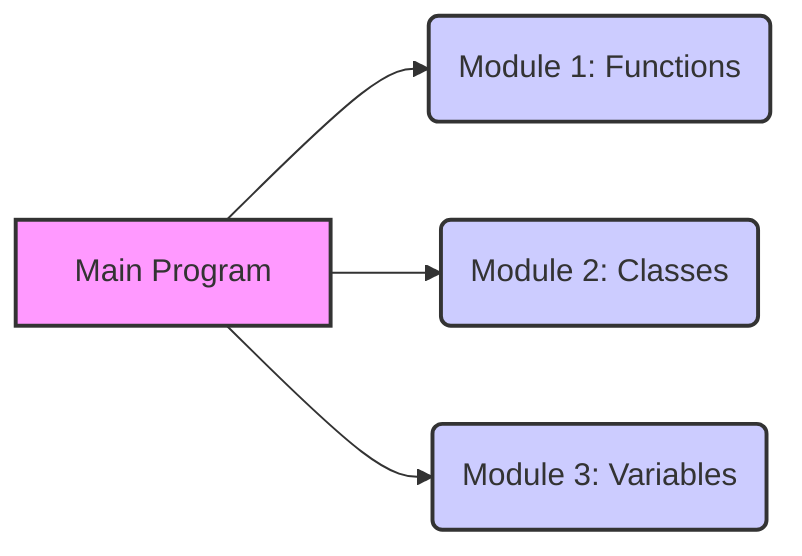
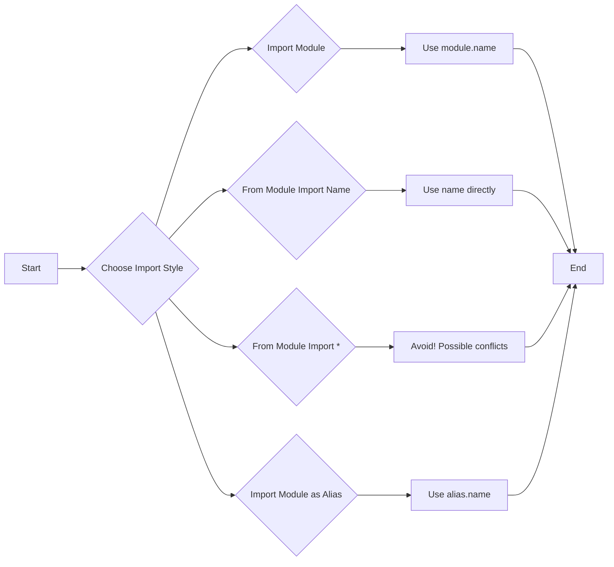
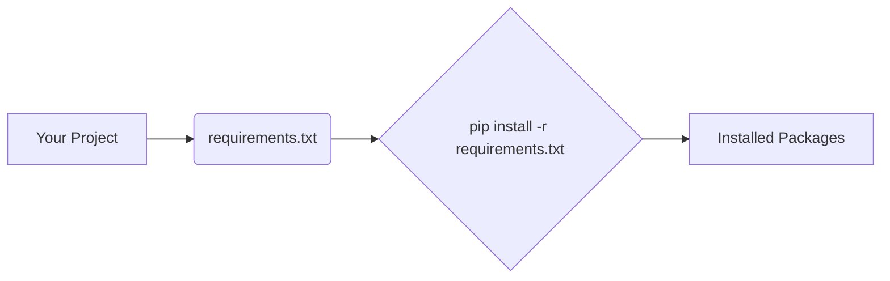

---
---
title: "11. Python Modules and Packages"
description: "🐍 Unlock the power of modularity in Python! This guide covers everything from creating and importing modules to understanding packages and using pip, helping you write cleaner, more organized, and reusable code. ✨"
author: infoyouth
date: 2025-11-09 02:00:00 +0000
categories:
  - Programming
  - Python
  - Modules and Packages
tags:
  - "Python Modules"
  - "Python Packages"
  - "pip"
  - "Import Statements"
  - "__name__ == '__main__'"
pin: true
math: false
mermaid: true
---

# <span style="color:#e67e22;">What we will learn in this post?</span>
<ul style='list-style-type: none; padding-left: 0;'>
<li><span style='color: #2980b9; font-size: 20px; font-weight: bold;'>👉</span> <span style='color: #2ecc71; font-size: 18px; font-weight: bold;'>Introduction to Modules</span></li>
<li><span style='color: #2980b9; font-size: 20px; font-weight: bold;'>👉</span> <span style='color: #2ecc71; font-size: 18px; font-weight: bold;'>Creating and Importing Modules</span></li>
<li><span style='color: #2980b9; font-size: 20px; font-weight: bold;'>👉</span> <span style='color: #2ecc71; font-size: 18px; font-weight: bold;'>Different Import Styles</span></li>
<li><span style='color: #2980b9; font-size: 20px; font-weight: bold;'>👉</span> <span style='color: #2ecc71; font-size: 18px; font-weight: bold;'>The __name__ Variable and if __name__ == '__main__'</span></li>
<li><span style='color: #2980b9; font-size: 20px; font-weight: bold;'>👉</span> <span style='color: #2ecc71; font-size: 18px; font-weight: bold;'>Python Standard Library Overview</span></li>
<li><span style='color: #2980b9; font-size: 20px; font-weight: bold;'>👉</span> <span style='color: #2ecc71; font-size: 18px; font-weight: bold;'>Introduction to Packages</span></li>
<li><span style='color: #2980b9; font-size: 20px; font-weight: bold;'>👉</span> <span style='color: #2ecc71; font-size: 18px; font-weight: bold;'>Installing Third-Party Packages with pip</span></li>
<li><span style='color: #2980b9; font-size: 20px; font-weight: bold;'>👉</span> <span style='color: #2ecc71; font-size: 18px; font-weight: bold;'>Conclusion!</span></li>
</ul>

# <span style="color:#e67e22">Python Modules: Your Code's Building Blocks 🧱</span>

Modules in Python are like organized toolboxes! 🧰 Think of them as files that hold Python code – functions, classes, and variables – ready to be used in other programs. You `import` a module to bring its contents into your current script.

## <span style="color:#2980b9">Why Modules Matter 🌟</span>

Modules are super important for keeping your code organized. Imagine writing a huge program without any organization. It would be a mess! Modules help by:

*   **Breaking down complexity:**  Instead of one giant file, you can split your code into smaller, manageable pieces.
*   **Reusability:** You can reuse code from one module in multiple programs, saving you time and effort. No need to re-write the same functions!
*   **Organization:** Modules make your code easier to understand, maintain, and debug. It's like having well-labeled compartments instead of a jumbled drawer.
*   **Namespace Management:** Modules create separate namespaces, avoiding naming conflicts between variables or functions.

Ready to dive deeper? Check out the official Python documentation on [Modules](https://docs.python.org/3/tutorial/modules.html)! 🚀


# <span style="color:#e67e22">Creating and Using Python Modules 🐍</span>

Let's explore how to create and use your own Python modules! Think of a module as a reusable toolbox filled with functions and variables.

## <span style="color:#2980b9">Creating a Module</span>

First, create a file (e.g., `my_module.py`) and add your code:

```python
# my_module.py
def greet(name):
  """Greets the person passed in as a parameter."""
  return f"Hello, {name}!"

pi = 3.14159
```

## <span style="color:#2980b9">Importing and Using a Module</span>

Now, in another Python file (e.g., `main.py`), import and use your module:

```python
# main.py
import my_module

message = my_module.greet("World")
print(message) # Output: Hello, World!
print(my_module.pi) # Output: 3.14159

# You can also rename the module
import my_module as mm

message = mm.greet("Universe")
print(message) #Output: Hello, Universe!

# Only import specific contents from Module
from my_module import greet, pi
print(greet("Earth")) # Output: Hello, Earth!
print(pi) # Output: 3.14159
```

*   **Key Idea:** The `import` statement makes your module's code available for use.
*   **Access:** Use `module_name.function_name` or `module_name.variable_name` to access content.
*   **Resources:** [Python Modules Documentation](https://docs.python.org/3/tutorial/modules.html)


```markdown
# <span style="color:#e67e22">Importing Modules in Python: A Friendly Guide 🐍</span>

Let's explore different ways to bring Python code into your projects! ✨

## <span style="color:#2980b9">Understanding Import Styles</span>

Python offers several ways to import modules, each with its pros and cons. Think of it as different ways to invite friends over – some are direct, others involve nicknames!

*   `import module`: This is the **safest** and most **explicit** way. You import the entire module and access its content using `module.name`.
    ```python
    # Example
    import math
    print(math.sqrt(16)) # Output: 4.0
    ```

*   `from module import name`: You import only a specific *name* (function, class, variable) from a module. It becomes directly accessible.
    ```python
    # Example
    from math import sqrt
    print(sqrt(25)) # Output: 5.0
    ```

*   `from module import *`: ⚠️ **Avoid this!** It imports everything from a module into your current namespace. Can lead to naming conflicts and makes your code harder to understand.

*   `import module as alias`: You import a module and give it a shorter, easier-to-type name. This is great for commonly used modules.
    ```python
    # Example
    import pandas as pd
    df = pd.DataFrame({'col1': [1, 2], 'col2': [3, 4]})
    print(df)
    ```

## <span style="color:#2980b9">Best Practices & When to Use What</span>

*   **`import module`:** Prefer this for large modules or when you only need a few functions. Keeps your code organized.

*   **`from module import name`:** Use when you're certain you only need a specific item and want to avoid typing `module.` repeatedly. But be mindful of name collisions.

*   **`from module import *`:** **Generally discouraged.** It's messy and makes it hard to track where names come from. Use with caution in very specific, controlled situations (e.g., in interactive sessions).

*   **`import module as alias`:** Perfect for shortening long module names (like `matplotlib.pyplot` as `plt`) and making your code more readable.

**In short:** *Be explicit*, *avoid wildcard imports*, and *use aliases wisely*.



```comments
# Different import styles in Python include:
# 1. import module: Imports the entire module, accessed via module.name. Safest and most explicit.
# 2. from module import name: Imports specific names (functions, classes, variables) directly. Use cautiously.
# 3. from module import *: Imports everything, generally discouraged due to naming conflicts.
# 4. import module as alias: Imports the module with a shorter alias for convenience.
# Best practices: Prefer 'import module' for clarity and organization. Use 'from module import name' for specific items when needed. Avoid 'from module import *'. Use aliases to shorten long module names.
```


# <span style="color:#e67e22">Understanding the __name__ Variable in Python 🐍</span>

The `__name__` variable is a special built-in variable in Python. It holds the name of the *current module*. The magic happens when you run a Python file directly.

## <span style="color:#2980b9">How it Works ⚙️</span>

*   When you run a file (e.g., `my_module.py`) directly, Python assigns the string `'__main__'` to the `__name__` variable within that file.
*   If you *import* `my_module.py` into another file, the `__name__` variable in `my_module.py` will be set to `'my_module'` (the module's name).

## <span style="color:#2980b9">The `if __name__ == '__main__':` Pattern ✨</span>

This pattern allows you to make a Python file both an *executable script* and an *importable module*. Here's how it looks:

```python
# my_module.py
def my_function():
    print("This function is from my_module.py")

if __name__ == '__main__':
    print("Running my_module.py directly!")
    my_function()
```

```python
# Output when running my_module.py directly:
# Running my_module.py directly!
# This function is from my_module.py
```

```python
# another_script.py
import my_module

my_module.my_function()
```

```python
# Output when running another_script.py:
# This function is from my_module.py
```

*   If you run `my_module.py` directly, the code inside the `if` block will execute.
*   If you import `my_module.py` into `another_script.py`, the code inside the `if` block will *not* execute. This is because `__name__` is set to `'my_module'` in the context of import, not `'__main__'`.

This lets you write reusable code that can also be run as a standalone program.

Here are the resource links:

*   [Python `__name__ == '__main__'` explained](https://www.freecodecamp.org/news/what-does-if-name-main-do-in-python-code/)
*   [Python Modules Tutorial](https://realpython.com/python-modules-packages/)


# <span style="color:#e67e22">Python's Amazing Standard Library 📚</span>

Python is awesome partly because it comes with a HUGE set of pre-built tools called the **standard library**. Think of it as a treasure chest filled with modules that can do almost anything! You don't need to install these separately; they're ready to use once you have Python. Let's peek inside:

## <span style="color:#2980b9">Commonly Used Modules ⚙️</span>

*   **`math`**: 📐 For mathematical operations.
    ```python
    import math
    print(math.sqrt(16)) # 4.0
    ```
    *For more info:* [Math Module Docs](https://docs.python.org/3/library/math.html)

*   **`random`**: 🎲 Generating random numbers.
    ```python
    import random
    print(random.randint(1, 10)) # A random integer between 1 and 10 (inclusive)
    ```
    *For more info:* [Random Module Docs](https://docs.python.org/3/library/random.html)

*   **`datetime`**: 📅 Working with dates and times.
    ```python
    import datetime
    now = datetime.datetime.now()
    print(now) # Current date and time
    ```
    *For more info:* [Datetime Module Docs](https://docs.python.org/3/library/datetime.html)

*   **`os`**: 📁 Interacting with your operating system (like creating folders, listing files).
    ```python
    import os
    print(os.getcwd()) # Current working directory
    ```
    *For more info:* [OS Module Docs](https://docs.python.org/3/library/os.html)

*   **`sys`**: 🖥️ System-specific parameters and functions.
    ```python
    import sys
    print(sys.version) # Python version
    ```
    *For more info:* [Sys Module Docs](https://docs.python.org/3/library/sys.html)

*   **`json`**: 📦 Encoding and decoding JSON data. Very handy for web APIs!
    ```python
    import json
    data = {'name': 'Alice', 'age': 30}
    json_string = json.dumps(data)
    print(json_string) # {"name": "Alice", "age": 30}
    ```
    *For more info:* [JSON Module Docs](https://docs.python.org/3/library/json.html)

*   **`re`**: 🔍 Regular expressions for pattern matching in strings.
    ```python
    import re
    text = "The quick brown fox"
    result = re.search("quick", text)
    print(result) # <re.Match object; span=(4, 9), match='quick'>
    ```
    *For more info:* [RE Module Docs](https://docs.python.org/3/library/re.html)

*   _And many, many more!_

The Python standard library is a powerful resource. Get familiar with it to write cleaner, more efficient code! Happy coding! ✨


# <span style="color:#e67e22">Packages in Python 📦</span>

Packages help organize Python code into manageable parts. Think of them as folders containing Python modules (files). To tell Python a directory is a package, we include a special file called `__init__.py` (it can even be empty!).

## <span style="color:#2980b9">Package Structure 📂</span>

A basic package looks like this:

```
my_package/
    __init__.py
    module1.py
    module2.py
```

We can also have *nested packages* inside each other.

```
my_package/
    __init__.py
    module1.py
    sub_package/
        __init__.py
        module3.py
```

## <span style="color:#2980b9">Importing from Packages 🚀</span>

We use `import` to access modules within a package. Here are a few ways:

*   `import my_package.module1` - Imports `module1`, use it as `my_package.module1.function()`
*   `from my_package import module1` - Imports `module1`, use it as `module1.function()`
*   `from my_package.sub_package import module3` - Imports `module3`, use it as `module3.function()`

The `__init__.py` file can also be used to define which modules are imported when using `from my_package import *` (though this is often discouraged).
Here is an example of how to use `__init__.py`:

```python
# my_package/__init__.py
from . import module1
from . import module2

__all__ = ['module1', 'module2']
```

This `__all__` variable tells Python which modules to import when you use `from my_package import *`. In our example, it tells Python to import `module1` and `module2`.

**Additional Resources:**

*   [Python Documentation - Packages](https://docs.python.org/3/tutorial/modules.html#packages)


# <span style="color:#e67e22">Pip: Your Python Package Pal 📦</span>

Pip is Python's _super-helpful_ tool for installing and managing packages. Think of packages as pre-built code libraries that add extra features to your Python projects! It's like having a toolbox full of ready-made tools!

## <span style="color:#2980b9">Basic Pip Commands 🛠️</span>

*   **Installing:** Use `pip install` followed by the package name. For example, `pip install requests` installs the 'requests' library to easily make HTTP requests.

    ```bash
    pip install requests
    ```

*   **Listing Packages:** `pip list` shows you all installed packages.
    ```bash
    pip list
    ```
*   **Uninstalling:** `pip uninstall` removes a package. `pip uninstall requests` would remove the 'requests' library.

    ```bash
    pip uninstall requests
    ```

## <span style="color:#2980b9">Requirements.txt: Your Dependency Manager 📝</span>

A `requirements.txt` file lists all the packages your project needs.

*   To create a `requirements.txt` file from your installed packages:

    ```bash
    pip freeze > requirements.txt
    ```

*   To install all packages from a `requirements.txt` file:

    ```bash
    pip install -r requirements.txt
    ```

This helps ensure everyone working on your project uses the same package versions. Very _important_ for collaboration and avoiding errors!



**More Info:**
*   [Pip Documentation](https://pip.pypa.io/en/stable/)
*   [Real Python Pip Tutorial](https://realpython.com/what-is-pip/)


Okay, here are a few different conclusion statements designed to encourage reader interaction:

**Option 1:**

<h1><span style='color:#e67e22'>Conclusion</span></h1>

Well, there you have it! I hope you enjoyed reading this post. 🤗 Now it's your turn! I'm really keen to hear your thoughts, experiences, or any suggestions you might have. What did you think? Leave a comment below – I read them all and love hearing from you! 👇 Let's chat! 💬

**Option 2:**

<h1><span style='color:#e67e22'>Conclusion</span></h1>

And that brings us to the end! I hope this was helpful and maybe even sparked some new ideas! 🤔 Don't be shy – share your own tips, opinions, or anything else related in the comments below. I'm excited to see what you have to say! Let's start a conversation! 🗣️ 👇

**Option 3:**

<h1><span style='color:#e67e22'>Conclusion</span></h1>

So, that's my take on it! I'm super curious to know what *you* think! 👇 Do you agree? Disagree? Got a better idea? Drop your comments and feedback below. I'm always looking to learn and improve! 😊 Let's connect! 🔗

**Option 4:**

<h1><span style='color:#e67e22'>Conclusion</span></h1>

Thanks for reading! I really appreciate you taking the time. 🙏 Now I'd love to hear from you! What are your thoughts? Share them in the comments below – your feedback helps me create even better content! 🤩 Don't be a stranger! 👋


