<!--
meta-description: "Learn Python modules and packages for building organized, reusable code. Master import statements, __name__ patterns, pip package management, and Python's standard library for professional software development."
keywords: "Python modules, Python packages, pip, import statements, __name__ main, Python standard library, requirements.txt, __init__.py, package management, module imports, reusable code, namespace management"
-->

# <span style="color:#e67e22;">What we will learn in this post?</span>
<ul style='list-style-type: none; padding-left: 0;'>
<li><span style='color: #2980b9; font-size: 20px; font-weight: bold;'>👉</span> <span style='color: #2ecc71; font-size: 18px; font-weight: bold;'>Introduction to Modules</span></li>
<li><span style='color: #2980b9; font-size: 20px; font-weight: bold;'>👉</span> <span style='color: #2ecc71; font-size: 18px; font-weight: bold;'>Creating and Importing Modules</span></li>
<li><span style='color: #2980b9; font-size: 20px; font-weight: bold;'>👉</span> <span style='color: #2ecc71; font-size: 18px; font-weight: bold;'>Different Import Styles</span></li>
<li><span style='color: #2980b9; font-size: 20px; font-weight: bold;'>👉</span> <span style='color: #2ecc71; font-size: 18px; font-weight: bold;'>The __name__ Variable and if __name__ == '__main__'</span></li>
<li><span style='color: #2980b9; font-size: 20px; font-weight: bold;'>👉</span> <span style='color: #2ecc71; font-size: 18px; font-weight: bold;'>Python Standard Library Overview</span></li>
<li><span style='color: #2980b9; font-size: 20px; font-weight: bold;'>👉</span> <span style='color: #2ecc71; font-size: 18px; font-weight: bold;'>Introduction to Packages</span></li>
<li><span style='color: #2980b9; font-size: 20px; font-weight: bold;'>👉</span> <span style='color: #2ecc71; font-size: 18px; font-weight: bold;'>Installing Third-Party Packages with pip</span></li>
<li><span style='color: #2980b9; font-size: 20px; font-weight: bold;'>👉</span> <span style='color: #2ecc71; font-size: 18px; font-weight: bold;'>Conclusion!</span></li>
</ul>

# <span style="color:#e67e22">Python Modules: Your Code's Building Blocks 🧱</span>

Modules are Python files containing reusable code that can be imported into other programs, forming the foundation of professional software architecture used in production systems worldwide.

## <span style="color:#2980b9">Why Modules Matter 🌟</span>

Modules are super important for keeping your code organized. Imagine writing a huge program without any organization. It would be a mess! Modules help by:

*   **Breaking down complexity:**  Instead of one giant file, you can split your code into smaller, manageable pieces.
*   **Reusability:** You can reuse code from one module in multiple programs, saving you time and effort. No need to re-write the same functions!
*   **Organization:** Modules make your code easier to understand, maintain, and debug. It's like having well-labeled compartments instead of a jumbled drawer.
*   **Namespace Management:** Modules create separate namespaces, avoiding naming conflicts between variables or functions.


Ready to dive deeper? Check out the official Python documentation on [Modules](https://docs.python.org/3/tutorial/modules.html)! 🚀


# <span style="color:#e67e22">Creating and Using Python Modules 🐍</span>

Creating custom modules is fundamental to building maintainable applications, enabling code reuse across multiple projects in professional development environments.

## <span style="color:#2980b9">Creating a Module</span>

First, create a file (e.g., `my_module.py`) and add your code:

```python
# my_module.py
def greet(name):
  """Greets the person passed in as a parameter."""
  return f"Hello, {name}!"

pi = 3.14159
```

## <span style="color:#2980b9">Importing and Using a Module</span>

Now, in another Python file (e.g., `main.py`), import and use your module:

```python
# main.py
import my_module

message = my_module.greet("World")
print(message) # Output: Hello, World!
print(my_module.pi) # Output: 3.14159

# You can also rename the module
import my_module as mm

message = mm.greet("Universe")
print(message) #Output: Hello, Universe!

# Only import specific contents from Module
from my_module import greet, pi
print(greet("Earth")) # Output: Hello, Earth!
print(pi) # Output: 3.14159
```

*   **Key Idea:** The `import` statement makes your module's code available for use.
*   **Access:** Use `module_name.function_name` or `module_name.variable_name` to access content.
*   **Resources:** [Python Modules Documentation](https://docs.python.org/3/tutorial/modules.html)


# <span style="color:#e67e22">Importing Modules in Python: A Friendly Guide 🐍</span>

Understanding import styles is crucial for writing clean, maintainable code that scales from small scripts to enterprise applications.

## <span style="color:#2980b9">Understanding Import Styles</span>

Python offers several ways to import modules, each with its pros and cons. Think of it as different ways to invite friends over – some are direct, others involve nicknames!

*   `import module`: This is the **safest** and most **explicit** way. You import the entire module and access its content using `module.name`.
    ```python
    # Example
    import math
    print(math.sqrt(16)) # Output: 4.0
    ```

*   `from module import name`: You import only a specific *name* (function, class, variable) from a module. It becomes directly accessible.
    ```python
    # Example
    from math import sqrt
    print(sqrt(25)) # Output: 5.0
    ```

*   `from module import *`: ⚠️ **Avoid this!** It imports everything from a module into your current namespace. Can lead to naming conflicts and makes your code harder to understand.

*   `import module as alias`: You import a module and give it a shorter, easier-to-type name. This is great for commonly used modules.
    ```python
    # Example
    import pandas as pd
    df = pd.DataFrame({'col1': [1, 2], 'col2': [3, 4]})
    print(df)
    ```

## <span style="color:#2980b9">Best Practices & When to Use What</span>

*   **`import module`:** Prefer this for large modules or when you only need a few functions. Keeps your code organized.

*   **`from module import name`:** Use when you're certain you only need a specific item and want to avoid typing `module.` repeatedly. But be mindful of name collisions.

*   **`from module import *`:** **Generally discouraged.** It's messy and makes it hard to track where names come from. Use with caution in very specific, controlled situations (e.g., in interactive sessions).

*   **`import module as alias`:** Perfect for shortening long module names (like `matplotlib.pyplot` as `plt`) and making your code more readable.

**In short:** *Be explicit*, *avoid wildcard imports*, and *use aliases wisely*.

```mermaid
graph TB
    Start["Choose Import Style"]:::pink --> Style1["import module"]:::purple
    Start --> Style2["from module import name"]:::teal
    Start --> Style3["from module import *"]:::orange
    Start --> Style4["import module as alias"]:::green
    
    Style1 --> Use1["Access: module.name"]:::gold
    Style2 --> Use2["Access: name directly"]:::gold
    Style3 --> Warn["⚠️ Naming conflicts!"]:::red
    Style4 --> Use4["Access: alias.name"]:::gold
    
    classDef pink fill:#ff4f81,stroke:#c43e3e,color:#fff,font-size:14px,stroke-width:3px,rx:14;
    classDef purple fill:#6b5bff,stroke:#4a3f6b,color:#fff,font-size:14px,stroke-width:3px,rx:14;
    classDef gold fill:#ffd700,stroke:#d99120,color:#222,font-size:14px,stroke-width:3px,rx:14;
    classDef teal fill:#00bfae,stroke:#005f99,color:#fff,font-size:14px,stroke-width:3px,rx:14;
    classDef orange fill:#ff9800,stroke:#f57c00,color:#fff,font-size:14px,stroke-width:3px,rx:14;
    classDef green fill:#43e97b,stroke:#38f9d7,color:#222,font-size:14px,stroke-width:3px,rx:14;
    classDef red fill:#e74c3c,stroke:#c0392b,color:#fff,font-size:14px,stroke-width:3px,rx:14;
    
    linkStyle default stroke:#e67e22,stroke-width:3px;
```




# <span style="color:#e67e22">Understanding the __name__ Variable in Python 🐍</span>

The `__name__` variable enables Python files to function both as reusable modules and standalone scripts, a pattern used extensively in professional testing and CLI applications.

## <span style="color:#2980b9">How it Works ⚙️</span>

*   When you run a file (e.g., `my_module.py`) directly, Python assigns the string `'__main__'` to the `__name__` variable within that file.
*   If you *import* `my_module.py` into another file, the `__name__` variable in `my_module.py` will be set to `'my_module'` (the module's name).

## <span style="color:#2980b9">The `if __name__ == '__main__':` Pattern ✨</span>

This pattern allows you to make a Python file both an *executable script* and an *importable module*. Here's how it looks:

```python
# my_module.py
def my_function():
    print("This function is from my_module.py")

if __name__ == '__main__':
    print("Running my_module.py directly!")
    my_function()
```

```python
# Output when running my_module.py directly:
# Running my_module.py directly!
# This function is from my_module.py
```

```python
# another_script.py
import my_module

my_module.my_function()
```

```python
# Output when running another_script.py:
# This function is from my_module.py
```

*   If you run `my_module.py` directly, the code inside the `if` block will execute.
*   If you import `my_module.py` into `another_script.py`, the code inside the `if` block will *not* execute. This is because `__name__` is set to `'my_module'` in the context of import, not `'__main__'`.

This lets you write reusable code that can also be run as a standalone program.

{% include code-playground.html language="python" code="# Python Module with __name__ Pattern Demo

# ============================================
# Module: math_utils (simulated)
# ============================================

def calculate_area(length, width):
    \"\"\"Calculate rectangle area.\"\"\"
    return length * width

def calculate_perimeter(length, width):
    \"\"\"Calculate rectangle perimeter.\"\"\"
    return 2 * (length + width)

# ============================================
# Main execution block
# ============================================
# This code only runs when file is executed directly
# NOT when imported as a module

if __name__ == '__main__':
    print(\"=\" * 50)
    print(\"RUNNING AS MAIN PROGRAM\")
    print(\"=\" * 50)
    
    # Test the functions
    length = 10
    width = 5
    
    area = calculate_area(length, width)
    perimeter = calculate_perimeter(length, width)
    
    print(f\"\\nRectangle dimensions: {length} x {width}\")
    print(f\"Area: {area} square units\")
    print(f\"Perimeter: {perimeter} units\")
    
    print(\"\\n\" + \"=\" * 50)
    print(\"Try changing length and width values!\")
    print(\"This demonstrates how __name__ == '__main__' works\")
    print(\"=\" * 50)
else:
    print(\"Module imported! Functions are available but main code skipped.\")" height="600" gradient="purple" %}

Here are the resource links:

*   [Python `__name__ == '__main__'` explained](https://www.freecodecamp.org/news/what-does-if-name-main-do-in-python-code/)


# <span style="color:#e67e22">Python's Amazing Standard Library 📚</span>

Python's standard library provides production-ready tools for everything from file I/O to networking, eliminating the need for external dependencies in many common scenarios.

## <span style="color:#2980b9">Commonly Used Modules ⚙️</span>

*   **`math`**: 📐 For mathematical operations.
    ```python
    import math
    print(math.sqrt(16)) # 4.0
    ```
    *For more info:* [Math Module Docs](https://docs.python.org/3/library/math.html)

*   **`random`**: 🎲 Generating random numbers.
    ```python
    import random
    print(random.randint(1, 10)) # A random integer between 1 and 10 (inclusive)
    ```
    *For more info:* [Random Module Docs](https://docs.python.org/3/library/random.html)

*   **`datetime`**: 📅 Working with dates and times.
    ```python
    import datetime
    now = datetime.datetime.now()
    print(now) # Current date and time
    ```
    *For more info:* [Datetime Module Docs](https://docs.python.org/3/library/datetime.html)

*   **`os`**: 📁 Interacting with your operating system (like creating folders, listing files).
    ```python
    import os
    print(os.getcwd()) # Current working directory
    ```
    *For more info:* [OS Module Docs](https://docs.python.org/3/library/os.html)

*   **`sys`**: 🖥️ System-specific parameters and functions.
    ```python
    import sys
    print(sys.version) # Python version
    ```
    *For more info:* [Sys Module Docs](https://docs.python.org/3/library/sys.html)

*   **`json`**: 📦 Encoding and decoding JSON data. Very handy for web APIs!
    ```python
    import json
    data = {'name': 'Alice', 'age': 30}
    json_string = json.dumps(data)
    print(json_string) # {"name": "Alice", "age": 30}
    ```
    *For more info:* [JSON Module Docs](https://docs.python.org/3/library/json.html)

*   **`re`**: 🔍 Regular expressions for pattern matching in strings.
    ```python
    import re
    text = "The quick brown fox"
    result = re.search("quick", text)
    print(result) # <re.Match object; span=(4, 9), match='quick'>
    ```
    *For more info:* [RE Module Docs](https://docs.python.org/3/library/re.html)

*   _And many, many more!_

The Python standard library is a powerful resource. Get familiar with it to write cleaner, more efficient code! Happy coding! ✨


# <span style="color:#e67e22">Packages in Python 📦</span>

Packages organize related modules into hierarchical namespaces, essential for building large-scale applications and distributing reusable libraries on PyPI.

## <span style="color:#2980b9">Package Structure 📂</span>

A basic package looks like this:

```
my_package/
    __init__.py
    module1.py
    module2.py
```

We can also have *nested packages* inside each other.

```
my_package/
    __init__.py
    module1.py
    sub_package/
        __init__.py
        module3.py
```

## <span style="color:#2980b9">Importing from Packages 🚀</span>

We use `import` to access modules within a package. Here are a few ways:

*   `import my_package.module1` - Imports `module1`, use it as `my_package.module1.function()`
*   `from my_package import module1` - Imports `module1`, use it as `module1.function()`
*   `from my_package.sub_package import module3` - Imports `module3`, use it as `module3.function()`

The `__init__.py` file can also be used to define which modules are imported when using `from my_package import *` (though this is often discouraged).
Here is an example of how to use `__init__.py`:

```python
# my_package/__init__.py
from . import module1
from . import module2

__all__ = ['module1', 'module2']
```

This `__all__` variable tells Python which modules to import when you use `from my_package import *`. In our example, it tells Python to import `module1` and `module2`.

**Additional Resources:**

*   [Python Documentation - Packages](https://docs.python.org/3/tutorial/modules.html#packages)


# <span style="color:#e67e22">Pip: Your Python Package Pal 📦</span>

Pip is Python's package manager, used by millions of developers to install and manage third-party libraries from PyPI for building production applications.

## <span style="color:#2980b9">Basic Pip Commands 🛠️</span>

*   **Installing:** Use `pip install` followed by the package name. For example, `pip install requests` installs the 'requests' library to easily make HTTP requests.

    ```bash
    pip install requests
    ```

*   **Listing Packages:** `pip list` shows you all installed packages.
    ```bash
    pip list
    ```
*   **Uninstalling:** `pip uninstall` removes a package. `pip uninstall requests` would remove the 'requests' library.

    ```bash
    pip uninstall requests
    ```

## <span style="color:#2980b9">Requirements.txt: Your Dependency Manager 📝</span>

A `requirements.txt` file lists all the packages your project needs.

*   To create a `requirements.txt` file from your installed packages:

    ```bash
    pip freeze > requirements.txt
    ```

*   To install all packages from a `requirements.txt` file:

    ```bash
    pip install -r requirements.txt
    ```

This helps ensure everyone working on your project uses the same package versions. Very _important_ for collaboration and avoiding errors!


---

## <span style="color:#e67e22">🎯 Practice Project Assignment</span>

<details>
<summary><strong>💡 Project: Python Package Manager - Build Your Own Utility Library</strong> (Click to expand)</summary>
<br>
<p><strong>Your Challenge:</strong></p>
<p>Create a multi-module Python package with utilities for text processing, math operations, and data validation, complete with proper package structure and __name__ patterns.</p>

<p><strong>Implementation Hints:</strong></p>
<ul>
<li><strong>Step 1:</strong> Create a package structure with <code>my_utils/__init__.py</code>, <code>my_utils/text_tools.py</code>, <code>my_utils/math_tools.py</code>, and <code>my_utils/validators.py</code>. Each module should contain 2-3 related functions.</li>
<li><strong>Step 2:</strong> In <code>text_tools.py</code>, add functions like <code>word_count(text)</code>, <code>reverse_words(text)</code>, and <code>capitalize_sentences(text)</code>. Use string methods and <code>if __name__ == '__main__'</code> to test them.</li>
<li><strong>Step 3:</strong> In <code>math_tools.py</code>, create functions like <code>calculate_average(numbers)</code>, <code>find_max_min(numbers)</code>, and <code>is_prime(n)</code>. Import the <code>math</code> module from Python's standard library for advanced operations.</li>
<li><strong>Step 4:</strong> In <code>validators.py</code>, build validation functions: <code>is_valid_email(email)</code>, <code>is_valid_phone(phone)</code>, and <code>is_strong_password(password)</code>. Use the <code>re</code> module for pattern matching.</li>
<li><strong>Step 5:</strong> In <code>__init__.py</code>, import key functions to make them accessible at package level: <code>from .text_tools import word_count</code>, etc. Set <code>__all__</code> to control what gets imported with <code>from my_utils import *</code>.</li>
<li><strong>Step 6:</strong> Create a <code>demo.py</code> file outside the package that imports and demonstrates all utilities. Show how different import styles work: <code>import my_utils</code>, <code>from my_utils import text_tools</code>, <code>from my_utils.math_tools import calculate_average</code>.</li>
<li><strong>Bonus Challenge:</strong> Add a <code>requirements.txt</code> file (even if empty) and create a <code>setup.py</code> for package distribution. Include docstrings in all functions and add test cases in each module's <code>if __name__ == '__main__'</code> block!</li>
</ul>

<p><strong>Example Package Structure:</strong></p>
<pre>
my_utils/
    __init__.py
    text_tools.py
    math_tools.py
    validators.py
demo.py
requirements.txt
</pre>

<p><strong>Example Output from demo.py:</strong></p>
<pre>
=== PYTHON UTILITY PACKAGE DEMO ===

TEXT TOOLS:
  Word count: 15 words
  Reversed: "olleh dlrow"
  Capitalized: "Hello World. This Is Python."

MATH TOOLS:
  Average: 45.6
  Max: 98, Min: 12
  Is 17 prime? True

VALIDATORS:
  Email valid? True
  Phone valid? True
  Password strong? False (needs uppercase)

=== ALL UTILITIES WORKING! ===
</pre>

<p><strong>Share Your Solution! 💬</strong></p>
<p>Built your utility package? Excellent work! Share your package structure and favorite utility function in the comments below. Feel free to add your own creative modules—maybe a <code>file_tools.py</code> or <code>date_tools.py</code>? The best way to master modules and packages is by building your own library! 🚀</p>

</details>

---

<h1><span style='color:#e67e22'>Conclusion</span></h1>

Mastering modules and packages transforms your Python code from scattered scripts to organized, professional software. You've learned how to create reusable modules, understand import patterns, leverage the standard library, and manage dependencies with pip. These skills form the foundation for building maintainable applications that scale. Now it's time to practice—start breaking your code into modules and exploring Python's rich ecosystem of packages! �

What's your experience with Python modules? Share your thoughts, questions, or favorite packages in the comments below! �

