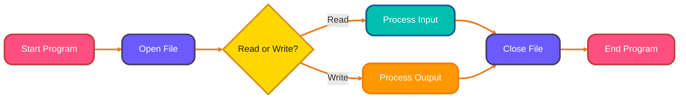
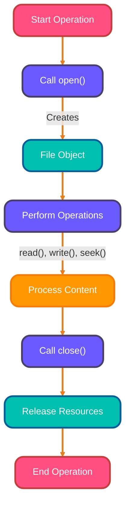
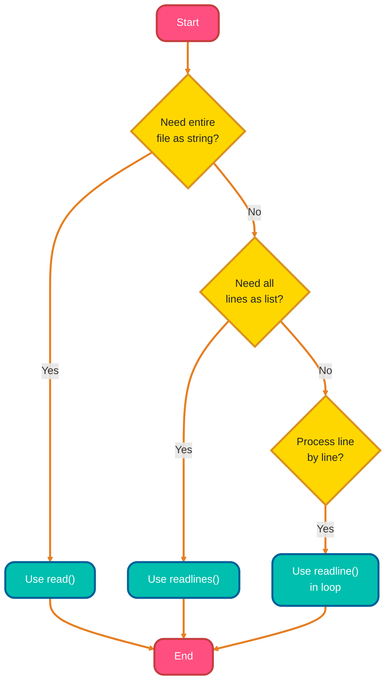
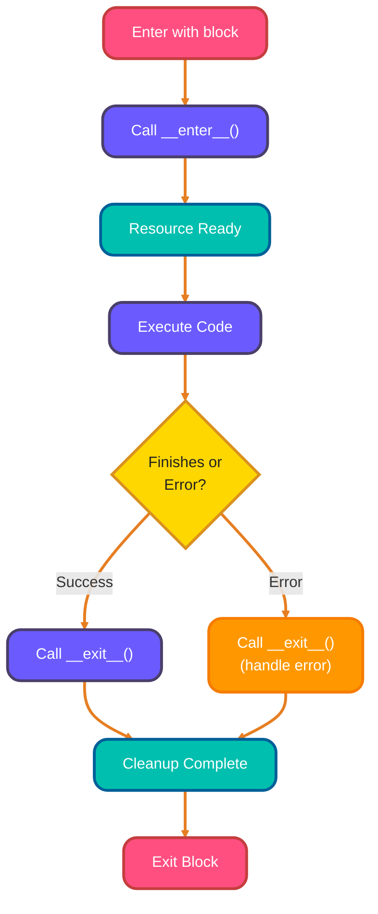
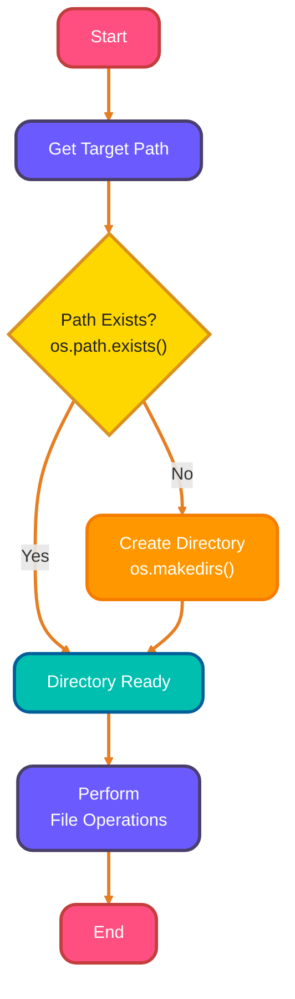
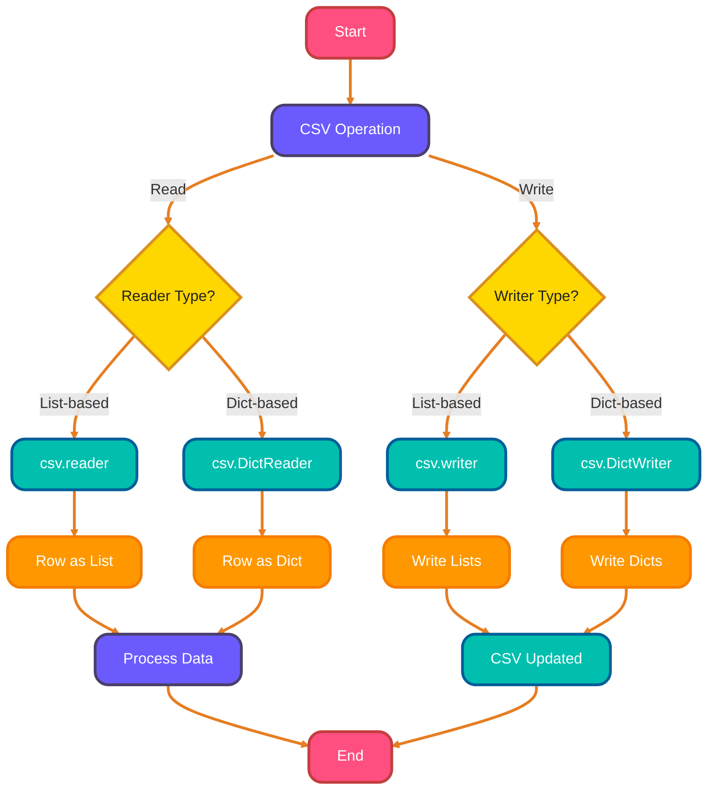
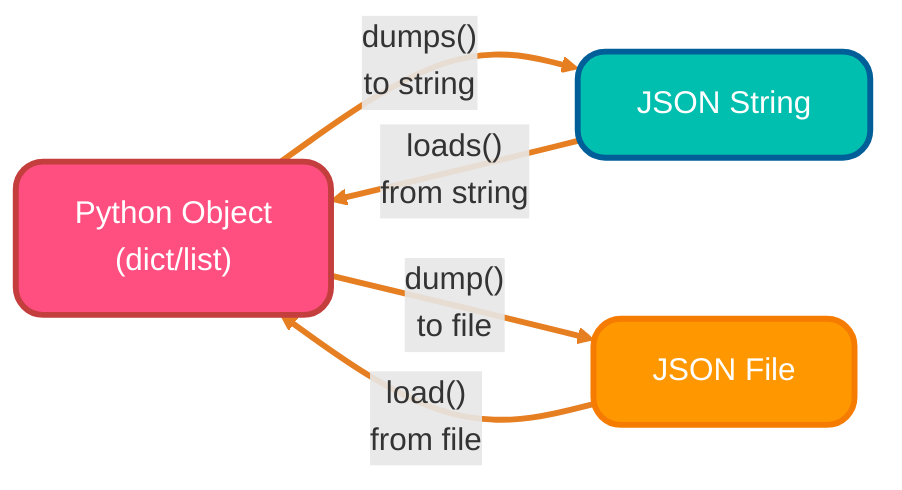

<!--
meta-description: "Master Python file handling with this comprehensive guide covering file operations, context managers, CSV and JSON processing, and the os module for cross-platform file management."
keywords: "Python file handling, open close files, read write files, with statement, context manager, CSV files Python, JSON files Python, os module, file paths, data persistence"
-->

# <span style="color:#e67e22;">What we will learn in this post?</span>
<ul style='list-style-type: none; padding-left: 0;'>
<li><span style='color: #2980b9; font-size: 20px; font-weight: bold;'>👉</span> <span style='color: #2ecc71; font-size: 18px; font-weight: bold;'>Introduction to File Handling</span></li>
<li><span style='color: #2980b9; font-size: 20px; font-weight: bold;'>👉</span> <span style='color: #2ecc71; font-size: 18px; font-weight: bold;'>Opening and Closing Files</span></li>
<li><span style='color: #2980b9; font-size: 20px; font-weight: bold;'>👉</span> <span style='color: #2ecc71; font-size: 18px; font-weight: bold;'>Reading Files</span></li>
<li><span style='color: #2980b9; font-size: 20px; font-weight: bold;'>👉</span> <span style='color: #2ecc71; font-size: 18px; font-weight: bold;'>Writing to Files</span></li>
<li><span style='color: #2980b9; font-size: 20px; font-weight: bold;'>👉</span> <span style='color: #2ecc71; font-size: 18px; font-weight: bold;'>Using 'with' Statement (Context Manager)</span></li>
<li><span style='color: #2980b9; font-size: 20px; font-weight: bold;'>👉</span> <span style='color: #2ecc71; font-size: 18px; font-weight: bold;'>File Paths and the os Module</span></li>
<li><span style='color: #2980b9; font-size: 20px; font-weight: bold;'>👉</span> <span style='color: #2ecc71; font-size: 18px; font-weight: bold;'>Working with CSV Files</span></li>
<li><span style='color: #2980b9; font-size: 20px; font-weight: bold;'>👉</span> <span style='color: #2ecc71; font-size: 18px; font-weight: bold;'>Working with JSON Files</span></li>
<li><span style='color: #2980b9; font-size: 20px; font-weight: bold;'>👉</span> <span style='color: #2ecc71; font-size: 18px; font-weight: bold;'>Conclusion!</span></li>
</ul>

# <span style="color:#e67e22">💾 Python File Handling: Your Data's Best Friend!</span>

File handling enables programs to save and load data to persistent storage, essential for applications like databases, log systems, and configuration management. Mastering file operations is crucial for building production-ready applications that store user data, process large datasets, and maintain application state across sessions.

---

## <span style="color:#2980b9">🌟 Why Bother? Data Persistence is Key!</span>

Think of data persistence as the ability to keep data *forever* (or until you delete it!). Without file handling, any data your program creates exists only while the program is active. Once it closes, poof! It's gone. Files provide a way to store data on your computer's storage, making it available for future use.

---

## <span style="color:#2980b9">📁 What Files Can Python Handle?</span>

Python is super versatile and can work with many file types:

*   **_Text Files_** (e.g., `.txt`): Simple human-readable files, great for basic notes or configuration.
*   **_Binary Files_**: For non-text data like images (`.jpg`), audio, or compiled programs.
*   **_CSV Files_** (e.g., `.csv`): Stands for Comma Separated Values. Perfect for tabular data, just like a simple spreadsheet.
*   **_JSON Files_** (e.g., `.json`): (JavaScript Object Notation) – A popular format for structured data, widely used for web APIs.

---

### <span style="color:#8e44ad">➡️ Basic File Operation Flow</span>

Understanding the file handling workflow helps you write robust data management code.




# <span style="color:#e67e22">File Fun with Python's `open()`! 📂</span>

The `open()` function is the foundation of file operations in Python, used in applications ranging from log processing to configuration management.

## <span style="color:#2980b9">`open()` Function: Your File Gateway 🚪</span>
Python's `open()` function is your go-to tool for interacting with files on your computer. It takes a *filename* (like `"my_document.txt"`) and a *mode* (telling Python what you want to do), then returns a special `file object`.

```python
# Example: Opening a file for reading
my_file = open("report.txt", "r")
```

## <span style="color:#2980b9">Understanding File Modes: Your File's Intent 🚦</span>
File modes are like instructions for how Python should handle the file:
*   `'r'` (read): The *default* mode. Opens the file for reading. The file *must exist*.
*   `'w'` (write): Opens for writing. *Creates* a new file or *overwrites* an existing one entirely. Be careful!
*   `'a'` (append): Opens for appending. Adds new content to the *end* of the file. Creates the file if it doesn't exist.
*   `'r+'`, `'w+'`, `'a+'`: These modes allow both reading and writing.
*   Add `'b'` (binary) to any mode (e.g., `'rb'`, `'wb'`) for non-text files like images or executables.

## <span style="color:#2980b9">The Mighty File Object: Your Interaction Hub 💡</span>
When `open()` returns, you get a `file object`. This object is your direct connection to the file and has methods to help you work with it:
*   `read()`: To grab all content at once.
*   `readline()`: To read content line by line.
*   `write("hello")`: To put text into the file.
*   `close()`: *Absolutely critical!*

## <span style="color:#2980b9">Don't Forget to `close()`! 🤝</span>
Calling `file_object.close()` is super important after you're done! It:
*   **Saves** any unsaved changes from memory to disk.
*   **Releases** system resources, preventing file locking issues or memory leaks.
*   **Prevents** potential data corruption.
*   ***Pro Tip:*** Using `with open(...) as file:` is even better, as it automatically ensures the file is closed for you, even if errors occur!
*   *For more info:* [Python Official Docs - File I/O](https://docs.python.org/3/tutorial/inputoutput.html#reading-and-writing-files)



# <span style="color:#e67e22">File Reading Fun! 📖✨</span>

Python provides multiple methods for reading files, each optimized for different use cases from loading configuration files to processing large log files.

---

## <span style="color:#2980b9">`read()`: Gulp it All Down! 🥤</span>

The `read()` method *reads the entire file* content and returns it as a single string. It's ideal when your file is relatively small, and you need to process all its contents at once.

```python
# Let's imagine 'my_file.txt' contains:
# Hello, world!
# This is line 2.
# And the final line.

with open("my_file.txt", "r") as file:
    whole_content = file.read()
    print(whole_content)
# Output:
# Hello, world!
# This is line 2.
# And the final line.
```

---

## <span style="color:#2980b9">`readline()`: Line by Line Journey 🚶‍♀️</span>

*Wanna read just one line at a time?* `readline()` is your go-to! Each call reads the next single line from the file. It's super efficient for very large files, as it saves memory by not loading the entire file at once.

```python
with open("my_file.txt", "r") as file:
    first_line = file.readline().strip() # .strip() removes the newline char
    second_line = file.readline().strip()
    print(f"First Line: {first_line}")
    print(f"Second Line: {second_line}")
# Output:
# First Line: Hello, world!
# Second Line: This is line 2.
```

---

## <span style="color:#2980b9">`readlines()`: All Lines, in a List! 📝</span>

This method reads *all lines* from the file and neatly stores them into a *list of strings*. Each string in the list represents a line from the file (including its newline character `\n`). Great for when you need to iterate or process each line individually later.

```python
with open("my_file.txt", "r") as file:
    all_file_lines = file.readlines()
    for line in all_file_lines:
        print(f"-> {line.strip()}")
# Output:
# -> Hello, world!
# -> This is line 2.
# -> And the final line.
```

---

## <span style="color:#2980b9">When to Choose? 🤔💡</span>

Selecting the right reading method depends on file size and processing requirements.



# <span style="color:#e67e22">Writing to Files 📝</span>

Writing data to files is essential for saving application state, generating reports, and logging system events.

## <span style="color:#2980b9">Basic Writing Operations</span>

Use `write()` to add content to files. Remember to specify `'w'` mode for writing (overwrites) or `'a'` for appending.

```python
# Writing to a file - overwrites existing content
with open("output.txt", "w") as f:
    f.write("Hello, World!\n")
    f.write("This is line 2.\n")

# Appending to a file - adds to end
with open("log.txt", "a") as f:
    f.write("New log entry: System started\n")
```

### <span style="color:#8e44ad">Real-World Example: Application Logging</span>

```python
import datetime

def log_event(event_type, message):
    """Log application events with timestamps"""
    timestamp = datetime.datetime.now().strftime("%Y-%m-%d %H:%M:%S")
    log_entry = f"[{timestamp}] {event_type}: {message}\n"
    
    with open("app.log", "a") as log_file:
        log_file.write(log_entry)

# Usage in production
log_event("INFO", "User logged in successfully")
log_event("ERROR", "Database connection failed")
```

# <span style="color:#e67e22">✨ The `with` Statement: Your File Safety Net! ✨</span>

The `with` statement provides automatic resource management, preventing file handle leaks and ensuring data integrity in production applications.

## <span style="color:#2980b9">🔒 Automatic File Closing: No More Leaks!</span>

When you use `with open('my_file.txt', 'w') as f:`, Python guarantees that the file will be *automatically closed* for you. This happens whether your code finishes successfully or if an *error (exception)* pops up inside the `with` block. You completely avoid needing to manually call `f.close()`.

### <span style="color:#8e44ad">🛡️ Why It's the Recommended Way</span>

It's the industry standard because it prevents serious issues like *resource leaks* (files staying open, consuming memory) and makes your code much safer, cleaner, and easier to read. It's _robust_ and less error-prone.

## <span style="color:#2980b9">🧩 Context Managers Explained</span>

The `with` statement works by interacting with objects known as *context managers*. A file object returned by `open()` is a perfect example! These objects have special methods (`__enter__` and `__exit__`) that handle the 'setup' (like opening the file) and 'teardown' (like closing it) automatically when you enter and exit the `with` block.

```python
# Example: Writing and Reading a file safely
with open('my_message.txt', 'w') as f:
    f.write("Python makes file handling easy!")
    # The file 'f' is active here
# File 'f' is automatically closed here, no matter what!

with open('my_message.txt', 'r') as f:
    message = f.read()
    print(f"Read: *{message}*")
# File 'f' is automatically closed here.
```

## <span style="color:#2980b9">📊 How `with` Works Visually</span>

Understanding the context manager protocol helps you write cleaner, more reliable file handling code.



### <span style="color:#8e44ad">Real-World Example: Safe Configuration File Update</span>

```python
def update_config(config_path, new_settings):
    """Safely update configuration file with error handling"""
    try:
        with open(config_path, 'r') as f:
            current_config = f.read()
        
        # Process and update configuration
        with open(config_path, 'w') as f:
            f.write(new_settings)
        
        print(f"✅ Configuration updated successfully")
        return True
    except FileNotFoundError:
        print(f"❌ Config file not found: {config_path}")
        return False
    except PermissionError:
        print(f"❌ No permission to write: {config_path}")
        return False

# Usage
update_config("app_config.ini", "debug=true\nport=8080")
```

For more info:
*   [Python Docs on `with` statement](https://docs.python.org/3/reference/compound_stmts.html#the-with-statement)
*   [Real Python: Context Managers](https://realpython.com/python-with-statement/)

---

# <span style="color:#e67e22">📂 Python's File & Path Powerhouse</span>

The `os` module provides cross-platform file system operations essential for building applications that work across Windows, macOS, and Linux environments.

---

## <span style="color:#2980b9">🗺️ Smartly Handling File Paths</span>

### <span style="color:#8e44ad">🔗 Joining Paths Together</span>
*`os.path.join()`* is fantastic for building paths. It smartly combines path components using the correct separator (`/` or `\`) for your operating system.

```python
import os

# Example: Joining path components
base_dir = "my_documents"
sub_dir = "reports"
file_name = "monthly_summary.txt"

full_path = os.path.join(base_dir, sub_dir, file_name)
print(f"Combined Path: {full_path}")
# Output (on Linux/macOS): Combined Path: my_documents/reports/monthly_summary.txt
# Output (on Windows): Combined Path: my_documents\reports\monthly_summary.txt
```

### <span style="color:#8e44ad">✂️ Splitting & Extracting Path Bits</span>
You can easily break down a path into its components:

*   `os.path.basename()`: Gets the *last part* of a path (usually the filename or folder name).
*   `os.path.dirname()`: Gets the *directory part* of a path.

```python
import os

sample_path = "/users/admin/data/config.ini"
print(f"Filename: {os.path.basename(sample_path)}")  # Output: Filename: config.ini
print(f"Directory: {os.path.dirname(sample_path)}")   # Output: Directory: /users/admin/data
```

---

## <span style="color:#2980b9">✅ Checking & Creating Things</span>

### <span style="color:#8e44ad">👀 Does it Exist?</span>
Use *`os.path.exists()`* to check if a file or directory is already there.

```python
import os

# Check if a folder exists (replace 'non_existent_folder' with a real path to test)
print(f"Does 'my_data' exist? {os.path.exists('my_data')}") # Output: Does 'my_data' exist? False (if it doesn't)
```

### <span style="color:#8e44ad">🏡 Making New Homes (Directories)</span>
*   `os.mkdir()`: Creates a *single* new directory.
*   `os.makedirs()`: Creates *all necessary parent directories* if they don't exist, perfect for nested folders. Use `exist_ok=True` to prevent errors if the folder is already there.

```python
import os

# Create a single folder
# os.mkdir("new_folder_example") # Use this for single, non-nested folder

# Create nested folders, handling existing ones gracefully
os.makedirs("my_projects/2024_plans/quarter1", exist_ok=True)
print("Created 'my_projects/2024_plans/quarter1'") # Output: Created 'my_projects/2024_plans/quarter1'
```

---

## <span style="color:#2980b9">✨ The Magic of Cross-Platform Compatibility</span>

The true brilliance of `os` and `os.path` lies in their ability to *abstract away* operating system differences. You write your path logic once, and these modules automatically adapt to the specific conventions of the OS your code is running on. This makes your Python scripts highly portable!

---

## <span style="color:#2980b9">📝 Path Management Flow</span>

Common workflow for ensuring directories exist before file operations.



### <span style="color:#8e44ad">Real-World Example: Project Directory Setup</span>

```python
import os

def setup_project_structure(project_name):
    """Create standard project directory structure"""
    base_path = os.path.join(os.getcwd(), project_name)
    
    # Define directory structure
    directories = [
        'src',
        'tests',
        'docs',
        os.path.join('src', 'utils'),
        os.path.join('src', 'models')
    ]
    
    # Create all directories
    for directory in directories:
        full_path = os.path.join(base_path, directory)
        os.makedirs(full_path, exist_ok=True)
        print(f"✅ Created: {full_path}")
    
    # Create initial files
    readme_path = os.path.join(base_path, 'README.md')
    with open(readme_path, 'w') as f:
        f.write(f"# {project_name}\n\nProject documentation here.")
    
    print(f"🎉 Project '{project_name}' structure created!")

# Usage
setup_project_structure("my_awesome_app")
```

---

## <span style="color:#2980b9">📚 Dive Deeper!</span>

Want to explore more functions? Check out the official Python documentation:
*   [Python `os` module documentation](https://docs.python.org/3/library/os.html)
*   [Python `os.path` module documentation](https://docs.python.org/3/library/os.path.html)

# <span style="color:#e67e22">Python's `csv` Module: Your Data Pal! 🤝</span>

The `csv` module simplifies handling tabular data, commonly used in data analysis, report generation, and database imports/exports.

## <span style="color:#2980b9">Reading CSVs: `csv.reader()` & `csv.DictReader()` 📚</span>

When you need to bring CSV data into Python, you have great options:

*   **`csv.reader()`**: Reads a CSV file line by line, giving you each row as a *list* of strings. Simple and direct.
*   **`csv.DictReader()`**: Super useful! It reads each row as a *dictionary*. The column headers (from the first row) automatically become your dictionary keys, making data access by name very intuitive.

## <span style="color:#2980b9">Writing CSVs: `csv.writer()` & `csv.DictWriter()` ✍️</span>

To save your Python data into a CSV file:

*   **`csv.writer()`**: Writes data from lists into a CSV file. Each list you provide turns into a new row.
*   **`csv.DictWriter()`**: Ideal for writing data from dictionaries. You specify the `fieldnames` (column headers), and it handles matching dictionary keys to columns and writing the values. Don't forget `writeheader()`!

## <span style="color:#2980b9">How it Works: A Quick Flow 🚀</span>



## <span style="color:#2980b9">Practical Examples 💡</span>

### <span style="color:#8e44ad">Reading CSV Files</span>

```python
import csv

# Using csv.reader() - simple list-based reading
with open('employees.csv', 'r') as file:
    reader = csv.reader(file)
    header = next(reader)  # Skip header
    for row in reader:
        print(f"Employee: {row[0]}, Department: {row[1]}")

# Using csv.DictReader() - dictionary-based reading
with open('employees.csv', 'r') as file:
    dict_reader = csv.DictReader(file)
    for row in dict_reader:
        print(f"Name: {row['Name']}, Salary: {row['Salary']}")
```

### <span style="color:#8e44ad">Writing CSV Files</span>

```python
import csv

# Using csv.writer()
data = [
    ['Name', 'Age', 'City'],
    ['Alice', 30, 'New York'],
    ['Bob', 24, 'San Francisco']
]
with open('people.csv', 'w', newline='') as file:
    writer = csv.writer(file)
    writer.writerows(data)

# Using csv.DictWriter()
employees = [
    {'Name': 'Alice', 'Department': 'Engineering', 'Salary': 90000},
    {'Name': 'Bob', 'Department': 'Marketing', 'Salary': 75000}
]
fieldnames = ['Name', 'Department', 'Salary']
with open('employees.csv', 'w', newline='') as file:
    writer = csv.DictWriter(file, fieldnames=fieldnames)
    writer.writeheader()
    writer.writerows(employees)
```

### <span style="color:#8e44ad">Real-World Example: Sales Report Generator</span>

```python
import csv
from datetime import datetime

def generate_sales_report(sales_data, filename):
    """Generate CSV sales report with summary statistics"""
    fieldnames = ['Date', 'Product', 'Quantity', 'Price', 'Total']
    
    with open(filename, 'w', newline='') as file:
        writer = csv.DictWriter(file, fieldnames=fieldnames)
        writer.writeheader()
        
        total_revenue = 0
        for sale in sales_data:
            sale['Total'] = sale['Quantity'] * sale['Price']
            total_revenue += sale['Total']
            writer.writerow(sale)
        
        # Add summary row
        writer.writerow({
            'Date': '',
            'Product': 'TOTAL REVENUE',
            'Quantity': '',
            'Price': '',
            'Total': total_revenue
        })
    
    print(f"✅ Report generated: {filename}")
    print(f"💰 Total Revenue: ${total_revenue:,.2f}")

# Usage
sales = [
    {'Date': '2025-11-01', 'Product': 'Laptop', 'Quantity': 5, 'Price': 1200},
    {'Date': '2025-11-02', 'Product': 'Mouse', 'Quantity': 20, 'Price': 25}
]
generate_sales_report(sales, 'monthly_sales.csv')
```

## <span style="color:#2980b9">Further Resources 🔗</span>

*   **Official Python Docs**: [csv Module](https://docs.python.org/3/library/csv.html)
*   **Real Python Tutorial**: [CSV Files in Python](https://realpython.com/python-csv/)

# <span style="color:#e67e22">Understanding Python's JSON Module 📁</span>

JSON (JavaScript Object Notation) is the standard format for web APIs, configuration files, and data exchange between systems.

---

## <span style="color:#2980b9">Working with JSON _Strings_: `dumps()` & `loads()` ↔️</span>

When you need to work with JSON data as plain text strings, `dumps()` and `loads()` are your friends.

*   **`json.dumps()`**: *Dump*s a Python object into a JSON *string*. This is great for sending data over networks or printing.
    ```python
    import json

    python_data = {"name": "Alice", "age": 30, "is_student": False}
    json_output_string = json.dumps(python_data, indent=4) # 'indent' makes it pretty!
    print(json_output_string)
    # Output:
    # {
    #     "name": "Alice",
    #     "age": 30,
    #     "is_student": false
    # }
    ```

*   **`json.loads()`**: *Load*s a JSON *string* and transforms it back into a Python object. Perfect for receiving data.
    ```python
    json_input_string = '{"city": "New York", "population": 8000000}'
    python_object = json.loads(json_input_string)
    print(f"City: {python_object['city']}") # You can now access it like a dictionary!
    # Output:
    # City: New York
    ```

---

## <span style="color:#2980b9">Handling JSON _Files_: `dump()` & `load()` 💾</span>

For saving or reading JSON data directly from files, `dump()` and `load()` are the functions to use.

*   **`json.dump()`**: *Dump*s a Python object directly to a JSON *file*. This function needs both the object and an open file handle.
    ```python
    data_for_file = {"product": "Laptop", "price": 1200, "in_stock": True}
    with open("product_info.json", "w") as f:
        json.dump(data_for_file, f, indent=4)
    # A file named 'product_info.json' is created with content:
    # {
    #     "product": "Laptop",
    #     "price": 1200,
    #     "in_stock": true
    # }
    ```

*   **`json.load()`**: *Load*s data from a JSON *file* and converts it into a Python object.
    ```python
    with open("product_info.json", "r") as f:
        loaded_file_data = json.load(f)
    print(f"Product price: ${loaded_file_data['price']}")
    # Output:
    # Product price: $1200
    ```

---

### <span style="color:#8e44ad">Python ↔️ JSON Data Flow 🔄</span>

Understanding JSON serialization helps you build API clients and configuration systems.



### <span style="color:#8e44ad">Real-World Example: API Response Handler</span>

```python
import json
import requests

def fetch_and_save_user_data(user_id, output_file):
    """Fetch user data from API and save to JSON file"""
    # Simulate API call (replace with actual API endpoint)
    api_url = f"https://api.example.com/users/{user_id}"
    
    try:
        # Make API request
        response = requests.get(api_url)
        response.raise_for_status()
        
        # Parse JSON response
        user_data = response.json()  # Equivalent to json.loads(response.text)
        
        # Add metadata
        user_data['fetched_at'] = datetime.now().isoformat()
        user_data['source'] = api_url
        
        # Save to file
        with open(output_file, 'w') as f:
            json.dump(user_data, f, indent=4)
        
        print(f"✅ User data saved to {output_file}")
        return user_data
    
    except requests.RequestException as e:
        print(f"❌ API Error: {e}")
        return None

# Usage
user_info = fetch_and_save_user_data(12345, 'user_12345.json')
```

### <span style="color:#8e44ad">Real-World Example: Configuration Manager</span>

```python
import json
import os

class ConfigManager:
    """Manage application configuration with JSON files"""
    
    def __init__(self, config_path='config.json'):
        self.config_path = config_path
        self.config = self.load_config()
    
    def load_config(self):
        """Load configuration from JSON file"""
        if os.path.exists(self.config_path):
            with open(self.config_path, 'r') as f:
                return json.load(f)
        return self.get_default_config()
    
    def save_config(self):
        """Save configuration to JSON file"""
        with open(self.config_path, 'w') as f:
            json.dump(self.config, f, indent=4)
        print(f"✅ Configuration saved to {self.config_path}")
    
    def get_default_config(self):
        """Return default configuration"""
        return {
            'app_name': 'MyApp',
            'version': '1.0.0',
            'database': {
                'host': 'localhost',
                'port': 5432
            },
            'logging': {
                'level': 'INFO',
                'file': 'app.log'
            }
        }
    
    def update_setting(self, key_path, value):
        """Update nested configuration setting"""
        keys = key_path.split('.')
        config = self.config
        
        for key in keys[:-1]:
            config = config.setdefault(key, {})
        
        config[keys[-1]] = value
        self.save_config()

# Usage
config = ConfigManager()
config.update_setting('database.port', 5433)
print(f"Database port: {config.config['database']['port']}")
```

---

*For more details, check out the [Python Official Docs on the `json` module](https://docs.python.org/3/library/json.html).*

# <span style="color:#e67e22">🎯 Conclusion</span>

You've now mastered Python file handling from basic operations to advanced CSV and JSON processing! These skills are fundamental for building data-driven applications, logging systems, configuration management, and API integrations. Practice by creating a project that combines multiple file types—perhaps a data analysis tool that reads CSV files, processes them, and exports results to JSON. Remember to always use the `with` statement for automatic resource management and leverage the `os` module for cross-platform compatibility.
