<!--
meta-description: "Comprehensive guide to Python exception handling: try-except, custom exceptions, best practices, and real-world examples. Learn to build robust, user-friendly applications with dynamic diagrams and practical code."
keywords: "Python exception handling, try-except, custom exceptions, error management, robust code, best practices, exception flow, EAFP, logging, user-friendly applications, crash-proof Python"
-->

# <span style="color:#e67e22;">What we will learn in this post?</span>
<ul style='list-style-type: none; padding-left: 0;'>
<li><span style='color: #2980b9; font-size: 20px; font-weight: bold;'>👉</span> <span style='color: #2ecc71; font-size: 18px; font-weight: bold;'>Introduction to Exceptions</span></li>
<li><span style='color: #2980b9; font-size: 20px; font-weight: bold;'>👉</span> <span style='color: #2ecc71; font-size: 18px; font-weight: bold;'>try-except Block</span></li>
<li><span style='color: #2980b9; font-size: 20px; font-weight: bold;'>👉</span> <span style='color: #2ecc71; font-size: 18px; font-weight: bold;'>Multiple except Clauses</span></li>
<li><span style='color: #2980b9; font-size: 20px; font-weight: bold;'>👉</span> <span style='color: #2ecc71; font-size: 18px; font-weight: bold;'>else and finally Clauses</span></li>
<li><span style='color: #2980b9; font-size: 20px; font-weight: bold;'>👉</span> <span style='color: #2ecc71; font-size: 18px; font-weight: bold;'>Raising Exceptions</span></li>
<li><span style='color: #2980b9; font-size: 20px; font-weight: bold;'>👉</span> <span style='color: #2ecc71; font-size: 18px; font-weight: bold;'>Custom Exceptions</span></li>
<li><span style='color: #2980b9; font-size: 20px; font-weight: bold;'>👉</span> <span style='color: #2ecc71; font-size: 18px; font-weight: bold;'>Exception Best Practices</span></li>
<li><span style='color: #2980b9; font-size: 20px; font-weight: bold;'>👉</span> <span style='color: #2ecc71; font-size: 18px; font-weight: bold;'>Conclusion!</span></li>
</ul>

# <span style="color:#e67e22">Understanding Exceptions: When Your Code Needs a Hug! 🤗</span>

## <span style="color:#2980b9">What are Exceptions? 🤔</span>
In programming, an *exception* is like an unexpected bump in the road while your program is running. It's a *runtime error* that signals something went wrong, causing your program to stop abruptly. Unlike *syntax errors* (typos you make), exceptions occur when the code is technically correct but faces a problem during execution.

## <span style="color:#2980b9">Why Do They Occur? 🚧</span>
Exceptions pop up for various reasons:
*   Trying to *divide a number by zero* (e.g., `10 / 0`).
*   Accessing an item that doesn't exist in a list (e.g., `my_list[10]` when `my_list` only has 5 items).
*   Using a variable you haven't defined yet.

## <span style="color:#2980b9">Why Handle Them Gracefully? 🛡️</span>
Handling exceptions gracefully means catching these bumps and dealing with them smoothly instead of letting your program crash. This improves the *user experience*, makes your code more *robust*, and helps you debug problems effectively. We often use `try-except` blocks for this!


## <span style="color:#2980b9">Common Built-in Python Exceptions 🐍</span>
Python has many built-in exceptions to describe different problems:
*   ***TypeError***: Operation on an incompatible type (e.g., `"hello" + 5`).
*   ***NameError***: Referring to an undefined variable (e.g., `print(x)` if `x` isn't set).
*   ***ValueError***: Correct type, but inappropriate value (e.g., `int("abc")`).
*   ***ZeroDivisionError***: Attempting to divide by zero.
*   ***IndexError***: Trying to access a list/tuple index that's out of range.

### <span style="color:#8e44ad">Further Resources 📚</span>
*   For a deeper dive into Python's built-in exceptions, check out the [Official Python Documentation](https://docs.python.org/3/library/exceptions.html).
*   A practical guide on handling exceptions can be found on [Real Python](https://realpython.com/python-exceptions/).

<!-- # <span style="color:#e67e22">Catching Code Hiccups with `try-except`! 🛡️</span> -->

The `try-except` block is a **super useful** tool in Python, acting like a safety net for your code! It helps us ***catch*** and ***handle*** unexpected issues (called _exceptions_) gracefully, so your program doesn't crash suddenly.

<!-- ## <span style="color:#2980b9">How This Safety Net Works 🕸️</span> -->

*   The `try` block: This is where you put code that *might* cause a problem. Think of it as "testing the waters."
*   The `except` block: If something *does* go wrong inside `try`, Python politely skips to this block. Here, you write code to gently fix or respond to the error, like showing a helpful message to your users instead of a scary technical error.

<!-- ## <span style="color:#2980b9">Specific vs. General Exceptions 🎯</span> -->

For better control, you can handle *specific* exceptions. For instance:
*   `except ValueError:`: Perfect if someone types text (`"hello"`) when you expect a number.
*   `except ZeroDivisionError:`: Catches problems when you try to divide by zero.

It's generally _better to be specific_! You can also catch *any* error with `except Exception as e:`, but try to be precise when you can for clearer debugging.

<!-- ### <span style="color:#8e44ad">Visualizing the Flow</span> -->

```mermaid
%%{init: {'theme':'base', 'themeVariables': { 'primaryColor':'#ff4f81','primaryTextColor':'#fff','primaryBorderColor':'#c43e3e','lineColor':'#e67e22','secondaryColor':'#6b5bff','tertiaryColor':'#ffd700','noteBkgColor':'#00bfae','noteTextColor':'#fff'}}}%%
sequenceDiagram
    participant Code as 🐍 Code
    participant Try as 🛡️ Try Block
    participant Except as ⚠️ Except Block
    
    Note over Code,Except: Exception Handling Flow
    Code->>+Try: Execute risky code
    Try->>Try: Process operations
    alt Error Occurs
        Try-->>-Except: Raise exception
        Except->>Except: Handle error gracefully
        Note right of Except: Log or recover ✅
    else No Error
        Try-->>-Code: Continue normally
        Note left of Code: Success path 🚀
    end
```


<!-- ## <span style="color:#2980b9">Let's See It in Action! 🚀</span> -->

<!-- ### <span style="color:#8e44ad">Example 1: The "No Divide by Zero" Rule</span> -->
```python
# try:
#     # We're trying to divide by zero here, which is impossible!
#     answer = 10 / 0
# except ZeroDivisionError:
#     # Python catches it and runs this code instead of crashing.
#     # print("Whoops! You tried to divide by zero. That's a no-no!")
```

<!-- ### <span style="color:#8e44ad">Example 2: When Input Goes Rogue</span> -->
```python
# try:
#     # Trying to convert non-numeric text ("hello") into an integer.
#     value = int("hello")
# except ValueError:
#     # This block handles the error because 'hello' cannot become a number.
#     # print("Hey, 'hello' isn't a number! Please enter digits.")
```

<!-- ### <span style="color:#8e44ad">Dive Deeper! 🧠</span> -->
Want to learn more about exceptions? Check out the [Python Official Docs](https://docs.python.org/3/tutorial/errors.html).

Below are practical, runnable examples showing common `try-except` patterns you will use in real applications: input validation, safe division, multiple `except` clauses, and grouping exceptions when the handling is identical.

```python
# Example 1 — Safe division in a utility function (useful in calculators/services)
def safe_divide(a, b):
    try:
        return a / b
    except ZeroDivisionError:
        print("Whoops! You tried to divide by zero. That's a no-no!")
        return None

print(safe_divide(10, 2))  # 5.0
print(safe_divide(10, 0))  # None (and prints friendly message)


# Example 2 — Robust parsing/validation for user input or API data
def parse_int(s):
    try:
        return int(s)
    except ValueError:
        print(f"Invalid integer: {s!r}")
        return None

print(parse_int("42"))    # 42
print(parse_int("hello")) # None (and prints invalid message)


# Example 3 — Multiple except clauses for precise handling
def process(value):
    try:
        # Try to coerce to int and do a simple operation
        x = int(value)
        print("Parsed int:", x)
    except ValueError:
        print("ValueError: Bad literal for int()")
    except TypeError:
        print("TypeError: Unsupported operation for provided value")
    except Exception as e:
        print("Unexpected error:", e)

process("10")  # Parsed int: 10
process("abc") # ValueError
process(None)    # TypeError


# Example 4 — Catching multiple related exceptions in one clause
try:
    result = "text" + 10  # TypeError
except (ValueError, TypeError) as e:
    print(f"Caught a common data processing issue: {e}")

```

# <span style="color:#e67e22">✨ Understanding `else` and `finally` in Exception Handling</span>

## <span style="color:#2980b9">✅ The `else` Clause: Success Story!</span>
The `else` clause within a `try-except` block is a special place for code that *only executes if no exception occurred* in the `try` block.
*   **Purpose:** It ensures a specific set of operations runs *only* after a successful execution of the `try` block.
*   **Use Case:** You might `_process_` data or `**log success**` in the `else` block after a `try` block has successfully read a file or performed a complex calculation.

## <span style="color:#2980b9">⚙️ The `finally` Clause: Always Cleanup!</span>
The `finally` clause is the most dependable part; its code *always executes*, no matter what! Whether an exception happened or not, whether the `try` block completed normally, or even if `return` was called – `finally` runs.
*   **Purpose:** It’s essential for **cleanup operations** that must happen, guaranteeing critical resources are released.
*   **Use Case:** Ideal for _closing files_, releasing network connections, or cleaning up temporary resources, preventing resource leaks.

### <span style="color:#8e44ad">🧑‍💻 Example Scenario</span>
Let's see them in action with a file operation:
```python
try:
    file = open("my_document.txt", "r")
    content = file.read()
    print("File read successfully!") # Output if no exception
except FileNotFoundError:
    print("Error: The file was not found.") # Output if FileNotFoundError
else:
    print(f"Content length: {len(content)} characters.") # Runs ONLY if try succeeds
finally:
    if 'file' in locals() and not file.closed: # Check if file was opened and not closed
        file.close()
        print("File closed, guaranteed!") # ALWAYS runs
# --- Example Output 1 (File Exists) ---
# File read successfully!
# Content length: 150 characters.
# File closed, guaranteed!

# --- Example Output 2 (File Missing) ---
# Error: The file was not found.
# File closed, guaranteed! (Note: file might not have been opened, but finally still executes)
```

## <span style="color:#2980b9">🗺️ Execution Flow Simplified</span>

<small>For a deeper dive, check out the official [Python documentation on `try` statements](https://docs.python.org/3/reference/compound_stmts.html#the-try-statement).</small>

# <span style="color:#e67e22">Raising Exceptions with `raise` 🚨</span>

```mermaid
sequenceDiagram
    participant Try as 🛡️ Try Block #00bfae
    participant Except as ⚠️ Except Block #ff9800
    participant Success as ✅ Success Block #43e97b
    participant Finally as 🧹 Finally Block #9e9e9e
    
    Note over Try,Finally: Complete Exception Flow
    alt Exception Raised
        Try->>+Except: Exception occurs
        Except->>Except: Handle error
        Except-->>-Finally: Always execute
    else No Exception
        Try->>+Success: Success path
        Success->>Success: Process success
        Success-->>-Finally: Always execute
    end
    Finally->>Finally: Cleanup resources
    Note right of Finally: Guaranteed execution 🛡️
```

The `raise` keyword in Python is your way of *explicitly* telling your program, "Hey, something isn't right here!" It lets you signal an error condition, halting the normal flow of execution and allowing you to deal with problems proactively.

## <span style="color:#2980b9">How to Use `raise` 🤔</span>

You use `raise` followed by an *exception type* and an *optional message*.

```python
def check_positive(number):
    if number <= 0:
        # We raise a ValueError because the input is invalid
        raise ValueError("Input must be a positive number!")
    return f"Number {number} is positive."

print(check_positive(5))
# Output: Number 5 is positive.

# Trying with an invalid input
# print(check_positive(-3))
# Output:
# Traceback (most recent call last):
#   File "<stdin>", line X, in check_positive
# ValueError: Input must be a positive number!
```

## <span style="color:#2980b9">When to Raise Exceptions ⚠️</span>

Raise an exception when:
*   **Invalid Input:** A function receives data it cannot process (e.g., a negative age).
*   **Impossible State:** Your program reaches a condition that should logically never happen.
*   **Business Rule Violation:** A core rule of your application is broken.

## <span style="color:#2980b9">Crafting Custom Messages ✨</span>

You can provide a specific, helpful string message when raising an exception. This makes debugging much easier!

```python
def login(username, password):
    if not username:
        raise ValueError("Username cannot be empty.")
    if len(password) < 8:
        # Custom message explaining the exact issue
        raise ValueError(f"Password too short! Requires 8 chars, got {len(password)}.")
    return "Login successful!"

# print(login("user123", "short"))
# Output:
# Traceback (most recent call last):
#   File "<stdin>", line X, in login
# ValueError: Password too short! Requires 8 chars, got 5.
```

## <span style="color:#8e44ad">Flow of Raising an Exception 🌊</span>

Here's a simple visual of how `raise` works:


# <span style="color:#e67e22">Unleash Your Own Error Types! 🚀 Custom Exceptions in Python</span>

Custom exceptions are your superpower to create *specific* error types for your Python applications. Instead of generic messages, you get clear, tailored feedback for unique problems, making your code much cleaner and easier to manage!

## <span style="color:#2980b9">Crafting Your Custom Exception ✨</span>

Making your own is super straightforward! You just *inherit* from Python's base `Exception` class (or a more specific built-in one). This tells Python it's an error.

```python
# Our custom error for when funds are low!
class InsufficientFundsError(Exception):
    """
    Raised when an account balance is too low for a transaction.
    """
    # We can add custom attributes or methods here if needed,
    # but often just inheriting is enough!
    pass

# You can inherit from a more specific base if it makes sense,
# e.g., ValueError for bad inputs:
# class InvalidEmailFormatError(ValueError):
#    pass
```

## <span style="color:#2980b9">When to Roll Your Own 🤔</span>

*   **Specific Domain Errors:** When built-in exceptions like `ValueError` or `TypeError` don't quite fit your application's unique logic (e.g., a `ProductOutOfStockError`).
*   **Cleaner Error Handling:** Allows `try...except` blocks to catch *your* specific errors, making the code more readable and robust.
*   **Better Debugging:** Custom exceptions provide more context about *what exactly* went wrong in your custom logic.

## <span style="color:#2980b9">Best Practices for Success ✅</span>

*   **Be Specific:** Give your exceptions clear, descriptive names (e.g., `UserNotFound`, `InvalidConfiguration`).
*   **Keep it Simple:** Often, just inheriting is enough; don't overcomplicate it with unnecessary methods initially.
*   **Document:** Always use *docstrings* to explain what the exception signifies and when it might be raised.
*   **Inherit Appropriately:** Inherit from `Exception` for general custom errors, or from a more specific built-in exception if your error *is* a type of that built-in error (e.g., inherit from `ValueError` if your custom error is about an invalid value).

## <span style="color:#2980b9">Example in Action 💡</span>

Let's see our `InsufficientFundsError` in a simple banking scenario!

```python
# Imagine this is part of your banking system
def withdraw_money(amount: float, current_balance: float) -> float:
    """
    Attempts to withdraw a specified amount from the balance.
    Raises InsufficientFundsError if the balance is too low.
    """
    if amount <= 0:
        raise ValueError("Withdrawal amount must be positive.")
    if amount > current_balance:
        # Here we raise our custom exception!
        raise InsufficientFundsError(
            f"Oops! Not enough money. You tried to withdraw ${amount:.2f}, "
            f"but only ${current_balance:.2f} is available."
        )
    return current_balance - amount

# --- Let's try to use it! ---
account_balance = 100.00

print(f"Initial balance: ${account_balance:.2f}") # Output: Initial balance: $100.00

try:
    # This will fail and raise our custom exception
    new_balance = withdraw_money(150.00, account_balance)
    print(f"Withdrawal successful! New balance: ${new_balance:.2f}")
except InsufficientFundsError as e:
    # We catch our custom error specifically!
    print(f"Caught a custom error: {e}")
    # Output: Caught a custom error: Oops! Not enough money. You tried to withdraw $150.00, but only $100.00 is available.
except ValueError as e:
    # Catches the built-in ValueError for invalid amounts
    print(f"Invalid input error: {e}")
except Exception as e:
    # A general fallback for any other unexpected errors
    print(f"An unexpected error occurred: {e}")

print("\n--- Another attempt (successful) ---")
try:
    new_balance = withdraw_money(50.00, account_balance)
    print(f"Withdrawal successful! New balance: ${new_balance:.2f}") # Output: Withdrawal successful! New balance: $50.00
except InsufficientFundsError as e:
    print(f"Caught a custom error: {e}")
```

### <span style="color:#8e44ad">Exception Flow 🌊</span>


## <span style="color:#2980b9">Dive Deeper! 📚</span>

*   [Python Docs: Errors and Exceptions](https://docs.python.org/3/tutorial/errors.html)
*   [Real Python: Python Custom Exceptions Tutorial](https://realpython.com/python-custom-exceptions/)

# <span style="color:#e67e22">Exception Handling: Smooth Sailing for Your Code!</span> 🚀

Exception handling keeps your programs stable and user-friendly. Mastering it ensures your applications gracefully recover from unexpected issues. Here are some best practices:

## <span style="color:#2980b9">Catch What You Expect & No Silent Fails!</span> 👍

Always catch *specific* exceptions like `ValueError` or `FileNotFoundError` rather than a generic `Exception`. This allows you to handle each problem precisely.

*   **🚫 Don't Suppress Errors:** Never silently ignore errors! If you catch an exception, always *log* it or inform the user. An empty `except:` block is a huge anti-pattern as it hides critical issues, making debugging a nightmare.

## <span style="color:#2980b9">Log It & Assert It!</span> 📝

When an exception occurs, _log_ it with crucial details like a timestamp, error type, and traceback. This information is vital for debugging and understanding what went wrong later.

*   **Assertions for Internal Checks:** Use `assert` statements for conditions that *should never happen* in your code's internal logic. If an assertion fails, it immediately flags a bug, indicating a problem in your program's assumptions.

Here's a practical logging pattern you can drop into services or scripts to capture errors with stack traces for later investigation.

```python
import logging

logging.basicConfig(level=logging.ERROR, format='%(asctime)s %(levelname)s: %(message)s')

try:
    # Simulate reading a file or similar risky operation
    with open('data.txt', 'r') as f:
        data = f.read()
except FileNotFoundError as e:
    # Logs the exception message + stack trace
    logging.exception("Failed to read data.txt")
    # Optionally re-raise or handle gracefully
    # raise

```

## <span style="color:#2980b9">Ask Forgiveness, Not Permission (EAFP)</span> 🙏

The *EAFP* principle suggests trying an operation and then catching the error if it fails. This often leads to cleaner, more Pythonic code than checking conditions beforehand. For instance, `try-except` is frequently preferred over `if-else` for file operations.

```python
# EAFP Example
try:
    with open("data.txt", "r") as f:
        content = f.read()
except FileNotFoundError:
    print("Oops! File 'data.txt' not found.")
    # Log the FileNotFoundError here
```

### <span style="color:#8e44ad">Exception Handling Flow Simplified</span> 🔄


**More Info:**
*   For a deeper dive into Python's `try-except` statements, visit: [Python Docs on Errors and Exceptions](https://docs.python.org/3/tutorial/errors.html)

<h1><span style='color:#e67e22'>Conclusion</span></h1>
And there you have it! We've covered a lot today, and now we'd absolutely love to hear from *you*. What are your thoughts on this topic? Do you have any extra tips, feedback, or perhaps a different perspective? 🤔 Your insights are super valuable to us and help make our community even better! Please don't hesitate to share your comments, questions, or suggestions down below. 👇 We're really looking forward to reading what you have to say! 😊

