<!--
meta-description: "Comprehensive guide to Python Object-Oriented Programming basics: classes, objects, __init__, instance/class variables, methods, encapsulation, @property, and name mangling. Learn OOP with practical examples and real-world projects."
keywords: "Python OOP, object-oriented programming, classes and objects, __init__ method, instance variables, class variables, encapsulation, @property decorator, @classmethod, @staticmethod, name mangling, Python programming, OOP basics"
-->

# <span style="color:#e67e22;">What we will learn in this post?</span>
<ul style='list-style-type: none; padding-left: 0;'>
<li><span style='color: #2980b9; font-size: 20px; font-weight: bold;'>👉</span> <span style='color: #2ecc71; font-size: 18px; font-weight: bold;'>Introduction to OOP</span></li>
<li><span style='color: #2980b9; font-size: 20px; font-weight: bold;'>👉</span> <span style='color: #2ecc71; font-size: 18px; font-weight: bold;'>Classes and Objects</span></li>
<li><span style='color: #2980b9; font-size: 20px; font-weight: bold;'>👉</span> <span style='color: #2ecc71; font-size: 18px; font-weight: bold;'>The __init__ Method (Constructor)</span></li>
<li><span style='color: #2980b9; font-size: 20px; font-weight: bold;'>👉</span> <span style='color: #2ecc71; font-size: 18px; font-weight: bold;'>Instance Variables and Methods</span></li>
<li><span style='color: #2980b9; font-size: 20px; font-weight: bold;'>👉</span> <span style='color: #2ecc71; font-size: 18px; font-weight: bold;'>Class Variables</span></li>
<li><span style='color: #2980b9; font-size: 20px; font-weight: bold;'>👉</span> <span style='color: #2ecc71; font-size: 18px; font-weight: bold;'>Class Methods and Static Methods</span></li>
<li><span style='color: #2980b9; font-size: 20px; font-weight: bold;'>👉</span> <span style='color: #2ecc71; font-size: 18px; font-weight: bold;'>Encapsulation and Name Mangling</span></li>
<li><span style='color: #2980b9; font-size: 20px; font-weight: bold;'>👉</span> <span style='color: #2ecc71; font-size: 18px; font-weight: bold;'>Conclusion!</span></li>
</ul>

# <span style="color:#e67e22">Welcome to Object-Oriented Programming (OOP)! ✨</span>

OOP organizes code around "objects" (like a `Car` or `User`)—digital versions of real-world things with their own data and actions. This makes software development intuitive, modular, and easier to manage than *procedural programming*, where code is just a sequence of instructions.

---

## <span style="color:#2980b9">Why Choose OOP? 🤔</span>

OOP offers clear advantages over traditional programming styles:
*   **Better Organization**: Keeps code clean and modular.
*   **Reusability**: Write code once, use it often, saving time.
*   **Easier Maintenance**: Simple updates and debugging.
*   **Scalability**: Great for developing complex, large-scale projects.

---

## <span style="color:#2980b9">The Four Pillars of OOP 🏛️</span>

OOP's core principles are fundamental concepts that help build robust and maintainable software:

### <span style="color:#8e44ad">1. Encapsulation 🎁</span>
Bundling an object's data (`attributes`) and methods (`behaviors`) together, hiding internal complexities. Think of a remote control: you press buttons without seeing its inner workings.

### <span style="color:#8e44ad">2. Inheritance 👨‍👩‍👧‍👦</span>
Allows a new class (`child`) to *inherit* properties and behaviors from an existing one (`parent`), promoting code reuse. For example, a `SportsCar` inherits general features from a `Car`.

### <span style="color:#8e44ad">3. Polymorphism 🎭</span>
Meaning "many forms." Objects of different classes can be treated as a common type. A `Dog` and `Cat` are both `Animal`s that can `makeSound()`, but their sounds differ.

### <span style="color:#8e44ad">4. Abstraction 🖼️</span>
Showing *only essential details*, hiding complex implementation. Using a smartphone, you interact with its interface, not its intricate internal hardware.

---

### <span style="color:#8e44ad">OOP Concept Diagram (Inheritance & Polymorphism Example)</span>


# <span style="color:#e67e22">Understanding Classes & Objects 🏗️</span>

Let's demystify *classes* and *objects* in programming! Think of them as fundamental building blocks for organizing your code.

## <span style="color:#2980b9">What is a Class? 🗺️</span>

A **class** is like a blueprint or a template. It's not a real thing itself, but a design for creating things.
*   Imagine the *design plans* for a car. Those plans define what a car *is* (it has wheels, a color, a model) and what it *can do* (drive, brake). This design is your `Car` class.
*   It defines a set of **attributes** (data like `color`, `model`) and **methods** (actions like `drive()`, `honk()`).

## <span style="color:#2980b9">What is an Object? 🚗</span>

An **object** is a real "thing" built from a class's blueprint. It's an *instance* of a class.
*   Following our car analogy, a specific *red sedan* parked outside, or a *blue SUV* driving down the street – these are **objects**.
*   Each object has its own unique set of attribute values (e.g., one car is "Red", another is "Blue") but follows the same general design from the class.

## <span style="color:#2980b9">The Relationship: Blueprint to Instance 🤝</span>

The relationship is simple:
*   A **class** is the *template* or *blueprint*.
*   An **object** is a concrete *instance* created from that blueprint. You can create many distinct objects from a single class.

```mermaid
graph LR
    CLASS["🗺️ Class: Car Blueprint"]:::gold --> OBJ1["🚗 Object: My Red Sedan"]:::pink
    CLASS --> OBJ2["🚙 Object: Your Blue SUV"]:::purple
    CLASS --> OBJ3["🚗 Object: Green Hatchback"]:::teal

    classDef gold fill:#ffd700,stroke:#d99120,color:#222,font-size:16px,stroke-width:3px,rx:14,shadow:6px;
    classDef pink fill:#ff4f81,stroke:#c43e3e,color:#fff,font-size:16px,stroke-width:3px,rx:14,shadow:6px;
    classDef purple fill:#6b5bff,stroke:#4a3f6b,color:#fff,font-size:16px,stroke-width:3px,rx:14,shadow:6px;
    classDef teal fill:#00bfae,stroke:#005f99,color:#fff,font-size:16px,stroke-width:3px,rx:14,shadow:6px;

    class CLASS gold;
    class OBJ1 pink;
    class OBJ2 purple;
    class OBJ3 teal;

    linkStyle default stroke:#e67e22,stroke-width:3px;
```

### <span style="color:#8e44ad">Visualizing the Relationship</span>



## <span style="color:#2980b9">Defining a Class in Python ✍️</span>

To create a class, you use the `class` keyword, followed by the class name (conventionally, names are *CamelCase*).

### <span style="color:#8e44ad">Simple Example</span>

Here’s how you define a basic class and create an object from it:

```python
# Our Class Blueprint for a Pet
class Pet:
    # A class attribute (shared by all instances unless overridden)
    species = "Mammal"

# Creating an object (an instance) of the Pet class
my_dog = Pet()
your_cat = Pet()

# Accessing attributes of our objects
print(f"My pet's species: {my_dog.species}")
print(f"Your pet's species: {your_cat.species}")

# Output:
# My pet's species: Mammal
# Your pet's species: Mammal
```
In this example, `Pet` is our class, and `my_dog` and `your_cat` are two different objects created from that `Pet` class.

### <span style="color:#8e44ad">Practical Examples: Real-World Class Usage 💼</span>

Below are practical, runnable examples showing how classes and objects are used in real applications:

```python
# Example 1 — User Account Management (Web Applications)
class UserAccount:
    def __init__(self, username, email):
        self.username = username
        self.email = email
        self.is_active = True
    
    def deactivate(self):
        self.is_active = False
        return f"Account {self.username} has been deactivated"
    
    def update_email(self, new_email):
        self.email = new_email
        return f"Email updated to {new_email}"

# Creating user accounts
user1 = UserAccount("alice_dev", "alice@example.com")
user2 = UserAccount("bob_admin", "bob@example.com")

print(user1.username)           # alice_dev
print(user1.update_email("alice.new@example.com"))


# Example 2 — Product Catalog (E-commerce)
class Product:
    def __init__(self, name, price, stock):
        self.name = name
        self.price = price
        self.stock = stock
    
    def is_available(self):
        return self.stock > 0
    
    def apply_discount(self, percentage):
        self.price = self.price * (1 - percentage / 100)
        return f"New price: ${self.price:.2f}"

laptop = Product("Gaming Laptop", 1200.00, 5)
print(f"{laptop.name}: ${laptop.price}")
print(laptop.apply_discount(10))  # New price: $1080.00
print(f"Available: {laptop.is_available()}")  # True


# Example 3 — Temperature Sensor (IoT Applications)
class TemperatureSensor:
    def __init__(self, sensor_id, location):
        self.sensor_id = sensor_id
        self.location = location
        self.readings = []
    
    def add_reading(self, temp):
        self.readings.append(temp)
    
    def get_average(self):
        if not self.readings:
            return 0
        return sum(self.readings) / len(self.readings)

sensor = TemperatureSensor("TEMP001", "Living Room")
sensor.add_reading(22.5)
sensor.add_reading(23.0)
sensor.add_reading(22.8)
print(f"Average temp: {sensor.get_average():.1f}°C")  # 22.8°C
```

## <span style="color:#2980b9">Further Resources 📚</span>

*   For more detailed information, check out the official [Python Classes tutorial](https://docs.python.org/3/tutorial/classes.html).
-->

# <span style="color:#e67e22">Meet `__init__`: Your Object's First Hello! 👋</span>

The `__init__` (pronounced "dunder init") method in Python is like a special welcome committee for new objects. Think of it as your object's *constructor*. It's automatically called every time you create a new object from a class, setting things up right from the start.

## <span style="color:#2980b9">The Magic Behind Object Creation ✨</span>

When you write `my_object = MyClass(values)`, Python immediately looks for `__init__` inside `MyClass`. Its job is to *initialize* the new, empty object with its starting characteristics or *attributes*. This ensures every object begins with the properties it needs.

### <span style="color:#8e44ad">Understanding `self` 🎯</span>

The `self` parameter is always the *first* parameter in `__init__` (and other methods within a class). It's a special reference to the *current object* being created. Using `self.attribute_name = value` assigns a value to an attribute *specifically for that particular object*, making each instance unique.

## <span style="color:#2980b9">Initializing Attributes: Giving Objects Their Traits 🎨</span>

Inside `__init__`, you define what properties your object will have. For example, a `Dog` object might get a `self.name` and `self.breed`. These attributes are set using the values passed when you create the object.

```python
class Dog:
    def __init__(self, name, breed):
        # 'self' refers to the new Dog object being created.
        # It allows us to set attributes specific to THIS dog.
        self.name = name     # Assigns the given 'name' to this dog's 'name' attribute.
        self.breed = breed   # Assigns the given 'breed' to this dog's 'breed' attribute.

# --- Examples of creating objects with different initialization values ---

# Creating the first Dog object
my_dog = Dog("Buddy", "Golden Retriever")
# Output:
# my_dog is now an object of type Dog.
# It has a 'name' attribute set to "Buddy".
# It has a 'breed' attribute set to "Golden Retriever".

# Creating a second Dog object with different values
your_dog = Dog("Lucy", "Beagle")
# Output:
# your_dog is also an object of type Dog, separate from my_dog.
# Its 'name' attribute is "Lucy".
# Its 'breed' attribute is "Beagle".

# Accessing attributes of the created objects
print(f"My dog is {my_dog.name} ({my_dog.breed}).")
# Output: My dog is Buddy (Golden Retriever).

print(f"Your dog is {your_dog.name} ({your_dog.breed}).")
# Output: Your dog is Lucy (Beagle).
```

### <span style="color:#8e44ad">How Object Creation Works (Simplified Flow) ⚙️</span>


# <span style="color:#e67e22">Understanding Objects: Your Digital Pals! 🥳</span>

## <span style="color:#2980b9">What are Instance Variables (Attributes)? 📊</span>

```mermaid
graph TD
    START["🎯 Call: Dog('Buddy', 'Golden Retriever')"]:::pink --> CREATE["⚙️ Python Creates Empty Dog Object"]:::gold
    CREATE --> INIT["🔧 Python Calls __init__"]:::purple
    INIT --> NAME["📝 Set self.name = 'Buddy'"]:::teal
    NAME --> BREED["📝 Set self.breed = 'Golden Retriever'"]:::teal
    BREED --> RETURN["✅ Initialized Object Returned"]:::green
    RETURN --> STORE["📦 Variable my_dog Holds Object"]:::orange

    classDef pink fill:#ff4f81,stroke:#c43e3e,color:#fff,font-size:16px,stroke-width:3px,rx:14,shadow:6px;
    classDef gold fill:#ffd700,stroke:#d99120,color:#222,font-size:16px,stroke-width:3px,rx:14,shadow:6px;
    classDef purple fill:#6b5bff,stroke:#4a3f6b,color:#fff,font-size:16px,stroke-width:3px,rx:14,shadow:6px;
    classDef teal fill:#00bfae,stroke:#005f99,color:#fff,font-size:16px,stroke-width:3px,rx:14,shadow:6px;
    classDef green fill:#43e97b,stroke:#38f9d7,color:#fff,font-size:16px,stroke-width:3px,rx:14,shadow:6px;
    classDef orange fill:#ff9800,stroke:#f57c00,color:#fff,font-size:16px,stroke-width:3px,rx:14,shadow:6px;

    class START pink;
    class CREATE gold;
    class INIT purple;
    class NAME teal;
    class BREED teal;
    class RETURN green;
    class STORE orange;

    linkStyle default stroke:#e67e22,stroke-width:3px;
```

Think of instance variables as *unique facts* or *characteristics* for each specific object created from a class. If you have a `Car` class, each *car object* (e.g., `my_car`, `your_car`) will have its own `color`, `make`, or `speed`. They are *personal* to that object! You define them inside the `__init__` method using `self.variable_name`.

## <span style="color:#2980b9">What are Instance Methods? 🛠️</span>
Instance methods are *actions* or *behaviors* that a specific object can perform. These methods can access and modify the object's *own* instance variables using the special `self` keyword. For example, a `Car` object might have a `drive()` method that uses its `speed` attribute.

### <span style="color:#8e44ad">The Magical `self` Keyword ✨</span>
`self` is a reference to the *current instance* of the class. When you call `my_car.display_info()`, `self` inside `display_info()` refers to `my_car`. It's how an object talks about *itself* and its *own* data.

## <span style="color:#2980b9">Let's See It in Action! 🚗💨</span>
```python
# First, define our blueprint: The Car Class
class Car:
    def __init__(self, make, model, color):
        # These are instance variables (attributes)
        self.make = make      # Each car has its own make
        self.model = model    # Each car has its own model
        self.color = color    # Each car has its own color

    def display_info(self, owner="Someone"):
        # This is an instance method
        # It uses 'self' to access THIS CAR's specific attributes
        return f"{owner}'s car: a {self.color} {self.make} {self.model}."

# Now, let's create different car objects! Each is a unique 'instance'.
my_car = Car("Toyota", "Camry", "blue")
your_car = Car("Honda", "Civic", "red")
friends_car = Car("Ford", "Focus", "green")

# Calling instance methods on specific objects.
# Each object uses its OWN instance variables to produce its unique output.
print(my_car.display_info("My"))        # Output: My car: a blue Toyota Camry.
print(your_car.display_info("Your"))    # Output: Your car: a red Honda Civic.
print(friends_car.display_info("Friend's")) # Output: Friend's car: a green Ford Focus.

# Notice how each car object has its own unique information, thanks to instance variables!
```

## <span style="color:#2980b9">Visualizing Objects 🖼️</span>


# <span style="color:#e67e22">Understanding Class & Instance Variables 🤝</span>

Let's demystify how classes store data in Python! It's all about what's shared and what's unique.

## <span style="color:#2980b9">What's the Difference? 🧐</span>

*   **Class Variables**: Imagine a notepad everyone in a group shares. They are declared _directly inside the class_ but _outside any method_. **Every object** of that class shares _one single copy_ of this variable. Change it once, and everyone sees the update!
*   **Instance Variables**: Now, picture each person having their _own private notebook_. These are declared _inside methods_ (usually `__init__` using `self.`). **Each object** gets its _own unique copy_. Changing it for one object doesn't affect others.

## <span style="color:#2980b9">When to Use Them? 🤔</span>

*   **Class Variables**: Perfect for data that _should be consistent across all objects_ – like a _default setting_ (e.g., `Car.WHEELS_COUNT = 4`), or a _counter_ tracking how many objects have been created.
*   **Instance Variables**: Ideal for data that _each object needs to store independently_ – like a `car.color`, `person.name`, or `account.balance`.

## <span style="color:#2980b9">How to Access? 🚀</span>

*   **Class Variables**: Use `ClassName.variable` (e.g., `Car.WHEELS_COUNT`) or `instance.variable`.
*   **Instance Variables**: Use `instance.variable` (e.g., `my_car.color`).

## <span style="color:#2980b9">Example Time! 🛠️</span>

```python
class Car:
    WHEELS_COUNT = 4  # This is a Class Variable (shared!)

    def __init__(self, color, model):
        self.color = color      # This is an Instance Variable (unique!)
        self.model = model      # This is an Instance Variable (unique!)

# Create car objects
car1 = Car("Red", "Sedan")
car2 = Car("Blue", "SUV")

print(f"Car 1: {car1.color} {car1.model} with {car1.WHEELS_COUNT} wheels.")
print(f"Car 2: {car2.color} {car2.model} with {car2.WHEELS_COUNT} wheels.")

# Let's change the class variable directly via the class
Car.WHEELS_COUNT = 6
print("\nAfter changing Car.WHEELS_COUNT to 6:")
print(f"Car 1 now has {car1.WHEELS_COUNT} wheels.") # Both cars reflect the change!
print(f"Car 2 now has {car2.WHEELS_COUNT} wheels.")

# Changing an instance variable only affects that instance
car1.color = "Green"
print(f"\nCar 1's new color: {car1.color}")
print(f"Car 2's color remains: {car2.color}")
```

<details>
<summary>Click to see a visual concept!</summary>


</details>

## <span style="color:#e67e22">@classmethod vs. @staticmethod: Unlocking Class Power! 🧑‍💻</span>

Ever wondered how to add special behaviors to your Python classes beyond regular methods? `@classmethod` and `@staticmethod` are your friends! They let you define methods that belong to the *class itself*, rather than a specific *instance*.
## <span style="color:#2980b9">@classmethod Explained: The Class's Helper 🏫</span>
A `@classmethod` takes the *class itself* as its first argument, traditionally named `cls`. This means it can access or modify class-level attributes, or even create new instances in different ways (like an *alternative constructor*).

```python
class Product:
    discount_rate = 0.10 # A class attribute
    def __init__(self, name, price):
       self.name = name
        self.price = price
     @classmethod
     def from_string(cls, product_str):
         # 'cls' here refers to the Product class
         name, price = product_str.split('-')
         return cls(name, float(price)) # Creates an instance of 'cls' (Product)

 item = Product.from_string("Laptop-1200.00")
 print(f"Product: {item.name}, Price: ${item.price:.2f}")
 ```
 *When to use:* For *alternative constructors* or methods needing access to class attributes or the class itself.

## <span style="color:#2980b9">@staticmethod Explained: The Independent Utility ⚙️</span>

A `@staticmethod` doesn't take `self` (the instance) or `cls` (the class) as its first argument. It's just a regular function nested inside a class. It has *no access* to instance or class-specific data, making it useful for utility functions that logically belong to the class but don't depend on its state.
```python
class MathHelper:
     @staticmethod
     def add_numbers(a, b):
         return a + b

     @staticmethod
     def is_positive(number):
         return number > 0

 result = MathHelper.add_numbers(5, 3)
 print(f"5 + 3 = {result}")
 print(f"Is -10 positive? {MathHelper.is_positive(-10)}")
 ```
 *When to use:* For utility functions that don't need access to `self` or `cls`, like formatters, validators, or simple calculations.

## <span style="color:#2980b9">Key Differences & When to Choose 💡</span>

| Feature       | `@classmethod`                     | `@staticmethod`                     |
| :------------ | :--------------------------------- | :---------------------------------- |
| First Argument| `cls` (the class)                  | None                                |
| Accesses      | Class attributes/methods           | Neither instance nor class attributes|
| Use Case      | Alternative constructors, class-level logic | Utility functions, helpers          |

Here's a quick decision guide:

```mermaid
graph TD
    START["🔧 Method inside a class?"]:::pink --> INSTANCE{"🤔 Needs instance data (self)?"}:::gold
    INSTANCE -- "Yes" --> REGULAR["✅ Regular Method"]:::green
    INSTANCE -- "No" --> CLASS{"🎯 Needs class data (cls)?"}:::gold
    CLASS -- "Yes" --> CLASSMETHOD["📋 @classmethod"]:::purple
    CLASS -- "No" --> STATICMETHOD["⚙️ @staticmethod"]:::teal

    classDef pink fill:#ff4f81,stroke:#c43e3e,color:#fff,font-size:16px,stroke-width:3px,rx:14,shadow:6px;
    classDef gold fill:#ffd700,stroke:#d99120,color:#222,font-size:16px,stroke-width:3px,rx:14,shadow:6px;
    classDef purple fill:#6b5bff,stroke:#4a3f6b,color:#fff,font-size:16px,stroke-width:3px,rx:14,shadow:6px;
    classDef teal fill:#00bfae,stroke:#005f99,color:#fff,font-size:16px,stroke-width:3px,rx:14,shadow:6px;
    classDef green fill:#43e97b,stroke:#38f9d7,color:#fff,font-size:16px,stroke-width:3px,rx:14,shadow:6px;

    class START pink;
    class INSTANCE gold;
    class REGULAR green;
    class CLASS gold;
    class CLASSMETHOD purple;
    class STATICMETHOD teal;

    linkStyle default stroke:#e67e22,stroke-width:3px;
```



For more detailed info, check out this great resource: [Python @classmethod and @staticmethod explained](https://realpython.com/instance-class-and-static-methods-demystified/)

This clear distinction helps you write organized and efficient Python code! Happy coding! ✨

{% include code-playground.html language="python" code="# Python OOP - Class Methods vs Static Methods

class Employee:
    \"\"\"
    Demonstrates @classmethod and @staticmethod usage.
    Used in HR systems for employee management.
    \"\"\"
    company_name = \"TechCorp Inc.\"
    employee_count = 0
    
    def __init__(self, name, salary):
        self.name = name
        self.salary = salary
        Employee.employee_count += 1
    
    # Regular instance method
    def display_info(self):
        return f\"👤 {self.name} - ${self.salary:,}/year\"
    
    # Class method - alternative constructor
    @classmethod
    def from_string(cls, emp_string):
        \"\"\"Create employee from 'Name-Salary' format\"\"\"
        name, salary = emp_string.split('-')
        return cls(name, int(salary))
    
    @classmethod
    def get_company_info(cls):
        \"\"\"Access class-level data\"\"\"
        return f\"🏢 {cls.company_name} - {cls.employee_count} employees\"
    
    # Static method - utility function
    @staticmethod
    def is_valid_salary(salary):
        \"\"\"Validate salary without needing instance or class\"\"\"
        return isinstance(salary, (int, float)) and salary > 0
    
    @staticmethod
    def calculate_tax(salary, rate=0.20):
        \"\"\"Calculate tax - pure utility function\"\"\"
        return salary * rate

print(\"EMPLOYEE MANAGEMENT SYSTEM\")
print(\"=\" * 50)

# Regular instantiation
emp1 = Employee(\"Alice Johnson\", 75000)
emp2 = Employee(\"Bob Smith\", 65000)

# Using @classmethod as alternative constructor
emp3 = Employee.from_string(\"Carol Davis-80000\")

print(\"\\n📋 EMPLOYEE LIST:\")
print(emp1.display_info())
print(emp2.display_info())
print(emp3.display_info())

print(\"\\n\" + \"=\" * 50)
print(Employee.get_company_info())

print(\"\\n💰 TAX CALCULATIONS (using @staticmethod):\")
for emp in [emp1, emp2, emp3]:
    tax = Employee.calculate_tax(emp.salary)
    print(f\"   {emp.name}: ${tax:,.2f} tax (20%)\")

print(\"\\n✅ SALARY VALIDATION:\")
print(f\"   Is 50000 valid? {Employee.is_valid_salary(50000)}\")
print(f\"   Is -1000 valid? {Employee.is_valid_salary(-1000)}\")

print(\"\\n💡 Try creating your own employees!\")
print(\"Hint: emp = Employee.from_string('YourName-90000')\")" height="650" gradient="green" %}

---

# <span style="color:#e67e22">Encapsulation in Python: Your Data's Keeper! 📦🔒</span>

Encapsulation is a core OOP concept that bundles data (attributes) and the methods that operate on that data within a single unit, like a class. It helps control access to an object's internal state, preventing unintended modifications and promoting data integrity. Python achieves encapsulation through conventions, not strict keywords.

## <span style="color:#2980b9">🕵️‍♀️ Public vs. "Private" (The Underscore Way)</span>

Python doesn't have strict "private" access modifiers. Instead, it uses naming conventions to suggest whether an attribute is intended for internal use:

*   **Public Attributes:** Attributes without a leading underscore (`attribute`) are considered public and can be accessed directly from anywhere.
*   **"Private" (Convention):** A *single leading underscore* (`_attribute`) is a convention signaling that the attribute is intended for internal use within the class or module. While technically accessible from outside, it's a strong hint to developers not to touch it directly.

```python
class User:
    def __init__(self, username, email):
        self.username = username      # Public attribute
        self._email = email           # "Protected" convention, meant for internal use

my_user = User("Alice", "alice@example.com")
print(f"Username: {my_user.username}") # Output: Username: Alice
print(f"Email (discouraged access): {my_user._email}") # Output: Email (discouraged access): alice@example.com
```

## <span style="color:#2980b9">📛 Name Mangling with Double Underscores (`__`)</span>

Using *two leading underscores* (`__attribute`) triggers Python's **name mangling**. This means Python internally renames the attribute to `_ClassName__attribute` to prevent naming conflicts in subclasses. It's not true privacy, but it makes direct access from outside the class harder and discourages it.

```python
class Vault:
    def __init__(self, secret_code):
        self.__secret_code = secret_code # Python renames to _Vault__secret_code

    def get_code(self):
        return self.__secret_code

safe = Vault("Python123")
# print(safe.__secret_code) # ERROR: AttributeError: 'Vault' object has no attribute '__secret_code'
print(f"Via method: {safe.get_code()}") # Output: Via method: Python123
print(f"Via mangled name: {safe._Vault__secret_code}") # Output: Via mangled name: Python123 (Still accessible, but very explicit)
```

## <span style="color:#2980b9">✨ Property Decorators: Smart Attribute Control</span>

The `@property` decorator offers a Pythonic way to manage attribute access. It allows you to define "getter," "setter," and "deleter" methods that behave like regular attributes, providing controlled access and allowing validation logic without changing how users interact with the attribute.

```python
class Circle:
    def __init__(self, radius):
        self._radius = 0 # Initialize with a safe value
        self.radius = radius # Use the setter for initial validation

    @property # Getter method for 'radius'
    def radius(self):
        return self._radius

    @radius.setter # Setter method for 'radius'
    def radius(self, value):
        if not isinstance(value, (int, float)) or value < 0:
            raise ValueError("Radius must be a non-negative number!")
        self._radius = value

my_circle = Circle(10)
print(f"Circle radius: {my_circle.radius}") # Output: Circle radius: 10 (Uses the getter)
my_circle.radius = 15 # Uses the setter with validation
print(f"New radius: {my_circle.radius}") # Output: New radius: 15
# my_circle.radius = -5 # Raises ValueError: Radius must be a non-negative number!
```

### <span style="color:#8e44ad">Practical Examples: Encapsulation in Action 💼</span>

Below are practical examples showing how encapsulation protects data and ensures validity in real applications:

```python
# Example 1 — Bank Account with Protected Balance (Financial Applications)
class BankAccount:
    def __init__(self, account_number, initial_balance=0):
        self.account_number = account_number
        self.__balance = initial_balance  # Private attribute
    
    @property
    def balance(self):
        """Safe read-only access to balance"""
        return self.__balance
    
    def deposit(self, amount):
        if amount > 0:
            self.__balance += amount
            return f"Deposited ${amount}. New balance: ${self.__balance}"
        return "Invalid deposit amount"
    
    def withdraw(self, amount):
        if 0 < amount <= self.__balance:
            self.__balance -= amount
            return f"Withdrew ${amount}. New balance: ${self.__balance}"
        return "Insufficient funds or invalid amount"

account = BankAccount("ACC001", 1000)
print(account.balance)  # 1000 (read-only access)
print(account.deposit(500))  # Deposited $500. New balance: $1500
print(account.withdraw(200))  # Withdrew $200. New balance: $1300
# account.__balance = 99999  # Won't affect the actual balance (name mangling)


# Example 2 — Email Validator with Property Setter (User Registration)
class User:
    def __init__(self, username, email):
        self.username = username
        self._email = None
        self.email = email  # Triggers validation
    
    @property
    def email(self):
        return self._email
    
    @email.setter
    def email(self, value):
        if '@' in value and '.' in value:
            self._email = value
        else:
            raise ValueError("Invalid email format!")
    
    def get_info(self):
        return f"User: {self.username}, Email: {self._email}"

user = User("john_doe", "john@example.com")
print(user.get_info())  # User: john_doe, Email: john@example.com
user.email = "john.new@example.com"  # Validation passes
# user.email = "invalid-email"  # Raises ValueError: Invalid email format!


# Example 3 — Configuration Manager with Read-Only Settings (Application Config)
class AppConfig:
    def __init__(self, api_key, max_retries):
        self.__api_key = api_key  # Private - security sensitive
        self.__max_retries = max_retries
    
    @property
    def max_retries(self):
        """Public read access"""
        return self.__max_retries
    
    def get_masked_key(self):
        """Provide masked version of API key"""
        return f"{self.__api_key[:4]}{'*' * (len(self.__api_key) - 4)}"

config = AppConfig("sk_live_abc123xyz789", 3)
print(config.get_masked_key())  # sk_l****************
print(f"Max retries: {config.max_retries}")  # 3
# print(config.__api_key)  # AttributeError - properly protected
```

{% include code-playground.html language="python" code="# Python OOP - Encapsulation with Bank Account

class BankAccount:
    \"\"\"
    Secure bank account with encapsulated balance.
    Demonstrates private attributes and controlled access.
    \"\"\"
    def __init__(self, account_number, initial_balance=0):
        self.account_number = account_number
        self.__balance = initial_balance  # Private attribute
    
    @property
    def balance(self):
        \"\"\"Safe read-only access to balance\"\"\"
        return self.__balance
    
    def deposit(self, amount):
        if amount > 0:
            self.__balance += amount
            return f\"💰 Deposited ${amount}. New balance: ${self.__balance}\"
        return \"❌ Invalid deposit amount\"
    
    def withdraw(self, amount):
        if 0 < amount <= self.__balance:
            self.__balance -= amount
            return f\"💸 Withdrew ${amount}. New balance: ${self.__balance}\"
        return \"❌ Insufficient funds or invalid amount\"
    
    def transfer(self, other_account, amount):
        if 0 < amount <= self.__balance:
            self.__balance -= amount
            other_account.__balance += amount
            return f\"🔄 Transferred ${amount} to {other_account.account_number}\"
        return \"❌ Transfer failed\"

print(\"BANK ACCOUNT MANAGEMENT SYSTEM\")
print(\"=\" * 50)

# Create accounts
alice = BankAccount(\"ACC001\", 1000)
bob = BankAccount(\"ACC002\", 500)

print(f\"\\n👤 Alice's Account: {alice.account_number}\")
print(f\"   Balance: ${alice.balance}\")
print(f\"\\n👤 Bob's Account: {bob.account_number}\")
print(f\"   Balance: ${bob.balance}\")

print(\"\\n\" + \"=\" * 50)
print(\"TRANSACTIONS:\")
print(\"=\" * 50)

# Perform transactions
print(alice.deposit(500))
print(bob.withdraw(100))
print(alice.transfer(bob, 200))

print(\"\\n\" + \"=\" * 50)
print(\"FINAL BALANCES:\")
print(f\"Alice: ${alice.balance}\")
print(f\"Bob: ${bob.balance}\")

print(\"\\n💡 Try creating your own accounts and transactions!\")
print(\"Hint: account = BankAccount('ACC003', 1500)\")" height="650" gradient="purple" %}

```mermaid
graph TD
    START["📋 Class Definition"]:::pink --> CONVENTION{"🔑 Attribute Naming Convention"}:::gold
    CONVENTION -- "No underscore" --> PUBLIC["🌐 Public: Direct Access"]:::green
    CONVENTION -- "Single _ (protected)" --> PROTECTED["🛡️ Protected: Internal Use"]:::teal
    CONVENTION -- "Double __ (private)" --> PRIVATE["🔒 Private: Name Mangled"]:::purple
    PRIVATE --> MANGLED["📝 Accessible via _ClassName__attribute"]:::orange
    MANGLED --> PROPERTY{"✨ Use @property?"}:::gold
    PROPERTY --> CONTROL["🎯 Controlled Access with Validation"]:::green

    classDef pink fill:#ff4f81,stroke:#c43e3e,color:#fff,font-size:16px,stroke-width:3px,rx:14,shadow:6px;
    classDef gold fill:#ffd700,stroke:#d99120,color:#222,font-size:16px,stroke-width:3px,rx:14,shadow:6px;
    classDef purple fill:#6b5bff,stroke:#4a3f6b,color:#fff,font-size:16px,stroke-width:3px,rx:14,shadow:6px;
    classDef teal fill:#00bfae,stroke:#005f99,color:#fff,font-size:16px,stroke-width:3px,rx:14,shadow:6px;
    classDef orange fill:#ff9800,stroke:#f57c00,color:#fff,font-size:16px,stroke-width:3px,rx:14,shadow:6px;
    classDef green fill:#43e97b,stroke:#38f9d7,color:#fff,font-size:16px,stroke-width:3px,rx:14,shadow:6px;

    class START pink;
    class CONVENTION gold;
    class PUBLIC green;
    class PROTECTED teal;
    class PRIVATE purple;
    class MANGLED orange;
    class PROPERTY gold;
    class CONTROL green;

    linkStyle default stroke:#e67e22,stroke-width:3px;
```

### <span style="color:#8e44ad">Python's Encapsulation Flow (Mermaid)</span>



---

## <span style="color:#ff4f81">🎯 Hands-On Assignment</span>

<details>
<summary><strong>💡 Project: Library Management System</strong> (Click to expand)</summary>
<br>
<p><strong>🚀 Your Challenge:</strong></p>
<p>Build a <strong>Library Management System</strong> using Object-Oriented Programming principles. Your system should manage books, members, and borrowing transactions with proper encapsulation and class design. 📚✨</p>

<p><strong>📋 Requirements:</strong></p>

<p><strong>Part 1: Book Class</strong></p>
<ul>
<li>Create a <code>Book</code> class with attributes: <code>title</code>, <code>author</code>, <code>isbn</code>, <code>available</code> (boolean)</li>
<li>Use <code>__init__</code> method to initialize all attributes</li>
<li>Implement instance methods:
  <ul>
    <li><code>display_info()</code> - shows book details</li>
    <li><code>borrow()</code> - marks book as unavailable</li>
    <li><code>return_book()</code> - marks book as available</li>
  </ul>
</li>
<li>Add encapsulation: make <code>_isbn</code> protected (single underscore)</li>
<li>Use <code>@property</code> decorator for controlled access to ISBN</li>
</ul>

<p><strong>Part 2: Member Class</strong></p>
<ul>
<li>Create a <code>Member</code> class with attributes: <code>name</code>, <code>member_id</code>, <code>borrowed_books</code> (list)</li>
<li>Add class variable <code>total_members</code> to track member count</li>
<li>Implement methods:
  <ul>
    <li><code>borrow_book(book)</code> - adds book to member's list</li>
    <li><code>return_book(book)</code> - removes book from list</li>
    <li><code>display_borrowed()</code> - shows borrowed books</li>
  </ul>
</li>
<li>Use <code>@classmethod</code> to get total members count</li>
</ul>

<p><strong>Part 3: Library Class</strong></p>
<ul>
<li>Create a <code>Library</code> class to manage books and members</li>
<li>Attributes: <code>name</code>, <code>books</code> (list), <code>members</code> (list)</li>
<li>Methods:
  <ul>
    <li><code>add_book(book)</code> - adds book to library</li>
    <li><code>register_member(member)</code> - registers new member</li>
    <li><code>lend_book(isbn, member_id)</code> - handles borrowing</li>
    <li><code>receive_book(isbn, member_id)</code> - handles returns</li>
    <li><code>display_available_books()</code> - lists available books</li>
  </ul>
</li>
</ul>

<p><strong>💡 Implementation Hints:</strong></p>
<ul>
<li>Use <code>self</code> to access instance variables and methods 🎯</li>
<li>Remember that <code>__init__</code> is called automatically when creating objects ⚙️</li>
<li>Use class variables (<code>total_members</code>) for shared data across instances 🔢</li>
<li>Apply encapsulation with single underscore for protected attributes 🔐</li>
<li>Use <code>@property</code> decorator for getter methods 📊</li>
<li>Validate operations (e.g., can't borrow unavailable books) ✅</li>
<li>Use meaningful method names that describe actions 📝</li>
</ul>

<p><strong>Example Input/Output:</strong></p>
<pre>
# Creating books
book1 = Book("Python Crash Course", "Eric Matthes", "978-1593279288")
book2 = Book("Clean Code", "Robert Martin", "978-0132350884")

# Creating library
city_library = Library("City Central Library")
city_library.add_book(book1)
city_library.add_book(book2)

# Creating members
member1 = Member("Alice", "M001")
member2 = Member("Bob", "M002")
city_library.register_member(member1)
city_library.register_member(member2)

# Borrowing books
city_library.lend_book("978-1593279288", "M001")

# Display available books
city_library.display_available_books()
# Output:
# Available Books:
# - Clean Code by Robert Martin (ISBN: 978-0132350884)

# Check member's borrowed books
member1.display_borrowed()
# Output:
# Alice's Borrowed Books:
# - Python Crash Course by Eric Matthes

# Display total members
print(f"Total members: {Member.get_total_members()}")
# Output: Total members: 2
</pre>

<p><strong>🌟 Bonus Challenges:</strong></p>
<ul>
<li>Add a <code>Magazine</code> class that inherits from <code>Book</code> with additional <code>issue_number</code> attribute 📰</li>
<li>Implement <code>__str__</code> and <code>__repr__</code> methods for better object representation 🎭</li>
<li>Add private attributes using double underscore (<code>__attribute</code>) with name mangling 🔒</li>
<li>Create a <code>@staticmethod</code> for validating ISBN format 📖</li>
<li>Add borrowing limits (e.g., max 3 books per member) using property setters 🚦</li>
<li>Implement a late fee calculator using class methods 💰</li>
<li>Add search functionality (by title, author, or ISBN) 🔍</li>
<li>Create a reservation system for borrowed books 📅</li>
</ul>

<p><strong>Submission Guidelines:</strong></p>
<ul>
<li>Test all classes with multiple objects to ensure independence 🧪</li>
<li>Include examples of encapsulation (public, protected, private) 🔐</li>
<li>Demonstrate the use of <code>@property</code>, <code>@classmethod</code>, and <code>@staticmethod</code> ⚡</li>
<li>Show proper error handling (e.g., borrowing unavailable books) ⚠️</li>
<li>Share your complete code in the comments 📝</li>
<li>Explain your design decisions and class relationships 💭</li>
<li>Include sample output showing all features working 📊</li>
</ul>

<p><strong>Share Your Solution! 💬</strong></p>
<p>Completed the project? <strong>Post your code in the comments below!</strong> Show us your OOP mastery and creative implementation! 🎨</p>

</details>

---

<h1><span style='color:#e67e22'>Conclusion</span></h1>
And there we have it! I truly hope you enjoyed today's post and found something valuable to take away. Now it's *your* turn to shine! ✨ What are your thoughts, experiences, or even burning questions on this topic? Don't hold back – I'd absolutely love to read all your comments, feedback, and brilliant suggestions below. Let's keep the conversation going! 👇💬

