<!--
meta-description: "Master Python inheritance: single, multiple, and multilevel inheritance, super() function, Method Resolution Order (MRO), method overriding, and code reuse patterns. Build scalable OOP applications with practical examples."
keywords: "Python inheritance, single inheritance, multiple inheritance, multilevel inheritance, super() function, Method Resolution Order, MRO, method overriding, parent class, child class, IS-A relationship, code reuse, OOP design patterns, Python OOP"
-->

# <span style="color:#e67e22;">What we will learn in this post?</span>
<ul style='list-style-type: none; padding-left: 0;'>
<li><span style='color: #2980b9; font-size: 20px; font-weight: bold;'>👉</span> <span style='color: #2ecc71; font-size: 18px; font-weight: bold;'>Introduction to Inheritance</span></li>
<li><span style='color: #2980b9; font-size: 20px; font-weight: bold;'>👉</span> <span style='color: #2ecc71; font-size: 18px; font-weight: bold;'>Single Inheritance</span></li>
<li><span style='color: #2980b9; font-size: 20px; font-weight: bold;'>👉</span> <span style='color: #2ecc71; font-size: 18px; font-weight: bold;'>The super() Function</span></li>
<li><span style='color: #2980b9; font-size: 20px; font-weight: bold;'>👉</span> <span style='color: #2ecc71; font-size: 18px; font-weight: bold;'>Multiple Inheritance</span></li>
<li><span style='color: #2980b9; font-size: 20px; font-weight: bold;'>👉</span> <span style='color: #2ecc71; font-size: 18px; font-weight: bold;'>Method Resolution Order (MRO)</span></li>
<li><span style='color: #2980b9; font-size: 20px; font-weight: bold;'>👉</span> <span style='color: #2ecc71; font-size: 18px; font-weight: bold;'>Multilevel Inheritance</span></li>
<li><span style='color: #2980b9; font-size: 20px; font-weight: bold;'>👉</span> <span style='color: #2ecc71; font-size: 18px; font-weight: bold;'>Method Overriding and Extension</span></li>
<li><span style='color: #2980b9; font-size: 20px; font-weight: bold;'>👉</span> <span style='color: #2ecc71; font-size: 18px; font-weight: bold;'>Conclusion!</span></li>
</ul>

# <span style="color:#e67e22">Inheritance: Building Smarter Classes! 🏗️</span>

## <span style="color:#2980b9">What is Inheritance? 🧬</span>
Inheritance is like *cloning* a class but with an upgrade! It's a powerful way to create a **new class** based on an **existing one**. Think of it as passing down traits. The new class, called the `child` or `derived` class, automatically gets all the features (methods and attributes) from the original class, known as the `parent` or `base` class.

## <span style="color:#2980b9">Why Use Inheritance? ✨</span>
It’s fantastic for:
*   **Code Reusability**: Instead of writing the same code multiple times, you write it once in the parent class. Children can then reuse it effortlessly!
*   **IS-A Relationship**: It helps model real-world connections. For example, a `Car` *IS-A* `Vehicle`.

### <span style="color:#8e44ad">Parent & Child Classes Explained 👨‍👩‍👧‍👦</span>
*   **Parent/Base Class**: The "original" class that provides common features.
*   **Child/Derived Class**: The "new" class that inherits features from its parent and can also add its *own unique ones*.

### <span style="color:#8e44ad">The "IS-A" Connection 🤝</span>
This relationship is key! If you can say "X IS-A Y", then X can likely inherit from Y.
*   A `Dog` *IS-A* `Animal`.
*   A `Sedan` *IS-A* `Car`.
This structure makes your code organized and easy to understand.

**Visualizing the "IS-A" Relationship:**

```mermaid
graph TD
    ANIMAL["🦤 Parent: Animal"]:::gold --> DOG["🐶 Child: Dog (IS-A Animal)"]:::purple
    ANIMAL --> CAT["🐱 Child: Cat (IS-A Animal)"]:::pink

    classDef gold fill:#ffd700,stroke:#d99120,color:#222,font-size:16px,stroke-width:3px,rx:14,shadow:6px;
    classDef purple fill:#6b5bff,stroke:#4a3f6b,color:#fff,font-size:16px,stroke-width:3px,rx:14,shadow:6px;
    classDef pink fill:#ff4f81,stroke:#c43e3e,color:#fff,font-size:16px,stroke-width:3px,rx:14,shadow:6px;

    class ANIMAL gold;
    class DOG purple;
    class CAT pink;

    linkStyle default stroke:#e67e22,stroke-width:3px;
```


**Benefits at a Glance:**
*   Saves time by reducing duplicate code.
*   Makes your code more structured and maintainable.

### <span style="color:#e67e22">Understanding Single Inheritance: The Family Tree! 🌳</span>

Imagine your code elements forming a family tree! Single inheritance is a fundamental concept where a *child class* (also known as a subclass) is created from just *one parent class* (the superclass). The child automatically gets all the parent's cool features, like its methods and attributes. It's like inheriting traits from only one parent! This helps you _reuse code_ and build on existing structures.

```mermaid
graph TD
    PARENT["🎯 Parent Class"]:::teal --> CHILD["🌱 Child Class"]:::purple

    classDef teal fill:#00bfae,stroke:#005f99,color:#fff,font-size:16px,stroke-width:3px,rx:14,shadow:6px;
    classDef purple fill:#6b5bff,stroke:#4a3f6b,color:#fff,font-size:16px,stroke-width:3px,rx:14,shadow:6px;

    class PARENT teal;
    class CHILD purple;

    linkStyle default stroke:#e67e22,stroke-width:3px;
```



### <span style="color:#2980b9">Creating Your Child Class 🧒</span>

To make a child class, you simply put the parent's name in parentheses after the child's name in its definition.

```python
# Our Parent Class
class Animal:
    def speak(self):
        return "Generic animal sound"

# Dog is a Child Class of Animal
class Dog(Animal):
    pass # It inherits the 'speak' method from Animal
```

### <span style="color:#8e44ad">Using Parent's Powers: `super()`! 💪</span>

Sometimes, a child wants to use its parent's methods *and* add its own twist. The `super()` function helps you call the parent class's method directly, allowing for flexible extensions.

```python
class Dog(Animal):
    def speak(self):
        # Call the parent's speak method using super()
        parent_sound = super().speak()
        return f"Woof! My sound is {parent_sound}"

my_dog = Dog()
print(my_dog.speak())
# Output: Woof! My sound is Generic animal sound
```

### <span style="color:#8e44ad">Making It Your Own: Overriding Methods 🎤</span>

If a child class wants to completely change how a method works compared to its parent, it can *override* it. Just define a method with the same name in the child class; this new method will be used instead.

```python
class Cat(Animal):
    def speak(self): # This method overrides the parent's 'speak'
        return "Meow!"

my_cat = Cat()
print(my_cat.speak())
# Output: Meow!
```

### <span style="color:#8e44ad">Practical Examples: Inheritance in Real Applications 💼</span>

Below are practical examples showing how inheritance is used to build scalable, reusable code in real-world scenarios:

```python
# Example 1 — Payment Processing System (E-commerce)
class Payment:
    def __init__(self, amount, currency="USD"):
        self.amount = amount
        self.currency = currency
        self.status = "pending"
    
    def process(self):
        return "Processing generic payment"

class CreditCardPayment(Payment):
    def __init__(self, amount, card_number, cvv):
        super().__init__(amount)  # Initialize parent
        self.card_number = card_number[-4:]  # Store last 4 digits only
        self.cvv = cvv
    
    def process(self):
        # Override with credit card specific logic
        return f"Processing credit card payment of ${self.amount} (Card: ****{self.card_number})"

class PayPalPayment(Payment):
    def __init__(self, amount, email):
        super().__init__(amount)
        self.email = email
    
    def process(self):
        return f"Processing PayPal payment of ${self.amount} via {self.email}"

cc_payment = CreditCardPayment(99.99, "1234567890123456", "123")
paypal_payment = PayPalPayment(149.99, "user@example.com")
print(cc_payment.process())  # Processing credit card payment of $99.99 (Card: ****3456)
print(paypal_payment.process())  # Processing PayPal payment of $149.99 via user@example.com


# Example 2 — Employee Management System (HR Applications)
class Employee:
    def __init__(self, name, employee_id, base_salary):
        self.name = name
        self.employee_id = employee_id
        self.base_salary = base_salary
    
    def calculate_salary(self):
        return self.base_salary
    
    def get_details(self):
        return f"{self.name} (ID: {self.employee_id})"

class Manager(Employee):
    def __init__(self, name, employee_id, base_salary, team_size):
        super().__init__(name, employee_id, base_salary)
        self.team_size = team_size
    
    def calculate_salary(self):
        # Managers get bonus based on team size
        bonus = self.team_size * 1000
        return self.base_salary + bonus

class Developer(Employee):
    def __init__(self, name, employee_id, base_salary, programming_languages):
        super().__init__(name, employee_id, base_salary)
        self.programming_languages = programming_languages
    
    def calculate_salary(self):
        # Developers get bonus for multiple languages
        language_bonus = len(self.programming_languages) * 500
        return self.base_salary + language_bonus

manager = Manager("Alice", "M001", 80000, 5)
developer = Developer("Bob", "D001", 70000, ["Python", "JavaScript", "Go"])
print(f"{manager.get_details()} - Salary: ${manager.calculate_salary()}")  # $85,000
print(f"{developer.get_details()} - Salary: ${developer.calculate_salary()}")  # $71,500


# Example 3 — Notification System (Multi-channel messaging)
class Notification:
    def __init__(self, message, recipient):
        self.message = message
        self.recipient = recipient
        self.timestamp = None
    
    def send(self):
        return "Sending notification"

class EmailNotification(Notification):
    def __init__(self, message, recipient, subject):
        super().__init__(message, recipient)
        self.subject = subject
    
    def send(self):
        return f"Sending email to {self.recipient}: {self.subject}"

class SMSNotification(Notification):
    def __init__(self, message, recipient, phone_number):
        super().__init__(message, recipient)
        self.phone_number = phone_number
    
    def send(self):
        return f"Sending SMS to {self.phone_number}: {self.message[:50]}"

email = EmailNotification("Your order has shipped!", "customer@example.com", "Order Update")
sms = SMSNotification("Your OTP is 123456", "Customer", "+1234567890")
print(email.send())  # Sending email to customer@example.com: Order Update
print(sms.send())  # Sending SMS to +1234567890: Your OTP is 123456
```

{% include code-playground.html language="python" code="# Python Inheritance - Employee Management System

class Employee:
    \"\"\"Base Employee class with common attributes and methods\"\"\"
    total_employees = 0  # Class variable
    
    def __init__(self, name, employee_id, base_salary):
        self.name = name
        self.employee_id = employee_id
        self.base_salary = base_salary
        Employee.total_employees += 1
    
    def calculate_salary(self):
        return self.base_salary
    
    def get_details(self):
        salary = self.calculate_salary()
        return f\"👤 {self.name} (ID: {self.employee_id}) - ${salary:,}\"

class Manager(Employee):
    \"\"\"Manager with team-based bonus\"\"\"
    def __init__(self, name, employee_id, base_salary, team_size):
        super().__init__(name, employee_id, base_salary)
        self.team_size = team_size
    
    def calculate_salary(self):
        bonus = self.team_size * 1000  # $1000 per team member
        return self.base_salary + bonus
    
    def conduct_meeting(self):
        return f\"📅 {self.name} is conducting a meeting with {self.team_size} team members\"

class Developer(Employee):
    \"\"\"Developer with language-based bonus\"\"\"
    def __init__(self, name, employee_id, base_salary, languages):
        super().__init__(name, employee_id, base_salary)
        self.languages = languages
    
    def calculate_salary(self):
        language_bonus = len(self.languages) * 500  # $500 per language
        return self.base_salary + language_bonus
    
    def get_skills(self):
        return f\"💻 {self.name}'s skills: {', '.join(self.languages)}\"

print(\"EMPLOYEE MANAGEMENT SYSTEM\")
print(\"=\" * 60)

# Create employees
manager = Manager(\"Alice Johnson\", \"M001\", 80000, 5)
dev1 = Developer(\"Bob Smith\", \"D001\", 70000, [\"Python\", \"JavaScript\", \"Go\"])
dev2 = Developer(\"Carol Davis\", \"D002\", 75000, [\"Java\", \"Kotlin\"])

print(\"\\n📋 EMPLOYEE ROSTER:\")
print(manager.get_details())
print(dev1.get_details())
print(dev2.get_details())

print(\"\\n\" + \"=\" * 60)
print(\"MANAGER ACTIVITIES:\")
print(manager.conduct_meeting())

print(\"\\nDEVELOPER SKILLS:\")
print(dev1.get_skills())
print(dev2.get_skills())

print(\"\\n\" + \"=\" * 60)
print(f\"📊 Total Employees: {Employee.total_employees}\")

print(\"\\n💡 Try creating your own employees!\")
print(\"Hint: dev = Developer('Your Name', 'D003', 80000, ['Python', 'Rust'])\")" height="700" gradient="orange" %}

# <span style="color:#e67e22">🦸‍♀️ Understanding `super()` in Python</span>

`super()` is your **friendly helper** in Python! It's used to call methods from the *parent* (or superclass) of your current class. It's especially crucial in `__init__` to ensure the parent class is **properly initialized** before the child class adds its own specific features. Think of it as making sure the "foundation" is laid first!

## <span style="color:#2980b9">💡 Why `super()` is Awesome (vs. Direct Calls)</span>

Using `super()` is generally preferred over direct calls like `ParentClass.__init__(self, args)` because:
*   **🛡️ Robustness:** `super()` automatically finds the correct parent method, even in complex "family trees" (like multiple inheritance), using the **Method Resolution Order (MRO)**. You don't need to know the parent's exact name!
*   **✍️ Maintainability:** If a parent class name changes, your code using `super()` remains unaffected. Direct calls would break!
*   **⚙️ Flexibility:** It makes your inheritance structure more adaptable and future-proof.

### <span style="color:#8e44ad">👨‍👩‍👧‍👦 Let's See an Example</span>

Here's how a child class properly calls its parent's `__init__` method:

```python
class Animal:
    def __init__(self, name):
        print(f"Animal '{name}' is created!")
        self.name = name

class Dog(Animal):
    def __init__(self, name, breed):
        super().__init__(name)  # 🎉 Calls Animal's __init__ first!
        print(f"Dog '{name}' ({breed}) is ready!")
        self.breed = breed

my_dog = Dog("Buddy", "Golden Retriever")
# Output:
# Animal 'Buddy' is created!
# Dog 'Buddy' (Golden Retriever) is ready!
```


---

# <span style="color:#e67e22">Understanding Multiple Inheritance in Python 🐍</span>

Multiple inheritance allows a class to combine features from *several* parent classes. Think of it like a child getting traits from both mom and dad, allowing for powerful code reuse by inheriting methods and attributes from multiple sources.

## <span style="color:#2980b9">Syntax: How it Looks ✨</span>

It's straightforward! You simply list all parent classes you want to inherit from, separated by commas, when defining your new class:

```python
class Walkable:
    def walk(self):
        print("I can walk!")

class Talkable:
    def talk(self):
        print("I can talk!")

class Human(Walkable, Talkable): # Inherits from both!
    def __init__(self, name):
        self.name = name
    def introduce(self):
        print(f"Hi, I'm {self.name}.")

# Example usage:
# person = Human("Alice")
# person.walk() # From Walkable
# person.talk() # From Talkable
```

## <span style="color:#2980b9">Potential Complexities: The MRO Maze 🤯</span>

The main challenge is the **Method Resolution Order (MRO)**. If multiple parent classes have methods with the *same name*, Python needs a clear rule to decide which one to call. This is known as the "**diamond problem**". Python uses a consistent C3 linearization algorithm for MRO, which you can inspect using `Human.__mro__` or `help(Human)`. Using `super()` correctly is *essential* in complex hierarchies to ensure all parent methods are called.

## <span style="color:#2980b9">Use Cases: When to Use It? ✅</span>

Multiple inheritance is often best used with **Mixin classes**. Mixins are small, focused classes that provide *optional* specific functionalities (like `Walkable` or `Talkable` above) that can be "mixed in" to other classes. They are typically not meant to be standalone objects.

*   *Good for:* Adding distinct capabilities (e.g., `SerializableMixin`, `LoggerMixin`).
*   *Avoid for:* Deep, complex "is-a" relationships to prevent MRO issues.

For more detailed info, refer to the official [Python documentation on inheritance](https://docs.python.org/3/tutorial/classes.html#inheritance).

```mermaid
graph TD
    WALK["🚶 Walkable"]:::teal --> HUMAN["🧑 Human"]:::purple
    TALK["🗣️ Talkable"]:::pink --> HUMAN

    classDef teal fill:#00bfae,stroke:#005f99,color:#fff,font-size:16px,stroke-width:3px,rx:14,shadow:6px;
    classDef pink fill:#ff4f81,stroke:#c43e3e,color:#fff,font-size:16px,stroke-width:3px,rx:14,shadow:6px;
    classDef purple fill:#6b5bff,stroke:#4a3f6b,color:#fff,font-size:16px,stroke-width:3px,rx:14,shadow:6px;

    class WALK teal;
    class TALK pink;
    class HUMAN purple;

    linkStyle default stroke:#e67e22,stroke-width:3px;
```

## <span style="color:#2980b9">Visualizing Inheritance 🌳</span>



# <span style="color:#e67e22">🐍 Understanding Python's MRO</span>

Hey there! Ever wondered how Python knows which method to use when you have classes inheriting from multiple others? That's where **MRO** (Method Resolution Order) comes in! It's Python's way of defining the *search path* for methods and attributes in an inheritance hierarchy.

## <span style="color:#2980b9">🕵️‍♀️ How Python Resolves Methods</span>

When you call a method on an object, Python doesn't just pick one randomly. It follows a specific, ordered list of classes to find that method, starting from your object's class and moving up through its parents. The *first* class in this list that defines the method is the one whose method gets called.

### <span style="color:#8e44ad">🧠 The C3 Linearization Algorithm</span>

Python uses the **C3 linearization algorithm** to calculate this MRO. C3 ensures a *consistent* and *predictable* search order, especially vital for *multiple inheritance* to avoid ambiguities like the "diamond problem". It guarantees that the order respects local precedence (a class is checked before its parents) and monotonicity (if a class `X` precedes `Y` in the MRO of one class, it will precede `Y` in the MRO of any subclass).
For more on C3, check out [Python's documentation](https://docs.python.org/3/glossary.html#term-method-resolution-order).

### <span style="color:#8e44ad">🔍 The `__mro__` Attribute</span>

You can inspect the MRO of any class using the special `__mro__` attribute. It returns a tuple of classes in the order Python will search them.

## <span style="color:#2980b9">🏡 Multiple Inheritance Example</span>

Let's see MRO in action with a classic multiple inheritance scenario!

```python
class A:
    def show_origin(self): return "Hello from A"

class B(A): # B inherits from A
    pass # B doesn't override show_origin

class C(A): # C also inherits from A
    def show_origin(self): return "Greetings from C" # C overrides it

class D(B, C): # D inherits from B, then C
    pass

# Let's visualize the inheritance:
```

```python
# Check D's Method Resolution Order
print(f"D's MRO: {D.__mro__}")
# Output: D's MRO: (<class '__main__.D'>, <class '__main__.B'>, <class '__main__.C'>, <class '__main__.A'>, <class 'object'>)

# Create an instance of D and call the method
d_obj = D()
print(f"Method call result: {d_obj.show_origin()}")
# Output: Method call result: Greetings from C
```

**Explanation:** Python searches `D`'s MRO: `D` -> `B` -> `C` -> `A` -> `object`.
*   `D` doesn't have `show_origin`.
*   `B` doesn't have `show_origin`.
*   `C` *does* have `show_origin`, so `C`'s version is called!

This ensures a clear and predictable way Python handles method calls in complex class hierarchies. Cool, right?

# <span style="color:#e67e22">Multilevel Inheritance: The Family Tree! 🌳</span>

Multilevel inheritance is like a *family tree* where one class inherits from another, which itself inherited from yet another class. Imagine a `Grandparent` class (e.g., `Vehicle`), a `Parent` class (e.g., `Car`) that inherits from `Grandparent`, and a `Child` class (e.g., `SportsCar`) that inherits from `Parent`. This creates a clear _inheritance chain_.

## <span style="color:#2980b9">🎁 Passing Down Traits & Skills</span>

Attributes (like characteristics) and methods (like actions) flow *down the hierarchy*.

*   The `Parent` class automatically gets all features from its `Grandparent`.
*   Consequently, the `Child` class inherits all features from its `Parent`, *and* indirectly also from the `Grandparent`!

This means a `Child` object can effortlessly use methods or access attributes defined anywhere up its inheritance chain, promoting **code reuse** and helping build specialized classes. We often use `super()` to properly initialize parent classes.

## <span style="color:#2980b9">🚀 Let's See It in Action!</span>

### <span style="color:#8e44ad">Code Example: The Family Car 🚗</span>

```python
# Grandparent Class
class Vehicle:
    def __init__(self, speed):
        self.max_speed = speed
    def drive(self):
        return f"Driving the vehicle at {self.max_speed} mph."

# Parent Class (inherits from Vehicle)
class Car(Vehicle):
    def __init__(self, speed, wheels):
        super().__init__(speed) # Call Grandparent's init
        self.num_wheels = wheels
    def honk(self):
        return "Beep beep!"

# Child Class (inherits from Car)
class SportsCar(Car):
    def __init__(self, speed, wheels, boost):
        super().__init__(speed, wheels) # Call Parent's init
        self.turbo_boost = boost

    def activate_boost(self):
        return f"Activating turbo boost of {self.turbo_boost}!"

# Creating an object of the Child class
my_sports_car = SportsCar(200, 4, "50HP")

# Accessing inherited attributes and methods:
print(my_sports_car.max_speed)        # Inherited from Vehicle (Grandparent)
print(my_sports_car.drive())          # Inherited from Vehicle (Grandparent)
print(my_sports_car.num_wheels)       # Inherited from Car (Parent)
print(my_sports_car.honk())           # Inherited from Car (Parent)
print(my_sports_car.activate_boost()) # From SportsCar itself (Child)
```



# <span style="color:#e67e22">Method Overriding: Changing a Parent's Tune! 🎶</span>

```mermaid
graph TD
    VEHICLE["🚗 Vehicle (Grandparent)"]:::gold --> CAR["🚙 Car (Parent)"]:::purple
    CAR --> SPORTS["🏎️ SportsCar (Child)"]:::pink

    classDef gold fill:#ffd700,stroke:#d99120,color:#222,font-size:16px,stroke-width:3px,rx:14,shadow:6px;
    classDef purple fill:#6b5bff,stroke:#4a3f6b,color:#fff,font-size:16px,stroke-width:3px,rx:14,shadow:6px;
    classDef pink fill:#ff4f81,stroke:#c43e3e,color:#fff,font-size:16px,stroke-width:3px,rx:14,shadow:6px;

    class VEHICLE gold;
    class CAR purple;
    class SPORTS pink;

    linkStyle default stroke:#e67e22,stroke-width:3px;
```

Method overriding is when a *child class* (derived class) provides its *own specific implementation* for a method that is already defined in its *parent class* (base class). It's like a child saying, "I'll do this task, but in my own special way!" This is useful when a generic parent method needs a specialized version in a child.

```python
class Animal:
    def make_sound(self):
        print("Generic animal sound") # Parent's method

class Dog(Animal):
    def make_sound(self): # Overriding the parent's make_sound
        print("Woof woof!") # Child's specific implementation

# Output:
# my_animal = Animal()
# my_animal.make_sound() # Generic animal sound

# my_dog = Dog()
# my_dog.make_sound()    # Woof woof!
```

## <span style="color:#2980b9">Supercharging with `super()`! 🚀</span>

Sometimes, you don't want to completely replace the parent's method but *extend* it. That's where `super()` comes in! It allows the child class to call the parent class's method implementation before or after adding its own logic. It's like saying, "Let the parent do its part, then I'll add my touch."

```python
class Cat(Animal):
    def make_sound(self):
        super().make_sound() # Calls the parent's make_sound() first
        print("Meow!")       # Then adds its own unique sound

# Output:
# my_cat = Cat()
# my_cat.make_sound()
# Generic animal sound
# Meow!
```

## <span style="color:#2980b9">Polymorphism: Many Forms, One Action! ✨</span>

Method overriding is key to **polymorphism** (meaning "many forms"). It allows objects of different classes to be treated as objects of a common base type. When you call an overridden method on these objects, each object performs its *own specific version* of that method. This makes your code *flexible* and *reusable*.

```python
animals = [Animal(), Dog(), Cat()]

for animal in animals:
    animal.make_sound() # Each object responds with its specific sound

# Output:
# Generic animal sound
# Woof woof!
# Generic animal sound
# Meow!
```

### <span style="color:#8e44ad">Class Hierarchy Visualisation 🖼️</span>


---

## <span style="color:#00bfae">🎯 Hands-On Assignment</span>

<details>
<summary><strong>💡 Project: Employee Management System with Inheritance</strong> (Click to expand)</summary>
<br>
<p><strong>🚀 Your Challenge:</strong></p>
<p>Build an <strong>Employee Management System</strong> using inheritance to model different employee types. Your system should demonstrate single, multiple, and multilevel inheritance with proper use of <code>super()</code> and method overriding. 👨‍💼👩‍💼</p>

<p><strong>📋 Requirements:</strong></p>

<p><strong>Part 1: Base Employee Class</strong></p>
<ul>
<li>Create an <code>Employee</code> base class with attributes: <code>name</code>, <code>emp_id</code>, <code>salary</code></li>
<li>Add class variable <code>company_name</code> shared by all employees</li>
<li>Implement methods:
  <ul>
    <li><code>__init__(name, emp_id, salary)</code> - initialize employee</li>
    <li><code>get_details()</code> - return employee information</li>
    <li><code>calculate_bonus()</code> - base bonus calculation (10% of salary)</li>
  </ul>
</li>
<li>Use <code>@classmethod</code> to get/set company name</li>
</ul>

<p><strong>Part 2: Specialized Employee Types (Single Inheritance)</strong></p>
<ul>
<li>Create <code>Developer</code> class inheriting from <code>Employee</code>
  <ul>
    <li>Add attributes: <code>programming_languages</code> (list), <code>projects_completed</code></li>
    <li>Override <code>calculate_bonus()</code> - add $500 per completed project</li>
    <li>Use <code>super()</code> to call parent's <code>__init__</code> and <code>calculate_bonus()</code></li>
  </ul>
</li>
<li>Create <code>Manager</code> class inheriting from <code>Employee</code>
  <ul>
    <li>Add attributes: <code>team_size</code>, <code>department</code></li>
    <li>Override <code>calculate_bonus()</code> - add $200 per team member</li>
    <li>Add method <code>conduct_meeting()</code></li>
  </ul>
</li>
</ul>

<p><strong>Part 3: Multiple Inheritance with Mixins</strong></p>
<ul>
<li>Create <code>Benefits</code> mixin class with:
  <ul>
    <li><code>health_insurance = True</code></li>
    <li><code>get_benefits()</code> - returns available benefits</li>
  </ul>
</li>
<li>Create <code>RemoteWorker</code> mixin class with:
  <ul>
    <li><code>remote_allowance = 1000</code></li>
    <li><code>get_remote_perks()</code> - returns remote benefits</li>
  </ul>
</li>
<li>Create <code>SeniorDeveloper</code> class inheriting from <code>Developer</code>, <code>Benefits</code>, <code>RemoteWorker</code>
  <ul>
    <li>Override <code>calculate_bonus()</code> to include remote allowance</li>
    <li>Use <code>super()</code> properly to call all parent methods</li>
    <li>Print MRO using <code>__mro__</code> to understand method resolution</li>
  </ul>
</li>
</ul>

<p><strong>Part 4: Multilevel Inheritance</strong></p>
<ul>
<li>Create <code>TechLead</code> class inheriting from <code>SeniorDeveloper</code>
  <ul>
    <li>Add attributes: <code>mentees</code> (list of developers)</li>
    <li>Override <code>calculate_bonus()</code> - add $300 per mentee</li>
    <li>Demonstrate proper use of <code>super()</code> across multiple levels</li>
  </ul>
</li>
</ul>

<p><strong>💡 Implementation Hints:</strong></p>
<ul>
<li>Always use <code>super().__init__()</code> in child classes to initialize parent attributes 🎯</li>
<li>When overriding methods, use <code>super().method_name()</code> to extend (not replace) parent behavior ⚙️</li>
<li>For multiple inheritance, order base classes carefully: specific before general 📊</li>
<li>Use <code>isinstance()</code> and <code>issubclass()</code> to check relationships 🔍</li>
<li>Print <code>ClassName.__mro__</code> to understand Method Resolution Order 🧠</li>
<li>Document IS-A relationships (Developer IS-A Employee) 📝</li>
<li>Use mixins for cross-cutting concerns like Benefits and RemoteWorker 🔧</li>
</ul>

<p><strong>Example Input/Output:</strong></p>
<pre>
# Creating employees
dev = Developer("Alice", "D001", 80000, ["Python", "JavaScript"], 5)
mgr = Manager("Bob", "M001", 100000, 10, "Engineering")
senior_dev = SeniorDeveloper("Carol", "SD001", 120000, ["Python", "Go", "Rust"], 12)
tech_lead = TechLead("David", "TL001", 150000, ["Python", "Java"], 15, ["Alice", "Eve"])

# Display details
print(dev.get_details())
# Output: Employee: Alice (D001), Salary: $80000, Languages: Python, JavaScript

# Calculate bonuses
print(f"Alice's bonus: ${dev.calculate_bonus()}")
# Output: Alice's bonus: $10500 (Base 8000 + 5 projects * 500)

print(f"Bob's bonus: ${mgr.calculate_bonus()}")
# Output: Bob's bonus: $12000 (Base 10000 + 10 members * 200)

# Multiple inheritance demonstration
print(senior_dev.get_benefits())
# Output: Health Insurance, Dental, Vision

print(senior_dev.get_remote_perks())
# Output: Remote allowance: $1000, Home office setup

# Check MRO
print(f"SeniorDeveloper MRO: {SeniorDeveloper.__mro__}")
# Output: Shows method resolution order

# Multilevel inheritance
print(f"David's bonus: ${tech_lead.calculate_bonus()}")
# Output: David's bonus: $27100 (includes all levels of bonuses)

# Type checking
print(f"Is senior_dev a Developer? {isinstance(senior_dev, Developer)}")
# Output: True
print(f"Is Developer a subclass of Employee? {issubclass(Developer, Employee)}")
# Output: True
</pre>

<p><strong>🌟 Bonus Challenges:</strong></p>
<ul>
<li>Add <code>Intern</code> class with limited benefits and fixed salary 🎓</li>
<li>Implement <code>__str__</code> and <code>__repr__</code> for better object representation 🎭</li>
<li>Create <code>Department</code> class to manage multiple employees 🏢</li>
<li>Add method resolution order visualization showing inheritance hierarchy 📊</li>
<li>Implement <code>promote()</code> method to upgrade employee types 📈</li>
<li>Handle edge cases (negative salary, invalid team size) with proper validation ⚠️</li>
<li>Add <code>Contractor</code> class with different payment structure 💼</li>
<li>Create unit tests for all inheritance relationships and method overrides 🧪</li>
</ul>

<p><strong>Submission Guidelines:</strong></p>
<ul>
<li>Demonstrate all three inheritance types (single, multiple, multilevel) ✅</li>
<li>Show proper use of <code>super()</code> in all child classes 🔗</li>
<li>Print and explain MRO for classes with multiple inheritance 🧠</li>
<li>Include examples of method overriding and extension 🔄</li>
<li>Test with multiple employee objects to verify independence 🧪</li>
<li>Document all IS-A relationships in comments 📝</li>
<li>Share your complete code in the comments with sample output 💬</li>
</ul>

<p><strong>Share Your Solution! 💬</strong></p>
<p>Completed the project? <strong>Post your code in the comments below!</strong> Show us how you mastered inheritance and share any creative features you added! 🚀</p>

</details>

---

<h1><span style='color:#e67e22'>Conclusion</span></h1>
Well, that's a wrap for today! We truly hope you found something interesting or useful in our post. Your thoughts and ideas are super important to us. 🙏 Did anything catch your eye? Do you have your own experiences or tips to add? Please don't be shy! We'd absolutely love to hear from you. Share your comments, feedback, or suggestions in the section below. Let's keep the conversation going! 👇😊

