```mermaid
graph TD
    POLY["🎭 Polymorphism"]:::gold --> STATIC["🛠️ Compile-time (Static)"]:::purple
    POLY --> DYNAMIC["🚀 Runtime (Dynamic)"]:::pink

    STATIC -- "Method Overloading" --> COMPILE{"⚙️ Compiler Decides"}:::teal
    DYNAMIC -- "Method Overriding" --> RUNTIME{"🔄 JVM Decides"}:::teal

    COMPILE --> EXAMPLE1["📝 add(int,int) vs add(double,double)"]:::green
    RUNTIME --> EXAMPLE2["🐶 Animal.makeSound() → Dog.makeSound()"]:::orange

    classDef gold fill:#ffd700,stroke:#d99120,color:#222,font-size:16px,stroke-width:3px,rx:14,shadow:6px;
    classDef purple fill:#6b5bff,stroke:#4a3f6b,color:#fff,font-size:16px,stroke-width:3px,rx:14,shadow:6px;
    classDef pink fill:#ff4f81,stroke:#c43e3e,color:#fff,font-size:16px,stroke-width:3px,rx:14,shadow:6px;
    classDef teal fill:#00bfae,stroke:#005f99,color:#fff,font-size:16px,stroke-width:3px,rx:14,shadow:6px;
    classDef green fill:#43e97b,stroke:#38f9d7,color:#fff,font-size:16px,stroke-width:3px,rx:14,shadow:6px;
    classDef orange fill:#ff9800,stroke:#f57c00,color:#fff,font-size:16px,stroke-width:3px,rx:14,shadow:6px;

    class POLY gold;
    class STATIC purple;
    class DYNAMIC pink;
    class COMPILE teal;
    class RUNTIME teal;
    class EXAMPLE1 green;
    class EXAMPLE2 orange;

    linkStyle default stroke:#e67e22,stroke-width:3px;
```

<!--
meta-description: "Master Python polymorphism and special methods: duck typing, dunder methods (__str__, __repr__, __add__), operator overloading, context managers (__enter__, __exit__), and abstract base classes. Write flexible, expressive OOP code."
keywords: "Python polymorphism, duck typing, magic methods, dunder methods, __str__, __repr__, operator overloading, __add__, __eq__, context managers, __enter__, __exit__, abstract base classes, ABC, Python OOP, special methods, compile-time polymorphism, runtime polymorphism"
-->

# <span style="color:#e67e22;">What we will learn in this post?</span>
<ul style='list-style-type: none; padding-left: 0;'>
<li><span style='color: #2980b9; font-size: 20px; font-weight: bold;'>👉</span> <span style='color: #2ecc71; font-size: 18px; font-weight: bold;'>Introduction to Polymorphism</span></li>
<li><span style='color: #2980b9; font-size: 20px; font-weight: bold;'>👉</span> <span style='color: #2ecc71; font-size: 18px; font-weight: bold;'>Duck Typing in Python</span></li>
<li><span style='color: #2980b9; font-size: 20px; font-weight: bold;'>👉</span> <span style='color: #2ecc71; font-size: 18px; font-weight: bold;'>Magic Methods (Dunder Methods)</span></li>
<li><span style='color: #2980b9; font-size: 20px; font-weight: bold;'>👉</span> <span style='color: #2ecc71; font-size: 18px; font-weight: bold;'>__str__ and __repr__ Methods</span></li>
<li><span style='color: #2980b9; font-size: 20px; font-weight: bold;'>👉</span> <span style='color: #2ecc71; font-size: 18px; font-weight: bold;'>Operator Overloading</span></li>
<li><span style='color: #2980b9; font-size: 20px; font-weight: bold;'>👉</span> <span style='color: #2ecc71; font-size: 18px; font-weight: bold;'>Context Managers and __enter__, __exit__</span></li>
<li><span style='color: #2980b9; font-size: 20px; font-weight: bold;'>👉</span> <span style='color: #2ecc71; font-size: 18px; font-weight: bold;'>Abstract Base Classes</span></li>
<li><span style='color: #2980b9; font-size: 20px; font-weight: bold;'>👉</span> <span style='color: #2ecc71; font-size: 18px; font-weight: bold;'>Conclusion!</span></li>
</ul>

# <span style="color:#e67e22">Understanding Polymorphism! ✨</span>

Polymorphism, simply put, means "many forms." It's a powerful programming concept that allows *different objects* to respond to the *same method call* in their own unique ways. Imagine a `makeSound()` button: a `Dog` object might "bark," while a `Cat` object would "meow." Same button, different, appropriate actions! It makes code flexible and reusable.

---

## <span style="color:#2980b9">Compile-time Polymorphism (Static) 🛠️</span>

This type of polymorphism is decided by the compiler *before* your program even runs. It's like knowing exactly which tool to pick from your toolbox for a specific task.

*   **Key Idea:** *Method Overloading*. You define multiple methods with the **same name** but **different parameters** (e.g., `add(int a, int b)` vs `add(double a, double b)`).
*   The compiler intelligently matches the method call to the correct implementation based on the arguments provided.

---

## <span style="color:#2980b9">Runtime Polymorphism (Dynamic) 🚀</span>

Here, the decision about which method to call happens *while* your program is running. This offers more flexibility, adapting to the specific object type at execution.

*   **Key Idea:** *Method Overriding*. A subclass provides its own specific implementation for a method already defined in its superclass.
*   **Example:** A `Vehicle` class has a `move()` method. A `Car` object's `move()` might mean "driving," while a `Bicycle`'s `move()` means "pedaling." The program dynamically chooses the correct `move()` based on the actual object's type.

---

### <span style="color:#8e44ad">Visualizing Polymorphism Types 🖼️</span>



---

# <span style="color:#e67e22">What's Duck Typing? 🦆</span>

Duck typing is a fundamental concept in Python. The famous saying, *"If it walks like a duck and quacks like a duck, then it must be a duck,"* perfectly captures its essence! It means we care about an object's **abilities** (the methods it has) rather than its *explicit type*. If an object can perform the required actions, Python considers it suitable for a task, regardless of its class.

## <span style="color:#2980b9">Duck Typing & Python Polymorphism ✨</span>

Python achieves **polymorphism** (meaning "many forms") through duck typing. When you create a function that expects an object to have specific methods, Python doesn't check the object's type *before* running. Instead, it simply tries to call those methods at runtime. If they exist, the code works. If not, you'll get an `AttributeError`. This approach allows for incredibly flexible and reusable code, as diverse objects can be used interchangeably as long as they provide the same "interface" (the necessary methods).

### <span style="color:#8e44ad">Let's See It in Action! 🚀</span>

Here's an example with different classes demonstrating how a common function interacts based on methods, not type:

```python
# A common function that expects 'duck-like' behavior
def describe_creature(creature):
    # This function doesn't care about the object's class (Duck, Robot, Dog).
    # It only cares if the object has 'walk()' and 'quack()' methods.
    creature.walk()
    creature.quack()
    print("---")

# Our actual Duck class
class Duck:
    def walk(self):
        print("Duck waddles gracefully.")
    def quack(self):
        print("Quack! Quack!")

# A Robot that can also 'walk' and 'quack'
class Robot:
    def walk(self):
        print("Robot moves with mechanical steps.")
    def quack(self):
        print("Beep-boop! Simulating duck sound.")

# Even a Dog can act 'duck-like' if it has the required methods!
class Dog:
    def walk(self):
        print("Dog trots energetically.")
    def quack(self): # For this example, our dog 'quacks'!
        print("Woof-quack! (A confused bark-quack)")

# --- Demonstrating Polymorphism ---
print("Introducing different creatures:")
my_duck = Duck()
my_robot = Robot()
my_dog = Dog()

describe_creature(my_duck)   # Output: Duck waddles gracefully. \n Quack! Quack! \n ---
describe_creature(my_robot)  # Output: Robot moves with mechanical steps. \n Beep-boop! Simulating duck sound. \n ---
describe_creature(my_dog)    # Output: Dog trots energetically. \n Woof-quack! (A confused bark-quack) \n ---
```



```mermaid
graph TD
    START["🎯 describe_creature(creature)"]:::pink --> CHECK{"Has walk() & quack()?"}:::gold
    CHECK -- "Yes ✅" --> WALK["🚶 Call creature.walk()"]:::teal
    WALK --> QUACK["🦆 Call creature.quack()"]:::teal
    QUACK --> SUCCESS["✅ Function Completes"]:::green
    CHECK -- "No ❌" --> ERROR["⚠️ Runtime AttributeError"]:::orange

    classDef pink fill:#ff4f81,stroke:#c43e3e,color:#fff,font-size:16px,stroke-width:3px,rx:14,shadow:6px;
    classDef gold fill:#ffd700,stroke:#d99120,color:#222,font-size:16px,stroke-width:3px,rx:14,shadow:6px;
    classDef teal fill:#00bfae,stroke:#005f99,color:#fff,font-size:16px,stroke-width:3px,rx:14,shadow:6px;
    classDef green fill:#43e97b,stroke:#38f9d7,color:#fff,font-size:16px,stroke-width:3px,rx:14,shadow:6px;
    classDef orange fill:#ff9800,stroke:#f57c00,color:#fff,font-size:16px,stroke-width:3px,rx:14,shadow:6px;

    class START pink;
    class CHECK gold;
    class WALK teal;
    class QUACK teal;
    class SUCCESS green;
    class ERROR orange;

    linkStyle default stroke:#e67e22,stroke-width:3px;
```

For more information, you can explore resources like [Python's official documentation on classes](https://docs.python.org/3/tutorial/classes.html#iterators) or search for "Python duck typing examples" online.

### <span style="color:#8e44ad">Practical Examples: Polymorphism in Real Applications 💼</span>

Below are practical examples showing how polymorphism enables flexible, reusable code in real-world scenarios:

```python
# Example 1 — File Storage System (Cloud Applications)
class FileStorage:
    def upload(self, filename, data):
        raise NotImplementedError("Subclass must implement upload()")
    
    def download(self, filename):
        raise NotImplementedError("Subclass must implement download()")

class LocalStorage(FileStorage):
    def upload(self, filename, data):
        return f"Uploading {filename} to local disk: {len(data)} bytes"
    
    def download(self, filename):
        return f"Downloading {filename} from local disk"

class S3Storage(FileStorage):
    def upload(self, filename, data):
        return f"Uploading {filename} to AWS S3: {len(data)} bytes"
    
    def download(self, filename):
        return f"Downloading {filename} from AWS S3"

class AzureStorage(FileStorage):
    def upload(self, filename, data):
        return f"Uploading {filename} to Azure Blob: {len(data)} bytes"
    
    def download(self, filename):
        return f"Downloading {filename} from Azure Blob"

# Polymorphic function - works with any storage type
def backup_file(storage, filename, data):
    print(storage.upload(filename, data))

# Same function, different behaviors
local = LocalStorage()
s3 = S3Storage()
azure = AzureStorage()

backup_file(local, "data.txt", "Hello")  # Works with local storage
backup_file(s3, "data.txt", "Hello")     # Works with S3
backup_file(azure, "data.txt", "Hello")  # Works with Azure


# Example 2 — Data Exporter System (Reporting/Analytics)
class DataExporter:
    def export(self, data):
        raise NotImplementedError

class CSVExporter(DataExporter):
    def export(self, data):
        return f"Exporting {len(data)} records to CSV format"

class JSONExporter(DataExporter):
    def export(self, data):
        return f"Exporting {len(data)} records to JSON format"

class XMLExporter(DataExporter):
    def export(self, data):
        return f"Exporting {len(data)} records to XML format"

# Process data with any exporter
def process_report(exporter, data):
    print("Generating report...")
    print(exporter.export(data))

data = [{"id": 1, "name": "Alice"}, {"id": 2, "name": "Bob"}]
process_report(CSVExporter(), data)   # CSV output
process_report(JSONExporter(), data)  # JSON output
process_report(XMLExporter(), data)   # XML output


# Example 3 — Payment Gateway Integration (E-commerce)
class PaymentGateway:
    def process_payment(self, amount):
        pass
    
    def refund(self, transaction_id):
        pass

class StripeGateway(PaymentGateway):
    def process_payment(self, amount):
        return f"Processing ${amount} via Stripe"
    
    def refund(self, transaction_id):
        return f"Refunding Stripe transaction {transaction_id}"

class PayPalGateway(PaymentGateway):
    def process_payment(self, amount):
        return f"Processing ${amount} via PayPal"
    
    def refund(self, transaction_id):
        return f"Refunding PayPal transaction {transaction_id}"

class SquareGateway(PaymentGateway):
    def process_payment(self, amount):
        return f"Processing ${amount} via Square"
    
    def refund(self, transaction_id):
        return f"Refunding Square transaction {transaction_id}"

# Checkout function works with any payment gateway
def checkout(gateway, cart_total):
    print(gateway.process_payment(cart_total))
    return "ORDER_123"

# Same checkout process, different gateways
stripe = StripeGateway()
paypal = PayPalGateway()
square = SquareGateway()

checkout(stripe, 99.99)  # Uses Stripe
checkout(paypal, 149.99) # Uses PayPal
checkout(square, 49.99)  # Uses Square
```

{% include code-playground.html language="python" code="# Python Polymorphism - Payment Gateway System

class PaymentGateway:
    \"\"\"Base class for payment processing\"\"\"
    def process_payment(self, amount):
        raise NotImplementedError(\"Subclass must implement process_payment()\")
    
    def refund(self, transaction_id):
        raise NotImplementedError(\"Subclass must implement refund()\")
    
    def get_fee(self, amount):
        return amount * 0.029  # Default 2.9% fee

class StripeGateway(PaymentGateway):
    def process_payment(self, amount):
        fee = self.get_fee(amount)
        return f\"💳 Stripe: Processing ${amount:.2f} (Fee: ${fee:.2f})\"
    
    def refund(self, transaction_id):
        return f\"↩️ Stripe: Refunding transaction {transaction_id}\"

class PayPalGateway(PaymentGateway):
    def process_payment(self, amount):
        fee = self.get_fee(amount) + 0.30  # PayPal adds $0.30
        return f\"🅿️ PayPal: Processing ${amount:.2f} (Fee: ${fee:.2f})\"
    
    def refund(self, transaction_id):
        return f\"↩️ PayPal: Refunding transaction {transaction_id}\"

class CryptoGateway(PaymentGateway):
    def process_payment(self, amount):
        fee = amount * 0.01  # 1% crypto fee
        return f\"₿ Crypto: Processing ${amount:.2f} (Fee: ${fee:.2f})\"
    
    def refund(self, transaction_id):
        return f\"↩️ Crypto: Refunding transaction {transaction_id}\"

def checkout(gateway, cart_total, items_count):
    \"\"\"Polymorphic checkout - works with any gateway!\"\"\"
    print(f\"\\n🛒 Cart: {items_count} items, Total: ${cart_total:.2f}\")
    print(gateway.process_payment(cart_total))
    return f\"ORDER_{hash(gateway) % 10000:04d}\"

print(\"E-COMMERCE PAYMENT SYSTEM\")
print(\"=\" * 60)

# Different gateways - same interface!
gateways = [
    StripeGateway(),
    PayPalGateway(),
    CryptoGateway()
]

cart_total = 149.99
items_count = 3

for gateway in gateways:
    order_id = checkout(gateway, cart_total, items_count)
    print(f\"✅ Order ID: {order_id}\")

print(\"\\n\" + \"=\" * 60)
print(\"💡 Polymorphism lets us use different payment methods seamlessly!\")
print(\"Try adding your own payment gateway class!\")" height="650" gradient="pink" %}

# <span style="color:#e67e22">🐍 Unveiling Python's Magic: Dunder Methods!</span>

Ever wondered how Python's built-in functions and operators *just work* with your custom objects? Meet **Dunder Methods**! Also known as "magic methods," these are special methods in Python identified by *double underscores* at the beginning and end, like `__init__` or `__str__`. They are Python's secret sauce for customizing how your objects behave with standard operations.

## <span style="color:#2980b9">✨ Why Do We Need Them? Operator Overloading & Customization</span>

Dunder methods are essential for **operator overloading** and tailoring object behavior. When you use an operator like `+` or a built-in function like `len()` on your own class instances, Python looks for specific dunder methods to define that behavior. This makes your custom objects feel intuitive and integrated with the language.

```mermaid
graph TD
    START["🎯 Use Operator/Function (+, len())"]:::pink --> CHECK{"Custom Object?"}:::gold
    CHECK -- "Yes ✅" --> LOOKUP["🔍 Look for Dunder Method (__add__, __len__)"]:::purple
    LOOKUP --> EXECUTE["⚙️ Execute Dunder Logic"]:::teal
    CHECK -- "No ❌" --> DEFAULT["🛠️ Use Default Built-in Behavior"]:::green

    classDef pink fill:#ff4f81,stroke:#c43e3e,color:#fff,font-size:16px,stroke-width:3px,rx:14,shadow:6px;
    classDef gold fill:#ffd700,stroke:#d99120,color:#222,font-size:16px,stroke-width:3px,rx:14,shadow:6px;
    classDef purple fill:#6b5bff,stroke:#4a3f6b,color:#fff,font-size:16px,stroke-width:3px,rx:14,shadow:6px;
    classDef teal fill:#00bfae,stroke:#005f99,color:#fff,font-size:16px,stroke-width:3px,rx:14,shadow:6px;
    classDef green fill:#43e97b,stroke:#38f9d7,color:#fff,font-size:16px,stroke-width:3px,rx:14,shadow:6px;

    class START pink;
    class CHECK gold;
    class LOOKUP purple;
    class EXECUTE teal;
    class DEFAULT green;

    linkStyle default stroke:#e67e22,stroke-width:3px;
```



## <span style="color:#2980b9">📚 Common Dunder Methods You'll Encounter</span>

Here are a few popular ones that give your objects superpowers:

*   **`__str__`**: Defines what happens when you use `str()` or `print()` on an object. It's for a *readable* representation, usually for end-users.
*   **`__repr__`**: Provides an "official" string representation, often used for debugging, aiming to be *unambiguous*. If possible, it should return a string that could recreate the object.
*   **`__len__`**: Lets you use the `len()` function on your object, returning its "length." Think of a custom list or collection!
*   **`__add__`**: Customizes the behavior of the `+` operator. Want to "add" two `Vector` objects or combine custom data? This is your method!

These methods empower you to create objects that are truly Pythonic and behave just like built-in types.

---

# <span style="color:#e67e22">`__str__` vs. `__repr__` 🧑‍💻💬</span>

In Python, `__str__` and `__repr__` are special "dunder" methods that control how your objects represent themselves as strings. While both return strings, they target *different audiences*!

## <span style="color:#2980b9">`__str__` – For Humans! 🗣️✨</span>

The `__str__` method provides a **human-readable** string representation. Think of it as a nice, friendly description of your object. It's what you typically see when you use `print()` or `str()`. It should be concise and easy to understand for anyone.

## <span style="color:#2980b9">`__repr__` – For Developers! 🧐🛠️</span>

The `__repr__` method gives an **unambiguous, developer-friendly** string. Its primary goal is to produce a string that, ideally, could be used to *recreate* the object (e.g., `eval(repr(obj))`). You see this in the interactive console or when using `repr()`. It's crucial for debugging!

## <span style="color:#2980b9">Key Differences & When to Use Them ⚖️💡</span>

*   **`__str__`**: Focuses on *readability*. It's for end-users.
*   **`__repr__`**: Focuses on *unambiguity* and *precision*. It's for developers.

### <span style="color:#8e44ad">When to Implement? 🤔</span>

*   **Always** implement `__repr__`. It's incredibly helpful for debugging!
*   Implement `__str__` *only if* your human-friendly string is different from what `__repr__` provides. If `__str__` isn't defined, Python will use `__repr__` as a fallback for `print()` and `str()`.

```mermaid
graph TD
    START["🎯 Start"]:::pink --> NEED{"User-friendly string needed?"}:::gold
    NEED -- "Yes ✅" --> DIFF{"Different from __repr__?"}:::gold
    DIFF -- "Yes ✅" --> IMPL_STR["📝 Implement __str__"]:::teal
    DIFF -- "No ❌" --> FALLBACK["🔄 Python uses __repr__ fallback"]:::purple
    NEED -- "No ❌" --> FALLBACK
    ALWAYS["✅ Always implement __repr__"]:::green --> END["🏁 End"]:::orange
    IMPL_STR --> END
    FALLBACK --> END

    classDef pink fill:#ff4f81,stroke:#c43e3e,color:#fff,font-size:16px,stroke-width:3px,rx:14,shadow:6px;
    classDef gold fill:#ffd700,stroke:#d99120,color:#222,font-size:16px,stroke-width:3px,rx:14,shadow:6px;
    classDef purple fill:#6b5bff,stroke:#4a3f6b,color:#fff,font-size:16px,stroke-width:3px,rx:14,shadow:6px;
    classDef teal fill:#00bfae,stroke:#005f99,color:#fff,font-size:16px,stroke-width:3px,rx:14,shadow:6px;
    classDef green fill:#43e97b,stroke:#38f9d7,color:#fff,font-size:16px,stroke-width:3px,rx:14,shadow:6px;
    classDef orange fill:#ff9800,stroke:#f57c00,color:#fff,font-size:16px,stroke-width:3px,rx:14,shadow:6px;

    class START pink;
    class NEED gold;
    class DIFF gold;
    class IMPL_STR teal;
    class FALLBACK purple;
    class ALWAYS green;
    class END orange;

    linkStyle default stroke:#e67e22,stroke-width:3px;
```




## <span style="color:#2980b9">Let's See Them in Action! 🚀👀</span>

```python
class Book:
    def __init__(self, title, author, pages):
        self.title = title
        self.author = author
        self.pages = pages

    def __repr__(self):
        # Developer-friendly: clear, unambiguous, potentially recreate-able
        return f"Book(title='{self.title}', author='{self.author}', pages={self.pages})"

    def __str__(self):
        # Human-readable: a simple, appealing description
        return f"'{self.title}' by {self.author} ({self.pages} pages)"

my_book = Book("Python Crash Course", "Eric Matthes", 547)

print(my_book) # Uses __str__
# Output: 'Python Crash Course' by Eric Matthes (547 pages)

print(str(my_book)) # Explicitly calls __str__
# Output: 'Python Crash Course' by Eric Matthes (547 pages)

print(repr(my_book)) # Explicitly calls __repr__
# Output: Book(title='Python Crash Course', author='Eric Matthes', pages=547)

my_book # In interactive console or debugger, this shows __repr__
# Output: Book(title='Python Crash Course', author='Eric Matthes', pages=547)
```

# <span style="color:#e67e22">Operator Overloading: Customizing Your Objects! 🪄</span>

Ever wished your custom Python objects could 'understand' and react to standard operators like `+` for addition or `==` for comparison, just like numbers or strings do? That's exactly what **operator overloading** lets you do! It's about giving new meaning to Python operators when used with instances of your own classes.

## <span style="color:#2980b9">✨ What are Magic Methods?</span>

Python achieves this magic using special methods, often called "_dunder methods_" (because of their double underscores, like `__add__` or `__eq__`). When you use an operator on an object, Python internally calls the corresponding magic method.

*   `__add__` for `+` (addition)
*   `__sub__` for `-` (subtraction)
*   `__mul__` for `*` (multiplication)
*   `__eq__` for `==` (equality)
*   `__lt__` for `<` (less than)
*   `__len__` for `len()` (length of object)

## <span style="color:#2980b9">🛠️ How to Overload Operators</span>

You simply define these magic methods within your class, specifying how your objects should behave. Let's see an *example* with a `Point` class:

### <span style="color:#8e44ad">Example: Custom `Point` Class</span>

```python
class Point:
    def __init__(self, x, y):
        self.x = x
        self.y = y

    def __add__(self, other):
        """Defines behavior for '+' operator."""
        if isinstance(other, Point):
            return Point(self.x + other.x, self.y + other.y)
        return NotImplemented # Indicate that addition with other types is not supported

    def __eq__(self, other):
        """Defines behavior for '==' operator."""
        if not isinstance(other, Point):
            return NotImplemented
        return self.x == other.x and self.y == other.y

    def __str__(self):
        """For friendly object representation."""
        return f"Point({self.x}, {self.y})"

# --- Usage ---
p1 = Point(1, 2)
p2 = Point(3, 4)

# Using '+' operator (calls p1.__add__(p2))
p3 = p1 + p2
print(f"p1 + p2 = {p3}")
# Output: p1 + p2 = Point(4, 6)

# Using '==' operator (calls p1.__eq__(p4))
p4 = Point(1, 2)
print(f"p1 == p4 is {p1 == p4}")
# Output: p1 == p4 is True
print(f"p1 == p2 is {p1 == p2}")
# Output: p1 == p2 is False
```

## <span style="color:#2980b9">🚀 Why is it Useful?</span>

Operator overloading makes your code more **intuitive** and **Pythonic**. It allows your custom objects to integrate seamlessly with built-in language features, leading to *cleaner*, *more readable*, and *user-friendly* code. Imagine managing vectors or matrices; overloading `+` would make calculations feel natural!

```mermaid
graph TD
    START["📝 Write: obj1 + obj2"]:::pink --> CUSTOM{"obj1 is custom?"}:::gold
    CUSTOM -- "Yes ✅" --> HAS_ADD{"Has __add__?"}:::gold
    HAS_ADD -- "Yes ✅" --> CALL_ADD["⚙️ Call obj1.__add__(obj2)"]:::teal
    HAS_ADD -- "No ❌" --> TRY_RADD["🔄 Try obj2.__radd__(obj1)"]:::purple
    CUSTOM -- "No ❌" --> DEFAULT["🛠️ Use default + behavior"]:::green
    CALL_ADD --> RETURN["✅ Return new object/result"]:::green
    TRY_RADD --> HANDLE["⚠️ Handle error or continue"]:::orange

    classDef pink fill:#ff4f81,stroke:#c43e3e,color:#fff,font-size:16px,stroke-width:3px,rx:14,shadow:6px;
    classDef gold fill:#ffd700,stroke:#d99120,color:#222,font-size:16px,stroke-width:3px,rx:14,shadow:6px;
    classDef purple fill:#6b5bff,stroke:#4a3f6b,color:#fff,font-size:16px,stroke-width:3px,rx:14,shadow:6px;
    classDef teal fill:#00bfae,stroke:#005f99,color:#fff,font-size:16px,stroke-width:3px,rx:14,shadow:6px;
    classDef green fill:#43e97b,stroke:#38f9d7,color:#fff,font-size:16px,stroke-width:3px,rx:14,shadow:6px;
    classDef orange fill:#ff9800,stroke:#f57c00,color:#fff,font-size:16px,stroke-width:3px,rx:14,shadow:6px;

    class START pink;
    class CUSTOM gold;
    class HAS_ADD gold;
    class CALL_ADD teal;
    class TRY_RADD purple;
    class DEFAULT green;
    class RETURN green;
    class HANDLE orange;

    linkStyle default stroke:#e67e22,stroke-width:3px;
```

## <span style="color:#2980b9">💡 How it Works Under the Hood</span>


---
# <span style="color:#e67e22">Custom Context Managers: Master Resource Handling! ✨</span>

Context managers are Python's elegant way to manage resources, ensuring they're properly set up and cleaned up. This pattern is essential for handling files, database connections, or any resource that needs careful initialization and finalization.

## <span style="color:#2980b9">Understanding the 'with' Statement 🤝</span>

The `with` statement simplifies resource management. When you use it, Python automatically calls specific methods behind the scenes: `__enter__` when entering the block, and `__exit__` when leaving it. This guarantees cleanup, even if errors occur.

## <span style="color:#2980b9">Building Your Own: `__enter__` & `__exit__` 🛠️</span>

To create a custom context manager, you implement these two "magic methods" within a class:

### <span style="color:#8e44ad">The `__enter__` Method</span>
- *Role:* Called when the `with` statement is entered.
- *Action:* Performs necessary setup (e.g., opening a file, establishing a connection) and returns the resource to be used inside the `with` block.

### <span style="color:#8e44ad">The `__exit__` Method</span>
- *Role:* Called when the `with` statement is exited (normally or due to an exception).
- *Action:* Handles cleanup operations (e.g., closing the file, committing/rolling back transactions, releasing locks). It receives exception details (`exc_type`, `exc_value`, `traceback`) which allows for graceful error handling. If it returns `True`, it suppresses the exception.

## <span style="color:#2980b9">Practical Example: Smarter File Handling 📂</span>

Let's create a custom context manager for file handling, similar to Python's built-in `open()`.

```python
class MyFileManager:
    def __init__(self, filename, mode):
        self.filename = filename
        self.mode = mode
        self.file = None # Initialize file handle

    def __enter__(self):
        # This method is called when 'with' block is entered.
        self.file = open(self.filename, self.mode)
        print(f"--- File '{self.filename}' opened in '{self.mode}' mode. ---")
        return self.file # Return the opened file object

    def __exit__(self, exc_type, exc_val, exc_tb):
        # This method is called when 'with' block is exited.
        if self.file:
            self.file.close() # Ensure the file is closed
            print(f"--- File '{self.filename}' closed. ---")
        if exc_type:
            print(f"--- An error occurred: {exc_val} ---")
            # Returning True here would suppress the exception
            # return True 

# --- Usage with the 'with' statement ---
with MyFileManager("my_log.txt", "w") as f:
    f.write("Hello from custom context manager!\n")
    f.write("This is a second line.\n")
    # You could simulate an error here: 1/0

print("\n--- Outside the 'with' block ---")

# --- Expected Output ---
# --- File 'my_log.txt' opened in 'w' mode. ---
# --- File 'my_log.txt' closed. ---
#
# --- Outside the 'with' block ---
```

## <span style="color:#2980b9">How the 'with' Statement Works (Flow) 📈</span>



## <span style="color:#2980b9">Why Bother? The Benefits! 🌟</span>

```mermaid
graph TD
    START["🎯 Start 'with' Statement"]:::pink --> ENTER["🚨 Call __enter__()"]:::purple
    ENTER --> SETUP["⚙️ Resource Setup"]:::teal
    SETUP --> ASSIGN["📝 Assign to 'as' variable"]:::teal
    ASSIGN --> EXEC["🚀 Execute 'with' block"]:::green
    EXEC --> EXCEPT{"Exception?"}:::gold
    EXCEPT -- "No ✅" --> EXIT_CLEAN["🚨 Call __exit__(None, None, None)"]:::purple
    EXCEPT -- "Yes ❌" --> EXIT_ERR["⚠️ Call __exit__(type, value, traceback)"]:::orange
    EXIT_CLEAN --> CLEANUP["🧹 Resource Cleanup"]:::green
    EXIT_ERR --> SUPPRESS{"__exit__ returns True?"}:::gold
    SUPPRESS -- "Yes ✅" --> SUPPRESS_EXC["🚫 Suppress exception"]:::green
    SUPPRESS -- "No ❌" --> RERAISE["🔁 Re-raise exception"]:::orange
    CLEANUP --> END["🏁 End 'with' Statement"]:::teal
    SUPPRESS_EXC --> END
    RERAISE --> END

    classDef pink fill:#ff4f81,stroke:#c43e3e,color:#fff,font-size:16px,stroke-width:3px,rx:14,shadow:6px;
    classDef purple fill:#6b5bff,stroke:#4a3f6b,color:#fff,font-size:16px,stroke-width:3px,rx:14,shadow:6px;
    classDef teal fill:#00bfae,stroke:#005f99,color:#fff,font-size:16px,stroke-width:3px,rx:14,shadow:6px;
    classDef gold fill:#ffd700,stroke:#d99120,color:#222,font-size:16px,stroke-width:3px,rx:14,shadow:6px;
    classDef green fill:#43e97b,stroke:#38f9d7,color:#fff,font-size:16px,stroke-width:3px,rx:14,shadow:6px;
    classDef orange fill:#ff9800,stroke:#f57c00,color:#fff,font-size:16px,stroke-width:3px,rx:14,shadow:6px;

    class START pink;
    class ENTER purple;
    class SETUP teal;
    class ASSIGN teal;
    class EXEC green;
    class EXCEPT gold;
    class EXIT_CLEAN purple;
    class EXIT_ERR orange;
    class CLEANUP green;
    class SUPPRESS gold;
    class SUPPRESS_EXC green;
    class RERAISE orange;
    class END teal;

    linkStyle default stroke:#e67e22,stroke-width:3px;
```

-   **Automatic Cleanup:** Guarantees resources are always released.
-   **Error Safety:** Handles exceptions gracefully, ensuring cleanup even if things go wrong.
-   **Cleaner Code:** Removes repetitive `try...finally` blocks, making your code more readable and maintainable.

---
# <span style="color:#e67e22">Unlocking Structure with Python's Abstract Base Classes (ABCs)</span> 🔑

Python's `abc` module lets us define *Abstract Base Classes (ABCs)*. Think of an ABC as a **blueprint or a contract** for other classes. It defines what methods a class *should* have, without providing the full implementation itself.

## <span style="color:#2980b9">What's an ABC?</span> 💡

An ABC is a class that **cannot be directly created (instantiated)**. Its purpose is to act as a **template** for other classes to inherit from. You make a class an ABC by inheriting from `abc.ABC`.

### <span style="color:#8e44ad">Why Use Them?</span> ✨

ABCs help define clear *interfaces*. They **enforce** that any class inheriting from them *must* implement certain methods. This ensures consistency and structure across related classes.

## <span style="color:#2980b9">Introducing `@abstractmethod`</span> 🎯

To declare a method that *must* be implemented by subclasses, we use the `@abc.abstractmethod` decorator. These methods are declared in the ABC but contain no actual code (`pass`). Subclasses are then **required** to provide their own working version of these methods.

### <span style="color:#8e44ad">Let's See an Example!</span> 📝

```python
import abc

class Shape(abc.ABC): # Our ABC blueprint!
    @abc.abstractmethod
    def area(self):
        """Calculates the area of the shape."""
        pass # No implementation here, must be done by subclasses

    @abc.abstractmethod
    def perimeter(self):
        """Calculates the perimeter of the shape."""
        pass

class Circle(Shape): # Circle must follow the Shape contract
    def __init__(self, radius):
        self.radius = radius
    
    def area(self): # Implementing the abstract method
        return 3.14 * self.radius * self.radius
    
    def perimeter(self): # Implementing the other abstract method
        return 2 * 3.14 * self.radius

# shape_instance = Shape() # This line would cause a TypeError!
# Output (if uncommented): TypeError: Can't instantiate abstract class Shape with abstract methods area, perimeter

my_circle = Circle(5)
print(f"Circle Area: {my_circle.area()}")
# Output: Circle Area: 78.5
print(f"Circle Perimeter: {my_circle.perimeter()}")
# Output: Circle Perimeter: 31.400000000000002
```

## <span style="color:#2980b9">When to Use Them?</span> 🚀

*   When you need to define a **common interface or "contract"** that multiple related classes *must* adhere to.
*   To **ensure consistency** and prevent missing critical methods in subclasses, making your code more robust.

Here's a quick visual of the concept:

```mermaid
graph TD
    ABC["🔶 ABC: Shape"]:::gold --> CIRCLE["● Class: Circle"]:::purple
    ABC --> RECT["■ Class: Rectangle"]:::pink
    ABC -- "enforces" --> AREA["📊 method: area()"]:::teal
    ABC -- "enforces" --> PERIM["📏 method: perimeter()"]:::teal
    CIRCLE --> IMPL_A1["✅ implements area()"]:::green
    CIRCLE --> IMPL_P1["✅ implements perimeter()"]:::green
    RECT --> IMPL_A2["✅ implements area()"]:::green
    RECT --> IMPL_P2["✅ implements perimeter()"]:::green

    classDef gold fill:#ffd700,stroke:#d99120,color:#222,font-size:16px,stroke-width:3px,rx:14,shadow:6px;
    classDef purple fill:#6b5bff,stroke:#4a3f6b,color:#fff,font-size:16px,stroke-width:3px,rx:14,shadow:6px;
    classDef pink fill:#ff4f81,stroke:#c43e3e,color:#fff,font-size:16px,stroke-width:3px,rx:14,shadow:6px;
    classDef teal fill:#00bfae,stroke:#005f99,color:#fff,font-size:16px,stroke-width:3px,rx:14,shadow:6px;
    classDef green fill:#43e97b,stroke:#38f9d7,color:#fff,font-size:16px,stroke-width:3px,rx:14,shadow:6px;

    class ABC gold;
    class CIRCLE purple;
    class RECT pink;
    class AREA teal;
    class PERIM teal;
    class IMPL_A1 green;
    class IMPL_P1 green;
    class IMPL_A2 green;
    class IMPL_P2 green;

    linkStyle default stroke:#e67e22,stroke-width:3px;
```




---

## <span style="color:#6b5bff">🎯 Hands-On Assignment</span>

<details>
<summary><strong>💡 Project: Custom Vector Class with Special Methods</strong> (Click to expand)</summary>
<br>
<p><strong>🚀 Your Challenge:</strong></p>
<p>Build a comprehensive <strong>Vector</strong> class that demonstrates polymorphism, duck typing, and Python's special methods. Your implementation should support mathematical operations, comparison, string representation, and context management for professional mathematical computing. 🧮✨</p>

<p><strong>📋 Requirements:</strong></p>

<p><strong>Part 1: Basic Vector Class with Dunder Methods</strong></p>
<ul>
<li>Create a <code>Vector</code> class that stores coordinates (x, y, z)</li>
<li>Implement <code>__init__(x, y, z)</code> for initialization</li>
<li>Implement <code>__str__</code> for user-friendly output: "Vector(1, 2, 3)"</li>
<li>Implement <code>__repr__</code> for unambiguous representation: "Vector(x=1, y=2, z=3)"</li>
<li>Add validation in <code>__init__</code> to ensure numeric coordinates</li>
</ul>

<p><strong>Part 2: Operator Overloading</strong></p>
<ul>
<li>Implement <code>__add__</code> for vector addition (v1 + v2)</li>
<li>Implement <code>__sub__</code> for vector subtraction (v1 - v2)</li>
<li>Implement <code>__mul__</code> for:
  <ul>
    <li>Scalar multiplication: Vector * number</li>
    <li>Dot product: Vector * Vector</li>
  </ul>
</li>
<li>Implement <code>__truediv__</code> for scalar division (v / 2)</li>
<li>Implement <code>__neg__</code> for negation (-v)</li>
<li>Implement <code>__abs__</code> to return magnitude (length) of vector</li>
</ul>

<p><strong>Part 3: Comparison Methods</strong></p>
<ul>
<li>Implement <code>__eq__</code> for equality comparison (v1 == v2)</li>
<li>Implement <code>__lt__</code> for less than (compare magnitudes)</li>
<li>Implement <code>__le__</code> for less than or equal</li>
<li>Implement <code>__gt__</code> and <code>__ge__</code> for completeness</li>
<li>Implement <code>__hash__</code> to make vectors hashable (usable in sets/dicts)</li>
</ul>

<p><strong>Part 4: Container-like Behavior</strong></p>
<ul>
<li>Implement <code>__len__</code> to return dimensionality (always 3)</li>
<li>Implement <code>__getitem__</code> to access coordinates by index: v[0], v[1], v[2]</li>
<li>Implement <code>__setitem__</code> to modify coordinates: v[0] = 5</li>
<li>Implement <code>__iter__</code> to make vector iterable</li>
<li>Implement <code>__contains__</code> to check if value exists: 5 in v</li>
</ul>

<p><strong>Part 5: Context Manager for Vector Operations</strong></p>
<ul>
<li>Create <code>VectorCalculation</code> context manager class</li>
<li>Implement <code>__enter__</code> to start calculation session (log start time)</li>
<li>Implement <code>__exit__</code> to:
  <ul>
    <li>Log end time and duration</li>
    <li>Handle any calculation errors gracefully</li>
    <li>Clean up resources</li>
  </ul>
</li>
<li>Use context manager with <code>with</code> statement for batch vector operations</li>
</ul>

<p><strong>Part 6: Abstract Base Class for Shapes</strong></p>
<ul>
<li>Create abstract <code>Shape3D</code> base class using <code>ABC</code></li>
<li>Define abstract methods: <code>volume()</code>, <code>surface_area()</code></li>
<li>Create <code>Sphere</code> class inheriting from <code>Shape3D</code>
  <ul>
    <li>Use Vector for center position</li>
    <li>Implement required abstract methods</li>
  </ul>
</li>
<li>Create <code>Cube</code> class with similar structure</li>
<li>Demonstrate polymorphism with list of different shapes</li>
</ul>

<p><strong>💡 Implementation Hints:</strong></p>
<ul>
<li>Use <code>math.sqrt</code> for magnitude calculations 📐</li>
<li>Remember <code>__add__</code> should return a new Vector, not modify existing ones 🎯</li>
<li>For <code>__mul__</code>, use <code>isinstance()</code> to check if multiplying by number or Vector 🔍</li>
<li>Implement <code>__hash__</code> using tuple of coordinates: <code>hash((x, y, z))</code> 🔐</li>
<li>Use <code>@abstractmethod</code> decorator for abstract methods in ABC ✨</li>
<li>Log timestamps in context manager using <code>time.time()</code> ⏰</li>
<li>Make vectors immutable after creation for better hashability 🔒</li>
<li>Add docstrings to all special methods explaining their behavior 📝</li>
</ul>

<p><strong>Example Input/Output:</strong></p>
<pre>
# Creating vectors
v1 = Vector(1, 2, 3)
v2 = Vector(4, 5, 6)
v3 = Vector(1, 2, 3)

# String representation
print(str(v1))       # Output: Vector(1, 2, 3)
print(repr(v1))      # Output: Vector(x=1, y=2, z=3)

# Arithmetic operations
v_add = v1 + v2
print(v_add)         # Output: Vector(5, 7, 9)

v_sub = v2 - v1
print(v_sub)         # Output: Vector(3, 3, 3)

v_scalar = v1 * 2
print(v_scalar)      # Output: Vector(2, 4, 6)

dot_product = v1 * v2
print(dot_product)   # Output: 32 (1*4 + 2*5 + 3*6)

# Magnitude
print(abs(v1))       # Output: 3.7416573867739413

# Comparisons
print(v1 == v3)      # Output: True
print(v1 == v2)      # Output: False
print(v1 < v2)       # Output: True (magnitude comparison)

# Container operations
print(len(v1))       # Output: 3
print(v1[0])         # Output: 1
v1[0] = 10
print(v1)            # Output: Vector(10, 2, 3)

# Iteration
for coord in v1:
    print(coord)     # Output: 10, 2, 3

# Hashing (for use in sets/dicts)
vector_set = {v1, v2, v3}
print(len(vector_set))  # Output: 2 (v1 and v3 are equal after modification)

# Context manager
with VectorCalculation() as calc:
    result = v1 + v2 + Vector(1, 1, 1)
    print(f"Result: {result}")
# Output: 
# Calculation started at 1234567890.123
# Result: Vector(15, 8, 10)
# Calculation completed in 0.001 seconds

# Polymorphism with shapes
shapes = [
    Sphere(center=Vector(0, 0, 0), radius=5),
    Cube(corner=Vector(1, 1, 1), side=3)
]

for shape in shapes:
    print(f"{shape.__class__.__name__} - Volume: {shape.volume():.2f}, Surface Area: {shape.surface_area():.2f}")
# Output:
# Sphere - Volume: 523.60, Surface Area: 314.16
# Cube - Volume: 27.00, Surface Area: 54.00
</pre>

<p><strong>🌟 Bonus Challenges:</strong></p>
<ul>
<li>Add <code>__matmul__</code> for cross product using @ operator 🔀</li>
<li>Implement <code>__format__</code> for custom string formatting 🎨</li>
<li>Add <code>__call__</code> to make vectors callable (normalize when called) 📞</li>
<li>Create <code>Matrix</code> class with operator overloading for matrix operations 📊</li>
<li>Implement <code>__reversed__</code> to reverse coordinate order 🔄</li>
<li>Add <code>__pow__</code> for element-wise exponentiation ⚡</li>
<li>Create unit tests for all dunder methods using pytest 🧪</li>
<li>Add type hints and use <code>@dataclass</code> for cleaner code 📝</li>
</ul>

<p><strong>Submission Guidelines:</strong></p>
<ul>
<li>Implement all required dunder methods with proper behavior ✅</li>
<li>Demonstrate polymorphism with the Shape3D abstract base class 🎭</li>
<li>Show context manager usage for vector operations ⚙️</li>
<li>Include comprehensive tests showing all features working 🧪</li>
<li>Add docstrings explaining the purpose of each special method 📚</li>
<li>Handle edge cases (division by zero, invalid coordinates) ⚠️</li>
<li>Share your complete code in the comments with sample output 💬</li>
</ul>

<p><strong>Share Your Solution! 💬</strong></p>
<p>Completed the project? <strong>Post your code in the comments below!</strong> Show us your mastery of polymorphism and special methods! 🚀✨</p>

</details>

---

<h1><span style='color:#e67e22'>Conclusion</span></h1>
Well, that's a wrap for today! ✨ I really hope you enjoyed reading this post and maybe even learned something new. What are your thoughts on the topic? Did I miss anything important, or do you have any super cool tips to add? I'm always keen to hear from you! Please don't be shy – share your comments, feedback, or even just a friendly hello down below. Let's chat! 👇😊

