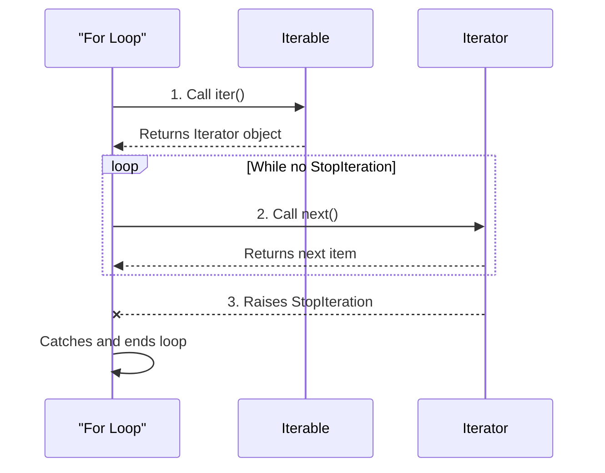
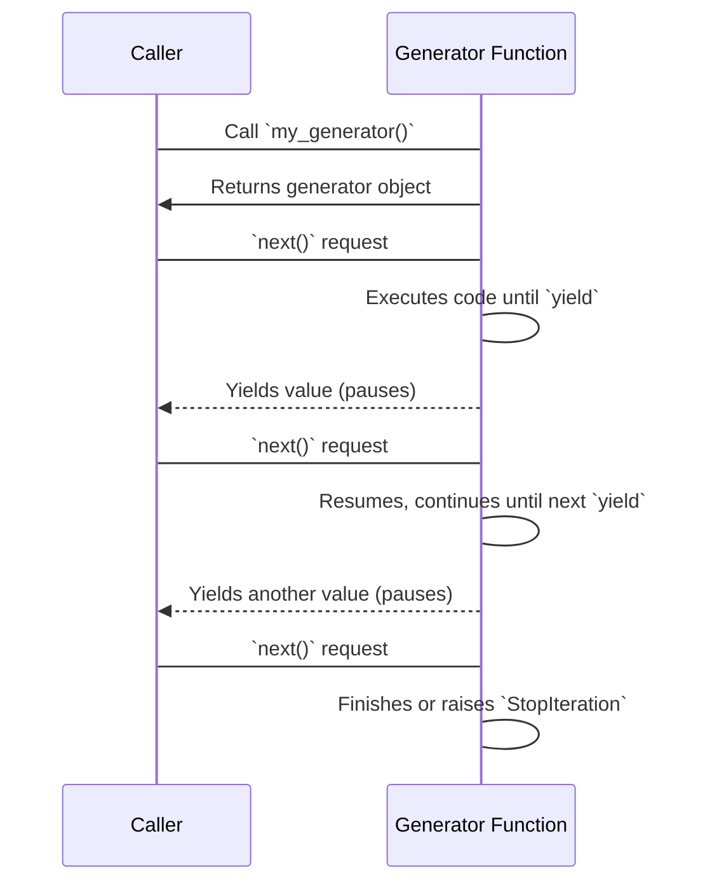
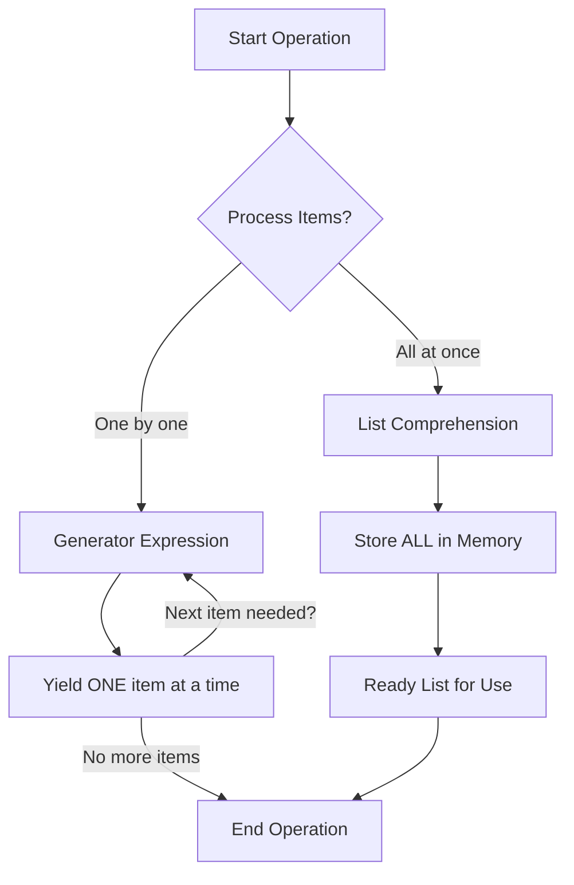
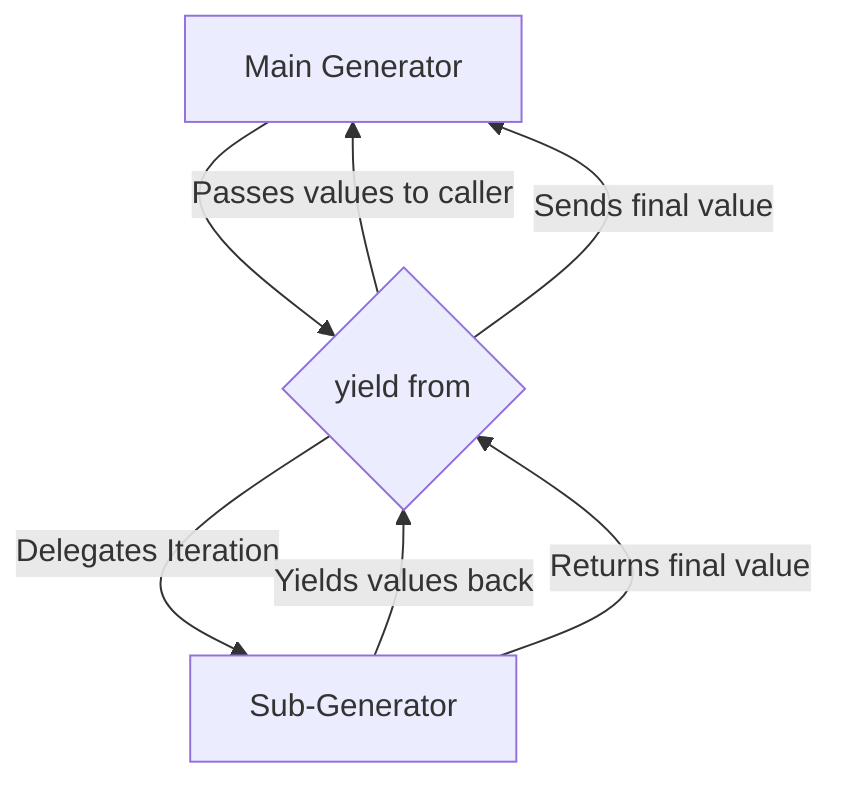

<!--
meta-description: "Complete guide to Python iterators and generators: iterator protocol, custom iterators, generator functions, generator expressions, yield statement, send() and throw() methods. Build memory-efficient, high-performance Python applications."
keywords: "Python iterators, generators, iterator protocol, __iter__, __next__, yield statement, generator functions, generator expressions, memory efficiency, lazy evaluation, custom iterators, StopIteration, send() method, Python performance"
-->

# <span style="color:#e67e22;">What we will learn in this post?</span>
<ul style='list-style-type: none; padding-left: 0;'>
<li><span style='color: #2980b9; font-size: 20px; font-weight: bold;'>👉</span> <span style='color: #2ecc71; font-size: 18px; font-weight: bold;'>Introduction to Iterators</span></li>
<li><span style='color: #2980b9; font-size: 20px; font-weight: bold;'>👉</span> <span style='color: #2ecc71; font-size: 18px; font-weight: bold;'>Creating Custom Iterators</span></li>
<li><span style='color: #2980b9; font-size: 20px; font-weight: bold;'>👉</span> <span style='color: #2ecc71; font-size: 18px; font-weight: bold;'>Iterables vs Iterators</span></li>
<li><span style='color: #2980b9; font-size: 20px; font-weight: bold;'>👉</span> <span style='color: #2ecc71; font-size: 18px; font-weight: bold;'>Introduction to Generators</span></li>
<li><span style='color: #2980b9; font-size: 20px; font-weight: bold;'>👉</span> <span style='color: #2ecc71; font-size: 18px; font-weight: bold;'>Generator Functions</span></li>
<li><span style='color: #2980b9; font-size: 20px; font-weight: bold;'>👉</span> <span style='color: #2ecc71; font-size: 18px; font-weight: bold;'>Generator Expressions</span></li>
<li><span style='color: #2980b9; font-size: 20px; font-weight: bold;'>👉</span> <span style='color: #2ecc71; font-size: 18px; font-weight: bold;'>Advanced Generator Features</span></li>
<li><span style='color: #2980b9; font-size: 20px; font-weight: bold;'>👉</span> <span style='color: #2ecc71; font-size: 18px; font-weight: bold;'>Conclusion!</span></li>
</ul>

# <span style="color:#e67e22">🌟 Diving into Iterators: Your Data's Best Friend!</span>

## <span style="color:#2980b9">➡️ What are Iterators?</span>

In Python, an *iterator* is a special object designed to give you items from a collection, one by one, without loading everything into memory at once. Think of it like a smart guide that remembers its place and knows how to fetch the *next* thing.

Every iterator implements the **iterator protocol**, which means it has two crucial methods:

*   `__iter__`: This method simply returns the iterator object itself.
*   `__next__`: This is the workhorse! It returns the *next* item from the sequence. When there are no more items left, it graciously raises a `StopIteration` error to signal the end.

This protocol ensures consistent sequential data access across different types of collections.

## <span style="color:#2980b9">🔄 How `for` Loops Dance with Iterators</span>

The `for` loop, a cornerstone of Python, relies entirely on iterators to do its magic! When you write something like `for item in my_list:`, here's the friendly internal conversation happening:

1.  Python first calls `iter()` on `my_list` (which is an *iterable*). This gives you an actual *iterator* object.
2.  Next, the `for` loop repeatedly calls `next()` on this *iterator* to fetch each subsequent `item`.
3.  This happy fetching continues until the `__next__` method raises a `StopIteration` exception. At this point, the `for` loop understands there are no more elements and gracefully concludes its work.

### <span style="color:#8e44ad">💡 `for` Loop Internal Flow:</span>



---
**📚 Resource Link:** For a more in-depth look, explore the official [Python documentation on Iterators](https://docs.python.org/3/glossary.html#term-iterator).

<!--
# <span style="color:#e67e22">Custom Python Iterators: Your Own Data Navigators! 🚀</span>

Ever wanted to loop through your own unique data sequences in Python? That's where **custom iterator classes** come in! They let you define *how* to step through a collection, item by item, similar to how a `for` loop works with lists or tuples. It's super handy for memory-efficient processing or generating sequences on the fly.

## <span style="color:#2980b9">The Dynamic Duo: `__iter__` & `__next__` 🧑‍🤝‍🧑</span>

To create a custom iterator, your class needs just two special methods:

*   **`__iter__(self)`**:
    *   This method is called when Python needs an *iterator* object (e.g., when a `for` loop starts or `iter()` is called).
    *   It *must* return the iterator object itself (`self` is common), and it's where you typically initialize the iteration's state (like a starting count).
*   **`__next__(self)`**:
    *   This is the heart of the iterator! It's called repeatedly to fetch the *next* item in your sequence.
    *   After calculating and returning the next item, it updates the state.
    *   When there are no more items to return, it *must* `raise StopIteration`. This signal tells the calling loop (like `for`) to gracefully stop.

### <span style="color:#8e44ad">Crafting a Custom Range Iterator! 🛠️</span>

Let's build a simple `MyRange` iterator that works like Python's built-in `range`.

```python
class MyRange:
    def __init__(self, start, end):
        self.current = start
        self.end = end

    def __iter__(self):
        # Returns the iterator object itself
        return self 

    def __next__(self):
        if self.current < self.end:
            num = self.current
            self.current += 1
            return num
        else:
            # No more items, signal to stop!
            raise StopIteration 

# Let's see it in action!
print("--- Using MyRange in a for loop ---")
# Output: --- Using MyRange in a for loop ---
for i in MyRange(1, 5):
    print(i)
# Output:
# 1
# 2
# 3
# 4

my_custom_seq = MyRange(10, 13)
iterator_obj = iter(my_custom_seq) # Calls __iter__
print("\n--- Manual Iteration with next() ---")
# Output:
# --- Manual Iteration with next() ---
print(next(iterator_obj)) # Calls __next__, returns 10
# Output: 10
print(next(iterator_obj)) # Calls __next__, returns 11
# Output: 11
print(next(iterator_obj)) # Calls __next__, returns 12
# Output: 12
# print(next(iterator_obj)) # This line would raise StopIteration, stopping the process
```

Here’s a simplified flow of how an iterator works:
```mermaid
graph TD
    A[Start `for` loop or `iter()`] --> B{Call `__iter__` on object};
    B --> C[Returns iterator object (`self`)];
    C --> D{Call `__next__` on iterator object};
    D --> E{Are there more items?};
    E -- Yes --> F[Return item];
    F --> D;
    E -- No --> G[Raise `StopIteration`];
    G --> H[Loop/Iteration Ends];
```

For more info, check out the official [Python documentation on iterators](https://docs.python.org/3/glossary.html#term-iterator).
-->

# <span style="color:#e67e22">Understanding Iterables vs. Iterators! 🚶‍♂️📖</span>

Let's demystify two fundamental concepts in Python: iterables and iterators!

---

## <span style="color:#2980b9">The Core Difference ✨</span>

*   **_Iterables_** are objects you *can loop over* (like lists, strings, tuples). Think of them as a *collection* or a *book*. They have an `__iter__` method, which *produces* an iterator.
    *   *Example:* `my_list = [1, 2, 3]` or `my_string = "hello"`

*   **_Iterators_** are objects that *actually keep track* of your current position during iteration. They are like a *bookmark* in the book, telling you where you are and what's `next()`. They have both `__iter__` (returns themselves) and `__next__` methods. When no more items are left, `__next__` raises `StopIteration`.

---

### <span style="color:#8e44ad">What are `iter()` and `next()`? 🛠️</span>

*   `**iter()**` (built-in function): Takes an **iterable** (e.g., a list) and returns an **iterator** object for it. It's how you get that "bookmark."
*   `**next()**` (built-in function): Takes an **iterator** and retrieves the *next item* from it. Each call moves the bookmark forward.

---

### <span style="color:#8e44ad">Example Time! 🍎🍌🍒</span>

```python
# Our iterable: a list of fruits!
fruits = ["apple", "banana", "cherry"] 

# Get an iterator from our iterable using iter()
# The 'fruit_iterator' now remembers its position.
fruit_iterator = iter(fruits) 

# Let's get the next item using next()
print(next(fruit_iterator)) 
# Output: apple

print(next(fruit_iterator)) 
# Output: banana

print(next(fruit_iterator)) 
# Output: cherry

# If you call next() again, it will raise StopIteration because there are no more items.
# print(next(fruit_iterator)) 
```

---

## <span style="color:#2980b9">How it Flows 🔄</span>

```mermaid
graph TD
    A[Iterable (e.g., List, String)] -->|iter() generates| B(Iterator);
    B -->|next() gets| C[Item 1];
    B -->|next() gets| D[Item 2];
    B -->|...| E[Item N];
    E --> F{No more items?};
    F -->|Yes| G[StopIteration];
    F -->|No| B;
```

For more info, check Python's official documentation: [Python Iterators](https://docs.python.org/3/glossary.html#term-iterator)

# <span style="color:#e67e22">✨ Generators: Simple Iterators Made Easy! ✨</span>

Generators offer a *super-smart* way to create **iterators** in Python, using regular functions but with a special twist: the `yield` keyword. Think of them as functions that can *pause* and *resume* their work.

## <span style="color:#2980b9">🔑 How They Work: The `yield` Keyword</span>

Unlike `return`, which sends a value and *ends* the function, `yield` sends a value but keeps the function's state intact. The generator *pauses*, waits for the next request, and then *resumes* right where it left off!



## <span style="color:#2980b9">💡 Why Use Them? Memory Efficiency!</span>

Generators are incredibly **memory-efficient**. They don't build and store all values in memory at once (like a list would). Instead, they *generate values on-the-fly*, one at a time, only when requested. This is fantastic for working with *very large datasets* where storing everything isn't feasible.

## <span style="color:#2980b9">⚖️ Generators vs. Regular Functions</span>

*   **Regular Functions:** `return` a single result and then *exit completely*.
*   **Generator Functions:** `yield` a series of results, *pausing* and *retaining their state* between each yield. They behave like an iterator, allowing you to loop through values.

For more details, check out the official [Python documentation on Iterators](https://docs.python.org/3/glossary.html#term-iterator).

# <span style="color:#e67e22">Generator Functions: Your Data Streamers 🚀</span>

Generator functions are special functions that can *pause* their execution and *resume* later, making them great for handling sequences of data, especially large or infinite ones. They *don't* compute all values at once, but rather provide them *on demand*.

## <span style="color:#2980b9">The Magic of `yield` ✨</span>

Unlike regular functions that `return` a value and exit, generator functions use the `yield` keyword.
*   When `yield` is encountered, the function *pauses* execution, returns the yielded value, and saves its entire state.
*   The next time a value is requested (e.g., using `next()`), the generator *resumes* right from where it left off!

This mechanism enables **lazy evaluation**: values are generated *on demand*, one by one. This is incredibly memory-efficient, especially for large datasets or *infinite sequences*, as you never store the entire sequence in memory.

```mermaid
graph TD
    A[Call generator()] --> B{Request value (e.g., next())};
    B --> C{Execute code until yield};
    C --> D[Yield value, pause execution];
    D -- Another request (next()) --> C;
    C -- No more yields --> E[StopIteration exception];
```

## <span style="color:#2980b9">Examples in Action! 💡</span>

Here's a simple countdown:

```python
def countdown(n):
    print("Starting countdown!") # Runs only once
    while n > 0:
        yield n                  # Pauses, returns 'n'
        n -= 1
    print("Finished!")           # Runs after all yields

my_countdown = countdown(3)
print(next(my_countdown)) # Output: Starting countdown! \n 3
print(next(my_countdown)) # Output: 2
print(next(my_countdown)) # Output: 1
# Calling next() again would raise StopIteration, and "Finished!" would print
```

### <span style="color:#8e44ad">Infinite Sequences ♾️</span>

Generators are perfect for *infinite sequences* because they only generate items as needed.

```python
def natural_numbers():
    n = 1
    while True: # Infinite loop
        yield n
        n += 1

nums = natural_numbers()
print(next(nums)) # Output: 1
print(next(nums)) # Output: 2
# You can keep calling next(nums) forever without running out of memory!
```

**For more info:**
*   [Python Generators Explained](https://realpython.com/introduction-to-python-generators/)

{% include code-playground.html language="python" code="# Python Generators - Fibonacci Sequence Generator

def fibonacci_generator(limit):
    \"\"\"
    Generate Fibonacci numbers up to a limit.
    Demonstrates memory-efficient lazy evaluation.
    \"\"\"
    a, b = 0, 1
    count = 0
    while count < limit:
        yield a
        a, b = b, a + b
        count += 1

def file_reader_simulator(lines):
    \"\"\"
    Simulate reading large files line by line.
    Generators are perfect for processing huge files without loading all into memory.
    \"\"\"
    for i, line in enumerate(lines, 1):
        yield f\"Line {i}: {line}\"

def infinite_counter(start=1):
    \"\"\"
    Infinite sequence generator - runs forever!
    Safe because it generates values on-demand.
    \"\"\"
    n = start
    while True:
        yield n
        n += 1

print(\"PYTHON GENERATORS DEMO\")
print(\"=\" * 60)

# Example 1: Fibonacci sequence
print(\"\\n1️⃣ Fibonacci Sequence (first 10 numbers):\")
fib = fibonacci_generator(10)
fib_list = list(fib)  # Convert generator to list
print(f\"   {fib_list}\")

# Example 2: Sum of first N Fibonacci numbers
print(\"\\n2️⃣ Sum of first 8 Fibonacci numbers:\")
fib_sum = sum(fibonacci_generator(8))
print(f\"   Total: {fib_sum}\")

# Example 3: File reading simulation
print(\"\\n3️⃣ Simulated File Reading:\")
fake_file_lines = [\"Hello World\", \"Python Generators\", \"Memory Efficient\"]
reader = file_reader_simulator(fake_file_lines)
for line in reader:
    print(f\"   {line}\")

# Example 4: Infinite counter (limited to 5)
print(\"\\n4️⃣ Infinite Counter (first 5 numbers):\")
counter = infinite_counter(100)
for _ in range(5):
    print(f\"   {next(counter)}\")

# Example 5: Generator expression (compact syntax)
print(\"\\n5️⃣ Generator Expression - Squares:\")
squares_gen = (x**2 for x in range(1, 6))
print(f\"   {list(squares_gen)}\")

print(\"\\n\" + \"=\" * 60)
print(\"💡 Generators save memory by generating values on-demand!\")
print(\"Try modifying the Fibonacci limit or creating your own generator!\")" height="700" gradient="green" %}
*   [GeeksforGeeks Generators](https://www.geeksforgeeks.org/generators-in-python/)

# <span style="color:#e67e22">🌟 Generator Expressions: Memory-Savvy Iteration!</span>

Generator expressions are a *super cool* and *memory-efficient* way to create iterators in Python. Think of them as "lazy" versions of list comprehensions. Instead of building and storing an entire list in memory all at once, generators *yield* items one by one, *on-the-fly*, as you request them. This makes them perfect for handling vast amounts of data without hogging your computer's memory!

## <span style="color:#2980b9">Syntax Simplicity 📝</span>

Creating a generator expression is incredibly similar to a list comprehension, with one key difference: you use **parentheses `()`** instead of **square brackets `[]`**.

```python
# List Comprehension: Creates an entire list in memory
squares_list = [x*x for x in range(5)]
print(squares_list) # Output: [0, 1, 4, 9, 16]

# Generator Expression: Creates a generator object (doesn't store all values immediately)
squares_gen = (x*x for x in range(5))
print(squares_gen)  # Output: <generator object <genexpr> at 0x...>
print(list(squares_gen)) # Output: [0, 1, 4, 9, 16] (consumes the generator)
```

## <span style="color:#2980b9">List Comps vs. Generators: The Key Difference ⚖️</span>

*   **List Comprehensions**:
    *   _What it does_: Builds and stores *all* results as a complete list in memory immediately.
    *   _Best for_: When you need a full list, or will iterate over the results *multiple times*.
*   **Generator Expressions**:
    *   _What it does_: Generates values *lazily* (only when requested), one at a time.
    *   _Best for_: When memory efficiency is critical, or you only need to iterate *once*.

## <span style="color:#2980b9">When to Use Which? 🤔</span>

*   _Choose **List Comprehensions** when:_
    *   You need a *complete list* of results.
    *   You'll *iterate multiple times* over the collection.
    *   Your dataset is *small to moderate* in size.

*   _Choose **Generator Expressions** when:_
    *   Working with *very large datasets* where memory is a concern.
    *   You only need to *iterate once* through the data.
    *   You want to create efficient processing pipelines.

### <span style="color:#8e44ad">Visualizing the Difference 💡</span>



For more insights into Python generators, explore this [Real Python Guide](https://realpython.com/introduction-to-python-generators/)!

# <span style="color:#e67e22">Advanced Generator Magic ✨</span>

Python's generators are powerful, but `send()`, `throw()`, and `yield from` take them to the next level, enabling sophisticated two-way communication and delegation!

---

## <span style="color:#2980b9">Talking Back with `send()` 🗣️</span>

The `send()` method lets you *send a value* into a paused generator. When a generator `yield`s, it pauses, and `send()` resumes it, making the sent value the result of that `yield` expression. This enables powerful **two-way communication**.

```python
def talker():
    print("Generator activated!")
    message = yield "Hello?" # Yields and waits
    print(f"Generator got: {message}")
    yield "Nice to talk!"

gen = talker()
print(gen.send(None)) # Primes the generator, starts it
# Output:
# Generator activated!
# Hello?
print(gen.send("Hi there!")) # Sends "Hi there!" to the 'yield'
# Output:
# Generator got: Hi there!
# Nice to talk!
```

---

## <span style="color:#2980b9">Handling Surprises with `throw()` 🚨</span>

The `throw()` method allows you to *inject an exception* into a generator at its current `yield` point. The generator can then use a `try...except` block to **handle the error internally** or simply let it propagate, giving you more control over its execution.

```python
def error_catcher():
    try:
        yield "Ready for input!"
        yield "Still good!"
    except ValueError as e:
        print(f"Caught error: {e}!")
        yield "Error handled!"

gen = error_catcher()
print(next(gen)) # Prime
# Output: Ready for input!
print(next(gen))
# Output: Still good!
print(gen.throw(ValueError, "Something broke!")) # Injects ValueError
# Output:
# Caught error: Something broke!!
# Error handled!
```

---

## <span style="color:#2980b9">Delegating Duties with `yield from` 🤝</span>

The `yield from` expression is a neat way to *delegate* iteration and communication to a **sub-generator** or any other iterable. It automatically handles `send()`, `throw()`, and `close()` calls, passing them to the sub-generator, and also captures its final return value.

```python
def sub_gen_items():
    yield "Sub-item 1"
    yield "Sub-item 2"
    return "Sub-finished!"

def main_delegator():
    print("Main generator starting...")
    result = yield from sub_gen_items() # Delegates to sub_gen_items()
    print(f"Sub-generator said: {result}")
    yield "Main continuing!"

gen = main_delegator()
print(next(gen))
# Output:
# Main generator starting...
# Sub-item 1
print(next(gen))
# Output: Sub-item 2
print(next(gen))
# Output:
# Sub-generator said: Sub-finished!
# Main continuing!
```



---

### <span style="color:#8e44ad">Want to Learn More? 📚</span>

For deeper dives into generators, check out the [Python documentation on Generators](https://docs.python.org/3/glossary.html#term-generator).

---

## <span style="color:#9e9e9e">🎯 Hands-On Assignment</span>

<details>
<summary><strong>💡 Project: Data Stream Processing Pipeline</strong> (Click to expand)</summary>
<br>
<p><strong>🚀 Your Challenge:</strong></p>
<p>Build a <strong>Data Stream Processing Pipeline</strong> using iterators and generators to efficiently process large datasets without loading everything into memory. Your system should handle log files, CSV data, and implement custom filtering and transformations. 📊✨</p>

<p><strong>📋 Requirements:</strong></p>

<p><strong>Part 1: Custom Iterator for Log File Reader</strong></p>
<ul>
<li>Create a <code>LogFileIterator</code> class that implements the iterator protocol</li>
<li>Implement <code>__iter__</code> and <code>__next__</code> methods</li>
<li>Read log files line by line (don't load entire file into memory)</li>
<li>Raise <code>StopIteration</code> when file ends</li>
<li>Include ability to filter lines by log level (INFO, WARNING, ERROR)</li>
</ul>

<p><strong>Part 2: Generator Functions for Data Processing</strong></p>
<ul>
<li>Create a generator function <code>parse_csv_lines(filename)</code> that yields parsed rows</li>
<li>Implement <code>filter_by_condition(data, condition)</code> generator that filters items</li>
<li>Build <code>transform_data(data, transform_func)</code> generator for transformations</li>
<li>Create <code>batch_data(data, batch_size)</code> generator that yields batches</li>
<li>Implement <code>take_n(data, n)</code> generator that yields first n items</li>
</ul>

<p><strong>Part 3: Generator Pipeline</strong></p>
<ul>
<li>Chain multiple generators to create a processing pipeline</li>
<li>Implement lazy evaluation (process data on-demand)</li>
<li>Calculate statistics using generator expressions</li>
<li>Demonstrate memory efficiency with large datasets</li>
</ul>

<p><strong>💡 Implementation Hints:</strong></p>
<ul>
<li>Use <code>yield</code> to make functions generators 🔄</li>
<li>Remember iterators maintain state between calls 📍</li>
<li>Chain generators with function composition 🔗</li>
<li>Use <code>try-finally</code> in custom iterators for cleanup 🧹</li>
<li>Generator expressions are memory-efficient alternatives to list comprehensions 💾</li>
<li>Test with large files to demonstrate lazy evaluation benefits ⚡</li>
<li>Use <code>send()</code> for advanced generator communication 📨</li>
</ul>

<p><strong>Example Input/Output:</strong></p>
<pre>
# Creating log file iterator
log_iterator = LogFileIterator("app.log", level="ERROR")
for line in log_iterator:
    print(line)
# Output: Only ERROR level log lines

# Generator pipeline example
data = parse_csv_lines("users.csv")
adults = filter_by_condition(data, lambda x: int(x['age']) >= 18)
formatted = transform_data(adults, lambda x: f"{x['name']}: {x['age']}")
batches = batch_data(formatted, batch_size=10)

for batch in take_n(batches, 3):
    print(f"Batch of {len(batch)} items")
    print(batch)
# Output: First 3 batches of 10 formatted adult users each

# Memory-efficient sum using generator expression
numbers = (x ** 2 for x in range(1000000))
total = sum(numbers)  # Calculates without storing all million numbers
print(f"Sum of squares: {total}")
</pre>

<p><strong>🌟 Bonus Challenges:</strong></p>
<ul>
<li>Implement infinite generators (e.g., <code>fibonacci_generator()</code>) 🔢</li>
<li>Create a <code>parallel_process()</code> generator using <code>yield from</code> 🔀</li>
<li>Build a stateful generator using <code>send()</code> for two-way communication 💬</li>
<li>Implement generator-based coroutines for concurrent processing ⚙️</li>
<li>Add <code>throw()</code> and <code>close()</code> methods for error handling 🛑</li>
<li>Create a circular buffer iterator with fixed size 🔄</li>
<li>Build a generator that reads from multiple files simultaneously 📂</li>
<li>Implement memory profiling to show efficiency gains 📊</li>
</ul>

<p><strong>Submission Guidelines:</strong></p>
<ul>
<li>Test with both small and large datasets (>1GB files) 🧪</li>
<li>Demonstrate lazy evaluation (data processed on-demand, not all at once) ⚡</li>
<li>Compare memory usage: generators vs list-based approach 💾</li>
<li>Include timing comparisons for performance 🕐</li>
<li>Handle exceptions and file cleanup properly ⚠️</li>
<li>Share your complete code with example output 📝</li>
<li>Explain when to use iterators vs generators vs lists 📖</li>
</ul>

<p><strong>Share Your Solution! 💬</strong></p>
<p>Completed the project? <strong>Post your code in the comments below!</strong> Show us your mastery of iterators and generators, and share your performance benchmarks! 🚀✨</p>

</details>

---

<h1><span style='color:#e67e22'>Conclusion</span></h1>
And there you have it! I truly hope you enjoyed diving into this topic with me today. ✨ Your thoughts and experiences are incredibly important, and they make this community so much richer. What did you think? Do you have any tips, feedback, or perhaps a different perspective to share? Don't be shy! Please drop your comments and suggestions below. I'm genuinely excited to read them all and continue the conversation! 👇 Let's connect! 😊

