```mermaid
graph TD
    A["1️⃣ Define decorator_factory(arg)"]:::pink --> B{"2️⃣ Use @decorator_factory(arg)<br>on a function"}:::gold;
    B --> C["3️⃣ Python calls decorator_factory(arg)"]:::purple;
    C --> D["4️⃣ decorator_factory returns actual_decorator_function"]:::teal;
    D --> E["5️⃣ Python calls actual_decorator_function(original_func)"]:::orange;
    E --> F["6️⃣ actual_decorator_function returns wrapper_function"]:::green;
    F -- "When original_func is called later" --> G{"7️⃣ wrapper_function(*args, **kwargs) executes"}:::pink;
    G --> H["8️⃣ Decorator logic before calling original_func"]:::gold;
    H --> I["9️⃣ Calls original_func(*args, **kwargs)"]:::purple;
    I --> J["🔟 Decorator logic after calling original_func"]:::teal;
    J --> K["1️⃣1️⃣ Returns final result ✨"]:::orange;

    classDef pink fill:#ff4f81,stroke:#c43e3e,color:#fff,font-size:13px,stroke-width:2px,rx:10,shadow:4px;
    classDef gold fill:#ffd700,stroke:#d99120,color:#222,font-size:13px,stroke-width:2px,rx:10,shadow:4px;
    classDef purple fill:#6b5bff,stroke:#4a3f6b,color:#fff,font-size:13px,stroke-width:2px,rx:10,shadow:4px;
    classDef teal fill:#00bfae,stroke:#005f99,color:#fff,font-size:13px,stroke-width:2px,rx:10,shadow:4px;
    classDef orange fill:#ff9800,stroke:#f57c00,color:#fff,font-size:13px,stroke-width:2px,rx:10,shadow:4px;
    classDef green fill:#43e97b,stroke:#38f9d7,color:#fff,font-size:13px,stroke-width:2px,rx:10,shadow:4px;

    linkStyle 0,1,2,3,4,5,6,7,8,9 stroke:#e67e22,stroke-width:2px;
```

```mermaid
graph TD
    START["📋 Class Definition"]:::pink --> APPLY{"🎯 Apply @decorator"}:::gold
    APPLY --> RECEIVE["⚙️ Decorator Receives Class"]:::purple
    RECEIVE --> MODIFY["✨ Decorator Enhances Class"]:::teal
    MODIFY --> RETURN["🎁 Return Modified Class"]:::orange
    RETURN --> READY["✅ Enhanced Class Ready!"]:::green

    classDef pink fill:#ff4f81,stroke:#c43e3e,color:#fff,font-size:16px,stroke-width:3px,rx:14,shadow:6px;
    classDef gold fill:#ffd700,stroke:#d99120,color:#222,font-size:16px,stroke-width:3px,rx:14,shadow:6px;
    classDef purple fill:#6b5bff,stroke:#4a3f6b,color:#fff,font-size:16px,stroke-width:3px,rx:14,shadow:6px;
    classDef teal fill:#00bfae,stroke:#005f99,color:#fff,font-size:16px,stroke-width:3px,rx:14,shadow:6px;
    classDef orange fill:#ff9800,stroke:#f57c00,color:#fff,font-size:16px,stroke-width:3px,rx:14,shadow:6px;
    classDef green fill:#43e97b,stroke:#38f9d7,color:#fff,font-size:16px,stroke-width:3px,rx:14,shadow:6px;

    class START pink;
    class APPLY gold;
    class RECEIVE purple;
    class MODIFY teal;
    class RETURN orange;
    class READY green;

    linkStyle default stroke:#e67e22,stroke-width:3px;
```

<!--
meta-description: "Master Python decorators: function decorators, decorators with arguments, @wraps for metadata preservation, @property, @staticmethod, @classmethod, class decorators, decorator chaining. Write elegant, reusable Python code with advanced patterns."
keywords: "Python decorators, function decorators, @wraps, functools.wraps, decorator arguments, class decorators, @property, @staticmethod, @classmethod, decorator chaining, decorator patterns, Python metaprogramming, closure, higher-order functions"
-->

# <span style="color:#e67e22;">What we will learn in this post?</span>
<ul style='list-style-type: none; padding-left: 0;'>
<li><span style='color: #2980b9; font-size: 20px; font-weight: bold;'>👉</span> <span style='color: #2ecc71; font-size: 18px; font-weight: bold;'>Introduction to Decorators</span></li>
<li><span style='color: #2980b9; font-size: 20px; font-weight: bold;'>👉</span> <span style='color: #2ecc71; font-size: 18px; font-weight: bold;'>Function Decorators - Basics</span></li>
<li><span style='color: #2980b9; font-size: 20px; font-weight: bold;'>👉</span> <span style='color: #2ecc71; font-size: 18px; font-weight: bold;'>Decorators with Arguments</span></li>
<li><span style='color: #2980b9; font-size: 20px; font-weight: bold;'>👉</span> <span style='color: #2ecc71; font-size: 18px; font-weight: bold;'>Preserving Function Metadata with @wraps</span></li>
<li><span style='color: #2980b9; font-size: 20px; font-weight: bold;'>👉</span> <span style='color: #2ecc71; font-size: 18px; font-weight: bold;'>Common Built-in Decorators</span></li>
<li><span style='color: #2980b9; font-size: 20px; font-weight: bold;'>👉</span> <span style='color: #2ecc71; font-size: 18px; font-weight: bold;'>Class Decorators</span></li>
<li><span style='color: #2980b9; font-size: 20px; font-weight: bold;'>👉</span> <span style='color: #2ecc71; font-size: 18px; font-weight: bold;'>Chaining Multiple Decorators</span></li>
<li><span style='color: #2980b9; font-size: 20px; font-weight: bold;'>👉</span> <span style='color: #2ecc71; font-size: 18px; font-weight: bold;'>Conclusion!</span></li>
</ul>

# <span style="color:#e67e22">Unleash Function Magic with Python Decorators! ✨</span>

## <span style="color:#2980b9">Functions: Python's Superstars! 🧑‍💻</span>

In Python, functions are truly *first-class objects*. This means you can treat them just like any other piece of data! You can:
*   Assign them to variables.
*   Pass them as arguments to other functions.
*   Return them from other functions.

This incredible flexibility is the secret sauce behind many powerful Python features, including decorators!

*For more info:* [Python Functions as First-Class Objects](https://realpython.com/primer-on-python-decorators/#functions-are-first-class-objects)

## <span style="color:#2980b9">Meet Decorators: Your Function Enhancers 🎁</span>

Decorators provide a *super elegant* way to modify or enhance your functions without ever touching their original code. Imagine needing to add a logging message, measure execution time, or even check user permissions for a function. Instead of cluttering its internal logic, you can simply "decorate" it!

You'll spot them by the handy `@` symbol, placed right above a function definition:

```python
@my_decorator
def my_function():
    # ... original code ...
```

This acts like a wrapper, adding extra capabilities *around* your function.

### <span style="color:#8e44ad">How Decorators Work their Charm 🪄</span>
A decorator essentially takes your function, adds some new behavior, and then gives you back an enhanced version of that function. It's like putting a fancy gift wrap around a present!

```mermaid
graph TD
    A["📦 Original Function"]:::pink --> B{"🎨 Decorator"}:::gold
    B --> C["✨ Enhanced Function with Added Behavior"]:::teal

    classDef pink fill:#ff4f81,stroke:#c43e3e,color:#fff,font-size:14px,stroke-width:3px,rx:12,shadow:4px;
    classDef gold fill:#ffd700,stroke:#d99120,color:#222,font-size:14px,stroke-width:3px,rx:12,shadow:4px;
    classDef teal fill:#00bfae,stroke:#005f99,color:#fff,font-size:14px,stroke-width:3px,rx:12,shadow:4px;

    linkStyle 0 stroke:#e67e22,stroke-width:3px;
    linkStyle 1 stroke:#e67e22,stroke-width:3px;
```



This makes your code cleaner, more modular, and incredibly reusable, allowing you to separate concerns beautifully.

*For more info:* [Python Decorators Explained](https://www.programiz.com/python-programming/decorator)

# <span style="color:#e67e22">Unveiling Python Decorators: Your Code's Superpowers! ✨</span>

Python decorators are a super cool feature allowing you to *add functionality* to existing functions without changing their core code. They "wrap" functions, extending their behavior with new features like logging, timing, or access control. (35 words)

## <span style="color:#2980b9">The Wrapper Pattern 🎁</span>

At its heart, a decorator employs the "wrapper pattern." This means it's a function that *takes another function* as input and *returns a brand-new function*. This new function usually contains the original function inside, along with new logic executed before or after it. (46 words)

### <span style="color:#8e44ad">Simple Decorator Example 🛠️</span>

Here's how to create a basic `timer` decorator to measure execution time:

```python
import time

def timer_decorator(func): # 1. The decorator function takes 'func' (the function to be decorated)
    def wrapper(*args, **kwargs): # 2. Defines an inner 'wrapper' function to hold new logic
        start_time = time.time() # Logic added BEFORE the original function runs
        result = func(*args, **kwargs) # 3. Calls the original 'func' with its arguments
        end_time = time.time() # Logic added AFTER the original function runs
        print(f"'{func.__name__}' took {end_time - start_time:.4f} seconds.")
        return result # 4. Returns the result from the original 'func'
    return wrapper # 5. The decorator returns this 'wrapper' function

@timer_decorator # This is Python's syntactic sugar for decoration
def my_slow_function(delay):
    time.sleep(delay)
    return "Done sleeping!"

print(my_slow_function(1))
# Output:
# 'my_slow_function' took 1.0007 seconds.
# Done sleeping!
```

## <span style="color:#2980b9">How Decorators Work Under the Hood 🕵️‍♀️</span>

The `@decorator_name` syntax is merely *syntactic sugar*. When Python sees `@timer_decorator` above `my_slow_function`, it internally translates it to: `my_slow_function = timer_decorator(my_slow_function)`. This means the original `my_slow_function` is *reassigned* to the `wrapper` function returned by `timer_decorator`. So, when you call `my_slow_function()`, you're actually invoking the `wrapper`! (79 words)

```mermaid
graph LR
    START["📋 Original Function: my_func"]:::pink --> DECORATOR["🎨 Decorator: dec(my_func)"]:::gold
    DECORATOR --> WRAPPER["🎁 Returns New Function: wrapper"]:::purple
    WRAPPER --> REASSIGN["🔄 my_func = wrapper"]:::teal
    REASSIGN --> CALL["🚀 Call my_func → Executes wrapper"]:::orange
    CALL --> EXECUTE["✨ Wrapper Calls Original my_func"]:::green

    classDef pink fill:#ff4f81,stroke:#c43e3e,color:#fff,font-size:16px,stroke-width:3px,rx:14,shadow:6px;
    classDef gold fill:#ffd700,stroke:#d99120,color:#222,font-size:16px,stroke-width:3px,rx:14,shadow:6px;
    classDef purple fill:#6b5bff,stroke:#4a3f6b,color:#fff,font-size:16px,stroke-width:3px,rx:14,shadow:6px;
    classDef teal fill:#00bfae,stroke:#005f99,color:#fff,font-size:16px,stroke-width:3px,rx:14,shadow:6px;
    classDef orange fill:#ff9800,stroke:#f57c00,color:#fff,font-size:16px,stroke-width:3px,rx:14,shadow:6px;
    classDef green fill:#43e97b,stroke:#38f9d7,color:#fff,font-size:16px,stroke-width:3px,rx:14,shadow:6px;

    class START pink;
    class DECORATOR gold;
    class WRAPPER purple;
    class REASSIGN teal;
    class CALL orange;
    class EXECUTE green;

    linkStyle default stroke:#e67e22,stroke-width:3px;
```



# <span style="color:#e67e22">🌟 Decorators with Arguments: The Power of Nesting!</span>

Decorators are fantastic for adding features to functions. But what if your *decorator itself* needs special instructions, like telling a logger *how important* a message is? That's when you need decorators that accept arguments!

## <span style="color:#2980b9">🤔 Why Nested Functions (Decorator Factory)?</span>

Regular decorators take *one* argument: the function they're decorating. To give arguments *to the decorator itself*, we need an extra layer. This forms a "decorator factory" pattern, requiring **triple-nested functions**.

### <span style="color:#8e44ad">⚙️ How It Works: The Three Layers</span>

1.  **Outer Function (Decorator Factory):** Takes the arguments for the decorator (e.g., `unit='ms'`). It *returns* the actual decorator.
2.  **Middle Function (The Decorator):** Takes the function you want to decorate (`func`). It *returns* the `wrapper` function.
3.  **Inner Function (The Wrapper):** This is what replaces your original function. It takes `*args` and `**kwargs` of the *original function*, executes the decorating logic, calls the original `func`, and returns its result.

When you use `@my_decorator(arg1)`, Python first calls `my_decorator(arg1)`. This returns the middle decorator function. Then, Python immediately calls *that* returned function with *your original function* as its argument, making it ready to wrap!

---

## <span style="color:#2980b9">🚀 Practical Example 1: Timing Functions</span>

Let's create a decorator to time how long a function takes, allowing us to specify the time unit.

```python
import time

def timer(unit="seconds"): # 1. Outer function takes decorator args
    def decorator(func):   # 2. Middle function takes the decorated func
        def wrapper(*args, **kwargs): # 3. Inner function takes func's args
            start_time = time.time()
            result = func(*args, **kwargs) # Call the original function
            end_time = time.time()
            duration = end_time - start_time

            if unit == "ms":
                duration *= 1000
                print(f"'{func.__name__}' took {duration:.2f} ms")
            else: # Default to seconds
                print(f"'{func.__name__}' took {duration:.2f} seconds")
            return result
        return wrapper
    return decorator

@timer(unit="ms") # Pass "ms" as an argument to our decorator!
def long_running_task(iterations):
    """A task that simulates work."""
    total = 0
    for _ in range(iterations):
        total += 1
    return total

# Output:
# 'long_running_task' took 0.04 ms
long_running_task(1000)

@timer() # No arguments means default unit="seconds"
def another_task():
    time.sleep(0.5)
    return "Done!"

# Output:
# 'another_task' took 0.50 seconds
another_task()
```

---

## <span style="color:#2980b9">📝 Practical Example 2: Simple Logging</span>

Here's a logging decorator where you can customize the message.

```python
def log_activity(message="Function called"): # 1. Outer function
    def decorator(func):               # 2. Middle function
        def wrapper(*args, **kwargs):    # 3. Inner function
            print(f"LOG: {message} -> '{func.__name__}' with args: {args}, kwargs: {kwargs}")
            result = func(*args, **kwargs)
            print(f"LOG: '{func.__name__}' finished, returned: {result}")
            return result
        return wrapper
    return decorator

@log_activity(message="Performing calculation") # Custom message
def calculate_sum(a, b):
    return a + b

# Output:
# LOG: Performing calculation -> 'calculate_sum' with args: (5, 3), kwargs: {}
# LOG: 'calculate_sum' finished, returned: 8
print(calculate_sum(5, 3))

@log_activity() # Use default message
def greet(name):
    return f"Hello, {name}!"

# Output:
# LOG: Function called -> 'greet' with args: ('Alice',), kwargs: {}
# LOG: 'greet' finished, returned: Hello, Alice!
print(greet("Alice"))
```

{% include code-playground.html language="python" code="# Python Decorators - Timing and Logging

import time

def timer(unit=\"seconds\"):
    \"\"\"
    Decorator with arguments to time function execution.
    Demonstrates decorator factory pattern (triple nesting).
    \"\"\"
    def decorator(func):
        def wrapper(*args, **kwargs):
            start_time = time.time()
            result = func(*args, **kwargs)
            end_time = time.time()
            duration = end_time - start_time
            
            if unit == \"ms\":
                duration *= 1000
                print(f\"⏱️  '{func.__name__}' took {duration:.2f} ms\")
            else:
                print(f\"⏱️  '{func.__name__}' took {duration:.4f} seconds\")
            return result
        return wrapper
    return decorator

def log_activity(message=\"Function called\"):
    \"\"\"Logging decorator with custom message\"\"\"
    def decorator(func):
        def wrapper(*args, **kwargs):
            print(f\"📝 LOG: {message} -> '{func.__name__}'({args}, {kwargs})\")
            result = func(*args, **kwargs)
            print(f\"✅ LOG: '{func.__name__}' returned: {result}\")
            return result
        return wrapper
    return decorator

# Apply decorators
@timer(unit=\"ms\")
def calculate_fibonacci(n):
    \"\"\"Calculate nth Fibonacci number\"\"\"
    if n <= 1:
        return n
    return calculate_fibonacci(n-1) + calculate_fibonacci(n-2)

@log_activity(message=\"Performing addition\")
def add_numbers(a, b):
    return a + b

@timer()
@log_activity(message=\"Processing data\")
def process_data(items):
    \"\"\"Simulate data processing\"\"\"
    time.sleep(0.1)
    return sum(items)

print(\"PYTHON DECORATORS DEMO\")
print(\"=\" * 60)

print(\"\\n1️⃣ Timer Decorator (milliseconds):\")
result1 = calculate_fibonacci(10)
print(f\"   Fibonacci(10) = {result1}\")

print(\"\\n2️⃣ Logging Decorator:\")
result2 = add_numbers(5, 3)

print(\"\\n3️⃣ Stacked Decorators (timer + logging):\")
result3 = process_data([1, 2, 3, 4, 5])

print(\"\\n\" + \"=\" * 60)
print(\"💡 Decorators add functionality without modifying the original function!\")
print(\"Try creating your own decorator with arguments!\")" height="700" gradient="purple" %}

---

## <span style="color:#2980b9">📊 Visualizing the Flow</span>



---

# <span style="color:#e67e22">Decorators & Lost Metadata: `functools.wraps` to the Rescue! 🛠️</span>

## <span style="color:#2980b9">The Metadata Mystery: What's Lost? 🧐</span>

When you use a *decorator* in Python, it essentially wraps your original function with a new, temporary "wrapper" function. The problem is, this wrapper often *forgets* important details like the original function's `__name__` (its actual name) and `__doc__` (its documentation string). This can make debugging, introspection, and automated documentation confusing, as tools will see the wrapper's info instead of your function's valuable metadata!

### <span style="color:#8e44ad">Before `functools.wraps` (The Mix-Up)</span>

Let's see how metadata gets replaced:

```python
def my_decorator(func):
    def wrapper(*args, **kwargs): # This is the "new" function
        """I am the wrapper's doc!"""
        print(f"Wrapper says: Calling {func.__name__}...")
        return func(*args, **kwargs)
    return wrapper

@my_decorator
def say_hi(name):
    """Says hi to someone."""
    return f"Hi, {name}!"

print(f"Function Name: {say_hi.__name__}") # Expected: say_hi, Actual: wrapper
print(f"Docstring: {say_hi.__doc__}")     # Expected: Says hi to someone., Actual: I am the wrapper's doc!
```
*Output:*
```
# Function Name: wrapper
# Docstring: I am the wrapper's doc!
```

---

## <span style="color:#2980b9">`functools.wraps`: The Metadata Magician! 🧙‍♂️</span>

`functools.wraps` is a special decorator *for your wrapper function* inside your main decorator. You apply it by passing the *original* function (`func`) to `@wraps(func)`. Its job is to efficiently *copy* all the essential metadata (like `__name__`, `__doc__`, `__module__`, `__annotations__`) from that original function over to your wrapper. This magic ensures the decorated function *looks* and *behaves* like the original when inspected, preserving its true identity even with added functionality. It's crucial for writing well-behaved, transparent decorators!

### <span style="color:#8e44ad">After `functools.wraps` (Clarity Restored!)</span>

See how `wraps` fixes it:

```python
from functools import wraps

def my_decorator_fixed(func):
    @wraps(func) # ✨ The magic line! This copies metadata from 'func' to 'wrapper'.
    def wrapper(*args, **kwargs):
        """I am the wrapper's doc! (This will be overwritten by original func's doc)"""
        print(f"Wrapper says: Calling {func.__name__}...")
        return func(*args, **kwargs)
    return wrapper

@my_decorator_fixed
def say_hello(name):
    """Says hello to someone."""
    return f"Hello, {name}!"

print(f"Function Name: {say_hello.__name__}") # Expected & Actual: say_hello
print(f"Docstring: {say_hello.__doc__}")     # Expected & Actual: Says hello to someone.
```
*Output:*
```
# Function Name: say_hello
# Docstring: Says hello to someone.
```

---

## <span style="color:#2980b9">How `wraps` Works Visually 📈</span>


# <span style="color:#e67e22">Python's Built-in Decorators: Your Code's Superpowers!</span> ✨

```mermaid
graph TD
    A["📋 Original Function<br>(e.g., say_hello)"]:::pink --> B{"🎯 Decorator<br>my_decorator_fixed"}:::gold
    B -- "Passes func to wraps" --> C["⚙️ Wrapper Function<br>(wrapper)"]:::purple
    C -- "@wraps(func) copies<br>__name__, __doc__, etc." --> D["✨ Wrapper with<br>Original Metadata"]:::teal
    D --> E["🎁 Decorated Function<br>(Behaves like say_hello)"]:::green

    classDef pink fill:#ff4f81,stroke:#c43e3e,color:#fff,font-size:14px,stroke-width:3px,rx:12,shadow:4px;
    classDef gold fill:#ffd700,stroke:#d99120,color:#222,font-size:14px,stroke-width:3px,rx:12,shadow:4px;
    classDef purple fill:#6b5bff,stroke:#4a3f6b,color:#fff,font-size:14px,stroke-width:3px,rx:12,shadow:4px;
    classDef teal fill:#00bfae,stroke:#005f99,color:#fff,font-size:14px,stroke-width:3px,rx:12,shadow:4px;
    classDef green fill:#43e97b,stroke:#38f9d7,color:#fff,font-size:14px,stroke-width:3px,rx:12,shadow:4px;

    linkStyle 0,1,2,3 stroke:#e67e22,stroke-width:3px;
```

Decorators are like magic wrappers for your functions or methods. They let you add extra features or change behavior *without altering the original code directly*. Let's explore some incredibly useful ones:

---

## <span style="color:#2980b9">1. `@property`: Smart Attributes!</span> 🏠

This decorator transforms a method into an attribute. You access it like data, but behind the scenes, a method runs! It's fantastic for *calculated values* or adding *validation* when setting data.

```python
class Circle:
    def __init__(self, radius):
        self._radius = radius # Private convention

    @property
    def area(self): # Accessed like circle.area, but calculates!
        return 3.14159 * self._radius ** 2

my_circle = Circle(5)
print(f"Circle Area: {my_circle.area}") # Output: Circle Area: 78.53975
```

### <span style="color:#8e44ad">Why Use It?</span>
*   **Encapsulation**: Control how attributes are accessed/modified.
*   **Readability**: Makes calculated values look like simple variables.

```mermaid
graph TD
    A["🔍 Access: my_object.attribute"]:::pink --> B{"❓ Is it @property?"}:::gold
    B -- "✅ Yes" --> C["⚙️ Execute the decorated method"]:::purple
    B -- "❌ No" --> D["📂 Access direct attribute"]:::teal
    C --> E["🎁 Return computed/validated value"]:::green
    D --> E

    classDef pink fill:#ff4f81,stroke:#c43e3e,color:#fff,font-size:14px,stroke-width:3px,rx:12,shadow:4px;
    classDef gold fill:#ffd700,stroke:#d99120,color:#222,font-size:14px,stroke-width:3px,rx:12,shadow:4px;
    classDef purple fill:#6b5bff,stroke:#4a3f6b,color:#fff,font-size:14px,stroke-width:3px,rx:12,shadow:4px;
    classDef teal fill:#00bfae,stroke:#005f99,color:#fff,font-size:14px,stroke-width:3px,rx:12,shadow:4px;
    classDef green fill:#43e97b,stroke:#38f9d7,color:#fff,font-size:14px,stroke-width:3px,rx:12,shadow:4px;

    linkStyle 0,1,2,3,4 stroke:#e67e22,stroke-width:3px;
```



---

## <span style="color:#2980b9">2. `@staticmethod`: Class Helper!</span> 🛠️

Use `@staticmethod` for functions that logically belong to a class but *don't need access to the instance (`self`)* or *the class itself (`cls`)*. Think of them as regular functions living inside a class for better organization.

```python
class MathUtils:
    @staticmethod
    def add(a, b): # No 'self' or 'cls' needed
        return a + b

    @staticmethod
    def multiply(a, b):
        return a * b

print(f"5 + 3 = {MathUtils.add(5, 3)}")       # Output: 5 + 3 = 8
print(f"4 * 2 = {MathUtils.multiply(4, 2)}") # Output: 4 * 2 = 8
```

### <span style="color:#8e44ad">Why Use It?</span>
*   **Organization**: Group related utility functions.
*   **Clarity**: Signals that the method doesn't interact with instance/class state.

```mermaid
graph TD
    A["📞 Call: Class.static_method(args)"]:::pink --> B{"🤔 Needs 'self' or 'cls'?"}:::gold
    B -- "❌ No" --> C["🚀 Execute method independently"]:::teal
    C --> D["✅ Return result"]:::green

    classDef pink fill:#ff4f81,stroke:#c43e3e,color:#fff,font-size:14px,stroke-width:3px,rx:12,shadow:4px;
    classDef gold fill:#ffd700,stroke:#d99120,color:#222,font-size:14px,stroke-width:3px,rx:12,shadow:4px;
    classDef teal fill:#00bfae,stroke:#005f99,color:#fff,font-size:14px,stroke-width:3px,rx:12,shadow:4px;
    classDef green fill:#43e97b,stroke:#38f9d7,color:#fff,font-size:14px,stroke-width:3px,rx:12,shadow:4px;

    linkStyle 0,1,2 stroke:#e67e22,stroke-width:3px;
```



---

## <span style="color:#2980b9">3. `@classmethod`: Class Creator/Manager!</span> 🏭

This decorator means the method receives the *class itself* (`cls`) as its first argument, instead of an instance (`self`). It's perfect for *factory methods* that create instances in different ways or manage class-level data.

```python
class User:
    def __init__(self, name, age):
        self.name = name
        self.age = age

    @classmethod
    def from_birth_year(cls, name, birth_year): # 'cls' refers to the User class
        current_year = 2023
        age = current_year - birth_year
        return cls(name, age) # Creates a User instance

user1 = User("Alice", 30)
user2 = User.from_birth_year("Bob", 1990)
print(f"{user1.name} is {user1.age} years old.") # Output: Alice is 30 years old.
print(f"{user2.name} is {user2.age} years old.") # Output: Bob is 33 years old.
```

### <span style="color:#8e44ad">Why Use It?</span>
*   **Alternative Constructors**: Create objects from various input formats.
*   **Class-level Logic**: Operations that concern the class as a whole.

```mermaid
graph TD
    A["📞 Call: Class.class_method(args)"]:::pink --> B["🎯 Pass 'cls' (the Class itself)"]:::gold
    B --> C["⚙️ Method uses 'cls' to:"]:::purple
    C -- "🏗️ Create new instance: cls(...)" --> D["🎁 Return new instance"]:::green
    C -- "📊 Access/modify class-level data" --> D

    classDef pink fill:#ff4f81,stroke:#c43e3e,color:#fff,font-size:14px,stroke-width:3px,rx:12,shadow:4px;
    classDef gold fill:#ffd700,stroke:#d99120,color:#222,font-size:14px,stroke-width:3px,rx:12,shadow:4px;
    classDef purple fill:#6b5bff,stroke:#4a3f6b,color:#fff,font-size:14px,stroke-width:3px,rx:12,shadow:4px;
    classDef green fill:#43e97b,stroke:#38f9d7,color:#fff,font-size:14px,stroke-width:3px,rx:12,shadow:4px;

    linkStyle 0,1,2,3 stroke:#e67e22,stroke-width:3px;
```



---

## <span style="color:#2980b9">4. `@functools.lru_cache`: Speedy Memory!</span> 🚀

`@functools.lru_cache` (Least Recently Used Cache) *memorizes* the results of expensive function calls. If you call the function again with the *same inputs*, it instantly returns the stored result, saving computation time!

```python
import functools
import time

@functools.lru_cache(maxsize=None) # Cache indefinitely
def calculate_expensive_value(num):
    print(f"Calculating for {num}...")
    time.sleep(1) # Imagine a heavy computation/API call
    return num * 100

start = time.time()
print(f"Result 1: {calculate_expensive_value(10)}") # First call: takes ~1 sec
print(f"Result 2: {calculate_expensive_value(20)}") # Another calculation: takes ~1 sec
print(f"Result 3: {calculate_expensive_value(10)}") # Instant! Fetched from cache
end = time.time()
print(f"Total time taken: {end - start:.2f} seconds") # Should be around 2 seconds
```

### <span style="color:#8e44ad">Why Use It?</span>
*   **Performance Boost**: Dramatically speed up functions with repeated calls and identical inputs.
*   **Efficiency**: Avoid redundant computations for *pure functions* (functions that always produce the same output for the same input and have no side effects).

```mermaid
graph TD
    A["📞 Function Call (func(args))"]:::pink --> B{"🔍 Are 'args' in cache?"}:::gold
    B -- "✅ Yes" --> C["⚡ Return cached result instantly"]:::green
    B -- "❌ No" --> D["⚙️ Execute func(args)"]:::purple
    D --> E["💾 Store result in cache"]:::teal
    E --> C

    classDef pink fill:#ff4f81,stroke:#c43e3e,color:#fff,font-size:14px,stroke-width:3px,rx:12,shadow:4px;
    classDef gold fill:#ffd700,stroke:#d99120,color:#222,font-size:14px,stroke-width:3px,rx:12,shadow:4px;
    classDef purple fill:#6b5bff,stroke:#4a3f6b,color:#fff,font-size:14px,stroke-width:3px,rx:12,shadow:4px;
    classDef teal fill:#00bfae,stroke:#005f99,color:#fff,font-size:14px,stroke-width:3px,rx:12,shadow:4px;
    classDef green fill:#43e97b,stroke:#38f9d7,color:#fff,font-size:14px,stroke-width:3px,rx:12,shadow:4px;

    linkStyle 0,1,2,3,4 stroke:#e67e22,stroke-width:3px;
```



---


# <span style="color:#e67e22">✨ Understanding Class Decorators ✨</span>

## <span style="color:#2980b9">🤔 What are Class Decorators?</span>

Class decorators are special functions that can "wrap" or *enhance* your Python classes. Imagine giving your class a superpower! When you place `@my_decorator` right above a class definition, Python automatically passes your class to that `my_decorator` function. This decorator then works its magic, perhaps adding new methods, changing attributes, or even modifying how instances are created, before returning the *enhanced* class.

## <span style="color:#2980b9">🛠️ How They Work</span>

Essentially, `my_decorator` takes the original class object as its input, does some processing to it, and then returns a modified version of that class. It's a powerful way to alter class behavior dynamically and keep your code clean and reusable, without changing the class's internal structure directly.

### <span style="color:#8e44ad">🚀 Common Use Cases & Examples</span>

**Adding Methods:** Easily attach common functionalities, like a `log_info` method, to multiple classes without repeating code.

```python
def add_log_method(cls):
    def log(self, message):
        print(f"[{cls.__name__}] {message}")
    cls.log = log
    return cls

@add_log_method
class Product:
    def __init__(self, name):
        self.name = name
        self.log(f"{name} created.")

# p = Product("Widget") # Output: [Product] Widget created.
# p.log("Price updated.") # Output: [Product] Price updated.
```

**Registering Classes:** Automatically add classes to a central registry when they are defined, useful for plugins or factory patterns.

```python
COMMAND_REGISTRY = {}

def register_command(cls):
    COMMAND_REGISTRY[cls.__name__] = cls
    return cls

@register_command
class StartCommand:
    def execute(self):
        print("Starting system...")

# print(COMMAND_REGISTRY) # Output: {'StartCommand': <class '__main__.StartCommand'>}
```

**Singleton Pattern:** Ensure only *one* instance of a particular class can ever exist throughout your application, saving resources and managing state efficiently.

```python
def singleton(cls):
    instances = {}
    def get_instance(*args, **kwargs):
        if cls not in instances:
            instances[cls] = cls(*args, **kwargs)
        return instances[cls]
    return get_instance

@singleton
class AppConfig:
    def __init__(self):
        print("Loading app configuration...") # This prints only once

# config1 = AppConfig()
# config2 = AppConfig()
# print(config1 is config2) # Output: True (They are the exact same instance)
```

## <span style="color:#2980b9">🗺️ How it Flows</span>



---

# <span style="color:#e67e22">Decorating Functions: A Layered Approach! ✨</span>

Imagine adding several layers of functionality to your function! Python decorators let you wrap your functions, each layer adding new behavior without changing the core code. You simply stack them one above the other, making your code cleaner and more modular.

## <span style="color:#2980b9">Application & Wrapping Order: Bottom-Up Magic! ⬆️</span>

When you apply multiple decorators using the `@` syntax, they are processed from *bottom to top*. This means the decorator closest to your function definition (`@deco_B` in our example) is applied first, wrapping the original function. Then, the decorator above it (`@deco_A`) wraps the result of the first decorator. Conceptually, it's like `deco_A(deco_B(your_function))`.

```python
@deco_A  # This decorator is applied *last* in the wrapping chain
@deco_B  # This decorator is applied *first* in the wrapping chain
def my_function():
    pass
```

## <span style="color:#2980b9">Runtime Execution Order: Top-Down & Back Up! 🔄</span>

When you *call* a function wrapped with multiple decorators, the execution flow is slightly different. The *outermost* decorator (`deco_A`) starts execution first. It performs its "before" logic, then calls the next inner decorator (`deco_B`). This continues until the original function is called. After the original function completes, the decorators "unwind" in reverse order, from *inner* (`deco_B`) to *outer* (`deco_A`), performing their "after" logic.

Here's how it flows when the decorated function is invoked:

```mermaid
%%{init: {'theme':'base', 'themeVariables': { 'primaryColor':'#ff4f81','primaryTextColor':'#fff','primaryBorderColor':'#c43e3e','lineColor':'#e67e22','secondaryColor':'#ffd700','tertiaryColor':'#6b5bff','noteBkgColor':'#00bfae','noteTextColor':'#fff','noteBorderColor':'#005f99'}}}%%
sequenceDiagram
    participant Caller as 📞 Caller
    participant DecoA as 🎨 Decorator A (Outer)
    participant DecoB as 🎯 Decorator B (Inner)
    participant OriginalFunc as 📦 Original Function

    rect rgb(255, 79, 129, 0.1)
    Caller->>DecoA: Call decorated_func()
    activate DecoA
    Note over DecoA: 🔄 Before Logic (A)
    DecoA->>DecoA: Do "before" logic (Deco A)
    end
    
    rect rgb(255, 215, 0, 0.1)
    DecoA->>DecoB: Call inner_wrapped_func()
    activate DecoB
    Note over DecoB: 🔄 Before Logic (B)
    DecoB->>DecoB: Do "before" logic (Deco B)
    end
    
    rect rgb(107, 91, 255, 0.1)
    DecoB->>OriginalFunc: Call original_func()
    activate OriginalFunc
    Note over OriginalFunc: ⚙️ Core Execution
    OriginalFunc->>OriginalFunc: Execute core logic
    end
    
    rect rgb(0, 191, 174, 0.1)
    OriginalFunc-->>DecoB: Return result ✅
    deactivate OriginalFunc
    Note over DecoB: 🔙 After Logic (B)
    DecoB->>DecoB: Do "after" logic (Deco B)
    DecoB-->>DecoA: Return result ✅
    deactivate DecoB
    end
    
    rect rgb(255, 152, 0, 0.1)
    Note over DecoA: 🔙 After Logic (A)
    DecoA->>DecoA: Do "after" logic (Deco A)
    DecoA-->>Caller: Return final result 🎁
    deactivate DecoA
    end
```


*(This diagram illustrates the runtime call sequence.)*

### <span style="color:#8e44ad">Practical Use Cases 🛠️</span>

Multiple decorators are super useful for adding various functionalities in a clean, reusable way:

*   **Authentication & Permissions**: `@login_required`, `@requires_admin`
*   **Logging & Monitoring**: `@log_execution_time`, `@log_errors`
*   **Data Handling**: `@cache_result`, `@validate_input`
*   **Rate Limiting**: `@rate_limit(calls=5, period=60)`

## <span style="color:#2980b9">Live Example! 🧪</span>

Let's see the order in action with a simple Python example:

```python
# A decorator that prints before and after
def deco_A(func):
    def wrapper(*args, **kwargs):
        print("--- deco_A: Before calling function ---") # OUT: --- deco_A: Before calling function ---
        result = func(*args, **kwargs)
        print("--- deco_A: After calling function ---")  # OUT: --- deco_A: After calling function ---
        return result
    return wrapper

# Another decorator with similar behavior
def deco_B(func):
    def wrapper(*args, **kwargs):
        print("--- deco_B: Before calling function ---") # OUT: --- deco_B: Before calling function ---
        result = func(*args, **kwargs)
        print("--- deco_B: After calling function ---")  # OUT: --- deco_B: After calling function ---
        return result
    return wrapper

@deco_A # Outer decorator (top)
@deco_B # Inner decorator (bottom)
def greet(name):
    print(f"Hello, {name}!") # OUT: Hello, Alice!
    return f"Greeted {name}"

# Call the decorated function
greet("Alice")
```

**Output Explanation:**
Notice how `deco_A`'s "before" message appears first (outermost decorator), then `deco_B`'s (next inner), then the original function. On the way back, `deco_B`'s "after" runs (inner completes first), then `deco_A`'s "after" (outermost completes last).

---

## <span style="color:#ab47bc">🎯 Hands-On Assignment</span>

<details>
<summary><strong>💡 Project: Professional Decorator Library</strong> (Click to expand)</summary>
<br>
<p><strong>🚀 Your Challenge:</strong></p>
<p>Build a <strong>Production-Ready Decorator Library</strong> with commonly-used decorators for web applications, APIs, and data processing. Your library should include timing, caching, authentication, logging, retry logic, and validation decorators. 🎨✨</p>

<p><strong>📋 Requirements:</strong></p>

<p><strong>Part 1: Performance Decorators</strong></p>
<ul>
<li>Create <code>@timer</code> decorator that measures function execution time</li>
<li>Implement <code>@memoize</code> decorator for caching function results</li>
<li>Build <code>@rate_limit(max_calls, time_window)</code> to limit function calls</li>
<li>Create <code>@benchmark(iterations)</code> that runs functions multiple times</li>
<li>Support both functions and methods</li>
</ul>

<p><strong>Part 2: Robustness Decorators</strong></p>
<ul>
<li>Implement <code>@retry(max_attempts, delay)</code> for automatic retries</li>
<li>Create <code>@timeout(seconds)</code> that raises exception if function takes too long</li>
<li>Build <code>@suppress_exceptions(exception_types)</code> error handler</li>
<li>Implement <code>@validate_args(**validators)</code> for argument validation</li>
<li>Create <code>@deprecated(message)</code> to mark outdated functions</li>
</ul>

<p><strong>Part 3: Security & Logging Decorators</strong></p>
<ul>
<li>Build <code>@require_auth(roles)</code> for role-based access control</li>
<li>Create <code>@log_calls(level, message_format)</code> for detailed logging</li>
<li>Implement <code>@audit_trail</code> to track function calls and results</li>
<li>Build <code>@sanitize_input</code> to clean user input before processing</li>
</ul>

<p><strong>Part 4: Class Decorators & Advanced Features</strong></p>
<ul>
<li>Create <code>@singleton</code> class decorator for single instance pattern</li>
<li>Implement <code>@add_methods</code> to dynamically add methods to classes</li>
<li>Build <code>@register</code> decorator that adds classes to a registry</li>
<li>Chain multiple decorators together for complex behavior</li>
<li>Use <code>functools.wraps</code> to preserve function metadata</li>
</ul>

<p><strong>💡 Implementation Hints:</strong></p>
<ul>
<li>Always use <code>@functools.wraps</code> to preserve original function metadata 📝</li>
<li>Use <code>*args, **kwargs</code> to handle any function signature 🎭</li>
<li>Store cache/state using function attributes or closures 💾</li>
<li>Consider thread-safety for shared state decorators 🔒</li>
<li>Use <code>time.time()</code> or <code>time.perf_counter()</code> for timing ⏱️</li>
<li>Decorators with arguments need three levels of nesting 🎯</li>
<li>Class decorators can modify or wrap entire classes 🏗️</li>
<li>Test edge cases: recursion, exceptions, None returns ⚠️</li>
</ul>

<p><strong>Example Usage:</strong></p>
<pre>
# Import your decorator library
from decorators import timer, memoize, retry, require_auth, log_calls

# Performance decorators
@timer
@memoize
def fibonacci(n):
    if n <= 1:
        return n
    return fibonacci(n-1) + fibonacci(n-2)

print(fibonacci(35))  # First call: slow, then cached
# Output: Execution time: 0.0001s (cached after first call)

# Robustness decorators
@retry(max_attempts=3, delay=1)
@timeout(5)
def fetch_data(url):
    response = requests.get(url)
    return response.json()

data = fetch_data("https://api.example.com/data")
# Output: Retries on failure, times out after 5 seconds

# Security decorator
@require_auth(roles=['admin', 'moderator'])
@log_calls(level='INFO', message_format='{func_name} called by {user}')
def delete_user(user_id, current_user):
    print(f"Deleting user {user_id}")
    return True

delete_user(123, current_user={'name': 'Alice', 'role': 'admin'})
# Output: Logs call, checks auth, executes function

# Class decorator
@singleton
class Database:
    def __init__(self):
        self.connection = "Connected"

db1 = Database()
db2 = Database()
print(db1 is db2)  # Output: True (same instance)

# Chaining decorators
@timer
@memoize
@validate_args(n=lambda x: x >= 0)
@log_calls(level='DEBUG')
def factorial(n):
    return 1 if n <= 1 else n * factorial(n-1)

print(factorial(10))
# Output: Validated, timed, cached, logged
</pre>

<p><strong>🌟 Bonus Challenges:</strong></p>
<ul>
<li>Implement <code>@async_timer</code> for async functions using <code>asyncio</code> ⚡</li>
<li>Create <code>@circuit_breaker</code> pattern for fault tolerance 🔌</li>
<li>Build <code>@profile_memory</code> to track memory usage 📊</li>
<li>Implement <code>@conditional(predicate)</code> that applies decorator conditionally 🎛️</li>
<li>Create <code>@curry</code> decorator for partial function application 🍛</li>
<li>Build <code>@parallel</code> decorator for concurrent execution using threads/processes 🔀</li>
<li>Implement <code>@type_check</code> using type hints for runtime validation 🔍</li>
<li>Create decorator factory that generates custom decorators 🏭</li>
</ul>

<p><strong>Submission Guidelines:</strong></p>
<ul>
<li>Organize decorators into logical modules (performance.py, security.py, etc.) 📁</li>
<li>Write comprehensive docstrings with usage examples 📖</li>
<li>Include unit tests for each decorator 🧪</li>
<li>Handle edge cases and errors gracefully ⚠️</li>
<li>Demonstrate decorator chaining with real examples 🔗</li>
<li>Show performance improvements with benchmarks 📈</li>
<li>Document any limitations or gotchas 📝</li>
<li>Share your complete decorator library with examples 🎁</li>
</ul>

<p><strong>Share Your Solution! 💬</strong></p>
<p>Completed the project? <strong>Post your decorator library in the comments below!</strong> Show us your most creative decorators and how they solve real-world problems! 🚀✨</p>

</details>

---

<h1><span style='color:#e67e22'>Conclusion</span></h1>
And there you have it! I truly hope you enjoyed diving into today's topic with me. What are your thoughts? Do you have any tips to add, or perhaps a different experience to share? I'd love to hear it! Please feel free to drop your comments, feedback, or even just a friendly hello in the section below. Let's keep the conversation going! ✨💬

