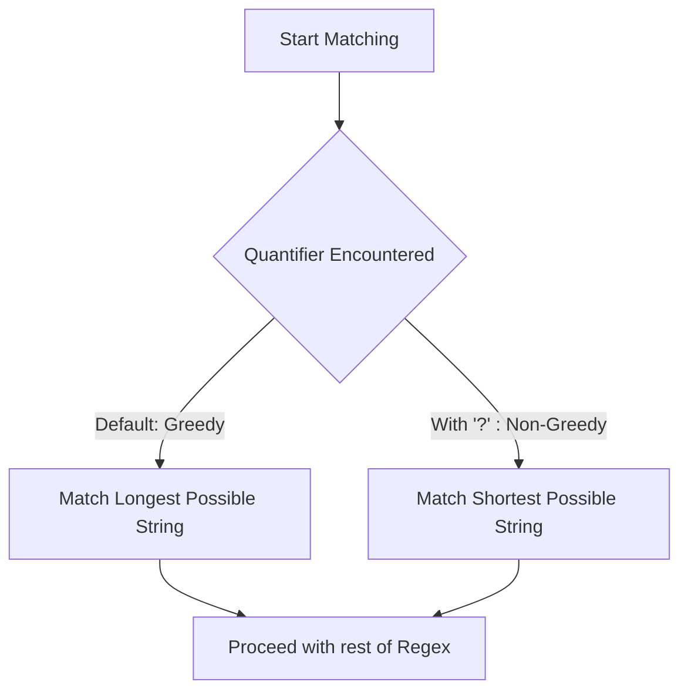
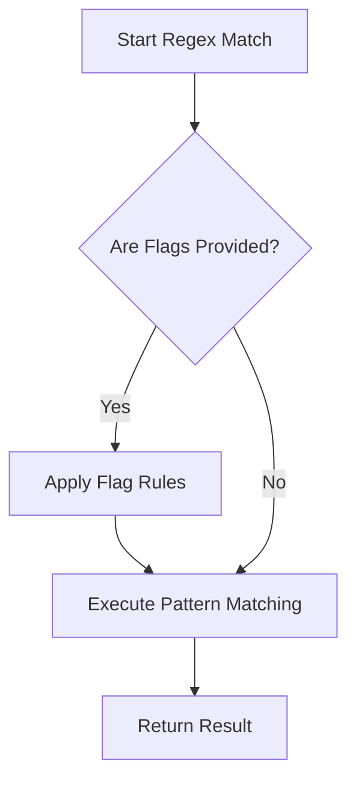
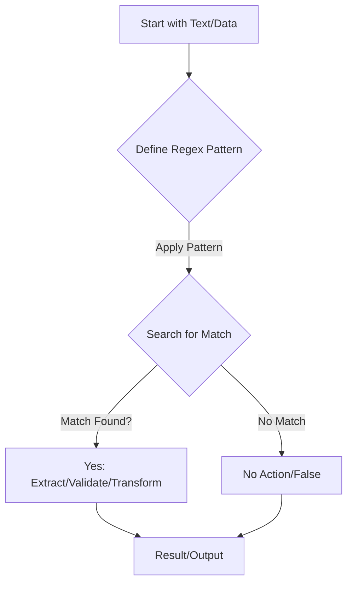

## <span style="color:#2980b9">Spotting Patterns: `re.match()` vs `re.search()` 🎯</span>

These functions help determine if a pattern exists within a string. They return a *match object* if successful, otherwise `None`.

*   `re.match(pattern, string)`: Searches for the pattern *only at the very beginning* of the string.
    ```python
    import re
    text = "Hello world"
    print(re.match(r"Hello", text)) # <re.Match object; span=(0, 5), match='Hello'>
    print(re.match(r"world", text))  # None (because 'world' isn't at the start)
    ```

*   `re.search(pattern, string)`: Scans the *entire string* to find the *first* place the pattern matches.
    ```python
    text = "Hello world"
    print(re.search(r"world", text)) # <re.Match object; span=(6, 11), match='world'>
    ```

Here's a quick visual to understand the difference:

```mermaid
graph TD
    A[Start String Scan] --> B{Does pattern exist at BEGINNING?};
    B -- Yes --> C[re.match() returns Match Object];
    B -- No --> D[re.match() returns None];
    A --> E{Does pattern exist ANYWHERE?};
    E -- Yes, first match --> F[re.search() returns Match Object];
    E -- No --> G[re.search() returns None];
```

---

## <span style="color:#2980b9">Finding All Occurrences: `re.findall()` & `re.finditer()` 🕵️‍♀️</span>

Need to grab *all* instances of a specific pattern? These are your friends!

*   `re.findall(pattern, string)`: Returns a *list* of all non-overlapping matches as strings.
    ```python
    text = "cat and dog and cat"
    print(re.findall(r"cat", text)) # ['cat', 'cat']
    ```

*   `re.finditer(pattern, string)`: Returns an *iterator* yielding match objects for all matches. This is handy for getting more detailed information (like starting position) for each match.
    ```python
    text = "cat and dog and cat"
    for m in re.finditer(r"cat", text):
        print(f"Found '{m.group()}' at index {m.start()}")
    # Found 'cat' at index 0
    # Found 'cat' at index 14
    ```

---

## <span style="color:#2980b9">Changing & Splitting Text: `re.sub()` & `re.split()` ✍️</span>

Regex isn't just for finding; it can transform and break apart text too!

*   `re.sub(pattern, replacement, string)`: *Substitutes* (replaces) all occurrences of the pattern with the specified replacement string.
    ```python
    text = "Call me at 123-456-7890 anytime."
    print(re.sub(r"\d{3}-\d{3}-\d{4}", "HIDDEN", text)) # Call me at HIDDEN anytime.
    ```

*   `re.split(pattern, string)`: *Splits* the string by occurrences of the pattern, returning a list of substrings.
    ```python
    text = "apple,banana;orange"
    print(re.split(r"[,;]", text)) # ['apple', 'banana', 'orange']
    ```

---

**Further Learning:**
*   **Official Python `re` Docs:** [docs.python.org/3/library/re.html](https://docs.python.org/3/library/re.html)
*   **Interactive Regex Tutorial:** [regexone.com](https://regexone.com/)

# <span style="color:#e67e22">Unleash the Power of Regex! 🚀</span>

Ever needed to find specific text patterns or validate inputs? Regular Expressions, or *Regex*, are incredibly powerful tools for searching, matching, and manipulating strings. Let's explore the fundamental building blocks in a friendly, easy-to-understand way!

---

## <span style="color:#2980b9">1. Literal Characters: The Exact Match 🎯</span>

Most characters in a regex pattern simply match *themselves* exactly. They're like plain text!

*   `hello` will literally match the word "hello".

```regex
hello
```
```
# Input: "hello world"
# Output: Match found: "hello"
```

---

## <span style="color:#2980b9">2. Metacharacters: The Special Symbols ✨</span>

These characters have special meanings, allowing you to create more flexible and dynamic patterns.

### <span style="color:#8e44ad">`.` (Dot): Any Single Character 📝</span>
*   Matches *any single character* (except a newline).
*   Example: `a.b` matches `axb`, `a b`, `acb`.

```regex
a.b
```
```
# Input: "axb", "a b", "acb", "ab"
# Output: Match found: "axb", "a b", "acb" (No match for "ab")
```

### <span style="color:#8e44ad">`^` and `$` (Anchors): Start & End ⚓</span>
*   `^`: Matches the *beginning* of a string.
*   `$`: Matches the *end* of a string.
*   Example: `^start` matches "start here" but not "let's start".

```regex
^start
```
```
# Input: "start here", "let's start"
# Output: Match found: "start" (from "start here")
```

### <span style="color:#8e44ad">`*`, `+`, `?` (Quantifiers): How Many? 🔢</span>
These specify how many times the *preceding* element can repeat.

*   `*`: Zero or more times. `ab*c` matches `ac`, `abc`, `abbc`.
*   `+`: One or more times. `ab+c` matches `abc`, `abbc` but not `ac`.
*   `?`: Zero or one time. `ab?c` matches `ac`, `abc`.

```regex
ab+c
```
```
# Input: "abc", "abbc", "ac"
# Output: Match found: "abc", "abbc" (No match for "ac")
```

### <span style="color:#8e44ad">`{}` (Quantifier): Specific Counts 📏</span>
*   Matches a specific number of times. `a{3}b` matches `aaab`.
*   `a{2,4}b` matches `aab`, `aaab`, `aaaab`.

```regex
a{2,4}b
```
```
# Input: "aab", "aaab", "aaaab", "ab"
# Output: Match found: "aab", "aaab", "aaaab" (No match for "ab")
```

### <span style="color:#8e44ad">`[]` (Character Sets): Any of These 🎁</span>
*   Matches *any single character* found *inside* the brackets.
*   `[aeiou]` matches any vowel. `[0-9]` matches any digit. `[a-z]` matches any lowercase letter.

```regex
[aeiou]
```
```
# Input: "apple", "banana"
# Output: Match found: "a", "e" (from apple), "a", "a", "a" (from banana)
```

### <span style="color:#8e44ad">`\` (Escape Character): Take it Literally 🛡️</span>
*   Removes the special meaning of a metacharacter. To match a literal `.` or `*`, use `\.` or `\*`.
*   Example: `\.com` matches ".com".

```regex
\.com
```
```
# Input: "example.com"
# Output: Match found: ".com"
```

---

## <span style="color:#2980b9">3. Special Sequences: Handy Shortcuts! ⚡</span>

These are pre-defined character classes, making common patterns easier to write.

### <span style="color:#8e44ad">`\d`, `\w`, `\s`: Common Patterns 🧩</span>
*   `\d`: Matches any **digit** (0-9). (Same as `[0-9]`)
*   `\w`: Matches any **word character** (alphanumeric + underscore: `a-zA-Z0-9_`).
*   `\s`: Matches any **whitespace character** (space, tab, newline, etc.).
*   Example: `\d{3}-\d{3}-\d{4}` matches phone numbers like "123-456-7890".

```regex
\d{3}-\d{3}-\d{4}
```
```
# Input: "My number is 123-456-7890."
# Output: Match found: "123-456-7890"
```

---

### Regex Concepts Flow 🌊
```mermaid
graph TD
    A[Start Regex Pattern] --> B{Literal Characters};
    A --> C{Metacharacters};
    A --> D{Special Sequences};

    C --> C1(Quantifiers: * + ? {});
    C --> C2(Anchors: ^ $);
    C --> C3(Character Sets: []);
    C --> C4(Escape Character: \);

    D --> D1(\d: Digit);
    D --> D2(\w: Word Char);
    D --> D3(\s: Whitespace);

    B -- or --> E[Match Text];
    C -- or --> E;
    D -- or --> E;
```

---

### Learn More! 📚
*   **Regexr.com**: An awesome online tool to test and learn regex interactively. [Visit Regexr](https://regexr.com/)
*   **MDN Web Docs - Regular Expressions**: A comprehensive guide to regex. [Read MDN Docs](https://developer.mozilla.org/en-US/docs/Web/JavaScript/Guide/Regular_expressions)

---

Regular expressions might look a bit like magic at first, but mastering these basics opens up a world of text manipulation possibilities! Keep practicing! ✨

<!--
# <span style="color:#e67e22">Regex Quantifiers: The Power of Repetition! 🚀</span>

Regular expressions (regex) use *quantifiers* to specify how many times a character, group, or character class can appear. They make your patterns flexible and incredibly powerful!

## <span style="color:#2980b9">Meet the Common Quantifiers ✨</span>

*   `*` (Asterisk): Matches the preceding element *zero or more* times. It's like saying "optional, and can repeat".
    *   _Example:_ `a*b` matches "b", "ab", "aaab".
*   `+` (Plus): Matches the preceding element *one or more* times. It must appear at least once.
    *   _Example:_ `a+b` matches "ab", "aaab", but *not* "b".
*   `?` (Question Mark): Matches the preceding element *zero or one* time. It makes an element completely optional.
    *   _Example:_ `colou?r` matches "color" or "colour".
*   `{n}` (Exactly n): Matches the preceding element *exactly `n`* times.
    *   _Example:_ `a{3}` matches "aaa".
*   `{n,m}` (Between n and m): Matches the preceding element *at least `n` and at most `m`* times.
    *   _Example:_ `a{2,4}` matches "aa", "aaa", "aaaa".

## <span style="color:#2980b9">Greedy vs. Non-Greedy Matching ⚖️</span>

By default, all quantifiers (`*`, `+`, `?`, `{n}`, `{n,m}`) are *greedy*. This means they try to match the *longest possible* string that still allows the overall regex to succeed.

*   **Greedy Example:** `"<.*>"` on `<h1>Hello</h1>` matches the *entire* `<h1>Hello</h1>`.

To make a quantifier *non-greedy* (or *lazy*), simply add a `?` right after it (e.g., `*?`, `+?`, `??`, `{n,m}?`). A non-greedy quantifier matches the *shortest possible* string.

*   **Non-Greedy Example:** `"<.*?>"` on `<h1>Hello</h1>` matches `<h1>` *and* `</h1>` as two separate matches.



### <span style="color:#8e44ad">Further Reading 📚</span>
For more in-depth examples, check out: [MDN Web Docs: Regular expressions - Quantifiers](https://developer.mozilla.org/en-US/docs/Web/JavaScript/Guide/Regular_expressions/Quantifiers)
-->

# <span style="color:#e67e22">Regex Grouping Magic! ✨</span>

Regular expressions use _parentheses_ `()` to **group** parts of a pattern, treating them as a single unit. This is super handy for applying quantifiers (`+`, `*`) to multiple characters or for *capturing specific pieces* of your match.

## <span style="color:#2980b9">Capturing Groups `()` 📦</span>

When you use `()`, you're not just grouping; you're also **capturing** the text that matches inside. These groups are automatically numbered from left to right, starting from `1`.

```python
import re
text = "My phone is 123-456-7890."
pattern = r"(\d{3})-(\d{3})-(\d{4})" # Three capturing groups for phone parts
match = re.search(pattern, text)
if match:
    print(match.group(0)) # The entire matched string: "123-456-7890"
    print(match.group(1)) # First captured group: "123"
    print(match.group(2)) # Second captured group: "456"
    print(match.group(3)) # Third captured group: "7890"
```

## <span style="color:#2980b9">Non-Capturing Groups `(?:)` 👻</span>

Need to group but *don't* want to capture the text? That's what `(?:)` is for! It groups patterns together for things like applying quantifiers or alternation, but it **doesn't** create a backreference or consume a group number. Great for efficiency!

```python
# Example: Match "colour" or "color"
# Pattern with capturing: (colou?r)  -> "colou" or "colo" is captured
# Pattern with non-capturing: (?:colou?r) -> No part is captured, just the whole match
```

## <span style="color:#2980b9">Named Groups `(?P<name>)` 🏷️</span>

Forget remembering group numbers! With `(?P<your_name>pattern)`, you can give your capturing groups a *name*. This makes your regular expressions much clearer and easier to manage when accessing specific parts.

```python
# Example for a date:
pattern_named = r"(?P<year>\d{4})-(?P<month>\d{2})-(?P<day>\d{2})"
match_named = re.search(pattern_named, "Date: 2023-10-26")
if match_named:
    print(match_named.group("year"))  # Access by name: "2023"
    print(match_named.group("month")) # Access by name: "10"
    print(match_named.group("day"))   # Access by name: "26"
```

### <span style="color:#8e44ad">Accessing Captured Groups 🤝</span>

After a successful match, you can retrieve the captured content using methods like `match.group()`. Access numbered groups by their index (e.g., `match.group(1)`) and named groups by their assigned name (e.g., `match.group("year")`).

---

```mermaid
graph TD
    A[Start Grouping] --> B{Do I need to save this part of the match?};
    B -- Yes --> C(Use Capturing Group: (pattern));
    C --> D{Do I want to give it a memorable name?};
    D -- Yes --> E(Use Named Group: (?P<name>pattern));
    D -- No --> F(Access by number: group(1), group(2)...);
    B -- No --> G(Use Non-Capturing Group: (?:pattern));
    E --> H(Access by name: group("name"));
    F --> I(End);
    G --> I(End);
    H --> I(End);
```

**For more info:**
*   [Regular-Expressions.info on Groups](https://www.regular-expressions.info/brackets.html)
*   [Python's `re` module documentation](https://docs.python.org/3/library/re.html#re.match.group)

 # <span style="color:#e67e22">Regex Flags: Powering Your Patterns! 🚀</span>

Regex flags are like special switches that change how your regular expressions work. They offer extra control, making your pattern matching more flexible and powerful!

## <span style="color:#2980b9">How Flags Modify Matching ✨</span>

This simple chart shows how flags fit into the pattern matching process:

For more in-depth information, you can check the official [Python `re` module documentation](https://docs.python.org/3/library/re.html).

---

### <span style="color:#2980b9">1. `re.IGNORECASE` (or `re.I`) 🔡</span>
*This flag makes your pattern match both uppercase and lowercase letters.* It's fantastic for case-insensitive searches.

```python
import re
pattern = r"apple"
text = "Apple pie, apple crisp."
match = re.search(pattern, text, re.IGNORECASE)
print(match.group()) # Output: Apple
```

### <span style="color:#2980b9">2. `re.MULTILINE` (or `re.M`) 📜</span>
*Normally, `^` matches the string's start and `$` its end.* `re.MULTILINE` makes `^` match the start of *each line*, and `$` the end of *each line* within the string.

```python
pattern = r"^Line"
text = "First Line\nSecond Line"
match = re.search(pattern, text, re.MULTILINE)
print(match.group()) # Output: Line
```

### <span style="color:#2980b9">3. `re.DOTALL` (or `re.S`) 🎯</span>
*By default, the dot (`.`) matches any character *except* a newline (`\n`).* `re.DOTALL` makes `.` match *all* characters, including those pesky newlines.

```python
pattern = r"hello.world"
text = "hello\nworld"
match = re.search(pattern, text, re.DOTALL)
print(match.group()) # Output: hello\nworld
```

### <span style="color:#2980b9">4. `re.VERBOSE` (or `re.X`) 💡</span>
*This flag allows you to write more readable regex by ignoring whitespace and letting you add comments.* It helps break down complex patterns.

```python
pattern = r"""
    hello   # Matches the word "hello"
    \s+     # Matches one or more whitespace characters
    world   # Matches the word "world"
"""
text = "hello world"
match = re.search(pattern, text, re.VERBOSE)
print(match.group()) # Output: hello world
```

# <span style="color:#e67e22">Practical Regex Adventures! 🚀</span>

Regular Expressions (Regex) are powerful tools for pattern matching in text. They help us find, validate, extract, or replace specific text strings efficiently. Let's dive into some practical examples!

## <span style="color:#2980b9">Understanding the Regex Flow 💡</span>

Here's a simple way to visualize how Regex works:



---

## <span style="color:#2980b9">Everyday Regex Use Cases ✨</span>

Let's see Regex in action with Python's `re` module.

```python
import re

# --- 📧 Email Validation ---
# Checks if a string looks like a valid email address.
email_pattern = r"^[a-zA-Z0-9._%+-]+@[a-zA-Z0-9.-]+\.[a-zA-Z]{2,}$"
test_email = "user@example.com"
is_valid_email = bool(re.match(email_pattern, test_email))
print(f"'{test_email}' is valid: {is_valid_email}") # Output: 'user@example.com' is valid: True

# --- 📞 Phone Number Formatting ---
# Cleans and formats phone numbers into a standard (XXX) XXX-XXXX format.
phone_number = "123.456.7890"
cleaned_phone = re.sub(r"[^\d]", "", phone_number) # Removes non-digits
formatted_phone = re.sub(r"(\d{3})(\d{3})(\d{4})", r"(\1) \2-\3", cleaned_phone)
print(f"Formatted phone: {formatted_phone}") # Output: Formatted phone: (123) 456-7890

# --- 🔗 URL Extraction ---
# Finds all URLs (HTTP/HTTPS) within a given text.
text_with_urls = "Visit us at https://www.example.com or our blog http://blog.test.org for more info."
extracted_urls = re.findall(r"https?://[^\s]+", text_with_urls)
print(f"Extracted URLs: {extracted_urls}") # Output: Extracted URLs: ['https://www.example.com', 'http://blog.test.org']

# --- 🔒 Password Strength Checking ---
# A simple check: at least 8 chars, 1 uppercase, 1 lowercase, 1 digit.
password_pattern = r"^(?=.*[a-z])(?=.*[A-Z])(?=.*\d)[a-zA-Z\d]{8,}$"
strong_password = "MyP@ssw0rd!"
is_strong = bool(re.match(password_pattern, strong_password))
print(f"Is '{strong_password}' strong: {is_strong}") # Output: Is 'MyP@ssw0rd!' strong: True

# --- 🧹 Data Cleaning ---
# Removes special characters, keeping only letters, numbers, and spaces.
dirty_data = "Hello, world! This is some data with @symbols & numbers 123."
cleaned_data = re.sub(r"[^a-zA-Z0-9\s]", "", dirty_data)
print(f"Cleaned data: {cleaned_data}") # Output: Cleaned data: Hello world This is some data with symbols  numbers 123
```

Regex is an indispensable skill for developers and data professionals, making text manipulation tasks much easier!

---

### <span style="color:#8e44ad">Further Learning 📚</span>
*   For a deeper dive into Regex, check out [RegexOne](https://regexone.com/) for interactive tutorials!

<h1><span style='color:#e67e22'>Conclusion</span></h1>
Well, we've covered quite a bit today! 😊 I hope you found something inspiring or thought-provoking. Now it's your turn! I'm genuinely curious to hear what you think. Did this post spark any ideas for you? Do you have a different perspective, or perhaps some extra tips to share? Don't hold back! Pop your comments, feedback, or even just a quick hello down in the section below. 👇 Let's build on this conversation together! Thanks for reading! ✨

