<!--
meta-description: "Master Python Regular Expressions (regex) with this comprehensive guide: re module functions, pattern matching, quantifiers, capturing groups, regex flags, and real-world applications for email validation, data extraction, and text processing. Build powerful text manipulation skills with practical examples."
keywords: "Python regex, regular expressions, re module, pattern matching, text processing, email validation, data extraction, regex quantifiers, capturing groups, regex flags, re.search, re.findall, re.sub, Python text manipulation, regex tutorial, phone number validation"
-->

# <span style="color:#e67e22;">What we will learn in this post?</span>
<ul style='list-style-type: none; padding-left: 0;'>
<li><span style='color: #2980b9; font-size: 20px; font-weight: bold;'>👉</span> <span style='color: #2ecc71; font-size: 18px; font-weight: bold;'>Introduction to Regular Expressions</span></li>
<li><span style='color: #2980b9; font-size: 20px; font-weight: bold;'>👉</span> <span style='color: #2ecc71; font-size: 18px; font-weight: bold;'>The re Module</span></li>
<li><span style='color: #2980b9; font-size: 20px; font-weight: bold;'>👉</span> <span style='color: #2ecc71; font-size: 18px; font-weight: bold;'>Basic Regex Patterns</span></li>
<li><span style='color: #2980b9; font-size: 20px; font-weight: bold;'>👉</span> <span style='color: #2ecc71; font-size: 18px; font-weight: bold;'>Quantifiers and Repetition</span></li>
<li><span style='color: #2980b9; font-size: 20px; font-weight: bold;'>👉</span> <span style='color: #2ecc71; font-size: 18px; font-weight: bold;'>Groups and Capturing</span></li>
<li><span style='color: #2980b9; font-size: 20px; font-weight: bold;'>👉</span> <span style='color: #2ecc71; font-size: 18px; font-weight: bold;'>Regex Flags and Options</span></li>
<li><span style='color: #2980b9; font-size: 20px; font-weight: bold;'>👉</span> <span style='color: #2ecc71; font-size: 18px; font-weight: bold;'>Practical Regex Applications</span></li>
<li><span style='color: #2980b9; font-size: 20px; font-weight: bold;'>👉</span> <span style='color: #2ecc71; font-size: 18px; font-weight: bold;'>Conclusion!</span></li>
</ul>

# <span style="color:#e67e22">Regex: Your Text Superpower! ✨</span>

Imagine needing to find specific information or check text rules in a big pile of words. That's where *Regular Expressions*, or *regex*, come in! They're a special, incredibly powerful language for describing and matching text patterns. Think of them as super-smart search and replace tools that understand complex sequences, not just exact words.

## <span style="color:#2980b9">Why Use Regex? Common Magic! 🪄</span>

Regex helps computers understand text in a structured way, unlocking many possibilities:

### <span style="color:#8e44ad">1. Validation ✅</span>
Quickly check if an email (`user@domain.com`), phone number, or password meets specific format rules before accepting it.

### <span style="color:#8e44ad">2. Smart Searching 🕵️‍♀️</span>
Find all URLs on a webpage, specific keywords, or even patterns like dates (`DD-MM-YYYY`) within large documents with incredible precision.

### <span style="color:#8e44ad">3. Data Extraction ✂️</span>
Pull out just the names, prices, or product codes from raw, unstructured text, making data cleanup and analysis much easier.

Regex uses a *pattern* of characters (like `\d+` for 'one or more digits') to tell the computer precisely what to look for. It's a concise way to communicate complex text needs.

```mermaid
graph TD
    A["📧 Text Input:<br/>My email is user@example.com"]:::pink --> B{"🔍 Regex Pattern:<br/>\\w+@\\w+\\.\\w+"}:::gold
    B --> C{"❓ Match Found?"}:::purple
    C -- "✅ Yes" --> D["📋 Extracted Data:<br/>user@example.com"]:::green
    C -- "❌ No" --> E["🚫 No Match"]:::orange

    classDef pink fill:#ff4f81,stroke:#c43e3e,color:#fff,font-size:14px,stroke-width:3px,rx:12,shadow:4px;
    classDef gold fill:#ffd700,stroke:#d99120,color:#222,font-size:14px,stroke-width:3px,rx:12,shadow:4px;
    classDef purple fill:#6b5bff,stroke:#4a3f6b,color:#fff,font-size:14px,stroke-width:3px,rx:12,shadow:4px;
    classDef green fill:#43e97b,stroke:#38f9d7,color:#fff,font-size:14px,stroke-width:3px,rx:12,shadow:4px;
    classDef orange fill:#ff9800,stroke:#f57c00,color:#fff,font-size:14px,stroke-width:3px,rx:12,shadow:4px;

    linkStyle 0,1,2,3 stroke:#e67e22,stroke-width:3px;
```


This simple flowchart shows how regex can process text to find specific patterns.

# <span style="color:#e67e22">Regex Fun with Python's `re` Module! 🔎</span>

Python's built-in `re` module is your ultimate companion for working with *Regular Expressions* (regex), a robust tool for finding, matching, and manipulating text based on powerful patterns. Think of it as a super-smart search engine for your strings!

---

## <span style="color:#2980b9">Spotting Patterns: `re.match()` vs `re.search()` 🎯</span>

These functions help determine if a pattern exists within a string. They return a *match object* if successful, otherwise `None`.

*   `re.match(pattern, string)`: Searches for the pattern *only at the very beginning* of the string.
    ```python
    import re
    text = "Hello world"
    print(re.match(r"Hello", text)) # <re.Match object; span=(0, 5), match='Hello'>
    print(re.match(r"world", text))  # None (because 'world' isn't at the start)
    ```

*   `re.search(pattern, string)`: Scans the *entire string* to find the *first* place the pattern matches.
    ```python
    text = "Hello world"
    print(re.search(r"world", text)) # <re.Match object; span=(6, 11), match='world'>
    ```

Here's a quick visual to understand the difference:

```mermaid
graph TD
    A["🚀 Start String Scan"]:::pink --> B{"🎯 Pattern at BEGINNING?"}:::gold
    B -- "✅ Yes" --> C["📦 re.match()<br/>returns Match Object"]:::green
    B -- "❌ No" --> D["🚫 re.match()<br/>returns None"]:::orange
    A --> E{"🔍 Pattern ANYWHERE?"}:::purple
    E -- "✅ Yes, first match" --> F["📦 re.search()<br/>returns Match Object"]:::teal
    E -- "❌ No" --> G["🚫 re.search()<br/>returns None"]:::orange

    classDef pink fill:#ff4f81,stroke:#c43e3e,color:#fff,font-size:14px,stroke-width:3px,rx:12,shadow:4px;
    classDef gold fill:#ffd700,stroke:#d99120,color:#222,font-size:14px,stroke-width:3px,rx:12,shadow:4px;
    classDef purple fill:#6b5bff,stroke:#4a3f6b,color:#fff,font-size:14px,stroke-width:3px,rx:12,shadow:4px;
    classDef teal fill:#00bfae,stroke:#005f99,color:#fff,font-size:14px,stroke-width:3px,rx:12,shadow:4px;
    classDef green fill:#43e97b,stroke:#38f9d7,color:#fff,font-size:14px,stroke-width:3px,rx:12,shadow:4px;
    classDef orange fill:#ff9800,stroke:#f57c00,color:#fff,font-size:14px,stroke-width:3px,rx:12,shadow:4px;

    linkStyle 0,1,2,3,4,5 stroke:#e67e22,stroke-width:3px;
```



---

## <span style="color:#2980b9">Finding All Occurrences: `re.findall()` & `re.finditer()` 🕵️‍♀️</span>

Need to grab *all* instances of a specific pattern? These are your friends!

*   `re.findall(pattern, string)`: Returns a *list* of all non-overlapping matches as strings.
    ```python
    text = "cat and dog and cat"
    print(re.findall(r"cat", text)) # ['cat', 'cat']
    ```

*   `re.finditer(pattern, string)`: Returns an *iterator* yielding match objects for all matches. This is handy for getting more detailed information (like starting position) for each match.
    ```python
    text = "cat and dog and cat"
    for m in re.finditer(r"cat", text):
        print(f"Found '{m.group()}' at index {m.start()}")
    # Found 'cat' at index 0
    # Found 'cat' at index 14
    ```

---

## <span style="color:#2980b9">Changing & Splitting Text: `re.sub()` & `re.split()` ✍️</span>

Regex isn't just for finding; it can transform and break apart text too!

*   `re.sub(pattern, replacement, string)`: *Substitutes* (replaces) all occurrences of the pattern with the specified replacement string.
    ```python
    text = "Call me at 123-456-7890 anytime."
    print(re.sub(r"\d{3}-\d{3}-\d{4}", "HIDDEN", text)) # Call me at HIDDEN anytime.
    ```

*   `re.split(pattern, string)`: *Splits* the string by occurrences of the pattern, returning a list of substrings.
    ```python
    text = "apple,banana;orange"
    print(re.split(r"[,;]", text)) # ['apple', 'banana', 'orange']
    ```

<div class="playground-wrapper">
{% include code-playground.html 
    language="python"
    code='import re

# Sample text data
text = """
Contact: John Doe (john.doe@example.com)
Phone: 123-456-7890 or 987-654-3210
Visit us at: https://www.example.com
Price: $50.00, Discount: $10.50
Tags: #python #regex #learning
"""

print("=== Demo 1: re.search() - Find First Match ===")
# Find first email
email_match = re.search(r"\b[A-Za-z0-9._%+-]+@[A-Za-z0-9.-]+\.[A-Z|a-z]{2,}\b", text)
if email_match:
    print(f"Found email: {email_match.group()}")
    print(f"Position: {email_match.start()} to {email_match.end()}")

print("\n=== Demo 2: re.findall() - Find All Matches ===")
# Find all phone numbers
phones = re.findall(r"\d{3}-\d{3}-\d{4}", text)
print(f"All phone numbers: {phones}")

# Find all prices
prices = re.findall(r"\$\d+\.\d{2}", text)
print(f"All prices: {prices}")

print("\n=== Demo 3: re.finditer() - Iterator with Details ===")
# Find all hashtags with position info
print("Hashtags found:")
for match in re.finditer(r"#\w+", text):
    print(f"  {match.group()} at position {match.start()}")

print("\n=== Demo 4: re.sub() - Replace Patterns ===")
# Hide phone numbers
hidden_text = re.sub(r"\d{3}-\d{3}-\d{4}", "XXX-XXX-XXXX", text)
print("Text with hidden phones:")
print(hidden_text[:150] + "...")

# Replace prices with rounded values
def round_price(match):
    price = float(match.group()[1:])  # Remove $
    return f"${int(price)}"

rounded_text = re.sub(r"\$\d+\.\d{2}", round_price, text)
print("\nText with rounded prices:")
print(rounded_text[:150] + "...")

print("\n=== Demo 5: re.split() - Split by Pattern ===")
# Split by multiple delimiters
data = "apple,banana;orange:grape|kiwi"
fruits = re.split(r"[,;:|]", data)
print(f"Split fruits: {fruits}")

# Split by whitespace (including multiple spaces)
sentence = "This   is    a    sentence"
words = re.split(r"\s+", sentence)
print(f"Split words: {words}")

print("\n=== Demo 6: re.match() vs re.search() ===")
# re.match() - matches from beginning only
text2 = "Hello World"
match_result = re.match(r"World", text2)
search_result = re.search(r"World", text2)
print(f"re.match() result: {match_result}")  # None
print(f"re.search() result: {search_result.group() if search_result else None}")  # World
'
    height="700"
    gradient="purple"
%}
</div>

---

# <span style="color:#e67e22">Unleash the Power of Regex! 🚀</span>

Ever needed to find specific text patterns or validate inputs? Regular Expressions, or *Regex*, are incredibly powerful tools for searching, matching, and manipulating strings. Let's explore the fundamental building blocks in a friendly, easy-to-understand way!

---

## <span style="color:#2980b9">1. Literal Characters: The Exact Match 🎯</span>

Most characters in a regex pattern simply match *themselves* exactly. They're like plain text!

*   `hello` will literally match the word "hello".

```regex
hello
```
```
# Input: "hello world"
# Output: Match found: "hello"
```

---

## <span style="color:#2980b9">2. Metacharacters: The Special Symbols ✨</span>

These characters have special meanings, allowing you to create more flexible and dynamic patterns.

### <span style="color:#8e44ad">`.` (Dot): Any Single Character 📝</span>
*   Matches *any single character* (except a newline).
*   Example: `a.b` matches `axb`, `a b`, `acb`.

```regex
a.b
```
```
# Input: "axb", "a b", "acb", "ab"
# Output: Match found: "axb", "a b", "acb" (No match for "ab")
```

### <span style="color:#8e44ad">`^` and `$` (Anchors): Start & End ⚓</span>
*   `^`: Matches the *beginning* of a string.
*   `$`: Matches the *end* of a string.
*   Example: `^start` matches "start here" but not "let's start".

```regex
^start
```
```
# Input: "start here", "let's start"
# Output: Match found: "start" (from "start here")
```

### <span style="color:#8e44ad">`*`, `+`, `?` (Quantifiers): How Many? 🔢</span>
These specify how many times the *preceding* element can repeat.

*   `*`: Zero or more times. `ab*c` matches `ac`, `abc`, `abbc`.
*   `+`: One or more times. `ab+c` matches `abc`, `abbc` but not `ac`.
*   `?`: Zero or one time. `ab?c` matches `ac`, `abc`.

```regex
ab+c
```
```
# Input: "abc", "abbc", "ac"
# Output: Match found: "abc", "abbc" (No match for "ac")
```

### <span style="color:#8e44ad">`{}` (Quantifier): Specific Counts 📏</span>
*   Matches a specific number of times. `a{3}b` matches `aaab`.
*   `a{2,4}b` matches `aab`, `aaab`, `aaaab`.

```regex
a{2,4}b
```
```
# Input: "aab", "aaab", "aaaab", "ab"
# Output: Match found: "aab", "aaab", "aaaab" (No match for "ab")
```

### <span style="color:#8e44ad">`[]` (Character Sets): Any of These 🎁</span>
*   Matches *any single character* found *inside* the brackets.
*   `[aeiou]` matches any vowel. `[0-9]` matches any digit. `[a-z]` matches any lowercase letter.

```regex
[aeiou]
```
```
# Input: "apple", "banana"
# Output: Match found: "a", "e" (from apple), "a", "a", "a" (from banana)
```

### <span style="color:#8e44ad">`\` (Escape Character): Take it Literally 🛡️</span>
*   Removes the special meaning of a metacharacter. To match a literal `.` or `*`, use `\.` or `\*`.
*   Example: `\.com` matches ".com".

```regex
\.com
```
```
# Input: "example.com"
# Output: Match found: ".com"
```

---

## <span style="color:#2980b9">3. Special Sequences: Handy Shortcuts! ⚡</span>

These are pre-defined character classes, making common patterns easier to write.

### <span style="color:#8e44ad">`\d`, `\w`, `\s`: Common Patterns 🧩</span>
*   `\d`: Matches any **digit** (0-9). (Same as `[0-9]`)
*   `\w`: Matches any **word character** (alphanumeric + underscore: `a-zA-Z0-9_`).
*   `\s`: Matches any **whitespace character** (space, tab, newline, etc.).
*   Example: `\d{3}-\d{3}-\d{4}` matches phone numbers like "123-456-7890".

```regex
\d{3}-\d{3}-\d{4}
```
```
# Input: "My number is 123-456-7890."
# Output: Match found: "123-456-7890"
```

---

### Regex Concepts Flow 🌊

```mermaid
graph TD
    A["🚀 Start Regex Pattern"]:::pink --> B{"📝 Literal Characters"}:::gold
    A --> C{"✨ Metacharacters"}:::purple
    A --> D{"🔢 Special Sequences"}:::teal

    C --> C1["🔢 Quantifiers:<br/>* + ? {}"]:::orange
    C --> C2["⚓ Anchors:<br/>^ $"]:::orange
    C --> C3["🎯 Character Sets:<br/>[]"]:::orange
    C --> C4["🛡️ Escape Character:<br/>\\"]:::orange

    D --> D1["🔢 \\d: Digit"]:::green
    D --> D2["🔤 \\w: Word Char"]:::green
    D --> D3["␣ \\s: Whitespace"]:::green

    B -- "or" --> E["✅ Match Text"]:::green
    C -- "or" --> E
    D -- "or" --> E

    classDef pink fill:#ff4f81,stroke:#c43e3e,color:#fff,font-size:14px,stroke-width:3px,rx:12,shadow:4px;
    classDef gold fill:#ffd700,stroke:#d99120,color:#222,font-size:14px,stroke-width:3px,rx:12,shadow:4px;
    classDef purple fill:#6b5bff,stroke:#4a3f6b,color:#fff,font-size:14px,stroke-width:3px,rx:12,shadow:4px;
    classDef teal fill:#00bfae,stroke:#005f99,color:#fff,font-size:14px,stroke-width:3px,rx:12,shadow:4px;
    classDef orange fill:#ff9800,stroke:#f57c00,color:#fff,font-size:14px,stroke-width:3px,rx:12,shadow:4px;
    classDef green fill:#43e97b,stroke:#38f9d7,color:#fff,font-size:14px,stroke-width:3px,rx:12,shadow:4px;

    linkStyle default stroke:#e67e22,stroke-width:3px;
```


---

Regular expressions might look a bit like magic at first, but mastering these basics opens up a world of text manipulation possibilities! Keep practicing! ✨

---

# <span style="color:#e67e22">Regex Quantifiers: The Power of Repetition! 🚀</span>

Regular expressions (regex) use *quantifiers* to specify how many times a character, group, or character class can appear. They make your patterns flexible and incredibly powerful!

## <span style="color:#2980b9">Meet the Common Quantifiers ✨</span>

*   `*` (Asterisk): Matches the preceding element *zero or more* times. It's like saying "optional, and can repeat".
    *   _Example:_ `a*b` matches "b", "ab", "aaab".
*   `+` (Plus): Matches the preceding element *one or more* times. It must appear at least once.
    *   _Example:_ `a+b` matches "ab", "aaab", but *not* "b".
*   `?` (Question Mark): Matches the preceding element *zero or one* time. It makes an element completely optional.
    *   _Example:_ `colou?r` matches "color" or "colour".
*   `{n}` (Exactly n): Matches the preceding element *exactly `n`* times.
    *   _Example:_ `a{3}` matches "aaa".
*   `{n,m}` (Between n and m): Matches the preceding element *at least `n` and at most `m`* times.
    *   _Example:_ `a{2,4}` matches "aa", "aaa", "aaaa".

## <span style="color:#2980b9">Greedy vs. Non-Greedy Matching ⚖️</span>

By default, all quantifiers (`*`, `+`, `?`, `{n}`, `{n,m}`) are *greedy*. This means they try to match the *longest possible* string that still allows the overall regex to succeed.

*   **Greedy Example:** `"<.*>"` on `<h1>Hello</h1>` matches the *entire* `<h1>Hello</h1>`.

To make a quantifier *non-greedy* (or *lazy*), simply add a `?` right after it (e.g., `*?`, `+?`, `??`, `{n,m}?`). A non-greedy quantifier matches the *shortest possible* string.

```mermaid
flowchart TD
    A["🚀 Start Matching"]:::pink --> B{"🔢 Quantifier<br/>Encountered?"}:::gold
    B -- "🍪 Default: Greedy" --> C["📊 Match Longest<br/>Possible String"]:::teal
    B -- "❓ With '?': Non-Greedy" --> D["🎯 Match Shortest<br/>Possible String"]:::purple
    C --> E["➡️ Proceed with<br/>rest of Regex"]:::green
    D --> E

    classDef pink fill:#ff4f81,stroke:#c43e3e,color:#fff,font-size:14px,stroke-width:3px,rx:12,shadow:4px;
    classDef gold fill:#ffd700,stroke:#d99120,color:#222,font-size:14px,stroke-width:3px,rx:12,shadow:4px;
    classDef purple fill:#6b5bff,stroke:#4a3f6b,color:#fff,font-size:14px,stroke-width:3px,rx:12,shadow:4px;
    classDef teal fill:#00bfae,stroke:#005f99,color:#fff,font-size:14px,stroke-width:3px,rx:12,shadow:4px;
    classDef green fill:#43e97b,stroke:#38f9d7,color:#fff,font-size:14px,stroke-width:3px,rx:12,shadow:4px;

    linkStyle default stroke:#e67e22,stroke-width:3px;
```

*   **Non-Greedy Example:** `"<.*?>"` on `<h1>Hello</h1>` matches `<h1>` *and* `</h1>` as two separate matches.


# <span style="color:#e67e22">Regex Grouping Magic! ✨</span>

Regular expressions use _parentheses_ `()` to **group** parts of a pattern, treating them as a single unit. This is super handy for applying quantifiers (`+`, `*`) to multiple characters or for *capturing specific pieces* of your match.

## <span style="color:#2980b9">Capturing Groups `()` 📦</span>

When you use `()`, you're not just grouping; you're also **capturing** the text that matches inside. These groups are automatically numbered from left to right, starting from `1`.

```python
import re
text = "My phone is 123-456-7890."
pattern = r"(\d{3})-(\d{3})-(\d{4})" # Three capturing groups for phone parts
match = re.search(pattern, text)
if match:
    print(match.group(0)) # The entire matched string: "123-456-7890"
    print(match.group(1)) # First captured group: "123"
    print(match.group(2)) # Second captured group: "456"
    print(match.group(3)) # Third captured group: "7890"
```

## <span style="color:#2980b9">Non-Capturing Groups `(?:)` 👻</span>

Need to group but *don't* want to capture the text? That's what `(?:)` is for! It groups patterns together for things like applying quantifiers or alternation, but it **doesn't** create a backreference or consume a group number. Great for efficiency!

```python
# Example: Match "colour" or "color"
# Pattern with capturing: (colou?r)  -> "colou" or "colo" is captured
# Pattern with non-capturing: (?:colou?r) -> No part is captured, just the whole match
```

## <span style="color:#2980b9">Named Groups `(?P<name>)` 🏷️</span>

Forget remembering group numbers! With `(?P<your_name>pattern)`, you can give your capturing groups a *name*. This makes your regular expressions much clearer and easier to manage when accessing specific parts.

```python
# Example for a date:
pattern_named = r"(?P<year>\d{4})-(?P<month>\d{2})-(?P<day>\d{2})"
match_named = re.search(pattern_named, "Date: 2023-10-26")
if match_named:
    print(match_named.group("year"))  # Access by name: "2023"
    print(match_named.group("month")) # Access by name: "10"
    print(match_named.group("day"))   # Access by name: "26"
```

### <span style="color:#8e44ad">Accessing Captured Groups 🤝</span>

After a successful match, you can retrieve the captured content using methods like `match.group()`. Access numbered groups by their index (e.g., `match.group(1)`) and named groups by their assigned name (e.g., `match.group("year")`).

---



 # <span style="color:#e67e22">Regex Flags: Powering Your Patterns! 🚀</span>

```mermaid
graph TD
    A["🚀 Start Grouping"]:::pink --> B{"🤔 Need to save<br/>this part?"}:::gold
    B -- "✅ Yes" --> C["📦 Use Capturing Group:<br/>(pattern)"]:::teal
    C --> D{"🏷️ Give memorable<br/>name?"}:::purple
    D -- "✅ Yes" --> E["📛 Use Named Group:<br/>(?P<name>pattern)"]:::green
    D -- "❌ No" --> F["🔢 Access by number:<br/>group(1), group(2)..."]:::orange
    B -- "❌ No" --> G["👻 Use Non-Capturing:<br/>(?:pattern)"]:::orange
    E --> H["🎯 Access by name:<br/>group('name')"]:::green
    F --> I["✅ End"]:::green
    G --> I
    H --> I

    classDef pink fill:#ff4f81,stroke:#c43e3e,color:#fff,font-size:13px,stroke-width:3px,rx:12,shadow:4px;
    classDef gold fill:#ffd700,stroke:#d99120,color:#222,font-size:13px,stroke-width:3px,rx:12,shadow:4px;
    classDef purple fill:#6b5bff,stroke:#4a3f6b,color:#fff,font-size:13px,stroke-width:3px,rx:12,shadow:4px;
    classDef teal fill:#00bfae,stroke:#005f99,color:#fff,font-size:13px,stroke-width:3px,rx:12,shadow:4px;
    classDef orange fill:#ff9800,stroke:#f57c00,color:#fff,font-size:13px,stroke-width:3px,rx:12,shadow:4px;
    classDef green fill:#43e97b,stroke:#38f9d7,color:#fff,font-size:13px,stroke-width:3px,rx:12,shadow:4px;

    linkStyle default stroke:#e67e22,stroke-width:3px;
```

Regex flags are like special switches that change how your regular expressions work. They offer extra control, making your pattern matching more flexible and powerful!

## <span style="color:#2980b9">How Flags Modify Matching ✨</span>

This simple chart shows how flags fit into the pattern matching process:

```mermaid
graph TD
    A["🚀 Start Regex Match"]:::pink --> B{"🏴 Are Flags<br/>Provided?"}:::gold
    B -- "✅ Yes" --> C["⚙️ Apply Flag Rules"]:::purple
    C --> D["🔍 Execute Pattern<br/>Matching"]:::teal
    B -- "❌ No" --> D
    D --> E["🎁 Return Result"]:::green

    classDef pink fill:#ff4f81,stroke:#c43e3e,color:#fff,font-size:14px,stroke-width:3px,rx:12,shadow:4px;
    classDef gold fill:#ffd700,stroke:#d99120,color:#222,font-size:14px,stroke-width:3px,rx:12,shadow:4px;
    classDef purple fill:#6b5bff,stroke:#4a3f6b,color:#fff,font-size:14px,stroke-width:3px,rx:12,shadow:4px;
    classDef teal fill:#00bfae,stroke:#005f99,color:#fff,font-size:14px,stroke-width:3px,rx:12,shadow:4px;
    classDef green fill:#43e97b,stroke:#38f9d7,color:#fff,font-size:14px,stroke-width:3px,rx:12,shadow:4px;

    linkStyle default stroke:#e67e22,stroke-width:3px;
```


---

### <span style="color:#2980b9">1. `re.IGNORECASE` (or `re.I`) 🔡</span>
*This flag makes your pattern match both uppercase and lowercase letters.* It's fantastic for case-insensitive searches.

```python
import re
pattern = r"apple"
text = "Apple pie, apple crisp."
match = re.search(pattern, text, re.IGNORECASE)
print(match.group()) # Output: Apple
```

### <span style="color:#2980b9">2. `re.MULTILINE` (or `re.M`) 📜</span>
*Normally, `^` matches the string's start and `$` its end.* `re.MULTILINE` makes `^` match the start of *each line*, and `$` the end of *each line* within the string.

```python
pattern = r"^Line"
text = "First Line\nSecond Line"
match = re.search(pattern, text, re.MULTILINE)
print(match.group()) # Output: Line
```

### <span style="color:#2980b9">3. `re.DOTALL` (or `re.S`) 🎯</span>
*By default, the dot (`.`) matches any character *except* a newline (`\n`).* `re.DOTALL` makes `.` match *all* characters, including those pesky newlines.

```python
pattern = r"hello.world"
text = "hello\nworld"
match = re.search(pattern, text, re.DOTALL)
print(match.group()) # Output: hello\nworld
```

### <span style="color:#2980b9">4. `re.VERBOSE` (or `re.X`) 💡</span>
*This flag allows you to write more readable regex by ignoring whitespace and letting you add comments.* It helps break down complex patterns.

```python
pattern = r"""
    hello   # Matches the word "hello"
    \s+     # Matches one or more whitespace characters
    world   # Matches the word "world"
"""
text = "hello world"
match = re.search(pattern, text, re.VERBOSE)
print(match.group()) # Output: hello world
```

# <span style="color:#e67e22">Practical Regex Adventures! 🚀</span>

Regular Expressions (Regex) are powerful tools for pattern matching in text. They help us find, validate, extract, or replace specific text strings efficiently. Let's dive into some practical examples!

## <span style="color:#2980b9">Understanding the Regex Flow 💡</span>

Here's a simple way to visualize how Regex works:

```mermaid
graph TD
    A["📝 Start with<br/>Text/Data"]:::pink --> B{"🎯 Define Regex<br/>Pattern"}:::gold
    B -- "➡️ Apply Pattern" --> C{"🔍 Search for<br/>Match"}:::purple
    C -- "❓ Match Found?" --> D["✅ Yes: Extract/<br/>Validate/Transform"]:::teal
    C -- "❌ No Match" --> E["🚫 No Action/False"]:::orange
    D --> F["🎁 Result/Output"]:::green
    E --> F

    classDef pink fill:#ff4f81,stroke:#c43e3e,color:#fff,font-size:14px,stroke-width:3px,rx:12,shadow:4px;
    classDef gold fill:#ffd700,stroke:#d99120,color:#222,font-size:14px,stroke-width:3px,rx:12,shadow:4px;
    classDef purple fill:#6b5bff,stroke:#4a3f6b,color:#fff,font-size:14px,stroke-width:3px,rx:12,shadow:4px;
    classDef teal fill:#00bfae,stroke:#005f99,color:#fff,font-size:14px,stroke-width:3px,rx:12,shadow:4px;
    classDef orange fill:#ff9800,stroke:#f57c00,color:#fff,font-size:14px,stroke-width:3px,rx:12,shadow:4px;
    classDef green fill:#43e97b,stroke:#38f9d7,color:#fff,font-size:14px,stroke-width:3px,rx:12,shadow:4px;

    linkStyle default stroke:#e67e22,stroke-width:3px;
```



---

## <span style="color:#2980b9">Everyday Regex Use Cases ✨</span>

Let's see Regex in action with Python's `re` module.

```python
import re

# --- 📧 Email Validation ---
# Checks if a string looks like a valid email address.
email_pattern = r"^[a-zA-Z0-9._%+-]+@[a-zA-Z0-9.-]+\.[a-zA-Z]{2,}$"
test_email = "user@example.com"
is_valid_email = bool(re.match(email_pattern, test_email))
print(f"'{test_email}' is valid: {is_valid_email}") # Output: 'user@example.com' is valid: True

# --- 📞 Phone Number Formatting ---
# Cleans and formats phone numbers into a standard (XXX) XXX-XXXX format.
phone_number = "123.456.7890"
cleaned_phone = re.sub(r"[^\d]", "", phone_number) # Removes non-digits
formatted_phone = re.sub(r"(\d{3})(\d{3})(\d{4})", r"(\1) \2-\3", cleaned_phone)
print(f"Formatted phone: {formatted_phone}") # Output: Formatted phone: (123) 456-7890

# --- 🔗 URL Extraction ---
# Finds all URLs (HTTP/HTTPS) within a given text.
text_with_urls = "Visit us at https://www.example.com or our blog http://blog.test.org for more info."
extracted_urls = re.findall(r"https?://[^\s]+", text_with_urls)
print(f"Extracted URLs: {extracted_urls}") # Output: Extracted URLs: ['https://www.example.com', 'http://blog.test.org']

# --- 🔒 Password Strength Checking ---
# A simple check: at least 8 chars, 1 uppercase, 1 lowercase, 1 digit.
password_pattern = r"^(?=.*[a-z])(?=.*[A-Z])(?=.*\d)[a-zA-Z\d]{8,}$"
strong_password = "MyP@ssw0rd!"
is_strong = bool(re.match(password_pattern, strong_password))
print(f"Is '{strong_password}' strong: {is_strong}") # Output: Is 'MyP@ssw0rd!' strong: True

# --- 🧹 Data Cleaning ---
# Removes special characters, keeping only letters, numbers, and spaces.
dirty_data = "Hello, world! This is some data with @symbols & numbers 123."
cleaned_data = re.sub(r"[^a-zA-Z0-9\s]", "", dirty_data)
print(f"Cleaned data: {cleaned_data}") # Output: Cleaned data: Hello world This is some data with symbols  numbers 123
```

Regex is an indispensable skill for developers and data professionals, making text manipulation tasks much easier!

{% include code-playground.html language="python" code="# Python Regular Expressions - Practical Text Processing

import re

# Sample data: User registration form submissions
user_data = [
    \"Name: John Doe, Email: john.doe@example.com, Phone: (555) 123-4567\",
    \"Name: Jane Smith, Email: jane_smith@test.org, Phone: 555.987.6543\",
    \"Name: Bob Wilson, Email: bob@company.co.uk, Phone: 5551234567\",
    \"Name: Alice Brown, Email: invalid-email, Phone: (555) 456-7890\"
]

web_content = \"\"\"
Visit our website at https://www.example.com for more info.
Check out our blog: http://blog.example.com/articles
Contact us: support@example.com or sales@example.com
Call us: (555) 123-4567 or 555-987-6543
Prices: $19.99, $299.50, $1,234.56
\"\"\"

print(\"REGEX TEXT PROCESSING DEMO\")
print(\"=\" * 60)

# 1. Email Extraction and Validation
print(\"\\n1️⃣ EMAIL EXTRACTION AND VALIDATION:\")
email_pattern = r'[a-zA-Z0-9._%+-]+@[a-zA-Z0-9.-]+\\.[a-zA-Z]{2,}'
for entry in user_data:
    emails = re.findall(email_pattern, entry)
    for email in emails:
        # Validate email format
        is_valid = bool(re.match(r'^[a-zA-Z0-9._%+-]+@[a-zA-Z0-9.-]+\\.[a-zA-Z]{2,}$', email))
        status = \"✅ Valid\" if is_valid else \"❌ Invalid\"
        print(f\"   {email}: {status}\")

# 2. Phone Number Formatting
print(\"\\n2️⃣ PHONE NUMBER FORMATTING:\")
phone_pattern = r'\\(?\\d{3}\\)?[-.\\s]?\\d{3}[-.\\s]?\\d{4}'
for entry in user_data:
    phones = re.findall(phone_pattern, entry)
    for phone in phones:
        # Clean and format
        digits = re.sub(r'\\D', '', phone)
        formatted = re.sub(r'(\\d{3})(\\d{3})(\\d{4})', r'(\\1) \\2-\\3', digits)
        print(f\"   Original: {phone} → Formatted: {formatted}\")

# 3. URL Extraction
print(\"\\n3️⃣ URL EXTRACTION:\")
url_pattern = r'https?://[^\\s]+'
urls = re.findall(url_pattern, web_content)
for url in urls:
    print(f\"   🔗 {url}\")

# 4. Price Extraction
print(\"\\n4️⃣ PRICE EXTRACTION:\")
price_pattern = r'\\$[\\d,]+\\.\\d{2}'
prices = re.findall(price_pattern, web_content)
total = sum(float(p.replace('$', '').replace(',', '')) for p in prices)
print(f\"   Found prices: {prices}\")
print(f\"   Total: ${total:,.2f}\")

# 5. Data Cleaning - Remove Special Characters
print(\"\\n5️⃣ DATA CLEANING:\")
dirty_text = \"Hello!!! This has @special #characters & symbols***\"
clean_text = re.sub(r'[^a-zA-Z0-9\\s]', '', dirty_text)
print(f\"   Original: {dirty_text}\")
print(f\"   Cleaned:  {clean_text}\")

# 6. Name Extraction with Capturing Groups
print(\"\\n6️⃣ NAME EXTRACTION (Capturing Groups):\")
name_pattern = r'Name: ([A-Z][a-z]+ [A-Z][a-z]+)'
for entry in user_data:
    match = re.search(name_pattern, entry)
    if match:
        print(f\"   👤 {match.group(1)}\")

print(\"\\n\" + \"=\" * 60)
print(\"💡 Regular expressions make text processing powerful and efficient!\")
print(\"Try modifying the patterns to match different text formats!\")" height="750" gradient="orange" %}

---

## <span style="color:#ff4f81">🎯 Hands-On Assignment</span>

<details>
<summary><strong>💡 Project: Log File Analyzer - Build a Production Log Parser</strong> (Click to expand)</summary>
<br>
<p><strong>🚀 Your Challenge:</strong></p>
<p>Create a comprehensive <strong>Log File Analyzer</strong> using Regular Expressions to parse, extract, and analyze data from server log files. Your system should handle common log formats, extract meaningful information, and generate reports. 📊✨</p>

<p><strong>📋 Requirements:</strong></p>

<p><strong>Part 1: Log Entry Parser</strong></p>
<ul>
<li>Parse standard Apache/Nginx log format: <code>IP - - [DateTime] \"REQUEST\" STATUS SIZE</code></li>
<li>Extract components using capturing groups:
  <ul>
    <li>IP address (validate IPv4 format)</li>
    <li>Timestamp (parse date and time)</li>
    <li>HTTP method (GET, POST, PUT, DELETE)</li>
    <li>URL path</li>
    <li>Status code (200, 404, 500, etc.)</li>
    <li>Response size in bytes</li>
  </ul>
</li>
<li>Example log entry:<br/>
<code>192.168.1.100 - - [10/Dec/2025:13:55:36 +0000] \"GET /api/users HTTP/1.1\" 200 1234</code></li>
</ul>

<p><strong>Part 2: IP Address Analysis</strong></p>
<ul>
<li>Extract all unique IP addresses from logs</li>
<li>Count requests per IP address</li>
<li>Identify suspicious IPs (more than 100 requests in the sample)</li>
<li>Validate IPv4 format: <code>^((25[0-5]|2[0-4][0-9]|[01]?[0-9][0-9]?)\\.){3}(25[0-5]|2[0-4][0-9]|[01]?[0-9][0-9]?)$</code></li>
</ul>

<p><strong>Part 3: Error Detection</strong></p>
<ul>
<li>Find all 4xx client errors (404, 403, etc.)</li>
<li>Find all 5xx server errors (500, 502, 503, etc.)</li>
<li>Extract error URLs and count occurrences</li>
<li>Identify the most common error patterns</li>
</ul>

<p><strong>Part 4: URL Pattern Analysis</strong></p>
<ul>
<li>Extract API endpoints (e.g., <code>/api/users</code>, <code>/api/products</code>)</li>
<li>Identify resource IDs in URLs (e.g., <code>/users/123</code>, <code>/products/456</code>)</li>
<li>Count requests per endpoint</li>
<li>Find most accessed resources</li>
</ul>

<p><strong>Part 5: Time-Based Analysis</strong></p>
<ul>
<li>Extract timestamps and convert to Python datetime objects</li>
<li>Group requests by hour of day</li>
<li>Identify peak traffic hours</li>
<li>Calculate average response size per hour</li>
</ul>

<p><strong>Part 6: User Agent & Referrer Extraction (Advanced)</strong></p>
<ul>
<li>Parse extended log format including User-Agent and Referrer</li>
<li>Detect bot traffic (identify common bot user agents)</li>
<li>Extract browser types (Chrome, Firefox, Safari, etc.)</li>
<li>Identify mobile vs desktop traffic</li>
</ul>

<p><strong>💡 Implementation Hints:</strong></p>
<ul>
<li><strong>Step 1:</strong> Start with basic pattern: <code>r'^(\\S+) .* \\[([^\\]]+)\\] \"(\\w+) ([^\"]+)\" (\\d{3}) (\\d+)'</code></li>
<li><strong>Step 2:</strong> Use <code>re.findall()</code> to extract all log entries, then process each match</li>
<li><strong>Step 3:</strong> Use named groups for clarity: <code>(?P&lt;ip&gt;\\S+)</code>, <code>(?P&lt;method&gt;\\w+)</code></li>
<li><strong>Step 4:</strong> Create a dictionary to store statistics (IP counts, error counts, etc.)</li>
<li><strong>Step 5:</strong> Use <code>re.compile()</code> for patterns you'll reuse multiple times (better performance)</li>
<li><strong>Step 6:</strong> For datetime parsing, combine regex with Python's <code>datetime.strptime()</code></li>
<li><strong>Bonus:</strong> Create visualization of results using simple text-based charts or export to CSV</li>
</ul>

<p><strong>📊 Sample Log Data to Test:</strong></p>
<pre>
192.168.1.100 - - [10/Dec/2025:13:55:36 +0000] "GET /api/users HTTP/1.1" 200 1234
10.0.0.50 - - [10/Dec/2025:13:56:12 +0000] "POST /api/login HTTP/1.1" 401 89
192.168.1.101 - - [10/Dec/2025:13:57:22 +0000] "GET /products/123 HTTP/1.1" 200 5678
10.0.0.75 - - [10/Dec/2025:14:00:45 +0000] "GET /api/products HTTP/1.1" 500 234
192.168.1.100 - - [10/Dec/2025:14:05:11 +0000] "DELETE /api/users/456 HTTP/1.1" 204 0
</pre>

<p><strong>Expected Output Example:</strong></p>
<pre>
LOG FILE ANALYSIS REPORT
========================
Total Requests: 5
Unique IPs: 3
Error Rate: 40.0%

TOP IPs:
  192.168.1.100: 2 requests
  10.0.0.50: 1 request
  10.0.0.75: 1 request

STATUS CODES:
  2xx (Success): 3
  4xx (Client Error): 1
  5xx (Server Error): 1

TOP ENDPOINTS:
  /api/users: 2 requests
  /products/123: 1 request
  /api/login: 1 request
</pre>

<p><strong>Share Your Solution! 💬</strong></p>
<p>Built your log analyzer? Awesome! Share your approach in the comments below. Did you find interesting patterns in your log data? What regex tricks did you discover? Let's learn from each other! 🚀</p>

</details>

---

<h1><span style='color:#e67e22'>Conclusion</span></h1>
Well, we've covered quite a bit today! 😊 I hope you found something inspiring or thought-provoking. Now it's your turn! I'm genuinely curious to hear what you think. Did this post spark any ideas for you? Do you have a different perspective, or perhaps some extra tips to share? Don't hold back! Pop your comments, feedback, or even just a quick hello down in the section below. 👇 Let's build on this conversation together! Thanks for reading! ✨

