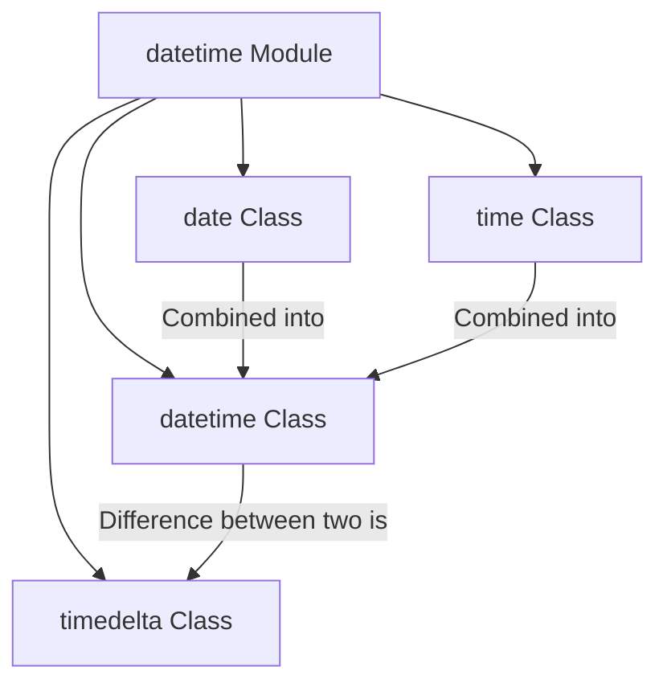

# <span style="color:#e67e22;">What we will learn in this post?</span>
<ul style='list-style-type: none; padding-left: 0;'>
<li><span style='color: #2980b9; font-size: 20px; font-weight: bold;'>👉</span> <span style='color: #2ecc71; font-size: 18px; font-weight: bold;'>Introduction to datetime Module</span></li>
<li><span style='color: #2980b9; font-size: 20px; font-weight: bold;'>👉</span> <span style='color: #2ecc71; font-size: 18px; font-weight: bold;'>date and time Objects</span></li>
<li><span style='color: #2980b9; font-size: 20px; font-weight: bold;'>👉</span> <span style='color: #2ecc71; font-size: 18px; font-weight: bold;'>datetime Objects</span></li>
<li><span style='color: #2980b9; font-size: 20px; font-weight: bold;'>👉</span> <span style='color: #2ecc71; font-size: 18px; font-weight: bold;'>timedelta - Time Arithmetic</span></li>
<li><span style='color: #2980b9; font-size: 20px; font-weight: bold;'>👉</span> <span style='color: #2ecc71; font-size: 18px; font-weight: bold;'>Formatting Dates with strftime()</span></li>
<li><span style='color: #2980b9; font-size: 20px; font-weight: bold;'>👉</span> <span style='color: #2ecc71; font-size: 18px; font-weight: bold;'>Parsing Dates with strptime()</span></li>
<li><span style='color: #2980b9; font-size: 20px; font-weight: bold;'>👉</span> <span style='color: #2ecc71; font-size: 18px; font-weight: bold;'>Working with Timezones</span></li>
</ul>

# <span style="color:#e67e22">Unlock Time Travel with Python's `datetime` Module! 🗓️⏱️</span>

Ever felt lost trying to manage dates and times in your code? *Scheduling events, calculating ages, or simply logging when something happened?* Python's `datetime` module is your super-friendly guide! It brings robust tools to handle all your time-related needs, making complex tasks surprisingly straightforward. Get ready to easily work with specific moments, durations, and more!

## <span style="color:#2980b9">Your Core `datetime` Toolkit Explained 🔧</span>

The `datetime` module offers four main classes, each with a special job:

*   **`date`**: Stores just the **calendar date** – `year`, `month`, and `day`. Think of it as a single page from a calendar!
    *   *Example:* `2023-10-27`
*   **`time`**: Stores only a **time of day** – `hour`, `minute`, `second`, and `microsecond`. Like reading a digital clock!
    *   *Example:* `14:30:05`
*   **`datetime`**: The *powerhouse*! This class combines both a `date` and a `time` into one object, representing a precise point in time. Most of your work will be here.
    *   *Example:* `2023-10-27 14:30:05`
*   **`timedelta`**: Represents a **duration** or the *difference* between two `date`, `time`, or `datetime` objects. Perfect for "what's 3 days from now?" or "how many minutes until...?"
    *   *Example:* `3 days, 5 hours`

### <span style="color:#8e44ad">How They Connect 🔗</span>



With these tools, managing dates and times in Python becomes a breeze!

---

For deeper dives and practical examples, explore the [official Python `datetime` documentation](https://docs.python.org/3/library/datetime.html).

<div style="background-color: #f9f9f9; padding: 20px; border-radius: 8px; border: 1px solid #eee;">

# <span style="color:#e67e22">📅🕰️ Understanding Dates & Times in Python!</span>

Hey there! Python makes working with *dates* and *times* super straightforward using its built-in `datetime` module. Let's meet two friendly helpers: `date` and `time`!

---

## <span style="color:#2980b9">🗓️ The `date` Class: Just Dates!</span>

The `date` class is your go-to for handling *calendar dates* like **year**, **month**, and **day**, without any time information. Think birthdays or specific holidays!

*   **Creating a `date`:** Just provide the year, month, and day.
    ```python
    from datetime import date
    today = date(2023, 10, 27)
    print(f"Today is: {today}") # Output: 2023-10-27
    ```
*   **Accessing parts:** You can easily get individual components using `.` notation.
    ```python
    print(f"Year: {today.year}, Month: {today.month}")
    ```

```mermaid
graph TD
    A[Start] --> B{Call date(year, month, day)};
    B --> C[Creates date object];
    C --> D[Access attributes: .year, .month, .day];
```

---

## <span style="color:#2980b9">⏱️ The `time` Class: Just Times!</span>

The `time` class is all about the *time of day*, covering **hour**, **minute**, **second**, and even **microsecond**. Perfect for scheduling specific moments!

*   **Creating a `time`:** Pass the hour, minute, second, and microsecond (optional).
    ```python
    from datetime import time
    noon = time(12, 30, 0, 500000) # 12:30 and 500 milliseconds
    print(f"Noon time: {noon}") # Output: 12:30:00.500000
    ```
*   **Accessing parts:** Use `.` to grab the hour, minute, etc.
    ```python
    print(f"Hour: {noon.hour}, Minute: {noon.minute}")
    ```

```mermaid
graph TD
    A[Start] --> B{Call time(h, m, s, us)};
    B --> C[Creates time object];
    C --> D[Access attributes: .hour, .minute, .second, .microsecond];
```

These classes help keep your date and time data clear and easy to manage!

---

**🔗 More Info:** For a deeper dive into Python's `datetime` module, check the [official documentation](https://docs.python.org/3/library/datetime.html).

</div>

# <span style="color:#e67e22">Date & Time Magic with Python's `datetime` Class! ✨</span>

The `datetime` class in Python is super handy! It lets you store both **date** (like year, month, day) and **time** (like hour, minute, second) information *together* in one neat package. Think of it as a single object holding a precise "when" something happened.

---

## <span style="color:#2980b9">Getting Current Date & Time 🕰️</span>

Want to know the exact moment right now?
*   `datetime.now()` gives you the **current date and time**, including microseconds!
*   `datetime.today()` is very similar, usually returning the local current date and time.

```python
from datetime import datetime

current_moment = datetime.now()
print(f"Right now: {current_moment}")
# Output example: Right now: 2023-10-26 14:30:45.123456
```

---

## <span style="color:#2980b9">Crafting Your Own Datetimes ✍️</span>

You can create a *specific* `datetime` object:

*   **Directly:** Specify year, month, day, and optionally hour, minute, second.
    ```python
    my_bday = datetime(1990, 5, 15, 10, 30, 0) # Year, Month, Day, Hour, Minute, Second
    print(f"My birthday: {my_bday}")
    # Output: My birthday: 1990-05-15 10:30:00
    ```
*   **Combining `date` and `time`:**
    ```python
    from datetime import date, time
    specific_date = date(2023, 10, 26)
    specific_time = time(14, 0)
    combined_dt = datetime.combine(specific_date, specific_time)
    print(f"Combined: {combined_dt}")
    # Output: Combined: 2023-10-26 14:00:00
    ```

---

## <span style="color:#2980b9">Peeking Inside a Datetime Object 🔍</span>

It's easy to get individual parts from a `datetime` object:

*   Access attributes like `.year`, `.month`, `.day`, `.hour`, `.minute`, `.second`.

```python
print(f"Year of my birthday: {my_bday.year}")      # Output: 1990
print(f"Current hour: {current_moment.hour}")      # Output example: 14
```

---

## <span style="color:#2980b9">Datetime Flow 🚀</span>

Here's a quick look at how you might decide to get or create a `datetime` object:

```mermaid
graph TD
    A[Start] --> B{Need current or specific datetime?};
    B -- Current moment --> C[Use datetime.now()];
    B -- Specific moment --> D[Use datetime(Y, M, D, H, M, S)];
    C --> E[Your datetime object is ready!];
    D --> E;
    E --> F[Access components like .year, .hour];
```

For more info, check the [Python `datetime` documentation](https://docs.python.org/3/library/datetime.html)!

# <span style="color:#e67e22">Understanding `timedelta`: Your Time Travel Buddy! 🕰️</span>

`timedelta` is like your personal stopwatch ⏱️ for Python dates and times! It's not a specific date itself, but rather a *duration* – think of it as "how much time passed" or "how much time should pass." You can tell it you want _5 days_, _3 hours_, or _10 minutes_.

## <span style="color:#2980b9">What is `timedelta`? ⌛</span>

In Python's `datetime` module, a `timedelta` object represents a **difference between two `datetime` objects**. It stores time in terms of days, seconds, and microseconds, making it perfect for measuring time intervals accurately.

## <span style="color:#2980b9">Practical Uses of `timedelta` ✨</span>

`timedelta` is incredibly handy for two main scenarios:

### <span style="color:#8e44ad">Adding/Subtracting Time ➕➖</span>

Want to know what date it will be 7 days from now? Or what date it was 3 weeks ago? Just add or subtract a `timedelta` from a `datetime` object.

```python
from datetime import datetime, timedelta

now = datetime.now()
print(f"Current Time: {now.strftime('%Y-%m-%d %H:%M:%S')}")

# Find date 5 days and 3 hours from now
future_time = now + timedelta(days=5, hours=3)
print(f"5 Days, 3 Hours Later: {future_time.strftime('%Y-%m-%d %H:%M:%S')}")

# Find date 2 weeks ago
past_time = now - timedelta(weeks=2)
print(f"2 Weeks Ago: {past_time.strftime('%Y-%m-%d %H:%M:%S')}")
```

### <span style="color:#8e44ad">Calculating Durations ⏱️</span>

By subtracting two `datetime` objects, you get a `timedelta` object that represents the *duration* between them. This helps calculate anything from how long a task ran to a person's age.

```python
event_start = datetime(2023, 1, 1, 10, 0, 0)
event_end = datetime(2023, 1, 1, 12, 30, 0)

duration = event_end - event_start
print(f"Event Duration: {duration}") # Output: 2:30:00

# Access components like total seconds
print(f"Duration in seconds: {duration.total_seconds()}")
```

<br>

### <span style="color:#8e44ad">Visualizing Time Arithmetic 📊</span>

```mermaid
graph LR
    A[Start Datetime] -- + timedelta --> B[Future Datetime]
    C[End Datetime] -- - Start Datetime --> D[timedelta (Duration)]
```

For more in-depth knowledge, check out the official [Python `datetime` documentation](https://docs.python.org/3/library/datetime.html#timedelta-objects).

# <span style="color:#e67e22">Date & Time Magic with `strftime()` ✨🗓️</span>

Ever wanted to display dates and times in a specific, *fancy* way? That's where `strftime()` comes in! It's a super friendly function (found in many programming languages like Python) that helps you transform raw date and time information into beautifully formatted text strings.

## <span style="color:#2980b9">What's `strftime()` All About? 🕰️</span>

Simply put, `strftime()` (which stands for "string format time") lets you give your date and time objects a **makeover**. Instead of seeing a plain `2023-11-15 10:30:45.123456`, you can tell it exactly how you want it to look, like `Wednesday, November 15, 2023` or `10:30 AM`.

### <span style="color:#8e44ad">How It Works: Your Formatting Recipe! 🧑‍🍳</span>

You tell `strftime()` your desired format using special **"format codes"**. These codes are like little secret ingredients, each starting with a `%`, that represent different parts of a date or time.

*   `%Y`: Full year (e.g., *2023*)
*   `%m`: Month as a zero-padded number (e.g., *11* for November)
*   `%d`: Day of the month (e.g., *15*)
*   `%H`: Hour (24-hour clock, e.g., *10*)
*   `%M`: Minute (e.g., *30*)
*   `%S`: Second (e.g., *45*)
*   `%A`: Full weekday name (e.g., *Wednesday*)
*   `%B`: Full month name (e.g., *November*)

Here's how it flows:

```mermaid
graph TD
    A[Datetime Object] --> B{strftime("Your Format Code String")};
    B --> C[Formatted String Output];
```

## <span style="color:#2980b9">Time for Examples! 🚀</span>

Let's imagine our current date and time is *November 15, 2023, at 10:30:45 AM*.

*   **Format:** `"%Y-%m-%d"`
    *   **Output:** `2023-11-15`
*   **Format:** `"%A, %B %d, %Y"`
    *   **Output:** `Wednesday, November 15, 2023`
*   **Format:** `"%H:%M:%S"`
    *   **Output:** `10:30:45`
*   **Format:** `"%Y-%m-%d %H:%M:%S"` (combining date and time)
    *   **Output:** `2023-11-15 10:30:45`

By using different format codes, you can customize your date and time strings exactly how you need them for display, logs, or reports!

## <span style="color:#2980b9">Want to Dive Deeper? 📚</span>

For a full list of all available `strftime()` format codes and more details, check out these resources:
*   **Python `datetime` Documentation:** [strftime and strptime format codes](https://docs.python.org/3/library/datetime.html#strftime-and-strptime-format-codes)
*   You can also search for "strftime cheat sheet" online for quick reference guides!

# <span style="color:#e67e22">Date Decoding with `strptime()`! 📅</span>

Ever needed to turn a text date like *"Oct 26, 2023"* or *"10/26/2023"* into something Python can truly understand and use for calculations? That's where `strptime()` from Python's `datetime` module shines! It *parses* (decodes) a date string into a proper `datetime` object, making your dates machine-friendly.

## <span style="color:#2980b9">How It Works: Your Date's Secret Code 🔑</span>

`strptime()` needs two key pieces of info to do its magic:
1.  The `date_string` you want to convert (e.g., `"2023-10-26"`).
2.  A `format_code` that tells Python *exactly* how your date string is structured. Think of this as the secret key to unlock the date. For instance, `"%Y-%m-%d"` means "Year-Month-Day".

```mermaid
graph TD
    A[Date String "Oct 26, 2023"] --> B{strptime()}
    C[Format Code "%b %d, %Y"] --> B
    B --> D[Datetime Object (2023, 10, 26)]
```

### <span style="color:#8e44ad">Common Codes & Parsing Puzzles 🤔</span>

Matching the `format_code` to your `date_string` is **crucial**. If they don't align perfectly, Python won't understand your date and will throw an error!

**Examples:**

*   **`"2023-10-26"`** with format `"%Y-%m-%d"`
*   **`"Oct 26, 2023"`** with format `"%b %d, %Y"`

```python
from datetime import datetime

# Example 1: YYYY-MM-DD
date_str1 = "2023-10-26"
date_obj1 = datetime.strptime(date_str1, "%Y-%m-%d")
print(f"Parsed 1: {date_obj1}") # Output: 2023-10-26 00:00:00

# Example 2: Mon DD, YYYY
date_str2 = "Oct 26, 2023"
date_obj2 = datetime.strptime(date_str2, "%b %d, %Y")
print(f"Parsed 2: {date_obj2}") # Output: 2023-10-26 00:00:00
```

**Key Format Codes to Remember:**

*   `%Y`: Full year (e.g., `2023`)
*   `%m`: Month as a zero-padded number (e.g., `10`)
*   `%b`: Abbreviated month name (e.g., `Oct`)
*   `%d`: Day of the month (e.g., `26`)
*   `%H`: Hour (24-hour clock, e.g., `14`)
*   `%M`: Minute (e.g., `30`)
*   `%S`: Second (e.g., `05`)

**Resource:**
For a complete list of all format codes, which is super handy, check out the official [Python `datetime` documentation](https://docs.python.org/3/library/datetime.html#strftime-and-strptime-format-codes). Happy parsing!

# <span style="color:#e67e22">🌍 Mastering Time with Timezone-Aware Datetime Objects</span> ⏳

Ever struggled with scheduling meetings across continents or logging events accurately? "Naive" datetimes, which lack timezone information, can cause a lot of confusion! That's where *timezone-aware* `datetime` objects in Python come to the rescue. They understand **exactly** when and where an event happened, effortlessly handling complex conversions and even the quirks of Daylight Saving Time (DST). Let's make time travel simple and precise!

---

## <span style="color:#2980b9">🕰️ What are Timezone-Aware Datetimes?</span>

*   They are `datetime` objects that *know* their specific geographical time context.
*   They carry both the time *and* the relevant timezone information.
*   Python's built-in `zoneinfo` module (available in Python 3.9+) is the modern, recommended way. For older versions or specific needs, the external `pytz` library is a popular choice.

---

### <span style="color:#8e44ad">✨ Making Your Datetime Smart</span>

Let's create a `datetime` object and make it aware of its specific time zone using `zoneinfo`:

```python
from datetime import datetime
from zoneinfo import ZoneInfo # For Python 3.9+

# A specific moment: October 29, 2023, 10:00 AM
# Make it aware for New York time
nyc_tz = ZoneInfo("America/New_York")
aware_nyc_dt = datetime(2023, 10, 29, 10, 0, 0, tzinfo=nyc_tz)

print(f"Aware (NYC): {aware_nyc_dt}")
# Output: Aware (NYC): 2023-10-29 10:00:00-04:00 (note the -04:00 offset!)
```

---

### <span style="color:#8e44ad">↔️ Converting Between Timezones & UTC</span>

Once your `datetime` is timezone-aware, converting it to another timezone or UTC (Coordinated Universal Time) is a breeze using `.astimezone()`:

```python
# Convert our NYC time to UTC
utc_dt = aware_nyc_dt.astimezone(ZoneInfo("UTC"))
print(f"In UTC: {utc_dt}") # It will show 14:00:00+00:00

# Convert to London time
london_tz = ZoneInfo("Europe/London")
london_dt = aware_nyc_dt.astimezone(london_tz)
print(f"In London: {london_dt}") # Output: 2023-10-29 15:00:00+01:00
```
*Isn't that handy? Python calculates the correct time for you!*

---

### <span style="color:#8e44ad">☀️ Daylight Saving Time (DST) Magic</span>

One of the most powerful aspects is *automatic DST handling*. `zoneinfo` (and `pytz`) inherently knows when DST begins and ends for a given timezone. This means you don't have to manually adjust for clocks "springing forward" or "falling back." It correctly determines the local offset for any point in time you query. **No more manual DST headaches!**

---

### 🚀 **How Timezone Conversion Works (Simplified Flow)**

```mermaid
graph TD
    A[Start: Naive Datetime] --> B{Set Timezone?};
    B -- Yes, using ZoneInfo --> C[Timezone-Aware Datetime];
    B -- No --> A;
    C --> D{Need to Convert to Target TZ?};
    D -- Yes --> E[Call .astimezone(Target_ZoneInfo)];
    E --> F[New Timezone-Aware Datetime];
    D -- No --> F;
    F --> G[End: Correct Time, Correct Place, Accurate DST];
```

---

## <span style="color:#2980b9">📚 Resources for Your Time Journey</span>

*   **Python `zoneinfo` documentation:** [docs.python.org/3/library/zoneinfo.html](https://docs.python.org/3/library/zoneinfo.html)
*   **Python `datetime` documentation:** [docs.python.org/3/library/datetime.html](https://docs.python.org/3/library/datetime.html)
*   **`pytz` official documentation (for older Python):** [pytz.sourceforge.net/](https://pytz.sourceforge.net/)

