<!--
meta-description: "Master Python virtual environments and dependency management with venv, pip, Poetry, and best practices for isolated, reproducible project setups."
keywords: "Python virtual environments, venv, pip package manager, requirements.txt, Poetry, conda, dependency management, Python packages, isolated environments, reproducible builds"
-->

# <span style="color:#e67e22;">What we will learn in this post?</span>
<ul style='list-style-type: none; padding-left: 0;'>
<li><span style='color: #2980b9; font-size: 20px; font-weight: bold;'>👉</span> <span style='color: #2ecc71; font-size: 18px; font-weight: bold;'>Why Virtual Environments?</span></li>
<li><span style='color: #2980b9; font-size: 20px; font-weight: bold;'>👉</span> <span style='color: #2ecc71; font-size: 18px; font-weight: bold;'>Creating Virtual Environments with venv</span></li>
<li><span style='color: #2980b9; font-size: 20px; font-weight: bold;'>👉</span> <span style='color: #2ecc71; font-size: 18px; font-weight: bold;'>Managing Packages with pip</span></li>
<li><span style='color: #2980b9; font-size: 20px; font-weight: bold;'>👉</span> <span style='color: #2ecc71; font-size: 18px; font-weight: bold;'>requirements.txt Best Practices</span></li>
<li><span style='color: #2980b9; font-size: 20px; font-weight: bold;'>👉</span> <span style='color: #2ecc71; font-size: 18px; font-weight: bold;'>Introduction to Poetry</span></li>
<li><span style='color: #2980b9; font-size: 20px; font-weight: bold;'>👉</span> <span style='color: #2ecc71; font-size: 18px; font-weight: bold;'>conda and Anaconda</span></li>
<li><span style='color: #2980b9; font-size: 20px; font-weight: bold;'>👉</span> <span style='color: #2ecc71; font-size: 18px; font-weight: bold;'>Best Practices for Dependency Management</span></li>
</ul>

# <span style="color:#e67e22">Virtual Environments: Your Project's Cozy Workspace 🛠️</span>

Imagine each of your coding projects as a chef creating a unique dish. Each recipe needs specific ingredients (called **dependencies**) in exact amounts. If you mix all ingredients from all recipes into one giant kitchen (your global Python installation), things get incredibly messy and conflicting!

## <span style="color:#2980b9">🤯 Tackling "Dependency Hell"</span>

Ever been stuck in "*dependency hell*"? This happens when `Project A` needs `Library X` version 1.0, but `Project B` demands `Library X` version 2.0. Installing one globally might break the other. It's a frustrating conflict!

## <span style="color:#2980b9">✨ Why Virtual Environments are Your Best Friend</span>

Virtual environments (like `venv` or `conda`) solve this by creating **isolated** spaces for each project.

*   **🚫 No Conflicts:** Each project gets its *own, clean set* of dependencies. `Project A` can happily use `Library X 1.0` and `Project B` can use `Library X 2.0` side-by-side, without any arguments!
*   **♻️ Reproducible Environments:** You can easily list your project's exact dependencies (e.g., in a `requirements.txt` file). Anyone can then recreate your *exact* setup with `pip install -r requirements.txt`. No more "it works on my machine!" excuses!
*   **🧹 Clean Global System:** Your main Python installation stays neat, free from project-specific clutter.

Here's how it generally works:

```mermaid
graph TD
    A["🐍 Python Interpreter"]:::mainPython
    B["📦 Virtual Env<br/>Project A"]:::envA
    C["📦 Virtual Env<br/>Project B"]:::envB
    D["📚 Dependencies<br/>LibX v1.0"]:::depA
    E["📚 Dependencies<br/>LibX v2.0"]:::depB

    A -- "creates" --> B
    A -- "creates" --> C
    B -- "has its own" --> D
    C -- "has its own" --> E
    D -. "Independent" .-> E

    classDef mainPython fill:#6b5bff,stroke:#4a3f6b,color:#fff,font-size:16px,stroke-width:3px,rx:14
    classDef envA fill:#00bfae,stroke:#005f99,color:#fff,font-size:14px,stroke-width:3px,rx:14
    classDef envB fill:#43e97b,stroke:#38f9d7,color:#fff,font-size:14px,stroke-width:3px,rx:14
    classDef depA fill:#ff9800,stroke:#f57c00,color:#fff,font-size:14px,stroke-width:2px,rx:10
    classDef depB fill:#ffd700,stroke:#d99120,color:#222,font-size:14px,stroke-width:2px,rx:10

    linkStyle default stroke:#e67e22,stroke-width:3px
```



This ensures your projects are self-contained, stable, and easy to share.

Here's a friendly and visually appealing guide to Python virtual environments!

# <span style="color:#e67e22">📦 Python Virtual Environments: Your Project's Cozy Corner!</span>

Hey there, fellow coder! Ever had project dependencies clash or different projects needing specific Python versions? 😩 Python's `venv` module is your super solution! It creates *isolated environments* for each project, ensuring your packages stay tidy and conflict-free. Think of it as a separate, clean workspace for every Python adventure! ✨

## <span style="color:#2980b9">🛠️ Creating Your Venv Workspace</span>

Ready to make one? It's simple!
1.  Navigate to your project folder in your terminal.
2.  Run this command. We'll name our environment `myenv` (you can choose any name!):

    ```bash
    python -m venv myenv
    ```
    This creates a new folder named `myenv` within your project, containing an isolated Python installation and its package manager (`pip`).

## <span style="color:#2980b9">🚀 Activating Your Environment</span>

Now, let's step into your new workspace!

### <span style="color:#8e44ad">💻 Windows Users</span>
```bash
myenv\Scripts\activate
```

### <span style="color:#8e44ad">🍎 macOS & Linux Users</span>
```bash
source myenv/bin/activate
```
*You'll see `(myenv)` prefix in your terminal, indicating it's active!* 🎉 Now you can `pip install` packages, and they'll only live here.

## <span style="color:#2980b9">🚪 Deactivating Your Environment</span>

Done for the day or switching projects? Easily exit your `venv`:
```bash
deactivate
```
Your terminal prefix will disappear, taking you back to your system's global Python.

## <span style="color:#2980b9">🧠 The Venv Flow (Visual Guide)</span>

```mermaid
graph LR
    A["🚀 Start Project"]:::start --> B{"🤔 Need Isolation?"}:::decision
    B -- "Yes" --> C["📦 Create Venv<br/>python -m venv myenv"]:::action
    C --> D{"🔌 Activate Venv?"}:::decision
    D -- "Windows" --> E["💻 myenv Scripts activate"]:::windows
    D -- "Mac/Linux" --> F["🍎 source myenv/bin/activate"]:::unix
    E --> G["📥 Install Packages"]:::install
    F --> G
    G --> H["⚙️ Develop Code"]:::dev
    H --> I{"✅ Finished?"}:::decision
    I -- "Yes" --> J["🚪 Deactivate: deactivate"]:::end
    J --> K["🌐 Back to Global Python"]:::global
    B -- "No" --> K

    classDef start fill:#ff4f81,stroke:#c43e3e,color:#fff,font-size:16px,stroke-width:3px,rx:14,shadow:6px;
    classDef decision fill:#ffd700,stroke:#d99120,color:#222,font-size:16px,stroke-width:3px,rx:14,shadow:6px;
    classDef action fill:#6b5bff,stroke:#4a3f6b,color:#fff,font-size:14px,stroke-width:3px,rx:14,shadow:6px;
    classDef windows fill:#00bfae,stroke:#005f99,color:#fff,font-size:14px,stroke-width:2px,rx:10,shadow:6px;
    classDef unix fill:#43e97b,stroke:#38f9d7,color:#fff,font-size:14px,stroke-width:2px,rx:10,shadow:6px;
    classDef install fill:#ff9800,stroke:#f57c00,color:#fff,font-size:14px,stroke-width:3px,rx:14,shadow:6px;
    classDef dev fill:#6b5bff,stroke:#4a3f6b,color:#fff,font-size:14px,stroke-width:3px,rx:14,shadow:6px;
    classDef end fill:#ff4f81,stroke:#c43e3e,color:#fff,font-size:14px,stroke-width:3px,rx:14,shadow:6px;
    classDef global fill:#9e9e9e,stroke:#616161,color:#fff,font-size:14px,stroke-width:2px,rx:10,shadow:6px;

    linkStyle default stroke:#e67e22,stroke-width:3px;
```

# <span style="color:#e67e22">Mastering `pip`: Your Python Package Manager Friend! 🚀</span>

## <span style="color:#2980b9">Hello, Pythonista! 👋</span>
`pip` (Pip Installs Packages) is Python's essential tool for managing external libraries. It helps you *install, uninstall, and manage* Python packages easily. Let's explore its magic!

### <span style="color:#8e44ad">1. Installing & Updating Packages `pip install` 📦</span>
To add a new library to your project:
*   **Basic Install:** `pip install requests`
*   **Specific Version:** `pip install django==3.2` (exact match) or `pip install beautifulsoup4>=4.9` (minimum version).
*   **From `requirements.txt`:** `pip install -r requirements.txt` (This file lists all project dependencies).

### <span style="color:#8e44ad">2. Removing Packages `pip uninstall` 👋</span>
To clean up a package you no longer need:
*   Simply run: `pip uninstall requests`

### <span style="color:#8e44ad">3. Listing Installed Packages `pip list` 📃</span>
Want to see what's already installed in your environment?
*   `pip list` displays all packages and their versions.

### <span style="color:#8e44ad">4. Package Details `pip show` 🔎</span>
Get detailed information about a specific installed package (like its version, location, and dependencies):
*   `pip show flask`

### <span style="color:#8e44ad">5. Freezing Dependencies `pip freeze` 🧊</span>
This command generates a list of all *currently installed* packages with their exact versions. It's perfect for creating a `requirements.txt` file to share your project's dependencies:
*   `pip freeze > requirements.txt`

### <span style="color:#8e44ad">6. Finding Packages `pip search` 💡</span>
Looking for a package but don't know its exact name?
*   `pip search "web scraping"` searches PyPI (Python Package Index) for packages.

```mermaid
graph TD
    A["⚙️ Develop Project"]:::dev --> B["📦 Install packages<br/>with pip"]:::install
    B --> C["🧊 Freeze Dependencies<br/>pip freeze > requirements.txt"]:::freeze
    C --> D["📤 Share<br/>requirements.txt"]:::share
    D --> E["👤 New User /<br/>🚀 Deployment"]:::user
    E --> F["📥 Install<br/>pip install -r requirements.txt"]:::reinstall
    F --> G["✅ Project Ready!"]:::ready

    classDef dev fill:#6b5bff,stroke:#4a3f6b,color:#fff,font-size:16px,stroke-width:3px,rx:14
    classDef install fill:#ff9800,stroke:#f57c00,color:#fff,font-size:14px,stroke-width:3px,rx:14
    classDef freeze fill:#00bfae,stroke:#005f99,color:#fff,font-size:14px,stroke-width:3px,rx:14
    classDef share fill:#ffd700,stroke:#d99120,color:#222,font-size:14px,stroke-width:3px,rx:14
    classDef user fill:#ff4f81,stroke:#c43e3e,color:#fff,font-size:14px,stroke-width:3px,rx:14
    classDef reinstall fill:#43e97b,stroke:#38f9d7,color:#fff,font-size:14px,stroke-width:3px,rx:14
    classDef ready fill:#43e97b,stroke:#38f9d7,color:#fff,font-size:16px,stroke-width:3px,rx:14

    linkStyle default stroke:#e67e22,stroke-width:3px
```

<br>
<details>
<summary><span style="color:#2980b9">**Visualizing `requirements.txt` Workflow** 📊</span></summary>


</details>

<br>
For more in-depth information, always check the [official pip documentation](https://pip.pypa.io/en/stable/).

# <span style="color:#e67e22">Your Python Project's Essential: `requirements.txt` 📦</span>

Ever wondered how to share your Python project so others can run it *perfectly*? Meet `requirements.txt`! This simple text file lists all the **external libraries** your project needs to function. It's your project's reliable recipe for setting up environments.

## <span style="color:#2980b9">Creating & Using Dependencies 🚀</span>

To generate this file, simply run `pip freeze > requirements.txt`. This captures *all currently installed packages* and their exact versions. To install these dependencies on a new machine or environment, use `pip install -r requirements.txt`. Easy, right?

## <span style="color:#2980b9">Smart Versioning: Pinning & Constraints 📌</span>

**Pinning** means specifying an *exact* version, like `requests==2.28.1`. This ensures everyone uses the identical library version, preventing unexpected issues.

For more flexibility, use **version constraints**:
*   `package==1.2.3`: *Exactly* this version. Ideal for production stability.
*   `package>=1.0`: Any version 1.0 or newer.
*   `package~=1.2.0`: *Compatible release* (e.g., `1.2.x`, but not `1.3.0`).

## <span style="color:#2980b9">Dev vs. Production Dependencies 🛠️</span>

For larger projects, you often have packages needed *only* during development (like `pytest` for testing). It's best practice to keep these separate!

*   **`requirements.txt`**: For production-critical dependencies.
*   **`requirements-dev.txt`**: For development-only tools.

```mermaid
graph TD
    A["🐍 Python Project"]:::project --> B{"📦 Dependencies"}:::decision
    B --> C["🚀 Production Deps<br/>requirements.txt"]:::prod
    B --> D["🛠️ Development Deps<br/>requirements-dev.txt"]:::dev
    C --> E["📥 pip install -r<br/>requirements.txt"]:::installProd
    D --> F["📥 pip install -r<br/>requirements-dev.txt"]:::installDev

    classDef project fill:#6b5bff,stroke:#4a3f6b,color:#fff,font-size:16px,stroke-width:3px,rx:14
    classDef decision fill:#ffd700,stroke:#d99120,color:#222,font-size:16px,stroke-width:3px,rx:14
    classDef prod fill:#ff4f81,stroke:#c43e3e,color:#fff,font-size:14px,stroke-width:3px,rx:14
    classDef dev fill:#00bfae,stroke:#005f99,color:#fff,font-size:14px,stroke-width:3px,rx:14
    classDef installProd fill:#ff9800,stroke:#f57c00,color:#fff,font-size:13px,stroke-width:2px,rx:10
    classDef installDev fill:#43e97b,stroke:#38f9d7,color:#fff,font-size:13px,stroke-width:2px,rx:10

    linkStyle default stroke:#e67e22,stroke-width:3px
```


# <span style="color:#e67e22">Poetry: Your Python Project's Smart Companion! 🚀</span>

Frustrated with Python dependency management? Meet **Poetry**, a modern, elegant tool that effortlessly handles dependencies, virtual environments, and project publishing. Think of it as your project's intelligent assistant, simplifying your development workflow.

## <span style="color:#2980b9">Why Choose Poetry? 🤔</span>

Poetry *outperforms* `pip` + `requirements.txt` by offering superior **dependency resolution**, preventing version conflicts. It goes beyond a basic `pyproject.toml`, actively using it to manage project metadata and automatically creating a `poetry.lock` for truly **reproducible builds** across all environments.

### <span style="color:#8e44ad">Core Advantages ✨</span>
*   **Conflict-Free:** Smartly resolves package versions.
*   **Reproducible:** `poetry.lock` ensures consistent setups.
*   **Integrated Virtual Environments:** Seamless `venv` management.
*   **Streamlined Packaging:** Effortless package building and publishing.

```mermaid
graph TD
    A["🚀 Start Project"]:::start --> B["📦 poetry new<br/>my-app"]:::create
    B --> C["➕ Add Dependency"]:::add
    C --> D["📥 poetry add<br/>requests"]:::addCmd
    D --> E["⚙️ Install & Run"]:::install
    E --> F["📦 poetry install"]:::installCmd
    F --> G["▶️ poetry run<br/>python app.py"]:::run

    classDef start fill:#ff4f81,stroke:#c43e3e,color:#fff,font-size:16px,stroke-width:3px,rx:14
    classDef create fill:#6b5bff,stroke:#4a3f6b,color:#fff,font-size:14px,stroke-width:3px,rx:14
    classDef add fill:#ffd700,stroke:#d99120,color:#222,font-size:14px,stroke-width:3px,rx:14
    classDef addCmd fill:#00bfae,stroke:#005f99,color:#fff,font-size:13px,stroke-width:2px,rx:10
    classDef install fill:#ff9800,stroke:#f57c00,color:#fff,font-size:14px,stroke-width:3px,rx:14
    classDef installCmd fill:#43e97b,stroke:#38f9d7,color:#fff,font-size:13px,stroke-width:2px,rx:10
    classDef run fill:#ff4f81,stroke:#c43e3e,color:#fff,font-size:13px,stroke-width:2px,rx:10

    linkStyle default stroke:#e67e22,stroke-width:3px
```

### <span style="color:#8e44ad">Basic Commands 🛠️</span>



*   `poetry new my-project`
*   `poetry add requests` (updates `pyproject.toml`, `poetry.lock`)
*   `poetry install` (installs from `poetry.lock`)
*   `poetry run python main.py`

# <span style="color:#e67e22">Package Manager Comparison Table 📊</span>

Choosing the right package manager can significantly impact your development workflow. Here's a comprehensive comparison to help you decide:

| Feature | pip + venv | Poetry | conda/Anaconda |
|---------|-----------|--------|----------------|
| **Dependency Resolution** | Basic (may have conflicts) | Advanced (solves conflicts) | Advanced (cross-platform) |
| **Lock Files** | ❌ Manual (requirements.txt) | ✅ Automatic (poetry.lock) | ✅ Automatic (environment.yml) |
| **Virtual Environments** | Manual creation | Automatic management | Automatic management |
| **Non-Python Dependencies** | ❌ No | ❌ No | ✅ Yes (C libraries, R, etc.) |
| **Project Metadata** | Manual (setup.py) | Integrated (pyproject.toml) | Manual (environment.yml) |
| **Build & Publish** | Requires setuptools | Built-in | Community-focused |
| **Speed** | Fast | Moderate | Slower (large package index) |
| **Learning Curve** | Low (standard tool) | Moderate | Moderate-High |
| **Best For** | Simple projects, scripts | Modern Python projects | Data science, scientific computing |
| **Installation** | Built-in with Python | `pip install poetry` | Separate installer |
| **Community** | Huge (default) | Growing rapidly | Large (scientific) |
| **Reproducibility** | Manual version pinning | Excellent (lock file) | Excellent (environment export) |

### <span style="color:#2980b9">💡 Quick Recommendations</span>

*   **Use `pip + venv`** if: You're learning Python, working on small scripts, or need simplicity.
*   **Use `Poetry`** if: You're building modern Python applications, libraries, or want better dependency management.
*   **Use `conda`** if: You're doing data science, need non-Python dependencies, or work with scientific computing.

---

# <span style="color:#e67e22">Mastering Project Dependencies Like a Pro! 🚀</span>

Managing your project's ingredients (dependencies) is crucial for smooth sailing. Here are best practices to keep your projects tidy, secure, and reliable, ensuring your software runs perfectly every time.

## <span style="color:#2980b9">Core Practices for Happy Projects! 🎉</span>

### <span style="color:#8e44ad">Isolate with Virtual Environments 🌳</span>
Always use virtual environments (like `venv`) to keep project dependencies *separate* from your system Python. This prevents conflicts and ensures your project runs with its *specific* package versions. You can create one with `python -m venv .venv`.

### <span style="color:#8e44ad">Pin Those Versions! 📌</span>
Specify *exact package versions* (e.g., `requests==2.28.1`) in your `requirements.txt`. This "pins" dependencies, guaranteeing consistent builds across different environments. Use `pip freeze > requirements.txt` to capture them.

### <span style="color:#8e44ad">Separate Dev & Prod Needs 🛠️🚀</span>
Keep development-only packages (like testing tools) in a separate file, often `requirements-dev.txt`, from production requirements. This keeps your production environment *lean and secure*, reducing attack surface.

### <span style="color:#8e44ad">Update & Scan Regularly! ✨🛡️</span>
*Regularly update* your packages to gain new features, bug fixes, and critical security patches. Integrate *security scanning tools* (e.g., `pip-audit` or Snyk) into your workflow to detect vulnerabilities early and fix them.

### <span style="color:#8e44ad">Document Clearly 📝</span>
Maintain a clear `README.md` or `pyproject.toml` describing your project's dependencies and how to set up the environment. This helps collaborators understand your project quickly and onboard smoothly.

```mermaid
graph TD
    A["🚀 Start Project"]:::start --> B["📦 Create Virtual Env"]:::venv
    B --> C["📥 Install Dev &<br/>Prod Deps"]:::install
    C --> D["📌 Pin Dependencies"]:::pin
    D --> E["📂 Separate<br/>Prod/Dev Lists"]:::separate
    E --> F["⚙️ Develop & Test"]:::dev
    F --> G{"🔄 Regularly<br/>Update & Scan?"}:::decision
    G -- "Yes" --> C
    G -- "No" --> H["📝 Document<br/>Dependencies"]:::doc
    H --> I["🚀 Deploy/Maintain"]:::deploy

    classDef start fill:#ff4f81,stroke:#c43e3e,color:#fff,font-size:16px,stroke-width:3px,rx:14
    classDef venv fill:#6b5bff,stroke:#4a3f6b,color:#fff,font-size:14px,stroke-width:3px,rx:14
    classDef install fill:#ff9800,stroke:#f57c00,color:#fff,font-size:14px,stroke-width:3px,rx:14
    classDef pin fill:#00bfae,stroke:#005f99,color:#fff,font-size:14px,stroke-width:3px,rx:14
    classDef separate fill:#43e97b,stroke:#38f9d7,color:#fff,font-size:14px,stroke-width:3px,rx:14
    classDef dev fill:#6b5bff,stroke:#4a3f6b,color:#fff,font-size:14px,stroke-width:3px,rx:14
    classDef decision fill:#ffd700,stroke:#d99120,color:#222,font-size:14px,stroke-width:3px,rx:14
    classDef doc fill:#9e9e9e,stroke:#616161,color:#fff,font-size:14px,stroke-width:2px,rx:10
    classDef deploy fill:#ff4f81,stroke:#c43e3e,color:#fff,font-size:16px,stroke-width:3px,rx:14

    linkStyle default stroke:#e67e22,stroke-width:3px;
```



### <span style="color:#8e44ad">🎮 Try Virtual Environments Live!</span>

{% include code-playground.html 
   language="python" 
   code="# Virtual Environment Management Demo
import subprocess
import sys
import os

# Check if we're in a virtual environment
def check_venv():
    if hasattr(sys, 'real_prefix') or (hasattr(sys, 'base_prefix') and sys.base_prefix != sys.prefix):
        return '✅ Running in virtual environment'
    return '❌ Running in global Python'

print(check_venv())
print(f'Python executable: {sys.executable}')
print(f'Python version: {sys.version.split()[0]}')

# Simulate package installation check
try:
    import requests
    print(f'✅ requests {requests.__version__} is installed')
except ImportError:
    print('❌ requests not installed (expected in playground)')

# Show sys.path (where Python looks for packages)
print('\\nPackage search paths:')
for i, path in enumerate(sys.path[:3], 1):
    print(f'{i}. {path}')

print('\\n💡 In a real venv, sys.path points to venv packages!')" 
   title="🎯 Explore Virtual Environment Internals" 
%}

---

### <span style="color:#8e44ad">🎮 Try Package Management Operations!</span>

{% include code-playground.html 
   language="python" 
   code="# Package Version Management Simulator
from datetime import datetime

class Package:
    def __init__(self, name, version):
        self.name = name
        self.version = version
        self.installed_at = datetime.now()
    
    def __repr__(self):
        return f'{self.name}=={self.version}'

class VirtualEnv:
    def __init__(self, name):
        self.name = name
        self.packages = {}
    
    def install(self, package_name, version):
        pkg = Package(package_name, version)
        self.packages[package_name] = pkg
        print(f'📦 Installing {pkg}...')
        print(f'✅ Successfully installed {pkg}')
    
    def uninstall(self, package_name):
        if package_name in self.packages:
            del self.packages[package_name]
            print(f'🗑️  Uninstalled {package_name}')
        else:
            print(f'❌ {package_name} not found')
    
    def list_packages(self):
        print(f'\\n📋 Packages in {self.name}:')
        for pkg in self.packages.values():
            print(f'  - {pkg}')
    
    def freeze(self):
        print('\\n🧊 requirements.txt:')
        for pkg in self.packages.values():
            print(f'{pkg.name}=={pkg.version}')

# Demo usage
venv = VirtualEnv('my_project')
venv.install('flask', '3.0.0')
venv.install('requests', '2.31.0')
venv.install('pandas', '2.1.3')
venv.list_packages()
venv.freeze()
venv.uninstall('pandas')
venv.list_packages()" 
   title="🎯 Practice Package Management Commands" 
%}

---

<details>
<summary><strong>💡 Project: Multi-Project Environment Manager - Master Virtual Environment Management</strong> (Click to expand)</summary>
<br>
<p><strong>🚀 Your Challenge:</strong></p>
<p>Create a comprehensive <strong>Multi-Project Environment Manager</strong> - a Python tool that helps you manage multiple Python projects with different virtual environments and dependencies on the same machine. Your system should handle project creation, package installation, dependency tracking, and cross-platform compatibility. 🐍✨</p>

<p><strong>📋 Requirements:</strong></p>

<p><strong>Part 1: CLI Tool Commands</strong></p>
<ul>
<li><strong>Create a CLI tool</strong> (<code>project_manager.py</code>) with these commands:
  <ul>
    <li><code>create &lt;project_name&gt;</code> - Creates a new project directory with a virtual environment</li>
    <li><code>list</code> - Lists all managed projects and their Python versions</li>
    <li><code>activate &lt;project_name&gt;</code> - Generates an activation command for the project's venv</li>
    <li><code>install &lt;project_name&gt; &lt;package&gt;</code> - Installs a package in the project's venv</li>
    <li><code>freeze &lt;project_name&gt;</code> - Generates requirements.txt for the project</li>
    <li><code>status &lt;project_name&gt;</code> - Shows installed packages and their versions</li>
  </ul>
</li>
</ul>

<p><strong>Part 2: Data Management</strong></p>
<ul>
<li>Store project metadata in JSON file (<code>~/.project_manager/projects.json</code>)</li>
<li>Track: name, path, Python version, creation date for each project</li>
<li>Implement error handling for missing projects or failed operations</li>
<li>Use <code>pathlib.Path</code> for cross-platform path handling</li>
</ul>

<p><strong>Part 3: Cross-Platform Support</strong></p>
<ul>
<li>Detect user's operating system (Windows/Unix)</li>
<li>Generate appropriate activation commands for each OS</li>
<li>Handle path separators correctly across platforms</li>
<li>Use <code>subprocess</code> module to run <code>python -m venv</code> commands</li>
</ul>

<p><strong>💡 Implementation Hints:</strong></p>
<ul>
<li><strong>Step 1:</strong> Import required modules: <code>import subprocess, json, sys, os</code> and <code>from pathlib import Path</code></li>
<li><strong>Step 2:</strong> Create venv: <code>subprocess.run([sys.executable, '-m', 'venv', venv_path])</code></li>
<li><strong>Step 3:</strong> Detect OS: <code>if sys.platform == 'win32'</code> for Windows, else Unix</li>
<li><strong>Step 4:</strong> Store metadata: Use <code>json.dump()</code> and <code>json.load()</code> for persistence</li>
<li><strong>Step 5:</strong> Install packages: Run pip in venv using subprocess with venv's Python executable</li>
<li><strong>Step 6:</strong> List packages: Use <code>pip list --format=json</code> or <code>pip freeze</code></li>
<li><strong>Bonus:</strong> Add try-except blocks for robust error handling</li>
</ul>

<p><strong>📊 Example Input/Output:</strong></p>
<pre>
# Create a new project
$ python project_manager.py create my_api
✅ Project 'my_api' created at /Users/dev/projects/my_api
✅ Virtual environment initialized

# Install packages
$ python project_manager.py install my_api flask requests
📦 Installing flask in my_api...
📦 Installing requests in my_api...
✅ Packages installed successfully

# Freeze dependencies
$ python project_manager.py freeze my_api
✅ requirements.txt created at /Users/dev/projects/my_api/requirements.txt

# List projects
$ python project_manager.py list
📋 Managed Projects:
  1. my_api (Python 3.11.5) - Created: 2025-12-09
  2. data_processor (Python 3.10.2) - Created: 2025-12-08

# Show status
$ python project_manager.py status my_api
📊 Project: my_api
🐍 Python: 3.11.5
📦 Installed Packages:
  - flask==3.0.0
  - requests==2.31.0
  - click==8.1.7
</pre>

<p><strong>🎆 Bonus Challenges:</strong></p>
<ul>
<li><strong>Challenge 1:</strong> Dependency Conflict Detection - Before installing, check if the package version conflicts with existing dependencies</li>
<li><strong>Challenge 2:</strong> Environment Comparison - Add a <code>diff &lt;project1&gt; &lt;project2&gt;</code> command to compare installed packages</li>
<li><strong>Challenge 3:</strong> Bulk Operations - Support <code>install-all &lt;project_name&gt; requirements.txt</code> to install from a file</li>
<li><strong>Challenge 4:</strong> Interactive Mode - Add a <code>--interactive</code> flag for a menu-driven interface using <code>rich</code> or <code>questionary</code></li>
<li><strong>Challenge 5:</strong> Export/Import - Implement <code>export</code> and <code>import</code> commands to backup/restore all project configurations</li>
<li><strong>Challenge 6:</strong> Virtual Environment Types - Support both <code>venv</code> and <code>conda</code> environment creation</li>
</ul>

<p><strong>Share Your Solution! 💬</strong></p>
<p>Built your environment manager? Awesome! Share your approach in the comments below. How did you handle cross-platform compatibility? Did you add any creative features? Let's learn from each other! 🚀</p>

</details>

---

# <span style="color:#e67e22">🎓 Conclusion</span>

You've now mastered Python's virtual environment and package management ecosystem! From creating isolated environments with `venv` to managing dependencies with `pip`, `requirements.txt`, and modern tools like Poetry, you're equipped to handle any Python project setup. Remember that proper environment isolation prevents conflicts, pinning versions ensures reproducibility, and choosing the right package manager (pip, Poetry, or conda) depends on your project's specific needs. Practice with the hands-on assignment to solidify these concepts, and always keep your dependencies documented and secure for smooth collaboration and deployment! 🚀

---

