```mermaid
graph TD
    A["🏁 Test Suite Start"]:::style1 --> B["🎬 setUpClass() ONCE"]:::style2
    B --> C["🔧 setUp() Test 1"]:::style3
    C --> D["🧪 Test 1 runs"]:::style4
    D --> E["🧹 tearDown() Test 1"]:::style5
    E --> F["🔧 setUp() Test 2"]:::style3
    F --> G["🧪 Test 2 runs"]:::style4
    G --> H["🧹 tearDown() Test 2"]:::style5
    H --> I["..."]:::style1
    I --> J["🎬 tearDownClass() ONCE"]:::style2
    J --> K["✅ Test Suite End"]:::style1

    classDef style1 fill:#ff4f81,stroke:#c43e3e,color:#fff,font-size:16px,stroke-width:3px,rx:14,shadow:6px;
    classDef style2 fill:#ffd700,stroke:#d99120,color:#222,font-size:16px,stroke-width:3px,rx:14,shadow:6px;
    classDef style3 fill:#00bfae,stroke:#005f99,color:#fff,font-size:16px,stroke-width:3px,rx:14,shadow:6px;
    classDef style4 fill:#6b5bff,stroke:#4a3f6b,color:#fff,font-size:16px,stroke-width:3px,rx:14,shadow:6px;
    classDef style5 fill:#ff9800,stroke:#f57c00,color:#fff,font-size:16px,stroke-width:3px,rx:14,shadow:6px;

    linkStyle default stroke:#e67e22,stroke-width:3px;
```

```mermaid
graph TD
    A["🎯 Test Session Start"]:::style1 --> B["🔧 session fixture created"]:::style2
    B --> C["📦 module fixture created"]:::style3
    C --> D["🧪 Test 1 starts"]:::style4
    D --> E["⚙️ function fixture created"]:::style5
    E --> F["✅ Test 1 ends"]:::style4
    F --> G["🗑️ function fixture destroyed"]:::style5
    G --> H["🧪 Test 2 starts"]:::style4
    H --> I["⚙️ new function fixture"]:::style5
    I --> J["✅ Test 2 ends"]:::style4
    J --> K["🗑️ module fixture destroyed"]:::style3
    K --> L["🗑️ session fixture destroyed"]:::style2
    L --> M["🏁 Session End"]:::style1

    classDef style1 fill:#ff4f81,stroke:#c43e3e,color:#fff,font-size:16px,stroke-width:3px,rx:14,shadow:6px;
    classDef style2 fill:#ffd700,stroke:#d99120,color:#222,font-size:16px,stroke-width:3px,rx:14,shadow:6px;
    classDef style3 fill:#6b5bff,stroke:#4a3f6b,color:#fff,font-size:16px,stroke-width:3px,rx:14,shadow:6px;
    classDef style4 fill:#00bfae,stroke:#005f99,color:#fff,font-size:16px,stroke-width:3px,rx:14,shadow:6px;
    classDef style5 fill:#ff9800,stroke:#f57c00,color:#fff,font-size:16px,stroke-width:3px,rx:14,shadow:6px;

    linkStyle default stroke:#e67e22,stroke-width:3px;
```

<!--
meta-description: "Master Python testing with unittest and pytest frameworks, covering test-driven development, fixtures, assertions, coverage tools, and best practices for reliable code."
keywords: "Python testing, unittest framework, pytest, test-driven development, TDD, test fixtures, assertions, code coverage, pytest-cov, AAA pattern, testing best practices"
-->

# <span style="color:#e67e22;">What we will learn in this post?</span>
<ul style='list-style-type: none; padding-left: 0;'>
<li><span style='color: #2980b9; font-size: 20px; font-weight: bold;'>👉</span> <span style='color: #2ecc71; font-size: 18px; font-weight: bold;'>Introduction to Testing</span></li>
<li><span style='color: #2980b9; font-size: 20px; font-weight: bold;'>👉</span> <span style='color: #2ecc71; font-size: 18px; font-weight: bold;'>unittest - Python's Built-in Testing Framework</span></li>
<li><span style='color: #2980b9; font-size: 20px; font-weight: bold;'>👉</span> <span style='color: #2ecc71; font-size: 18px; font-weight: bold;'>unittest Assertions</span></li>
<li><span style='color: #2980b9; font-size: 20px; font-weight: bold;'>👉</span> <span style='color: #2ecc71; font-size: 18px; font-weight: bold;'>setUp and tearDown Methods</span></li>
<li><span style='color: #2980b9; font-size: 20px; font-weight: bold;'>👉</span> <span style='color: #2ecc71; font-size: 18px; font-weight: bold;'>Introduction to pytest</span></li>
<li><span style='color: #2980b9; font-size: 20px; font-weight: bold;'>👉</span> <span style='color: #2ecc71; font-size: 18px; font-weight: bold;'>pytest Fixtures</span></li>
<li><span style='color: #2980b9; font-size: 20px; font-weight: bold;'>👉</span> <span style='color: #2ecc71; font-size: 18px; font-weight: bold;'>Test Coverage and Best Practices</span></li>
</ul>

# <span style="color:#e67e22">Software Testing: Your Software's Best Friend! 💖</span>

Ever wondered how your favorite apps just *work* flawlessly? That's thanks to **software testing**! It's like a thorough quality check, ensuring our digital creations are reliable, smooth, and free from unexpected glitches. *We find potential issues early*, making sure users have a fantastic experience every time.

## <span style="color:#2980b9">Why Testing Matters: Building Trust & Quality 🛡️</span>

Imagine a payment app crashing during a transaction or a game full of bugs. Testing prevents these nightmares! It builds immense *trust* with users, saves companies money by fixing problems proactively, and ultimately delivers **high-quality products**. Untested `bugs` can be very costly!

### <span style="color:#8e44ad">Types of Testing: Different Checks for Different Parts 🔍</span>

Software testing isn't just one thing; it has layers:
*   ***Unit Testing:*** Checks the smallest pieces of code, like a single `function` or method.
*   ***Integration Testing:*** Ensures different parts of the system work together smoothly (e.g., login interacting with database).
*   ***Functional Testing:*** Verifies the entire application behaves as expected from a user's perspective (e.g., "Can I successfully add an item to my cart?").

## <span style="color:#2980b9">Test-Driven Development (TDD): Code with Confidence! ✨</span>

**TDD** is a smart way to build software. Instead of writing code then testing it, you *write tests first*!
1.  **Red:** Write a test that *fails* (because the code isn't there yet).
2.  **Green:** Write just enough code to make that test *pass*.
3.  **Refactor:** Improve the code's design without changing its behavior.

This cycle leads to cleaner, more robust, and easier-to-maintain code.

```mermaid
graph LR
    A["🔴 Write Failing Test"]:::style1 --> B["🟢 Write Minimal Code"]:::style2
    B --> C{"✅ Run All Tests?"}:::style3
    C -- "All pass" --> D["✨ Refactor Code"]:::style4
    C -- "Tests fail" --> B
    D --> E["🔄 Next Feature"]:::style5
    E --> A

    classDef style1 fill:#ff4f81,stroke:#c43e3e,color:#fff,font-size:16px,stroke-width:3px,rx:14,shadow:6px;
    classDef style2 fill:#43e97b,stroke:#38f9d7,color:#fff,font-size:16px,stroke-width:3px,rx:14,shadow:6px;
    classDef style3 fill:#ffd700,stroke:#d99120,color:#222,font-size:16px,stroke-width:3px,rx:14,shadow:6px;
    classDef style4 fill:#6b5bff,stroke:#4a3f6b,color:#fff,font-size:16px,stroke-width:3px,rx:14,shadow:6px;
    classDef style5 fill:#00bfae,stroke:#005f99,color:#fff,font-size:16px,stroke-width:3px,rx:14,shadow:6px;

    linkStyle default stroke:#e67e22,stroke-width:3px;
```



# <span style="color:#e67e22">Hello, Code Explorers! 🧪 Dive into Python's `unittest`!</span>

Imagine a *built-in* Python tool that helps you ensure your code works as expected. That's `unittest`! It's a powerful framework for writing *automated tests*, helping you catch bugs *early* and maintain code quality. Think of it as your personal code quality assistant!

## <span style="color:#2980b9">Creating Test Cases with `unittest.TestCase` ✍️</span>

To test your code, you'll define a *test case*. This is a Python class that **subclasses** `unittest.TestCase`. Each test case groups related tests together, making it easy to organize and run comprehensive test suites for your applications.

*   **Code Example:**
    ```python
    import unittest

    # The simple function we want to test
    def add(a, b):
        return a + b

    class TestMyMath(unittest.TestCase):
        # Your test methods will go here
        pass
    ```

### <span style="color:#8e44ad">Writing Test Methods: `test_` Power! 💪</span>

Inside your test case, define methods that perform specific checks. **Each test method must start with `test_`**. You use *assertion methods* (provided by `unittest.TestCase`) to verify if results are correct.

*   **Common Assertion:** `self.assertEqual(expected, actual)` checks if two values are equal.

*   **Test Method Example:**
    ```python
    # ... (previous 'add' function and TestMyMath class) ...

    class TestMyMath(unittest.TestCase):
        def test_add_two_positives(self):
            """Test adding two positive numbers."""
            self.assertEqual(add(2, 3), 5) # Is 2 + 3 equal to 5?
            self.assertEqual(add(10, 0), 10)

        def test_add_with_negatives(self):
            """Test adding with negative numbers."""
            self.assertEqual(add(-1, 1), 0)
    ```

## <span style="color:#2980b9">Time to See Results: Running Your Tests! ▶️</span>

To run your tests, add a simple block to your test file. When executed, `unittest.main()` discovers and runs all methods starting with `test_` within `unittest.TestCase` subclasses.

*   **How to Run:**
    ```python
    # ... (all your test code) ...

    if __name__ == '__main__':
        unittest.main()
    ```
    Save this code as `my_tests.py`. Then, open your terminal and run: `python my_tests.py`

This will print a report, showing dots (`.`) for passes or `F` for failures!

---

# <span style="color:#e67e22">Testing Your Python Code with Unittest Assertions! ✨</span>

Hey there, fellow coder! 👋 When you're building awesome Python programs, you want to be sure they work *exactly* as intended. That's where `unittest` assertions come in handy! They're like little detectives, checking if your code's actual behavior matches your *expected* behavior. If an assertion fails, you know there's a bug to squash!

## <span style="color:#2980b9">Your Essential Assertion Toolkit 🛠️</span>

Here are some common assertions you'll use:

### <span style="color:#8e44ad">`assertEqual` (Checks for Equality) ✅</span>
This assertion makes sure two values are *precisely the same*.
*Example:* `self.assertEqual(my_function(2, 3), 5)` checks if `my_function` returns `5`.

### <span style="color:#8e44ad">`assertNotEqual` (Checks for Inequality) 🚫</span>
Opposite of `assertEqual`, this ensures two values are *different*.
*Example:* `self.assertNotEqual(status_code, 404)` confirms the `status_code` isn't `404`.

### <span style="color:#8e44ad">`assertTrue` (Checks if True) 👍</span>
Use this when you expect a condition or value to be `True`.
*Example:* `self.assertTrue(is_logged_in)` verifies `is_logged_in` is `True`.

### <span style="color:#8e44ad">`assertFalse` (Checks if False) 👎</span>
This confirms a condition or value is `False`.
*Example:* `self.assertFalse(has_permission)` ensures `has_permission` is `False`.

### <span style="color:#8e44ad">`assertIn` (Checks for Presence) 🔍</span>
Verifies if an *item exists* within a collection (like a list or string).
*Example:* `self.assertIn('milk', shopping_list)` checks if `'milk'` is in `shopping_list`.

### <span style="color:#8e44ad">`assertRaises` (Checks for Expected Errors) 💥</span>
This special one lets you confirm that your code *raises a specific error* when it should.
*Example:* `with self.assertRaises(ValueError): process_data('')` expects a `ValueError` for empty data.

```mermaid
graph TD
    A["🚀 Start Test"]:::style1 --> B["⚙️ Call Function"]:::style2
    B --> C{"🔍 Outcome Expected?"}:::style3
    C -- "Yes" --> D["✅ Test Passed"]:::style4
    C -- "No" --> E["❌ Test Failed"]:::style5
    E --> F["📋 Show Error Report"]:::style1

    classDef style1 fill:#ff4f81,stroke:#c43e3e,color:#fff,font-size:16px,stroke-width:3px,rx:14,shadow:6px;
    classDef style2 fill:#6b5bff,stroke:#4a3f6b,color:#fff,font-size:16px,stroke-width:3px,rx:14,shadow:6px;
    classDef style3 fill:#ffd700,stroke:#d99120,color:#222,font-size:16px,stroke-width:3px,rx:14,shadow:6px;
    classDef style4 fill:#43e97b,stroke:#38f9d7,color:#fff,font-size:16px,stroke-width:3px,rx:14,shadow:6px;
    classDef style5 fill:#ff9800,stroke:#f57c00,color:#fff,font-size:16px,stroke-width:3px,rx:14,shadow:6px;

    linkStyle default stroke:#e67e22,stroke-width:3px;
```

<br>

## <span style="color:#2980b9">How Assertions Fit in Your Test Flow 🌊</span>



### <span style="color:#8e44ad">Real-World Example: API Response Validator 🌐</span>

```python
import unittest
import requests

class TestAPIResponses(unittest.TestCase):
    """Test API endpoints for a weather service."""
    
    def test_weather_endpoint_returns_200(self):
        """Verify weather API returns successful status code."""
        response = requests.get('https://api.weather.example.com/current')
        self.assertEqual(response.status_code, 200)
    
    def test_response_contains_temperature(self):
        """Ensure temperature data is present in response."""
        response = requests.get('https://api.weather.example.com/current')
        data = response.json()
        self.assertIn('temperature', data)
        self.assertTrue(isinstance(data['temperature'], (int, float)))
    
    def test_invalid_city_raises_error(self):
        """Confirm API raises error for invalid city."""
        with self.assertRaises(requests.exceptions.HTTPError):
            response = requests.get('https://api.weather.example.com/current?city=InvalidCity123')
            response.raise_for_status()
```

# <span style="color:#e67e22">`setUp()` & `tearDown()`: Your Test Prep & Cleanup Crew! 🛠️</span>

Ever wanted your tests to be super **independent** and always start from a *clean slate*? That's where `setUp()` and `tearDown()` come in! They're essential for managing test initialization and cleanup, ensuring your tests are reliable.

## <span style="color:#2980b9">🚀 Individual Test Setup/Cleanup</span>

These methods run for **each individual test**:

*   **`setUp()`**: Runs *before* **every single test** method in your class. Perfect for creating *fresh, isolated* resources your test needs.
    *   _Example_: Connecting to a `test_database` or creating a `temporary file` for each test.
    ```python
    def setUp(self):
        self.db_conn = connect_to_test_db()
    ```
*   **`tearDown()`**: Runs *after* **every single test**, even if the test fails. It ensures *complete cleanup* of resources created by `setUp()`.
    *   _Example_: Closing `db_conn` or deleting the `temporary file`.
    ```python
    def tearDown(self):
        self.db_conn.close()
    ```


## <span style="color:#2980b9">🏫 Class-Level Setup/Cleanup</span>

```mermaid
graph TD
    A["🏁 Test Class Start"]:::style1 --> B["🔧 setUp() runs"]:::style2
    B --> C["🧪 test_method() runs"]:::style3
    C --> D["🧹 tearDown() runs"]:::style4
    D --> E{"🔄 Another Test?"}:::style5
    E -- "Yes" --> B
    E -- "No" --> F["✅ Test Class End"]:::style1

    classDef style1 fill:#ff4f81,stroke:#c43e3e,color:#fff,font-size:16px,stroke-width:3px,rx:14,shadow:6px;
    classDef style2 fill:#00bfae,stroke:#005f99,color:#fff,font-size:16px,stroke-width:3px,rx:14,shadow:6px;
    classDef style3 fill:#6b5bff,stroke:#4a3f6b,color:#fff,font-size:16px,stroke-width:3px,rx:14,shadow:6px;
    classDef style4 fill:#ff9800,stroke:#f57c00,color:#fff,font-size:16px,stroke-width:3px,rx:14,shadow:6px;
    classDef style5 fill:#ffd700,stroke:#d99120,color:#222,font-size:16px,stroke-width:3px,rx:14,shadow:6px;

    linkStyle default stroke:#e67e22,stroke-width:3px;
```

For resources needed *once* for **all** tests within a class, use these:

*   **`setUpClass()`**: Runs *only once* **before any** test in the class starts. Ideal for expensive, shared setups.
    *   _Example_: Setting up a `shared_database_schema` or launching a `mock server`.
    ```python
    @classmethod
    def setUpClass(cls):
        cls.shared_resource = setup_shared_db_schema()
    ```
*   **`tearDownClass()`**: Runs *only once* **after all** tests in the class have finished. It cleans up everything `setUpClass()` created.
    *   _Example_: Tearing down the `shared_database_schema` or stopping the `mock server`.
    ```python
    @classmethod
    def tearDownClass(cls):
        cls.shared_resource.teardown()
    ```



### <span style="color:#8e44ad">Real-World Example: Database Test Suite 🗄️</span>

```python
import unittest
import sqlite3

class TestDatabaseOperations(unittest.TestCase):
    """Test suite for database CRUD operations."""
    
    @classmethod
    def setUpClass(cls):
        """Set up test database schema once for all tests."""
        cls.conn = sqlite3.connect(':memory:')
        cls.cursor = cls.conn.cursor()
        cls.cursor.execute('''
            CREATE TABLE users (
                id INTEGER PRIMARY KEY,
                username TEXT UNIQUE NOT NULL,
                email TEXT NOT NULL
            )
        ''')
        cls.conn.commit()
    
    def setUp(self):
        """Clean database before each test."""
        self.cursor.execute('DELETE FROM users')
        self.conn.commit()
    
    def test_insert_user(self):
        """Test inserting a new user."""
        self.cursor.execute(
            'INSERT INTO users (username, email) VALUES (?, ?)',
            ('john_doe', 'john@example.com')
        )
        self.conn.commit()
        
        self.cursor.execute('SELECT * FROM users WHERE username = ?', ('john_doe',))
        user = self.cursor.fetchone()
        self.assertIsNotNone(user)
        self.assertEqual(user[1], 'john_doe')
    
    def test_duplicate_username_fails(self):
        """Verify duplicate username raises integrity error."""
        self.cursor.execute(
            'INSERT INTO users (username, email) VALUES (?, ?)',
            ('jane_doe', 'jane@example.com')
        )
        self.conn.commit()
        
        with self.assertRaises(sqlite3.IntegrityError):
            self.cursor.execute(
                'INSERT INTO users (username, email) VALUES (?, ?)',
                ('jane_doe', 'different@example.com')
            )
            self.conn.commit()
    
    @classmethod
    def tearDownClass(cls):
        """Close database connection after all tests."""
        cls.conn.close()
```

# <span style="color:#e67e22">pytest: Modern Testing Made Easy! ✨</span>

Meet *pytest*, the go-to Python testing framework for its simplicity and powerful features. It's designed to make writing tests fun and efficient, offering a significant upgrade from `unittest`.

## <span style="color:#2980b9">Why pytest Over unittest? 🚀</span>

*   **Simpler Syntax:** Write tests as plain functions, not classes. No more `TestCase` inheritance!
*   **Less Boilerplate:** Forget `import unittest` and `self.assertEqual()`. Use standard `assert` statements.
*   **Powerful Fixtures:** Reusable setup/teardown code, easily injected.
*   **Rich Ecosystem:** Thousands of plugins extend its capabilities.
*   **Better Output:** Detailed failure reports with context and variable values for faster debugging.

## <span style="color:#2980b9">Simple Test Function Syntax 📝</span>

Writing tests is straightforward. Just define functions starting with `test_` and use Python's built-in `assert` statement.

```python
# test_example.py
def test_addition():
    assert 1 + 1 == 2

def test_string_uppercase():
    assert "hello".upper() == "HELLO"
```

## <span style="color:#2980b9">Basic Usage & Running Tests ▶️</span>

1.  **Install:** `pip install pytest`
2.  **Run:** Open your terminal in the test directory and type: `pytest`

pytest automatically discovers test files (starting with `test_` or ending with `_test.py`) and runs all test functions!

```mermaid
graph LR
    A["🔍 pytest Discovery"]:::style1 --> B["📁 Find test_*.py"]:::style2
    B --> C["🧪 Collect test_*() functions"]:::style3
    C --> D["▶️ Run Tests"]:::style4
    D --> E["📊 Generate Report"]:::style5

    classDef style1 fill:#ff4f81,stroke:#c43e3e,color:#fff,font-size:16px,stroke-width:3px,rx:14,shadow:6px;
    classDef style2 fill:#6b5bff,stroke:#4a3f6b,color:#fff,font-size:16px,stroke-width:3px,rx:14,shadow:6px;
    classDef style3 fill:#ffd700,stroke:#d99120,color:#222,font-size:16px,stroke-width:3px,rx:14,shadow:6px;
    classDef style4 fill:#00bfae,stroke:#005f99,color:#fff,font-size:16px,stroke-width:3px,rx:14,shadow:6px;
    classDef style5 fill:#43e97b,stroke:#38f9d7,color:#fff,font-size:16px,stroke-width:3px,rx:14,shadow:6px;

    linkStyle default stroke:#e67e22,stroke-width:3px;
```



## <span style="color:#2980b9">pytest Fixtures: Reusable Test Setup 🔧</span>

Fixtures are pytest's powerful way to set up test preconditions. They're functions decorated with `@pytest.fixture` that provide data or resources to your tests.

### <span style="color:#8e44ad">Basic Fixture Usage 📦</span>

```python
import pytest

@pytest.fixture
def sample_user():
    """Fixture providing a sample user dictionary."""
    return {
        'username': 'test_user',
        'email': 'test@example.com',
        'age': 25
    }

def test_user_has_email(sample_user):
    """Test that fixture provides user with email."""
    assert 'email' in sample_user
    assert sample_user['email'] == 'test@example.com'

def test_user_age_is_valid(sample_user):
    """Test that user age is a positive number."""
    assert sample_user['age'] > 0
```

### <span style="color:#8e44ad">Fixture Scopes: Control Lifetime ⏰</span>

Fixtures can have different scopes to control when they're created and destroyed:

*   **function** (default): Created/destroyed for each test
*   **class**: Shared across all tests in a class
*   **module**: Shared across all tests in a file
*   **session**: Created once for entire test session

```python
import pytest
import requests

@pytest.fixture(scope="session")
def api_client():
    """Session-scoped fixture for API client."""
    session = requests.Session()
    session.headers.update({'Authorization': 'Bearer test-token'})
    yield session
    session.close()

@pytest.fixture(scope="function")
def clean_test_data():
    """Function-scoped fixture for clean test data."""
    data = {'items': []}
    yield data
    # Cleanup after test
    data['items'].clear()
```



### <span style="color:#8e44ad">Real-World Example: E-Commerce Test Fixtures 🛒</span>

```python
import pytest
from decimal import Decimal

@pytest.fixture
def empty_shopping_cart():
    """Fixture providing an empty shopping cart."""
    return {'items': [], 'total': Decimal('0.00')}

@pytest.fixture
def product_catalog():
    """Fixture providing sample product catalog."""
    return [
        {'id': 1, 'name': 'Laptop', 'price': Decimal('999.99')},
        {'id': 2, 'name': 'Mouse', 'price': Decimal('29.99')},
        {'id': 3, 'name': 'Keyboard', 'price': Decimal('79.99')}
    ]

@pytest.fixture
def cart_with_items(empty_shopping_cart, product_catalog):
    """Fixture providing cart with pre-added items."""
    cart = empty_shopping_cart
    cart['items'].append(product_catalog[0])  # Add laptop
    cart['items'].append(product_catalog[1])  # Add mouse
    cart['total'] = sum(item['price'] for item in cart['items'])
    return cart

def test_empty_cart_total(empty_shopping_cart):
    """Test that empty cart has zero total."""
    assert empty_shopping_cart['total'] == Decimal('0.00')
    assert len(empty_shopping_cart['items']) == 0

def test_cart_calculates_total(cart_with_items):
    """Test cart correctly calculates item totals."""
    expected_total = Decimal('999.99') + Decimal('29.99')
    assert cart_with_items['total'] == expected_total

def test_add_item_to_cart(empty_shopping_cart, product_catalog):
    """Test adding item increases cart total."""
    cart = empty_shopping_cart
    keyboard = product_catalog[2]
    
    cart['items'].append(keyboard)
    cart['total'] += keyboard['price']
    
    assert len(cart['items']) == 1
    assert cart['total'] == Decimal('79.99')
```

# <span style="color:#e67e22">Unmasking Your Code's Untested Corners with Coverage Tools! 🕵️‍♀️</span>

Ever wonder how much of your code is *actually* tested? That's where **Code Coverage** steps in! It's like a detective for your tests, showing you which lines of code your tests touch, and more importantly, which they don't.

## <span style="color:#2980b9">Meet the Coverage Crew 🛠️</span>

We use tools like `coverage.py` and `pytest-cov` (a plugin for `pytest`) to measure this. They help ensure your tests are thorough, giving you confidence in your software.

### <span style="color:#8e44ad">How to Measure Coverage 📊</span>

Run your tests with `pytest-cov` to see a summary and generate detailed reports:

```bash
pytest --cov=your_module --cov-report=html
```
This command runs your `pytest` tests, tracks coverage for `your_module`, and creates an interactive `htmlcov/index.html` report!

## <span style="color:#2980b9">What Coverage Percentage to Aim For? 🎯</span>

While 100% seems ideal, a realistic and healthy goal is **80-90%**. Over 90% can sometimes mean testing trivial code or spending too much effort for diminishing returns. Focus on critical paths and complex logic.

## <span style="color:#2980b9">Smart Testing Best Practices ✨</span>

Writing good tests is crucial for reliable coverage.

### <span style="color:#8e44ad">The AAA Pattern (Arrange, Act, Assert) 🚦</span>

This pattern makes tests clear and organized:

```mermaid
graph LR
    A["🔧 Arrange<br/>Setup Data"]:::style1 --> B["⚡ Act<br/>Call Function"]:::style2
    B --> C["✅ Assert<br/>Verify Result"]:::style3

    classDef style1 fill:#ff4f81,stroke:#c43e3e,color:#fff,font-size:16px,stroke-width:3px,rx:14,shadow:6px;
    classDef style2 fill:#6b5bff,stroke:#4a3f6b,color:#fff,font-size:16px,stroke-width:3px,rx:14,shadow:6px;
    classDef style3 fill:#43e97b,stroke:#38f9d7,color:#fff,font-size:16px,stroke-width:3px,rx:14,shadow:6px;

    linkStyle default stroke:#e67e22,stroke-width:3px;
```



Let's see it in action:

```python
# my_app.py
def add(a, b):
    return a + b # This line is covered by the test
# def subtract(a, b): # This function won't be covered by our example test
#     return a - b

# test_my_app.py
from my_app import add

def test_add_positive_numbers_correctly(): # Descriptive test name
    # Arrange
    num1, num2 = 5, 3
    # Act
    result = add(num1, num2)
    # Assert
    assert result == 8 # An independent check
```
*   **Test Naming:** Use descriptive names like `test_add_positive_numbers_correctly` to easily understand what each test checks.
*   **Independence:** Each test should run independently, without relying on the order or state set by other tests.

---

<details style='border: 2px solid #ff9800; border-radius: 8px; padding: 20px; background: linear-gradient(135deg, #fff3e0 0%, #fff 100%); margin: 25px 0; box-shadow: 0 6px 12px rgba(255, 152, 0, 0.15);'>
<summary style='cursor: pointer; font-size: 1.3em; font-weight: bold; color: #ff9800; padding: 10px 0;'>
🎯 Hands-On Assignment: Build a User Authentication Test Suite 🚀
</summary>

<div style='margin-top: 20px; color: #2c3e50; line-height: 1.6;'>

<h3 style='color: #ff9800; border-bottom: 2px solid #ff9800; padding-bottom: 8px; margin-top: 20px;'>📝 Your Mission</h3>

Create a comprehensive test suite for a user authentication system using both <code>unittest</code> and <code>pytest</code>. You'll test login functionality, password validation, session management, and error handling to ensure secure, reliable authentication.

<h3 style='color: #ff9800; border-bottom: 2px solid #ff9800; padding-bottom: 8px; margin-top: 20px;'>🎯 Requirements</h3>

<ol style='margin-left: 20px;'>
<li>Create an <code>AuthenticationSystem</code> class with methods:
  <ul style='margin-left: 20px; margin-top: 8px;'>
    <li><code>register_user(username, password, email)</code> - Register new users</li>
    <li><code>login(username, password)</code> - Authenticate and return session token</li>
    <li><code>validate_password(password)</code> - Check password strength (min 8 chars, 1 uppercase, 1 digit)</li>
    <li><code>logout(session_token)</code> - Invalidate session</li>
  </ul>
</li>
<li>Write <code>unittest</code> test cases with proper <code>setUp</code> and <code>tearDown</code> methods</li>
<li>Write equivalent <code>pytest</code> tests using fixtures</li>
<li>Test edge cases: duplicate usernames, invalid passwords, expired sessions</li>
<li>Achieve at least <strong>85% code coverage</strong></li>
<li>Use the AAA pattern (Arrange, Act, Assert) for all tests</li>
</ol>

<h3 style='color: #ff9800; border-bottom: 2px solid #ff9800; padding-bottom: 8px; margin-top: 25px;'>💡 Implementation Hints</h3>

<ol style='margin-left: 20px;'>
<li>Store users in a dictionary: <code>{'username': {'password': 'hashed', 'email': 'user@example.com'}}</code></li>
<li>Use <code>hashlib</code> to hash passwords (e.g., <code>hashlib.sha256(password.encode()).hexdigest()</code>)</li>
<li>Generate session tokens with <code>uuid.uuid4().hex</code></li>
<li>For pytest, create fixtures like <code>@pytest.fixture def auth_system()</code></li>
<li>Use <code>assertRaises</code> or <code>pytest.raises</code> to test exception handling</li>
<li>Run coverage with: <code>pytest --cov=authentication --cov-report=html</code></li>
</ol>

<h3 style='color: #ff9800; border-bottom: 2px solid #ff9800; padding-bottom: 8px; margin-top: 25px;'>🚀 Example Input/Output</h3>

<pre style='background: #2c3e50; color: #ecf0f1; padding: 20px; border-radius: 8px; overflow-x: auto; margin: 15px 0;'><code class='language-python'># Example usage and expected behavior
auth = AuthenticationSystem()

# Registration
auth.register_user('john_doe', 'SecurePass123', 'john@example.com')
# Expected: User registered successfully

# Login
token = auth.login('john_doe', 'SecurePass123')
# Expected: Returns session token like 'a3f5b2c8d1e4f7a9b2c5d8e1f4a7b0c3'

# Invalid password
auth.validate_password('weak')
# Expected: Raises ValueError('Password must be at least 8 characters')

# Duplicate registration
auth.register_user('john_doe', 'AnotherPass456', 'different@example.com')
# Expected: Raises ValueError('Username already exists')

# Logout
auth.logout(token)
# Expected: Session invalidated, subsequent use raises error
</code></pre>

<h3 style='color: #ff9800; border-bottom: 2px solid #ff9800; padding-bottom: 8px; margin-top: 25px;'>🏆 Bonus Challenges</h3>

<ul style='margin-left: 20px;'>
<li><strong>Level 2</strong>: Add email validation using regex patterns</li>
<li><strong>Level 3</strong>: Implement session expiration (tokens valid for 30 minutes)</li>
<li><strong>Level 4</strong>: Add parameterized tests using <code>@pytest.mark.parametrize</code> to test multiple password scenarios</li>
<li><strong>Level 5</strong>: Create a mock database using <code>unittest.mock</code> instead of in-memory dictionary</li>
<li><strong>Level 6</strong>: Add integration tests that combine multiple authentication operations</li>
</ul>

<h3 style='color: #ff9800; border-bottom: 2px solid #ff9800; padding-bottom: 8px; margin-top: 25px;'>📚 Learning Goals</h3>

<ul style='margin-left: 20px;'>
<li>Master <code>unittest.TestCase</code> structure with setUp/tearDown lifecycle 🎯</li>
<li>Understand pytest fixtures and their scope (function, class, module, session) ✨</li>
<li>Apply AAA pattern for clean, readable test structure 🔄</li>
<li>Practice testing edge cases and error conditions 🔗</li>
<li>Measure and improve code coverage with pytest-cov 🛠️</li>
<li>Compare unittest vs pytest approaches for the same functionality 📊</li>
</ul>

<p style='background: #3498db; color: #fff; padding: 15px; border-radius: 8px; margin-top: 20px; border-left: 5px solid #2980b9;'>
<strong>💡 Pro Tip:</strong> This authentication testing pattern is used in production systems like Django (django.contrib.auth.tests), Flask-Login test suites, and FastAPI security testing examples!
</p>

<p style='margin-top: 20px; font-size: 1.1em;'><strong>Share Your Solution! 💬</strong></p>
<p>Completed the project? <strong>Post your code in the comments below!</strong> Show us your Python testing mastery! 🚀✨</p>

</div>
</details>

---

# <span style="color:#e67e22">Conclusion: Testing for Reliable Python Applications 🎓</span>

Testing is the cornerstone of professional Python development, transforming code from functional to production-ready. By mastering unittest and pytest, applying TDD principles, using fixtures effectively, and maintaining high code coverage, you'll build robust applications that users trust and that stand the test of time in real-world deployments.
