```mermaid
graph LR
    A["🧑‍💻 Your Application"]:::style1 -- "1. HTTP Request" --> B["⚙️ API Server"]:::style2
    B -- "2. HTTP Response" --> A

    classDef style1 fill:#ff4f81,stroke:#c43e3e,color:#fff,font-size:16px,stroke-width:3px,rx:14,shadow:6px;
    classDef style2 fill:#6b5bff,stroke:#4a3f6b,color:#fff,font-size:16px,stroke-width:3px,rx:14,shadow:6px;

    linkStyle default stroke:#e67e22,stroke-width:3px;
```

<!--
meta-description: "Comprehensive guide to working with APIs and HTTP requests in Python using the requests library, covering GET/POST methods, error handling, authentication, headers, and building production-ready API clients."
keywords: "Python APIs, HTTP requests, requests library, REST API, JSON parsing, API authentication, error handling, GET requests, POST requests, Python web programming, API client development"
-->

# <span style="color:#e67e22;">What we will learn in this post?</span>
<ul style='list-style-type: none; padding-left: 0;'>
<li><span style='color: #2980b9; font-size: 20px; font-weight: bold;'>👉</span> <span style='color: #2ecc71; font-size: 18px; font-weight: bold;'>Introduction to APIs and HTTP</span></li>
<li><span style='color: #2980b9; font-size: 20px; font-weight: bold;'>👉</span> <span style='color: #2ecc71; font-size: 18px; font-weight: bold;'>The requests Library</span></li>
<li><span style='color: #2980b9; font-size: 20px; font-weight: bold;'>👉</span> <span style='color: #2ecc71; font-size: 18px; font-weight: bold;'>Making GET Requests</span></li>
<li><span style='color: #2980b9; font-size: 20px; font-weight: bold;'>👉</span> <span style='color: #2ecc71; font-size: 18px; font-weight: bold;'>Making POST Requests</span></li>
<li><span style='color: #2980b9; font-size: 20px; font-weight: bold;'>👉</span> <span style='color: #2ecc71; font-size: 18px; font-weight: bold;'>Handling Errors and Exceptions</span></li>
<li><span style='color: #2980b9; font-size: 20px; font-weight: bold;'>👉</span> <span style='color: #2ecc71; font-size: 18px; font-weight: bold;'>Authentication and Headers</span></li>
<li><span style='color: #2980b9; font-size: 20px; font-weight: bold;'>👉</span> <span style='color: #2ecc71; font-size: 18px; font-weight: bold;'>Building a Simple API Client</span></li>
</ul>

# <span style="color:#e67e22">Welcome to the World of APIs! 👋</span>

Ever wondered how apps talk to each other? That's where **APIs** come in!

## <span style="color:#2980b9">What are APIs? 🤝</span>
*Imagine* an API (Application Programming Interface) like a **friendly waiter** in a restaurant. You tell them what you want (a "request"), and they go to the kitchen (another program/server) to get it for you, then bring back your order (a "response"). It's a set of rules enabling different software to communicate!

## <span style="color:#2980b9">RESTful APIs & HTTP Methods 🌐</span>
**RESTful APIs** are very popular APIs that use standard web communication (HTTP). Think of **HTTP methods** as actions you can take:
*   `GET`: *Fetch* data (like asking for a menu).
*   `POST`: *Create* new data (like ordering food).
*   `PUT`: *Update* existing data (like changing your order).
*   `DELETE`: *Remove* data (like canceling an order).

## <span style="color:#2980b9">Status Codes & JSON 🚦</span>
After your request, you get a **status code** (the waiter's reply):
*   `200 OK`: Success! 🎉 Your request worked.
*   `404 Not Found`: Oops, what you asked for isn't there.
*   `500 Internal Server Error`: Something went wrong on the server's side.
Data is often sent back in **JSON** (JavaScript Object Notation) – a *super-easy-to-read* format, like a structured shopping list for computers.

### <span style="color:#8e44ad">Let's See an Example! 🧑‍💻</span>
Here’s how you'd `GET` data using Python:
```python
import requests # A popular library for making web requests

# This sends a GET request to a public API to fetch a 'todo' item
response = requests.get('https://jsonplaceholder.typicode.com/todos/1') 

print(f"Status Code: {response.status_code}") # Checks if the request was successful
print(f"Data Received: {response.json()}")    # Prints the data in JSON format
# Output: Status Code: 200, Data Received: {'userId': 1, 'id': 1, 'title': 'delectus aut autem', 'completed': False}
```

{% include code-playground.html 
   language="python" 
   code="import requests

# This sends a GET request to a public API to fetch a 'todo' item
response = requests.get('https://jsonplaceholder.typicode.com/todos/1') 

print(f\"Status Code: {response.status_code}\") # Checks if the request was successful
print(f\"Data Received: {response.json()}\")    # Prints the data in JSON format
print(f\"\\nTitle: {response.json()['title']}\")
print(f\"Completed: {response.json()['completed']}\")

# Try changing the number in the URL to get different todos!
# Example: 'https://jsonplaceholder.typicode.com/todos/5'" 
   title="🎯 Try Your First API Request!" 
   gradient="green"
%}

### <span style="color:#8e44ad">How API Communication Works 💬</span>


---

# <span style="color:#e67e22">The requests Library: Your API Swiss Army Knife 🔧</span>

Python's `requests` library is the *go-to tool* for making HTTP requests. It's elegant, powerful, and widely used in production systems worldwide.

## <span style="color:#2980b9">Installing and Importing 📦</span>

First, install requests using pip:

```python
# Install from command line
pip install requests

# Or using pip3
pip3 install requests
```

Then import it in your Python code:

```python
import requests

# Check the version
print(requests.__version__)  # e.g., '2.31.0'
```

## <span style="color:#2980b9">Why Use requests Over urllib? 🤔</span>

The built-in `urllib` works but is verbose. The `requests` library offers:

- **Simpler syntax** - Less code for the same task
- **Automatic JSON parsing** - `.json()` method does the work
- **Session management** - Persistent connections and cookies
- **Better error handling** - Clear exception types
- **File uploads** - Easy multipart/form-data handling

### <span style="color:#8e44ad">Quick Comparison 🆚</span>

```python
# Using urllib (built-in, more complex)
import urllib.request
import json

req = urllib.request.Request('https://api.github.com/users/python')
with urllib.request.urlopen(req) as response:
    data = json.loads(response.read().decode())
    print(data['name'])

# Using requests (cleaner, more intuitive)
import requests

response = requests.get('https://api.github.com/users/python')
print(response.json()['name'])
```

The `requests` library makes API interactions feel natural and Pythonic!

---

# <span style="color:#e67e22">What are GET Requests? 🌐</span>

Imagine asking a website for information – that's often a **GET request**! It's how your browser fetches a webpage or an app retrieves data *without changing anything* on the server. Think of it as "read-only" – you're simply *getting* data.

## <span style="color:#2980b9">The Request Part: Asking for Info 📤</span>

When you send a GET request, you might include:

*   ### <span style="color:#8e44ad">Parameters</span>
    These are details you add to the URL after a `?` to specify *what* you want. For example, in `api.example.com/items?_limit=10&page=1`, `_limit=10` and `page=1` are parameters (key-value pairs).

*   ### <span style="color:#8e44ad">Headers</span>
    Like an envelope for your letter, **headers** provide extra info about your request for the server. This could be what kind of data you prefer (`Accept: application/json`) or authentication tokens. They aren't visible in the URL.

```mermaid
graph TD
    A["📱 Client"]:::style1 -->|"🔍 GET Request"| B["🖥️ Server"]:::style2
    B -->|"📦 Response"| A

    classDef style1 fill:#43e97b,stroke:#38f9d7,color:#fff,font-size:16px,stroke-width:3px,rx:14,shadow:6px;
    classDef style2 fill:#6b5bff,stroke:#4a3f6b,color:#fff,font-size:16px,stroke-width:3px,rx:14,shadow:6px;

    linkStyle default stroke:#e67e22,stroke-width:3px;
```



## <span style="color:#2980b9">The Response Part: Getting Data Back 🎉</span>

When the server replies, you get a **response object** containing everything sent back:

*   `response.text`: This gives you the *raw content* as a string, often HTML or plain JSON.
*   `response.json()`: If the response is JSON, this *magically converts* it into a Python dictionary or list, making it super easy to use!
*   `response.status_code`: A crucial number telling you the request's outcome. `200` means "OK!" ✅, `404` means "Not Found" 🚫.

## <span style="color:#2980b9">Let's See It in Action! 🚀</span>

Using Python's friendly `requests` library with the Star Wars API:

```python
import requests

url = "https://swapi.dev/api/people/1/" # Asking for Luke Skywalker!
params = {"format": "json"} # Optional: ensuring we get JSON
headers = {"Accept": "application/json"} # Requesting JSON data

response = requests.get(url, params=params, headers=headers)

print(f"Status Code: {response.status_code}") # E.g., 200
if response.status_code == 200:
    data = response.json()
    print(f"Character Name: {data['name']}") # Accessing the name!
    # print(f"Raw Content Sample: {response.text[:50]}...")
```

{% include code-playground.html 
   language="python" 
   code="import requests

url = \"https://swapi.dev/api/people/1/\" # Luke Skywalker!
params = {\"format\": \"json\"}
headers = {\"Accept\": \"application/json\"}

response = requests.get(url, params=params, headers=headers)

print(f\"Status Code: {response.status_code}\")
if response.status_code == 200:
    data = response.json()
    print(f\"\\n🌟 Character: {data['name']}\")
    print(f\"👁️  Eye Color: {data['eye_color']}\")
    print(f\"📏 Height: {data['height']} cm\")
    print(f\"🎬 Films: {len(data['films'])} appearances\")
    
# Try other characters: 2=C-3PO, 3=R2-D2, 4=Darth Vader, 5=Leia
# Change the number in people/1/ to explore!" 
   title="🎯 Explore Star Wars API with GET Requests!" 
   gradient="purple"
%}

Here, we made a GET request, sent parameters and headers, and then easily accessed the structured data!

# <span style="color:#e67e22">Sending Data with POST Requests! 🚀</span>

Ever need to *send* information to a website or API, like submitting a form or creating a new user? That's where **POST** requests shine! Unlike `GET` (which fetches data), `POST` is designed to securely transmit data to the server for processing. Think of it as mailing a package – you're sending something new!

## <span style="color:#2980b9">Packing Your Data 📦</span>

When sending data with POST, you typically use one of two main ways to "pack" it:

*   **`data` parameter:** Great for traditional *HTML form submissions* (e.g., `username=alice&password=123`). This sends data as `application/x-www-form-urlencoded` or `multipart/form-data`.
*   **`json` parameter:** Perfect for sending structured data, especially common with *APIs*. Your data is sent as `application/json` (e.g., `{"name": "Alice", "age": 30}`). Libraries like Python's `requests` automatically convert your dictionary to JSON!

### <span style="color:#8e44ad">Adding Important Details: Headers & Auth 🔑</span>

*   **Headers:** These are like labels on your package, telling the server more about what you're sending.
    *   `Content-Type`: Crucial! It tells the server if you're sending `application/json` or `application/x-www-form-urlencoded`.
    *   `Authorization`: Often used for **authentication**. You might include a *token* (e.g., `Bearer YOUR_TOKEN`) here to prove you have permission to send data.

```mermaid
graph TD
    A["📱 Client"]:::style1 -->|"📤 POST Request"| B{"🖥️ Server"}:::style2
    B -->|"🔍 Validate"| C{"✅ Valid?"}:::style3
    C -- "Yes" --> D["💾 Save Data"]:::style4
    C -- "No" --> E["❌ Return Error"]:::style5
    D -->|"200 OK"| A
    E -->|"400 Error"| A

    classDef style1 fill:#43e97b,stroke:#38f9d7,color:#fff,font-size:16px,stroke-width:3px,rx:14,shadow:6px;
    classDef style2 fill:#6b5bff,stroke:#4a3f6b,color:#fff,font-size:16px,stroke-width:3px,rx:14,shadow:6px;
    classDef style3 fill:#ffd700,stroke:#d99120,color:#222,font-size:16px,stroke-width:3px,rx:14,shadow:6px;
    classDef style4 fill:#00bfae,stroke:#005f99,color:#fff,font-size:16px,stroke-width:3px,rx:14,shadow:6px;
    classDef style5 fill:#ff9800,stroke:#f57c00,color:#fff,font-size:16px,stroke-width:3px,rx:14,shadow:6px;

    linkStyle default stroke:#e67e22,stroke-width:3px;
```



### <span style="color:#8e44ad">Real-World Example: Creating a User 👤</span>

```python
import requests

# API endpoint for creating users
url = "https://jsonplaceholder.typicode.com/users"

# User data to send
user_data = {
    "name": "Alice Johnson",
    "email": "alice@example.com",
    "username": "alice_dev"
}

# Send POST request with JSON data
response = requests.post(url, json=user_data)

if response.status_code == 201:  # 201 Created
    created_user = response.json()
    print(f"✅ User created with ID: {created_user.get('id')}")
else:
    print(f"❌ Failed with status: {response.status_code}")
```

{% include code-playground.html 
   language="python" 
   code="import requests

# API endpoint for creating users
url = \"https://jsonplaceholder.typicode.com/users\"

# User data to send
user_data = {
    \"name\": \"Alice Johnson\",
    \"email\": \"alice@example.com\",
    \"username\": \"alice_dev\",
    \"phone\": \"555-1234\"
}

print(\"🚀 Sending POST request to create user...\\n\")

# Send POST request with JSON data
response = requests.post(url, json=user_data)

print(f\"Status Code: {response.status_code}\")

if response.status_code == 201:  # 201 Created
    created_user = response.json()
    print(f\"\\n✅ User created successfully!\")
    print(f\"   ID: {created_user.get('id')}\")
    print(f\"   Name: {created_user.get('name')}\")
    print(f\"   Email: {created_user.get('email')}\")
else:
    print(f\"❌ Failed with status: {response.status_code}\")

# Try changing the user data and run again!" 
   title="🎯 Practice POST Requests - Create a User!" 
   gradient="pink"
%}

---

# <span style="color:#e67e22">Handling `requests` Errors Like a Pro! 🚧</span>

Making web requests is super useful, but sometimes things don't go as planned! Learning to gracefully handle errors makes your code robust and user-friendly. Let's see how `requests` helps us!

## <span style="color:#2980b9">Checking Status Codes & `raise_for_status()` ✨</span>

When you make a request, the server sends back a *status code*. `200 OK` means everything's perfect, while `4xx` (like `404 Not Found`) or `5xx` (server errors) mean trouble.
The easiest way to catch these bad codes is `response.raise_for_status()`. It automatically raises an `HTTPError` if the status isn't 200-299!

```python
import requests

try:
    response = requests.get('https://httpbin.org/status/404') # This URL will return a 404
    response.raise_for_status() # This line will raise an HTTPError!
    print("Success!") # This won't print if there's an error
except requests.exceptions.HTTPError as e:
    print(f"Oops! HTTP Error occurred: {e}") # Catches errors like 404, 500
```



## <span style="color:#2980b9">Dealing with Network Hiccups! 🔌</span>

### <span style="color:#8e44ad">Timeouts ⏳</span>

```mermaid
graph TD
    A["🚀 Make Request"]:::style1 --> B{"🔍 Check Status"}:::style2
    B -- "✅ 2xx Success" --> C["📊 Process Data"]:::style3
    B -- "❌ Error Code" --> D["⚠️ Raise HTTPError"]:::style4

    classDef style1 fill:#43e97b,stroke:#38f9d7,color:#fff,font-size:16px,stroke-width:3px,rx:14,shadow:6px;
    classDef style2 fill:#ffd700,stroke:#d99120,color:#222,font-size:16px,stroke-width:3px,rx:14,shadow:6px;
    classDef style3 fill:#6b5bff,stroke:#4a3f6b,color:#fff,font-size:16px,stroke-width:3px,rx:14,shadow:6px;
    classDef style4 fill:#ff9800,stroke:#f57c00,color:#fff,font-size:16px,stroke-width:3px,rx:14,shadow:6px;

    linkStyle default stroke:#e67e22,stroke-width:3px;
```

Sometimes, a server just takes too long. You can set a `timeout` limit. If the server doesn't respond in time, a `Timeout` exception is raised.

```python
try:
    requests.get('https://httpbin.org/delay/5', timeout=2) # This will wait 5s, but we only allow 2s
except requests.exceptions.Timeout:
    print("Request timed out after 2 seconds!") # Catches when the server takes too long
```

### <span style="color:#8e44ad">Connection & Other Errors 🚫</span>
What if there's no internet connection, or the domain doesn't even exist? These are often `ConnectionError` or other `RequestException` types. A broad `try-except` block is your best friend here!

```python
try:
    requests.get('http://nonexistent-domain-12345.com') # This URL won't resolve
except requests.exceptions.ConnectionError:
    print("Could not connect to the server! Check your internet or URL.")
except requests.exceptions.RequestException as e:
    print(f"An unexpected error occurred: {e}") # Catches any other requests-related issue
```

{% include code-playground.html 
   language="python" 
   code="import requests

print(\"🧪 Testing Error Handling...\\n\")

# Test 1: HTTPError (404 Not Found)
print(\"Test 1: Handling 404 Error\")
try:
    response = requests.get('https://httpbin.org/status/404')
    response.raise_for_status()
    print(\"✅ Success!\")
except requests.exceptions.HTTPError as e:
    print(f\"❌ HTTP Error: {e}\")

print(\"\\n\" + \"=\"*50 + \"\\n\")

# Test 2: Timeout Error
print(\"Test 2: Handling Timeout\")
try:
    response = requests.get('https://httpbin.org/delay/5', timeout=2)
    print(\"✅ Success!\")
except requests.exceptions.Timeout:
    print(\"⏱️  Request timed out after 2 seconds!\")

print(\"\\n\" + \"=\"*50 + \"\\n\")

# Test 3: Successful request with error handling
print(\"Test 3: Successful Request\")
try:
    response = requests.get('https://httpbin.org/json')
    response.raise_for_status()
    data = response.json()
    print(f\"✅ Success! Got {len(data)} keys in response\")
except requests.exceptions.RequestException as e:
    print(f\"❌ Error: {e}\")" 
   title="🎯 Master Error Handling - Try Different Scenarios!" 
   gradient="orange"
   height="600"
%}

---

# <span style="color:#e67e22">Authentication and Headers: The Keys to the Kingdom 🔐</span>

Most real-world APIs require **authentication** to verify who's making the request. Headers carry this authentication data securely!

## <span style="color:#2980b9">Common Authentication Methods 🔑</span>

### <span style="color:#8e44ad">1. API Keys</span>

The simplest form – you get a unique key and include it in your request:

```python
import requests

api_key = "your_secret_api_key_here"

# Method 1: As a query parameter
response = requests.get('https://api.example.com/data', params={'api_key': api_key})

# Method 2: As a header (more secure)
headers = {'X-API-Key': api_key}
response = requests.get('https://api.example.com/data', headers=headers)

print(response.json())
```

### <span style="color:#8e44ad">2. Bearer Tokens (OAuth) 🎫</span>

Used by modern APIs like GitHub, Twitter, and Google. You get a token after authentication:

```python
import requests

access_token = "ghp_your_github_personal_access_token"

headers = {
    'Authorization': f'Bearer {access_token}',
    'Accept': 'application/vnd.github.v3+json'
}

# Get your GitHub user info
response = requests.get('https://api.github.com/user', headers=headers)

if response.status_code == 200:
    user_data = response.json()
    print(f"Hello, {user_data['login']}! 👋")
```

{% include code-playground.html 
   language="python" 
   code="import requests

# Public GitHub API - No authentication needed for public data
print(\"🐙 Fetching GitHub User Info...\\n\")

headers = {
    'Accept': 'application/vnd.github.v3+json',
    'User-Agent': 'Python-Learning-App'
}

# Get public info for a famous developer
username = 'torvalds'  # Creator of Linux & Git
response = requests.get(f'https://api.github.com/users/{username}', headers=headers)

if response.status_code == 200:
    user = response.json()
    print(f\"👤 User: {user['name']}\")
    print(f\"🔗 GitHub: @{user['login']}\")
    print(f\"📊 Public Repos: {user['public_repos']}\")
    print(f\"👥 Followers: {user['followers']:,}\")
    print(f\"⭐ Following: {user['following']}\")
    print(f\"📍 Location: {user.get('location', 'Not specified')}\")
    print(f\"💼 Company: {user.get('company', 'Not specified')}\")
else:
    print(f\"❌ Error: {response.status_code}\")

# Try other usernames: 'gvanrossum' (Python creator), 'dhh' (Rails), 'taylorotwell' (Laravel)" 
   title="🎯 Explore GitHub API with Headers!" 
   gradient="purple"
   height="600"
%}

### <span style="color:#8e44ad">3. Basic Authentication 🔒</span>

Username and password encoded in Base64:

```python
import requests
from requests.auth import HTTPBasicAuth

# Method 1: Using auth parameter
response = requests.get(
    'https://api.example.com/protected',
    auth=HTTPBasicAuth('username', 'password')
)

# Method 2: Shorthand tuple
response = requests.get(
    'https://api.example.com/protected',
    auth=('username', 'password')
)
```

## <span style="color:#2980b9">Custom Headers for API Requests 📋</span>

Headers provide metadata about your request:

```python
import requests

headers = {
    'User-Agent': 'MyApp/1.0',              # Identify your application
    'Accept': 'application/json',            # Preferred response format
    'Content-Type': 'application/json',      # Data format you're sending
    'Accept-Language': 'en-US',              # Language preference
    'Cache-Control': 'no-cache'              # Cache behavior
}

response = requests.get('https://api.example.com/data', headers=headers)
```

### <span style="color:#8e44ad">Real-World Example: Weather API Client ⛅</span>

```python
import requests
import os

class WeatherAPI:
    def __init__(self, api_key):
        self.base_url = "https://api.openweathermap.org/data/2.5"
        self.headers = {
            'User-Agent': 'PythonWeatherApp/1.0'
        }
        self.api_key = api_key
    
    def get_current_weather(self, city):
        """Fetch current weather for a city"""
        endpoint = f"{self.base_url}/weather"
        params = {
            'q': city,
            'appid': self.api_key,
            'units': 'metric'  # Celsius
        }
        
        try:
            response = requests.get(endpoint, params=params, headers=self.headers)
            response.raise_for_status()
            return response.json()
        except requests.exceptions.HTTPError as e:
            print(f"HTTP Error: {e}")
            return None
        except requests.exceptions.RequestException as e:
            print(f"Error: {e}")
            return None

# Usage
api = WeatherAPI(api_key="your_openweathermap_api_key")
weather = api.get_current_weather("London")

if weather:
    print(f"🌡️ Temperature: {weather['main']['temp']}°C")
    print(f"☁️ Conditions: {weather['weather'][0]['description']}")
```

---

# <span style="color:#e67e22">Building a Simple API Client 🏗️</span>

Let's combine everything we've learned to build a production-ready API client!

## <span style="color:#2980b9">Design Principles for API Clients 🎯</span>

1. **Encapsulation**: Wrap API logic in a class
2. **Error Handling**: Gracefully handle all failure modes
3. **Session Management**: Reuse connections for efficiency
4. **Rate Limiting**: Respect API limits
5. **Logging**: Track requests for debugging

### <span style="color:#8e44ad">Complete GitHub API Client Example 🐙</span>

```python
import requests
from typing import Optional, Dict, List
import logging

logging.basicConfig(level=logging.INFO)
logger = logging.getLogger(__name__)

class GitHubAPIClient:
    """Production-ready GitHub API client"""
    
    def __init__(self, token: Optional[str] = None):
        self.base_url = "https://api.github.com"
        self.session = requests.Session()  # Reuse connections
        
        # Set default headers
        self.session.headers.update({
            'Accept': 'application/vnd.github.v3+json',
            'User-Agent': 'Python-GitHub-Client/1.0'
        })
        
        # Add authentication if token provided
        if token:
            self.session.headers['Authorization'] = f'Bearer {token}'
    
    def get_user(self, username: str) -> Optional[Dict]:
        """Fetch user information"""
        url = f"{self.base_url}/users/{username}"
        
        try:
            response = self.session.get(url, timeout=10)
            response.raise_for_status()
            logger.info(f"✅ Fetched user: {username}")
            return response.json()
        
        except requests.exceptions.HTTPError as e:
            if response.status_code == 404:
                logger.error(f"❌ User not found: {username}")
            else:
                logger.error(f"❌ HTTP Error: {e}")
            return None
        
        except requests.exceptions.Timeout:
            logger.error("⏱️ Request timed out")
            return None
        
        except requests.exceptions.RequestException as e:
            logger.error(f"❌ Request failed: {e}")
            return None
    
    def get_repos(self, username: str, max_results: int = 10) -> List[Dict]:
        """Fetch user repositories"""
        url = f"{self.base_url}/users/{username}/repos"
        params = {
            'per_page': max_results,
            'sort': 'updated'
        }
        
        try:
            response = self.session.get(url, params=params, timeout=10)
            response.raise_for_status()
            repos = response.json()
            logger.info(f"✅ Fetched {len(repos)} repositories")
            return repos
        
        except requests.exceptions.RequestException as e:
            logger.error(f"❌ Failed to fetch repos: {e}")
            return []
    
    def search_repositories(self, query: str, language: Optional[str] = None) -> List[Dict]:
        """Search GitHub repositories"""
        url = f"{self.base_url}/search/repositories"
        
        # Build search query
        search_query = query
        if language:
            search_query += f" language:{language}"
        
        params = {
            'q': search_query,
            'sort': 'stars',
            'order': 'desc',
            'per_page': 10
        }
        
        try:
            response = self.session.get(url, params=params, timeout=10)
            response.raise_for_status()
            
            data = response.json()
            logger.info(f"✅ Found {data['total_count']} repositories")
            return data['items']
        
        except requests.exceptions.RequestException as e:
            logger.error(f"❌ Search failed: {e}")
            return []
    
    def close(self):
        """Close the session"""
        self.session.close()
        logger.info("🔒 Session closed")


# Example usage
if __name__ == "__main__":
    # Create client (no token for public API access)
    client = GitHubAPIClient()
    
    # Get user information
    user = client.get_user("torvalds")
    if user:
        print(f"\n👤 User: {user['name']}")
        print(f"📊 Public Repos: {user['public_repos']}")
        print(f"👥 Followers: {user['followers']}")
    
    # Get repositories
    repos = client.get_repos("python", max_results=5)
    print(f"\n📚 Top {len(repos)} Python repositories:")
    for repo in repos:
        print(f"  ⭐ {repo['name']} - {repo['stargazers_count']} stars")
    
    # Search repositories
    search_results = client.search_repositories("machine learning", language="python")
    print(f"\n🔍 Top ML repositories in Python:")
    for repo in search_results[:3]:
        print(f"  ⭐ {repo['full_name']} - {repo['stargazers_count']:,} stars")
    
    # Clean up
    client.close()
```

### <span style="color:#8e44ad">Benefits of This Pattern 🎁</span>

- **Session Reuse**: `requests.Session()` maintains connection pooling for faster requests
- **Type Hints**: Makes code more maintainable with `Optional[Dict]` and `List[Dict]`
- **Comprehensive Error Handling**: Catches all exception types gracefully
- **Logging**: Production-ready logging for debugging
- **Timeout Protection**: Prevents hanging requests
- **Clean Interface**: Simple methods that hide complexity

```mermaid
graph TD
    A["🧑‍💻 User Code"]:::style1 --> B["🏗️ GitHubAPIClient"]:::style2
    B --> C["🔄 Session Management"]:::style3
    B --> D["🔐 Authentication"]:::style4
    B --> E["⚠️ Error Handling"]:::style5
    C --> F["🌐 HTTP Requests"]:::style6
    D --> F
    E --> F
    F --> G["📡 GitHub API"]:::style7

    classDef style1 fill:#43e97b,stroke:#38f9d7,color:#fff,font-size:16px,stroke-width:3px,rx:14,shadow:6px;
    classDef style2 fill:#ff4f81,stroke:#c43e3e,color:#fff,font-size:16px,stroke-width:3px,rx:14,shadow:6px;
    classDef style3 fill:#6b5bff,stroke:#4a3f6b,color:#fff,font-size:16px,stroke-width:3px,rx:14,shadow:6px;
    classDef style4 fill:#ffd700,stroke:#d99120,color:#222,font-size:16px,stroke-width:3px,rx:14,shadow:6px;
    classDef style5 fill:#ff9800,stroke:#f57c00,color:#fff,font-size:16px,stroke-width:3px,rx:14,shadow:6px;
    classDef style6 fill:#00bfae,stroke:#005f99,color:#fff,font-size:16px,stroke-width:3px,rx:14,shadow:6px;
    classDef style7 fill:#9e9e9e,stroke:#616161,color:#fff,font-size:16px,stroke-width:3px,rx:14,shadow:6px;

    linkStyle default stroke:#e67e22,stroke-width:3px;
```



---

<details style='border: 2px solid #00bfae; border-radius: 8px; padding: 20px; background: linear-gradient(135deg, #e0f7f5 0%, #fff 100%); margin: 25px 0; box-shadow: 0 6px 12px rgba(0, 191, 174, 0.15);'>
<summary style='cursor: pointer; font-size: 1.3em; font-weight: bold; color: #00bfae; padding: 10px 0;'>
🎯 Hands-On Assignment: Build a Multi-API News Aggregator 📰
</summary>

<div style='margin-top: 20px; color: #2c3e50; line-height: 1.6;'>

<h3 style='color: #00bfae; border-bottom: 2px solid #00bfae; padding-bottom: 8px; margin-top: 20px;'>📝 Your Mission</h3>

Create a Python application that aggregates news from multiple public APIs, handles errors gracefully, implements rate limiting, and presents data in a user-friendly format. Build a production-ready news aggregator that demonstrates mastery of HTTP requests, authentication, and error handling!

<h3 style='color: #00bfae; border-bottom: 2px solid #00bfae; padding-bottom: 8px; margin-top: 20px;'>🎯 Requirements</h3>

<ol style='margin-left: 20px;'>
<li>Create a <code>NewsAggregator</code> class that:
  <ul style='margin-left: 20px; margin-top: 8px;'>
    <li>Uses <code>requests.Session()</code> for connection pooling</li>
    <li>Implements methods: <code>get_top_headlines()</code>, <code>search_news(query)</code>, <code>get_sources()</code></li>
    <li>Handles authentication with API keys in headers</li>
    <li>Implements retry logic for failed requests (3 attempts with exponential backoff)</li>
  </ul>
</li>
<li>Implement comprehensive error handling:
  <ul style='margin-left: 20px; margin-top: 8px;'>
    <li>Catch <code>HTTPError</code>, <code>Timeout</code>, <code>ConnectionError</code></li>
    <li>Use <code>response.raise_for_status()</code> to validate responses</li>
    <li>Log all errors with timestamps and context</li>
  </ul>
</li>
<li>Add rate limiting protection:
  <ul style='margin-left: 20px; margin-top: 8px;'>
    <li>Track request counts per minute</li>
    <li>Sleep when approaching API limits</li>
    <li>Display warning messages to users</li>
  </ul>
</li>
<li>Parse and format JSON responses:
  <ul style='margin-left: 20px; margin-top: 8px;'>
    <li>Extract: title, description, author, published date, URL</li>
    <li>Handle missing fields gracefully with default values</li>
    <li>Format dates using <code>datetime</code> module</li>
  </ul>
</li>
<li>Create a caching mechanism:
  <ul style='margin-left: 20px; margin-top: 8px;'>
    <li>Cache responses for 15 minutes to reduce API calls</li>
    <li>Use dictionary with timestamps: <code>{url: (data, timestamp)}</code></li>
    <li>Implement cache invalidation logic</li>
  </ul>
</li>
</ol>

<h3 style='color: #00bfae; border-bottom: 2px solid #00bfae; padding-bottom: 8px; margin-top: 25px;'>💡 Implementation Hints</h3>

<ol style='margin-left: 20px;'>
<li>Use NewsAPI (<code>https://newsapi.org</code>) or similar free APIs - get your API key first</li>
<li>Store API keys in environment variables: <code>os.getenv('NEWS_API_KEY')</code></li>
<li>Implement exponential backoff: <code>time.sleep(2 ** attempt)</code> for retries</li>
<li>Use <code>requests.Session()</code> and set <code>session.headers</code> once for all requests</li>
<li>For caching, check: <code>time.time() - cached_timestamp < 900</code> (15 minutes)</li>
<li>Handle pagination with <code>params={'page': 1, 'pageSize': 20}</code></li>
</ol>

<h3 style='color: #00bfae; border-bottom: 2px solid #00bfae; padding-bottom: 8px; margin-top: 25px;'>🚀 Example Input/Output</h3>

<pre style='background: #2c3e50; color: #ecf0f1; padding: 20px; border-radius: 8px; overflow-x: auto; margin: 15px 0;'><code class='language-python'># Example usage
from news_aggregator import NewsAggregator
import os

# Initialize with API key
api_key = os.getenv('NEWS_API_KEY', 'your_api_key_here')
aggregator = NewsAggregator(api_key)

# Get top headlines
print("📰 Top Headlines:")
headlines = aggregator.get_top_headlines(category='technology', country='us')
for article in headlines[:5]:
    print(f"  📌 {article['title']}")
    print(f"     🔗 {article['url']}")
    print()

# Search for specific topics
print("\n🔍 Searching for 'Python programming':")
results = aggregator.search_news('Python programming')
print(f"Found {len(results)} articles")

# Check cache statistics
print(f"\n💾 Cache hits: {aggregator.cache_hits}")
print(f"📡 API calls: {aggregator.api_calls}")

# Output:
# 📰 Top Headlines:
#   📌 Python 3.12 Released with Major Performance Improvements
#      🔗 https://example.com/python-312
#   
#   📌 AI and Machine Learning: Top Python Libraries in 2025
#      🔗 https://example.com/ml-libraries
# 
# 🔍 Searching for 'Python programming':
# Found 42 articles
# 
# 💾 Cache hits: 3
# 📡 API calls: 7
</code></pre>

<h3 style='color: #00bfae; border-bottom: 2px solid #00bfae; padding-bottom: 8px; margin-top: 25px;'>🏆 Bonus Challenges</h3>

<ul style='margin-left: 20px;'>
<li><strong>Level 2</strong>: Add support for multiple news APIs (NewsAPI, Guardian, Reddit) with unified interface</li>
<li><strong>Level 3</strong>: Implement async requests using <code>aiohttp</code> for parallel API calls</li>
<li><strong>Level 4</strong>: Add sentiment analysis using <code>TextBlob</code> to classify articles (positive/negative/neutral)</li>
<li><strong>Level 5</strong>: Create a Flask/FastAPI web interface with real-time updates</li>
<li><strong>Level 6</strong>: Store articles in SQLite database with full-text search capability</li>
<li><strong>Level 7</strong>: Implement OAuth2 flow for Twitter API integration</li>
</ul>

<h3 style='color: #00bfae; border-bottom: 2px solid #00bfae; padding-bottom: 8px; margin-top: 25px;'>📚 Learning Goals</h3>

<ul style='margin-left: 20px;'>
<li>Master HTTP GET/POST requests with <code>requests</code> library 🌐</li>
<li>Implement production-ready error handling and retry logic ⚠️</li>
<li>Work with API authentication (API keys, Bearer tokens) 🔐</li>
<li>Parse and validate JSON responses from real APIs 📊</li>
<li>Build efficient caching systems to reduce API calls 💾</li>
<li>Apply rate limiting to respect API quotas ⏱️</li>
<li>Use <code>requests.Session()</code> for connection pooling 🔄</li>
<li>Handle timeouts and network errors gracefully 🚧</li>
</ul>

<p style='background: #3498db; color: #fff; padding: 15px; border-radius: 8px; margin-top: 20px; border-left: 5px solid #2980b9;'>
<strong>💡 Pro Tip:</strong> This pattern is used by production systems like Zapier, IFTTT, and Hootsuite for aggregating data from multiple APIs! Session management and caching are critical for scalable API clients. Always store API keys in environment variables, never hardcode them!
</p>

<p style='margin-top: 20px; font-size: 1.1em;'><strong>Share Your Solution! 💬</strong></p>
<p>Completed the project? <strong>Post your code in the comments below!</strong> Show us your Python API mastery! 🚀✨</p>

</div>
</details>

---

# <span style="color:#e67e22">Conclusion 🎉</span>

You've mastered the essentials of working with APIs in Python using the `requests` library – from basic GET/POST requests to building production-ready API clients with authentication, error handling, and rate limiting! With these skills, you can integrate any web service into your Python applications and build powerful, scalable systems that interact with the modern web ecosystem. Happy coding! 🚀✨

