```mermaid
graph LR
    A["🟦 part1: [1,2]"]:::style1 --> C["🔗 np.concatenate()"]:::style2
    B["🟩 part2: [3,4]"]:::style3 --> C
    C --> D["🎯 Result: [1,2,3,4]"]:::style4
    
    classDef style1 fill:#6b5bff,stroke:#4a3f6b,color:#fff,font-size:16px,stroke-width:3px,rx:14,shadow:6px;
    classDef style2 fill:#ffd700,stroke:#d99120,color:#222,font-size:16px,stroke-width:3px,rx:14,shadow:6px;
    classDef style3 fill:#00bfae,stroke:#005f99,color:#fff,font-size:16px,stroke-width:3px,rx:14,shadow:6px;
    classDef style4 fill:#ff9800,stroke:#f57c00,color:#fff,font-size:16px,stroke-width:3px,rx:14,shadow:6px;
    
    linkStyle default stroke:#e67e22,stroke-width:3px;
```

<!--
meta-description: "Master NumPy arrays for fast numerical computing in Python! Learn array creation, indexing, slicing, broadcasting, operations, and real-world data analysis with hands-on examples."
keywords: "NumPy, Python, arrays, numerical computing, data science, broadcasting, indexing, slicing, array operations, scientific computing, machine learning, data analysis"
-->

# <span style="color:#e67e22;">What we will learn in this post?</span>
<ul style='list-style-type: none; padding-left: 0;'>
<li><span style='color: #2980b9; font-size: 20px; font-weight: bold;'>👉</span> <span style='color: #2ecc71; font-size: 18px; font-weight: bold;'>What is NumPy?</span></li>
<li><span style='color: #2980b9; font-size: 20px; font-weight: bold;'>👉</span> <span style='color: #2ecc71; font-size: 18px; font-weight: bold;'>Creating NumPy Arrays</span></li>
<li><span style='color: #2980b9; font-size: 20px; font-weight: bold;'>👉</span> <span style='color: #2ecc71; font-size: 18px; font-weight: bold;'>Array Attributes and Properties</span></li>
<li><span style='color: #2980b9; font-size: 20px; font-weight: bold;'>👉</span> <span style='color: #2ecc71; font-size: 18px; font-weight: bold;'>Array Indexing and Slicing</span></li>
<li><span style='color: #2980b9; font-size: 20px; font-weight: bold;'>👉</span> <span style='color: #2ecc71; font-size: 18px; font-weight: bold;'>Array Operations and Broadcasting</span></li>
<li><span style='color: #2980b9; font-size: 20px; font-weight: bold;'>👉</span> <span style='color: #2ecc71; font-size: 18px; font-weight: bold;'>Common NumPy Functions</span></li>
<li><span style='color: #2980b9; font-size: 20px; font-weight: bold;'>👉</span> <span style='color: #2ecc71; font-size: 18px; font-weight: bold;'>NumPy for Data Analysis</span></li>
</ul>

# <span style="color:#e67e22">🌟 Welcome to NumPy! Your Numerical Superpower!</span>

NumPy (*Numerical Python*) is the *fundamental package* for numerical computing in Python. Think of it as the bedrock for handling numbers efficiently! It provides powerful tools, especially its `ndarray` (N-dimensional array) object, which is like a super-charged container for numerical data. It's essential for anyone working with data!

## <span style="color:#2980b9">🚀 Why NumPy Matters in Data Science</span>

NumPy is critical in fields like *data science*, *machine learning*, and *scientific computing*. From handling massive datasets to performing complex mathematical operations, NumPy arrays are everywhere. Libraries like Pandas, Scikit-learn, and Matplotlib all build upon NumPy, making it an indispensable tool for data professionals. It powers everything from image processing to training AI models!

## <span style="color:#2980b9">⚡️ NumPy Arrays: Faster Than Python Lists!</span>

Ever wondered why NumPy arrays are so fast? It's mainly due to two reasons:

*   **Memory Efficiency:** NumPy arrays store data *contiguously* in memory, meaning all elements are next to each other. Python lists, however, store references to objects scattered in memory.
*   **Optimized Operations:** NumPy operations are implemented in C, which is much faster than Python loops. This allows *vectorized operations* (applying an operation to an entire array at once) to be incredibly speedy, avoiding slow Python loops. This direct memory access and C-level optimization make a huge difference!

```mermaid
graph TD
    PL["🗃️ Python List"]:::style1 --> R1["🔗 Ref 1"]:::style2
    PL --> R2["🔗 Ref 2"]:::style2
    PL --> R3["🔗 Ref 3"]:::style2
    R1 -.-> D1["📦 Data Scattered"]:::style3
    R2 -.-> D2["📦 Data Scattered"]:::style3
    R3 -.-> D3["📦 Data Scattered"]:::style3
    NA["🧮 NumPy Array"]:::style4 --> C1["1️⃣ Data"]:::style5
    NA --> C2["2️⃣ Data"]:::style5
    NA --> C3["3️⃣ Data"]:::style5
    
    classDef style1 fill:#ff4f81,stroke:#c43e3e,color:#fff,font-size:16px,stroke-width:3px,rx:14,shadow:6px;
    classDef style2 fill:#6b5bff,stroke:#4a3f6b,color:#fff,font-size:16px,stroke-width:3px,rx:14,shadow:6px;
    classDef style3 fill:#ffd700,stroke:#d99120,color:#222,font-size:16px,stroke-width:3px,rx:14,shadow:6px;
    classDef style4 fill:#00bfae,stroke:#005f99,color:#fff,font-size:16px,stroke-width:3px,rx:14,shadow:6px;
    classDef style5 fill:#ff9800,stroke:#f57c00,color:#fff,font-size:16px,stroke-width:3px,rx:14,shadow:6px;
    
    linkStyle default stroke:#e67e22,stroke-width:3px;
```

### <span style="color:#8e44ad">📈 How Memory Works (Simple View)</span>



# <span style="color:#e67e22">Unlocking NumPy: Easy Array Creation! 📊</span>

Hey there! Ever wondered how to create those super useful NumPy arrays? It's like having a toolbox full of handy ways to build your data structures! Let's explore some common methods to get your data ready for action.

## <span style="color:#2980b9">Your Array Building Toolkit 🛠️</span>

Here are a few awesome ways to get started. Remember, we'll `import numpy as np` for all these examples!

```python
import numpy as np
```

### <span style="color:#8e44ad">1. `np.array()`: From Existing Data 📋</span>
This is your go-to for turning Python lists or tuples directly into NumPy arrays. It's super straightforward!

```python
my_list = [1, 2, 3]
arr = np.array(my_list)
# Output: [1 2 3]
```

### <span style="color:#8e44ad">2. `np.zeros()`: All Zeros, Please! 0️⃣</span>
Need an array filled entirely with zeros? This function is perfect for initializing placeholders. Just tell it the shape!

```python
zeros_arr = np.zeros(3)
# Output: [0. 0. 0.]
```

### <span style="color:#8e44ad">3. `np.ones()`: All Ones! 1️⃣</span>
Similar to `np.zeros()`, but this creates an array filled with ones. Great for starting with a uniform value.

```python
ones_arr = np.ones((2, 2))
# Output: [[1. 1.] [1. 1.]]
```

### <span style="color:#8e44ad">4. `np.arange()`: Numbers in a Range ➡️</span>
Like Python's `range()`, but gives you a NumPy array. You specify start, stop (exclusive), and step.

```python
range_arr = np.arange(0, 5, 1)
# Output: [0 1 2 3 4]
```

### <span style="color:#8e44ad">5. `np.linspace()`: Evenly Spaced Values ↔️</span>
This creates an array with a specified number of *evenly spaced* values between a start and end point (inclusive!). Very handy for plotting.

```python
space_arr = np.linspace(0, 1, 5)
# Output: [0.   0.25 0.5  0.75 1.  ]
```

### <span style="color:#8e44ad">6. `np.random`: Random Goodness! 🎲</span>
Need random numbers? The `np.random` module is your friend! For example, `np.random.rand()` creates an array of random floats between 0 and 1.

```python
random_arr = np.random.rand(2, 2)
# Output: (e.g.) [[0.12 0.87] [0.34 0.61]]
```

That's it! These are some of the fundamental ways to start building powerful arrays in NumPy. Happy coding!

# <span style="color:#e67e22">Unveiling NumPy Array Secrets! ✨</span>

Hey there! Ever wondered what makes your NumPy array "tick"? Its *attributes* are like its ID card, revealing crucial details. Understanding them helps you work smarter and faster with your data!

## <span style="color:#2980b9">Why Peek at Array Properties? 🤔</span>

Knowing an array's properties like `shape` or `dtype` is super useful! It helps prevent errors, optimize memory, and write efficient code, ensuring your data fits perfectly.

### <span style="color:#8e44ad">Your Array's ID Card: Key Attributes! 💳</span>

Let's create a simple array and explore its "ID card":

```python
import numpy as np
my_array = np.array([[10, 20, 30], [40, 50, 60]])
```

*   ***Shape***: `my_array.shape` 👉 Tells you the number of elements along each dimension (rows, columns). For `my_array`, it's `(2, 3)` – 2 rows, 3 columns.
*   ***Size***: `my_array.size` 👉 The *total* number of elements in the array. Here, it's `6`.
*   ***Dimensions***: `my_array.ndim` 👉 The number of array dimensions (axes). `my_array` is 2D, so `2`.
*   ***Data Type***: `my_array.dtype` 👉 What kind of data is stored (e.g., `int64`, `float32`). For `my_array`, likely `int64`.
*   ***Item Size***: `my_array.itemsize` 👉 The size in *bytes* of each individual element. If `int64`, it's `8` bytes.

You simply call `array_name.attribute_name` to inspect them!

```python
print(f"Shape of array: {my_array.shape}")
print(f"Total elements: {my_array.size}")
print(f"Number of dimensions: {my_array.ndim}")
print(f"Data type: {my_array.dtype}")
print(f"Size of each element (bytes): {my_array.itemsize}")
```

---

<br>

### <span style="color:#8e44ad">How it Connects 🔗</span>


---

For more details, check out the [official NumPy documentation](https://numpy.org/doc/stable/reference/arrays.ndarray.html). Happy coding!

Here's a friendly guide to navigating your NumPy arrays with ease!

# <span style="color:#e67e22">Exploring NumPy Array Indexing!</span> 👋

NumPy arrays are super powerful, and knowing how to access their elements is key. Think of it like finding specific items in a organized drawer!

Let's start by setting up a couple of arrays:
```python
import numpy as np

my_array = np.array([10, 20, 30, 40, 50])
my_matrix = np.array([[1, 2, 3],
                      [4, 5, 6],
                      [7, 8, 9]])
```

## <span style="color:#2980b9">Basic Indexing: Pinpointing Elements</span> 📍

This is how you grab a *single* item.
*   **1D Array:** Use `arr[index]`.
    ```python
    print(my_array[0]) # Output: 10 (the first element)
    ```
*   **2D Array:** Use `matrix[row, col]`.
    ```python
    print(my_matrix[1, 2]) # Output: 6 (row 1, column 2 - remember, 0-indexed!)
    ```
    _It's like giving exact coordinates to find one specific value!_

```mermaid
graph LR
    A["🗃️ my_matrix (3x3)"]:::style1
    B["1️⃣ [0,0]=1"]:::style2
    C["2️⃣ [0,1]=2"]:::style3
    D["3️⃣ [0,2]=3"]:::style4
    E["4️⃣ [1,0]=4"]:::style5
    F["5️⃣ [1,1]=5"]:::style6
    G["⭐ [1,2]=6"]:::style7
    H["7️⃣ [2,0]=7"]:::style8
    I["8️⃣ [2,1]=8"]:::style9
    J["9️⃣ [2,2]=9"]:::style10
    
    A --> B
    A --> C
    A --> D
    A --> E
    A --> F
    A --> G
    A --> H
    A --> I
    A --> J
    
    classDef style1 fill:#ff4f81,stroke:#c43e3e,color:#fff,font-size:16px,stroke-width:3px,rx:14,shadow:6px;
    classDef style2 fill:#6b5bff,stroke:#4a3f6b,color:#fff,font-size:14px,stroke-width:2px,rx:10;
    classDef style3 fill:#6b5bff,stroke:#4a3f6b,color:#fff,font-size:14px,stroke-width:2px,rx:10;
    classDef style4 fill:#6b5bff,stroke:#4a3f6b,color:#fff,font-size:14px,stroke-width:2px,rx:10;
    classDef style5 fill:#6b5bff,stroke:#4a3f6b,color:#fff,font-size:14px,stroke-width:2px,rx:10;
    classDef style6 fill:#6b5bff,stroke:#4a3f6b,color:#fff,font-size:14px,stroke-width:2px,rx:10;
    classDef style7 fill:#ffd700,stroke:#d99120,color:#222,font-size:16px,stroke-width:3px,rx:14,shadow:6px;
    classDef style8 fill:#6b5bff,stroke:#4a3f6b,color:#fff,font-size:14px,stroke-width:2px,rx:10;
    classDef style9 fill:#6b5bff,stroke:#4a3f6b,color:#fff,font-size:14px,stroke-width:2px,rx:10;
    classDef style10 fill:#6b5bff,stroke:#4a3f6b,color:#fff,font-size:14px,stroke-width:2px,rx:10;
    
    linkStyle default stroke:#e67e22,stroke-width:2px;
```

### <span style="color:#8e44ad">Visualizing 2D Basic Indexing</span>


## <span style="color:#2980b9">Slicing: Grabbing Sections</span> 🍕

Want a *range* of elements? Use `[start:stop:step]`. `stop` is exclusive.
*   **1D Array Slice:**
    ```python
    print(my_array[1:4])   # Output: [20, 30, 40] (from index 1 up to, but not including, 4)
    ```
*   **2D Array Slice:** Use `:` for all.
    ```python
    print(my_matrix[:, 0]) # Output: [1, 4, 7] (all rows, first column)
    ```
    _Think of it like cutting a slice of cake from a larger one!_

## <span style="color:#2980b9">Boolean Indexing: Filtering by Condition</span> ✅

Select elements based on a `True`/`False` condition.
*   **Example:**
    ```python
    print(my_array[my_array > 30]) # Output: [40, 50]
    ```
    _Only elements that meet your specified rule are returned._

## <span style="color:#2980b9">Fancy Indexing: Picking Irregular Spots</span> ✨

Use a *list* or another *array* of indices to select non-adjacent or specific items.
*   **Example:**
    ```python
    print(my_array[[0, 2, 4]]) # Output: [10, 30, 50] (gets elements at indices 0, 2, and 4)
    ```
    _This lets you "cherry-pick" elements exactly where you want them!_

These powerful indexing methods make manipulating your data in NumPy super efficient! For a deeper dive, check out the official [NumPy Indexing Documentation](https://numpy.org/doc/stable/user/basics.indexing.html). Happy indexing!

# <span style="color:#e67e22">🔢 Understanding Array Operations & Broadcasting with NumPy!</span>

Hey there! Ever wondered how computers do *super-fast math* on collections of numbers? That's where **NumPy** comes in! It’s a powerful Python library specifically designed for efficient numerical operations, especially with things called *arrays*.

## <span style="color:#2980b9">🤔 What are Element-Wise Operations?</span>

Imagine you have two lists of items. An element-wise operation simply applies a mathematical rule (*like addition or multiplication*) to each *corresponding* item. For example, if you add `[1, 2, 3]` and `[4, 5, 6]`, you get `[1+4, 2+5, 3+6]`, which is `[5, 7, 9]`. Each element in the first array operates with its *partner* in the second.

*   **Code Example:** `np.array([1, 2, 3]) + np.array([4, 5, 6])`

## <span style="color:#2980b9">✨ NumPy's Broadcasting Magic!</span>

Now, what if your arrays aren't the exact same shape? NumPy has a clever trick called **broadcasting**. It allows operations on arrays with *different shapes* by virtually "stretching" the smaller array (or a single number) to match the larger one, without actually making copies. This saves memory and speeds things up!

### <span style="color:#8e44ad">💡 Simple Broadcasting Example</span>

*   **Scalar Addition:** Adding `5` to an array `[1, 2, 3]` means `5` is "broadcasted" to each element:

```mermaid
graph TD
    A["🔢 Array: [1,2,3]"]:::style1 --> B{"➕ Broadcast?"}:::style2
    C["5️⃣ Scalar: 5"]:::style3 --> B
    B --> D["🎯 Result: [6,7,8]"]:::style4
    
    classDef style1 fill:#ff4f81,stroke:#c43e3e,color:#fff,font-size:16px,stroke-width:3px,rx:14,shadow:6px;
    classDef style2 fill:#6b5bff,stroke:#4a3f6b,color:#fff,font-size:16px,stroke-width:3px,rx:14,shadow:6px;
    classDef style3 fill:#ffd700,stroke:#d99120,color:#222,font-size:16px,stroke-width:3px,rx:14,shadow:6px;
    classDef style4 fill:#00bfae,stroke:#005f99,color:#fff,font-size:16px,stroke-width:3px,rx:14,shadow:6px;
    
    linkStyle default stroke:#e67e22,stroke-width:3px;
```



    The result is `[6, 7, 8]`. NumPy essentially repeats the `5` for each item.


# <span style="color:#e67e22">NumPy Essentials: Your Data's Best Friend! 🚀</span>

Hey there, fellow data explorer! NumPy is a *super powerful* Python library that makes working with numerical data, especially large arrays, incredibly fast and easy. Think of it as your toolkit for crunching numbers efficiently. Let's dive into some essential functions you'll use all the time!

---

## <span style="color:#2980b9">1. Quick Math with Your Data! ✨</span>

These functions help you get quick insights from your numbers:

*   `np.sum()`: Need to know the *total*? This adds up all elements in your array.
    ```python
    import numpy as np
    data = np.array([10, 20, 30])
    print(f"Sum: {np.sum(data)}") # Output: Sum: 60
    ```
*   `np.mean()`: Calculates the *average* value. Perfect for finding typical performance!
    ```python
    print(f"Mean: {np.mean(data)}") # Output: Mean: 20.0
    ```
*   `np.std()`: Measures how *spread out* your numbers are from the average (standard deviation). A small value means numbers are close together.
    ```python
    print(f"Std Dev: {np.std(data):.2f}") # Output: Std Dev: 8.16
    ```
*   `np.min()`: Finds the *smallest* value in your dataset.
    ```python
    print(f"Min: {np.min(data)}") # Output: Min: 10
    ```
*   `np.max()`: Finds the *largest* value. Great for spotting peaks!
    ```python
    print(f"Max: {np.max(data)}") # Output: Max: 30
    ```

---

## <span style="color:#2980b9">2. Reshaping & Flipping Your Arrays! 📐</span>

Sometimes you need to change how your data is organized:

*   `np.reshape()`: *Transforms* your array into a new shape (e.g., from a flat list to a grid) without changing its elements. Imagine organizing items into different sized boxes!
    ```python
    flat_data = np.array([1, 2, 3, 4, 5, 6])
    grid_data = flat_data.reshape(2, 3) # Creates 2 rows, 3 columns
    # grid_data will be: [[1, 2, 3], [4, 5, 6]]
    ```
*   `np.transpose()`: *Swaps* rows and columns. Handy for rotating matrices in calculations!
    ```python
    matrix = np.array([[1, 2], [3, 4]])
    transposed_matrix = matrix.transpose() # Rows become columns
    # transposed_matrix will be: [[1, 3], [2, 4]]
    ```

---

## <span style="color:#2980b9">3. Sticking Arrays Together! 🔗</span>

When you have separate pieces of data and want to combine them:

*   `np.concatenate()`: *Joins* multiple arrays along a specified axis. Think of it as stacking LEGO bricks!
    ```python
    part1 = np.array([1, 2])
    part2 = np.array([3, 4])
    combined_data = np.concatenate((part1, part2)) # Joins them side-by-side
    # combined_data will be: [1, 2, 3, 4]
    ```

### <span style="color:#8e44ad">Visualizing `np.concatenate()` ➡️</span>


---

# <span style="color:#00bfae">🎯 Real-World Example: Image Processing with NumPy 📸</span>

NumPy is heavily used in image processing. Each image is essentially a 3D array (height × width × color channels)!

```python
import numpy as np
import matplotlib.pyplot as plt

# Simulate loading an RGB image (height=100, width=100, channels=3)
image = np.random.randint(0, 256, size=(100, 100, 3), dtype=np.uint8)

# Extract red channel only
red_channel = image[:, :, 0]

# Apply brightness adjustment (broadcasting!)
brighter_image = np.clip(image + 50, 0, 255).astype(np.uint8)

# Flip image horizontally
flipped_image = image[:, ::-1, :]

print(f"Image shape: {image.shape}")  # (100, 100, 3)
print(f"Red channel shape: {red_channel.shape}")  # (100, 100)
print(f"Pixel values range: {image.min()} to {image.max()}")

# In production: Libraries like OpenCV, PIL, scikit-image use NumPy arrays!
```

---

# <span style="color:#00bfae">🎯 Real-World Example: Time Series Analysis 📈</span>

Data scientists use NumPy for analyzing time series data like stock prices or sensor readings.

```python
import numpy as np

# Simulate sensor readings (temperature over 100 hours)
temperatures = np.random.normal(loc=25, scale=5, size=100)  # Mean 25°C, std 5°C

# Rolling average (smoothing) - production technique!
window_size = 5
rolling_avg = np.convolve(temperatures, np.ones(window_size)/window_size, mode='valid')

# Detect anomalies (values beyond 2 standard deviations)
mean = np.mean(temperatures)
std = np.std(temperatures)
anomalies = temperatures[(temperatures < mean - 2*std) | (temperatures > mean + 2*std)]

print(f"Average temperature: {mean:.2f}°C")
print(f"Standard deviation: {std:.2f}°C")
print(f"Anomalies detected: {len(anomalies)}")
print(f"Anomaly values: {anomalies}")

# This pattern is used in production monitoring systems!
```

---

# <span style="color:#00bfae">🎯 Real-World Example: Machine Learning Data Preprocessing 🤖</span>

Before training ML models, data must be normalized and split - NumPy makes this efficient!

```python
import numpy as np

# Simulate dataset (1000 samples, 5 features)
X = np.random.randn(1000, 5) * 10 + 50  # Features
y = np.random.randint(0, 2, size=1000)  # Binary labels (0 or 1)

# Min-Max Normalization (scale to 0-1 range)
X_min = X.min(axis=0)
X_max = X.max(axis=0)
X_normalized = (X - X_min) / (X_max - X_min)

# Train-test split (80-20)
shuffle_idx = np.random.permutation(len(X))
split_point = int(0.8 * len(X))

X_train = X_normalized[shuffle_idx[:split_point]]
y_train = y[shuffle_idx[:split_point]]
X_test = X_normalized[shuffle_idx[split_point:]]
y_test = y[shuffle_idx[split_point:]]

print(f"Training set: {X_train.shape}")
print(f"Test set: {X_test.shape}")
print(f"Feature ranges after normalization: [{X_normalized.min():.3f}, {X_normalized.max():.3f}]")

# Frameworks like scikit-learn use this exact pattern!
```

---

<details style='border: 2px solid #00bfae; border-radius: 8px; padding: 20px; background: linear-gradient(135deg, #e0f7f5 0%, #fff 100%); margin: 25px 0; box-shadow: 0 6px 12px rgba(0, 191, 174, 0.15);'>
<summary style='cursor: pointer; font-size: 1.3em; font-weight: bold; color: #00bfae; padding: 10px 0;'>
🎯 Hands-On Assignment: Build a NumPy Data Analysis Pipeline 🚀
</summary>

<div style='margin-top: 20px; color: #2c3e50; line-height: 1.6;'>

<h3 style='color: #00bfae; border-bottom: 2px solid #00bfae; padding-bottom: 8px; margin-top: 20px;'>📝 Your Mission</h3>

Create a complete data analysis pipeline using NumPy to process, clean, analyze, and visualize a dataset. Build production-ready statistical analysis tools!

<h3 style='color: #00bfae; border-bottom: 2px solid #00bfae; padding-bottom: 8px; margin-top: 20px;'>🎯 Requirements</h3>

<ol style='margin-left: 20px;'>
<li>Load a CSV dataset using <code>np.genfromtxt()</code> or <code>np.loadtxt()</code>
  <ul style='margin-left: 20px; margin-top: 8px;'>
    <li>Handle missing values (NaN) appropriately</li>
    <li>Support different delimiters (comma, tab, space)</li>
  </ul>
</li>
<li>Implement data cleaning functions:
  <ul style='margin-left: 20px; margin-top: 8px;'>
    <li><code>remove_outliers(data, threshold=2.5)</code> using z-score</li>
    <li><code>fill_missing(data, strategy='mean')</code> with mean/median/mode</li>
  </ul>
</li>
<li>Create statistical analysis functions:
  <ul style='margin-left: 20px; margin-top: 8px;'>
    <li><code>compute_stats(data)</code> returning mean, median, std, min, max</li>
    <li><code>correlation_matrix(data)</code> for feature relationships</li>
  </ul>
</li>
<li>Implement data transformations:
  <ul style='margin-left: 20px; margin-top: 8px;'>
    <li><code>normalize(data, method='minmax')</code> or 'zscore'</li>
    <li><code>reshape_features(data, target_shape)</code></li>
  </ul>
</li>
<li>Use boolean indexing to filter data based on multiple conditions</li>
<li>Demonstrate broadcasting with multi-dimensional operations</li>
<li>Create visualizations using matplotlib (histograms, scatter plots, heatmaps)</li>
<li>Write comprehensive test cases for all functions</li>
</ol>

<h3 style='color: #00bfae; border-bottom: 2px solid #00bfae; padding-bottom: 8px; margin-top: 25px;'>💡 Implementation Hints</h3>

<ol style='margin-left: 20px;'>
<li>Use <code>np.isnan()</code> and <code>np.where()</code> for handling missing values</li>
<li>For z-score outlier detection: <code>(data - mean) / std</code></li>
<li>Correlation matrix: <code>np.corrcoef(data.T)</code></li>
<li>Min-max normalization: <code>(data - min) / (max - min)</code></li>
<li>Z-score normalization: <code>(data - mean) / std</code></li>
<li>Use <code>axis=0</code> for column operations, <code>axis=1</code> for row operations</li>
</ol>

<h3 style='color: #00bfae; border-bottom: 2px solid #00bfae; padding-bottom: 8px; margin-top: 25px;'>🚀 Example Input/Output</h3>

<pre style='background: #2c3e50; color: #ecf0f1; padding: 20px; border-radius: 8px; overflow-x: auto; margin: 15px 0;'><code class='language-python'>import numpy as np
import matplotlib.pyplot as plt

# Load dataset
data = np.genfromtxt('dataset.csv', delimiter=',', skip_header=1)

# Clean missing values
data_clean = fill_missing(data, strategy='mean')
data_clean = remove_outliers(data_clean, threshold=2.5)

# Compute statistics
stats = compute_stats(data_clean)
print(f"Mean: {stats['mean']}")
print(f"Std Dev: {stats['std']}")

# Normalize data
data_normalized = normalize(data_clean, method='minmax')

# Filter data (e.g., values in column 0 > 50 AND column 1 < 100)
filtered = data_normalized[(data_normalized[:, 0] > 0.5) & 
                           (data_normalized[:, 1] < 0.8)]

# Correlation analysis
corr_matrix = correlation_matrix(data_normalized)
print(f"Correlation matrix shape: {corr_matrix.shape}")

# Visualize
plt.figure(figsize=(12, 4))

plt.subplot(1, 3, 1)
plt.hist(data_normalized[:, 0], bins=30, color='#00bfae', alpha=0.7)
plt.title('Feature Distribution')

plt.subplot(1, 3, 2)
plt.scatter(data_normalized[:, 0], data_normalized[:, 1], 
            alpha=0.5, c='#ff4f81')
plt.title('Feature Correlation')

plt.subplot(1, 3, 3)
plt.imshow(corr_matrix, cmap='coolwarm', aspect='auto')
plt.colorbar()
plt.title('Correlation Heatmap')

plt.tight_layout()
plt.show()
</code></pre>

<h3 style='color: #00bfae; border-bottom: 2px solid #00bfae; padding-bottom: 8px; margin-top: 25px;'>🏆 Bonus Challenges</h3>

<ul style='margin-left: 20px;'>
<li><strong>Level 2</strong>: Add <code>train_test_split(data, test_size=0.2)</code> function</li>
<li><strong>Level 3</strong>: Implement <code>pca_reduce(data, n_components=2)</code> for dimensionality reduction</li>
<li><strong>Level 4</strong>: Create <code>rolling_statistics(data, window=5)</code> for time series</li>
<li><strong>Level 5</strong>: Build a CLI tool with <code>argparse</code> for automated analysis</li>
<li><strong>Level 6</strong>: Add unit tests with <code>pytest</code> achieving 90%+ coverage</li>
</ul>

<h3 style='color: #00bfae; border-bottom: 2px solid #00bfae; padding-bottom: 8px; margin-top: 25px;'>📚 Learning Goals</h3>

<ul style='margin-left: 20px;'>
<li>Master NumPy array operations and vectorization 🎯</li>
<li>Apply statistical analysis techniques to real data ✨</li>
<li>Understand data cleaning and preprocessing workflows 🧹</li>
<li>Use broadcasting for efficient multi-dimensional operations 🚀</li>
<li>Visualize data patterns with matplotlib 📊</li>
<li>Build production-ready data analysis pipelines 🔧</li>
</ul>

<p style='background: #3498db; color: #fff; padding: 15px; border-radius: 8px; margin-top: 20px; border-left: 5px solid #2980b9;'>
<strong>💡 Pro Tip:</strong> This exact pipeline pattern is used in production at companies like Netflix for recommendation systems, Google for search analytics, and Tesla for sensor data processing!
</p>

<p style='margin-top: 20px; font-size: 1.1em;'><strong>Share Your Solution! 💬</strong></p>
<p>Completed the project? <strong>Post your code in the comments below!</strong> Show us your NumPy data analysis mastery! 🚀✨</p>

</div>
</details>

---

# <span style="color:#e67e22">Conclusion: NumPy Powers Python's Data Science Ecosystem 🎓</span>

NumPy is the foundational library that makes Python a powerhouse for numerical computing, data science, and machine learning. By mastering arrays, broadcasting, vectorization, and real-world data analysis patterns, you'll write blazingly fast, production-ready code that scales from prototypes to enterprise systems handling billions of data points daily.

