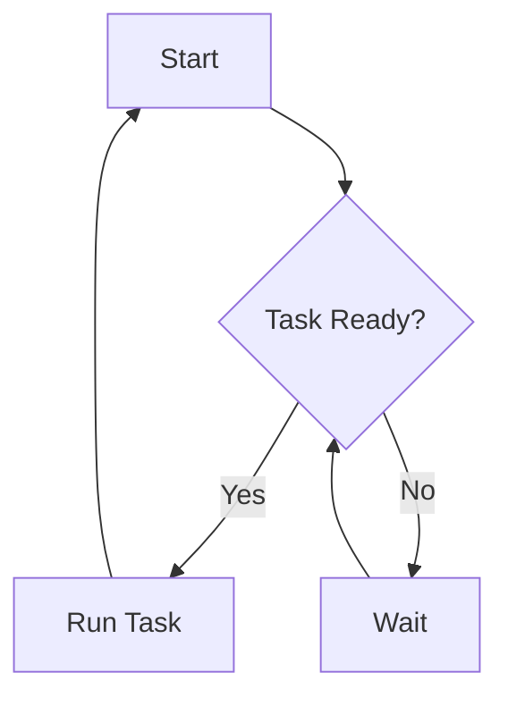
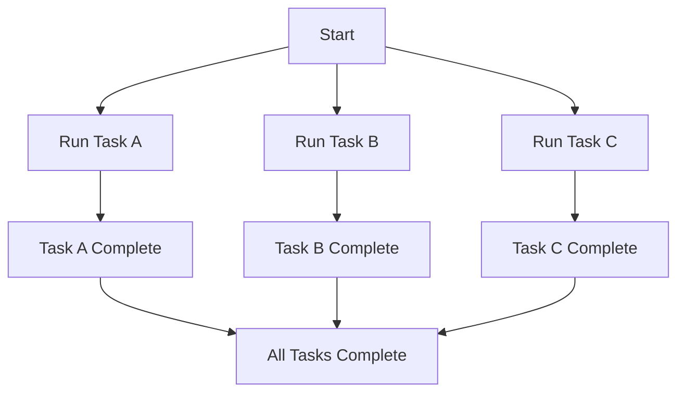
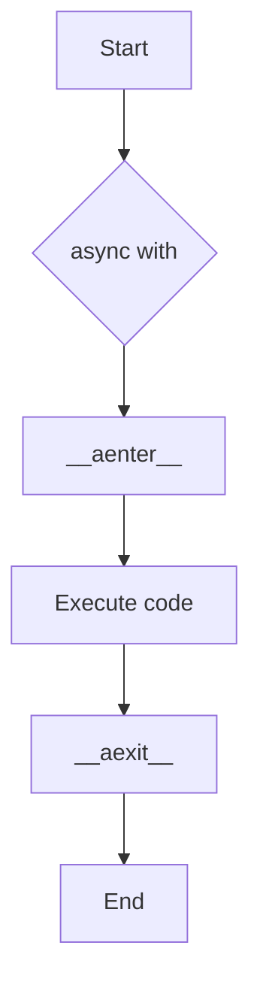
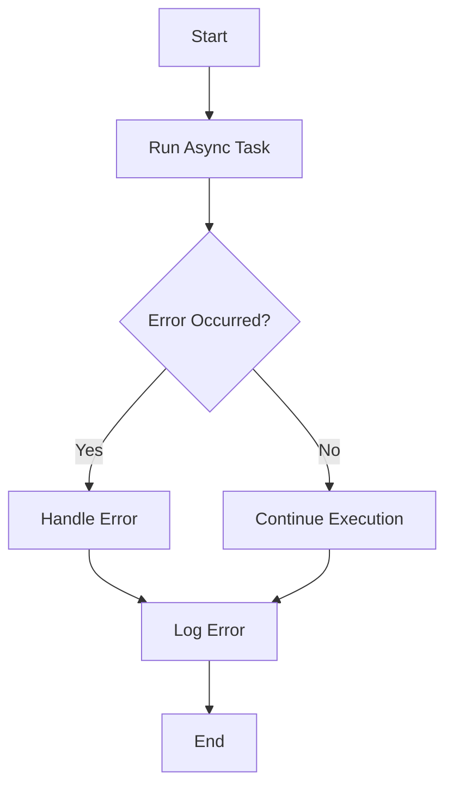
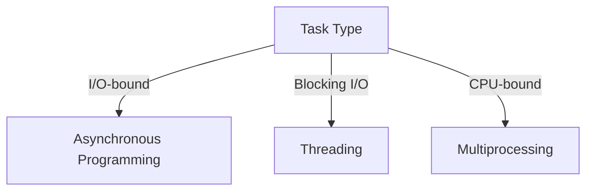

Error: API request failed with error: 401 Client Error: Unauthorized for url: https://openrouter.ai/api/v1/chat/completions

# <span style="color:#e67e22;">What we will learn in this post?</span>
<ul style='list-style-type: none; padding-left: 0;'>
<li><span style='color: #2980b9; font-size: 20px; font-weight: bold;'>👉</span> <span style='color: #2ecc71; font-size: 18px; font-weight: bold;'>Introduction to Asynchronous Programming</span></li>
<li><span style='color: #2980b9; font-size: 20px; font-weight: bold;'>👉</span> <span style='color: #2ecc71; font-size: 18px; font-weight: bold;'>async and await Keywords</span></li>
<li><span style='color: #2980b9; font-size: 20px; font-weight: bold;'>👉</span> <span style='color: #2ecc71; font-size: 18px; font-weight: bold;'>The asyncio Module</span></li>
<li><span style='color: #2980b9; font-size: 20px; font-weight: bold;'>👉</span> <span style='color: #2ecc71; font-size: 18px; font-weight: bold;'>Async Context Managers and Iterators</span></li>
<li><span style='color: #2980b9; font-size: 20px; font-weight: bold;'>👉</span> <span style='color: #2ecc71; font-size: 18px; font-weight: bold;'>Working with Async HTTP Requests</span></li>
<li><span style='color: #2980b9; font-size: 20px; font-weight: bold;'>👉</span> <span style='color: #2ecc71; font-size: 18px; font-weight: bold;'>Error Handling in Async Code</span></li>
<li><span style='color: #2980b9; font-size: 20px; font-weight: bold;'>👉</span> <span style='color: #2ecc71; font-size: 18px; font-weight: bold;'>Async vs Threading vs Multiprocessing</span></li>
</ul>

# <span style="color:#e67e22">Introduction to Asynchronous Programming</span> 🌟

Asynchronous programming is a powerful way to handle tasks in programming, especially when dealing with **I/O-bound operations** like reading files or making network requests. Let's break it down!

## <span style="color:#2980b9">Synchronous vs. Asynchronous Execution</span> ⚖️

- **Synchronous Execution**: Tasks are completed one after another. If one task takes time, the whole program waits. Think of it like waiting in line at a coffee shop. ☕
  
- **Asynchronous Execution**: Tasks can run independently. While one task is waiting (like fetching data), others can continue. Imagine ordering coffee and browsing your phone while you wait! 📱

### <span style="color:#8e44ad">Why Use Async Programming?</span> 🚀

- **Efficiency**: It allows programs to do more in less time.
- **Responsiveness**: User interfaces remain active while waiting for tasks to complete.

## <span style="color:#2980b9">The Event Loop Concept</span> 🔄

The **event loop** is the heart of asynchronous programming. It manages tasks and ensures they run smoothly. Here’s a simple flow:



For more in-depth information, check out these resources:
- [MDN Web Docs on Asynchronous Programming](https://developer.mozilla.org/en-US/docs/Learn/JavaScript/Asynchronous)
- [Async Programming in Python](https://realpython.com/async-io-python/)

Embrace asynchronous programming to make your applications faster and more efficient! 🌈

# <span style="color:#e67e22">Understanding Async and Await in Python</span> 🌟

## <span style="color:#2980b9">What are Async and Await?</span>

In Python, **`async`** and **`await`** are keywords that help you write **asynchronous code**. This means your program can do other things while waiting for tasks to finish, like downloading files or fetching data from the internet. 🚀

### <span style="color:#8e44ad">Defining Async Functions</span>

To create an **asynchronous function** (also called a **coroutine**), you use the `async def` syntax. Here’s a simple example:

```python
async def greet():
    print("Hello!")
```

### <span style="color:#8e44ad">Awaiting a Coroutine</span>

To run an async function, you need to use the **`await`** keyword. This tells Python to wait for the function to finish before moving on. Here’s how you do it:

```python
import asyncio

async def greet():
    print("Hello!")

async def main():
    await greet()

# Run the main function
asyncio.run(main())
```

### <span style="color:#2980b9">Key Points</span>

- **`async`** defines a coroutine.
- **`await`** pauses the function until the awaited coroutine finishes.
- Use **`asyncio.run()`** to execute the main coroutine.

For more details, check out the [official Python documentation](https://docs.python.org/3/library/asyncio.html). Happy coding! 🎉

# <span style="color:#e67e22">Introduction to asyncio</span> 🌟

The `asyncio` module in Python is a powerful tool for writing concurrent code using the **async/await** syntax. It allows you to run multiple tasks at the same time, making your programs faster and more efficient. Let's explore some key functions!

## <span style="color:#2980b9">Key Functions</span>

### <span style="color:#8e44ad">1. asyncio.run()</span>
This function is used to run the main coroutine. It sets up the event loop and executes your async code.

```python
import asyncio

async def main():
    print("Hello, asyncio!")

asyncio.run(main())
```

### <span style="color:#8e44ad">2. asyncio.create_task()</span>
This function creates a task from a coroutine, allowing it to run concurrently.

```python
async def task(name):
    print(f"Task {name} started")
    await asyncio.sleep(1)
    print(f"Task {name} completed")

asyncio.create_task(task("A"))
```

### <span style="color:#8e44ad">3. asyncio.gather()</span>
This function runs multiple coroutines at once and waits for them to finish.

```python
async def main():
    await asyncio.gather(task("A"), task("B"))

asyncio.run(main())
```

### <span style="color:#8e44ad">4. asyncio.sleep()</span>
This function pauses the coroutine for a specified time, simulating a delay.

## <span style="color:#2980b9">Running Multiple Coroutines</span> 🚀

You can run multiple tasks concurrently using `asyncio.gather()`. Here’s a simple example:

```python
async def main():
    await asyncio.gather(task("A"), task("B"), task("C"))

asyncio.run(main())
```

### <span style="color:#8e44ad">Flowchart of Execution</span>



For more information, check out the [official asyncio documentation](https://docs.python.org/3/library/asyncio.html).

With `asyncio`, you can easily manage multiple tasks, making your applications more responsive and efficient! Happy coding! 🎉

# <span style="color:#e67e22">Understanding Async Context Managers and Iterators</span>

Async programming in Python helps you write code that can handle many tasks at once without waiting for each one to finish. Let's break down some key concepts: 

## <span style="color:#2980b9">Async Context Managers (async with)</span>

Async context managers allow you to manage resources like files or network connections in an asynchronous way. You use the `async with` statement to ensure resources are properly cleaned up.

### Example:
```python
import aiofiles

async with aiofiles.open('file.txt', mode='r') as f:
    contents = await f.read()
```

## <span style="color:#2980b9">Async Iterators (async for)</span>

Async iterators let you loop over data that is fetched asynchronously. You use `async for` to iterate through items.

### Example:
```python
class AsyncCounter:
    def __init__(self, count):
        self.count = count

    def __aiter__(self):
        self.current = 0
        return self

    async def __anext__(self):
        if self.current < self.count:
            self.current += 1
            return self.current
        raise StopAsyncIteration

async for number in AsyncCounter(3):
    print(number)  # Outputs: 1, 2, 3
```

## <span style="color:#2980b9">Key Methods</span>

- **`__aenter__`**: Called when entering the async context.
- **`__aexit__`**: Called when exiting the async context.
- **`__aiter__`**: Prepares the async iterator.
- **`__anext__`**: Fetches the next item in the async iterator.

### Flowchart of Async Context Manager


For more details, check out the [Python documentation on async](https://docs.python.org/3/library/asyncio-task.html). Happy coding! 😊

# <span style="color:#e67e22">Using aiohttp for Async HTTP Requests</span> 🚀

## <span style="color:#2980b9">What is aiohttp?</span>

`aiohttp` is a Python library that helps you make **asynchronous HTTP requests**. This means you can fetch multiple URLs at the same time, which is much faster than doing it one by one! 🌐

### <span style="color:#8e44ad">Why Use Async Requests?</span>

- **Speed**: Fetch multiple APIs concurrently.
- **Efficiency**: Use less time waiting for responses.
- **Scalability**: Handle more requests without blocking.

## <span style="color:#2980b9">Example: Fetching Multiple URLs</span>

Here’s a simple example to show how `aiohttp` works:

```python
import aiohttp
import asyncio

async def fetch(url):
    async with aiohttp.ClientSession() as session:
        async with session.get(url) as response:
            return await response.text()

async def main():
    urls = [
        'https://api.example.com/data1',
        'https://api.example.com/data2',
        'https://api.example.com/data3',
    ]
    tasks = [fetch(url) for url in urls]
    results = await asyncio.gather(*tasks)
    print(results)

# Run the main function
asyncio.run(main())
```

### <span style="color:#8e44ad">How It Works</span>

1. **Define a fetch function**: This function makes a request to a URL.
2. **Create a list of URLs**: These are the APIs you want to call.
3. **Use asyncio.gather**: This runs all fetch tasks at once!

## <span style="color:#2980b9">Conclusion</span>

Using `aiohttp` can significantly improve your application's performance when dealing with multiple API calls. For more details, check out the [aiohttp documentation](https://docs.aiohttp.org/en/stable/).

Happy coding! 🎉

# <span style="color:#e67e22">Handling Exceptions in Async Code</span> 🌟

Async programming can be tricky, especially when it comes to handling errors. Let's break it down simply!

## <span style="color:#2980b9">Using `try-except` with `await`</span> 🛠️

When you use `await`, wrap it in a `try-except` block to catch errors:

```python
import asyncio

async def risky_task():
    await asyncio.sleep(1)
    raise ValueError("Oops! Something went wrong.")

async def main():
    try:
        await risky_task()
    except ValueError as e:
        print(f"Caught an error: {e}")

# Run the main function
asyncio.run(main())
```
* **Explanation**: If `risky_task` raises an error, it will be caught and printed.

## <span style="color:#2980b9">Using `asyncio.gather` with `return_exceptions=True`</span> 🎉

You can run multiple tasks and handle errors gracefully:

```python
async def safe_task(n):
    await asyncio.sleep(n)
    if n == 2:
        raise ValueError("Error in task 2")
    return f"Task {n} completed!"

async def main():
    results = await asyncio.gather(
        safe_task(1),
        safe_task(2),
        safe_task(3),
        return_exceptions=True
    )
    print(results)

# Run the main function
asyncio.run(main())
```
* **Explanation**: This will return the error as part of the results list instead of stopping the program.

## <span style="color:#2980b9">Best Practices for Async Error Handling</span> 🌈

- **Always use `try-except`**: Wrap your awaited calls to catch errors.
- **Use `return_exceptions=True`**: When gathering multiple tasks, this helps you handle errors without crashing.
- **Log errors**: Instead of just printing, consider logging them for better tracking.

For more details, check out [Python's asyncio documentation](https://docs.python.org/3/library/asyncio-task.html).

### <span style="color:#8e44ad">Flowchart of Async Error Handling</span> 🗺️



By following these tips, you'll handle exceptions in your async code like a pro! Happy coding! 😊

# <span style="color:#e67e22">Understanding Asynchronous Programming, Threading, and Multiprocessing</span>

Programming can be tricky, especially when it comes to handling tasks that take time. Let’s break down three popular methods: **asynchronous programming**, **threading**, and **multiprocessing**. Each has its own strengths!

## <span style="color:#2980b9">Asynchronous Programming 🌐</span>

- **Best for**: I/O-bound tasks (like web requests or file reading).
- **How it works**: It allows your program to handle other tasks while waiting for I/O operations to complete.
- **Example**: Imagine downloading multiple files at once without waiting for each to finish. You can use `async` and `await` in Python to achieve this.

```python
async def download_files():
    await asyncio.gather(file1, file2, file3)
```

## <span style="color:#2980b9">Threading 🧵</span>

- **Best for**: I/O-bound tasks that use blocking libraries.
- **How it works**: It creates multiple threads that can run concurrently, but they share the same memory space.
- **Example**: If you’re using a library that blocks while waiting for data (like a database query), threading can help keep your app responsive.

```python
import threading

def fetch_data():
    # Simulate a blocking operation
    pass

thread = threading.Thread(target=fetch_data)
thread.start()
```

## <span style="color:#2980b9">Multiprocessing 🔄</span>

- **Best for**: CPU-bound tasks (like heavy calculations).
- **How it works**: It uses separate memory spaces and runs tasks in parallel, making full use of multiple CPU cores.
- **Example**: If you’re processing large datasets, using multiprocessing can speed things up significantly.

```python
from multiprocessing import Process

def process_data():
    # Heavy computation here
    pass

process = Process(target=process_data)
process.start()
```

### <span style="color:#8e44ad">When to Use Each</span>

- **Use async** for tasks that wait on external resources.
- **Use threading** when dealing with blocking I/O operations.
- **Use multiprocessing** for tasks that require heavy computation.

### <span style="color:#8e44ad">Visual Summary</span>



For more in-depth information, check out these resources:
- [Asynchronous Programming in Python](https://docs.python.org/3/library/asyncio.html)
- [Threading in Python](https://docs.python.org/3/library/threading.html)
- [Multiprocessing in Python](https://docs.python.org/3/library/multiprocessing.html)

Happy coding! 🎉

