<!--
meta-description: "Complete guide to Python type hints and static typing. Learn type annotations, typing module, advanced features like generics and protocols, mypy static analysis, and best practices for production Python code."
keywords: "Python type hints, static typing Python, mypy, type annotations, typing module, PEP 484, generic types, type checking, Python best practices, static analysis"
-->

# <span style="color:#e67e22;">What we will learn in this post?</span>
<ul style='list-style-type: none; padding-left: 0;'>
<li><span style='color: #2980b9; font-size: 20px; font-weight: bold;'>👉</span> <span style='color: #2ecc71; font-size: 18px; font-weight: bold;'>Introduction to Type Hints</span></li>
<li><span style='color: #2980b9; font-size: 20px; font-weight: bold;'>👉</span> <span style='color: #2ecc71; font-size: 18px; font-weight: bold;'>Basic Type Annotations</span></li>
<li><span style='color: #2980b9; font-size: 20px; font-weight: bold;'>👉</span> <span style='color: #2ecc71; font-size: 18px; font-weight: bold;'>The typing Module</span></li>
<li><span style='color: #2980b9; font-size: 20px; font-weight: bold;'>👉</span> <span style='color: #2ecc71; font-size: 18px; font-weight: bold;'>Advanced Type Hints</span></li>
<li><span style='color: #2980b9; font-size: 20px; font-weight: bold;'>👉</span> <span style='color: #2ecc71; font-size: 18px; font-weight: bold;'>Type Checking with mypy</span></li>
<li><span style='color: #2980b9; font-size: 20px; font-weight: bold;'>👉</span> <span style='color: #2ecc71; font-size: 18px; font-weight: bold;'>Type Hints Best Practices</span></li>
</ul>

# <span style="color:#e67e22">Introduction to Type Hints in Python</span> 🐍

Type hints are a way to indicate the expected data types of variables and function parameters in Python. They help make your code clearer and easier to understand. Let's explore their benefits and how they differ from static typing in other languages!

Type hints transform Python development by enabling static analysis and improving code maintainability. They serve as living documentation that IDEs and tools can leverage for better developer experience.

## <span style="color:#2980b9">Benefits of Type Hints</span> 🌟

- **Improved Documentation**: Type hints serve as a form of documentation, making it easier for others (and yourself) to understand what types of data are expected.
- **Better IDE Support**: Many Integrated Development Environments (IDEs) can use type hints to provide better autocompletion and error checking.

### <span style="color:#8e44ad">How They Work</span> 🔍

Type hints do not enforce types at runtime. They are just suggestions for developers and tools. Here’s a simple example:

```python
def greet(name: str) -> str:
    # This function takes a string and returns a string
    return f"Hello, {name}!"

# Using the function
print(greet("Alice"))  # Output: Hello, Alice!
```

In this example:
- `name: str` indicates that `name` should be a string.
- `-> str` shows that the function returns a string.

### <span style="color:#8e44ad">Type Hints vs. Static Typing</span> ⚖️

- **Python's Flexibility**: Unlike languages like Java or C++, Python's type hints are optional and do not enforce type checking at runtime.
- **Dynamic vs. Static**: Python remains dynamically typed, meaning you can still pass any type of data to functions without errors during execution.

---

By using type hints, you can write clearer and more maintainable code while enjoying the flexibility of Python! Happy coding! 🎉

# <span style="color:#e67e22">Understanding Basic Type Annotations</span> 🌟

Type annotations in Python help us understand what kind of data we are working with. They make our code clearer and easier to read! Let’s explore some basic types: `int`, `str`, `float`, `bool`, `list`, `dict`, and `tuple`.

## <span style="color:#2980b9">What are Type Annotations?</span> 🤔

Type annotations are hints about the type of a variable or function. They look like this:

```python
def greet(name: str) -> str:
    return f"Hello, {name}!"
```

### <span style="color:#8e44ad">Common Types</span> 📋

- **`int`**: Represents whole numbers.
  ```python
  age: int = 25
  ```

- **`str`**: Represents text.
  ```python
  name: str = "Alice"
  ```

- **`float`**: Represents decimal numbers.
  ```python
  price: float = 19.99
  ```

- **`bool`**: Represents `True` or `False`.
  ```python
  is_active: bool = True
  ```

- **`list`**: Represents a collection of items.
  ```python
  scores: list[int] = [90, 85, 88]
  ```

- **`dict`**: Represents key-value pairs.
  ```python
  user: dict[str, int] = {"Alice": 25, "Bob": 30}
  ```

- **`tuple`**: Represents an ordered collection.
  ```python
  point: tuple[int, int] = (10, 20)
  ```

### <span style="color:#8e44ad">Why Use Type Annotations?</span> 💡

- **Clarity**: Makes your code easier to understand.
- **Error Checking**: Helps catch errors early.
- **Documentation**: Acts as a guide for others reading your code.

# <span style="color:#e67e22">Introduction to the Typing Module</span> 🖥️

The **typing module** in Python helps us define more complex types for our variables. This makes our code clearer and easier to understand. Let’s explore some key types you can use!

## <span style="color:#2980b9">Key Types in the Typing Module</span> 🔑

- **List**: A collection of items.  
  ```python
  from typing import List
  def get_numbers() -> List[int]:
      return [1, 2, 3]
  ```

- **Dict**: A collection of key-value pairs.  
  ```python
  from typing import Dict
  def get_user() -> Dict[str, str]:
      return {"name": "Alice", "age": "30"}
  ```

- **Tuple**: An ordered collection of items.  
  ```python
  from typing import Tuple
  def get_coordinates() -> Tuple[float, float]:
      return (10.0, 20.0)
  ```

- **Set**: A collection of unique items.  
  ```python
  from typing import Set
  def get_unique_numbers() -> Set[int]:
      return {1, 2, 3}
  ```

- **Optional**: Indicates that a value can be of a specified type or `None`.  
  ```python
  from typing import Optional
  def find_item(item_id: int) -> Optional[str]:
      return "Item" if item_id == 1 else None
  ```

- **Union**: Allows a variable to be one of several types.  
  ```python
  from typing import Union
  def process(value: Union[int, str]) -> str:
      return str(value)
  ```

- **Any**: Represents any type.  
  ```python
  from typing import Any
  def log(value: Any) -> None:
      print(value)
  ```

### <span style="color:#8e44ad">Why Use Type Hints?</span> 🤔

- **Clarity**: Makes your code easier to read.
- **Error Checking**: Helps catch errors early.
- **Documentation**: Serves as a guide for others reading your code.

```mermaid
graph TD;
    A[📚 Typing Module]:::style1 --> B[📋 List]:::style2
    A --> C[📖 Dict]:::style3
    A --> D[🔗 Tuple]:::style4
    A --> E[🎯 Set]:::style5
    A --> F[❓ Optional]:::style6
    A --> G[🔀 Union]:::style7
    A --> H[🎭 Any]:::style8

    classDef style1 fill:#ff4f81,stroke:#c43e3e,color:#fff,font-size:16px,stroke-width:3px,rx:14,shadow:6px;
    classDef style2 fill:#6b5bff,stroke:#4a3f6b,color:#fff,font-size:16px,stroke-width:3px,rx:14,shadow:6px;
    classDef style3 fill:#ffd700,stroke:#d99120,color:#222,font-size:16px,stroke-width:3px,rx:14,shadow:6px;
    classDef style4 fill:#00bfae,stroke:#005f99,color:#fff,font-size:16px,stroke-width:3px,rx:14,shadow:6px;
    classDef style5 fill:#ff9800,stroke:#f57c00,color:#fff,font-size:16px,stroke-width:3px,rx:14,shadow:6px;
    classDef style6 fill:#43e97b,stroke:#38f9d7,color:#fff,font-size:16px,stroke-width:3px,rx:14,shadow:6px;
    classDef style7 fill:#9e9e9e,stroke:#616161,color:#fff,font-size:16px,stroke-width:3px,rx:14,shadow:6px;
    classDef style8 fill:#e67e22,stroke:#d35400,color:#fff,font-size:16px,stroke-width:3px,rx:14,shadow:6px;

    class A style1;
    class B style2;
    class C style3;
    class D style4;
    class E style5;
    class F style6;
    class G style7;
    class H style8;

    linkStyle default stroke:#e67e22,stroke-width:3px;
```

### <span style="color:#8e44ad">Visual Representation</span> 📊



Using the typing module can greatly enhance your Python programming experience! Happy coding! 🎉

## <span style="color:#2980b9">Production-Ready Type Hints Examples</span> 🚀

### <span style="color:#8e44ad">REST API with FastAPI</span>
```python
from fastapi import FastAPI
from pydantic import BaseModel
from typing import List, Optional

app = FastAPI()

class User(BaseModel):
    id: int
    name: str
    email: str
    age: Optional[int] = None

class UserCreate(BaseModel):
    name: str
    email: str
    age: Optional[int] = None

users_db: List[User] = []

@app.post("/users/", response_model=User)
def create_user(user: UserCreate) -> User:
    new_user = User(id=len(users_db) + 1, **user.dict())
    users_db.append(new_user)
    return new_user

@app.get("/users/", response_model=List[User])
def get_users() -> List[User]:
    return users_db
```

### <span style="color:#8e44ad">Data Processing Pipeline</span>
```python
from typing import Dict, List, Callable, Any, Iterator
import pandas as pd

DataFrame = Any  # Using Any for pandas DataFrame

class DataProcessor:
    def __init__(self, data: DataFrame):
        self.data = data
        self.transformers: List[Callable[[DataFrame], DataFrame]] = []

    def add_transformer(self, transformer: Callable[[DataFrame], DataFrame]) -> None:
        self.transformers.append(transformer)

    def process(self) -> DataFrame:
        result = self.data
        for transformer in self.transformers:
            result = transformer(result)
        return result

def validate_data(df: DataFrame) -> DataFrame:
    """Validate and clean data"""
    # Implementation here
    return df

def normalize_features(df: DataFrame) -> DataFrame:
    """Normalize numerical features"""
    # Implementation here
    return df

# Usage
processor = DataProcessor(raw_data)
processor.add_transformer(validate_data)
processor.add_transformer(normalize_features)
processed_data = processor.process()
```

### <span style="color:#8e44ad">Generic Repository Pattern</span>
```python
from typing import TypeVar, Generic, List, Optional, Protocol
from abc import ABC, abstractmethod

T = TypeVar('T')
ID = TypeVar('ID')

class Entity(Protocol):
    id: ID

class Repository(Generic[T, ID], ABC):
    @abstractmethod
    def save(self, entity: T) -> T:
        pass

    @abstractmethod
    def find_by_id(self, id: ID) -> Optional[T]:
        pass

    @abstractmethod
    def find_all(self) -> List[T]:
        pass

    @abstractmethod
    def delete(self, entity: T) -> None:
        pass

class InMemoryRepository(Generic[T, ID], Repository[T, ID]):
    def __init__(self):
        self._storage: Dict[ID, T] = {}

    def save(self, entity: T) -> T:
        self._storage[entity.id] = entity
        return entity

    def find_by_id(self, id: ID) -> Optional[T]:
        return self._storage.get(id)

    def find_all(self) -> List[T]:
        return list(self._storage.values())

    def delete(self, entity: T) -> None:
        if entity.id in self._storage:
            del self._storage[entity.id]
```

# <span style="color:#e67e22">Advanced Typing Features in Python</span>

Python's typing system can be quite powerful! Let's explore some advanced features that can help you write clearer and more maintainable code. 🚀

## <span style="color:#2980b9">1. Callable</span>

A **Callable** is a type hint for functions or objects that can be called like functions. Use it when you want to specify that a parameter should be a function.

```python
from typing import Callable

def execute(func: Callable[[int], int], value: int) -> int:
    return func(value)
```

## <span style="color:#2980b9">2. TypeVar</span>

**TypeVar** allows you to create generic types. This is useful when you want to write functions that can work with any type.

```python
from typing import TypeVar, List

T = TypeVar('T')

def first_element(elements: List[T]) -> T:
    return elements[0]
```

## <span style="color:#2980b9">3. Generic</span>

**Generic** is used to define classes or functions that can operate on any type. Combine it with TypeVar for flexibility.

```python
from typing import Generic

class Box(Generic[T]):
    def __init__(self, content: T):
        self.content = content
```

## <span style="color:#2980b9">4. Protocol</span>

A **Protocol** defines a set of methods and properties that a class must implement. It’s like an interface in other languages.

```python
from typing import Protocol

class Drawable(Protocol):
    def draw(self) -> None:
        ...

def render(shape: Drawable) -> None:
    shape.draw()
```

## <span style="color:#2980b9">5. Literal</span>

**Literal** allows you to specify that a variable can only take certain values. This is great for constants.

```python
from typing import Literal

def set_direction(direction: Literal['left', 'right']) -> None:
    print(f"Moving {direction}")
```

## <span style="color:#2980b9">6. TypedDict</span>

**TypedDict** is used for dictionaries with a fixed set of keys, each with a specific type.

```python
from typing import TypedDict

class User(TypedDict):
    name: str
    age: int

user: User = {"name": "Alice", "age": 30}
```

# <span style="color:#e67e22">Introduction to Mypy: Your Friendly Static Type Checker</span> 🌟

Mypy is a powerful tool that helps you catch type errors in your Python code before you run it. By adding type hints, you can make your code more readable and maintainable. Let’s dive in!

## <span style="color:#2980b9">Installing Mypy</span> 🚀

To install Mypy, simply run:

```bash
pip install mypy
```

## <span style="color:#2980b9">Running Mypy</span> 🏃‍♂️

To check your Python file, use:

```bash
mypy your_script.py
```

## <span style="color:#2980b9">Configuring mypy.ini</span> ⚙️

Create a `mypy.ini` file in your project directory to customize settings:

```ini
[mypy]
ignore_missing_imports = True
strict = True
```

### <span style="color:#8e44ad">Common Type Checking Errors</span> ❌

- **Incompatible types**: When you assign a value of one type to a variable of another type.
  
  ```python
  def add(a: int, b: int) -> int:
      return a + b

  add(1, "2")  # Error: Argument 2 has incompatible type "str"
  ```

- **Missing type hints**: Functions without type hints can lead to confusion.

## <span style="color:#2980b9">Gradually Adding Types</span> 🐢

Start by adding type hints to function signatures:

```python
def greet(name: str) -> str:
    return f"Hello, {name}!"
```

Then, gradually add types to variables and return values.

# <span style="color:#e67e22">Best Practices for Type Hints in Python</span>

Type hints help make your Python code clearer and safer. Here’s how to use them effectively! 😊

## <span style="color:#2980b9">When to Use Type Hints</span>

- **New Code**: Always use type hints in new projects. It improves readability.
- **Function Signatures**: Add hints to function parameters and return types.

```python
def greet(name: str) -> str:
    return f"Hello, {name}!"
```

## <span style="color:#2980b9">Handling Legacy Code</span>

- **Gradual Adoption**: Start adding type hints to critical parts of legacy code.
- **Use `# type: ignore`**: If a type hint causes issues, you can ignore it.

```python
def legacy_function(data):
    # type: ignore
    return data
```

## <span style="color:#2980b9">Using Stub Files (.pyi)</span>

- **Separate Type Information**: Create `.pyi` files for libraries without type hints.

```python
# example.pyi
def add(x: int, y: int) -> int: ...
```

## <span style="color:#2980b9">Balancing Type Safety with Flexibility</span>

- **Be Pragmatic**: Use type hints where they add value, but don’t overdo it.
- **Use `Any` for Flexibility**: When unsure, use `Any` to allow any type.

```python
from typing import Any

def process(data: Any) -> None:
    print(data)
```
By following these practices, you can enhance your code's clarity and maintainability! Happy coding! 🎉

---

<details style='border: 2px solid #00bfae; border-radius: 8px; padding: 20px; background: linear-gradient(135deg, #e0f7f5 0%, #fff 100%); margin: 25px 0; box-shadow: 0 6px 12px rgba(0, 191, 174, 0.15);'>
<summary style='cursor: pointer; font-size: 1.3em; font-weight: bold; color: #00bfae; padding: 10px 0;'>
🎯 Hands-On Assignment: Build a Type-Safe Task Management System 🚀
</summary>

<div style='margin-top: 20px; color: #2c3e50; line-height: 1.6;'>

<h3 style='color: #00bfae; border-bottom: 2px solid #00bfae; padding-bottom: 8px; margin-top: 20px;'>📝 Your Mission</h3>

Create a comprehensive task management system using advanced Python type hints. Implement a type-safe task tracker with generic repositories, protocols, and full mypy validation.

<h3 style='color: #00bfae; border-bottom: 2px solid #00bfae; padding-bottom: 8px; margin-top: 20px;'>🎯 Requirements</h3>

<ol style='margin-left: 20px;'>
<li>Implement a generic repository pattern with proper type constraints</li>
<li>Create task and user models using TypedDict and protocols</li>
<li>Build a task service with dependency injection and type safety</li>
<li>Add comprehensive type hints for all methods and data structures</li>
<li>Configure mypy with strict settings and resolve all type errors</li>
<li>Implement data validation using type guards and literal types</li>
</ol>

<h3 style='color: #00bfae; border-bottom: 2px solid #00bfae; padding-bottom: 8px; margin-top: 20px;'>💡 Implementation Hints</h3>

<ol style='margin-left: 20px;'>
<li>Use TypeVar for generic repository implementation</li>
<li>Define protocols for service interfaces and data models</li>
<li>Implement type guards for runtime type checking</li>
<li>Use Literal types for status enums and validation</li>
<li>Configure mypy.ini with strict_optional and disallow_any_generics</li>
</ol>

<h3 style='color: #00bfae; border-bottom: 2px solid #00bfae; padding-bottom: 8px; margin-top: 20px;'>🚀 Example Project Structure</h3>

<pre style='background: #2c3e50; color: #ecf0f1; padding: 20px; border-radius: 8px; overflow-x: auto; margin: 15px 0;'><code class='language-bash'>task-manager/
├── models/
│   ├── __init__.py
│   ├── task.py
│   └── user.py
├── repositories/
│   ├── __init__.py
│   ├── base.py
│   └── task_repository.py
├── services/
│   ├── __init__.py
│   └── task_service.py
├── main.py
├── mypy.ini
└── requirements.txt
</code></pre>

<h3 style='color: #00bfae; border-bottom: 2px solid #00bfae; padding-bottom: 8px; margin-top: 25px;'>🏆 Bonus Challenges</h3>

<ul style='margin-left: 20px;'>
<li><strong>Level 2</strong>: Add async support with proper type hints for coroutines</li>
<li><strong>Level 3</strong>: Implement event-driven architecture with typed event handlers</li>
<li><strong>Level 4</strong>: Add comprehensive unit tests with type-aware mocking</li>
<li><strong>Level 5</strong>: Create a FastAPI REST API with automatic OpenAPI generation</li>
</ul>

<h3 style='color: #00bfae; border-bottom: 2px solid #00bfae; padding-bottom: 8px; margin-top: 25px;'>📚 Learning Goals</h3>

<ul style='margin-left: 20px;'>
<li>Master advanced Python type hints and generics 🎯</li>
<li>Implement type-safe repository patterns ✨</li>
<li>Use protocols and TypedDict for structured data 🔒</li>
<li>Configure mypy for production-grade type checking 🛠️</li>
<li>Apply type-driven development practices 📝</li>
</ul>

<p style='background: #3498db; color: #fff; padding: 15px; border-radius: 8px; margin-top: 20px; border-left: 5px solid #2980b9;'>
<strong>💡 Pro Tip:</strong> This type-safe approach is used by major Python projects like Django, FastAPI, and Pandas for building reliable, maintainable software!
</p>

<p style='margin-top: 20px; font-size: 1.1em;'><strong>Share Your Solution! 💬</strong></p>
<p>Completed the task management system? <strong>Post your type-safe code and mypy configuration in the comments below!</strong> Show us your Python typing mastery! 🚀✨</p>

</div>
</details>

---

# <span style="color:#e67e22">Conclusion: Embrace Type Hints for Production-Ready Python Code 🎓</span>

Type hints and static typing transform Python from a dynamically typed language into a robust, maintainable powerhouse. By mastering type annotations, mypy, and advanced typing features, you can catch errors early and build software that scales confidently from prototypes to enterprise systems.

