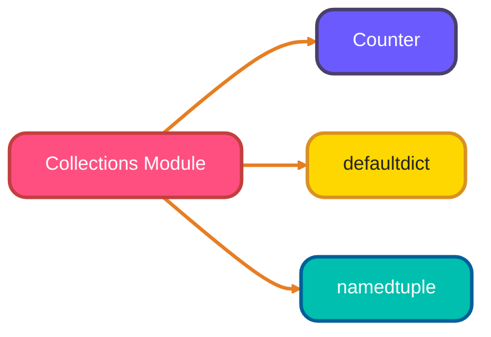
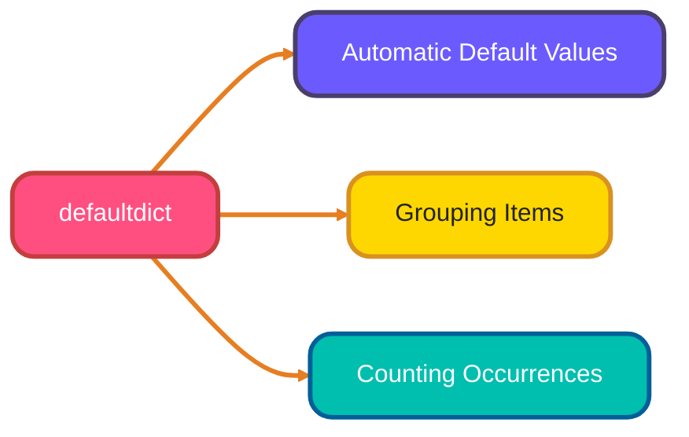
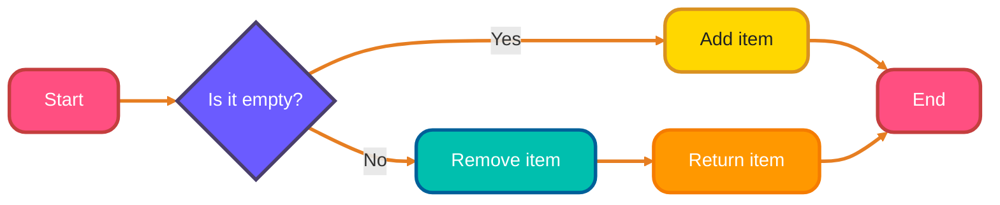
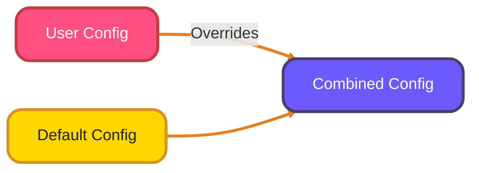
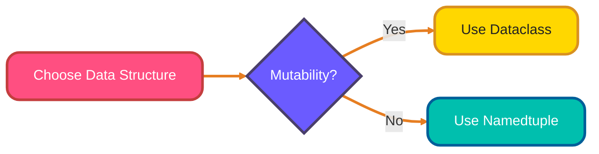

<!--
meta-description: "Comprehensive guide to Python's collections module featuring Counter for counting, defaultdict for default values, OrderedDict for ordered mappings, deque for double-ended queues, ChainMap for combining dictionaries, and comparisons between namedtuple and dataclasses."
keywords: "Python collections module, Counter class, defaultdict dictionary, OrderedDict, deque double-ended queue, ChainMap, namedtuple, dataclasses, data structures, Python programming"
-->

# <span style="color:#e67e22;">What we will learn in this post?</span>
<ul style='list-style-type: none; padding-left: 0;'>
<li><span style='color: #2980b9; font-size: 20px; font-weight: bold;'>👉</span> <span style='color: #2ecc71; font-size: 18px; font-weight: bold;'>Introduction to Collections Module</span></li>
<li><span style='color: #2980b9; font-size: 20px; font-weight: bold;'>👉</span> <span style='color: #2ecc71; font-size: 18px; font-weight: bold;'>Counter</span></li>
<li><span style='color: #2980b9; font-size: 20px; font-weight: bold;'>👉</span> <span style='color: #2ecc71; font-size: 18px; font-weight: bold;'>defaultdict</span></li>
<li><span style='color: #2980b9; font-size: 20px; font-weight: bold;'>👉</span> <span style='color: #2ecc71; font-size: 18px; font-weight: bold;'>OrderedDict</span></li>
<li><span style='color: #2980b9; font-size: 20px; font-weight: bold;'>👉</span> <span style='color: #2ecc71; font-size: 18px; font-weight: bold;'>deque (Double-Ended Queue)</span></li>
<li><span style='color: #2980b9; font-size: 20px; font-weight: bold;'>👉</span> <span style='color: #2ecc71; font-size: 18px; font-weight: bold;'>ChainMap</span></li>
<li><span style='color: #2980b9; font-size: 20px; font-weight: bold;'>👉</span> <span style='color: #2ecc71; font-size: 18px; font-weight: bold;'>namedtuple and dataclasses</span></li>
</ul>

# <span style="color:#e67e22">Introduction to Python's Collections Module</span>

Python's **collections module** is a treasure trove of specialized container data types that enhance the built-in types like lists and dictionaries. These containers are designed to make your coding life easier and more efficient! 🌟

## <span style="color:#2980b9">Why Use Collections?</span>

Using the collections module can help you:

- **Simplify your code**: Specialized containers can reduce the amount of code you write.
- **Improve performance**: Some collections are optimized for specific tasks.
- **Enhance readability**: They make your intentions clearer to others reading your code.

### <span style="color:#8e44ad">Key Container Types</span>

- **`Counter`**: Counts hashable objects. Great for tallying items!
- **`defaultdict`**: Provides default values for missing keys. Perfect for grouping data!
- **`namedtuple`**: Creates tuple subclasses with named fields. Makes data more understandable!

For more details, check out the [official Python documentation](https://docs.python.org/3/library/collections.html).



Explore these powerful tools to make your Python programming more effective! Happy coding! 🐍✨

# <span style="color:#e67e22">Understanding the Counter Class</span> 🥳

The **Counter** class from the `collections` module in Python is a handy tool for counting hashable objects like strings, numbers, or tuples. It makes counting easy and fun! 🎉

## <span style="color:#2980b9">Key Methods of Counter</span>

### <span style="color:#8e44ad">1. most_common()</span>
- This method returns a list of the most common elements and their counts.
- **Example**: 
  ```python
  from collections import Counter
  word_count = Counter("hello world")
  print(word_count.most_common(2))  # Output: [('l', 3), ('o', 2)]
  ```

### <span style="color:#8e44ad">2. elements()</span>
- This method returns an iterator over elements, repeating each as many times as its count.
- **Example**:
  ```python
  print(list(word_count.elements()))  # Output: ['h', 'e', 'l', 'l', 'l', 'o', ' ', 'w', 'o', 'r', 'l', 'd']
  ```

### <span style="color:#8e44ad">3. update()</span>
- This method adds counts from another iterable or another Counter.
- **Example**:
  ```python
  word_count.update("hello")
  print(word_count)  # Output: Counter({'l': 5, 'o': 3, 'h': 2, 'e': 2, 'w': 1, 'r': 1, 'd': 1})
  ```

## <span style="color:#2980b9">Practical Use Cases</span> 📊

- **Word Frequency Counting**: Easily count how many times each word appears in a text.
- **Inventory Management**: Keep track of items in stock.
- **Data Analysis**: Analyze datasets for repeated values.

For more details, check out the [Python documentation on collections](https://docs.python.org/3/library/collections.html#collections.Counter).

```mermaid
graph LR
  A["Start"]:::style1 --> B["Create Counter"]:::style2
  B --> C["Use most_common()"]:::style3
  C --> D["Use elements()"]:::style4
  D --> E["Use update()"]:::style5
  E --> F["End"]:::style1

  classDef style1 fill:#ff4f81,stroke:#c43e3e,color:#fff,font-size:16px,stroke-width:3px,rx:14,shadow:6px;
  classDef style2 fill:#6b5bff,stroke:#4a3f6b,color:#fff,font-size:16px,stroke-width:3px,rx:14,shadow:6px;
  classDef style3 fill:#ffd700,stroke:#d99120,color:#222,font-size:16px,stroke-width:3px,rx:14,shadow:6px;
  classDef style4 fill:#00bfae,stroke:#005f99,color:#fff,font-size:16px,stroke-width:3px,rx:14,shadow:6px;
  classDef style5 fill:#ff9800,stroke:#f57c00,color:#fff,font-size:16px,stroke-width:3px,rx:14,shadow:6px;

  linkStyle default stroke:#e67e22,stroke-width:3px;
```

### <span style="color:#8e44ad">Flowchart of Counter Usage</span>



With the Counter class, counting becomes a breeze! Happy coding! 😊

# <span style="color:#e67e22">Understanding defaultdict in Python</span>

## <span style="color:#2980b9">What is defaultdict? 🤔</span>

`defaultdict` is a special type of dictionary in Python that automatically provides a default value for missing keys. This means you don’t have to check if a key exists before using it. It’s part of the `collections` module.

### <span style="color:#8e44ad">How Does It Work? 🛠️</span>

When you create a `defaultdict`, you specify a function that returns the default value. For example:

```python
from collections import defaultdict

my_dict = defaultdict(int)  # Default value is 0
my_dict['a'] += 1
print(my_dict)  # Output: defaultdict(<class 'int'>, {'a': 1})
```

## <span style="color:#2980b9">Use Cases for defaultdict 🌟</span>

- **Grouping Items**: You can easily group items without checking if the key exists.

```python
fruits = [('apple', 1), ('banana', 2), ('apple', 3)]
grouped_fruits = defaultdict(list)

for fruit, quantity in fruits:
    grouped_fruits[fruit].append(quantity)

print(grouped_fruits)  # Output: defaultdict(<class 'list'>, {'apple': [1, 3], 'banana': [2]})
```

## <span style="color:#2980b9">Comparison with Regular dict Methods ⚖️</span>

- **Using `dict.get()`**: You need to provide a default value manually.

```python
regular_dict = {}
value = regular_dict.get('key', 0)  # Returns 0 if 'key' is missing
```

- **Using `setdefault()`**: It sets a default value but modifies the dictionary.

```python
regular_dict.setdefault('key', 0)  # Sets 'key' to 0 if it doesn't exist
```

### <span style="color:#8e44ad">Conclusion 🎉</span>

`defaultdict` simplifies your code by handling missing keys gracefully. It’s perfect for tasks like grouping items or counting occurrences. For more details, check out the [Python documentation](https://docs.python.org/3/library/collections.html#collections.defaultdict).



Feel free to explore and enjoy coding with `defaultdict`! 😊

# <span style="color:#e67e22">Understanding OrderedDict in Python</span> 🐍

## <span style="color:#2980b9">What is OrderedDict?</span>

An **OrderedDict** is a special type of dictionary in Python that remembers the order of items. While regular dictionaries maintain order from Python 3.7+, OrderedDict has some unique features that can be very handy!

### <span style="color:#8e44ad">Why Use OrderedDict?</span>

- **Equality Checks**: Two OrderedDicts are equal only if they have the same items in the same order. This is different from regular dicts, where order doesn't matter.
  
- **Move to End**: You can easily move an item to the end of the OrderedDict using the `move_to_end()` method. This is great for managing items dynamically!

### <span style="color:#8e44ad">Practical Examples</span>

```python
from collections import OrderedDict

# Creating an OrderedDict
od = OrderedDict()
od['apple'] = 1
od['banana'] = 2
od['cherry'] = 3

# Moving 'banana' to the end
od.move_to_end('banana')

print(od)  # Output: OrderedDict([('apple', 1), ('cherry', 3), ('banana', 2)])
```

### <span style="color:#2980b9">When to Use OrderedDict?</span>

- When you need to maintain the order of items and care about the sequence.
- When you want to perform operations like moving items around easily.

For more details, check out the [Python documentation on OrderedDict](https://docs.python.org/3/library/collections.html#collections.OrderedDict).

Happy coding! 🎉

# <span style="color:#e67e22">Understanding Deque: A Friendly Guide</span>

## <span style="color:#2980b9">What is a Deque? 🤔</span>

A **deque** (pronounced "deck") is a special type of list that allows you to add and remove items from both ends efficiently. Think of it as a flexible queue!

### <span style="color:#8e44ad">Key Methods 🛠️</span>

- **`append(item)`**: Add an item to the right end.
- **`appendleft(item)`**: Add an item to the left end.
- **`pop()`**: Remove and return the item from the right end.
- **`popleft()`**: Remove and return the item from the left end.
- **`rotate(n)`**: Shift the deque by `n` steps. Positive `n` moves items to the right, negative to the left.

**Example:**
```python
from collections import deque

# Create a deque
dq = deque([1, 2, 3])

# Add to right
dq.append(4)  # deque([1, 2, 3, 4])

# Add to left
dq.appendleft(0)  # deque([0, 1, 2, 3, 4])

# Remove from right
dq.pop()  # Returns 4, deque([0, 1, 2, 3])

# Remove from left
dq.popleft()  # Returns 0, deque([1, 2, 3])

# Rotate
dq.rotate(1)  # deque([3, 1, 2])
```

## <span style="color:#2980b9">Use Cases 🚀</span>

Deques are perfect for:

- **Implementing Queues**: Use `append()` and `popleft()` for FIFO (First In, First Out) operations.
- **Implementing Stacks**: Use `append()` and `pop()` for LIFO (Last In, First Out) operations.
- **Sliding Window Problems**: Efficiently manage a window of items.

### <span style="color:#8e44ad">Visual Representation 📊</span>



# <span style="color:#e67e22">Understanding ChainMap 🗂️</span>

## <span style="color:#2980b9">What is ChainMap? 🤔</span>

`ChainMap` is a handy tool in Python that lets you combine multiple dictionaries into a single view. Imagine you have several configuration files, and you want to access them all at once without merging them into one big dictionary. That's where `ChainMap` shines!

### <span style="color:#8e44ad">How Does It Work? 🔧</span>

- **Combines Dictionaries**: It creates a view that looks like a single dictionary but keeps the original dictionaries separate.
- **Access Order**: When you look up a key, it checks the first dictionary in the chain, then the next, and so on.

### <span style="color:#8e44ad">Use Cases 🌟</span>

- **Configuration Hierarchies**: Easily manage settings from different sources (like user settings and default settings).
- **Temporary Overrides**: Quickly override values without changing the original dictionaries.

### <span style="color:#8e44ad">Difference from `dict.update()` 🔄</span>

- `dict.update()` merges dictionaries, changing the original. 
- `ChainMap` keeps them separate, allowing for a flexible view.

### <span style="color:#8e44ad">Example Code 🖥️</span>

```python
from collections import ChainMap

default_config = {'theme': 'light', 'language': 'en'}
user_config = {'theme': 'dark'}

combined_config = ChainMap(user_config, default_config)

print(combined_config['theme'])  # Output: dark
print(combined_config['language'])  # Output: en
```
### <span style="color:#8e44ad">Visual Representation 📊</span>



In summary, `ChainMap` is a powerful way to manage multiple dictionaries without losing the original data. Happy coding! 😊

# <span style="color:#e67e22">Comparing `namedtuple` and `dataclasses` in Python</span>

## <span style="color:#2980b9">What are `namedtuple` and `dataclasses`?</span>

In Python, both `namedtuple` and `dataclasses` help you create simple classes to store data. They make your code cleaner and easier to read.

### <span style="color:#8e44ad">`namedtuple`</span>

- **From `collections` module**.
- Creates immutable objects (you can't change them).
- Good for lightweight data structures.

**Example:**

```python
from collections import namedtuple

Point = namedtuple('Point', ['x', 'y'])
p = Point(10, 20)
print(p.x, p.y)  # Output: 10 20
```

### <span style="color:#8e44ad">`dataclasses`</span>

- Introduced in Python 3.7.
- Creates mutable objects (you can change them).
- Supports default values, type hints, and more.

**Example:**

```python
from dataclasses import dataclass

@dataclass
class Point:
    x: int
    y: int

p = Point(10, 20)
print(p.x, p.y)  # Output: 10 20
p.x = 30  # You can change it!
```

## <span style="color:#2980b9">When to Use Each?</span>

- **Use `namedtuple`** when you need simple, immutable data structures.
- **Use `dataclasses`** when you need more features like default values, methods, or mutability.

## <span style="color:#2980b9">Migrating from `namedtuple` to `dataclasses`</span>

If you have a `namedtuple` and want to switch to a `dataclass`, just define the class with `@dataclass` and add type hints. 

**Example Migration:**

```python
# From namedtuple
Point = namedtuple('Point', ['x', 'y'])

# To dataclass
@dataclass
class Point:
    x: int
    y: int
```



<details style='border: 2px solid #00bfae; border-radius: 8px; padding: 20px; background: linear-gradient(135deg, #e0f7f5 0%, #fff 100%); margin: 25px 0; box-shadow: 0 6px 12px rgba(0, 191, 174, 0.15);'>
<summary style='cursor: pointer; font-size: 1.3em; font-weight: bold; color: #00bfae; padding: 10px 0;'>
🎯 Hands-On Assignment: Build a Collections Data Processor 🚀
</summary>

<div style='margin-top: 20px; color: #2c3e50; line-height: 1.6;'>

<h3 style='color: #00bfae; border-bottom: 2px solid #00bfae; padding-bottom: 8px; margin-top: 20px;'>📝 Your Mission</h3>

Create a comprehensive Python script that demonstrates the power of the collections module by building a data processing system. You'll implement practical examples using Counter, defaultdict, OrderedDict, deque, ChainMap, namedtuple, and dataclasses to solve real-world data manipulation problems.

<h3 style='color: #00bfae; border-bottom: 2px solid #00bfae; padding-bottom: 8px; margin-top: 20px;'>🎯 Requirements</h3>

<ol style='margin-left: 20px;'>
<li><strong>Text Analysis with Counter:</strong> Implement word frequency analysis on a sample text, finding the most common words and their counts.</li>
<li><strong>Data Grouping with defaultdict:</strong> Create a grouping system that organizes data by categories, handling missing keys gracefully.</li>
<li><strong>Ordered Operations with OrderedDict:</strong> Build a system that maintains insertion order and allows dynamic reordering of items.</li>
<li><strong>Queue Management with deque:</strong> Implement both FIFO queue and LIFO stack operations for efficient data processing.</li>
<li><strong>Configuration Management with ChainMap:</strong> Create a hierarchical configuration system that combines user and default settings.</li>
<li><strong>Data Structures with namedtuple and dataclass:</strong> Compare immutable namedtuple and mutable dataclass implementations for representing structured data.</li>
<li><strong>Integration:</strong> Combine all components into a cohesive data processing pipeline.</li>
</ol>

<h3 style='color: #00bfae; border-bottom: 2px solid #00bfae; padding-bottom: 8px; margin-top: 25px;'>💡 Implementation Hints</h3>

<ol style='margin-left: 20px;'>
<li>Use <code>Counter</code> for statistical analysis of text or numerical data</li>
<li>Leverage <code>defaultdict(list)</code> or <code>defaultdict(int)</code> for automatic key initialization</li>
<li>Take advantage of <code>OrderedDict.move_to_end()</code> for priority management</li>
<li>Use <code>deque.append()</code> and <code>deque.popleft()</code> for queue operations</li>
<li>ChainMap allows non-destructive dictionary composition</li>
<li>Choose namedtuple for immutable data, dataclass for mutable with defaults</li>
</ol>

<h3 style='color: #00bfae; border-bottom: 2px solid #00bfae; padding-bottom: 8px; margin-top: 25px;'>🚀 Example Input/Output</h3>

<pre style='background: #2c3e50; color: #ecf0f1; padding: 20px; border-radius: 8px; overflow-x: auto; margin: 15px 0;'><code class='language-python'># Example: Word frequency analysis
text = "Python collections module provides powerful data structures"
counter = Counter(text.split())
print(counter.most_common(3))  # [('Python', 1), ('collections', 1), ('module', 1)]

# Example: Grouping with defaultdict
data = [('fruit', 'apple'), ('fruit', 'banana'), ('vegetable', 'carrot')]
groups = defaultdict(list)
for category, item in data:
    groups[category].append(item)
print(dict(groups))  # {'fruit': ['apple', 'banana'], 'vegetable': ['carrot']}

# Example: Queue with deque
queue = deque()
queue.append('task1')
queue.append('task2')
print(queue.popleft())  # 'task1'
</code></pre>

<h3 style='color: #00bfae; border-bottom: 2px solid #00bfae; padding-bottom: 8px; margin-top: 25px;'>🏆 Bonus Challenges</h3>

<ul style='margin-left: 20px;'>
<li><strong>Performance Comparison:</strong> Benchmark collections vs regular dict/list operations</li>
<li><strong>Error Handling:</strong> Add robust error handling for edge cases</li>
<li><strong>Serialization:</strong> Implement save/load functionality for your data structures</li>
<li><strong>Visualization:</strong> Create charts showing Counter results or deque operations</li>
</ul>

<h3 style='color: #00bfae; border-bottom: 2px solid #00bfae; padding-bottom: 8px; margin-top: 25px;'>📚 Learning Goals</h3>

<ul style='margin-left: 20px;'>
<li>Master Python's collections module for efficient data handling 🎯</li>
<li>Choose appropriate data structures for different use cases 📊</li>
<li>Implement real-world data processing pipelines 🔄</li>
<li>Compare mutable vs immutable data structures ⚖️</li>
<li>Build composable, maintainable Python applications 🏗️</li>
</ul>

<p style='background: #3498db; color: #fff; padding: 15px; border-radius: 8px; margin-top: 20px; border-left: 5px solid #2980b9;'>
<strong>💡 Pro Tip:</strong> Collections are used extensively in production Python code - from Django's ORM to pandas data processing. Mastering them will make you a more effective Python developer!
</p>

<p style='margin-top: 20px; font-size: 1.1em;'><strong>Share Your Solution! 💬</strong></p>
<p>Completed the project? <strong>Post your code in the comments below!</strong> Show us your collections mastery! 🚀✨</p>

</div>
</details>

## <span style="color:#e67e22">Conclusion</span>

Mastering Python's collections module empowers you to write more efficient and readable code by leveraging specialized data structures for common tasks. Whether you're counting elements, managing ordered data, or combining dictionaries, these tools provide powerful solutions that enhance your programming capabilities. Keep experimenting with these collections to unlock their full potential in your projects! 🚀

